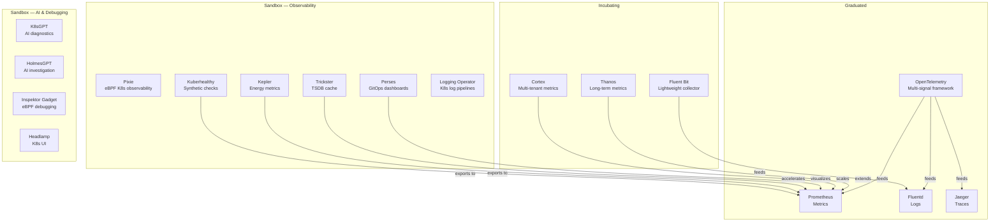

What CNCF observability projects exist in 2026, what maturity level are they at, and how do they fit together? This guide maps every CNCF project relevant to observability, monitoring, and debugging — from Graduated standards (Prometheus, OpenTelemetry) through Incubating workhorses (Thanos, Fluent Bit) to Sandbox innovators (Perses, Kepler, K8sGPT, HolmesGPT). Each project is classified by function with direct links to our deeper comparison articles.

> The CNCF landscape has 200+ projects. This guide covers only those relevant to observability, monitoring, logging, tracing, profiling, and Kubernetes operational intelligence.

### TL;DR — The CNCF Observability Stack at a Glance

| Signal / Function | Graduated | Incubating | Sandbox (notable) |
| :--- | :--- | :--- | :--- |
| **Metrics** | Prometheus | Thanos, Cortex | Kepler, Trickster, Kuberhealthy, Perses |
| **Logs** | Fluentd | Fluent Bit | — |
| **Traces** | Jaeger | — | Pixie |
| **Multi-signal framework** | OpenTelemetry | — | — |
| **Visualization** | — | — | Perses, Headlamp |
| **AI-assisted ops** | — | — | K8sGPT, HolmesGPT |
| **eBPF debugging** | — | — | Inspektor Gadget, Pixie |

> Jump to any category: [Metrics](#metrics) | [Logs](#logs) | [Traces](#traces) | [Multi-Signal](#multi-signal-framework) | [Visualization](#visualization--dashboards) | [AI Ops](#ai-assisted-operations) | [eBPF Debugging](#ebpf-debugging--introspection) | [Synthetic Monitoring](#synthetic-monitoring) | [Sustainability](#sustainability-metrics)

---

## Table of Contents

- [How to Read This Guide](#how-to-read-this-guide)
- [CNCF Maturity Levels](#cncf-maturity-levels)
- [Metrics](#metrics)
- [Logs](#logs)
- [Traces](#traces)
- [Multi-Signal Framework](#multi-signal-framework)
- [Visualization & Dashboards](#visualization--dashboards)
- [AI-Assisted Operations](#ai-assisted-operations)
- [eBPF Debugging & Introspection](#ebpf-debugging--introspection)
- [Synthetic Monitoring](#synthetic-monitoring)
- [Sustainability Metrics](#sustainability-metrics)
- [Kubernetes Management UI](#kubernetes-management-ui)
- [The Full Map](#the-full-map)
- [CNCF Observability Projects Not Covered in Our Comparison Articles](#cncf-observability-projects-not-covered-in-our-comparison-articles)
- [Non-CNCF Open-Source Observability Projects](#non-cncf-open-source-observability-projects-from-landscapecncfio)
- [How These Relate to Our Comparison Series](#how-these-relate-to-our-comparison-series)
- [FAQ](#faq)
- [References](#references)

---

## How to Read This Guide

This is a **map**, not a comparison. For head-to-head feature evaluation, query language comparison, and "When to Use What" tables, follow the links to our dedicated articles. This guide answers: "What exists in CNCF land, what maturity is it at, and where does it fit?"

---

## CNCF Maturity Levels

| Level | What it means | Examples |
| :--- | :--- | :--- |
| **Graduated** | Production-proven, widely adopted, strong governance, security-audited | Prometheus, Fluentd, Jaeger, OTel |
| **Incubating** | Growing adoption, active development, progressing toward graduation | Thanos, Cortex, Fluent Bit |
| **Sandbox** | Early-stage innovation, experimental, may not reach maturity | Pixie, Perses, Kepler, K8sGPT |

> **Sandbox caveat:** Sandbox projects are promising but carry adoption risk — smaller communities, potential for abandonment, and less battle-testing. Evaluate bus-factor before production use.

---

## Metrics

| Project | CNCF Level | License | What it does | GitHub |
| :--- | :--- | :--- | :--- | :--- |
| **[Prometheus](https://prometheus.io/)** | Graduated | Apache 2.0 | The metrics standard — scraping, PromQL, alerting, recording rules | ⭐ 56k+ |
| **[Thanos](https://thanos.io/)** | Incubating | Apache 2.0 | Long-term storage, global query view, deduplication for Prometheus | ⭐ 14k+ |
| **[Cortex](https://cortexmetrics.io/)** | Incubating | Apache 2.0 | Horizontally scalable, multi-tenant Prometheus (predecessor to Mimir) | ⭐ 5.9k |
| **[OpenMetrics](https://openmetrics.io/)** | Sandbox (archived spec) | Apache 2.0 | Standardized metrics exposition format (largely absorbed into OTel/Prometheus) | — |
| **[Trickster](https://github.com/trickstercache/trickster)** | Sandbox | Apache 2.0 | HTTP reverse proxy cache and dashboard accelerator for Prometheus/InfluxDB/ClickHouse TSDBs | ⭐ 2k+ |
| **[Kuberhealthy](https://github.com/kuberhealthy/kuberhealthy)** | Sandbox | Apache 2.0 | Kubernetes operator for synthetic health checks; exports Prometheus metrics | ⭐ 1.8k+ |
| **[Kepler](https://sustainable-computing.io/)** | Sandbox | Apache 2.0 | Prometheus exporter measuring energy/power consumption per container, pod, node using eBPF | ⭐ 1.4k+ |

> **Deep dive:** [Open-Source Metrics Tools Compared]() covers Prometheus, Thanos, Cortex, VictoriaMetrics, Mimir, and 25+ more tools.

---

## Logs

| Project | CNCF Level | License | What it does | GitHub |
| :--- | :--- | :--- | :--- | :--- |
| **[Fluentd](https://www.fluentd.org/)** | Graduated | Apache 2.0 | Unified logging layer — collect, transform, route logs to any backend | ⭐ 13k+ |
| **[Fluent Bit](https://fluentbit.io/)** | Incubating | Apache 2.0 | Lightweight log/metric/trace collector optimized for edge and Kubernetes (~15 MB) | ⭐ 6k+ |
| **[Logging Operator](https://github.com/kube-logging/logging-operator)** | Sandbox | Apache 2.0 | Kubernetes operator for managing Fluent Bit and Fluentd pipelines via CRDs | ⭐ 1.6k+ |

> **Deep dive:** [Open-Source Log Management Tools Compared]() covers Loki, VictoriaLogs, Parseable, OpenSearch, Fluent Bit, Fluentd, syslog-ng, and more.

---

## Traces

| Project | CNCF Level | License | What it does | GitHub |
| :--- | :--- | :--- | :--- | :--- |
| **[Jaeger](https://www.jaegertracing.io/)** | Graduated | Apache 2.0 | Distributed tracing backend with built-in UI, adaptive sampling, multiple storage backends | ⭐ 21k+ |
| **[Pixie](https://px.dev/)** | Sandbox | Apache 2.0 | eBPF-based Kubernetes observability — auto-captures traces, metrics, profiles without instrumentation; data stays in-cluster | ⭐ 5.6k+ |

> **Deep dive:** [Open-Source Distributed Tracing Tools Compared]() covers Jaeger v2, Grafana Tempo, Zipkin, and the full tracing ecosystem.

---

## Multi-Signal Framework

| Project | CNCF Level | License | What it does | GitHub |
| :--- | :--- | :--- | :--- | :--- |
| **[OpenTelemetry](https://opentelemetry.io/)** | Graduated | Apache 2.0 | Vendor-neutral telemetry framework — APIs, SDKs, Collector, auto-instrumentation for metrics, logs, traces, and profiles | ⭐ 30k+ (Collector) |

OpenTelemetry is not a backend — it's the collection/instrumentation layer that feeds data into backends (Prometheus, Jaeger, Loki, Tempo, etc.). It has absorbed OpenTracing, OpenCensus, and is standardizing the Profiles signal.

---

## Visualization & Dashboards

| Project | CNCF Level | License | What it does | GitHub |
| :--- | :--- | :--- | :--- | :--- |
| **[Perses](https://perses.dev/)** | Sandbox | Apache 2.0 | GitOps-native dashboards for Prometheus/Thanos — dashboards-as-code, CRDs, static validation, CNCF's answer to the visualization gap | ⭐ 1k+ |

> **Perses vs Grafana:** Perses is purpose-built for GitOps workflows (declarative YAML dashboards, schema validation, K8s CRDs). Grafana is far more feature-rich but AGPL-licensed with a less GitOps-native model. Perses is young but addresses a genuine gap in the CNCF vendor-neutral stack.

---

## AI-Assisted Operations

| Project | CNCF Level | License | What it does | GitHub |
| :--- | :--- | :--- | :--- | :--- |
| **[K8sGPT](https://k8sgpt.ai/)** | Sandbox | Apache 2.0 | AI-powered Kubernetes diagnostics — scans cluster state, uses LLMs to explain issues and suggest fixes | ⭐ 6k+ |
| **[HolmesGPT](https://github.com/HolmesGPT/holmesgpt)** | Sandbox | MIT | AI investigation agent for infrastructure — uses ReAct pattern to auto-diagnose alerts across Kubernetes, VMs, cloud | ⭐ 3k+ |

> **K8sGPT vs HolmesGPT:** K8sGPT scans Kubernetes resources and explains problems. HolmesGPT goes deeper — it receives an alert, then autonomously investigates using tools (kubectl, log queries, metrics) to find root cause. HolmesGPT works beyond Kubernetes (VMs, cloud services). K8sGPT is Kubernetes-only.

---

## eBPF Debugging & Introspection

| Project | CNCF Level | License | What it does | GitHub |
| :--- | :--- | :--- | :--- | :--- |
| **[Inspektor Gadget](https://inspektor-gadget.io/)** | Sandbox | Apache 2.0 | Framework for eBPF-based debugging and introspection on Kubernetes — packages eBPF programs as OCI images ("gadgets") for network, file, process, DNS inspection | ⭐ 2.3k+ |
| **[Pixie](https://px.dev/)** | Sandbox | Apache 2.0 | eBPF observability platform (also listed under Traces) — auto-captures protocol-level traces, flamegraphs, network metrics | ⭐ 5.6k+ |

> **Inspektor Gadget vs Pixie:** Pixie is an always-on observability platform (auto-captures everything). Inspektor Gadget is an on-demand debugging toolkit (run specific gadgets to investigate specific problems). Complementary, not competing.

---

## Synthetic Monitoring

| Project | CNCF Level | License | What it does | GitHub |
| :--- | :--- | :--- | :--- | :--- |
| **[Kuberhealthy](https://github.com/kuberhealthy/kuberhealthy)** | Sandbox | Apache 2.0 | Runs synthetic checks as Kubernetes pods on configurable intervals; exports pass/fail to Prometheus; extensible via custom check containers | ⭐ 1.8k+ |

> Think of Kuberhealthy as a Kubernetes-native equivalent to Pingdom/Synthetics — but for internal cluster health checks (DNS resolution works? PVCs bind? Deployments scale? Custom business logic passes?).

---

## Sustainability Metrics

| Project | CNCF Level | License | What it does | GitHub |
| :--- | :--- | :--- | :--- | :--- |
| **[Kepler](https://sustainable-computing.io/)** | Sandbox | Apache 2.0 | Uses eBPF and hardware sensors to measure energy consumption per container/pod/node; exports as Prometheus metrics for carbon-aware scheduling | ⭐ 1.4k+ |

> Kepler enables green observability — understand which workloads consume the most power and optimize scheduling accordingly.

---

## Kubernetes Management UI

| Project | CNCF Level | License | What it does | GitHub |
| :--- | :--- | :--- | :--- | :--- |
| **[Headlamp](https://headlamp.dev/)** | Sandbox | Apache 2.0 | Extensible Kubernetes web UI — browse resources, view logs, manage workloads; plugin system for custom views; official replacement for Kubernetes Dashboard | ⭐ 2.6k+ |

> **Note:** Headlamp is a Kubernetes management UI, not an observability platform. Included here because it's often discovered alongside observability tools and provides log viewing and resource inspection capabilities.

---

## The Full Map

---

## CNCF Observability Projects Not Covered in Our Comparison Articles

These CNCF-hosted projects belong to the observability domain but don't fit neatly into our metrics/logs/traces/profiling comparison articles — they serve adjacent functions like service mesh observability, chaos engineering, network visibility, or AI-assisted operations.

| Project | GitHub | License | CNCF Level | First Commit | Stars | Contributors | Last Active | What it does |
| :--- | :--- | :--- | :--- | :--- | ---: | ---: | :--- | :--- |
| **[Pixie](https://px.dev/)** | [pixie-io/pixie](https://github.com/pixie-io/pixie) | Apache 2.0 | Sandbox | 2020 | ~5.6k | 100+ | 2026 | eBPF Kubernetes observability — auto-captures traces, metrics, profiles without instrumentation; data stays in-cluster |
| **[Perses](https://perses.dev/)** | [perses/perses](https://github.com/perses/perses) | Apache 2.0 | Sandbox | 2021 | ~1.2k | 30+ | 2026 | GitOps-native dashboards — dashboards-as-code, Kubernetes CRDs, schema validation; CNCF's visualization standard |
| **[Kepler](https://sustainable-computing.io/)** | [sustainable-computing-io/kepler](https://github.com/sustainable-computing-io/kepler) | Apache 2.0 | Sandbox | 2022 | ~1.4k | 80+ | 2026 | Energy consumption Prometheus exporter — uses eBPF + hardware sensors for per-container/pod power metrics |
| **[K8sGPT](https://k8sgpt.ai/)** | [k8sgpt-ai/k8sgpt](https://github.com/k8sgpt-ai/k8sgpt) | Apache 2.0 | Sandbox | 2023 | ~6k | 80+ | 2026 | AI-powered Kubernetes diagnostics — scans cluster state, uses LLMs to explain issues and suggest fixes |
| **[HolmesGPT](https://github.com/HolmesGPT/holmesgpt)** | [HolmesGPT/holmesgpt](https://github.com/HolmesGPT/holmesgpt) | MIT | Sandbox | 2024 | ~3k | 30+ | 2026 | AI investigation agent — uses ReAct pattern to auto-diagnose alerts across K8s, VMs, and cloud |
| **[Inspektor Gadget](https://inspektor-gadget.io/)** | [inspektor-gadget/inspektor-gadget](https://github.com/inspektor-gadget/inspektor-gadget) | Apache 2.0 | Sandbox | 2019 | ~2.3k | 60+ | 2026 | eBPF debugging framework for Kubernetes — packages eBPF programs as OCI "gadgets" for network/process/DNS inspection |
| **[Kuberhealthy](https://github.com/kuberhealthy/kuberhealthy)** | [kuberhealthy/kuberhealthy](https://github.com/kuberhealthy/kuberhealthy) | Apache 2.0 | Sandbox | 2018 | ~1.8k | 60+ | 2026 | Synthetic health checks operator — runs checks as pods, exports pass/fail to Prometheus |
| **[Trickster](https://github.com/trickstercache/trickster)** | [trickstercache/trickster](https://github.com/trickstercache/trickster) | Apache 2.0 | Sandbox | 2018 | ~2k | 30+ | 2026 | HTTP reverse proxy cache and dashboard accelerator for Prometheus/InfluxDB/ClickHouse TSDBs |
| **[Headlamp](https://headlamp.dev/)** | [kubernetes-sigs/headlamp](https://github.com/kubernetes-sigs/headlamp) | Apache 2.0 | Sandbox | 2020 | ~2.6k | 80+ | 2026 | Extensible Kubernetes web UI — browse resources, view logs, plugin system; official K8s Dashboard successor |
| **[Kiali](https://kiali.io/)** | [kiali/kiali](https://github.com/kiali/kiali) | Apache 2.0 | — (Istio ecosystem) | 2018 | ~3.8k | 80+ | 2026 | Service mesh observability console for Istio — topology, traffic, health, tracing integration |
| **[Cilium Hubble](https://github.com/cilium/hubble)** | [cilium/hubble](https://github.com/cilium/hubble) | Apache 2.0 | — (part of Cilium, Graduated) | 2019 | ~3.6k | 50+ | 2026 | eBPF network-flow observability for Kubernetes — L3/L4/L7 visibility, service maps, DNS monitoring |
| **[Litmus](https://litmuschaos.io/)** | [litmuschaos/litmus](https://github.com/litmuschaos/litmus) | Apache 2.0 | Incubating | 2018 | ~4.5k | 200+ | 2026 | Chaos engineering platform — inject failures to test observability and resilience |
| **[Chaos Mesh](https://chaos-mesh.org/)** | [chaos-mesh/chaos-mesh](https://github.com/chaos-mesh/chaos-mesh) | Apache 2.0 | Incubating | 2020 | ~6.9k | 150+ | 2026 | Kubernetes-native chaos engineering — pod/network/IO/time faults; useful for testing observability pipelines |
| **[OpenCost](https://opencost.io/)** | [opencost/opencost](https://github.com/opencost/opencost) | Apache 2.0 | Sandbox | 2022 | ~5.3k | 80+ | 2026 | Kubernetes cost monitoring — real-time cost allocation per namespace, deployment, pod |
| **[OpenFeature](https://openfeature.dev/)** | [open-feature/spec](https://github.com/open-feature/spec) | Apache 2.0 | Incubating | 2022 | ~800+ | 50+ | 2026 | Vendor-neutral feature flag standard — relevant for observability via flag-aware metrics/traces |

---

## Non-CNCF Open-Source Observability Projects (from landscape.cncf.io)

These appear in the CNCF landscape's "Observability and Analysis" category but are **not CNCF-hosted projects** — they're independent open-source tools maintained by companies or communities. All have GitHub repositories and are free to self-host.

### Metrics & Monitoring

| Project | GitHub | License | Stars | Contributors | First Commit | What it does |
| :--- | :--- | :--- | ---: | ---: | :--- | :--- |
| **[VictoriaMetrics](https://victoriametrics.com/)** | [VictoriaMetrics/VictoriaMetrics](https://github.com/VictoriaMetrics/VictoriaMetrics) | Apache 2.0 | ~17.6k | 400+ | 2018 | Prometheus-compatible TSDB — single-node and cluster; MetricsQL superset |
| **[Grafana Mimir](https://grafana.com/oss/mimir/)** | [grafana/mimir](https://github.com/grafana/mimir) | AGPL v3 | ~5.2k | 450+ | 2022 | Horizontally-scalable, multi-tenant Prometheus backend on object storage |
| **[Netdata](https://netdata.cloud/)** | [netdata/netdata](https://github.com/netdata/netdata) | GPL v3 | ~73k | 600+ | 2013 | Real-time per-second infrastructure monitoring — zero-config agent |
| **[Zabbix](https://www.zabbix.com/)** | [zabbix/zabbix](https://github.com/zabbix/zabbix) | GPL v2 | ~5k | 100+ | 2001 | Enterprise infrastructure monitoring — agent, SNMP, auto-discovery, alerting |
| **[Nagios Core](https://www.nagios.org/)** | [NagiosEnterprises/nagioscore](https://github.com/NagiosEnterprises/nagioscore) | GPL v2 | ~1.6k | 50+ | 1999 | Traditional availability monitoring with plugin ecosystem |
| **[Checkmk](https://checkmk.com/)** | [Checkmk/checkmk](https://github.com/Checkmk/checkmk) | GPL v2 | ~1.6k | 100+ | 2014 | Infrastructure monitoring — agent and SNMP, auto-discovery |
| **[Icinga](https://icinga.com/)** | [Icinga/icinga2](https://github.com/Icinga/icinga2) | GPL v2 | ~2k | 100+ | 2012 | Modern Nagios successor — distributed monitoring, REST API |
| **[Centreon](https://www.centreon.com/)** | [centreon/centreon](https://github.com/centreon/centreon) | Apache 2.0 | ~700+ | 80+ | 2015 | IT infrastructure monitoring (Nagios heritage) |
| **[Sensu](https://sensu.io/)** | [sensu/sensu-go](https://github.com/sensu/sensu-go) | MIT (core) | ~1k | 50+ | 2017 | Multi-cloud monitoring — checks, metrics, events pipeline |
| **[Graphite](https://graphiteapp.org/)** | [graphite-project/graphite-web](https://github.com/graphite-project/graphite-web) | Apache 2.0 | ~5.9k | 200+ | 2008 | Push-based time-series graphing — Whisper storage + render API |
| **[M3](https://m3db.io/)** | [m3db/m3](https://github.com/m3db/m3) | Apache 2.0 | ~4.9k | 110+ | 2017 | Distributed TSDB from Uber — extreme scale |
| **[InfluxDB](https://influxdata.com/)** | [influxdata/influxdb](https://github.com/influxdata/influxdb) | MIT / Apache 2.0 | ~31.7k | 530+ | 2013 | General-purpose time-series database — SQL, line protocol |
| **[QuestDB](https://questdb.io/)** | [questdb/questdb](https://github.com/questdb/questdb) | Apache 2.0 | ~14.9k | 100+ | 2014 | High-throughput column-oriented TSDB — SQL via PG wire |
| **[TDengine](https://tdengine.com/)** | [taosdata/TDengine](https://github.com/taosdata/TDengine) | AGPL v3 | ~24.1k | 200+ | 2019 | IoT/industrial time-series database — SQL dialect |
| **[GreptimeDB](https://greptime.com/)** | [GreptimeTeam/greptimedb](https://github.com/GreptimeTeam/greptimedb) | Apache 2.0 | ~5.2k | 100+ | 2022 | Unified TSDB — PromQL + SQL, object-storage-native |
| **[Micrometer](https://micrometer.io/)** | [micrometer-metrics/micrometer](https://github.com/micrometer-metrics/micrometer) | Apache 2.0 | ~4.5k | 300+ | 2017 | JVM metrics instrumentation — vendor-neutral facade |

### Logs

| Project | GitHub | License | Stars | Contributors | First Commit | What it does |
| :--- | :--- | :--- | ---: | ---: | ---: | :--- |
| **[Grafana Loki](https://grafana.com/oss/loki/)** | [grafana/loki](https://github.com/grafana/loki) | AGPL v3 | ~25k | 800+ | 2018 | Label-indexed log aggregation — LogQL, object storage backend |
| **[VictoriaLogs](https://victoriametrics.com/products/victorialogs/)** | [VictoriaMetrics/VictoriaMetrics](https://github.com/VictoriaMetrics/VictoriaMetrics) | Apache 2.0 | ~17.6k | 400+ | 2023 (VL) | Single-binary log database — LogsQL, columnar, high compression |
| **[OpenSearch](https://opensearch.org/)** | [opensearch-project/OpenSearch](https://github.com/opensearch-project/OpenSearch) | Apache 2.0 | ~10k | 400+ | 2021 | Distributed search/analytics — forked from Elasticsearch 7.10 |
| **[Elasticsearch](https://elastic.co/elasticsearch)** | [elastic/elasticsearch](https://github.com/elastic/elasticsearch) | AGPL v3 / ELv2 | ~71k | 2000+ | 2010 | Full-text search and analytics engine |
| **[Graylog](https://graylog.org/)** | [Graylog2/graylog2-server](https://github.com/Graylog2/graylog2-server) | Source-available | ~7.5k | 200+ | 2010 | Log management platform with built-in UI |
| **[Vector](https://vector.dev/)** | [vectordotdev/vector](https://github.com/vectordotdev/vector) | MPL 2.0 | ~18.5k | 400+ | 2019 | High-performance observability data pipeline (logs, metrics, traces) |
| **[Logstash](https://elastic.co/logstash)** | [elastic/logstash](https://github.com/elastic/logstash) | Dual (Apache 2.0 / ELv2) | ~14.3k | 500+ | 2009 | Log processing pipeline — grok, multi-output |
| **[syslog-ng](https://www.syslog-ng.com/)** | [syslog-ng/syslog-ng](https://github.com/syslog-ng/syslog-ng) | LGPL / GPL | ~2.3k | 100+ | 1998 | Enterprise syslog daemon with parsing, routing, enrichment |
| **[rsyslog](https://www.rsyslog.com/)** | [rsyslog/rsyslog](https://github.com/rsyslog/rsyslog) | GPL v3 / Apache 2.0 | ~2.1k | 80+ | 2004 | High-throughput syslog processing |
| **[Parseable](https://parseable.com/)** | [parseablehq/parseable](https://github.com/parseablehq/parseable) | AGPL v3 | ~4k | 50+ | 2022 | Rust log database — SQL, Parquet on object storage |
| **[CLP](https://yscope.com/clp)** | [y-scope/clp](https://github.com/y-scope/clp) | Apache 2.0 | ~2k | 30+ | 2021 | Compression-optimized log search — extreme ratios |
| **[ZincSearch](https://zincsearch.com/)** | [zincsearch/zincsearch](https://github.com/zincsearch/zincsearch) | Apache 2.0 | ~17k | 70+ | 2021 | Lightweight Elasticsearch alternative — single binary |

### Traces & APM

| Project | GitHub | License | Stars | Contributors | First Commit | What it does |
| :--- | :--- | :--- | ---: | ---: | ---: | :--- |
| **[Grafana Tempo](https://grafana.com/oss/tempo/)** | [grafana/tempo](https://github.com/grafana/tempo) | AGPL v3 | ~4.2k | 300+ | 2020 | Object-storage-native trace backend — TraceQL |
| **[Zipkin](https://zipkin.io/)** | [openzipkin/zipkin](https://github.com/openzipkin/zipkin) | Apache 2.0 | ~17.2k | 150+ | 2012 | Simplest distributed tracing backend — single JAR |
| **[Apache SkyWalking](https://skywalking.apache.org/)** | [apache/skywalking](https://github.com/apache/skywalking) | Apache 2.0 | ~24k | 500+ | 2015 | APM-first observability — service topology, profiling, logs |
| **[Odigos](https://odigos.io/)** | [odigos-io/odigos](https://github.com/odigos-io/odigos) | Apache 2.0 | ~3.4k | 50+ | 2022 | Zero-code distributed tracing via eBPF + language agents |
| **[DeepFlow](https://deepflow.io/)** | [deepflowio/deepflow](https://github.com/deepflowio/deepflow) | Apache 2.0 | ~3.5k | 50+ | 2022 | eBPF full-stack observability — auto-tracing without instrumentation |
| **[Pinpoint](https://pinpoint-apm.github.io/)** | [pinpoint-apm/pinpoint](https://github.com/pinpoint-apm/pinpoint) | Apache 2.0 | ~13.6k | 200+ | 2014 | Java/PHP APM with distributed tracing and code-level visibility |
| **[SigNoz](https://signoz.io/)** | [SigNoz/signoz](https://github.com/SigNoz/signoz) | MIT (core) | ~20k | 200+ | 2021 | Unified observability (logs+metrics+traces) on ClickHouse |
| **[OpenObserve](https://openobserve.ai/)** | [openobserve/openobserve](https://github.com/openobserve/openobserve) | AGPL v3 | ~14k | 100+ | 2023 | Rust-based unified observability — object storage |
| **[ClickStack](https://clickhouse.com/clickstack)** | [ClickHouse/ClickStack](https://github.com/ClickHouse/ClickStack) | Apache 2.0 | ~22k | 100+ | 2023 | ClickHouse-native observability (HyperDX) |
| **[Uptrace](https://uptrace.dev/)** | [uptrace/uptrace](https://github.com/uptrace/uptrace) | AGPL v3 | ~4k | 20+ | 2021 | Lightweight OTel APM on ClickHouse |
| **[Highlight.io](https://highlight.io/)** | [highlight/highlight](https://github.com/highlight/highlight) | Apache 2.0 | ~8k | 80+ | 2021 | Session replay + error monitoring + OTel backend |

### Profiling

| Project | GitHub | License | Stars | Contributors | First Commit | What it does |
| :--- | :--- | :--- | ---: | ---: | ---: | :--- |
| **[Grafana Pyroscope](https://grafana.com/oss/pyroscope/)** | [grafana/pyroscope](https://github.com/grafana/pyroscope) | AGPL v3 | ~10k | 200+ | 2020 | Continuous profiling platform — multi-language, scalable |
| **[Parca](https://parca.dev/)** | [parca-dev/parca](https://github.com/parca-dev/parca) | Apache 2.0 | ~4k | 60+ | 2021 | eBPF-first continuous profiling — columnar storage |
| **[Yandex Perforator](https://github.com/yandex/perforator)** | [yandex/perforator](https://github.com/yandex/perforator) | Apache 2.0 | ~800+ | 20+ | 2024 | Large-fleet eBPF profiling for C/C++/Go/Rust |
| **[Intel gProfiler](https://github.com/intel/gprofiler)** | [intel/gprofiler](https://github.com/intel/gprofiler) | Apache 2.0 | ~750+ | 20+ | 2021 | Multi-runtime profiling agent (Java, Python, Go, native) |

### Dashboards, Visualization & Alerting

| Project | GitHub | License | Stars | Contributors | First Commit | What it does |
| :--- | :--- | :--- | ---: | ---: | ---: | :--- |
| **[Grafana](https://grafana.com/oss/grafana/)** | [grafana/grafana](https://github.com/grafana/grafana) | AGPL v3 | ~66k | 3,800+ | 2013 | De facto visualization for Prometheus/Loki/Tempo — dashboards, explore, alerting |
| **[Kibana](https://elastic.co/kibana)** | [elastic/kibana](https://github.com/elastic/kibana) | AGPL v3 / ELv2 | ~20k | 1,000+ | 2013 | Elasticsearch visualization — Lens, Discover, Maps |
| **[OpenSearch Dashboards](https://opensearch.org/)** | [opensearch-project/OpenSearch-Dashboards](https://github.com/opensearch-project/OpenSearch-Dashboards) | Apache 2.0 | ~1.7k | 200+ | 2021 | OpenSearch visualization — forked from Kibana 7.10 |
| **[Grafana Alloy](https://grafana.com/oss/alloy/)** | [grafana/alloy](https://github.com/grafana/alloy) | Apache 2.0 | ~1.5k | 200+ | 2024 | Telemetry collector (successor to Grafana Agent) — metrics, logs, traces, profiles |
| **[Sentry](https://sentry.io/)** | [getsentry/sentry](https://github.com/getsentry/sentry) | FSL / BSL | ~40k | 800+ | 2008 | Error tracking + performance monitoring + session replay |
| **[GoAccess](https://goaccess.io/)** | [allinurl/goaccess](https://github.com/allinurl/goaccess) | MIT | ~19k | 100+ | 2010 | Real-time web log analytics — terminal and HTML |
| **[Prometheus Alertmanager](https://prometheus.io/docs/alerting/)** | [prometheus/alertmanager](https://github.com/prometheus/alertmanager) | Apache 2.0 | ~8.6k | 410+ | 2013 | Alert routing, grouping, deduplication, notification |
| **[Keep](https://keephq.dev/)** | [keephq/keep](https://github.com/keephq/keep) | MIT | ~8k | 100+ | 2023 | Open-source alert management — correlate, deduplicate, automate across tools |
| **[Coroot](https://coroot.com/)** | [coroot/coroot](https://github.com/coroot/coroot) | Apache 2.0 | ~4k | 20+ | 2022 | eBPF auto-discovery observability — zero-code, service maps, SLOs |
| **[Groundcover](https://groundcover.com/)** | [groundcover-com/caretta](https://github.com/groundcover-com/caretta) | Apache 2.0 | ~1.8k | 10+ | 2022 | eBPF Kubernetes network topology map (Caretta) |

### Collection Agents & Pipelines

| Project | GitHub | License | Stars | Contributors | First Commit | What it does |
| :--- | :--- | :--- | ---: | ---: | ---: | :--- |
| **[Telegraf](https://influxdata.com/telegraf/)** | [influxdata/telegraf](https://github.com/influxdata/telegraf) | MIT | ~15k | 1,400+ | 2015 | Plugin-based metric collector — 300+ plugins, multi-output |
| **[Beats (Filebeat/Metricbeat)](https://elastic.co/beats)** | [elastic/beats](https://github.com/elastic/beats) | Dual (Apache 2.0 / ELv2) | ~12.3k | 600+ | 2014 | Lightweight shippers for logs, metrics, network data |
| **[Grafana Beyla](https://grafana.com/oss/beyla/)** | [grafana/beyla](https://github.com/grafana/beyla) | Apache 2.0 | ~1.5k | 40+ | 2023 | eBPF auto-instrumentation for HTTP/gRPC metrics and traces |
| **[collectd](https://collectd.org/)** | [collectd/collectd](https://github.com/collectd/collectd) | MIT / GPL | ~3.1k | 200+ | 2005 | Lightweight system metrics daemon — 100+ plugins |
| **[StatsD](https://github.com/statsd/statsd)** | [statsd/statsd](https://github.com/statsd/statsd) | MIT | ~17.6k | 150+ | 2010 | Application metric aggregation over UDP |
| **[Loggie](https://github.com/loggie-io/loggie)** | [loggie-io/loggie](https://github.com/loggie-io/loggie) | Apache 2.0 | ~1.3k | 30+ | 2021 | Cloud-native log collection agent — Kubernetes-native |

---

## How These Relate to Our Comparison Series

| Our article | CNCF projects covered | Other (non-CNCF) tools also compared |
| :--- | :--- | :--- |
| [Observability Platforms Compared (Part 1)]() | — (platforms are independent of CNCF) | SigNoz, OpenObserve, ClickStack, Parseable, Grafana LGTM, etc. |
| [Observability Benchmark (Part 2)]() | — | Same platforms, benchmarked |
| [Metrics Tools Compared]() | Prometheus, Thanos, Cortex | VictoriaMetrics, Mimir, M3, InfluxDB, Zabbix, Netdata |
| [Log Management Tools Compared]() | Fluentd, Fluent Bit, Logging Operator | Loki, VictoriaLogs, Parseable, OpenSearch, syslog-ng |
| [Distributed Tracing Tools Compared]() | Jaeger, OpenTelemetry | Grafana Tempo, Zipkin, Pixie |
| [Continuous Profiling Tools Compared]() | — | Pyroscope, Parca, Perforator, gProfiler |
| **This article** | All CNCF observability projects | — |

---

## FAQ

**What is the CNCF?**
The [Cloud Native Computing Foundation](https://www.cncf.io/) hosts open-source projects that enable cloud-native computing. Projects progress through Sandbox → Incubating → Graduated maturity levels based on adoption, governance, and security posture.

**Should I only use CNCF projects for observability?**
No. Many excellent observability tools are not CNCF projects (VictoriaMetrics, Grafana Loki/Mimir/Tempo, Parseable, OpenObserve). CNCF projects benefit from vendor-neutral governance but that doesn't make them technically superior. Choose based on fit, not badge.

**What's the difference between Graduated and Sandbox?**
Graduated projects (Prometheus, Jaeger, OTel) are production-proven with large communities, security audits, and stable APIs. Sandbox projects are experiments that may not reach maturity — evaluate community health and bus-factor before adopting.

**Is Grafana a CNCF project?**
No. Grafana (the visualization tool) and its backends (Loki, Mimir, Tempo, Pyroscope) are developed by Grafana Labs under AGPL. They integrate deeply with CNCF projects but are not CNCF-hosted.

**Where does VictoriaMetrics fit?**
VictoriaMetrics is not a CNCF project — it's an independent Apache 2.0 project. It's Prometheus-compatible and often compared with Thanos/Cortex/Mimir but operates outside CNCF governance.

**What is Perses and should I use it instead of Grafana?**
Perses is a CNCF Sandbox project for GitOps-native dashboards — dashboards-as-code with schema validation and Kubernetes CRDs. It's much simpler than Grafana but also much less feature-rich. Use Perses if you specifically need declarative, validated, version-controlled dashboards at scale and want to avoid AGPL. Otherwise, Grafana remains the pragmatic choice.

---

## References

### CNCF Project Pages
- [CNCF Projects (Graduated + Incubating)](https://www.cncf.io/projects/)
- [CNCF Sandbox Projects](https://www.cncf.io/sandbox-projects/)
- [CNCF Landscape](https://landscape.cncf.io/)

### Individual Projects
- [Prometheus](https://prometheus.io/) | [Thanos](https://thanos.io/) | [Cortex](https://cortexmetrics.io/)
- [Fluentd](https://www.fluentd.org/) | [Fluent Bit](https://fluentbit.io/) | [Logging Operator](https://github.com/kube-logging/logging-operator)
- [Jaeger](https://www.jaegertracing.io/) | [OpenTelemetry](https://opentelemetry.io/)
- [Pixie](https://px.dev/) | [Inspektor Gadget](https://inspektor-gadget.io/)
- [Perses](https://perses.dev/) | [Headlamp](https://headlamp.dev/)
- [Kepler](https://sustainable-computing.io/) | [Kuberhealthy](https://github.com/kuberhealthy/kuberhealthy)
- [K8sGPT](https://k8sgpt.ai/) | [HolmesGPT](https://github.com/HolmesGPT/holmesgpt)
- [Trickster](https://github.com/trickstercache/trickster)

### Related Articles in This Series
- [Open-Source Observability Platforms Compared (Part 1)]()
- [Benchmarking Open-Source Observability (Part 2)]()
- [Open-Source Metrics Tools Compared]()
- [Open-Source Log Management Tools Compared]()
- [Open-Source Distributed Tracing Tools Compared]()
- [Open-Source Continuous Profiling Tools Compared]()

---

*Last verified: October 2026. CNCF maturity levels, project status, and features change — always check [cncf.io/projects](https://www.cncf.io/projects/) for current status.*
