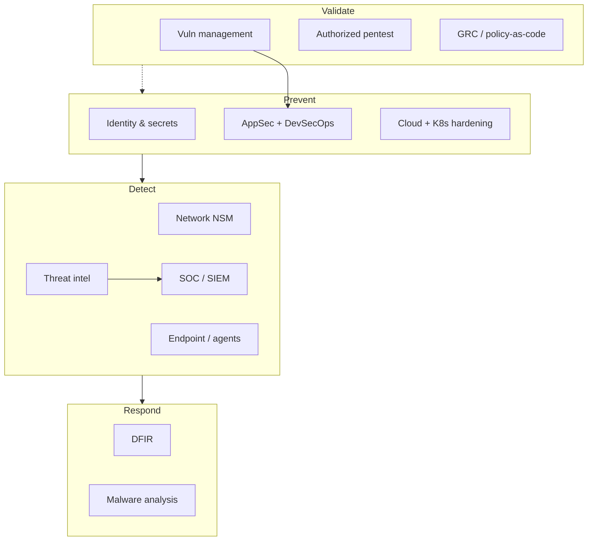
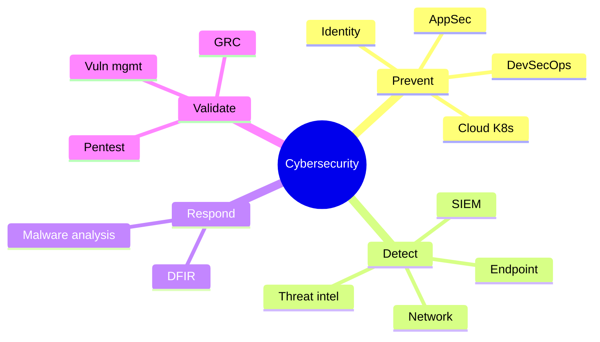

Cybersecurity is not one job — it is a set of **specialties** that protect different layers (network, code, cloud, identity, people). This guide names the main branches, explains each in a few sentences, and lists **popular open-source tools** teams actually use. Use it as a career map, a lab shopping list, or a way to see how tools fit together.

> **Scope & ethics:** This is a **defensive / educational landscape**. Offensive tools appear only as high-level names used in *authorized* testing. Do not scan, exploit, or collect data on systems you do not own or have written permission to assess. DRM bypass, credential theft, and unauthorized access are out of scope.

## TL;DR — Branch → starter OSS stack

| Branch | One-line job | Starter open-source stack |
| ------ | ------------ | ------------------------- |
| **Network security / NSM** | Watch and block bad traffic | Suricata, Zeek, Wireshark, Arkime |
| **Endpoint / XDR-style** | Protect laptops & servers | Wazuh, osquery, Falco (containers) |
| **SOC / SIEM** | Collect logs, detect, investigate | Wazuh, Security Onion, OpenSearch, Sigma |
| **AppSec** | Find bugs in apps before attackers | Semgrep, OWASP ZAP, Trivy, Gitleaks |
| **Cloud security** | Harden AWS/Azure/GCP configs | Prowler, ScoutSuite, Checkov, CloudQuery |
| **Container / K8s** | Secure images & clusters | Trivy, Falco, Kyverno, kube-bench |
| **Identity & secrets** | Who can access what; no leaked keys | Keycloak, Vault, Gitleaks, authentik |
| **Vulnerability management** | Find & prioritize known CVEs | OpenVAS/GVM, Nuclei, Trivy, Grype |
| **Threat intelligence** | Share & enrich IOCs | MISP, OpenCTI, AbuseHelper-class feeds |
| **DFIR** | Investigate incidents & evidence | Velociraptor, Volatility, Autopsy, TheHive |
| **Malware analysis** | Understand malicious code | YARA, Cuckoo (lab), capa, FLOSS |
| **Pentest (authorized)** | Prove defenses under permission | Nmap, OWASP ZAP, Nuclei, BloodHound\* |
| **DevSecOps / supply chain** | Bake security into CI/CD | Semgrep, Trivy, Cosign, Syft/Grype, Gitleaks |
| **Email / messaging** | Stop phishing & spoofing | rspamd, OpenDKIM, Mailcow stack pieces |
| **GRC / policy-as-code** | Prove controls continuously | OpenSCAP, InSpec, OPA/Gatekeeper |

\*BloodHound and similar AD path tools: **lab / authorized enterprise assessments only**.

## Table of Contents

- [TL;DR — Branch → starter OSS stack](#tldr--branch--starter-oss-stack)
- [How the branches fit together](#how-the-branches-fit-together)
- [1. Network security & NSM](#1-network-security--nsm)
- [2. Endpoint security](#2-endpoint-security)
- [3. SOC, SIEM & detection engineering](#3-soc-siem--detection-engineering)
- [4. Application security (AppSec)](#4-application-security-appsec)
- [5. Cloud security](#5-cloud-security)
- [6. Container & Kubernetes security](#6-container--kubernetes-security)
- [7. Identity, access & secrets](#7-identity-access--secrets)
- [8. Vulnerability management](#8-vulnerability-management)
- [9. Threat intelligence](#9-threat-intelligence)
- [10. DFIR — digital forensics & incident response](#10-dfir--digital-forensics--incident-response)
- [11. Malware analysis](#11-malware-analysis)
- [12. Penetration testing & red team (authorized)](#12-penetration-testing--red-team-authorized)
- [13. DevSecOps & software supply chain](#13-devsecops--software-supply-chain)
- [14. Email & anti-phishing](#14-email--anti-phishing)
- [15. GRC & continuous compliance](#15-grc--continuous-compliance)
- [Picking a learning path](#picking-a-learning-path)
- [FAQ](#faq)
- [References](#references)

## How the branches fit together

Think in a loop: **prevent → detect → respond → improve**. Most real jobs sit primarily in one box but touch neighbors daily.

---

## 1. Network security & NSM

**What it is:** Protect traffic as it moves across LANs, WANs, and the internet edge. Includes firewalls, intrusion detection/prevention (IDS/IPS), network security monitoring (NSM), and packet analysis. Goal: see malicious or anomalous communication early.

**Open-source tools**

| Tool | Role |
| ---- | ---- |
| [Suricata](https://suricata.io/) | IDS/IPS + NSM engine (signatures + protocols) |
| [Zeek](https://zeek.org/) | Network analysis framework (rich logs, not just alerts) |
| [Snort](https://www.snort.org/) | Classic signature IDS (still widely referenced) |
| [Wireshark](https://www.wireshark.org/) | Interactive packet capture & decode |
| [tcpdump](https://www.tcpdump.org/) | CLI packet capture |
| [Arkime](https://arkime.com/) (formerly Moloch) | Full-packet capture index & search |
| [ntopng](https://www.ntop.org/) | Traffic visibility / flows |

**Pair with:** a SIEM (Wazuh/OpenSearch) to store Zeek/Suricata alerts long-term.

---

## 2. Endpoint security

**What it is:** Secure the devices where work happens — laptops, servers, VMs. Covers antivirus/EDR-like visibility, host IDS, file integrity monitoring (FIM), configuration assessment, and sometimes automated response.

**Open-source tools**

| Tool | Role |
| ---- | ---- |
| [Wazuh](https://wazuh.com/) | Agents + manager: HIDS, FIM, vulns, XDR/SIEM-style platform |
| [osquery](https://osquery.io/) | SQL-query your OS state (processes, users, listening ports) |
| [OSSEC](https://www.ossec.net/) | Classic HIDS (Wazuh forked from this lineage) |
| [Falco](https://falco.org/) | Runtime threat detection (especially containers/hosts via syscalls) |
| [auditd](https://github.com/linux-audit/audit-userspace) (Linux) | Kernel audit trail (building block, not a full EDR) |

**Mental model:** Endpoint tools answer “what is running / changing on this machine right now?”

---

## 3. SOC, SIEM & detection engineering

**What it is:** The Security Operations Center aggregates signals, writes detections, triages alerts, and coordinates response. A SIEM (Security Information and Event Management) is the log brain; detection engineers turn threat knowledge into queries/rules (Sigma, Suricata, YARA).

**Open-source tools**

| Tool | Role |
| ---- | ---- |
| [Wazuh](https://github.com/wazuh/wazuh) | Open XDR/SIEM platform (agents + rules + dashboards) |
| [Security Onion](https://securityonionsolutions.com/) | Batteries-included NSM/SOC distro |
| [OpenSearch](https://opensearch.org/) + Dashboards | Search & viz backend many stacks use |
| [Graylog](https://graylog.org/) | Log management & alerting |
| [Sigma](https://github.com/SigmaHQ/sigma) | Portable detection rules (translate to SIEM queries) |
| [Fluent Bit](https://fluentbit.io/) / [Vector](https://vector.dev/) | Lightweight log shippers |
| [TheHive](https://github.com/TheHive-Project/TheHive) | Incident/case management (check current license/edition) |
| [Cortex](https://github.com/TheHive-Project/Cortex) | Analyzers/responders beside TheHive |

**Mental model:** SOC is where network + endpoint + cloud alerts become **tickets and decisions**.

---

## 4. Application security (AppSec)

**What it is:** Make software safer before and after release. Includes secure design reviews, SAST (static code analysis), DAST (testing running apps), SCA (dependency CVEs), secrets scanning, and threat modeling.

**Open-source tools**

| Tool | Role |
| ---- | ---- |
| [Semgrep](https://semgrep.dev/) | Fast SAST / pattern-based code analysis |
| [OWASP ZAP](https://www.zaproxy.org/) | Leading open DAST / web proxy scanner |
| [Trivy](https://trivy.dev/) | Vulns in deps, images, IaC, filesystems |
| [Gitleaks](https://github.com/gitleaks/gitleaks) | Secrets in git history & repos |
| [Bandit](https://bandit.readthedocs.io/) | Python-focused SAST |
| [Brakeman](https://brakemanscanner.org/) | Rails SAST |
| [Nuclei](https://github.com/projectdiscovery/nuclei) | Template-based vulnerability checks (authorized targets) |
| [OWASP ASVS / Cheat Sheet Series](https://owasp.org/) | Standards & guidance (not scanners) |

**Mental model:** AppSec shifts risk **left** — cheaper to fix in PR than in production incident.

---

## 5. Cloud security

**What it is:** Secure cloud accounts and services (IAM policies, storage exposure, logging, network segmentation, workload identity). Often split into CSPM (posture), CWPP (workloads), and CIEM (cloud entitlements).

**Open-source tools**

| Tool | Role |
| ---- | ---- |
| [Prowler](https://github.com/prowler-cloud/prowler) | Multi-cloud security assessments |
| [ScoutSuite](https://github.com/nccgroup/ScoutSuite) | Multi-cloud auditing |
| [Checkov](https://www.checkov.io/) | IaC misconfig scanning (Terraform, K8s, etc.) |
| [tfsec](https://github.com/aquasecurity/tfsec) / [Trivy config](https://trivy.dev/) | Terraform / config scanners |
| [CloudQuery](https://www.cloudquery.io/) | Cloud asset inventory as SQL/data |
| [Steampipe](https://steampipe.io/) | SQL across cloud APIs |
| Wazuh cloud modules | Pull/monitor cloud provider security data |

**Mental model:** Cloud security is mostly **identity + configuration**, not “install antivirus on the VPC.”

---

## 6. Container & Kubernetes security

**What it is:** Secure images, registries, orchestrators, and runtime behavior. Covers base-image CVEs, admission policy, least-privilege pods, network policies, and runtime detection.

**Open-source tools**

| Tool | Role |
| ---- | ---- |
| [Trivy](https://github.com/aquasecurity/trivy) | Image / FS / K8s vuln & misconfig scan |
| [Grype](https://github.com/anchore/grype) + [Syft](https://github.com/anchore/syft) | Vuln scan + SBOM generation |
| [Falco](https://falco.org/) | Runtime detection (eBPF/syscalls) |
| [Kyverno](https://kyverno.io/) / [OPA Gatekeeper](https://open-policy-agent.github.io/gatekeeper/) | Admission & policy |
| [kube-bench](https://github.com/aquasecurity/kube-bench) | CIS Kubernetes benchmarks |
| [kube-hunter](https://github.com/aquasecurity/kube-hunter) | K8s attack-surface checks (**authorized clusters only**) |
| [Cosign](https://github.com/sigstore/cosign) | Sign & verify images (Sigstore) |

**Mental model:** Build-time scan (Trivy) + deploy-time policy (Kyverno) + run-time detect (Falco).

---

## 7. Identity, access & secrets

**What it is:** Ensure the right humans and machines get the right access — authentication, SSO, MFA, authorization, privileged access, and secret storage. Most breaches involve stolen or overly broad credentials.

**Open-source tools**

| Tool | Role |
| ---- | ---- |
| [Keycloak](https://www.keycloak.org/) | Identity provider / SSO / IAM |
| [authentik](https://goauthentik.io/) | Modern IdP alternative |
| [HashiCorp Vault](https://github.com/hashicorp/vault) (OSS core) | Secrets & encryption as a service |
| [OpenBao](https://openbao.org/) | Community Vault fork path (watch ecosystem) |
| [Gitleaks](https://github.com/gitleaks/gitleaks) | Stop secrets landing in git |
| [OAuth2 Proxy](https://github.com/oauth2-proxy/oauth2-proxy) | Put auth in front of apps |
| [Authelia](https://www.authelia.com/) | Self-hosted SSO / 2FA portal |

**Mental model:** If identity is weak, every other control is a speed bump.

---

## 8. Vulnerability management

**What it is:** Continuously discover assets, scan for known weaknesses (CVEs, misconfigs), prioritize by exploitability/business impact, and track remediation — not just “run a scanner once a year.”

**Open-source tools**

| Tool | Role |
| ---- | ---- |
| [Greenbone / OpenVAS (GVM)](https://www.greenbone.net/) | Full vulnerability scanning platform |
| [Nuclei](https://github.com/projectdiscovery/nuclei) | Fast template checks (authorized scope) |
| [Trivy](https://trivy.dev/) / [Grype](https://github.com/anchore/grype) | Software/image CVE scanning |
| [Nmap](https://nmap.org/) | Discovery & service fingerprinting (authorized) |
| [DefectDojo](https://defectdojo.org/) | Vuln findings aggregation / tracking |
| [Faraday](https://github.com/infobyte/faraday) | Collaborative pentest/vuln workspace |

**Mental model:** Scanning without **ownership + SLAs** is noise. Tools find; process fixes.

---

## 9. Threat intelligence

**What it is:** Collect, normalize, and share knowledge about adversaries — indicators (IPs, domains, hashes), TTPs (MITRE ATT&CK), and context — so detections and blocking stay current.

**Open-source tools**

| Tool | Role |
| ---- | ---- |
| [MISP](https://www.misp-project.org/) | Threat intel sharing platform |
| [OpenCTI](https://github.com/OpenCTI-Platform/opencti) | Knowledge-graph style CTI platform |
| [MITRE ATT&CK](https://attack.mitre.org/) | Adversary tactics framework (reference) |
| [Sigma](https://github.com/SigmaHQ/sigma) | Turn intel into detections |
| [YARA](https://github.com/VirusTotal/yara) | Malware pattern matching rules |

**Mental model:** Intel is useless until it becomes a **block, detect, or hunt**.

---

## 10. DFIR — digital forensics & incident response

**What it is:** When something bad may have happened — contain, investigate, recover, and learn. Forensics preserves evidence (disk, memory, logs); IR is the operational playbook.

**Open-source tools**

| Tool | Role |
| ---- | ---- |
| [Velociraptor](https://docs.velociraptor.app/) | Endpoint visibility, collection, hunting |
| [Volatility](https://github.com/volatilityfoundation/volatility3) | Memory forensics |
| [Autopsy](https://www.autopsy.com/) | Disk forensics GUI (Sleuth Kit) |
| [Plaso / log2timeline](https://github.com/log2timeline/plaso) | Super-timeline building |
| [TheHive](https://github.com/TheHive-Project/TheHive) | Case management |
| [Timesketch](https://github.com/google/timesketch) | Collaborative timeline analysis |
| [osquery](https://osquery.io/) | Live endpoint questioning during IR |

**Mental model:** DFIR values **evidence integrity** (chain of custody) as much as clever queries.

---

## 11. Malware analysis

**What it is:** Reverse-engineer or behavior-analyze suspicious files/scripts to learn capabilities, persistence, C2, and detection opportunities. Usually done in isolated labs.

**Open-source tools**

| Tool | Role |
| ---- | ---- |
| [YARA](https://virustotal.github.io/yara/) | Signature/rule matching |
| [capa](https://github.com/mandiant/capa) | Identify program capabilities |
| [FLOSS](https://github.com/mandiant/flare-floss) | Obfuscated string extraction |
| [Cuckoo Sandbox](https://cuckoosandbox.org/) (and successors/forks) | Automated dynamic analysis labs |
| [Ghidra](https://ghidra-sre.org/) | NSA-originated reverse-engineering suite |
| [Radare2](https://rada.re/) / [Cutter](https://cutter.re/) | RE frameworks |
| [ClamAV](https://www.clamav.net/) | Open antivirus engine (scanning, not deep RE) |

**Mental model:** Static (look at the file) vs dynamic (run in a sandbox) — use both carefully.

---

## 12. Penetration testing & red team (authorized)

**What it is:** Simulate attacker techniques **with permission** to find weaknesses before criminals do. Pentests are time-boxed assessments; red teams are longer adversary emulations against detection/response.

**Open-source tools (high-level)**

| Tool | Role |
| ---- | ---- |
| [Nmap](https://nmap.org/) | Network discovery & port scanning |
| [OWASP ZAP](https://www.zaproxy.org/) | Web app testing |
| [Nuclei](https://github.com/projectdiscovery/nuclei) | Templated checks |
| [Amass](https://github.com/owasp-amass/amass) | Attack-surface / DNS enumeration |
| [Impacket](https://github.com/fortra/impacket) | Network protocol toolkit (lab/authorized AD work) |
| [BloodHound](https://github.com/BloodHoundAD/BloodHound) | AD relationship/attack-path mapping (authorized) |
| [Metasploit Framework](https://www.metasploit.com/) | Exploitation framework — **authorized labs only** |

**Rules of engagement first:** written scope, emergency contacts, data-handling rules. This article does **not** provide exploit steps or bypass recipes.

---

## 13. DevSecOps & software supply chain

**What it is:** Automate security inside build pipelines — scan every PR, sign artifacts, generate SBOMs, verify dependencies, and block known-bad releases. Overlaps AppSec + cloud + containers.

**Open-source tools**

| Tool | Role |
| ---- | ---- |
| Semgrep, Gitleaks, Trivy, Checkov | PR / pipeline scanners |
| [Syft](https://github.com/anchore/syft) + Grype | SBOM + vuln correlate |
| [Cosign](https://www.sigstore.dev/) / Sigstore | Sign & verify artifacts |
| [SLSA](https://slsa.dev/) frameworks | Supply-chain levels (guidance) |
| [Dependabot](https://github.com/dependabot) / Renovate | Automated dependency updates |
| [in-toto](https://in-toto.io/) | Software supply-chain attestation |

**Mental model:** Pipeline security is **continuous AppSec**, not a yearly audit.

---

## 14. Email & anti-phishing

**What it is:** Protect the #1 business attack channel — spoofing, malware attachments, credential phishing. Mix of protocol auth (SPF/DKIM/DMARC), content filtering, and user reporting.

**Open-source tools**

| Tool | Role |
| ---- | ---- |
| [rspamd](https://rspamd.com/) | Fast spam/phishing filtering |
| [SpamAssassin](https://spamassassin.apache.org/) | Classic mail filter |
| [OpenDKIM](http://www.opendkim.org/) / OpenDMARC | Signing & policy enforcement building blocks |
| [Mailcow](https://mailcow.email/) / [Mail-in-a-Box](https://mailinabox.email/) | Self-hosted stacks (ops-heavy) |
| [Gophish](https://getgophish.com/) | **Authorized** phishing simulations for awareness |

---

## 15. GRC & continuous compliance

**What it is:** Governance, risk, and compliance — policies, control evidence, audits (ISO 27001, SOC 2, PCI-DSS, etc.). “Policy-as-code” makes checks repeatable on infrastructure.

**Open-source tools**

| Tool | Role |
| ---- | ---- |
| [OpenSCAP](https://www.open-scap.org/) | SCAP scanning & compliance content |
| [InSpec](https://github.com/inspec/inspec) | Infrastructure compliance as code |
| [OPA](https://www.openpolicyagent.org/) | General policy engine |
| [osquery](https://osquery.io/) + fleets | Evidence of endpoint state |
| [Wazuh SCA](https://documentation.wazuh.com/) | Configuration assessment modules |
| [Eramba](https://www.eramba.org/) (community/editions vary) | GRC platform options |

**Mental model:** Auditors want **evidence**; engineers want **automation** — GRC tools bridge both.

---

## Picking a learning path

| If you like… | Start with branch | First tools to install in a lab |
| ------------ | ----------------- | ------------------------------- |
| Packets & protocols | Network / NSM | Wireshark → Suricata → Zeek |
| Coding & PRs | AppSec / DevSecOps | Semgrep + Gitleaks + Trivy in a demo repo |
| Dashboards & hunting | SOC / SIEM | Wazuh all-in-one or Security Onion VM |
| Cloud consoles | Cloud security | Prowler against a throwaway AWS account |
| Investigations | DFIR | Velociraptor + Volatility sample memory images |
| “Break my lab legally” | Authorized pentest | OWASP Juice Shop + ZAP + Nmap **on your VMs only** |

## FAQ

### Do I need to learn every branch?

No. Specialists go deep in one or two. Generalists (SecOps, consultants) stay literate across the map. Use this article to **pick a lane**, then borrow tools from neighbors.

### Is “blue team vs red team” the same as these branches?

Blue ≈ detect/respond (SOC, NSM, DFIR). Red ≈ authorized offensive validation. Purple teaming is collaboration between them. Most branches above are blue/purple; pentest is the red-leaning lane.

### Commercial tools vs open source?

Enterprises often buy managed SIEM/EDR for support and scale, but OSS (Wazuh, Suricata, Trivy, Semgrep, MISP…) is production-grade when operated well. Many commercial products wrap the same engines.

### Where do certifications map?

Roughly: Network+/Security+ (breadth), CySA+/SOC (detect), OSCP-class (authorized offensive), GCFA/GCIH-class (DFIR), CCSP/cloud certs (cloud), CSSLP (AppSec). Certs ≠ tool skill — labs matter.

## References

### Platforms & engines

- [Wazuh](https://wazuh.com/) · [Suricata](https://suricata.io/) · [Zeek](https://zeek.org/)  
- [Security Onion](https://securityonionsolutions.com/) · [OpenSearch](https://opensearch.org/)  
- [OWASP](https://owasp.org/) · [MITRE ATT&CK](https://attack.mitre.org/)  

### AppSec / DevSecOps / cloud / K8s

- [Semgrep](https://semgrep.dev/) · [OWASP ZAP](https://www.zaproxy.org/) · [Trivy](https://trivy.dev/) · [Gitleaks](https://github.com/gitleaks/gitleaks)  
- [Prowler](https://github.com/prowler-cloud/prowler) · [Checkov](https://www.checkov.io/)  
- [Falco](https://falco.org/) · [Kyverno](https://kyverno.io/) · [Sigstore / Cosign](https://www.sigstore.dev/)  

### Intel / DFIR / identity

- [MISP](https://www.misp-project.org/) · [OpenCTI](https://github.com/OpenCTI-Platform/opencti)  
- [Velociraptor](https://docs.velociraptor.app/) · [Volatility](https://www.volatilityfoundation.org/) · [Autopsy](https://www.autopsy.com/)  
- [Keycloak](https://www.keycloak.org/) · [Vault](https://github.com/hashicorp/vault)  

### Related on this site

- Security / SIEM log-generation draft (`_drafts/security-siem-log-generation.md`) — swap to `` when published  

---

*Tool names and licenses evolve; verify project sites before production use. Always test in labs with explicit authorization.*
