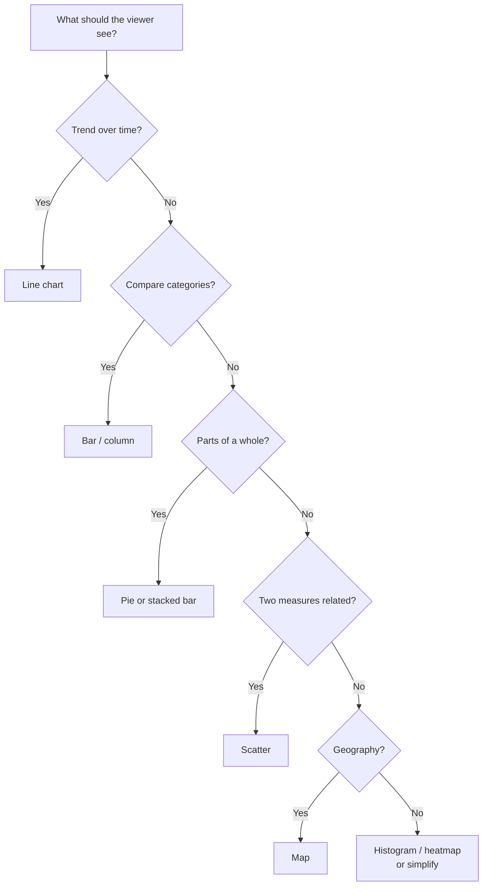
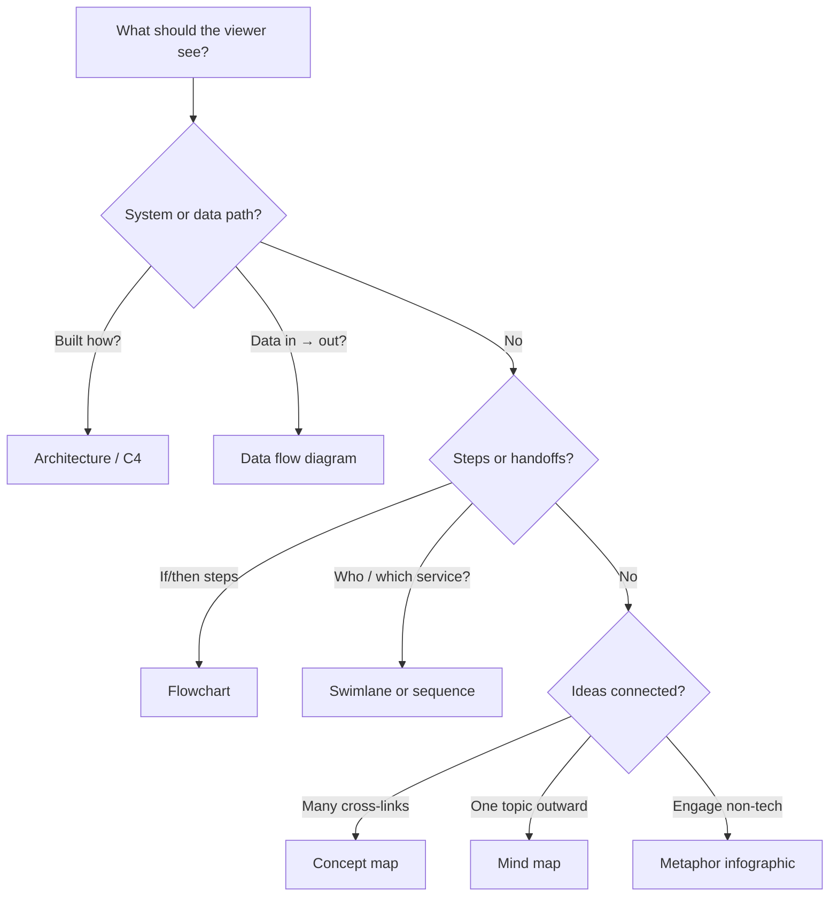
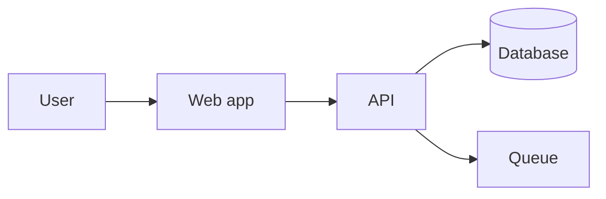
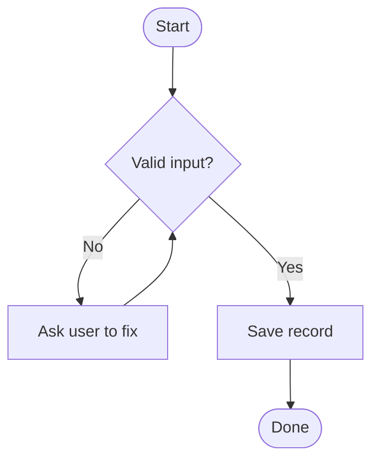
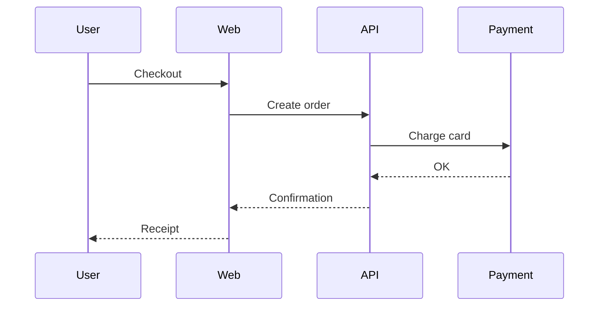
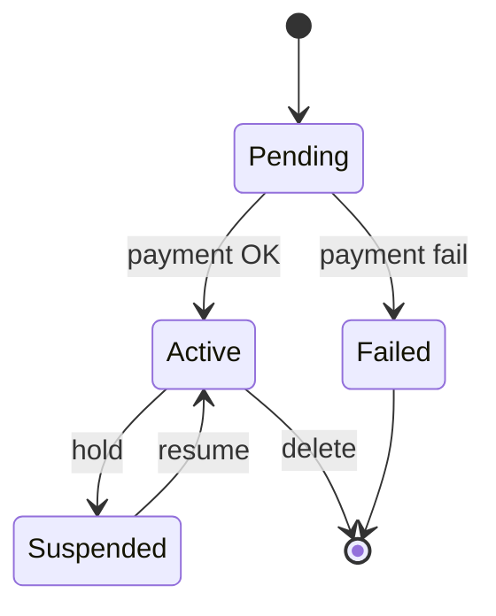
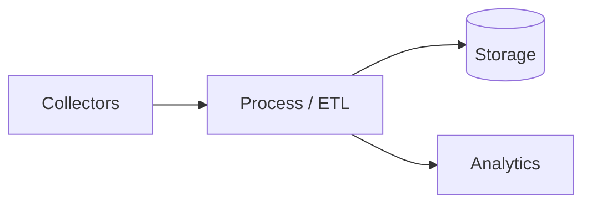
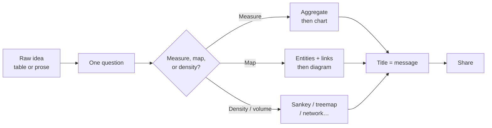

Data visualization is not “making charts pretty.” It is **visual communication**: turning numbers, systems, or ideas into a picture so someone can grasp the point in seconds — especially a non-technical audience.

You need three things:

1. **A clear question** (what should the viewer understand?)
2. **The right form** (bar chart vs flowchart vs architecture diagram…)
3. **A simple tool** (Sheets, Datawrapper, Miro, Mermaid…)

This guide covers **three families** of visuals:

| Family | Primary job | Examples |
| ------ | ----------- | -------- |
| **A. Number charts** | Compare, trend, share, distribute | Bar, line, pie, scatter, map |
| **B. Structure diagrams** | Map relationships, hierarchies, processes, systems | Architecture / C4, DFD, flowchart, sequence, concept map |
| **C. Advanced forms** | Volume flows, deep hierarchies, dense networks | Sankey, sunburst, network graph, state machine |

Together they let you explain analysis, concepts, architectures, and data flows in a short, pictorial way.

## TL;DR — Pick a visual by the question

### Numbers (measurement)

| If you want to show… | Use this form | Prefer these tools |
| -------------------- | ------------- | ------------------ |
| **Which is bigger / who ranks where?** | Bar or column | Google Sheets, Datawrapper, Flourish |
| **How did it change over time?** | Line chart | Google Sheets, Datawrapper |
| **Parts of one total (few slices)?** | Pie / donut (sparingly) | Google Sheets, Canva |
| **Mix of parts across groups?** | Stacked bar | Datawrapper, Flourish |
| **Do two numbers move together?** | Scatter plot | Google Sheets, RAWGraphs |
| **Where is intensity high?** | Heatmap | Flourish, Sheets |
| **How are values spread?** | Histogram | Google Sheets, RAWGraphs |
| **Where on a map?** | Choropleth / symbol map | Datawrapper, Flourish |

### Structure (relationships & processes)

| If you want to show… | Use this form | Prefer these tools |
| -------------------- | ------------- | ------------------ |
| **How a system is built / how parts talk** | Architecture diagram (C4 / blocks) | IcePanel, Structurizr, Eraser, Mermaid |
| **How data enters, transforms, and stores** | Data flow diagram (DFD) | Draw.io / diagrams.net, Mermaid, Miro |
| **Step-by-step “if/then” workflow** | Flowchart | Miro, Whimsical, Mermaid |
| **Who does what, or API call order** | Swimlane / sequence diagram | Mermaid, Miro, Whimsical |
| **Interconnected ideas with linking words** | Concept map | Miro, Whimsical, FigJam |
| **Brainstorm one topic outward** | Mind map | Miro, Whimsical, Canva |
| **One story for social / slides** | Metaphor infographic | Canva, Piktochart |

### Advanced (when basic charts and boxes get cluttered)

| If you want to show… | Use this form | Prefer these tools |
| -------------------- | ------------- | ------------------ |
| **Volume moving / splitting / dropping off** | Sankey diagram | Flourish, RAWGraphs, ECharts / D3 |
| **Many two-way transfers between peers** | Chord diagram | RAWGraphs, D3-based tools |
| **States + what triggers a change** | State machine / state diagram | Mermaid, Draw.io, PlantUML |
| **Huge hierarchy by size** | Treemap | Flourish, RAWGraphs, Sheets |
| **Deep hierarchy with drill-down rings** | Sunburst | Flourish, RAWGraphs |
| **Soft groupings of subgroups** | Circle packing | RAWGraphs, D3-based tools |
| **Mesh with many cross-links, no single root** | Network / force-directed graph | Flourish, Gephi, Observable |
| **Links along a linear sequence** | Arc diagram | RAWGraphs, D3-based tools |

> Jump to [Advanced forms](#part-c-advanced-forms-flows-hierarchies--networks), [Structure diagrams](#part-b-structure-diagrams-architecture-process--concepts), or [Number charts](#part-a-number-charts-technique-gallery).

> **Companion (data-first):** for “what columns do I have → which chart?”, see the draft *Which Chart for Which Data? Data Types → Visualizations* (`_drafts/which-chart-for-which-data-types.md`).

## Table of Contents

- [TL;DR — Pick a visual by the question](#tldr--pick-a-visual-by-the-question)
- [Why this matters](#why-this-matters)
- [Core concepts (plain language)](#core-concepts-plain-language)
- [Choose by goal: decision flows](#choose-by-goal-decision-flows)
- [Part A: Number charts (technique gallery)](#part-a-number-charts-technique-gallery)
- [Part B: Structure diagrams — architecture, process & concepts](#part-b-structure-diagrams-architecture-process--concepts)
- [Part C: Advanced forms — flows, hierarchies & networks](#part-c-advanced-forms-flows-hierarchies--networks)
- [Direct comparison: advanced visualizations](#direct-comparison-advanced-visualizations)
- [Tool box — how diagrams get built](#tool-box--how-diagrams-get-built)
- [From idea to picture: a tiny mental model](#from-idea-to-picture-a-tiny-mental-model)
- [Common mistakes](#common-mistakes)
- [When to use what](#when-to-use-what)
- [FAQ](#faq)
- [References](#references)

## Why this matters

A spreadsheet or a wall of text is accurate but slow. A good visual answers one question at a glance:

- “Sales in the West are highest.” → **bar chart**
- “Requests hit the API, then the database.” → **architecture / sequence**
- “Approval needs manager, then finance.” → **swimlane flowchart**
- “Observability includes logs, metrics, and traces.” → **concept map**
- “Most events drop before analytics.” → **Sankey**
- “These twelve services call each other in a mesh.” → **network graph**

That is **visual understanding**: the eye follows length, position, boxes, and arrows faster than it digests paragraphs — when the form matches the question.

| Situation | Text / table alone | Better visual |
| --------- | ------------------ | ------------- |
| Team update | “Here are 40 rows” | One bar chart + one-sentence title |
| System design review | Long architecture prose | C4 context + container diagram |
| Client process walkthrough | Bullet steps | Flowchart or swimlane |
| Teaching a concept | Dense definition list | Concept map or metaphor infographic |

## Core concepts (plain language)

### One visual, one message

If the viewer needs a lecture before they “get” it, the visual failed. Title with the conclusion (“Checkout calls payment, then inventory”), not the file name (“diagram-v3”).

### Three jobs: measure, map, or density

| Job | Question shape | Visual family |
| --- | -------------- | ------------- |
| **Measure** | How much? How did it change? Where is it high? | Number charts (Part A) |
| **Map** | How is it built? Who does what? How do ideas connect? | Structure diagrams (Part B) |
| **Density / volume / mesh** | How much flows where? How deep is the tree? What clusters? | Advanced forms (Part C) |

Mixing families on one slide is fine — e.g. a small architecture sketch plus one KPI chart — but each piece should still have one job.

### Encoding (why simple forms win)

Eyes compare **position and length** accurately; **angles and areas** poorly — a classic finding from Cleveland and McGill’s graphical perception experiments ([overview](https://en.wikipedia.org/wiki/Graphical_perception)). For numbers, bars usually beat pies. For systems, labeled boxes and arrows beat decorative clipart that hides the real connections.

### Audience first

| Audience | Prefer | Soften or avoid |
| -------- | ------ | --------------- |
| Non-technical | Bar, line, simple flowchart, metaphor infographic | Unexplained C4 Level 4, DFDs with jargon symbols |
| Stakeholders | C4 Context/Container, swimlanes, one KPI chart | Code-level diagrams without a story |
| Engineers / analysts | Sequence, DFD, detailed architecture, scatter, histogram | Metaphor icing that hides precision |

## Choose by goal: decision flows

### Numbers path

### Structure path

## Part A: Number charts (technique gallery)

Each item: **idea → when → avoid → tools → example**.

### Bar and column — “who / which is bigger?”

Categories on one axis; bar length = value. Horizontal bars help when labels are long.

| Use when | Avoid when |
| -------- | ---------- |
| Ranking regions, products, teams | Tiny differences that need a table |
| Survey options | Too many categories on one slide (use top-N) |

**Tools:** [Google Sheets](https://sheets.google.com) · [Datawrapper](https://www.datawrapper.de/) · [Flourish](https://flourish.studio/)

**Example:** “Which product line sold most last month?” → horizontal bar by product.

### Line — “how did it change over time?”

Time left → right; value up → down. Keep ≤3–4 series for non-technical slides.

| Use when | Avoid when |
| -------- | ---------- |
| Monthly sales, tickets, temperature | Unordered categories (use bars) |
| Before/after a policy change | Dozens of overlapping series |

**Tools:** Google Sheets · Datawrapper · Excel

**Example:** “Did support tickets fall after we hired two agents?” → weekly line + note at hire date.

### Pie / donut — “share of one total” (sparingly)

2–5 slices max. If viewers must squint to compare purple vs blue, use a bar instead.

| Use when | Avoid when |
| -------- | ---------- |
| Budget split with few shares | Ranking many items |
| One composition snapshot | Comparing mixes across years (stacked bar) |

**Tools:** Google Sheets · [Canva](https://www.canva.com/) · Flourish

**Example:** “Salaries vs tools vs marketing in one quarter.”

### Stacked bar — “mix inside each group”

Survey Likert by product, budget mix by department. Merge rare segments into “Other.”

| Use when | Avoid when |
| -------- | ---------- |
| Mix inside each category | Absolute totals matter more (add a second chart) |
| Likert / satisfaction by product | Too many segment colors |

**Tools:** Datawrapper · Flourish · Google Sheets

**Example:** “Share of satisfied / neutral / dissatisfied per product.”

### Scatter — “do two numbers move together?”

Association ≠ causation. Good for outliers and relationships; bad when you only need a ranking.

| Use when | Avoid when |
| -------- | ---------- |
| Price vs rating, spend vs satisfaction | Categories only (use bars) |
| Spotting outliers | Audience wants a single ranking |

**Tools:** Google Sheets · [RAWGraphs](https://www.rawgraphs.io/) · Flourish

**Example:** “Do higher prices correlate with higher ratings?”

### Heatmap — “where is intensity high?”

Day × hour activity, score matrices. Prefer sequential color scales over rainbow.

| Use when | Avoid when |
| -------- | ---------- |
| Busy hours, region × product scores | Exact value reading without labels |
| Pattern spotting | Precise ranking of equals (use bars) |

**Tools:** Flourish · Sheets / Excel conditional formatting

**Example:** “When do support chats peak during the week?”

### Histogram — “how are values spread?”

Buckets of a numeric range (scores, delivery times). Related: **box plot** once the audience knows the glyph.

| Use when | Avoid when |
| -------- | ---------- |
| Exam scores, delivery times, order sizes | Only the average matters |
| Showing “most people are here” | Weird bucket sizes that hide the story |

**Tools:** Google Sheets · RAWGraphs

**Example:** “How long do deliveries usually take?”

### Map — “where?”

Choropleth (color regions by rate) or symbol map (markers). Prefer rates over raw counts on unequal areas.

| Use when | Avoid when |
| -------- | ---------- |
| Cases per 100k, stores by city | Raw counts on unequal areas |
| Geographic coverage | Tiny differences (ranked bar is clearer) |

**Tools:** Datawrapper · Flourish

**Example:** “Where is churn highest by state (per customer)?”

### Timeline — “what happened in what order?”

Launches, incidents, roadmaps — storytelling, not dense numeric trends (use a line for that).

| Use when | Avoid when |
| -------- | ---------- |
| Product history, crisis chronology | Dense numeric trends |
| Non-technical storytelling | Too many parallel tracks |

**Tools:** Canva · [TimelineJS](https://timeline.knightlab.com/) · Flourish

**Example:** “What shipped between January and June?”

### Waterfall — “how a total builds or breaks down”

Step-by-step bridges (profit walk, budget variance). Keep when the story is additive/subtractive, not a deep hierarchy (use treemap/sunburst for that).

| Use when | Avoid when |
| -------- | ---------- |
| Profit bridge, budget variance | Deep nested hierarchies |
| Explaining +/− steps to a total | Simple two-part share (pie/bar) |

**Tools:** Flourish · Excel

**Example:** “How did we go from planned budget to actual spend?”

## Part B: Structure diagrams — architecture, process & concepts

These frameworks specialize in **mapping relationships, hierarchies, or processes** — ideal for explaining concepts, architectures, and data flows visually.

### Architecture & data flow

#### Architecture diagrams (C4 model / block diagrams)

**What it is:** Boxes and arrows that show how technology components interact. The **[C4 model](https://c4model.com/)** zooms in four levels:

| Level | Shows | Audience |
| ----- | ----- | -------- |
| **Context** | Your system + users + external systems | Everyone |
| **Containers** | Apps, APIs, databases, queues inside the system | Tech + stakeholders |
| **Components** | Major pieces inside one container | Engineers |
| **Code** | Classes / modules (rarely for presentations) | Implementers |

**Best for:** How software, cloud infrastructure, or an application is **structured** — containers, ownership, and trust boundaries. Leave detailed “where does each field go?” stories to DFDs.

**Tools:** [IcePanel](https://icepanel.io/) · [Structurizr](https://structurizr.com/) · [Eraser](https://www.eraser.io/) · Draw.io · Mermaid (experimental C4; prefer Structurizr/IcePanel for durable models)

*Simple container-style sketch — start here before adding C4 tooling.*

#### Data flow diagrams (DFD)

**What it is:** A map of how **inputs transform into outputs** through a system. Symbol sets vary by school (e.g. Gane–Sarson vs Yourdon) — pick one convention and stay consistent.

**Best for:** Tracking data paths, storage points, and system boundaries **without** diving into hardware or UI chrome.

**Tools:** Draw.io / diagrams.net · Miro · Mermaid (approximate with flowcharts) · Lucidchart

| Use when | Avoid when |
| -------- | ---------- |
| “Where does this field get written?” | You only need UI click paths (use a flowchart) |
| Privacy / compliance data-path reviews | Mixing DFD symbols with random clipart |

### Processes & sequences

#### Flowcharts

**What it is:** Step-by-step process from start to finish. Standard shapes: rectangles = actions, diamonds = decisions, arrows = order.

**Best for:** Multi-step workflows, business processes, conditional if/then logic, high-level algorithms (“validate → enrich → save”).

**Tools:** [Miro](https://miro.com/) · [Whimsical](https://whimsical.com/) · Mermaid · Canva

#### Sequence diagrams

**What it is:** Actors or services across the top; messages top → bottom over time.

**Best for:** API calls, login flows, “what happens when the user clicks Pay.”

**Tools:** Mermaid · PlantUML · IcePanel / Structurizr (in architecture context) · Whimsical

#### Swimlane diagrams

**What it is:** A flowchart split into rows or columns — each lane is a **person, team, or system** responsible for those steps.

**Best for:** Cross-department operations, checkout with customer / shop / payment provider, RACI-style clarity (“who waits on whom”).

**Tools:** Miro · Whimsical · Lucidchart · Draw.io

### Concepts & relationships

#### Mind maps

**What it is:** Radial / hierarchical branches from one central topic.

**Best for:** Brainstorming and simple breakdown of a **single** topic.

**Tools:** Miro · Whimsical · Canva

#### Concept maps

**What it is:** Like a mind map, but nodes are **cross-connected** in a web. Crucially, lines include **linking words** (“leads to”, “controls”, “is a type of”).

**Best for:** Complex, interconnected ideas where everything impacts everything else — teaching frameworks, domain models, or how observability pieces relate (see the [platform comparison]()).

**Tools:** Miro · FigJam · Whimsical · pen-and-paper then digitize

| Mind map | Concept map |
| -------- | ----------- |
| One center, tree outward | Many cross-links |
| Labels on nodes | Labels on nodes **and** on links |
| Brainstorm / outline | Explain a system of ideas |

#### Metaphor-based infographics

**What it is:** A real-world metaphor (iceberg, solar system, tree roots, layered cake) to represent layers of a concept.

**Best for:** Non-technical audiences when engagement and instant intuition matter more than engineering precision.

**Tools:** Canva · [Piktochart](https://piktochart.com/)

**Watch-out:** Metaphors persuade; they can also oversimplify. Pair with a precise diagram when decisions depend on accuracy.

## Part C: Advanced forms — flows, hierarchies & networks

> **Beginner gate:** Parts A and B cover most slides and docs. Skip Part C unless you need **volume along a path**, a **deep size hierarchy**, or a **dense mesh** with no single root.

Use these when traditional flowcharts look like spaghetti, mind maps run out of screen, or “everything connects to everything” with no clean root. Catalogue-style overviews live at the [Data Visualisation Catalogue](https://datavizcatalogue.com).

### Flows, paths, and transitions

#### Sankey diagram — “how much moves where?”

**What it is:** A flow diagram where **arrow width is proportional to quantity**. Streams split, merge, and can show drop-off.

**Best for:** Data pipelines (e.g. 100% of raw events → how much lands in storage vs analytics vs third-party APIs), funnel leakage, cloud cost distribution across services.

| Use when | Prefer instead |
| -------- | -------------- |
| Volume / share along a path matters | Plain flowchart (no quantities) |
| Many stages with splitting | Single pie (hides the path) |

**Tools:** Flourish · RAWGraphs · Apache ECharts / D3.js

#### Chord diagram — “who talks to whom (two-way)?”

**What it is:** Entities on a ring; curved arcs show transfers or relationships (often bidirectional).

**Best for:** Multi-directional data exchange between microservices or clusters — denser peer-to-peer traffic than a simple architecture sketch.

| Use when | Prefer instead |
| -------- | -------------- |
| Many peers with mutual links | Sequence (ordered calls) or C4 (ownership) |
| Traffic matrix is the story | Bar chart of top pairs (simpler for execs) |

**Tools:** RAWGraphs · Observable / D3 examples

**Audience tip:** Chord diagrams are powerful but unfamiliar — add a one-line legend (“arc thickness = request volume”) or show a ranked table beside them for non-technical viewers.

#### State machine diagram — “what states exist, and what triggers a change?”

**What it is:** Behavioral diagram of **states** (Pending, Active, Suspended, Deleted…) and **transitions** (events / triggers) between them.

**Best for:** Auth lifecycles, payment stages, order fulfillment, ticket status — clearer than a flowchart when the *object’s state* is the story.

**Tools:** Mermaid (`stateDiagram`) · Draw.io · PlantUML · Lucidchart

### Complex hierarchies and bundles

When a concept has hundreds of parts inside parts, radial mind maps waste space. These pack hierarchy by **size** and **nesting**.

#### Treemap — “nested boxes by size”

**What it is:** Nested rectangles; **area** (and often color) encodes magnitude and category.

**Best for:** System resource consumption (which services eat storage), large file trees, budget trees, “importance inside a hierarchy.”

**Tools:** Flourish · RAWGraphs · Google Sheets (treemap chart)

**Use instead of a mind map when:** size/importance constraints matter more than brainstorming labels.

#### Sunburst — “rings of a hierarchy”

**What it is:** Multi-level radial hierarchy — inner rings = high levels, outer rings = finer subcategories (a hierarchical pie).

**Best for:** Deep directories, dependency/package breakdowns, drill-down exploration in interactive tools.

**Tools:** Flourish · RAWGraphs · Observable

**Use instead of a mind map when:** viewers should click/drill into layers without scrolling a huge tree.

#### Circle packing — “nested groups as circles”

**What it is:** Like a treemap, but nested **circles** — organic look that emphasizes groupings and subgroups.

**Best for:** User personas clustered into segments, permission levels, feature sets inside modules.

**Tools:** RAWGraphs · D3 / Observable

### Highly interconnected networks

When there is **no clear top-down root** and many cross-links, use a network approach.

#### Network / force-directed graph — “clusters in a mesh”

**What it is:** Nodes (points) + edges (lines); layout algorithms pull related items into clusters.

**Best for:** Microservice meshes, social graphs, fraud rings, entity-relationship sketches at overview level.

**Tools:** Flourish · [Gephi](https://gephi.org/) · Observable · Neo4j Bloom (graph DBs)

| Use when | Prefer instead |
| -------- | -------------- |
| Multiple parents / cross-links, no center | Mind map (single root) |
| Discovering clusters | Concept map (teaching with linking words) |

**Audience tip:** Force layouts move; for slides, freeze a readable layout and label a few hub nodes.

#### Arc diagram — “links along a line”

**What it is:** Nodes on one axis; arcs above/below show connections.

**Best for:** Loops and repetitive dependencies in a **linear** process or execution order — spotting “this step keeps calling earlier steps.”

**Tools:** RAWGraphs · D3 / Observable

## Direct comparison: advanced visualizations

| Technique | Visual blueprint | When to use instead of a mind map / plain flowchart |
| --------- | ---------------- | --------------------------------------------------- |
| **Sankey** | Thick, splitting “rivers” of data | Volume loss or distribution across pipeline steps |
| **Chord** | Ring + curved arcs | Dense two-way exchange between many peers |
| **State machine** | States + labeled transitions | Lifecycle of one object (order, payment, account) |
| **Treemap** | Nested boxes by size | Size/importance inside a large hierarchy |
| **Sunburst** | Multi-layer wheel | Deep hierarchy with interactive drill-down |
| **Circle packing** | Nested circles | Soft groupings of personas / modules / permissions |
| **Network graph** | Floating nodes + edges | Many parents and cross-links; no single root |
| **Arc diagram** | Nodes on a line + arcs | Loops and dependencies in a linear sequence |

## Tool box — how diagrams get built

Tools split cleanly by **how you build**, not only by chart type:

| Build style | Best when | Weak when |
| ----------- | --------- | --------- |
| **Canvas** (drag-and-drop) | Workshops, slides, quick layouts, cloud icon stickers | Versioning in Git; huge live datasets |
| **Diagram-as-code** (text → image) | READMEs, PRs, docs that must stay next to code | Freeform brainstorming with sticky notes |
| **Data-driven engines** | Real metrics / tables drive Sankey, treemap, networks | One-off whiteboard storytelling |

**Free-friendly paths (no paid SaaS required):** Google Sheets · [Draw.io](https://www.diagrams.net/) · [Mermaid](https://mermaid.js.org/) · [RAWGraphs](https://www.rawgraphs.io/) · [Gephi](https://gephi.org/) · [D2](https://d2lang.com/) (open source). Miro, Lucidchart, IcePanel, Flourish, and Datawrapper offer free tiers with limits — fine for learning, check pricing before team rollouts.

### 1. Canvas-based tools (quick layouts & presentations)

Large digital whiteboards and shape libraries — best for linking concepts and presenting.

| Tool | Best for | Why use it |
| ---- | -------- | ---------- |
| **[Miro](https://miro.com/) / [Whimsical](https://whimsical.com/) / [Mural](https://www.mural.co/)** | Concept maps, comparison matrices, hybrid flowcharts | Fast for presentations; switch between high-level matrices and detailed structure on one canvas |
| **[Lucidchart](https://www.lucidchart.com/) / [Draw.io](https://www.diagrams.net/) (diagrams.net)** | Flowcharts, infrastructure blueprints, DFDs | Cloud shape libraries (AWS, GCP, Kubernetes) for “where does this bucket / cluster live?” |
| **[IcePanel](https://icepanel.io/) / [Eraser](https://www.eraser.io/)** | Collaborative architecture sketches | Faster stakeholder views than raw UML; Eraser is quick sketch → share (paid products; free alternatives: Draw.io + Structurizr Community) |
| **Canva / Piktochart** | Metaphor infographics, slide polish | Design-first; keep numbers accurate |

### 2. Diagram-as-code tools (engineering docs & Git)

Maintain diagrams beside code; avoid hand-aligning every arrow.

| Tool | Best for | Why use it |
| ---- | -------- | ---------- |
| **[Mermaid](https://mermaid.js.org/)** | Pipeline flowcharts, state machines, sequence diagrams | Renders in GitHub/GitLab Markdown; text in → diagram out. True swimlanes: Miro / Draw.io / Lucidchart |
| **[PlantUML](https://plantuml.com/) / [Structurizr](https://structurizr.com/)** | C4 architecture, technical sequences | Structurizr models C4 levels so Dev vs Prod views stay consistent |
| **[D2](https://d2lang.com/)** | Complex architecture, nested network layouts | Stronger multi-layer containers than basic Mermaid; keeps nested DBs/networks readable |

*Typical Mermaid-style pipeline sketch for a README — edit the text, not the pixels.*

### 3. Automated & data-driven charting engines (metrics & pipelines)

When **data** must drive widths, areas, or layouts, canvas tools fail. Feed tables or JSON instead.

| Tool | Best for | Why use it |
| ---- | -------- | ---------- |
| **[D3.js](https://d3js.org/) / [Apache ECharts](https://echarts.apache.org/)** | Sankey, chord, sunburst, treemap (custom / live) | Bind to JSON or APIs; Sankey widths scale with real volumes |
| **[Observable Plot](https://observablehq.com/plot)** | Exploratory marks (dot/bar/line/geo…); see [Plot Gallery](https://observablehq.com/@observablehq/plot-gallery) | Grammar-of-graphics style; great with notebooks — map gallery forms to data types in the companion chart-chooser draft |
| **[RAWGraphs](https://www.rawgraphs.io/)** | Treemap, circle packing, sunburst, chord, arc (no-code) | Paste a spreadsheet → organic layout; bridge between Excel and D3 |
| **[Flourish](https://flourish.studio/)** | Publishable Sankey, hierarchy, storytelling charts | Less code than D3; strong defaults for articles |
| **[Datawrapper](https://www.datawrapper.de/)** | Publishable bars, lines, maps, pies (no Sankey) | Clean charts for blogs and newsrooms |
| **[Gephi](https://gephi.org/) / [Cytoscape.js](https://js.cytoscape.org/)** | Network / force-directed graphs | Layout math for large meshes (thousands of edges); Gephi = desktop explore, Cytoscape.js = web |
| **Google Sheets / Excel** | Everyday bars, lines, pies, simple histos | Draft numbers before graduating to Flourish/RAWGraphs |

### Direct selection guide (tool first)

| You need… | Start with |
| --------- | ---------- |
| Comparison slide or installation roadmap | Miro or Whimsical |
| Architecture blueprint with cloud icons (S3, VMs, K8s) | Draw.io or Lucidchart |
| Log / data ingestion path inside a README | Mermaid or D2 |
| C4 model that must stay accurate over releases | Structurizr (or IcePanel for canvas C4) |
| Nested containers that Mermaid struggles with | D2 |
| Interactive volume / hierarchy chart from a table | RAWGraphs or Flourish |
| Live / custom Sankey or sunburst in an app | ECharts or D3.js |
| Huge microservice or dependency mesh | Gephi (explore) → Cytoscape.js or Flourish (publish) |

### Practical paths (end-to-end)

- **Non-tech story + numbers:** Sheets → Datawrapper / Flourish → Canva  
- **Workshop / process:** Miro, Whimsical, or Mural  
- **Cloud blueprint:** Draw.io or Lucidchart (shape libraries)  
- **Docs next to code:** Mermaid or D2 in Markdown → Structurizr when C4 is mandatory  
- **Pipeline volume / hierarchy / mesh:** RAWGraphs or Flourish (or ECharts/D3 if live) → label hubs; add a small table for exec audiences  

## From idea to picture: a tiny mental model

1. **Collect** — notes, export, survey  
2. **Ask one question** — measure or map?  
3. **Choose form** — from the TL;DR tables  
4. **Build** — in the matching tool  
5. **Annotate** — title, legend, source  
6. **Share** — slide, post, doc, whiteboard  

Algorithms and layout engines live *inside* advanced tools; beginners win with a clear question + the right form.

## Common mistakes

| Mistake | Why it hurts | Fix |
| ------- | ------------ | --- |
| Pie with 12 slices | Hard to compare | Bar or treemap |
| Architecture spaghetti | No zoom levels | Start with C4 Context, then one Container view |
| Flowchart with 40 boxes | Cognitive overload | Split phases; link to detail diagrams |
| Sequence without actors labeled | “Who called whom?” unclear | Name every participant |
| Mind map used as a concept map | Missing “how they relate” | Add linking words on edges |
| Metaphor with no precise backup | Pretty but undecidable | Add a sober diagram for decisions |
| Chord / network with no legend | Looks like art, not insight | Label thickness meaning + highlight hubs |
| Sankey without units | Width is meaningless | State units (events, $, GB) on the title |
| Treemap for rankings of equals | Area hard to compare precisely | Bar chart for top-N |
| Chartjunk / clipart noise | Signal drowned | Remove decoration; keep labels |

## When to use what

| Goal | Best form | Runner-up | Tool starter |
| ---- | --------- | --------- | ------------ |
| Rank categories | Bar | Column | Sheets / Datawrapper |
| Trend over months | Line | Area | Sheets / Datawrapper |
| System overview for stakeholders | C4 Context / Container | Simple block diagram | IcePanel / Structurizr / Mermaid |
| Data path / storage | DFD | Annotated flowchart | Draw.io / Lucidchart |
| If/then business process | Flowchart | Checklist | Whimsical / Mermaid |
| API or checkout interaction | Sequence | Swimlane | Mermaid (sequence) / Miro (swimlane) |
| Cross-team ownership | Swimlane | RACI table | Miro / Mural |
| Nested architecture as code | D2 diagram | Mermaid flowchart | D2 |
| Live volume chart in an app | Sankey (ECharts/D3) | Flourish export | ECharts / D3 |
| Teach interconnected ideas | Concept map | Labeled boxes | Miro / FigJam |
| Brainstorm one topic | Mind map | Outline bullets | Whimsical |
| Social / exec one-pager | Metaphor infographic | Big-number + one chart | Canva |
| Pipeline volume / drop-off | Sankey | Annotated funnel | Flourish / RAWGraphs |
| Deep hierarchy by size | Treemap | Sunburst (interactive) | Flourish / RAWGraphs |
| Microservice mesh / clusters | Network graph | Chord (peer traffic) | Flourish / Gephi |
| Order / payment lifecycle | State machine | Swimlane flowchart | Mermaid |

## FAQ

### What is the easiest tool if I only need number charts?

**Google Sheets or Excel**, then **Datawrapper** for a clean public chart.

### What should I use to explain how our app is built?

Start with a **C4 Context** (who uses the system and which external systems exist), then one **Container** diagram (web, API, DB). Prefer **IcePanel** or **Structurizr** for durable C4; Mermaid’s C4 support is limited — fine for a quick sketch, not a long-lived model.

### Flowchart vs data flow diagram — what’s the difference?

A **flowchart** emphasizes *steps and decisions* (what happens next). A **DFD** emphasizes *data movement and storage* (where information goes and sits). Use both if stakeholders need process *and* data accountability.

### Mind map vs concept map?

**Mind map** = radial brainstorm from one center. **Concept map** = web of ideas with **linking phrases** on the lines. Use concept maps when relationships matter as much as topics.

### Do I need to learn coding?

Not for most visual communication. **Mermaid** is optional “diagrams as text” for docs and blogs. Python/R/D3 help when you automate or build custom interactive apps.

### Can structure diagrams count as data visualization?

Yes. They visualize **structure, process, and relationships** — still visual communication. Number charts visualize **measurements**. You often need both in the same explanation.

### How many diagrams on one slide?

Prefer **one primary visual** plus a one-sentence takeaway. Link out for deeper C4 levels or detail flowcharts.

### When should I use a Sankey instead of a flowchart?

Use a **flowchart** for decisions and steps. Use a **Sankey** when **quantity** along the path matters — how much volume splits, merges, or drops off between stages.

### Treemap vs sunburst vs mind map?

| Need | Prefer |
| ---- | ------ |
| Brainstorm labels from one center | Mind map |
| Size/importance inside a hierarchy | Treemap |
| Interactive deep drill-down in rings | Sunburst |

### Network graph vs concept map?

A **concept map** teaches with **linking words** on edges. A **network graph** explores **clusters and connectivity** in large meshes (services, people, entities). Use concept maps for teaching; networks for discovery and density.

### Mermaid vs D2 vs canvas — which for docs?

| Need | Prefer |
| ---- | ------ |
| Diagram lives in GitHub Markdown tomorrow | **Mermaid** |
| Deep nested containers / networks as code | **D2** |
| C4 enforced across many views | **Structurizr** |
| Sticky-note workshop or exec whiteboard | **Miro / Whimsical / Mural** |
| AWS/GCP/K8s icon blueprint | **Draw.io / Lucidchart** |

### Canvas vs data-driven for Sankey / treemap?

Use **RAWGraphs or Flourish** (or **ECharts/D3**) when widths and areas must follow a **table or API**. Use a canvas tool only to *sketch* the story — then rebuild from data so the visual stays honest when numbers change.

## References

### Chart choice & principles

- [A friendly guide to choosing a chart type (Datawrapper)](https://www.datawrapper.de/blog/chart-types-guide)
- [The Data Visualisation Catalogue](https://datavizcatalogue.com)
- [Financial Times Visual Vocabulary](https://github.com/ft-interactive/visual-vocabulary) (chart-choice poster)
- [Graphical perception (Cleveland & McGill — overview)](https://en.wikipedia.org/wiki/Graphical_perception)

### Architecture & diagram-as-code

- [C4 model](https://c4model.com/)
- [Mermaid](https://mermaid.js.org/) · [D2](https://d2lang.com/) · [PlantUML](https://plantuml.com/)
- [Structurizr](https://structurizr.com/) · [IcePanel](https://icepanel.io/) · [Eraser](https://www.eraser.io/)
- [Whimsical](https://whimsical.com/) · [Miro](https://miro.com/) · [Draw.io](https://www.diagrams.net/)

### Data-driven charting & networks

- [Datawrapper](https://www.datawrapper.de/) · [Flourish](https://flourish.studio/) · [RAWGraphs](https://www.rawgraphs.io/)
- [D3.js](https://d3js.org/) · [Apache ECharts](https://echarts.apache.org/)
- [Gephi](https://gephi.org/) · [Cytoscape.js](https://js.cytoscape.org/)
- [TimelineJS (Knight Lab)](https://timeline.knightlab.com/)

