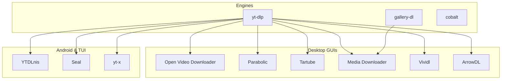
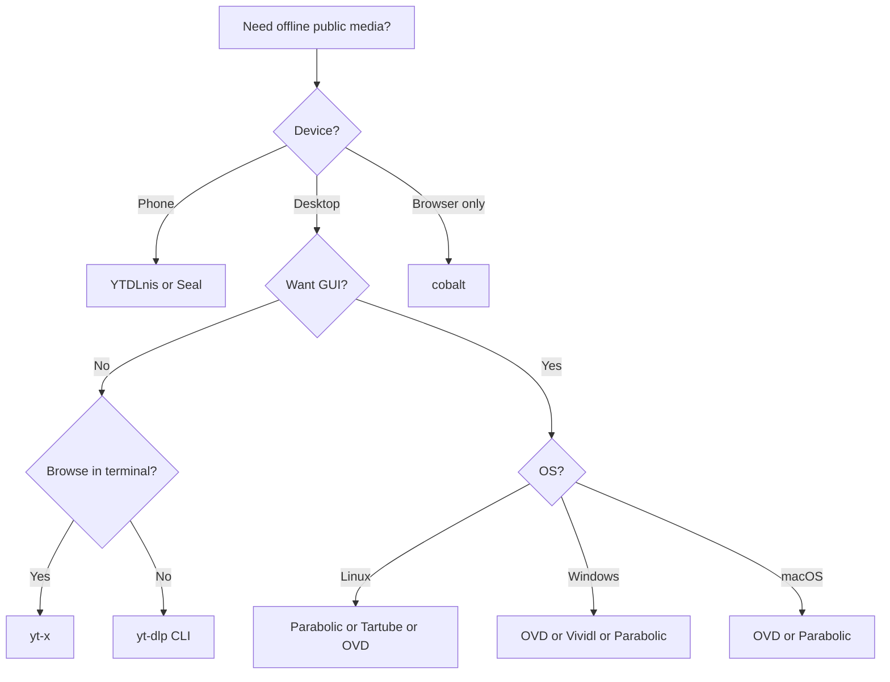

How do you save a public video for offline viewing without adware installers or paid “converter” sites? This guide sticks to **popular open-source** tools — the ones with public source, real licenses, and active communities — for YouTube, Instagram, Vimeo, TikTok, X/Twitter, and the rest of the yt-dlp ecosystem.

> **Legal & terms-of-service note (read first):** These tools download *what a site already makes reachable in a browser* — they do not unlock Netflix, Disney+, or other DRM-protected streams. Copyright still applies. Platform ToS often restrict bulk or automated download. Use this stack for content you own, content you have a license to keep offline, Creative Commons / public-domain material, or other uses allowed in your jurisdiction. You are responsible for what you download and how you redistribute it.

## TL;DR — Quick Recommendations

| Use case | Best fit | Why |
| -------- | -------- | --- |
| **Maximum power (CLI)** | [yt-dlp](https://github.com/yt-dlp/yt-dlp) + [FFmpeg](https://ffmpeg.org/) | Engine behind almost everything else; 1,800+ sites |
| **Polished cross-platform desktop GUI** | [Open Video Downloader](https://github.com/jely2002/youtube-dl-gui) | Tauri + Vue; Win/macOS/Linux; auto-updates yt-dlp ([project site](https://jely2002.github.io/youtube-dl-gui)) |
| **Linux / GNOME-friendly GUI** | [Parabolic](https://github.com/NickvisionApps/Parabolic) | Modern yt-dlp frontend; Flathub + Windows/macOS |
| **Channel monitoring / bulk GUI** | [Tartube](https://github.com/axcore/tartube) | Feature-dense GTK GUI for yt-dlp |
| **Multi-engine desktop GUI** | [Media Downloader](https://github.com/mhogomchungu/media-downloader) | Qt frontend for yt-dlp, gallery-dl, you-get, aria2, … |
| **Windows-only simple GUI** | [Vividl](https://github.com/Bluegrams/Vividl) | Lightweight WPF UI for yt-dlp |
| **Android (full-featured)** | [YTDLnis](https://github.com/deniscerri/ytdlnis) or [Seal](https://github.com/JunkFood02/Seal) | Material You / Compose yt-dlp apps (F-Droid / GitHub) |
| **Terminal browse + download** | [yt-x](https://github.com/Benexl/yt-x) | fzf/rofi TUI over yt-dlp |
| **General download manager (+ streams)** | [ArrowDL](https://github.com/setvisible/ArrowDL) | Qt download manager; batch, streams, browser extension |
| **Browser paste, no desktop install** | [cobalt](https://github.com/imputnet/cobalt) | AGPL self-hostable web API |
| **Instagram / gallery bulk** | [gallery-dl](https://github.com/mikf/gallery-dl) | Best-in-class album/profile scrapes |

> Jump to [Popular open-source tools](#popular-open-source-tools), [Desktop GUIs compared](#desktop-guis-compared), or [yt-dlp quick start](#yt-dlp-quick-start).

## Table of Contents

- [TL;DR — Quick Recommendations](#tldr--quick-recommendations)
- [What this guide covers (and excludes)](#what-this-guide-covers-and-excludes)
- [How the stack works](#how-the-stack-works)
- [Popular open-source tools](#popular-open-source-tools)
- [Desktop GUIs compared](#desktop-guis-compared)
- [Android & terminal](#android--terminal)
- [Platform coverage](#platform-coverage)
- [yt-dlp quick start](#yt-dlp-quick-start)
- [When to use what](#when-to-use-what)
- [Known limitations](#known-limitations)
- [FAQ](#faq)
- [Not included (and why)](#not-included-and-why)
- [References](#references)

## What this guide covers (and excludes)

**In scope:** OSI-licensed (or Unlicense) tools that are widely used, actively maintained, and suitable for public non-DRM media.

**Out of scope**

- Closed-source / freemium wrappers (e.g. [Stacher](https://s7.stacher.io/), [Video Download Helper](https://downloadhelper.net/))
- Ad-heavy online “YouTube to MP4” websites
- DRM circumvention (Netflix, Disney+, etc.)
- Obscure forks with no community

| Criterion | Requirement |
| --------- | ----------- |
| **License** | Public source + OSI-style license |
| **Popularity** | Meaningful stars/users and ongoing commits |
| **Role** | Real download path (engine or maintained frontend) |

## How the stack works



Almost every GUI here is a frontend for **yt-dlp**. Install **FFmpeg** alongside so separate video/audio streams merge cleanly.

## Popular open-source tools

| Tool | Role | OS | License | Stars (≈ Sep 2026) |
| ---- | ---- | -- | ------- | ------------------ |
| **[yt-dlp](https://github.com/yt-dlp/yt-dlp)** | CLI engine | All | Unlicense | ~194k |
| **[FFmpeg](https://ffmpeg.org/)** | Mux / convert | All | LGPL/GPL | Companion |
| **[Open Video Downloader](https://github.com/jely2002/youtube-dl-gui)** | Desktop GUI (Tauri) | Win / macOS / Linux | AGPL-3.0 | ~9.3k |
| **[Parabolic](https://github.com/NickvisionApps/Parabolic)** | Desktop GUI | Linux / Win / macOS | MIT | ~7.2k |
| **[Tartube](https://github.com/axcore/tartube)** | Desktop GUI (GTK) | Win / macOS / Linux | LGPL-2.1 | ~3.1k |
| **[Media Downloader](https://github.com/mhogomchungu/media-downloader)** | Multi-CLI GUI (Qt) | Win / macOS / Linux | GPL-2.0+ | ~5.0k |
| **[Vividl](https://github.com/Bluegrams/Vividl)** | Desktop GUI (WPF) | Windows | BSD-3-Clause | ~1.3k |
| **[ArrowDL](https://github.com/setvisible/ArrowDL)** | Download manager | Win / macOS / Linux | LGPL-3.0 | ~0.9k |
| **[YTDLnis](https://github.com/deniscerri/ytdlnis)** | Android yt-dlp app | Android 7+ | GPL-3.0 | ~10.3k |
| **[Seal](https://github.com/JunkFood02/Seal)** | Android yt-dlp app | Android | GPL-3.0 | ~29k |
| **[yt-x](https://github.com/Benexl/yt-x)** | Terminal TUI (fzf/rofi) | Linux / macOS / … | MIT | ~1.7k |
| **[gallery-dl](https://github.com/mikf/gallery-dl)** | Gallery / album CLI | All | GPL-2.0 | ~20k |
| **[cobalt](https://github.com/imputnet/cobalt)** | Web API / self-host | Browser / server | AGPL-3.0 | ~44k |
| **[aria2](https://github.com/aria2/aria2)** | External accelerator | All | GPL-2.0 | ~43k |
| **[NewPipe](https://github.com/TeamNewPipe/NewPipe)** | FOSS YouTube client | Android | GPL-3.0 | ~40k |

## Desktop GUIs compared

### Open Video Downloader (`jely2002/youtube-dl-gui`)

Cross-platform **Tauri + Vue** app marketed as *Open Video Downloader*. Paste URLs, pick quality, pull audio-only, subs, playlists; queueing and cookie/auth support; app + yt-dlp auto-update. Installers for Windows, Intel/Apple Silicon macOS, AppImage/deb/rpm Linux; also `brew install --cask open-video-downloader` and `winget install jely2002.youtube-dl-gui`.

- Repo: [github.com/jely2002/youtube-dl-gui](https://github.com/jely2002/youtube-dl-gui)  
- Site: [jely2002.github.io/youtube-dl-gui](https://jely2002.github.io/youtube-dl-gui)

### Parabolic (`NickvisionApps/Parabolic`)

Modern **yt-dlp frontend** with GNOME (GTK4/libadwaita) and Windows (WinUI) builds, plus browser extensions. Concurrent downloads, metadata/subs, Flathub packaging. Strong default if you live in Linux desktop ecosystems.

- Repo: [github.com/NickvisionApps/Parabolic](https://github.com/NickvisionApps/Parabolic)

### Tartube (`axcore/tartube`)

Python 3 / **Gtk 3** front-end for youtube-dl / yt-dlp. Heavier feature set: channel/playlist DB, scheduled updates, many yt-dlp options exposed in UI. Best when you manage lots of subscriptions from a desktop.

- Repo: [github.com/axcore/tartube](https://github.com/axcore/tartube)

### Media Downloader (`mhogomchungu/media-downloader`)

**Qt/C++** GUI that fronts multiple CLIs via extensions: yt-dlp (default), gallery-dl, you-get, aria2c, wget, and more. Concurrent downloads, batch from file, playlist “subscriptions.” Flatpak, AppImage, Windows installers/portable, Fedora package, macOS bundles.

- Repo: [github.com/mhogomchungu/media-downloader](https://github.com/mhogomchungu/media-downloader)

### Vividl (`Bluegrams/Vividl`)

**Windows-only** modern WPF GUI for yt-dlp: format pick, convert, audio extract, parallel queue, clipboard import. Smaller scope than OVD/Parabolic; fine if you only need Windows.

- Repo: [github.com/Bluegrams/Vividl](https://github.com/Bluegrams/Vividl)

### ArrowDL (`setvisible/ArrowDL`)

**LGPL** download manager (Qt) for Windows/macOS/Linux — batch files, video streams, webpage link grab, browser WebExtension bridge. Broader than “YouTube GUI”; use when you want a general manager that also handles streams.

- Repo: [github.com/setvisible/ArrowDL](https://github.com/setvisible/ArrowDL) · site: [arrow-dl.com](https://www.arrow-dl.com)

### Desktop quick matrix

| | OVD | Parabolic | Tartube | Media Downloader | Vividl | ArrowDL |
| - | :-: | :-------: | :-----: | :--------------: | :----: | :-----: |
| **Windows** | ✅ | ✅ | ✅ | ✅ | ✅ | ✅ |
| **macOS** | ✅ | ✅ | ✅ | ✅ | — | ✅ |
| **Linux** | ✅ | ✅ | ✅ | ✅ | — | ✅ |
| **Engine** | yt-dlp | yt-dlp | yt-dlp | yt-dlp + extensions | yt-dlp | Own engine + stream tools |
| **Best for** | Daily GUI | GNOME / clean UI | Channels / power | Multi-CLI | Win simplicity | General DM + video |

## Android & terminal

### YTDLnis (`deniscerri/ytdlnis`)

Full-featured **Android** yt-dlp client: playlists, queue/schedule, cookies, SponsorBlock, cuts, custom templates, Material You. Install only from GitHub / F-Droid / IzzyOnDroid / project site — not random APK mirrors.

- Repo: [github.com/deniscerri/ytdlnis](https://github.com/deniscerri/ytdlnis) · [ytdlnis.org](https://ytdlnis.org)

### Seal

Still one of the most popular Android yt-dlp GUIs (F-Droid). Prefer **YTDLnis** if you want denser playlist/scheduling features; **Seal** if you want a simpler download-focused UI.

### yt-x (`Benexl/yt-x`)

POSIX script to **browse and download** YouTube (and other yt-dlp sites) from the terminal via **fzf** or **rofi**, with optional previews. Ideal for Linux power users who want search → play/download without a heavy GUI.

- Repo: [github.com/Benexl/yt-x](https://github.com/Benexl/yt-x)

### NewPipe

FOSS YouTube-class Android **client** with download — narrower site list than yt-dlp apps, better as a daily viewer.

## Platform coverage

All yt-dlp frontends inherit yt-dlp’s site list. Practical snapshot:

| Platform | yt-dlp GUIs / YTDLnis / Seal | cobalt | gallery-dl | NewPipe |
| -------- | :--------------------------: | :----: | :--------: | :-----: |
| YouTube | ✅ | ✅ | △ | ✅ |
| Instagram | ✅* | ✅ | ✅ | — |
| Vimeo | ✅* | ✅ | △ | — |
| TikTok / X / Reddit | ✅ | ✅ | ✅ | — |
| Facebook | ✅* | △ | △ | — |
| Twitch VODs/clips | ✅ | △ | — | — |
| DRM streaming | ❌ | ❌ | ❌ | ❌ |

\*May need browser cookies for age-gated or private items you can already access.

## yt-dlp quick start

```bash
pip install -U yt-dlp
# or: brew install yt-dlp ffmpeg

yt-dlp -f "bv*+ba/b" "URL"
yt-dlp -x --audio-format mp3 "URL"
yt-dlp -F "URL"          # list formats
yt-dlp --cookies-from-browser chrome "URL"
```

GUI users: install Open Video Downloader, Parabolic, Tartube, Media Downloader, or Vividl — same URLs, checkboxes instead of flags.

## When to use what

| Situation | Pick |
| --------- | ---- |
| Don’t want the terminal | **Open Video Downloader** or **Parabolic** |
| Many channels to watch for new uploads | **Tartube** |
| Need gallery-dl + yt-dlp in one window | **Media Downloader** |
| Windows only, minimal UI | **Vividl** |
| Batch files + page grab + streams | **ArrowDL** |
| Android | **YTDLnis** or **Seal** |
| Terminal-native browse/download | **yt-x** |
| One-off in the browser | **cobalt** (prefer self-host for privacy) |
| Instagram profile dump | **gallery-dl** (or Media Downloader + gallery-dl extension) |



## Known limitations

- Extractors break when sites change — update yt-dlp (or let OVD/Parabolic auto-update) first.
- Cookies are sensitive; never paste them into random websites.
- Aggressive parallelism can trigger rate limits.
- Cobalt public instances are shared; self-host for heavy use.

## FAQ

### Is Open Video Downloader the same as youtube-dl?

No. [Open Video Downloader](https://github.com/jely2002/youtube-dl-gui) is a **GUI** that drives **yt-dlp** (the maintained fork of youtube-dl).

### Tartube vs Parabolic vs OVD?

- **OVD:** polished cross-platform daily driver  
- **Parabolic:** especially nice on modern Linux; also Win/macOS  
- **Tartube:** deepest channel/playlist management UI  

### YTDLnis vs Seal?

Both are solid OSS Android frontends for yt-dlp. YTDLnis leans feature-complete (schedule, cuts, templates); Seal leans simpler download UX. Install from official repos only.

### Can these download Netflix?

No. DRM catalogs are unsupported by design.

## Not included (and why)

| Tool | Why omitted here |
| ---- | ---------------- |
| **[Stacher](https://s7.stacher.io/)** | Popular yt-dlp GUI, but **not open source** |
| **[Video Download Helper](https://downloadhelper.net/)** | Useful browser extension; **freemium / not OSS** |
| Random online converters | Privacy/malware risk; no auditable source |

## References

### Engines & companions

- [yt-dlp/yt-dlp](https://github.com/yt-dlp/yt-dlp)  
- [FFmpeg](https://ffmpeg.org/) · [aria2](https://github.com/aria2/aria2)  
- [mikf/gallery-dl](https://github.com/mikf/gallery-dl) · [imputnet/cobalt](https://github.com/imputnet/cobalt)

### Desktop

- [jely2002/youtube-dl-gui](https://github.com/jely2002/youtube-dl-gui) (Open Video Downloader)  
- [NickvisionApps/Parabolic](https://github.com/NickvisionApps/Parabolic)  
- [axcore/tartube](https://github.com/axcore/tartube)  
- [mhogomchungu/media-downloader](https://github.com/mhogomchungu/media-downloader)  
- [Bluegrams/Vividl](https://github.com/Bluegrams/Vividl)  
- [setvisible/ArrowDL](https://github.com/setvisible/ArrowDL)

### Android & terminal

- [deniscerri/ytdlnis](https://github.com/deniscerri/ytdlnis)  
- [JunkFood02/Seal](https://github.com/JunkFood02/Seal)  
- [TeamNewPipe/NewPipe](https://github.com/TeamNewPipe/NewPipe)  
- [Benexl/yt-x](https://github.com/Benexl/yt-x)

---

*Star counts checked around September 2026. Prefer GitHub Releases / Flathub / F-Droid over third-party APK/EXE mirrors. Use tools within copyright law and platform terms.*
