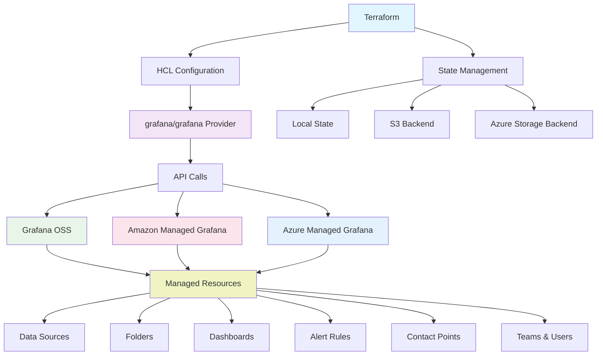

Stop manually configuring Grafana through the UI. This comprehensive guide shows you how to **version-control your entire monitoring stack**, ensure **consistent deployments** across environments, and **eliminate configuration drift** using Terraform. Whether you're managing Grafana OSS, Amazon Managed Grafana (AMG), or Azure Managed Grafana, you'll master the Infrastructure as Code patterns that DevOps teams rely on for **scalable monitoring operations**.

> **Quick Start**: Jump to [step-by-step provisioning](#step-by-step-provisioning) for immediate automation or explore our [GitHub repository](https://github.com/sagarnikam123/sagarnikam123-blog-youtube-code-samples/tree/main/grafana-automation/terraform) for complete Terraform configurations.

## Table of Contents

- [Table of Contents](#table-of-contents)
- [Architecture Overview](#architecture-overview)
- [When to Use Terraform for Grafana](#when-to-use-terraform-for-grafana)
- [Prerequisites](#prerequisites)
- [Quick Start (5 Minutes)](#quick-start-5-minutes)
- [Provider Information](#provider-information)
- [Platform Compatibility](#platform-compatibility)
- [Provider Setup](#provider-setup)
  - [Grafana OSS (Self-Hosted)](#grafana-oss-self-hosted)
  - [Amazon Managed Grafana (AMG)](#amazon-managed-grafana-amg)
  - [Azure Managed Grafana](#azure-managed-grafana)
- [Resource Reference](#resource-reference)
  - [Core Resources (Covered in this guide)](#core-resources-covered-in-this-guide)
  - [Additional Resources (Available in Provider)](#additional-resources-available-in-provider)
  - [Grafana Cloud Specific Resources](#grafana-cloud-specific-resources)
- [Step-by-Step Provisioning](#step-by-step-provisioning)
  - [Step 1: Create Folders](#step-1-create-folders)
  - [Step 2: Create Data Sources](#step-2-create-data-sources)
  - [Step 3: Create Dashboards](#step-3-create-dashboards)
    - [Dashboard from JSON File (Golden Signals)](#dashboard-from-json-file-golden-signals)
    - [Multiple Dashboards from Directory](#multiple-dashboards-from-directory)
- [Alerting Stack](#alerting-stack)
  - [Alerting Architecture](#alerting-architecture)
  - [Step 4: Create Contact Points](#step-4-create-contact-points)
  - [Step 5: Create Alert Rules](#step-5-create-alert-rules)
  - [Step 6: Create Notification Policy](#step-6-create-notification-policy)
  - [Mute Timings](#mute-timings)
- [Access Control](#access-control)
  - [Step 7: Create Teams and Permissions](#step-7-create-teams-and-permissions)
  - [Service Accounts](#service-accounts)
- [Multi-Environment Patterns](#multi-environment-patterns)
  - [Directory Structure](#directory-structure)
  - [Reusable Module](#reusable-module)
  - [Environment Configuration](#environment-configuration)
  - [Adding a New Instance](#adding-a-new-instance)
- [CI/CD Integration](#cicd-integration)
  - [GitHub Actions](#github-actions)
  - [GitLab CI](#gitlab-ci)
- [Best Practices](#best-practices)
  - [1. State Management](#1-state-management)
  - [2. Sensitive Data](#2-sensitive-data)
  - [3. Resource Naming](#3-resource-naming)
  - [4. Dashboard Version Control](#4-dashboard-version-control)
  - [5. Import Existing Resources](#5-import-existing-resources)
  - [6. Bulk Import Scripts](#6-bulk-import-scripts)
  - [7. Use -target for Step-by-Step](#7-use--target-for-step-by-step)
- [Frequently Asked Questions (FAQ)](#frequently-asked-questions-faq)
  - [Q: How do I fix "Authentication Failed" errors?](#q-how-do-i-fix-authentication-failed-errors)
  - [Q: What's the difference between Terraform and Ansible for Grafana?](#q-whats-the-difference-between-terraform-and-ansible-for-grafana)
  - [Q: How do I handle AMG API key expiration?](#q-how-do-i-handle-amg-api-key-expiration)
  - [Q: Can I import existing Grafana resources?](#q-can-i-import-existing-grafana-resources)
  - [Q: How do I manage multiple Grafana instances?](#q-how-do-i-manage-multiple-grafana-instances)
  - [Q: What if terraform apply fails midway?](#q-what-if-terraform-apply-fails-midway)
- [Troubleshooting](#troubleshooting)
  - [Common Issues](#common-issues)
  - [Debugging Commands](#debugging-commands)
  - [State Recovery](#state-recovery)
- [References](#references)
  - [Official Documentation](#official-documentation)
  - [Platform-Specific Guides](#platform-specific-guides)
  - [Related Posts](#related-posts)
  - [Code Repository](#code-repository)

## Architecture Overview

The following diagram shows how Terraform interacts with different Grafana deployments:



## When to Use Terraform for Grafana

**Ideal Use Cases:**
- **Infrastructure as Code** - Version-controlled Grafana configurations
- **Multi-environment deployments** - Consistent setup across dev/staging/prod
- **State management** - Track resource changes and dependencies
- **CI/CD integration** - Automated deployment pipelines
- **Disaster recovery** - Automated recreation of Grafana setups
- **Compliance** - Auditable configuration management
- **Team collaboration** - Review changes via pull requests

**Not Recommended For:**
- **One-time manual tasks** - Use Grafana UI instead
- **Frequent dashboard iterations** - Use Grafana editor for rapid development
- **Real-time troubleshooting** - Direct API calls are faster
- **Exploratory work** - UI is better for discovery

## Prerequisites

```bash
# Install Terraform (1.0 or newer)
# macOS
brew install terraform

# Linux
wget https://releases.hashicorp.com/terraform/1.6.0/terraform_1.6.0_linux_amd64.zip
unzip terraform_1.6.0_linux_amd64.zip
sudo mv terraform /usr/local/bin/

# Verify installation
terraform version
```

## Quick Start (5 Minutes)

Get your first Grafana automation running in 5 minutes:

**1. Clone and setup**:
```bash
git clone https://github.com/sagarnikam123/sagarnikam123-blog-youtube-code-samples.git
cd sagarnikam123-blog-youtube-code-samples/grafana-automation/terraform

# For step-by-step learning:
cd grafana-oss

# Or for multi-instance management:
cd instances/grafana-oss-local
```

**2. Configure your Grafana credentials**:
```bash
cp terraform.tfvars.example terraform.tfvars
# Edit terraform.tfvars with your Grafana URL and API key
```

**3. Initialize and apply**:
```bash
terraform init
terraform plan
terraform apply -target=grafana_folder.main
```

✅ **Success!** Continue to [Step-by-Step Provisioning](#step-by-step-provisioning) for complete setup.

## Provider Information

- **Provider**: [`grafana/grafana`](https://registry.terraform.io/providers/grafana/grafana/latest/docs)
- **Version**: >= 2.0
- **Terraform**: >= 1.0
- **Source Code**: [GitHub Repository](https://github.com/grafana/terraform-provider-grafana)
- **Documentation**: [Terraform Registry Docs](https://registry.terraform.io/providers/grafana/grafana/latest/docs)

## Platform Compatibility

| Platform                   | Type        | Authentication        | Description                              |
| -------------------------- | ----------- | --------------------- | ---------------------------------------- |
| **Grafana OSS**            | Self-hosted | API Key / Basic Auth  | VM, Docker, Kubernetes deployments       |
| **Amazon Managed Grafana** | AWS         | Workspace API Key     | AWS managed service with IAM integration |
| **Azure Managed Grafana**  | Azure       | Service Account Token | Azure managed service with Entra ID      |

## Provider Setup

### Grafana OSS (Self-Hosted)

```hcl
# versions.tf
terraform {
  required_version = ">= 1.0"
  required_providers {
    grafana = {
      source  = "grafana/grafana"
      version = ">= 2.0"
    }
  }
}

# provider.tf
provider "grafana" {
  url  = var.grafana_url    # e.g., "http://localhost:3000"
  auth = var.grafana_auth   # API key or "admin:admin"
}

# variables.tf
variable "grafana_url" {
  description = "Grafana server URL"
  type        = string
}

variable "grafana_auth" {
  description = "Grafana API key or username:password"
  type        = string
  sensitive   = true
}
```

### Amazon Managed Grafana (AMG)

AMG uses a **two-plane architecture**:
- **Control Plane** (AWS Provider): Workspace, IAM roles, SSO
- **Data Plane** (Grafana Provider): Dashboards, data sources, alerts

```hcl
terraform {
  required_providers {
    aws = {
      source  = "hashicorp/aws"
      version = ">= 4.0"
    }
    grafana = {
      source  = "grafana/grafana"
      version = ">= 2.0"
    }
  }
}

# Control Plane: Create AMG Workspace
resource "aws_grafana_workspace" "main" {
  name                     = "my-grafana-workspace"
  account_access_type      = "CURRENT_ACCOUNT"
  authentication_providers = ["AWS_SSO"]
  permission_type          = "SERVICE_MANAGED"
  role_arn                 = aws_iam_role.grafana.arn
  data_sources             = ["CLOUDWATCH", "PROMETHEUS", "XRAY"]
}

# IAM Role for AMG
resource "aws_iam_role" "grafana" {
  name = "grafana-workspace-role"
  assume_role_policy = jsonencode({
    Version = "2012-10-17"
    Statement = [{
      Action    = "sts:AssumeRole"
      Effect    = "Allow"
      Principal = { Service = "grafana.amazonaws.com" }
    }]
  })
}

# Data Plane: Grafana Provider
provider "grafana" {
  url  = aws_grafana_workspace.main.endpoint
  auth = var.grafana_api_key  # Created externally
}
```

**Important**: AMG API keys expire. Create them externally before Terraform runs:

```bash
# Create API key via AWS CLI
API_KEY=$(aws grafana create-workspace-api-key \
  --workspace-id $WORKSPACE_ID \
  --key-name "terraform-$(date +%s)" \
  --key-role ADMIN \
  --seconds-to-live 300 \
  --query 'key' --output text)

# Run Terraform
export TF_VAR_grafana_api_key=$API_KEY
terraform apply
```

### Azure Managed Grafana

```hcl
terraform {
  required_providers {
    azurerm = {
      source  = "hashicorp/azurerm"
      version = ">= 3.0"
    }
    grafana = {
      source  = "grafana/grafana"
      version = ">= 2.0"
    }
  }
}

provider "azurerm" {
  features {}
}

# Create Azure Managed Grafana Instance
resource "azurerm_dashboard_grafana" "main" {
  name                              = "my-grafana"
  resource_group_name               = azurerm_resource_group.main.name
  location                          = azurerm_resource_group.main.location
  api_key_enabled                   = true
  deterministic_outbound_ip_enabled = true
  public_network_access_enabled     = true

  identity {
    type = "SystemAssigned"
  }
}

# Grant Monitoring Reader to Grafana
resource "azurerm_role_assignment" "grafana_monitoring" {
  scope                = data.azurerm_subscription.current.id
  role_definition_name = "Monitoring Reader"
  principal_id         = azurerm_dashboard_grafana.main.identity[0].principal_id
}
```

**Create service account via Azure CLI**:

```bash
# Install AMG extension
az extension add --name amg

# Create service account and token
az grafana service-account create --name $GRAFANA_NAME --service-account terraform --role Admin
GRAFANA_TOKEN=$(az grafana service-account token create \
  --name $GRAFANA_NAME \
  --service-account terraform \
  --token terraform-token \
  --time-to-live 1d \
  --query key -o tsv)

export TF_VAR_grafana_auth=$GRAFANA_TOKEN
```

## Resource Reference

### Core Resources (Covered in this guide)

| Resource                      | Purpose             | Dependency          |
| ----------------------------- | ------------------- | ------------------- |
| `grafana_folder`              | Organize dashboards | None                |
| `grafana_data_source`         | Connect to backends | None                |
| `grafana_dashboard`           | Visualizations      | Folder, Data Source |
| `grafana_rule_group`          | Alert rules         | Folder, Data Source |
| `grafana_contact_point`       | Alert destinations  | None                |
| `grafana_notification_policy` | Alert routing       | Contact Point       |
| `grafana_mute_timing`         | Silence alerts      | None                |
| `grafana_team`                | User groups         | None                |
| `grafana_folder_permission`   | Access control      | Folder, Team        |
| `grafana_service_account`     | API access          | None                |

### Additional Resources (Available in Provider)

| Category         | Resources                                                                           | Description                                     |
| ---------------- | ----------------------------------------------------------------------------------- | ----------------------------------------------- |
| **Organization** | `grafana_organization`, `grafana_organization_preferences`                          | Multi-tenant Grafana management                 |
| **Users**        | `grafana_user`, `grafana_team_external_group`                                       | User and team management                        |
| **Dashboards**   | `grafana_library_panel`, `grafana_dashboard_permission`, `grafana_dashboard_public` | Reusable panels, permissions, public dashboards |
| **Alerting**     | `grafana_message_template`, `grafana_rule_group`                                    | Alert templates and rule groups                 |
| **Data Sources** | `grafana_data_source_permission`                                                    | Datasource access control                       |
| **Annotations**  | `grafana_annotation`                                                                | Dashboard annotations                           |
| **Playlists**    | `grafana_playlist`                                                                  | Dashboard playlists                             |
| **API Keys**     | `grafana_api_key` (deprecated), `grafana_service_account_token`                     | Authentication tokens                           |
| **SSO**          | `grafana_sso_settings`                                                              | Single sign-on configuration                    |
| **Reporting**    | `grafana_report`                                                                    | Scheduled PDF reports (Enterprise)              |

### Grafana Cloud Specific Resources

| Resource                              | Purpose                             |
| ------------------------------------- | ----------------------------------- |
| `grafana_cloud_stack`                 | Manage Grafana Cloud stacks         |
| `grafana_cloud_stack_service_account` | Cloud stack service accounts        |
| `grafana_cloud_access_policy`         | Access policies for cloud           |
| `grafana_cloud_plugin_installation`   | Install plugins on cloud            |
| `grafana_synthetic_monitoring_*`      | Synthetic monitoring checks         |
| `grafana_oncall_*`                    | OnCall integration resources        |
| `grafana_machine_learning_*`          | ML features (forecasting, outliers) |
| `grafana_slo`                         | Service Level Objectives            |

> **Note**: This guide focuses on resources compatible with Grafana OSS, AMG, and Azure Managed Grafana. Cloud-specific resources require Grafana Cloud. See [full provider documentation](https://registry.terraform.io/providers/grafana/grafana/latest/docs) for all available resources.

## Step-by-Step Provisioning

The recommended approach is to provision resources one at a time using `-target`:

```
Order of provisioning:
Step 1: grafana_folder.main           → Organization structure
Step 2: grafana_data_source.prometheus → Data connectivity
Step 3: grafana_dashboard.*           → Visualizations
Step 4: grafana_contact_point.*       → Alert destinations
Step 5: grafana_rule_group.*          → Alert rules
Step 6: grafana_notification_policy   → Alert routing
Step 7: grafana_team.*                → Access control
```

### Step 1: Create Folders

**File**: `01-folders.tf`

```hcl
resource "grafana_folder" "main" {
  title = "${title(var.environment)} Monitoring"
  uid   = "${var.environment}-monitoring"
}
```

**Apply**:
```bash
terraform plan -target=grafana_folder.main
terraform apply -target=grafana_folder.main
```

**Destroy**:
```bash
# terraform destroy -target=grafana_folder.main
```

**Verify**: Grafana UI → Dashboards → Folders

### Step 2: Create Data Sources

**File**: `02-datasources.tf`

```hcl
resource "grafana_data_source" "prometheus" {
  type       = "prometheus"
  name       = "Prometheus"
  url        = var.prometheus_url
  is_default = true

  json_data_encoded = jsonencode({
    httpMethod   = "POST"
    manageAlerts = true
  })
}

# TestData datasource - built-in Grafana datasource for testing/demo
# Used by Golden Signals dashboard
resource "grafana_data_source" "testdata" {
  type = "grafana-testdata-datasource"
  name = "grafana-testdata-datasource"
  uid  = "testdata"
}

# Optional: Loki datasource
resource "grafana_data_source" "loki" {
  count = var.loki_url != "" ? 1 : 0

  type = "loki"
  name = "Loki"
  url  = var.loki_url

  json_data_encoded = jsonencode({
    maxLines = 1000
  })
}
```

**Apply**:
```bash
# Prometheus datasource
terraform plan -target=grafana_data_source.prometheus
terraform apply -target=grafana_data_source.prometheus

# TestData datasource (for Golden Signals dashboard)
terraform plan -target=grafana_data_source.testdata
terraform apply -target=grafana_data_source.testdata
```

**Destroy**:
```bash
# terraform destroy -target=grafana_data_source.prometheus
# terraform destroy -target=grafana_data_source.testdata
```

**Verify**: Grafana UI → Connections → Data sources → Click on datasource → "Test" button

**Test via API**:
```bash
# Test datasource connectivity
curl -X POST -H "Authorization: Bearer $GRAFANA_TOKEN" \
  "$GRAFANA_URL/api/datasources/uid/$(terraform output -raw prometheus_datasource_uid)/health"
```

### Step 3: Create Dashboards

**File**: `03-dashboards.tf`

#### Dashboard from JSON File (Golden Signals)

For complex dashboards, store JSON separately. This example uses the [Golden Signals dashboard](https://grafana.com/grafana/dashboards/24372-service-health-golden-signals/) from Grafana.com.

**Setup**: Download the dashboard JSON and update the datasource UID to match your TestData datasource:
1. Download JSON from Grafana.com (ID: 24372)
2. Replace `${DS_GRAFANA_TESTDATA}` with `testdata` (our datasource UID)
3. Save to `dashboards/golden-signals.json`

```hcl
# Golden Signals Dashboard (from Grafana.com)
# Source: https://grafana.com/grafana/dashboards/24372
# Uses TestData datasource for demo purposes
resource "grafana_dashboard" "golden_signals" {
  config_json = file("${path.module}/dashboards/golden-signals.json")
  folder      = grafana_folder.main.uid
  overwrite   = true
}
```

**Apply**:
```bash
terraform plan -target=grafana_dashboard.golden_signals
terraform apply -target=grafana_dashboard.golden_signals
```

**Destroy**:
```bash
# terraform destroy -target=grafana_dashboard.golden_signals
```

**Verify**: Grafana UI → Dashboards → Your folder

#### Multiple Dashboards from Directory

```hcl
resource "grafana_dashboard" "all" {
  for_each    = fileset("${path.module}/dashboards", "*.json")
  config_json = file("${path.module}/dashboards/${each.value}")
  folder      = grafana_folder.main.uid
  overwrite   = true
}
```

## Alerting Stack

Grafana Alerting (v9+) provides a complete alerting pipeline manageable via Terraform.

### Alerting Architecture

```
Alert Rules → Notification Policies → Contact Points → External Systems
                    ↓
              Mute Timings (optional)
```

### Step 4: Create Contact Points

**File**: `04-alerting.tf`

First, enable alerting in `terraform.tfvars`:
```hcl
alerting_enabled = true
# Get your unique webhook URL from https://webhook.site/ (different for each person)
webhook_url      = "https://webhook.site/your-unique-id"
```

```hcl
# Webhook Contact Point (for testing use webhook.site)
resource "grafana_contact_point" "webhook" {
  count = var.alerting_enabled && var.webhook_url != "" ? 1 : 0

  name = "Webhook"

  webhook {
    url         = var.webhook_url
    http_method = "POST"
    max_alerts  = 10
  }
}
```

> **Note**: Get your unique webhook URL from [webhook.site](https://webhook.site/) - each person gets a different URL. This is useful for testing alert payloads without setting up a real endpoint.

**Apply**:
```bash
terraform plan -target=grafana_contact_point.webhook[0]
terraform apply -target=grafana_contact_point.webhook[0]
```

**Destroy**:
```bash
# terraform destroy -target=grafana_contact_point.webhook[0]
```

### Step 5: Create Alert Rules

```hcl
resource "grafana_rule_group" "system_alerts" {
  count = var.alerting_enabled ? 1 : 0

  name             = "system-alerts"
  folder_uid       = grafana_folder.main.uid
  interval_seconds = 60

  rule {
    name      = "High CPU Usage"
    condition = "C"
    for       = "5m"

    # Query the datasource
    data {
      ref_id         = "A"
      datasource_uid = grafana_data_source.prometheus.uid
      relative_time_range { from = 600, to = 0 }
      model = jsonencode({
        expr  = "100 - (avg(irate(node_cpu_seconds_total{mode=\"idle\"}[5m])) * 100)"
        refId = "A"
      })
    }

    # Reduce to single value
    data {
      ref_id         = "B"
      datasource_uid = "__expr__"
      relative_time_range { from = 0, to = 0 }
      model = jsonencode({
        expression = "A"
        type       = "reduce"
        reducer    = "last"
        refId      = "B"
      })
    }

    # Threshold condition
    data {
      ref_id         = "C"
      datasource_uid = "__expr__"
      relative_time_range { from = 0, to = 0 }
      model = jsonencode({
        expression = "$B > 80"
        type       = "math"
        refId      = "C"
      })
    }

    labels      = { severity = "warning" }
    annotations = { summary = "CPU usage above 80%" }
  }

  rule {
    name      = "High Memory Usage"
    condition = "C"
    for       = "5m"

    data {
      ref_id         = "A"
      datasource_uid = grafana_data_source.prometheus.uid
      relative_time_range { from = 600, to = 0 }
      model = jsonencode({
        expr  = "(1 - (node_memory_MemAvailable_bytes / node_memory_MemTotal_bytes)) * 100"
        refId = "A"
      })
    }

    data {
      ref_id         = "B"
      datasource_uid = "__expr__"
      relative_time_range { from = 0, to = 0 }
      model = jsonencode({
        expression = "A"
        type       = "reduce"
        reducer    = "last"
        refId      = "B"
      })
    }

    data {
      ref_id         = "C"
      datasource_uid = "__expr__"
      relative_time_range { from = 0, to = 0 }
      model = jsonencode({
        expression = "$B > 85"
        type       = "math"
        refId      = "C"
      })
    }

    labels      = { severity = "critical" }
    annotations = { summary = "Memory usage above 85%" }
  }
}
```

**Apply**:
```bash
terraform plan -target=grafana_rule_group.system_alerts[0]
terraform apply -target=grafana_rule_group.system_alerts[0]
```

**Destroy**:
```bash
# terraform destroy -target=grafana_rule_group.system_alerts[0]
```

### Step 6: Create Notification Policy

```hcl
resource "grafana_notification_policy" "main" {
  count = var.alerting_enabled && var.webhook_url != "" ? 1 : 0

  group_by        = ["alertname"]
  contact_point   = grafana_contact_point.webhook[0].name
  group_wait      = "30s"
  group_interval  = "5m"
  repeat_interval = "4h"
}
```

**Apply**:
```bash
terraform plan -target=grafana_notification_policy.main[0]
terraform apply -target=grafana_notification_policy.main[0]
```

**Destroy**:
```bash
# terraform destroy -target=grafana_notification_policy.main[0]
```

### Mute Timings

```hcl
resource "grafana_mute_timing" "weekends" {
  name = "Weekend Mute"

  intervals {
    weekdays = ["saturday", "sunday"]
  }
}

resource "grafana_mute_timing" "maintenance" {
  name = "Maintenance Window"

  intervals {
    times {
      start = "02:00"
      end   = "04:00"
    }
    weekdays = ["sunday"]
  }
}
```

## Access Control

### Step 7: Create Teams and Permissions

**File**: `05-access.tf`

```hcl
resource "grafana_team" "devops" {
  name  = "DevOps"
  email = "devops@example.com"
}

resource "grafana_team" "platform" {
  name  = "Platform"
  email = "platform@example.com"
}

resource "grafana_folder_permission" "main" {
  folder_uid = grafana_folder.main.uid

  permissions {
    role       = "Viewer"
    permission = "View"
  }

  permissions {
    role       = "Editor"
    permission = "Edit"
  }

  permissions {
    team_id    = grafana_team.devops.id
    permission = "Admin"
  }
}
```

**Apply**:
```bash
terraform plan -target=grafana_team.devops
terraform apply -target=grafana_team.devops
terraform apply -target=grafana_folder_permission.main
```

### Service Accounts

```hcl
resource "grafana_service_account" "ci_cd" {
  name        = "ci-cd-automation"
  role        = "Editor"
  is_disabled = false
}

resource "grafana_service_account_token" "ci_cd" {
  name               = "ci-cd-token"
  service_account_id = grafana_service_account.ci_cd.id
  seconds_to_live    = 86400  # 24 hours
}

output "ci_cd_token" {
  value     = grafana_service_account_token.ci_cd.key
  sensitive = true
}
```

## Multi-Environment Patterns

### Directory Structure

```
terraform/
├── modules/
│   └── grafana-core/              # Reusable module with feature flags
│       ├── main.tf
│       ├── variables.tf
│       ├── outputs.tf
│       ├── folders.tf
│       ├── datasources.tf
│       ├── dashboards.tf
│       └── alerting.tf
│
├── instances/                     # Per-instance configurations
│   ├── _template/                 # Copy for new instances
│   ├── grafana-oss-local/         # Local development
│   ├── grafana-oss-dev/           # Dev environment
│   ├── grafana-oss-staging/       # Staging environment
│   ├── grafana-oss-prod/          # Production environment
│   ├── grafana-amg-prod/          # Amazon Managed Grafana
│   └── grafana-azure-prod/        # Azure Managed Grafana
│
├── scripts/                       # Shared bulk import scripts
│   ├── bulk-import-all.sh
│   ├── bulk-import-folders.sh
│   ├── bulk-import-datasources.sh
│   ├── bulk-import-dashboards.sh
│   ├── bulk-import-contact-points.sh
│   └── bulk-import-alert-rules.sh
│
├── shared/                        # Shared resources
│   └── dashboards/                # Common dashboard JSONs
│
└── grafana-oss/                   # Step-by-step tutorial
    ├── 01-folders.tf
    ├── 02-datasources.tf
    ├── 03-dashboards.tf
    ├── 04-alerting.tf
    ├── 05-access.tf
    ├── 06-service-accounts.tf
    ├── 07-extras.tf
    └── STEPS.md
```

### Reusable Module

```hcl
# modules/grafana-core/main.tf
variable "environment" { type = string }
variable "grafana_url" { type = string }
variable "grafana_auth" { type = string; sensitive = true }
variable "prometheus_url" { type = string }

terraform {
  required_providers {
    grafana = { source = "grafana/grafana", version = ">= 2.0" }
  }
}

provider "grafana" {
  url  = var.grafana_url
  auth = var.grafana_auth
}

resource "grafana_folder" "main" {
  title = "${title(var.environment)} Monitoring"
  uid   = "${var.environment}-monitoring"
}

resource "grafana_data_source" "prometheus" {
  type       = "prometheus"
  name       = "Prometheus-${var.environment}"
  url        = var.prometheus_url
  is_default = true
}
```

### Environment Configuration

```hcl
# instances/grafana-oss-prod/main.tf
module "grafana" {
  source = "../../modules/grafana-core"

  grafana_url   = var.grafana_url
  grafana_auth  = var.grafana_auth
  instance_name = "grafana-oss-prod"
  environment   = "prod"

  enable_folders     = true
  enable_datasources = true
  enable_dashboards  = true
  enable_alerting    = true
  enable_teams       = true

  datasources             = var.datasources
  dashboard_folder        = "${path.module}/dashboards"
  shared_dashboard_folder = "../../shared/dashboards"
  webhook_url             = var.webhook_url
}

# instances/grafana-oss-dev/main.tf
module "grafana" {
  source = "../../modules/grafana-core"

  grafana_url   = var.grafana_url
  grafana_auth  = var.grafana_auth
  instance_name = "grafana-oss-dev"
  environment   = "dev"

  enable_folders     = true
  enable_datasources = true
  enable_dashboards  = false  # No dashboards for dev
  enable_alerting    = false
  enable_teams       = false

  datasources = var.datasources
}
```

### Adding a New Instance

```bash
# 1. Copy template
cp -r instances/_template instances/grafana-oss-newinstance

# 2. Configure
cd instances/grafana-oss-newinstance
cp terraform.tfvars.example terraform.tfvars
# Edit terraform.tfvars with your values

# 3. Apply
terraform init
terraform apply
```

## CI/CD Integration

### GitHub Actions

```yaml
name: Deploy Grafana Configuration

on:
  push:
    branches: [main]
    paths: ['terraform/grafana/**']
  pull_request:
    branches: [main]
    paths: ['terraform/grafana/**']

jobs:
  terraform:
    runs-on: ubuntu-latest
    steps:
      - uses: actions/checkout@v4

      - name: Setup Terraform
        uses: hashicorp/setup-terraform@v3
        with:
          terraform_version: 1.6.0

      - name: Terraform Init
        run: terraform init
        working-directory: terraform/grafana

      - name: Terraform Format Check
        run: terraform fmt -check
        working-directory: terraform/grafana

      - name: Terraform Plan
        run: terraform plan -out=tfplan
        working-directory: terraform/grafana
        env:
          TF_VAR_grafana_auth: ${{ secrets.GRAFANA_TOKEN }}
          TF_VAR_grafana_url: ${{ secrets.GRAFANA_URL }}

      - name: Terraform Apply
        if: github.ref == 'refs/heads/main' && github.event_name == 'push'
        run: terraform apply -auto-approve tfplan
        working-directory: terraform/grafana
        env:
          TF_VAR_grafana_auth: ${{ secrets.GRAFANA_TOKEN }}
          TF_VAR_grafana_url: ${{ secrets.GRAFANA_URL }}
```

### GitLab CI

```yaml
stages:
  - validate
  - plan
  - apply

variables:
  TF_ROOT: terraform/grafana

.terraform:
  image: hashicorp/terraform:1.6
  before_script:
    - cd $TF_ROOT
    - terraform init

validate:
  extends: .terraform
  stage: validate
  script:
    - terraform validate
    - terraform fmt -check

plan:
  extends: .terraform
  stage: plan
  script:
    - terraform plan -out=tfplan
  artifacts:
    paths: [$TF_ROOT/tfplan]
    expire_in: 1 week

apply:
  extends: .terraform
  stage: apply
  script:
    - terraform apply -auto-approve tfplan
  dependencies: [plan]
  only: [main]
  when: manual
```

## Best Practices

### 1. State Management

```hcl
# Use remote backend for team collaboration
terraform {
  backend "s3" {
    bucket         = "company-terraform-state"
    key            = "grafana/terraform.tfstate"
    region         = "us-east-1"
    encrypt        = true
    dynamodb_table = "terraform-locks"
  }
}
```

### 2. Sensitive Data

```hcl
# Never hardcode secrets
variable "grafana_auth" {
  type      = string
  sensitive = true
}

# Use external secret management
data "aws_secretsmanager_secret_version" "grafana" {
  secret_id = "grafana/api-token"
}

locals {
  grafana_auth = jsondecode(
    data.aws_secretsmanager_secret_version.grafana.secret_string
  )["token"]
}
```

### 3. Resource Naming

```hcl
locals {
  name_prefix = "${var.project}-${var.environment}"
}

resource "grafana_folder" "main" {
  title = "${local.name_prefix}-monitoring"
  uid   = "${local.name_prefix}-monitoring"
}
```

### 4. Dashboard Version Control

- Store dashboard JSON files in Git
- Use `file()` function to load dashboards
- Set `overwrite = true` to handle updates

### 5. Import Existing Resources

To bring existing Grafana resources (created via UI) into Terraform management:

**Step 1: Get resource UID/ID from Grafana**
```bash
# Get folder UID - check URL: /dashboards/f/<folder-uid>/
# Or via API:
curl -H "Authorization: Bearer $TOKEN" http://localhost:3000/api/folders

# Get datasource ID:
curl -H "Authorization: Bearer $TOKEN" http://localhost:3000/api/datasources

# Get dashboard UID - check URL: /d/<dashboard-uid>/
# Or via API:
curl -H "Authorization: Bearer $TOKEN" http://localhost:3000/api/search?type=dash-db
```

**Step 2: Add resource definition to .tf file**
```hcl
# Example: Import existing folder
resource "grafana_folder" "imported" {
  title = "Production Dashboards"  # Must match existing
  uid   = "prod-dashboards"        # Must match existing
}
```

**Step 3: Run import command**
```bash
# Import folder
terraform import grafana_folder.imported prod-dashboards

# Import datasource (use ID, not name)
terraform import grafana_data_source.existing 1

# Import dashboard
terraform import grafana_dashboard.existing abc123xyz
```

**Step 4: Verify**
```bash
terraform plan
# Should show "No changes" if definition matches existing resource
```

### 6. Bulk Import Scripts

For importing many resources at once (e.g., 100 folders, 50 dashboards, 10 alert rules), use the shared bulk import scripts:

```bash
# From any instance directory
cd instances/grafana-oss-prod

# Import all resources (folders, datasources, dashboards)
../../scripts/bulk-import-all.sh --url http://localhost:3000 --token your-token

# Or individual imports
../../scripts/bulk-import-folders.sh --url $URL --token $TOKEN
../../scripts/bulk-import-datasources.sh --url $URL --token $TOKEN
../../scripts/bulk-import-dashboards.sh --url $URL --token $TOKEN
../../scripts/bulk-import-contact-points.sh --url $URL --token $TOKEN
../../scripts/bulk-import-alert-rules.sh --url $URL --token $TOKEN

# Preview mode (dry-run)
../../scripts/bulk-import-all.sh --url $URL --token $TOKEN --dry-run

# Generate .tf files only (no import)
../../scripts/bulk-import-all.sh --url $URL --token $TOKEN --generate
```

**Script Options**:
- `--dry-run` - Preview what will be imported without making changes
- `--generate` - Generate .tf files only, don't run import commands
- `--url` - Specify Grafana URL (default: http://localhost:3000)
- `--token` - Specify API token (alternative to environment variable)

**Generated Files**:
- `folders_imported.tf` - Folder resource definitions
- `datasources_imported.tf` - Datasource resource definitions
- `dashboards_imported.tf` - Dashboard resource definitions
- `dashboards_imported/` - Dashboard JSON files
- `contact_points_imported.tf` - Contact point resource definitions
- `alert_rules_imported.tf` - Alert rule group resource definitions

**After bulk import**:
```bash
terraform plan
# Adjust generated .tf files until "No changes" is shown
```

### 7. Use -target for Step-by-Step

```bash
# Apply resources in dependency order
terraform apply -target=grafana_folder.main
terraform apply -target=grafana_data_source.prometheus
terraform apply -target=grafana_dashboard.golden_signals
```

## Frequently Asked Questions (FAQ)

### Q: How do I fix "Authentication Failed" errors?
**A:** Check your API token validity and verify the Grafana URL is accessible. Ensure your API key has Admin permissions for full resource management.

### Q: What's the difference between Terraform and Ansible for Grafana?
**A:**
- **Terraform**: State-based, tracks resource changes, better for infrastructure lifecycle
- **Ansible**: Task-based, idempotent operations, better for configuration management
- Use Terraform when you need state tracking and dependency management

### Q: How do I handle AMG API key expiration?
**A:** Create API keys externally before Terraform runs using AWS CLI, pass as environment variable, and delete after completion. See [AMG Setup](#amazon-managed-grafana-amg) for details.

### Q: Can I import existing Grafana resources?
**A:** Yes! Use `terraform import`:
```bash
terraform import grafana_dashboard.existing <uid>
terraform import grafana_folder.existing <uid>
```

### Q: How do I manage multiple Grafana instances?
**A:** Use separate directories or workspaces:
```bash
# Separate directories
terraform/grafana-prod/
terraform/grafana-dev/

# Or Terraform workspaces
terraform workspace new prod
terraform workspace new dev
```

### Q: What if terraform apply fails midway?
**A:** Terraform state tracks what was created. Run `terraform plan` to see current state, then `terraform apply` to continue. Use `-target` to apply specific resources.

## Troubleshooting

### Common Issues

| Issue                 | Cause                   | Solution                              |
| --------------------- | ----------------------- | ------------------------------------- |
| Authentication failed | Invalid/expired API key | Regenerate API key, check permissions |
| Resource not found    | Wrong UID or ID         | Use `terraform import` to sync state  |
| AMG API key expired   | TTL exceeded            | Create new key before Terraform run   |
| Azure access denied   | Missing role assignment | Add Grafana Admin role to identity    |
| State drift           | Manual UI changes       | Run `terraform refresh` then `plan`   |

### Debugging Commands

```bash
# Test API connectivity
curl -H "Authorization: Bearer $GRAFANA_TOKEN" "$GRAFANA_URL/api/user"

# Refresh state
terraform refresh

# Show current state
terraform state list
terraform state show grafana_dashboard.main

# Remove problematic resource from state
terraform state rm grafana_dashboard.problematic

# Enable debug logging
export TF_LOG=DEBUG
terraform plan
```

### State Recovery

```bash
# If state is corrupted, import resources
terraform import grafana_folder.main <folder-uid>
terraform import grafana_data_source.prometheus <datasource-id>

# Verify state matches reality
terraform plan
```

## References

### Official Documentation

- [Grafana Terraform Provider](https://registry.terraform.io/providers/grafana/grafana/latest/docs)
- [GitHub: terraform-provider-grafana](https://github.com/grafana/terraform-provider-grafana)
- [Provider Examples](https://github.com/grafana/terraform-provider-grafana/tree/main/examples)

### Platform-Specific Guides

- [AWS: AMG Terraform Alerting](https://docs.aws.amazon.com/grafana/latest/userguide/v10-alerting-setup-provision-terraform.html)
- [Azure: Managed Grafana with Terraform](https://learn.microsoft.com/en-us/azure/managed-grafana/)

### Related Posts

- [Complete Grafana Automation with Ansible](/posts/grafana-ansible-automation-complete-guide/)

### Code Repository

- [GitHub: grafana-automation/terraform](https://github.com/sagarnikam123/sagarnikam123-blog-youtube-code-samples/tree/main/grafana-automation/terraform)
