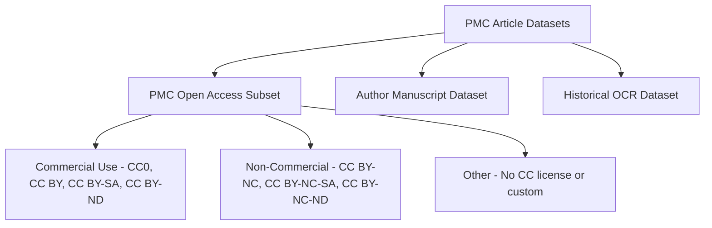

Downloading articles from PubMed Central (PMC) is a common need for researchers, data scientists, and anyone working with biomedical literature at scale. Whether you're training an ML model, doing a systematic review, or building a knowledge base, PMC offers several official channels to access full-text articles, metadata, and PDFs programmatically.

This guide covers every legitimate method available — from simple one-off downloads to bulk retrieval of millions of articles.

---

## Quick Comparison Table

| Method | Best For | Full Text | Metadata | Bulk | Rate Limit | API Key Helps? |
|--------|----------|-----------|----------|------|------------|----------------|
| FTP Service | Bulk download of entire datasets | ✅ | ✅ | ✅ | No limit (FTP speed) | ❌ |
| Cloud Service (AWS) | Fast, scalable access | ✅ | ✅ | ✅ | No limit (AWS speed) | ❌ |
| OAI-PMH API | Harvesting metadata + selective full text | ✅ | ✅ | ⚠️ (paginated) | 3 req/sec | ❌ |
| BioC API | Text mining, NLP | ✅ | ✅ | ✅ (FTP) | ~3 req/sec | ❌ |
| E-Utilities | Programmatic search + fetch | ✅ | ✅ | ⚠️ (batched) | 3 req/sec (10 w/ key) | ✅ |
| EDirect | Command-line scripting | ✅ | ✅ | ⚠️ (batched) | 3 req/sec (10 w/ key) | ✅ |
| OA Web Service | Finding download links | ⚠️ (links only) | ✅ | ⚠️ | 3 req/sec (10 w/ key) | ✅ |
| Biopython | Python integration | ✅ | ✅ | ⚠️ (batched) | 3 req/sec (10 w/ key) | ✅ |
| PubTator 3.0 API | Annotated text + entity relations | ✅ | ✅ | ✅ (FTP) | 3 req/sec | ❌ |
| Europe PMC API | Alternative to NCBI, global | ✅ | ✅ | ⚠️ (paginated) | No hard limit | ❌ |

---

## Table of Contents

- [Understanding PMC vs PubMed](#understanding-pmc-vs-pubmed)
- [Important: Copyright and Usage Restrictions](#important-copyright-and-usage-restrictions)
- [PMC Article Datasets Overview](#pmc-article-datasets-overview)
- [Method 1: FTP Service (Bulk Download)](#method-1-ftp-service-bulk-download)
- [Method 2: PMC Cloud Service (AWS)](#method-2-pmc-cloud-service-aws)
- [Method 3: OAI-PMH API](#method-3-oai-pmh-api)
- [Method 4: BioC API](#method-4-bioc-api)
- [Method 5: E-Utilities API](#method-5-e-utilities-api)
- [Method 6: EDirect (Command Line)](#method-6-edirect-command-line)
- [Method 7: OA Web Service API](#method-7-oa-web-service-api)
- [Method 8: Python with Biopython](#method-8-python-with-biopython)
- [Method 9: PubTator 3.0 API (Annotated Text + Entity Relations)](#method-9-pubtator-30-api-annotated-text--entity-relations)
- [Method 10: Europe PMC API](#method-10-europe-pmc-api)
- [Downloading PDFs](#downloading-pdfs)
- [Searching PMC by Term](#searching-pmc-by-term)
- [Community Tips and Tricks](#community-tips-and-tricks)
- [References](#references)

---

## Understanding PMC vs PubMed

Before diving in, it's important to understand the difference ([PMC User Guide](https://pmc.ncbi.nlm.nih.gov/about/userguide/)):

| Feature | PubMed | PubMed Central (PMC) |
|---------|--------|---------------------|
| Content | Citations and abstracts | Full-text articles |
| Coverage | ~36 million records | ~10 million articles |
| Full text | No (links to publishers) | Yes (XML, PDF, plain text) |
| Bulk download | Metadata only | Full text available for OA subset |

PMC is the free full-text archive of biomedical and life sciences journal literature at the U.S. National Institutes of Health's National Library of Medicine (NIH/NLM).

---

## Important: Copyright and Usage Restrictions

Not all articles in PMC are available for text mining or bulk download. The key rules ([PMC Copyright Notice](https://pmc.ncbi.nlm.nih.gov/about/copyright/)):

1. **Systematic downloading from the PMC web interface is prohibited** — your IP will be blocked.
2. Only these five core services are authorized for automated retrieval:
   - PMC Cloud Service
   - PMC OAI-PMH Service
   - PMC FTP Service
   - E-Utilities
   - BioC API

   > EDirect, Biopython, metapub, and the OA Web Service API are all clients/wrappers built on top of these core services — they're legitimate to use because they call the authorized services under the hood.

3. License terms vary per article — always check the license statement.
4. The **PMC Open Access Subset** contains articles with reuse-friendly licenses (Creative Commons).
5. Rate limits apply: max 3 requests per second for APIs; avoid peak hours (Mon–Fri, 5 AM – 9 PM ET) for bulk operations.

### How to Get a Free NCBI API Key

An API key increases your E-Utilities rate limit from 3 to 10 requests per second. It's free and takes 30 seconds ([registration page](https://www.ncbi.nlm.nih.gov/account/)):

1. Go to [https://www.ncbi.nlm.nih.gov/account/](https://www.ncbi.nlm.nih.gov/account/)
2. Sign in (or create an NCBI account)
3. Navigate to **Settings** → **API Key Management**
4. Click **Create an API Key**
5. Copy the key and use it in your requests:
   - URL parameter: `&api_key=YOUR_KEY`
   - EDirect environment variable: `export NCBI_API_KEY=YOUR_KEY`
   - Biopython: `Entrez.api_key = "YOUR_KEY"`

---

## PMC Article Datasets Overview

PMC provides three main datasets for text mining ([full details](https://pmc.ncbi.nlm.nih.gov/tools/textmining/)):



- **PMC Open Access Subset**: Articles with licenses allowing reuse (millions of articles) — [file list](https://pmc.ncbi.nlm.nih.gov/tools/openftlist/)
- **Author Manuscript Dataset**: NIH-funded author manuscripts — [details](https://pmc.ncbi.nlm.nih.gov/about/authorms/#dataset)
- **Historical OCR Dataset**: Scanned articles from 18th–20th centuries — [details](https://pmc.ncbi.nlm.nih.gov/about/scanning/)

---

## Method 1: FTP Service (Bulk Download)

The FTP service is ideal for downloading large volumes of articles in bulk packages. ([Official docs](https://pmc.ncbi.nlm.nih.gov/tools/ftp/))

**Base URL**: `https://ftp.ncbi.nlm.nih.gov/pub/pmc`

**Rate Limit**: No per-request rate limit — standard FTP/HTTPS transfer speeds apply. However, NCBI may throttle connections if you open too many simultaneous sessions.

> **Note (April 2026)**: All legacy files have been moved to a `deprecated/` directory. Legacy files will be removed in August 2026. Users should transition to the updated PMC Cloud Service on AWS.

### What's Available

| Type | Datasets | Formats |
|------|----------|---------|
| Bulk download | OA Subset, Author Manuscripts, Historical OCR | XML, plain text |
| Individual article | OA Subset only | XML, PDF, media, supplementary |
| PDF download | OA Subset (non-commercial only) | PDF |
| ID cross-reference | All PMC articles | CSV (PMC-ids.csv.gz) |

### Directory Structure

```
deprecated/
├── manuscript/
│   ├── txt/
│   └── xml/
├── oa_bulk/
│   ├── oa_comm/        # Commercial use allowed
│   │   ├── txt/
│   │   └── xml/
│   ├── oa_noncomm/     # Non-commercial only
│   │   ├── txt/
│   │   └── xml/
│   └── oa_other/       # No CC license
│       ├── txt/
│       └── xml/
├── oa_package/         # Individual article packages
└── oa_pdf/             # Individual PDFs
```

### Download Examples

```bash
# Download a bulk baseline package (commercial use, XML)
wget https://ftp.ncbi.nlm.nih.gov/pub/pmc/deprecated/oa_bulk/oa_comm/xml/oa_comm_xml.PMC003XXXXXX.baseline.2026-03-15.tar.gz

# Download the file list to find specific articles
wget https://ftp.ncbi.nlm.nih.gov/pub/pmc/deprecated/oa_bulk/oa_comm/xml/oa_comm_xml.PMC003XXXXXX.baseline.2026-03-15.filelist.csv

# Download an individual article package
wget https://ftp.ncbi.nlm.nih.gov/pub/pmc/deprecated/oa_package/66/8b/PMC555938.tar.gz

# Download the PMC ID cross-reference file
wget https://ftp.ncbi.nlm.nih.gov/pub/pmc/PMC-ids.csv.gz
```

### Baseline Update Schedule

New baselines are created at least twice per year (mid-June and mid-December). Daily incremental packages are available between baselines.

---

## Method 2: PMC Cloud Service (AWS)

The Cloud Service provides the same datasets as FTP but hosted on Amazon Web Services for faster, more reliable access. ([Official docs](https://pmc.ncbi.nlm.nih.gov/tools/cloud/) | [AWS access guide](https://pmc.ncbi.nlm.nih.gov/tools/pmcaws/))

### What's Included Per Article

- Metadata in JSON
- Full-text in JATS XML
- Full-text in plain text
- Full article PDF (when available)
- Media files (when available)
- Supplementary materials (when available)

### Access Methods

Articles are accessible via HTTPS or S3 URL — no login required, no charge.

**Rate Limit**: No NCBI-imposed rate limit. Governed by AWS S3/HTTPS throughput. You can download as fast as your network allows. No API key needed.

```bash
# Access via HTTPS (example structure)
# See https://pmc.ncbi.nlm.nih.gov/tools/pmcaws/ for current URL patterns

# Using AWS CLI (no credentials needed for public bucket)
aws s3 ls s3://pmc-oa-opendata/ --no-sign-request
```

### Update Frequency

Content is updated **continuously** — new articles, updates to existing articles, and occasional removals.

### Transition from FTP to Cloud Service

As of April 2026, the FTP service files have been moved to `deprecated/` directories. All legacy FTP files will be removed in **August 2026**. The Cloud Service on AWS is the recommended replacement ([NCBI Insights blog post](https://ncbiinsights.ncbi.nlm.nih.gov/2026/02/12/pmc-article-dataset-distribution-services/)):

- FTP bulk packages → AWS S3 objects organized by dataset and article
- FTP file lists → AWS CSV inventory file (updated daily)
- Individual article packages → Direct S3/HTTPS access per article

For full migration details, see [Accessing PMC Article Datasets Using AWS](https://pmc.ncbi.nlm.nih.gov/tools/pmcaws/).

### How to Cite

> NIH NLM NCBI PubMed Central (PMC) Article Datasets - Full-Text Biomedical and Life Sciences Journal Articles on AWS was accessed on [DATE] from https://registry.opendata.aws/ncbi-pmc.

---

## Method 3: OAI-PMH API

The OAI-PMH (Open Archives Initiative Protocol for Metadata Harvesting) API provides access to metadata for all PMC articles and full text for articles with reuse-friendly licenses. ([Official docs](https://pmc.ncbi.nlm.nih.gov/tools/oai/))

**Base URL**: `https://pmc.ncbi.nlm.nih.gov/api/oai/v1/mh/`

### Supported Formats

| Format | Prefix | Content |
|--------|--------|---------|
| JATS XML (metadata only) | `pmc_fm` | Front matter / metadata |
| JATS XML (full text) | `pmc` | Complete article text |
| Dublin Core | `oai_dc` | Basic metadata |

### OAI Identifiers

Format: `oai:pubmedcentral.nih.gov:<pmcid_number>`

Example: Article PMC12314748 → `oai:pubmedcentral.nih.gov:12314748`

### Key Operations

#### Identify the service

```
https://pmc.ncbi.nlm.nih.gov/api/oai/v1/mh/?verb=Identify
```

#### List available metadata formats

```
https://pmc.ncbi.nlm.nih.gov/api/oai/v1/mh/?verb=ListMetadataFormats
```

#### Get a single record (Dublin Core metadata)

```
https://pmc.ncbi.nlm.nih.gov/api/oai/v1/mh/?verb=GetRecord&identifier=oai:pubmedcentral.nih.gov:12124693&metadataPrefix=oai_dc
```

#### Get a single record (full-text XML)

```
https://pmc.ncbi.nlm.nih.gov/api/oai/v1/mh/?verb=GetRecord&identifier=oai:pubmedcentral.nih.gov:12124693&metadataPrefix=pmc
```

#### List identifiers by date range

```
https://pmc.ncbi.nlm.nih.gov/api/oai/v1/mh/?verb=ListIdentifiers&from=2025-07-01&metadataPrefix=pmc_fm
```

#### List records for a specific journal

```
https://pmc.ncbi.nlm.nih.gov/api/oai/v1/mh/?verb=ListRecords&from=2025-03-22&until=2025-06-12&set=bmj&metadataPrefix=pmc
```

#### Get only Open Access articles

Use the parameter `set=pmc-open` to filter for articles whose full text is available for reuse.

### Pagination

- `ListIdentifiers`: returns max 50 per request
- `ListRecords`: returns max 10 per request
- Use the `resumptionToken` from the response to get the next page

```
https://pmc.ncbi.nlm.nih.gov/api/oai/v1/mh/?verb=ListRecords&resumptionToken=<token_value>
```

### Rate Limits

- Max **3 requests per second** (hard limit — API keys do not apply to OAI-PMH)
- Requests exceeding the limit receive an error response
- Use HTTP compression (`Accept-Encoding: gzip, deflate`) for efficient transfer
- Avoid peak hours (Mon–Fri, 5 AM – 9 PM ET) for scripts making 100+ requests
- Do not make concurrent requests, even at off-peak times

> **Note**: Unlike E-Utilities, the OAI-PMH service does not support API keys for increased rate limits. The 3 req/sec cap is fixed.

---

## Method 4: BioC API

The BioC API provides PMC Open Access articles in BioC format — a simple, structured format designed for text mining and NLP tasks. ([Official docs](https://www.ncbi.nlm.nih.gov/research/bionlp/APIs/BioC-PMC/))

### API URL Pattern

```
https://www.ncbi.nlm.nih.gov/research/bionlp/RESTful/pmcoa.cgi/BioC_[format]/[ID]/[encoding]
```

Parameters:
- **format**: `xml` or `json`
- **ID**: PubMed ID (e.g., `17299597`) or PMC ID (e.g., `PMC1790863`)
- **encoding**: `unicode` or `ascii`

### Examples

```bash
# Get article in BioC XML format using PubMed ID
curl "https://www.ncbi.nlm.nih.gov/research/bionlp/RESTful/pmcoa.cgi/BioC_xml/17299597/unicode"

# Get article in BioC JSON format
curl "https://www.ncbi.nlm.nih.gov/research/bionlp/RESTful/pmcoa.cgi/BioC_json/17299597/unicode"

# Get article using PMC ID
curl "https://www.ncbi.nlm.nih.gov/research/bionlp/RESTful/pmcoa.cgi/BioC_xml/PMC1790863/unicode"

# ASCII encoding (useful when Unicode causes issues)
curl "https://www.ncbi.nlm.nih.gov/research/bionlp/RESTful/pmcoa.cgi/BioC_xml/17299597/ascii"
```

### Bulk Download (BioC format)

All BioC-formatted PMC articles can be downloaded from FTP ([browse](https://ftp.ncbi.nlm.nih.gov/pub/wilbur/BioC-PMC)):

```
https://ftp.ncbi.nlm.nih.gov/pub/wilbur/BioC-PMC
```

### Rate Limits

- No explicit per-second rate limit documented for the BioC RESTful API specifically
- For bulk FTP download (`ftp.ncbi.nlm.nih.gov/pub/wilbur/BioC-PMC`): no rate limit (standard FTP)
- For the RESTful API: follow general NCBI courtesy guidelines — keep to ~3 requests/sec
- NCBI API keys do **not** increase the rate limit for this specific service; the limit is fixed at 3 req/sec.
- Avoid hammering the service; add a small delay (~0.5s) between requests in scripts

### When to Use BioC

- Text mining and NLP pipelines
- Named entity recognition
- Relation extraction
- When you need a simpler format than JATS XML

---

## Method 5: E-Utilities API

NCBI's E-Utilities (Entrez Programming Utilities) provide programmatic access to all NCBI databases including PubMed and PMC. ([Official docs](https://www.ncbi.nlm.nih.gov/books/NBK25499/) | [Data guide](https://www.nlm.nih.gov/dataguide/eutilities/utilities.html))

**Base URL**: `https://eutils.ncbi.nlm.nih.gov/entrez/eutils/`

### Key Utilities

| Utility | Purpose |
|---------|---------|
| `esearch` | Search a database, returns list of IDs |
| `efetch` | Download records in various formats |
| `esummary` | Get document summaries |
| `einfo` | Get database statistics and fields |
| `elink` | Find related records across databases |

### Search and Fetch Workflow

```bash
# Step 1: Search PMC for articles about "CRISPR"
curl "https://eutils.ncbi.nlm.nih.gov/entrez/eutils/esearch.fcgi?db=pmc&term=CRISPR&retmax=5&retmode=json&tool=my_script&email=myemail@example.com"

# Step 2: Fetch full-text XML for a specific PMC article
curl "https://eutils.ncbi.nlm.nih.gov/entrez/eutils/efetch.fcgi?db=pmc&id=1790863&rettype=xml&tool=my_script&email=myemail@example.com"

# Search PubMed for abstracts
curl "https://eutils.ncbi.nlm.nih.gov/entrez/eutils/esearch.fcgi?db=pubmed&term=machine+learning+cancer&retmax=10&retmode=json&tool=my_script&email=myemail@example.com"

# Fetch PubMed records in MEDLINE format
curl "https://eutils.ncbi.nlm.nih.gov/entrez/eutils/efetch.fcgi?db=pubmed&id=27460563,27298442&rettype=medline&retmode=text&tool=my_script&email=myemail@example.com"
```

### Rate Limits

- **Without API key**: 3 requests per second
- **With API key**: 10 requests per second
- Exceeding the limit returns HTTP 429 (Too Many Requests)
- For large result sets, use `retmax` (max 10,000) with `retstart` for pagination
- NCBI may block IPs that consistently exceed limits

### Best Practices

- Register for an API key at [NCBI](https://www.ncbi.nlm.nih.gov/account/) — it's free and triples your rate limit
- Always include `&api_key=YOUR_KEY` in requests
- Use `retmax` and `retstart` for pagination
- Store results locally to avoid repeated requests
- Add `&usehistory=y` for large searches to avoid re-sending ID lists

---

## Method 6: EDirect (Command Line)

EDirect (Entrez Direct) is a set of command-line tools for accessing NCBI databases from a Unix terminal. It's the most powerful option for scripting complex queries. ([Official docs](https://www.ncbi.nlm.nih.gov/books/NBK179288/) | [Sample code](https://www.nlm.nih.gov/dataguide/classes/edirect-for-pubmed/samplecode1.html))

### Installation

```bash
# Install EDirect
sh -c "$(curl -fsSL https://ftp.ncbi.nlm.nih.gov/entrez/entrezdirect/install-edirect.sh)"

# Add to PATH
export PATH=${HOME}/edirect:${PATH}
```

### Usage Examples

```bash
# Search PubMed and fetch results
esearch -db pubmed -query "breast cancer AND 2024[PDAT]" | efetch -format xml > results.xml

# Search and get MEDLINE format
esearch -db pubmed -query "CRISPR[Title]" -datetype PDAT -mindate 2023 -maxdate 2024 | \
  efetch -format medline > crispr_articles.txt

# Search PMC for full-text articles
esearch -db pmc -query "deep learning radiology" | efetch -format xml > pmc_articles.xml

# Get specific fields using xtract
esearch -db pubmed -query "COVID-19 vaccine" -datetype PDAT -mindate 2023 | \
  efetch -format xml | \
  xtract -pattern PubmedArticle -element MedlineCitation/PMID ArticleTitle

# Download abstracts for a list of PMIDs
efetch -db pubmed -id 27460563,27298442,27392493 -format abstract

# Count results
esearch -db pmc -query "machine learning" | xtract -pattern ENTREZ_DIRECT -element Count
```

### Rate Limits

- Same as E-Utilities: 3 requests/sec without API key, 10/sec with key
- EDirect handles rate limiting internally when piping commands
- For large downloads, EDirect automatically batches requests
- Set your API key via environment variable: `export NCBI_API_KEY=YOUR_KEY`

### EDirect Advantages

- Pipe commands together for complex workflows
- Extract specific fields with `xtract`
- Combine with Unix tools (`sort`, `uniq`, `awk`, etc.)
- Build reproducible scripts for repeated queries

---

## Method 7: OA Web Service API

The OA Web Service API helps discover downloadable resources from the PMC Open Access Subset. It provides metadata and download links for individual articles. ([Official docs](https://pmc.ncbi.nlm.nih.gov/tools/oa-service/))

**Base URL**: `https://www.ncbi.nlm.nih.gov/pmc/utils/oa/oa.fcgi`

### Query by PMC ID

```bash
# Get download links for a specific article
curl "https://www.ncbi.nlm.nih.gov/pmc/utils/oa/oa.fcgi?id=PMC555938&tool=my_script&email=myemail@example.com"

# Or with an API key for higher rate limits
curl "https://www.ncbi.nlm.nih.gov/pmc/utils/oa/oa.fcgi?id=PMC555938&tool=my_script&email=myemail@example.com&api_key=YOUR_KEY"
```

### Query by Date Range

```bash
# Find articles added/updated since a date
curl "https://www.ncbi.nlm.nih.gov/pmc/utils/oa/oa.fcgi?from=2024-01-01&until=2024-01-31&tool=my_script&email=myemail@example.com"
```

The response includes FTP links to `.tar.gz` packages containing XML, PDF, and supplementary files.

### Rate Limits

- No separately documented rate limit; follows general NCBI policy (3 req/sec without key, 10/sec with key)
- Designed for targeted lookups rather than bulk harvesting
- For bulk needs, use FTP or Cloud Service instead

---

## Method 8: Python with Biopython

Biopython's `Bio.Entrez` module provides a clean Python interface to NCBI's E-Utilities. ([Biopython Entrez docs](https://biopython.org/docs/latest/Tutorial/chapter_entrez.html))

### Installation

```bash
pip install biopython
```

### Search and Download Abstracts

```python
from Bio import Entrez, Medline

# Always identify yourself
Entrez.email = "your.email@example.com"
# Entrez.api_key = "YOUR_API_KEY"  # Optional: for higher rate limits

# Search PubMed (Note: This searches abstracts only. For PMC full text, use db="pmc")
def search_pubmed(query, max_results=10):
    handle = Entrez.esearch(db="pubmed", term=query, retmax=max_results)
    results = Entrez.read(handle)
    handle.close()
    return results["IdList"]

# Fetch article details
def fetch_details(id_list):
    ids = ",".join(id_list)
    handle = Entrez.efetch(db="pubmed", id=ids, rettype="medline", retmode="text")
    records = Medline.parse(handle)
    return list(records)

# Example usage
pmids = search_pubmed("CRISPR gene editing 2024")
articles = fetch_details(pmids)

for article in articles:
    print(f"Title: {article.get('TI', 'N/A')}")
    print(f"Authors: {', '.join(article.get('AU', []))}")
    print(f"Source: {article.get('SO', 'N/A')}")
    print(f"PMID: {article.get('PMID', 'N/A')}")
    print("---")
```

### Download Full-Text XML from PMC

```python
from Bio import Entrez

Entrez.email = "your.email@example.com"

def download_pmc_fulltext(pmc_id):
    """Download full-text XML for a PMC article."""
    handle = Entrez.efetch(db="pmc", id=pmc_id, rettype="xml")
    xml_content = handle.read()
    handle.close()
    return xml_content

# Download and save
xml = download_pmc_fulltext("1790863")
with open("PMC1790863.xml", "wb") as f:
    f.write(xml)
```

### Bulk Download with Rate Limiting

```python
import time
from Bio import Entrez

Entrez.email = "your.email@example.com"

def bulk_search_and_download(query, output_dir="./articles", batch_size=100, max_results=1000):
    """Search PMC and download articles in batches."""
    import os
    os.makedirs(output_dir, exist_ok=True)

    # Set API key for 10 req/sec (optional but recommended)
    api_key = os.environ.get("NCBI_API_KEY")
    if api_key:
        Entrez.api_key = api_key
        sleep_time = 0.11 # 10 req/sec
    else:
        sleep_time = 0.34 # 3 req/sec

    # First, get total count
    handle = Entrez.esearch(db="pmc", term=query, retmax=0)
    results = Entrez.read(handle)
    handle.close()
    total = int(results["Count"])
    print(f"Found {total} articles")

    # Download in batches
    for start in range(0, min(total, max_results), batch_size):
        handle = Entrez.esearch(db="pmc", term=query, retmax=batch_size, retstart=start)
        results = Entrez.read(handle)
        handle.close()

        ids = results["IdList"]
        for pmc_id in ids:
            try:
                handle = Entrez.efetch(db="pmc", id=pmc_id, rettype="xml")
                content = handle.read()
                handle.close()

                filepath = os.path.join(output_dir, f"PMC{pmc_id}.xml")
                with open(filepath, "wb") as f:
                    f.write(content)
                print(f"Downloaded PMC{pmc_id}")

                time.sleep(sleep_time)  # Respect rate limit based on API key presence
            except Exception as e:
                print(f"Error downloading PMC{pmc_id}: {e}")

# Usage
bulk_search_and_download("deep learning radiology[Title]")
```

### Using the metapub Library

metapub is a convenience wrapper around E-Utilities, so the same rate limits apply (3 req/sec without key, 10/sec with key).

```python
# pip install metapub
from metapub import PubMedFetcher

fetch = PubMedFetcher()

# Fetch by PMID
article = fetch.article_by_pmid(27460563)
print(f"Title: {article.title}")
print(f"Abstract: {article.abstract}")
print(f"DOI: {article.doi}")
print(f"PMC ID: {article.pmc}")
```

---


## Method 9: PubTator 3.0 API (Annotated Text + Entity Relations)

PubTator 3.0 is an AI-powered literature resource that provides full-text articles with pre-annotated biomedical entities and their relations. It covers 35+ million PubMed abstracts and ~6 million PMC full-text articles. Ideal when you need not just the text but also named entity recognition and relation extraction out of the box. ([Official site](https://www.ncbi.nlm.nih.gov/research/pubtator3/) | [API docs](https://www.ncbi.nlm.nih.gov/research/pubtator3/api) | [Paper](https://academic.oup.com/nar/article/52/W1/W540/7640526))

**Base URL**: `https://www.ncbi.nlm.nih.gov/research/pubtator3-api/`

### Entity Types Annotated

| Entity Type | Example | Identifier Source |
|-------------|---------|-------------------|
| Gene | BRCA1, TP53 | NCBI Gene ID |
| Disease | Breast cancer, Diabetes | MeSH |
| Chemical | Metformin, Doxorubicin | MeSH |
| Species | Human, Mouse | NCBI Taxonomy |
| Mutation/Variant | V600E, rs1234 | dbSNP, tmVar |
| CellLine | HeLa, MCF-7 | Cellosaurus |

### API Endpoints

#### 1. Export Annotations for Publications

Export annotated articles in PubTator, BioC-XML, or BioC-JSON format.

```bash
# Get annotated abstract by PMID (BioC XML)
curl "https://www.ncbi.nlm.nih.gov/research/pubtator3-api/publications/export/biocxml?pmids=27460563&tool=my_script&email=myemail@example.com"

# Get annotated abstract by PMID (BioC JSON)
curl "https://www.ncbi.nlm.nih.gov/research/pubtator3-api/publications/export/biocjson?pmids=27460563&tool=my_script&email=myemail@example.com"

# Get annotated abstract in PubTator format
curl "https://www.ncbi.nlm.nih.gov/research/pubtator3-api/publications/export/pubtator?pmids=27460563&tool=my_script&email=myemail@example.com"

# Multiple PMIDs (comma-separated)
curl "https://www.ncbi.nlm.nih.gov/research/pubtator3-api/publications/export/biocjson?pmids=27460563,27298442,27392493&tool=my_script&email=myemail@example.com"

# Get FULL TEXT (not just abstract) by PMID
curl "https://www.ncbi.nlm.nih.gov/research/pubtator3-api/publications/export/biocxml?pmids=29355051&full=true&tool=my_script&email=myemail@example.com"

# Get full text by PMC ID
curl "https://www.ncbi.nlm.nih.gov/research/pubtator3-api/publications/pmc_export/biocxml?pmcids=PMC7696669,PMC8869656&tool=my_script&email=myemail@example.com"
```

> **Note**: Full-text export is available in `biocxml` and `biocjson` formats only, not in `pubtator` format.

#### 2. Find Entity IDs (Autocomplete)

Look up standardized entity identifiers by free-text name.

```bash
# Find entity ID for "cancer" (disease type)
curl "https://www.ncbi.nlm.nih.gov/research/pubtator3-api/entity/autocomplete/?query=cancer&concept=disease&limit=10"

# Find entity ID for "BRCA1" (gene)
curl "https://www.ncbi.nlm.nih.gov/research/pubtator3-api/entity/autocomplete/?query=BRCA1&concept=gene&limit=5"

# Search without specifying concept type
curl "https://www.ncbi.nlm.nih.gov/research/pubtator3-api/entity/autocomplete/?query=metformin&limit=10"
```

#### 3. Search Publications by Entity or Relation

Search for articles mentioning specific entities or entity relations.

```bash
# Search by entity ID
curl "https://www.ncbi.nlm.nih.gov/research/pubtator3-api/search/?text=@CHEMICAL_remdesivir"

# Search by two entities (AND)
curl "https://www.ncbi.nlm.nih.gov/research/pubtator3-api/search/?text=@CHEMICAL_Doxorubicin%20AND%20@DISEASE_Neoplasms"

# Search by relation between two specific entities
curl "https://www.ncbi.nlm.nih.gov/research/pubtator3-api/search/?text=relations:treat|@CHEMICAL_Doxorubicin|@DISEASE_Neoplasms"

# Search by relation between entity and entity TYPE
curl "https://www.ncbi.nlm.nih.gov/research/pubtator3-api/search/?text=relations:ANY|@CHEMICAL_Doxorubicin|DISEASE"

# Pagination
curl "https://www.ncbi.nlm.nih.gov/research/pubtator3-api/search/?text=@CHEMICAL_remdesivir&page=2"
```

#### 4. Find Related Entities

Discover entities related to a given entity through specific relation types.

```bash
# Find chemicals that negatively correlate with JAK1 gene
curl "https://www.ncbi.nlm.nih.gov/research/pubtator3-api/relations?e1=@GENE_JAK1&type=negative_correlate&e2=Chemical"

# Find diseases treated by Metformin
curl "https://www.ncbi.nlm.nih.gov/research/pubtator3-api/relations?e1=@CHEMICAL_Metformin&type=treat&e2=Disease"
```

**Available relation types**: `treat`, `cause`, `cotreat`, `convert`, `compare`, `interact`, `associate`, `positive_correlate`, `negative_correlate`, `prevent`, `inhibit`, `stimulate`, `drug_interact`

#### 5. Annotate Your Own Text

Submit custom text for NER annotation using PubTator's models.

```bash
# Submit text for annotation
curl -X POST "https://www.ncbi.nlm.nih.gov/CBBresearch/Lu/Demo/RESTful/request.cgi" \
  -H "Content-Type: application/x-www-form-urlencoded" \
  -d "text=The ESR1 Mutations: From Bedside to Bench to Bedside.&bioconcept=Gene"
# Returns a session ID

# Retrieve results (may return 404 until processing completes)
curl -X POST "https://www.ncbi.nlm.nih.gov/CBBresearch/Lu/Demo/RESTful/retrieve.cgi" \
  -H "Content-Type: application/x-www-form-urlencoded" \
  -d "id=YOUR_SESSION_ID"
```

### Bulk Download (FTP)

For large-scale access, download all PubTator3 annotations from FTP ([browse](https://ftp.ncbi.nlm.nih.gov/pub/lu/PubTator3)):

```bash
# All annotations in PubTator, BioC-XML, and BioC-JSON formats
wget -r https://ftp.ncbi.nlm.nih.gov/pub/lu/PubTator3/
```

### Rate Limits

- **Max 3 requests per second** (explicitly stated in official docs)
- API keys are not supported — the 3 req/sec limit is fixed
- For bulk needs, use the FTP download instead of the API
- The "Annotate Your Own Text" endpoint is asynchronous (submit then poll for results)

### BioThings PubTator3 API (Alternative Access)

The [BioThings PubTator3 API](https://smart-api.info/ui/5ddb2a7fa13c691d390f748e5a992e9f) provides an alternative interface for querying PubTator3 entity associations. It's useful for programmatic access to literature-based associations between biomedical entities.

```bash
# Query associations via BioThings
curl "https://biothings.ncats.io/pubtator3/query?q=object.id:NCBIGene:672&size=10"

# Get specific association by ID
curl "https://biothings.ncats.io/pubtator3/association/SOME_ID"
```

### Integration with GPTs / LLMs

The [pubtator-gpt](https://github.com/ncbi-nlp/pubtator-gpt) project provides an OpenAPI schema for integrating PubTator3 as a custom GPT action in ChatGPT or other LLM tools. This enables natural language queries like "What chemicals treat breast cancer?" backed by PubTator3's annotated literature. A [tutorial notebook](https://colab.research.google.com/drive/1wClPzdU3wxqcR5oGW2mPm1efSdv6CFLf?usp=sharing) is also available for getting started with the API in Python.

### Use Cases

- **NLP pipelines**: Get pre-annotated training data for biomedical NER
- **Knowledge graphs**: Extract entity-relation triples from literature at scale
- **Drug repurposing**: Find chemicals related to diseases via relation queries
- **Literature reviews**: Search by normalized entities instead of text keywords
- **Gene-disease associations**: Discover gene-disease links with evidence PMIDs
- **LLM augmentation**: Use as a retrieval tool for RAG pipelines in biomedical AI

### How to Cite

> Wei CH, Allot A, Lai PT, Leaman R, Tian S, Luo L, Jin Q, Wang Z, Chen Q, Lu Z. PubTator 3.0: an AI-powered literature resource for unlocking biomedical knowledge. Nucleic Acids Res. 2024;52(W1):W540-W546.

---

## Method 10: Europe PMC API

Europe PMC ([europepmc.org](https://europepmc.org)) mirrors PMC content and adds articles from other sources (preprints, patents, clinical guidelines). It offers a REST API that's often easier to use than NCBI's E-Utilities. ([REST API docs](https://europepmc.org/RestfulWebService) | [Developer resources](https://europepmc.org/developers))

**Base URL**: `https://www.ebi.ac.uk/europepmc/webservices/rest/`

### Search Articles

```bash
# Search by keyword (returns JSON by default)
curl "https://www.ebi.ac.uk/europepmc/webservices/rest/search?query=CRISPR+gene+editing&format=json&pageSize=10"

# Search with date filter
curl "https://www.ebi.ac.uk/europepmc/webservices/rest/search?query=machine+learning+AND+FIRST_PDATE:[2024-01-01+TO+2024-12-31]&format=json"

# Search only open access articles
curl "https://www.ebi.ac.uk/europepmc/webservices/rest/search?query=CRISPR+AND+OPEN_ACCESS:y&format=json"
```

### Get Full Text

```bash
# Get full text in XML (by PMC ID)
curl "https://www.ebi.ac.uk/europepmc/webservices/rest/PMC1790863/fullTextXML"

# Get full text in JSON
curl "https://www.ebi.ac.uk/europepmc/webservices/rest/search?query=EXT_ID:1790863+AND+SRC:PMC&resultType=core&format=json"
```

### Bulk Download

Europe PMC provides bulk downloads via FTP and the Open Access subset ([FTP info](https://europepmc.org/FtpSite)):

```bash
# FTP access for bulk metadata and full text
# https://europepmc.org/ftp/oa/
```

### Rate Limits

- No hard per-second rate limit documented
- Europe PMC is generally more permissive than NCBI for automated access
- Recommended: keep requests reasonable (~10 req/sec max)
- No API key required

### Advantages Over NCBI PMC

- Simpler REST API with JSON responses
- Includes preprints (e.g., bioRxiv, medRxiv)
- Includes patent abstracts and clinical guidelines
- Annotations and text-mined entities included in responses
- More permissive rate limiting
- Covers the same PMC Open Access content plus additional European sources

---

## Downloading PDFs

PDFs are only available for a subset of PMC articles. Here are the ways to get them ([NCBI guide](https://www.ncbi.nlm.nih.gov/guide/howto/obtain-full-text/)):

### From Cloud Service (AWS)

The Cloud Service includes PDFs when available — this is the recommended approach for new projects:

```bash
# PDFs are included per-article in the Cloud Service
# Access via S3 or HTTPS — see https://pmc.ncbi.nlm.nih.gov/tools/pmcaws/ for URL patterns
aws s3 ls s3://pmc-oa-opendata/ --no-sign-request
```

### From FTP (Non-Commercial Use Only)

> [!WARNING]
> **Deprecation Notice**: The `deprecated/` paths below will be removed in August 2026. Transition to the Cloud Service for reliable long-term access.

Individual PDFs are available for non-commercial licensed articles:

```bash
# Check the file list first
wget https://ftp.ncbi.nlm.nih.gov/pub/pmc/deprecated/oa_non_comm_use_pdf.csv

# Download a specific PDF
wget https://ftp.ncbi.nlm.nih.gov/pub/pmc/deprecated/oa_pdf/<path>/filename.PMCXXXXXXX.pdf
```

### From Individual Article Packages

Each `.tar.gz` package from the OA Subset includes the PDF (if available):

```bash
# Download article package
wget https://ftp.ncbi.nlm.nih.gov/pub/pmc/deprecated/oa_package/66/8b/PMC555938.tar.gz

# Extract
tar -xzf PMC555938.tar.gz
# PDF will be inside if available
```

### Using OA Web Service API

```bash
# Query for download links (includes PDF link if available)
curl "https://www.ncbi.nlm.nih.gov/pmc/utils/oa/oa.fcgi?id=PMC555938"
```

---

## Searching PMC by Term

### Via E-Utilities (URL)

See [E-Utilities docs](https://www.ncbi.nlm.nih.gov/books/NBK25499/) for full parameter reference.

```bash
# Search for articles about "machine learning" in cancer research
curl "https://eutils.ncbi.nlm.nih.gov/entrez/eutils/esearch.fcgi?db=pmc&term=machine+learning+cancer&retmax=20&retmode=json"
```

### Via EDirect (Command Line)

```bash
# Search with date filters
esearch -db pmc -query "artificial intelligence AND diagnosis" \
  -datetype PDAT -mindate 2023 -maxdate 2024

# Search with field tags
esearch -db pmc -query "CRISPR[Title] AND review[Publication Type]"
```

### Common Search Fields

| Field | Tag | Example |
|-------|-----|---------|
| Title | `[Title]` | `CRISPR[Title]` |
| Author | `[Author]` | `Smith J[Author]` |
| Journal | `[Journal]` | `Nature[Journal]` |
| Publication Date | `[PDAT]` | `2024[PDAT]` |
| MeSH Terms | `[MeSH]` | `Neoplasms[MeSH]` |
| Publication Type | `[PT]` | `Review[PT]` |
| Open Access | `[Filter]` | `open access[Filter]` |

### Advanced Search Syntax

```bash
# Combine terms with Boolean operators
esearch -db pmc -query "(COVID-19 OR SARS-CoV-2) AND vaccine AND 2024[PDAT]"

# Filter by open access
esearch -db pmc -query "deep learning AND open access[Filter]"

# Date range
esearch -db pmc -query "genomics" -datetype PDAT -mindate 2023/01/01 -maxdate 2024/12/31
```

---

## Community Tips and Tricks

Based on discussions from researchers and developers ([Biostars](https://www.biostars.org/p/2076/) | [Stack Overflow](https://stackoverflow.com/questions/47293387/downloading-all-full-text-articles-in-pmc-and-pubmed-databases) | [MSK Library](https://library.mskcc.org/blog/2023/10/systematic-bulk-downloading-of-articles-from-pubmed-central-pmc/)):

1. **Start with the file lists** — Before downloading bulk packages, grab the CSV file lists to identify exactly which articles you need.

2. **Use the PMC ID cross-reference file** (`PMC-ids.csv.gz`) to map between PMC IDs, PubMed IDs, DOIs, and manuscript IDs.

3. **For ML/AI training data**, the Commercial Use subset (`oa_comm`) gives you the most permissive licensing.

4. **Don't scrape the web interface** — PMC will block your IP. Always use the official APIs and services listed above.

5. **Register for an API key** — It's free and increases your E-Utilities rate limit from 3 to 10 requests per second.

6. **Use the Cloud Service for new projects** — The FTP service is being deprecated (August 2026). The AWS-based Cloud Service is the future.

7. **For individual articles**, the BioC API is the simplest — one URL gives you structured full text in JSON or XML.

8. **Europe PMC** ([europepmc.org](https://europepmc.org)) is an alternative that mirrors PMC content and adds preprints, patents, and clinical guidelines. See [Method 10](#method-10-europe-pmc-api) for details.

9. **Check article availability first** — Not every PMC article is in the Open Access Subset. Use the OA file lists or OA Web Service API to verify.

10. **For systematic reviews**, combine E-Utilities search with FTP bulk download — search to get IDs, then download packages for matching articles.

11. **PubTator3 for entity-aware search** — If you need articles about specific genes, diseases, or chemicals, PubTator3's entity search is more precise than keyword search because it normalizes synonyms.

---

## References

- [PMC OAI-PMH API Documentation](https://pmc.ncbi.nlm.nih.gov/tools/oai/)
- [PMC FTP Service](https://pmc.ncbi.nlm.nih.gov/tools/ftp/)
- [PMC Cloud Service](https://pmc.ncbi.nlm.nih.gov/tools/cloud/)
- [PMC Article Datasets](https://pmc.ncbi.nlm.nih.gov/tools/textmining/)
- [BioC API for PMC Open Access](https://www.ncbi.nlm.nih.gov/research/bionlp/APIs/BioC-PMC/)
- [E-Utilities Documentation](https://www.ncbi.nlm.nih.gov/books/NBK25499/)
- [EDirect Documentation](https://www.ncbi.nlm.nih.gov/books/NBK179288/)
- [OA Web Service API](https://pmc.ncbi.nlm.nih.gov/tools/oa-service/)
- [PubTator 3.0](https://www.ncbi.nlm.nih.gov/research/pubtator3/)
- [PubTator 3.0 API Documentation](https://www.ncbi.nlm.nih.gov/research/pubtator3/api)
- [PubTator 3.0 FTP Bulk Download](https://ftp.ncbi.nlm.nih.gov/pub/lu/PubTator3)
- [BioThings PubTator3 API (SmartAPI)](https://smart-api.info/ui/5ddb2a7fa13c691d390f748e5a992e9f)
- [pubtator-gpt (GitHub)](https://github.com/ncbi-nlp/pubtator-gpt)
- [PubTator Central API Card (UCLA)](https://pinglab-utils.github.io/APIcard/pubtator-central-api/)
- [PubTator Central on bio.tools](https://bio.tools/PubTator_Central)
- [Wei et al. 2024 - PubTator 3.0 Paper (Nucleic Acids Res)](https://academic.oup.com/nar/article/52/W1/W540/7640526)
- [Europe PMC REST API](https://europepmc.org/RestfulWebService)
- [Accessing PMC Datasets on AWS](https://pmc.ncbi.nlm.nih.gov/tools/pmcaws/)
- [PMC Copyright Notice](https://pmc.ncbi.nlm.nih.gov/about/copyright/)
- [NCBI How To: Obtain Full Text](https://www.ncbi.nlm.nih.gov/guide/howto/obtain-full-text/)
- [NCBI API Key Registration](https://www.ncbi.nlm.nih.gov/account/)
- [MSK Library: Systematic Bulk Downloading from PMC](https://library.mskcc.org/blog/2023/10/systematic-bulk-downloading-of-articles-from-pubmed-central-pmc/)
- [Biostars: Downloading PubMed Articles](https://www.biostars.org/p/2076/)
- [Stack Overflow: Downloading Full-Text Articles in PMC](https://stackoverflow.com/questions/47293387/downloading-all-full-text-articles-in-pmc-and-pubmed-databases)
