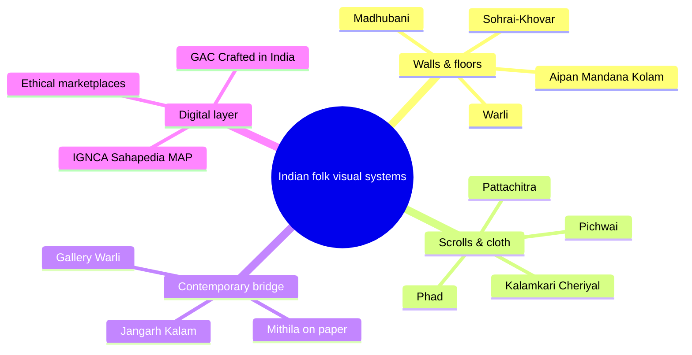

India’s “mainstream” art story often starts in academies and metropolitan galleries. Parallel to that runs another system: **ritual wall painting, scroll narration, floor diagrams, and community visual languages** that encode farming calendars, cosmology, marriage rites, and local ecology. Warli of Maharashtra is the best-known entry point for many urban Indians — but nearly every state holds related (or equally deep) traditions.

This guide treats those traditions as **cultural systems**, not wallpaper motifs: who paints, on what surface, for which ritual, how the form entered the market, who documented it, and where you can still learn or buy **ethically**. It opens with a Warli deep dive, then maps major painting / mural / scroll systems **state by state**, and closes with researchers, museums, websites, and apps.

> **Ethics note:** Many of these arts are Adivasi or caste-community knowledge systems. Buying mass-printed “Warli” phone cases from anonymous factories rarely funds painters in Palghar. Prefer GI-aware makers, Craftmark-linked groups, known artist cooperatives, and platforms that name the artisan and region. Cite researchers; do not scrape sacred ritual imagery for AI training dumps without community consent.

## TL;DR

| If you want… | Start here |
| ------------ | ---------- |
| **Understand Warli as culture, not logo** | Section [Warli system (Maharashtra–Gujarat border)](#warli-system-maharashtragujarat-border) + Yashodhara Dalmia’s *The Painted World of the Warlis* |
| **Browse many crafts visually** | [Google Arts & Culture — Crafted in India](https://artsandculture.google.com/project/crafted-in-india) |
| **Read reliable encyclopedic entries** | [MAP Academy](https://mapacademy.io/) · [Sahapedia](https://www.sahapedia.org/) · [IGNCA](https://ignca.gov.in/) |
| **Buy with provenance** | [MeMeraki](https://www.memeraki.com/) · [iTokri](https://itokri.com/) · [Gaatha](https://gaatha.com/) · Craftmark-aware sellers |
| **State → art cheat sheet** | [State-by-state painting systems](#state-by-state-painting--visual-systems) |
| **People who shaped the field** | [Researchers, cultural brokers & master artists](#researchers-cultural-brokers--master-artists) |

## Table of Contents

- [TL;DR](#tldr)
- [What “alternative art systems” means here](#what-alternative-art-systems-means-here)
- [Warli system (Maharashtra–Gujarat border)](#warli-system-maharashtragujarat-border)
- [State-by-state painting & visual systems](#state-by-state-painting--visual-systems)
- [Cross-cutting floor & ephemeral arts](#cross-cutting-floor--ephemeral-arts)
- [Digital platforms, museums & apps](#digital-platforms-museums--apps)
- [Researchers, cultural brokers & master artists](#researchers-cultural-brokers--master-artists)
- [How to study or support without extracting](#how-to-study-or-support-without-extracting)
- [FAQ](#faq)
- [References](#references)

## What “alternative art systems” means here

```mermaid
flowchart LR
    subgraph Living["Living community system"]
        R[Ritual / season / story]
        S[Surface: wall, floor, cloth, scroll]
        M[Materials: rice paste, earth, natural dye]
        C[Community roles: women, bhopa, chitrakar…]
    end

    subgraph Bridge["1970s–90s bridge"]
        B[Activists / officers / museums]
        P[Paper & canvas transfer]
        G[Galleries & GI tags]
    end

    subgraph Today["Today"]
        D[Digital archives & marketplaces]
        E[Education & tourism]
        A[Appropriation risk]
    end

    Living --> Bridge --> Today
```

These systems typically share:

1. **Function before “artwork”** — marriage walls, harvest thanks, epic performance props  
2. **Local materials and geometry** — circles/triangles (Warli), fish-eye motifs (Madhubani), signature fill patterns (Gond *Jangarh Kalam*)  
3. **A modern bridge moment** — drought-relief / museum scouts / HHEC officers in the 1960s–80s moved many forms onto paper (Warli, Mithila, Gond)  
4. **Ongoing negotiation** — tourism, GI tags, copyright-like claims, gender shifts (e.g. Warli men entering a historically women’s wall practice after market fame)

## Warli system (Maharashtra–Gujarat border)

### Where and who

| Item | Detail |
| ---- | ------ |
| **Community** | Warli (also spelled Varli) Adivasi |
| **Core geography** | Northern Sahyadri — **Palghar** district pockets (Dahanu, Talasari, Jawhar, Mokhada, Vikramgad…), adjoining **southern Gujarat** |
| **Classical surface** | Mud / cow-dung plastered hut walls; rice-flour (or white pigment) lines |
| **Visual grammar** | Circle (sun/moon), triangle (mountain/tree), square (sacred enclosure); stick-figure humans in *tarpa* dance spirals |
| **Themes** | Farming, hunting, marriage (*chawk*), festivals, forest spirits — sparse faces, dense activity |

Historically, **women** painted ritual walls. From the 1970s, male artists also became gallery-facing protagonists after paper/canvas transfer — a shift communities still debate (recognition vs. gendered displacement).

### The modern bridge (1970s)

| Person / force | Role |
| -------------- | ---- |
| **Pupul Jayakar** | Cultural activist; national craft revival frame; international exhibitions |
| **Bhaskar Kulkarni** | Artist/officer linked to Handloom & Handicrafts Export Corporation; worked with Warli painters; mentored transfer to paper |
| **Jivya Soma Mashe** (1934–2018) | First widely celebrated Warli painter on paper/canvas; Chemould (Mumbai) 1975; France soon after; Padma Shri |
| **Yashodhara Dalmia** | Art historian; *The Painted World of the Warlis* (Lalit Kala Akademi) — key English-language study |
| **AYUSH / Adiyuva** (Warli youth groups; e.g. work associated with **Sachin Satvi** and peers) | Community organising; push for **GI tag** for Warli painting (granted mid-2010s era) after online misuse disputes |

### Warli today — sites & digital trails

| Resource | Type | Link / note |
| -------- | ---- | ----------- |
| **Sarmaya** essay on Warli history | Museum-quality storytelling | [sarmaya.in — Warli history](https://sarmaya.in/spotlight/a-return-to-the-land-a-history-of-warli-paintings/) |
| **MAP Academy** — Jivya Soma Mashe | Artist encyclopedia | [mapacademy.io](https://mapacademy.io/) (search Mashe) |
| **Sahapedia** — Warli painting (e.g. Mushtak Khan) | Long-form heritage | [sahapedia.org](https://www.sahapedia.org/) |
| **Crafts Museum / National Crafts Museum**, New Delhi | Physical collections | Delhi visit |
| **Paramparik Karigar** | Traditional artisans’ association; Warli collaborations | Mumbai-linked craft advocacy |
| **Palghar / Dahanu village visits** | Living context | Go via community-led tourism or known artist ateliers — not unannounced photo raids |
| **GI awareness** | Legal-cultural protection | Prefer sellers who acknowledge Warli GI / community origin |

**Social / video:** Search verified channels for living artists (e.g. workshops by contemporary Warli painters on YouTube) and institutional uploads from **Sarmaya**, **Google Arts & Culture**, and state tourism — handles change; verify the artist’s name in the about section before following commerce links.

## State-by-state painting & visual systems

India has far more than one “state animal” of folk painting. Below: **primary painting / mural / scroll systems** commonly associated with each state or UT cluster. Borders are cultural, not absolute — traditions spill across state lines.

### North & hills

| State / UT | Notable systems | Quick signature |
| ---------- | --------------- | --------------- |
| **Jammu & Kashmir** | Paper-mâché painted craft; **Kashmir papier-mâché** motifs; manuscript illumination heritage | Floral / Persianate pattern language on objects |
| **Ladakh** | **Thangka**, monastery mural traditions | Buddhist iconography; mineral pigments |
| **Himachal Pradesh** | **Pahari miniatures** (Kangra, Basohli, Guler, Chamba) | Soft lyrical Krishna narratives (Kangra); bold Basohli |
| **Punjab** | Phulkari is textile-first; **wall/door ritual painting** in rural contexts; Sikh manuscript arts | Embroidery dominates public craft identity |
| **Haryana** | Folk wall painting & ritual diagrams in rural homes; shared North Indian *chowk* traditions | Often ephemeral festival arts |
| **Uttarakhand** | **Aipan** (floor/wall rice-paste art); **Pahari** links in border zones | Geometric ritual diagrams for ceremonies |
| **Uttar Pradesh** | **Sanjhi** (Braj paper/stencil art); **Chitrakathi**-adjacent narrative arts; miniature & manuscript hubs historically | Sanjhi linked to temple ritual in Mathura–Vrindavan |
| **Delhi (NCT)** | Not a “source” state so much as **archive & market hub** — Crafts Museum, IGNCA, galleries | Best first stop for comparative viewing |

### East & Northeast

| State / UT | Notable systems | Quick signature |
| ---------- | --------------- | --------------- |
| **Bihar** | **Madhubani / Mithila** (Bharni, Kachni, Tantrik, Godna, Kohbar); **Manjusha**; **Tikuli** | Line-dense gods, flora, kohbar marriage rooms |
| **Jharkhand** | **Sohrai–Khovar** wall painting (Hazaribagh region GI fame); Santhal decorative traditions | Harvest & marriage murals; earth colours |
| **West Bengal** | **Kalighat** painting; **Patua / Pattachitra** scrolls; **Alpana** floors | Scroll performance + urban Kalighat satire history |
| **Odisha** | **Pattachitra** (Raghurajpur); **Saura** tribal painting; palm-leaf engraving | Jagannath myths; Saura’s iconic stick idiom (distinct from Warli) |
| **Assam** | Manuscript painting (e.g. **Sattriya** cultural sphere); mask & theatre painting | Vaishnava monastery arts |
| **Sikkim** | **Thangka**; Buddhist mural lineages | Himalayan Buddhist visual system |
| **Arunachal Pradesh** | Monpa **thangka**-related arts; tribal body/house decoration systems | Tribe-specific; visit with local guidance |
| **Nagaland / Manipur / Mizoram / Meghalaya / Tripura** | Textile and wood dominate; **painted motifs on cloth, murals, and ritual objects** vary by tribe (e.g. Naga motif systems) | Treat each tribe as its own system — avoid one “NE art” label |

### West

| State / UT | Notable systems | Quick signature |
| ---------- | --------------- | --------------- |
| **Rajasthan** | **Phad** scrolls; **Pichwai** (Nathdwara); **Mandana** floors; miniature schools (Mewar, Marwar, Kishangarh…) | Phad + Bhopa performance; Srinathji pichwai |
| **Gujarat** | **Pithora** (Rathwa et al.); **Mata ni Pachedi**; **Rogan**; Warli presence in south; **Lippan** (mud-mirror, Kutch — relief + paint) | Ritual deity cloths; vivid tribal murals |
| **Maharashtra** | **Warli**; **Pinguli Chitrakathi**; **Gond**-adjacent pockets; temple mural remnants | Warli is the global ambassador |
| **Goa** | Christian–local mural mixes; folk performance painting; contemporary craft revival | Smaller painting clusters; strong Indo-Portuguese visual layers |
| **Dadra & Nagar Haveli and Daman & Diu** | Warli / related tribal arts continuity with Maharashtra–Gujarat belt | Same cultural corridor as Palghar–south Gujarat |

### Central

| State / UT | Notable systems | Quick signature |
| ---------- | --------------- | --------------- |
| **Madhya Pradesh** | **Gond / Pardhan (*Jangarh Kalam*)**; **Bhil** painting; **Pithora** overlaps; **Gondwana** narrative animals | Dots, nets, mythic fauna — Bharat Bhavan story |
| **Chhattisgarh** | **Gond** continuums; **Godna** tattoo-derived painting; Bastaria traditions | Body-art → canvas pathways |

### South

| State / UT | Notable systems | Quick signature |
| ---------- | --------------- | --------------- |
| **Andhra Pradesh** | **Kalamkari** (Srikalahasti pen work); leather **Tholu Bommalata** painted puppets | Hand-drawn temple kalamkari |
| **Telangana** | **Cheriyal** scroll painting; **Nirmal**; kalamkari overlaps | Narrative village scrolls |
| **Karnataka** | **Mysore** painting; **Chittara** (Deevaru community); temple murals | Mysore’s gesso + gold; Chittara ritual walls |
| **Tamil Nadu** | **Thanjavur (Tanjore)** painting; **Kalamkari**-related southern cloth arts; temple mural lineages | Gold foil, gem-set icons |
| **Kerala** | **Kerala mural** painting; ritual arts around Theyyam (body painting as performance system) | Classical mural canons; living ritual colour |
| **Puducherry** | Shares Tamil mural/craft zones; heritage town as exhibition hub | Study + tourism node |

### Islands & others

| State / UT | Notable systems | Quick signature |
| ---------- | --------------- | --------------- |
| **Andaman & Nicobar / Lakshadweep** | Indigenous visual cultures exist but are **highly sensitive**; tourism kitsch often misrepresents | Prioritise community consent; avoid extractive “tribal art” shopping |

### Compact “greatest hits” matrix (painting-forward)

| Art system | Home belt | Form | Bridge figure(s) often cited |
| ---------- | --------- | ---- | ---------------------------- |
| **Warli** | Maharashtra–Gujarat | Ritual wall → paper | Jivya Soma Mashe; Bhaskar Kulkarni; Pupul Jayakar |
| **Madhubani / Mithila** | Bihar (Mithila) | Wall/floor → paper | Mahasundari Devi; Baua Devi; Ganga Devi; Sita Devi; Bhaskar Kulkarni / Upendra Maharathi programmes |
| **Gond (Jangarh Kalam)** | Madhya Pradesh | Wall → canvas | Jangarh Singh Shyam; J. Swaminathan (Bharat Bhavan) |
| **Phad** | Rajasthan | Performance scroll | Joshi family ateliers (Shahpura / Bhilwara traditions) |
| **Pattachitra** | Odisha (+ Bengal patua cousins) | Cloth scroll / panel | Raghurajpur chitrakar families; masters such as Prahallad Moharana |
| **Kalamkari** | Andhra–Telangana | Dyed cloth narrative | Srikalahasti & Machilipatnam lineages (distinct techniques) |
| **Cheriyal** | Telangana | Narrative scroll | Nakashi artisan families |
| **Pichwai** | Rajasthan (Nathdwara) | Temple cloth painting | Pushtimarg atelier traditions |
| **Saura** | Odisha | Tribal wall/iconic figures | Community painters; often confused with Warli — different grammar |
| **Sohrai–Khovar** | Jharkhand | Harvest/marriage murals | Hazaribagh artist villages; GI-linked recognition waves |
| **Pithora** | Gujarat–MP | Ritual horse/deity murals | Rathwa and related communities |
| **Thangka** | Himalayan belt | Devotional scroll | Monastery lineages |

## Cross-cutting floor & ephemeral arts

These are **systems** too — often women’s knowledge, wiped after the rite:

| Name | Region | Notes |
| ---- | ------ | ----- |
| **Kolam / Muggu** | Tamil Nadu / Andhra–Telangana | Daily threshold geometry |
| **Rangoli / Alpana / Chowk purana** | Pan-North & Bengal | Festival floors |
| **Aipan** | Uttarakhand | Ritual white-on-red ochre |
| **Mandana** | Rajasthan–MP | Wall/floor festival diagrams |
| **Lippan kaam** | Kutch, Gujarat | Mud-mirror relief (sister to painting) |

Ephemeral arts are under-digitised; look to IGNCA Janapada Sampada documentation and ethnographic films rather than only Instagram reels.

## Digital platforms, museums & apps

### Learn & archive (best first bookmarks)

| Platform | What it is | URL |
| -------- | ---------- | --- |
| **Google Arts & Culture — Crafted in India** | Large multi-craft exhibition with MoT / partners | [artsandculture.google.com/project/crafted-in-india](https://artsandculture.google.com/project/crafted-in-india) |
| **IGNCA** | National archive; tribal art pages; Janapada Sampada | [ignca.gov.in](https://ignca.gov.in/) |
| **Sahapedia** | Peer-leaning heritage essays (Warli, artists, regions) | [sahapedia.org](https://www.sahapedia.org/) |
| **MAP Academy** | Free art encyclopedia (artists & terms) | [mapacademy.io](https://mapacademy.io/) |
| **Sarmaya** | Collection + stories (strong Warli essay) | [sarmaya.in](https://sarmaya.in/) |
| **Indian Folk Art** directory | Broad catalog of forms | [indianfolkart.org](https://indianfolkart.org/) |
| **National Crafts Museum & Hastkala Academy** | Delhi physical + educational programmes | Museum visit / official updates |
| **Bharat Bhavan**, Bhopal | Critical node for Gond modern emergence | Bhopal campus |
| **Craftmark (AIACA)** | Handmade process authentication | [craftmark.org](https://www.craftmark.org/) |

### Marketplaces & education-commerce hybrids

| Platform | Role |
| -------- | ---- |
| **[MeMeraki](https://www.memeraki.com/)** | Artform explainers + artist-linked shop / workshops |
| **[Gaatha](https://gaatha.com/)** | Craft stories + products |
| **[iTokri](https://itokri.com/)** | Direct-from-cluster handicraft marketplace |
| **[GoSwadeshi / GoCoop](https://goswadeshi.in/)** | Handloom & craft co-op leaning marketplace |
| **India Handmade** (government marketplace initiatives) | Official push — verify listing quality per seller |
| **Tara Books** | Artist-illustrated books (Gond masters etc.); excellent entry for children & adults |

### Apps & mobile-first

Dedicated “Warli-only” scholarly apps are still rare; practical options:

| App / mobile entry | Use |
| ------------------ | --- |
| **Google Arts & Culture** app | Offline-friendly exhibits, Crafted in India |
| **Museum / state tourism apps** | Vary by state — use for site logistics, not connoisseurship |
| **YouTube** | Workshops, documentaries (prefer channels naming artists + village) |
| **Instagram** | Living artists & museums — follow **named painters** and institutions; beware dropshippers using #WarliArt |

There is research interest in **GIS + mobile archives** for Warli cultural mapping (tourism + intergenerational learning). Community-built tools are more appropriate than extractive tourist AR gimmicks.

## Researchers, cultural brokers & master artists

Social handles move and fan accounts proliferate. Prefer **official websites, museum pages, publisher pages, and verified platform profiles**. Where a stable public channel is famous, it is noted; otherwise use the institution link.

### Field-shaping researchers & cultural brokers

| Person | Focus | Where to follow / read |
| ------ | ----- | ---------------------- |
| **Pupul Jayakar** (1915–1997) | National craft revival architecture; Festival of India era | Books (*The Earthen Drum*, etc.); craft history essays |
| **Bhaskar Kulkarni** | Field officer/artist bridge for Warli & Mithila paper transfer | Cited in Sarmaya, ImpArt, craft histories |
| **Yashodhara Dalmia** | Warli monograph; modern Indian art criticism | *The Painted World of the Warlis*; bookstore / Lalit Kala editions |
| **Jyotindra Jain** | Folk/tribal visual culture; museum scholarship | Books & exhibition catalogs; often cited on Gond |
| **J. Swaminathan** | Bharat Bhavan; scouting Jangarh Singh Shyam | Museum histories of Bhopal |
| **Haku Shah** | Living traditions documentation; craft museology | Writings & collection histories |
| **Molly Kaushal** (IGNCA Janapada Sampada circles) | Oral/folk documentation programmes | [ignca.gov.in](https://ignca.gov.in/) project pages |
| **Tokio Hasegawa** | Mithila Museum, Tokamachi (Japan) — global Mithila patronage | Mithila Museum references in artist bios |

### Master artists & lineage names (entry points)

| Artist / lineage | Tradition | Entry links |
| ---------------- | --------- | ----------- |
| **Jivya Soma Mashe** (+ sons **Balu / Sadashiv** lineages often exhibited) | Warli | MAP Academy · Sarmaya · Chemould archival mentions |
| **Mahasundari Devi** | Madhubani | [ImpArt profile](https://imp-art.org/articles/mahasundari-devi/) |
| **Baua Devi, Ganga Devi, Sita Devi** | Madhubani pioneers | Museum collections; Mithila histories |
| **Manisha Jha** (+ Madhubani Art Centre work) | Madhubani practice & teaching | [madhubani.com](https://www.madhubani.com/) |
| **Jangarh Singh Shyam** (1960s–2001) | Gond — *Jangarh Kalam* founder figure | Bharat Bhavan histories; major museum collections |
| **Bhajju Shyam** | Gond; *London Jungle Book* | [Sahapedia](https://www.sahapedia.org/bhajju-shyam) · Tara Books titles · Padma Shri 2018 |
| **Venkat Raman Singh Shyam** | Gond | [IGNCA page](https://ignca.gov.in/divisionss/janapada-sampada/tribal-art-culture/tribal-art-culture-of-madhya-pradesh-rajasthan/venkat-shyam/) · gallery pages (e.g. Ojas Art) |
| **Joshi family Phad ateliers** (Shahpura traditions) | Phad | Search “Phad painting Shahpura Joshi” for current workshop contacts; Rajasthan craft tourism desks |
| **Prahallad Moharana** & Raghurajpur collectives | Odisha Pattachitra | Exhibition coverage; Odisha craft directories |
| **Contemporary Warli muralists / women’s collectives** | Warli reclamation | Better India / regional coverage of GI & mural projects; verify before donations |

### YouTube / Instagram — how to choose channels

| Prefer | Avoid |
| ------ | ----- |
| Museum channels (Sarmaya, Google Arts & Culture, Crafts Museum event uploads) | Faceless shops selling “authentic tribal art” with stock photos |
| Artist name + village/atelier in bio | AI-generated “Warli” prints with wrong motifs |
| Publisher channels (**Tara Books** uploads & trailers) | Random “earn from Warli” MLM-style tutorials |
| University / IGNCA lecture recordings | Sacred ritual footage posted without consent |

**Suggested search strings (verify results):**  
`Jivya Soma Mashe documentary`, `Yashodhara Dalmia Warli`, `Bhajju Shyam Tara Books`, `Raghurajpur pattachitra workshop`, `Phad bhopa performance`, `Mithila painting Mahasundari`.

## How to study or support without extracting

1. **Learn the ritual job of the image** before the colour palette.  
2. **Pay living artists** for workshops; do not treat villages as free content farms.  
3. **Name the community** in your captions and school projects.  
4. **Distinguish lookalikes:** Saura ≠ Warli; Machilipatnam block kalamkari ≠ Srikalahasti pen kalamkari.  
5. **Cite books and GI status** when writing commercially.  
6. **Ask before photographing** ceremonies or unfinished ritual walls.

## FAQ

### Is Warli “prehistoric”?

Stylistic comparisons to rock art appear in popular and some scholarly writing (including discussions citing Dalmia). Treat **deep antiquity claims** cautiously: what is secure is a **long-lived ritual wall practice** and a well-documented **1970s market/museum transformation**.

### Why do so many states’ arts look “similar” in gift shops?

Urban design flattens distinct grammars into generic “tribal stick figures.” Learn one system deeply (e.g. Warli *chawk* vs Saura icons vs Gond fill signatures) before buying.

### What’s the best single digital starting point?

**[Crafted in India on Google Arts & Culture](https://artsandculture.google.com/project/crafted-in-india)** for breadth; **Sahapedia + MAP Academy** for readable depth; **MeMeraki / museum shows** to connect forms to living makers.

### Can I learn Warli from an app alone?

Apps and reels teach motifs. They rarely teach **when not to paint a sacred configuration** or how materials relate to season and wall plaster. Pair digital demos with community teachers or serious books.

### How does this relate to classical miniature painting?

Miniatures (Pahari, Rajasthani courts, Deccan) are also regional systems but grew inside **court/atelier** economies. This article emphasises **folk/tribal/ritual** systems; miniatures appear where they define a state’s public art identity (e.g. Himachal, Rajasthan).

## References

### Warli & bridge histories

- Sarmaya — [A Return to The Land: A history of Warli paintings](https://sarmaya.in/spotlight/a-return-to-the-land-a-history-of-warli-paintings/)  
- Yashodhara Dalmia — *The Painted World of the Warlis* (Lalit Kala Akademi)  
- MAP Academy / Sahapedia entries on Jivya Soma Mashe & Warli painting  
- Community GI organising coverage (e.g. Better India features on Warli women, murals, GI)

### National digital & institutional

- [Google Arts & Culture — Crafted in India](https://artsandculture.google.com/project/crafted-in-india)  
- [IGNCA](https://ignca.gov.in/)  
- [Sahapedia](https://www.sahapedia.org/)  
- [MAP Academy](https://mapacademy.io/)  
- [Craftmark](https://www.craftmark.org/)  
- [indianfolkart.org](https://indianfolkart.org/)  

### Artists & related

- [Mahasundari Devi — ImpArt](https://imp-art.org/articles/mahasundari-devi/)  
- [Bhajju Shyam — Sahapedia](https://www.sahapedia.org/bhajju-shyam)  
- [Venkat Shyam — IGNCA](https://ignca.gov.in/divisionss/janapada-sampada/tribal-art-culture/tribal-art-culture-of-madhya-pradesh-rajasthan/venkat-shyam/)  
- Tara Books — Gond artist publications  
- Bharat Bhavan, Bhopal — Gond modern emergence context  

### Market / learning platforms

- [MeMeraki](https://www.memeraki.com/) · [Gaatha](https://gaatha.com/) · [iTokri](https://itokri.com/) · [GoSwadeshi](https://goswadeshi.in/)  

---

*State attributions simplify overlapping cultural geographies. Verify GI status, artist attribution, and workshop contacts before travel or purchase. Social handles are omitted when unstable; search the artist’s full name via museum or publisher pages first.*
