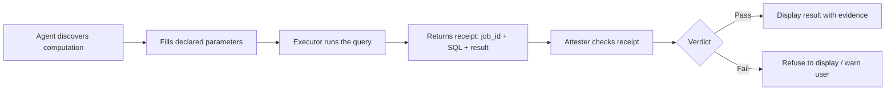
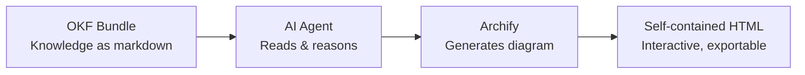
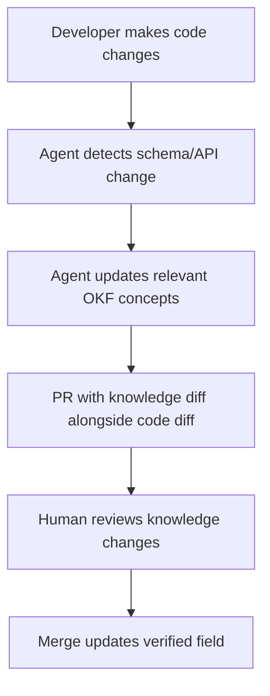

AI agents are getting smarter every month. But smarter models still produce garbage when they lack the right context. The real bottleneck in production AI systems isn't intelligence — it's **knowledge discovery**.

Your agent can write perfect Go, but it doesn't know that `customer_id` in the orders table joins to `id` in the customers table. It doesn't know your revenue metric follows a specific fiscal-year recognition policy. It doesn't know that the deprecated v1 API still handles 40% of traffic.

That knowledge exists — scattered across Confluence pages, Notion docs, code comments, Slack threads, and the heads of three senior engineers who've been here since 2019.

**Open Knowledge Format (OKF)** is Google Cloud's answer: an open, vendor-neutral specification that turns organizational knowledge into portable, agent-readable markdown files. No SDK. No database. No vendor lock-in. Just files.

---

## Table of Contents

- [The Fragmented Context Problem](#the-fragmented-context-problem)
- [The LLM Wiki Pattern](#the-llm-wiki-pattern)
- [What is Open Knowledge Format (OKF)?](#what-is-open-knowledge-format-okf)
- [OKF v0.2 Spec Walkthrough](#okf-v02-spec-walkthrough)
  - [Bundle Structure](#bundle-structure)
  - [Concept Documents](#concept-documents)
  - [Provenance, Trust, and Lifecycle](#provenance-trust-and-lifecycle)
  - [Cross-Linking](#cross-linking)
  - [Attested Computations](#attested-computations)
- [OKF vs Existing Knowledge Systems](#okf-vs-existing-knowledge-systems)
- [Building Your First OKF Bundle](#building-your-first-okf-bundle)
- [Consuming OKF: Agents, Viewers, and Search](#consuming-okf-agents-viewers-and-search)
- [Visualizing Knowledge with Archify](#visualizing-knowledge-with-archify)
- [Practical Integration Patterns](#practical-integration-patterns)
- [Limitations and What's Next](#limitations-and-whats-next)

---

## The Fragmented Context Problem

In most organizations, the knowledge AI agents need is overwhelmingly internal:

- The schema of a table and what each column actually means
- The business definition of a metric ("Weekly Active Users" means different things to different teams)
- The runbook for an incident
- The join paths between two systems
- The deprecation notice for an old API
- Which team owns which service

Today, these atoms of knowledge live across incompatible surfaces:


Every agent builder solves the same context-assembly problem from scratch. Every catalog vendor reinvents the same data models. The knowledge itself is locked behind whichever surface created it.

---

## The LLM Wiki Pattern

A different approach has been emerging organically across teams. Instead of building another service, teams are giving their agents a **shared markdown library** that grows more useful over time.

Andrej Karpathy articulated this most clearly: LLMs don't get bored, don't forget to update cross-references, and can touch 15 files in one pass. The bookkeeping that causes humans to abandon personal wikis is exactly what LLMs are good at.

The pattern keeps reappearing under different names:

| Implementation | Pattern |
| :--- | :--- |
| Obsidian vaults wired to coding agents | Personal knowledge base → agent context |
| `AGENTS.md` / `CLAUDE.md` / `GEMINI.md` | Convention files for agent instructions |
| `index.md` + `log.md` repos | Agent-maintained wikis consulted before doing work |
| "Metadata as code" repositories | Data team context living in git |

The pattern works. But each instance is bespoke. Your team's wiki and another team's wiki look alike — markdown, frontmatter, cross-links — but they aren't designed to cooperate. There's no agreed answer to what fields every document should carry, or what filenames mean.

**What's missing is a format, not another service.**

---

## What is Open Knowledge Format (OKF)?

[OKF](https://github.com/GoogleCloudPlatform/knowledge-catalog/blob/main/okf/SPEC.md) formalizes the LLM-wiki pattern into a portable, interoperable specification. It is:

- **Just markdown** — readable in any editor, renderable on GitHub, indexable by any search tool
- **Just files** — shippable as a tarball, hostable in any git repo, mountable on any filesystem
- **Just YAML frontmatter** — for the small set of structured fields that need to be queryable

Three design principles:

1. **Minimally opinionated** — OKF requires exactly one field: `type`. Everything else is left to the producer.
2. **Producer/consumer independence** — A bundle authored by a human can be consumed by an agent. A bundle generated by an LLM can be browsed in a visualizer. The format is the contract.
3. **Format, not platform** — Not tied to any cloud, database, or model provider. No proprietary SDK required.

---

## OKF v0.2 Spec Walkthrough

### Bundle Structure

An OKF bundle is a directory tree of markdown files:

```text
sales/
├── index.md                    # Directory listing (progressive disclosure)
├── log.md                      # Chronological history of updates
├── datasets/
│   ├── index.md
│   └── orders_db.md
├── tables/
│   ├── index.md
│   ├── orders.md
│   └── customers.md
├── metrics/
│   ├── index.md
│   └── weekly_active_users.md
└── computations/
    ├── revenue.md
    └── profit.md
```

Reserved filenames:
- `index.md` — Directory listing for progressive disclosure (agents can browse before opening individual concepts)
- `log.md` — Chronological update history

Everything else is a **concept document**.

---

### Concept Documents

Every concept is one UTF-8 markdown file with two parts:

```yaml
---
type: BigQuery Table              # REQUIRED — the only mandatory field
title: Customer Orders
description: One row per completed customer order across all channels.
resource: https://console.cloud.google.com/bigquery?p=acme&d=sales&t=orders
tags: [sales, orders, revenue]
generated: { by: reference_agent/gemini-2.5-pro, at: 2026-05-28T14:30:00Z }
---

# Schema

| Column        | Type      | Description                              |
|---------------|-----------|------------------------------------------|
| `order_id`    | STRING    | Globally unique order identifier.        |
| `customer_id` | STRING    | FK to [customers](/tables/customers.md). |
| `total_usd`   | NUMERIC   | Order total in US dollars.               |
| `placed_at`   | TIMESTAMP | When the customer submitted the order.   |

# Joins

Joined with [customers](/tables/customers.md) on `customer_id`.
```

Key points:
- `type` is the **only required field** — a concept carrying just `type` is fully conformant
- Producers can add any additional frontmatter keys they need
- The body uses structural markdown (headings, tables, code blocks) for both human and agent readability
- Cross-links use standard markdown links, turning the directory into a navigable graph

---

### Provenance, Trust, and Lifecycle

OKF v0.2 makes three questions answerable from frontmatter alone:

| Question | Field Family | Example |
| :--- | :--- | :--- |
| Where did this come from? | `sources` | External docs, APIs, dashboards the concept derives from |
| How much should I trust it? | `generated` + `verified` | Who wrote it, who confirmed it, and when |
| Is it still current? | `status` + `stale_after` | Lifecycle state and expiration |

#### Sources (Provenance)

```yaml
sources:
  - id: ga4-schema
    resource: https://developers.google.com/analytics/bigquery/export-schema
    title: GA4 BigQuery Export schema
    author: team:ga4-docs
    usage_count: 5000
    last_modified: 2026-05-30T00:00:00Z
usage_window: { from: 2026-06-01T00:00:00Z, to: 2026-06-30T00:00:00Z }
```

Each source carries **credibility signals** — `author`, `usage_count`, `last_modified` — so consumers can judge trustworthiness without OKF having to store a subjective score.

#### Trust Tiers (derived from `verified`)

```yaml
generated: { by: reference_agent/gemini-2.5-pro, at: 2026-06-20T22:53:05Z }
verified:
  - { by: human:ahormati, at: 2026-06-25T09:00:00Z }
  - { by: process:finance-nightly, at: 2026-06-26T02:00:00Z }
```

Trust is derived, not stored:

| Condition | Trust Tier |
| :--- | :--- |
| No `verified` key | `unverified` |
| Verified by non-human actors only | `machine-confirmed` |
| Verified by a `human:<id>` actor | `human-reviewed` |

#### Lifecycle

```yaml
status: stable          # draft | stable | deprecated
stale_after: 2026-09-23T00:00:00Z
```

A concept is stale when `now >= stale_after`. Simple comparison, no relative TTLs.

---

### Cross-Linking

Concepts link to each other with standard markdown links:

```markdown
Joined with [customers](/tables/customers.md) on `customer_id`.
```

Two forms:
- **Absolute (bundle-relative):** begins with `/`, interpreted relative to bundle root
- **Relative:** standard relative path (`./other.md`, `../metrics/revenue.md`)

Links form the knowledge graph. Consumers can build graph views, trace lineage, and discover relationships — all from parsing plain markdown.

---

### Attested Computations

This is the most powerful v0.2 addition. An **Attested Computation** concept carries not just what a value means, but a sanctioned way to compute it — so a consumer can confirm the agent ran the blessed computation, not improvised its own.

```yaml
---
type: Attested Computation
title: Revenue for fiscal year
description: Recognized revenue for a fiscal year, per Finance's definition.
runtime: bigquery
parameters:
  - { name: year, type: integer, required: true }
executor:
  resource: references/skills/run-on-bq.md
  receipt: [job_id, executed_sql, result]
attester:
  resource: references/attesters/revenue.py
generated: { by: reference_agent/gemini-2.5-pro, at: 2026-06-28T14:00:00Z }
verified: { by: human:ahormati, at: 2026-06-25T09:00:00Z }
---

# Computation

    SELECT SUM(amount) AS revenue
    FROM finance.recognized_revenue
    WHERE fiscal_year = @year
```

The lifecycle:



This separates two concerns:
- **`verified`** confirms the *definition* still matches policy (doc-level, slow, stored in bundle)
- **Attestation** confirms a *single run* produced the value correctly (per-call, runtime, not stored)

---

## OKF vs Existing Knowledge Systems

<div style="overflow-x: auto;" markdown="1">

| Dimension | Traditional Catalogs | Internal Wikis | AGENTS.md / CLAUDE.md | **OKF** |
| :--- | :--- | :--- | :--- | :--- |
| **Format** | Proprietary API + DB | Vendor-specific (Confluence, Notion) | Single flat file | Markdown + YAML in git |
| **Portability** | Locked to vendor | Export is lossy | Copy-paste | `git clone` / tarball |
| **Agent-readable** | Requires SDK | Requires scraping | Yes (limited scope) | Yes (by design) |
| **Human-readable** | Dashboard UI only | Yes | Yes | Yes |
| **Versioned** | Vendor-managed | Limited history | Git | Git (recommended) |
| **Trust signals** | Vendor-specific | None | None | First-class (`verified`, trust tiers) |
| **Provenance** | Some catalogs | None | None | First-class (`sources`, credibility signals) |
| **Cross-org sharing** | Painful exports | Not designed for it | Not applicable | Core use case |
| **Required infrastructure** | Catalog server + API | SaaS subscription | Text editor | Text editor + git |

</div>

---

## Building Your First OKF Bundle

Here's a practical walkthrough for creating an OKF bundle for your team's infrastructure:

### Step 1: Create the directory structure

```bash
mkdir -p knowledge-bundle/{services,tables,metrics,playbooks,computations,references}
```

### Step 2: Write your first concept

Create `knowledge-bundle/services/auth-service.md`:

```yaml
---
type: Service
title: Authentication Service
description: Handles user login, JWT issuance, token validation, and session management.
resource: https://github.com/yourorg/auth-service
tags: [auth, security, core]
generated: { by: human:yourname, at: 2026-08-27T10:00:00Z }
status: stable
---

# Overview

The auth service is the gateway for all authenticated requests. It issues JWTs
with a 15-minute TTL and refresh tokens with a 7-day TTL.

# Dependencies

- [PostgreSQL users table](/tables/users.md) — credential storage
- [Redis session cache](/services/redis.md) — active session lookup
- Auth0 (external) — social login delegation

# Endpoints

| Path | Method | Purpose |
|------|--------|---------|
| `/auth/login` | POST | Issue JWT + refresh token |
| `/auth/refresh` | POST | Rotate refresh token |
| `/auth/validate` | GET | Validate JWT (internal only) |

# Ownership

Team: Platform Security (`#platform-security` on Slack)
On-call: PagerDuty rotation `auth-primary`
```

### Step 3: Add cross-links

Create `knowledge-bundle/tables/users.md`:

```yaml
---
type: PostgreSQL Table
title: Users
description: Core user credential and profile table.
resource: postgresql://prod-db:5432/main/public.users
tags: [auth, users, pii]
generated: { by: human:yourname, at: 2026-08-27T10:00:00Z }
status: stable
---

# Schema

| Column | Type | Description |
|--------|------|-------------|
| `id` | UUID | Primary key |
| `email` | TEXT | Unique, indexed |
| `password_hash` | TEXT | bcrypt, never exposed |
| `created_at` | TIMESTAMPTZ | Account creation |

# Consumers

- [Auth Service](/services/auth-service.md) — login and validation
- [User Profile API](/services/profile-api.md) — display name, avatar

# PII Notice

Contains PII (email, password_hash). Subject to GDPR deletion requests.
Retention: indefinite for active accounts, 90 days post-deletion.
```

### Step 4: Add an index for progressive disclosure

Create `knowledge-bundle/index.md`:

```markdown
# Knowledge Bundle: Acme Platform

## Services

* [Auth Service](/services/auth-service.md) - JWT auth, login, session management
* [Redis Cache](/services/redis.md) - Session and hot-path caching
* [Profile API](/services/profile-api.md) - User profile CRUD

## Tables

* [Users](/tables/users.md) - Core user credentials and profiles
* [Orders](/tables/orders.md) - Completed customer orders

## Metrics

* [Weekly Active Users](/metrics/wau.md) - Product engagement metric

## Playbooks

* [Auth outage runbook](/playbooks/auth-outage.md) - Steps for auth-service incidents
```

### Step 5: Version it

```bash
cd knowledge-bundle
git init
git add .
git commit -m "Initial OKF bundle: auth service, users table, index"
```

That's it. Your bundle is now portable, diffable, and agent-consumable.

---

## Consuming OKF: Agents, Viewers, and Search

### Agent Consumption

An AI agent consumes OKF by:
1. Reading `index.md` for progressive disclosure (what's available?)
2. Following links to specific concepts (what do I need?)
3. Checking `verified` and `stale_after` to gauge trust
4. Using `sources` to trace provenance when challenged

This maps directly to the **progressive context disclosure** pattern — the agent pays only for the knowledge it actually needs.

### Google's Reference Implementations

Google ships two tools with OKF:

1. **Enrichment Agent** — Walks a BigQuery dataset, drafts an OKF concept per table/view, then enriches with citations, schemas, and join paths via a second LLM pass.

2. **Static HTML Visualizer** — Turns any OKF bundle into an interactive graph view in a single self-contained HTML file. No backend, no install, no data leaves the page.

3. **Sample Bundles** — GA4 e-commerce, Stack Overflow, and Bitcoin public datasets as living examples.

### Custom Consumers

Because OKF is just files, you can build consumers with any stack:
- **Search index:** Parse frontmatter with any YAML library, index bodies with Elasticsearch/Meilisearch
- **Agent context injection:** Load relevant concepts into system prompts based on `tags` or `type`
- **Graph visualization:** Parse markdown links to build a relationship graph
- **Staleness alerting:** Cron job that checks `stale_after` across all concepts

---

## Visualizing Knowledge with Archify

While OKF handles the *representation* of knowledge, [Archify](https://github.com/tt-a1i/archify) handles the *visualization* of system architecture that the knowledge describes.

Archify is an agent skill (for Claude Code, Cursor, Codex, Kiro, Gemini) that turns system descriptions into polished, interactive HTML diagrams — architecture maps, workflow diagrams, sequence diagrams, data flows, and lifecycle/state diagrams.

The complementary workflow:



Where OKF answers "what do we have and how does it connect?", Archify answers "what does it look like?" You could ask your agent:

> "Read the OKF bundle for our platform, then use Archify to create a high-level architecture diagram showing the auth flow from browser to database."

The output is a single HTML file with dark/light themes, search, route tracing, and PNG/SVG/WebM export — shareable by attaching to a PR or Slack message.

---

## Practical Integration Patterns

### Pattern 1: Agent-Maintained Knowledge (The LLM Wiki)



The agent maintains the wiki. Humans curate and verify.

### Pattern 2: Data Catalog Export

```bash
# Export your BigQuery metadata to OKF
# (using Google's reference enrichment agent)
python enrichment_agent.py \
  --project=acme-prod \
  --dataset=sales \
  --output=./knowledge-bundle/tables/
```

Existing catalogs export into OKF; agents consume the portable format instead of calling proprietary APIs.

### Pattern 3: Incident Context Injection

When an on-call agent investigates an alert:
1. Match alert labels to OKF `tags`
2. Load matching service concepts + playbook concepts
3. Agent has immediate context: ownership, dependencies, runbooks, known failure modes

### Pattern 4: Onboarding Acceleration

New team members (or new agents on a project) start by reading the `index.md` tree. Progressive disclosure means they get the overview first, then drill into specifics as needed — matching the natural learning flow.

---

## Limitations and What's Next

### Current Limitations

- **v0.2 is early** — The spec will evolve. Expect additive changes as more producers and consumers emerge.
- **No query language** — You can't "SELECT" from an OKF bundle. Consumers must build their own search/filter logic.
- **Manual maintenance burden** — Without agent automation, keeping concepts current requires discipline (same as any documentation).
- **No access control** — OKF is a format, not a platform. If concepts contain sensitive information, access control is your responsibility (git permissions, bundle splitting, etc.).
- **Attested Computations are complex** — The executor/attester pattern is powerful but requires tooling investment to realize.

### What's Coming

- **Ecosystem growth** — More producers (Snowflake, dbt, Postgres exporters) and consumers (VS Code extensions, agent frameworks)
- **Runtime protocol** — Receipt and verdict wire formats for attestation
- **Semantic-layer templates** — Support for Looker/dbt models where attester comparison shifts from SQL equality to model-and-binding equality
- **Community conventions** — Shared type taxonomies for common domains (data engineering, platform engineering, SRE)

---

## Getting Started

| Time Available | Action |
| :--- | :--- |
| **5 minutes** | [Read the spec](https://github.com/GoogleCloudPlatform/knowledge-catalog/blob/main/okf/SPEC.md) — it's surprisingly short |
| **30 minutes** | Create a 3-concept bundle for one service your team owns |
| **2 hours** | Build a full bundle for your team's domain, add an `index.md`, commit to git |
| **1 day** | Wire your agent (Claude Code / Gemini CLI) to read the bundle as context before answering questions about your system |

The repo, spec, and sample bundles are available at [github.com/GoogleCloudPlatform/knowledge-catalog](https://github.com/GoogleCloudPlatform/knowledge-catalog).

---

## Further Reading

- [OKF v0.2 Specification](https://github.com/GoogleCloudPlatform/knowledge-catalog/blob/main/okf/SPEC.md) — The full spec
- [How the Open Knowledge Format can improve data sharing](https://cloud.google.com/blog/products/data-analytics/how-the-open-knowledge-format-can-improve-data-sharing) — Google Cloud blog announcement
- [Archify](https://github.com/tt-a1i/archify) — Agent skill for interactive architecture diagrams
- [Andrej Karpathy's LLM Wiki gist](https://gist.github.com/karpathy/1dd0294ef9567971c1e4348a90d69285) — The original LLM Wiki pattern articulation
- [Open Knowledge Format explainer (Medium)](https://medium.com/@tahirbalarabe2/what-is-open-knowledge-format-okf-270b20791802) — Community walkthrough
