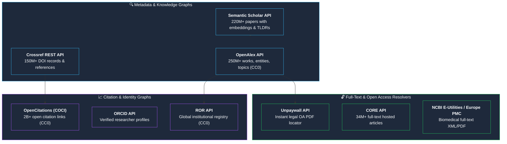

> This is **Part 7** of the [Open Science Toolbox](/posts/open-science-toolbox-free-research/) series.

Whether you are building an AI literature assistant, analyzing global citation networks, tracking institutional research outputs, or constructing a **RAG (Retrieval-Augmented Generation)** knowledge pipeline over scientific PDFs, the open scholarly ecosystem provides rich, free REST APIs and open datasets.

This developer guide compares **15+ open APIs, persistent identifier standards (PIDs), and bulk snapshot endpoints**.

---

## 1. The Open Scholarly API Landscape



---

## 2. Master Developer API Comparison Matrix

| API | Core Data / Scope | Authentication | Rate Limit | Free Bulk Snapshot? | Direct Documentation |
| :--- | :--- | :--- | :--- | :---: | :--- |
| **[OpenAlex API](https://docs.openalex.org/)** | 250M+ works, authors, institutions, topics | **None** (`mailto` for polite pool) | ~10 req/sec (100k/day) | ✅ Free AWS S3 | [docs.openalex.org](https://docs.openalex.org/) |
| **[Crossref REST API](https://api.crossref.org/)** | 150M+ official publisher DOI records | **None** (`User-Agent` with email) | ~50 req/sec | ✅ Academic Torrents | [api.crossref.org](https://api.crossref.org/) |
| **[Semantic Scholar API](https://www.semanticscholar.org/product/api)** | 220M+ papers with AI TLDRs & vector embeddings | Free API Key | 10 req/sec | ✅ Free S3 request | [semanticscholar.org/product/api](https://www.semanticscholar.org/product/api) |
| **[Unpaywall API](https://unpaywall.org/products/api)** | OA status & direct PDF links for 130M+ DOIs | Email param in URL | 100k requests/day | ✅ Weekly dump | [unpaywall.org/products/api](https://unpaywall.org/products/api) |
| **[NCBI E-Utilities](https://www.ncbi.nlm.nih.gov/books/NBK25501/)** | 37M+ PubMed abstracts & PMC biomedical texts | Free NCBI Key | 10 req/sec | ✅ Annual FTP | [ncbi.nlm.nih.gov/books/NBK25501](https://www.ncbi.nlm.nih.gov/books/NBK25501/) |
| **[Europe PMC REST](https://europepmc.org/RestfulWebService)** | 44M+ abstracts + bioRxiv/medRxiv preprints | **None** | Generous | ✅ FTP dumps | [europepmc.org/RestfulWebService](https://europepmc.org/RestfulWebService) |
| **[CORE API v3](https://api.core.ac.uk/docs/v3)** | 34M+ full-text papers harvested globally | Free API Key | Tier-based | ✅ Dataset request | [api.core.ac.uk/docs/v3](https://api.core.ac.uk/docs/v3) |
| **[OpenCitations API](https://opencitations.net/index/coci/api/v1)** | 2B+ citation connections (COCI) | **None** (CC0) | Generous | ✅ Full dump (Figshare) | [opencitations.net](https://opencitations.net/) |
| **[arXiv API](https://info.arxiv.org/help/api/index.html)** | 2.4M+ preprints (Physics, Math, CS, Stats) | **None** | 1 req / 3 sec | ✅ AWS S3 / GCS | [info.arxiv.org/help/api](https://info.arxiv.org/help/api/index.html) |
| **[ROR API](https://ror.readme.io/docs/rest-api)** | 110K+ research organization identifiers | **None** (CC0) | Generous | ✅ Data dump | [ror.readme.io](https://ror.readme.io/docs/rest-api) |

---

## 3. Practical Code Examples (Python)

### 1. Search Open Papers & Resolve Legal PDF URLs (OpenAlex + Unpaywall)

```python
import requests

def search_open_papers(query: str, limit: int = 5):
    # Query OpenAlex for open-access papers
    url = "https://api.openalex.org/works"
    params = {
        "search": query,
        "filter": "is_oa:true,from_publication_date:2024-01-01",
        "sort": "cited_by_count:desc",
        "per_page": limit,
        "mailto": "developer@example.com"  # Polite pool
    }
    response = requests.get(url, params=params).json()
    
    for work in response.get("results", []):
        title = work.get("title")
        doi = work.get("doi")
        pdf_url = work.get("open_access", {}).get("oa_url")
        cites = work.get("cited_by_count", 0)
        print(f"📄 {title}\n   Citations: {cites} | DOI: {doi}\n   PDF: {pdf_url}\n")

search_open_papers("retrieval augmented generation large language models")
```

---

### 2. Extract Semantic Citations & AI TLDR (Semantic Scholar API)

```python
import requests

def get_paper_summary(doi: str, api_key: str):
    url = f"https://api.semanticscholar.org/graph/v1/paper/DOI:{doi}"
    params = {"fields": "title,year,abstract,tldr,citationCount,influentialCitationCount"}
    headers = {"x-api-key": api_key}
    
    res = requests.get(url, params=params, headers=headers).json()
    print(f"Title: {res.get('title')}")
    print(f"TLDR: {res.get('tldr', {}).get('text')}")
    print(f"Citations: {res.get('citationCount')} (Influential: {res.get('influentialCitationCount')})")

# Example query for GPT-4 technical report DOI: 10.48550/arXiv.2303.08774
```

---

## 4. Building a Literature RAG Pipeline Over Scientific Papers


1. **Discovery:** Use OpenAlex API to filter relevant peer-reviewed papers with `is_oa:true`.
2. **Access:** Fetch full-text PDFs using the `oa_url` from Unpaywall or the arXiv export endpoint.
3. **Structured Extraction:** Use tools like [GROBID](https://github.com/kermitt2/grobid) or [PyMuPDF](https://pymupdf.readthedocs.io/) to parse headers, equations, and section headings.
4. **Vector Indexing:** Embed chunks and store them alongside persistent metadata (`doi`, `authors`, `year`).
5. **Synthesis:** Feed retrieved chunks into your LLM with strict requirements to cite the exact DOI.

---

## 5. Persistent Identifiers (The Universal Join Keys)

When storing research data in databases, use standard Persistent Identifiers (PIDs) as foreign keys:

| Identifier Type | Standard | Purpose | Resolvable URL Format |
| :--- | :--- | :--- | :--- |
| **DOI** | ISO 26324 | Papers, Datasets, Software releases | `https://doi.org/10.xxxx/xxxx` |
| **ORCID** | ISO 27729 | Authors & Researchers | `https://orcid.org/0000-0002-1825-0097` |
| **ROR ID** | Open Registry | Universities & Research Institutions | `https://ror.org/03vek6s52` (Harvard) |
| **SWH-ID** | Software Heritage | Immutable cryptographic source code hashes | `swh:1:rev:309cf2674ee7a074997...` |

---

## 6. Bulk Data Dumps (When APIs Are Too Slow)

For large-scale machine learning, text mining, or bibliometric graphs, bypass rate limits with direct bulk snapshots:

| Dataset | Data Format | Compressed Size | Direct Access |
| :--- | :--- | :--- | :--- |
| **[OpenAlex Snapshot](https://docs.openalex.org/download-all-data/openalex-snapshot)** | Parquet / JSON Lines | ~350 GB | AWS S3 (`s3://openalex`) |
| **[Semantic Scholar Open Corpus](https://www.semanticscholar.org/product/api#open-corpus)** | JSON Lines | ~200 GB | S3 (Free access request) |
| **[Crossref Public Data File](https://www.crossref.org/blog/2023-public-data-file-of-more-than-150-million-metadata-records/)** | JSON | ~150 GB | Academic Torrents / Academic Plus |
| **[PubMed Baseline](https://ftp.ncbi.nlm.nih.gov/pubmed/baseline/)** | XML | ~100 GB | NCBI FTP Server |
| **[Unpaywall Snapshot](https://unpaywall.org/products/data-feed)** | JSON Lines | ~35 GB | Free direct HTTP snapshot |

---

## References & SDKs

- [pyalex — Python client for OpenAlex](https://github.com/J535D165/pyalex)
- [semanticscholar-api — Python SDK for Semantic Scholar](https://github.com/danielnsilva/semanticscholar)
- [habanero — Python client for Crossref](https://github.com/sckott/habanero)
- [BioPython Entrez — NCBI E-Utilities Python Module](https://biopython.org/docs/1.75/api/Bio.Entrez.html)
- [GROBID — Machine learning parsing for scientific PDFs](https://github.com/kermitt2/grobid)

---

*Previous: **[Part 6 — Protocols, Methods & Reproducibility](/posts/open-science-protocols-methods-reproducibility/)** | Next: **[Part 8 — Where to Publish or Archive Your Research for Free](/posts/open-science-publish-archive-research-free/)***
