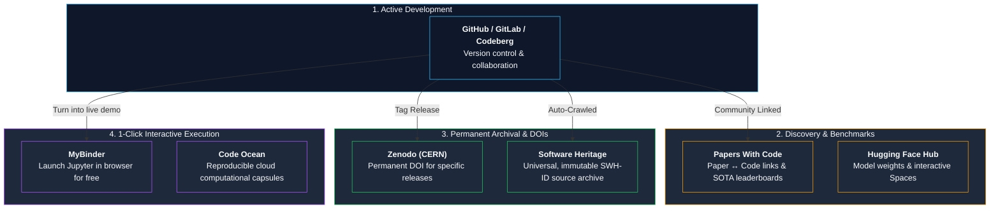
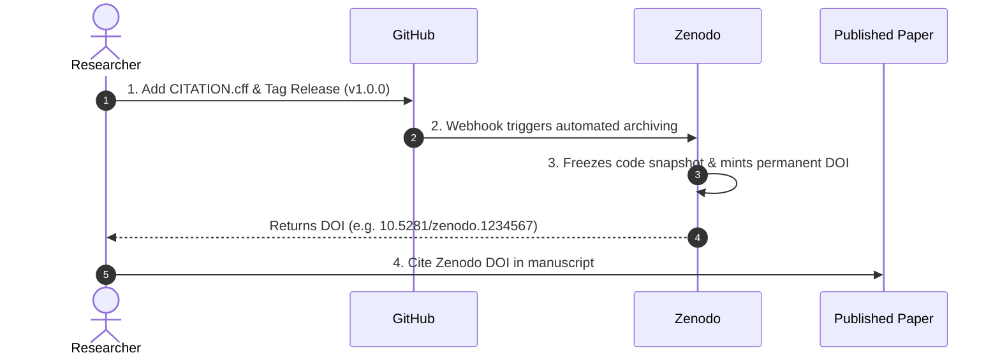
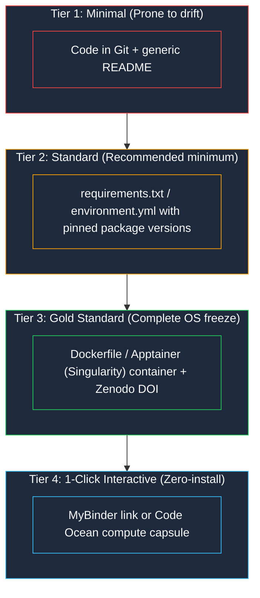

> This is **Part 5** of the [Open Science Toolbox](/posts/open-science-toolbox-free-research/) series.

A paper claims a new state-of-the-art benchmark or novel algorithm. How do you verify, adapt, or build on it? **You inspect the source code.**

Yet research code is often scattered across active Git repositories, frozen snapshots on Zenodo, universal archives like Software Heritage, or interactive cloud environments. This guide shows you **how to find code behind papers** and **how to publish your own code so it is permanent, citable, and runnable**.

---

## 1. The Research Code Ecosystem



---

## 2. Fast 5-Step Checklist: How to Find Code for Any Paper


| Source | Best Strategy | Success Rate |
| :--- | :--- | :---: |
| **[Papers With Code](https://paperswithcode.com/)** | Search by paper title or arXiv ID (essential for ML/AI). | High (ML) |
| **[GitHub Search](https://github.com/)** | Search `"paper title"` or check the first author's personal repository list. | 40–50% |
| **[Software Heritage Archive](https://archive.softwareheritage.org/)** | Search by repository URL or commit hash (even if the original GitHub repo was deleted). | Archival |
| **[Hugging Face Hub](https://huggingface.co/models)** | Search model name or research lab organization (e.g. `meta-llama`, `tiiuae`). | High (LLMs/CV) |

---

## 3. Top Platforms for Scientific Code & Execution

| Platform | Primary Purpose | Permanent DOI? | In-Browser Execution | Free Access | Direct Link |
| :--- | :--- | :---: | :---: | :---: | :--- |
| **[GitHub](https://github.com/)** | Active source code versioning | ❌ | Via Codespaces | ✅ Free | [github.com](https://github.com/) |
| **[Papers With Code](https://paperswithcode.com/)** | Paper $\leftrightarrow$ Code mappings & SOTA leaderboards | ❌ | Links to Colab | ✅ Free | [paperswithcode.com](https://paperswithcode.com/) |
| **[Hugging Face](https://huggingface.co/)** | Model weights, datasets, Gradio Spaces | ❌ | ✅ Spaces demos | ✅ Free | [huggingface.co](https://huggingface.co/) |
| **[Software Heritage](https://www.softwareheritage.org/)** | Universal source code preservation (SWH-ID) | ✅ SWH-ID | ❌ | ✅ Free | [softwareheritage.org](https://www.softwareheritage.org/) |
| **[Zenodo](https://zenodo.org/)** | Citable snapshots of GitHub releases | ✅ DataCite DOI | ❌ | ✅ Free | [zenodo.org](https://zenodo.org/) |
| **[MyBinder](https://mybinder.org/)** | Launch interactive Jupyter notebooks instantly | ❌ | ✅ Free cloud VM | ✅ Free | [mybinder.org](https://mybinder.org/) |
| **[Code Ocean](https://codeocean.com/)** | Certified reproducible cloud compute capsules | ✅ DOI | ✅ Full container | Free for published | [codeocean.com](https://codeocean.com/) |

---

## 4. Making Your Research Code Citable in 4 Steps

Don't just share a raw GitHub link in your paper — repositories can be moved, made private, or deleted. Use the standard Zenodo-GitHub integration:



### Step 1: Add a `CITATION.cff` to your repo
Place this file in the root of your GitHub repository. GitHub will automatically render a **"Cite this repository"** button:

```yaml
cff-version: 1.2.0
message: "If you use this code, please cite it as below."
type: software
title: "NeuralFlow: Scalable Graph Neural Network Pipeline"
version: 1.0.0
date-released: 2026-10-01
authors:
  - family-names: "Nikam"
    given-names: "Sagar"
    orcid: "https://orcid.org/0000-0000-0000-0000"
doi: "10.5281/zenodo.1234567"
repository-code: "https://github.com/sagarnikam123/neuralflow"
license: MIT
```

---

## 5. The Full Reproducibility Stack

Sharing code without environment specifications causes the *"it works on my machine"* breakdown. Choose the right reproducibility tier for your project:



---

## 6. Scientific Workflow Orchestration Engines

For complex, multi-stage data pipelines (bioinformatics, astronomy, large-scale ML), scripts should be structured with portable workflow engines:

- **[Nextflow](https://www.nextflow.io/)** — Industry standard for genomics and bioinformatics; native container (Docker/Singularity) and cloud scaling.
- **[Snakemake](https://snakemake.github.io/)** — Python-based workflow system widely adopted across computational biology and physics.
- **[Common Workflow Language (CWL)](https://www.commonwl.org/)** — Open standard for describing analysis workflows in vendor-neutral YAML/JSON.
- **[DVC (Data Version Control)](https://dvc.org/)** — Git-based version control for large datasets, ML pipelines, and model weights.

---

## References & Further Reading

- [Software Heritage Archive & SWH-ID Spec](https://www.softwareheritage.org/)
- [Zenodo GitHub Archiving Guide](https://docs.zenodo.org/guides/github/quickstart-guide/)
- [Citation File Format (CITATION.cff) Standard](https://citation-file-format.github.io/)
- [Journal of Open Source Software (JOSS)](https://joss.theoj.org/)
- [FAIR Principles for Research Software (FAIR4RS)](https://www.rd-alliance.org/groups/fair-research-software-fair4rs-wg/)
- [MyBinder Documentation](https://mybinder.readthedocs.io/)

---

*Previous: **[Part 4 — Open Research Data Repositories](/posts/open-science-research-data-repositories/)** | Next: **[Part 6 — Protocols, Methods & Reproducibility](/posts/open-science-protocols-methods-reproducibility/)***
