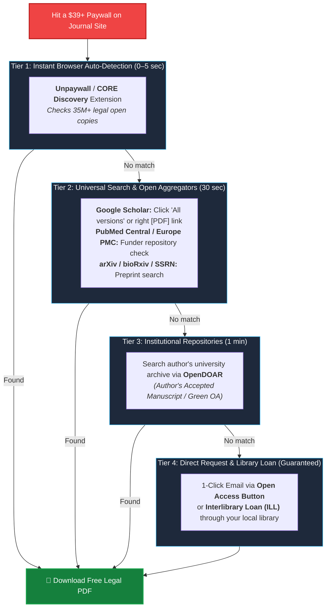
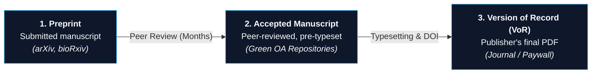

> This is **Part 3** of the [Open Science Toolbox](/posts/open-science-toolbox-free-research/) series.

You find the exact paper you need, click the link, and hit a **$39.95 paywall**. 

Before pulling out a credit card or turning to risky shadow libraries, know this: **over 70–85% of paywalled papers have a 100% legal, free version accessible online**. This guide provides a rapid 4-tier cascade to unlock them in seconds.

---

## 1. The 4-Tier Legal Unlocking Cascade

Follow this structured workflow from instant automated checks to direct author requests:



---

## 2. Understanding Open Access Types & Where Free Copies Live

Not all "free" research operates the same way. Knowing the publishing model tells you where to find the document:

| OA Model | Cost to Reader | Cost to Author | Where the Free Copy Lives | How to Find It |
| :--- | :---: | :---: | :--- | :--- |
| **Gold OA** | **$0** | Author pays APC ($1k–$11k) | Publisher Journal Website | Instant on publisher page |
| **Diamond OA** | **$0** | **$0** (Funded by grants/societies) | Publisher Journal Website | [DOAJ](https://doaj.org/) / Journal site |
| **Green OA** | **$0** | **$0** (Author self-archives) | Institutional or Subject Repositories | [Unpaywall](https://unpaywall.org/), [CORE](https://core.ac.uk/) |
| **Preprint** | **$0** | **$0** | Preprint Servers ([arXiv](https://arxiv.org/), [bioRxiv](https://www.biorxiv.org/)) | Search engine / Preprint hub |
| **Hybrid OA** | **$0** | Author pays APC | Paywalled journal with open article option | [Unpaywall](https://unpaywall.org/) |
| **Bronze OA** | **$0** | **$0** | Publisher Website (Temporary/Promotional) | Browser directly |

---

## 3. Paper Versions: Which One Are You Getting?



- **Preprint:** Free on preprint servers. Contains original findings before peer review revisions.
- **Accepted Manuscript (Postprint):** **The sweet spot of Green OA.** Contains 100% of peer-reviewed revisions, data, and scientific corrections, just lacking the publisher's branded fonts and page layout.
- **Version of Record (VoR):** The publisher's final PDF. Only free if published under Gold/Diamond/Hybrid OA.

---

## 4. Top Free Tools & Browser Extensions

Install these two lightweight browser extensions once to automate 90% of paywall bypasses:

| Tool / Extension | How It Works | Install Links |
| :--- | :--- | :--- |
| **[Unpaywall](https://unpaywall.org/)** | Displays a green padlock 🟢 on your screen whenever you visit a paywalled DOI with a legal open copy in its 35M+ paper database. | [Chrome Extension](https://chrome.google.com/webstore/detail/unpaywall/iplffkdpngmdjhlpjmppncnlhomiipha) • [Firefox Addon](https://addons.mozilla.org/en-US/firefox/addon/unpaywall/) |
| **[Open Access Button](https://openaccessbutton.org/)** | Searches open repositories. If no copy exists, generates and sends a 1-click legal copy request email to the corresponding author. | [Web Search](https://openaccessbutton.org/) • [Chrome Extension](https://chrome.google.com/webstore/detail/open-access-button/) |
| **[CORE Discovery](https://core.ac.uk/services/discovery)** | Searches 34M+ full-text papers harvested across 10,000+ university institutional repositories worldwide. | [Chrome Extension](https://chrome.google.com/webstore/detail/core-discovery/) |
| **[Google Scholar Button](https://chrome.google.com/webstore/detail/google-scholar-button/ldipcbkfgcflbgooiccgdddiejmpbkgd)** | Highlight any paper title on any webpage $\to$ click button $\to$ view Google Scholar's indexed `[PDF]` and `All versions` links. | [Chrome Extension](https://chrome.google.com/webstore/detail/google-scholar-button/ldipcbkfgcflbgooiccgdddiejmpbkgd) |

---

## 5. Public, Funder & Institutional Repositories

If browser extensions don't detect a copy immediately, search these public repositories directly:

| Repository Category | Top Archives | How to Query |
| :--- | :--- | :--- |
| **Biomedical & Life Sciences** | [PubMed Central (PMC)](https://www.ncbi.nlm.nih.gov/pmc/) • [Europe PMC](https://europepmc.org/) | Search by PMID, Title, or Author (contains all NIH/Wellcome-funded manuscripts). |
| **Global Institutional Directory** | [OpenDOAR (Directory of Open Access Repositories)](https://v2.sherpa.ac.uk/opendoar/) | Search 6,000+ university archives (e.g. MIT, Harvard DASH, Cambridge Apollo, ETH Zurich). |
| **Multidisciplinary Open Repositories** | [Zenodo](https://zenodo.org/) • [HAL Science](https://hal.science/) • [OSF](https://osf.io/) | Search paper title directly in search bar. |
| **Preprint Repositories** | [arXiv](https://arxiv.org/) • [bioRxiv](https://www.biorxiv.org/) • [SSRN](https://www.ssrn.com/) • [ChemRxiv](https://chemrxiv.org/) | Search paper title or lead author's last name. |

---

## 6. Asking the Author Directly (The Secret 70% Success Rate)

Academic authors do **not** receive royalties or payments from publisher paywall fees. In fact, most copyright transfer agreements explicitly permit authors to share private copies for research and educational purposes.

### The 30-Second Email Template

```text
Subject: Request for PDF copy: "[Exact Paper Title]"

Dear Dr. [Author's Last Name],

I am currently researching [brief mention of your topic] and came across your paper, "[Exact Paper Title]" published in [Journal Name]. 

Unfortunately, I do not have institutional access to this journal. Would you be willing to share a PDF copy with me?

Thank you very much for your time and research.

Best regards,
[Your Name]
[Your Affiliation / Role]
```

> [!TIP]
> **Author Response Rate:** Approximately **60–70%** of authors reply with a copy within 48–72 hours. You can locate their email in the paper's abstract footer ("*Corresponding author*") or via [Google Scholar Profiles](https://scholar.google.com/).

---

## 7. Interlibrary Loan (ILL): The Guaranteed Fallback

If you need a physical scan or a rare historical article:
- **University Students & Faculty:** Submit a free ILL request through your university library portal. Turnaround is typically 24–48 hours for electronic copies.
- **General Public / Independent Researchers:** Most municipal and public library systems provide free Interlibrary Loan privileges to library cardholders.

---

## 8. Why Avoid Sci-Hub?

While shadow libraries are discussed online, relying on them presents distinct drawbacks:
1. **Legal & Security Risks:** Blocked by ISPs and subject to legal injunctions worldwide.
2. **Invisible Reader Demand:** Bypassing legal routes prevents universities and funders from tracking real readership demand, which is crucial for negotiating transformative open access agreements.
3. **Legal Alternatives Work:** Between Unpaywall, Green OA repositories, preprints, author requests, and ILL, over **85%+** of scholarly papers are accessible legally.

---

## References & Resources

- [Unpaywall Database & Methodology](https://unpaywall.org/)
- [Open Access Button](https://openaccessbutton.org/)
- [CORE Project Repository Index](https://core.ac.uk/)
- [PubMed Central (PMC) Public Access](https://www.ncbi.nlm.nih.gov/pmc/)
- [OpenDOAR — Global Repository Directory](https://v2.sherpa.ac.uk/opendoar/)
- [Sherpa Romeo — Publisher Self-Archiving Rights](https://v2.sherpa.ac.uk/romeo/)

---

*Previous: **[Part 2 — The Complete Guide to Preprint Servers](/posts/open-science-preprint-servers-guide/)** | Next: **[Part 4 — Open Research Data Repositories](/posts/open-science-research-data-repositories/)***
