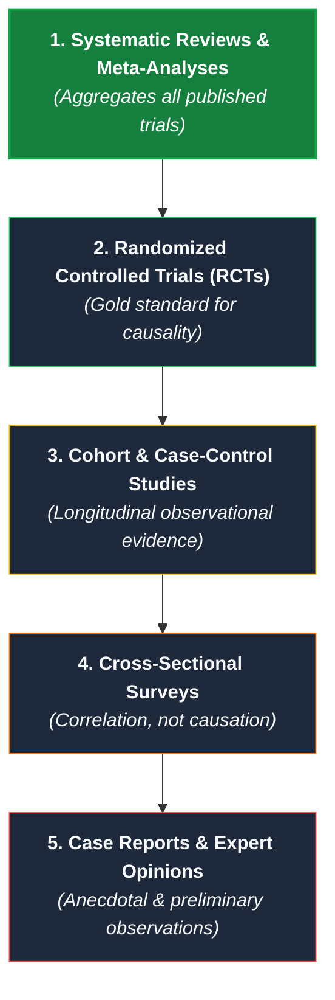
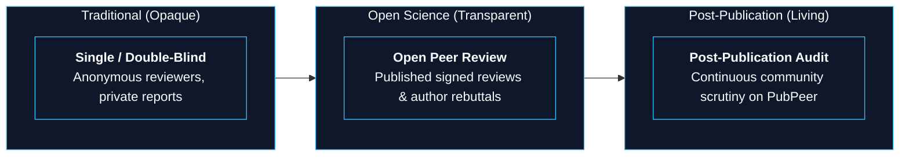

> This is **Part 10** of the [Open Science Toolbox](/posts/open-science-toolbox-free-research/) series.

The previous nine guides help you discover, read, compute, and publish scientific research without paywalls. But open access surfaces a critical challenge: **how do you know if the paper you found is trustworthy?**

> [!IMPORTANT]
> **The 3 Golden Rules of Research Literacy:**
> 1. **Free $\neq$ Reliable** (Anyone can upload a PDF or preprint).
> 2. **Published $\neq$ Correct** (Peer review catches formatting and obvious flaws, but cannot re-run experiments).
> 3. **Cited $\neq$ Supported** (A paper with 1,000 citations may be cited primarily by researchers refuting it).

---

## 1. The Evidence Hierarchy Pyramid

Not all research designs provide the same strength of causal evidence:

---

## 2. Peer Review Models & Open Scrutiny

| Review Platform | Transparency Model | Key Value | Direct Link |
| :--- | :--- | :--- | :--- |
| **[PubPeer](https://pubpeer.com/)** | Anonymous post-publication commentary | Where image manipulation, statistical flaws, and paper mill artifacts are publicly exposed. | [pubpeer.com](https://pubpeer.com/) |
| **[Review Commons](https://www.reviewcommons.org/)** | Journal-independent peer review | High-quality peer review reports that travel with the preprint to participating journals. | [reviewcommons.org](https://www.reviewcommons.org/) |
| **[Peer Community In (PCI)](https://peercommunityin.org/)** | Free community peer review | Dedicated communities of researchers peer-reviewing and endorsing preprints for free. | [peercommunityin.org](https://peercommunityin.org/) |
| **[PREreview](https://prereview.org/)** | Crowdsourced preprint review | Structured, constructive community reviews of early preprints. | [prereview.org](https://prereview.org/) |
| **[OpenReview](https://openreview.net/)** | Open conference peer review | Public reviewer ratings, discussions, and author rebuttals for top AI/ML venues. | [openreview.net](https://openreview.net/) |

---

## 3. Detecting Retractions & Scientific Misconduct

Over **40,000+ scientific papers have been formally retracted** due to honest errors, fabricated data, or compromised peer review. Yet thousands of retracted papers continue to be cited as authoritative truth.

### How to Check Retraction Status Instantly:

| Verification Tool | How It Protects You | Direct Link |
| :--- | :--- | :--- |
| **[Retraction Watch Database](https://retractiondatabase.org/)** | The world's most comprehensive database of retracted papers, errata, and expressions of concern. | [retractiondatabase.org](https://retractiondatabase.org/) |
| **[Zotero Retraction Alerts](https://www.zotero.org/blog/retracted-item-notifications/)** | Automatically flags any retracted paper in your Zotero library with a red warning badge. | [zotero.org](https://www.zotero.org/) |
| **[PubMed Retraction Tag](https://pubmed.ncbi.nlm.nih.gov/)** | Displays a prominent `[Retracted Article]` banner at the top of indexed medical records. | [pubmed.ncbi.nlm.nih.gov](https://pubmed.ncbi.nlm.nih.gov/) |
| **[Problematic Paper Screener](https://www.irit.fr/~Guillaume.Cabanac/problematic-paper-screener)** | Tracks "tortured phrases" and synthetic text produced by commercial paper mills. | [irit.fr/problematic-paper-screener](https://www.irit.fr/~Guillaume.Cabanac/problematic-paper-screener) |

---

## 4. Citation Context: Are Later Studies Agreeing or Disagreeing?

A high citation count does not equal scientific consensus. Tools that classify **citation intent**:

| Tool | Classification Model | Free Access | Direct Link |
| :--- | :--- | :---: | :--- |
| **[scite.ai](https://scite.ai/)** | Classifies citations into **Supporting**, **Mentioning**, or **Contrasting** statements with exact quotes. | Free basic badge search | [scite.ai](https://scite.ai/) |
| **[Semantic Scholar](https://www.semanticscholar.org/)** | Flags **"Influential Citations"** and breaks down methodology vs. background citations. | ✅ Free | [semanticscholar.org](https://www.semanticscholar.org/) |
| **[Connected Papers](https://www.connectedpapers.com/)** | Visualizes co-citation networks to reveal if a paper belongs to an isolated scientific cluster. | Free tier (5 graphs/mo) | [connectedpapers.com](https://www.connectedpapers.com/) |

---

## 5. The 10-Point Research Credibility Checklist

When evaluating any study — especially before citing or making health/policy decisions:

1. [ ] **Peer-Reviewed vs. Preprint:** Has the study completed formal review, or is it an unreviewed preprint on arXiv/bioRxiv?
2. [ ] **Retraction Check:** Is the DOI listed on [Retraction Watch](https://retractiondatabase.org/)?
3. [ ] **PubPeer Audit:** Search the DOI on [PubPeer](https://pubpeer.com/) to see if image duplications or statistical issues were flagged.
4. [ ] **Citation Context:** Does [scite.ai](https://scite.ai/) show contrasting or refuting citations?
5. [ ] **Study Design Level:** Where does the study sit on the Evidence Hierarchy (RCT vs. small observational survey)?
6. [ ] **Data & Code Availability:** Did the authors provide an open dataset DOI on Zenodo/Dryad and code on GitHub?
7. [ ] **Preregistered Plan:** Was the hypothesis preregistered on [OSF](https://osf.io/registrations/) or [ClinicalTrials.gov](https://clinicaltrials.gov/) before data collection?
8. [ ] **Sample Size & Power:** Is the sample size adequate to justify the statistical conclusions?
9. [ ] **Conflicts of Interest:** Are there corporate funding sources or undisclosed patent interests?
10. [ ] **Independent Replication:** Has an independent research group replicated the core finding?

---

## References & Integrity Resources

- [Retraction Watch Database](https://retractiondatabase.org/)
- [PubPeer — The Online Post-Publication Peer Review Platform](https://pubpeer.com/)
- [scite.ai Smart Citations Platform](https://scite.ai/)
- [Committee on Publication Ethics (COPE) Guidelines](https://publicationethics.org/)
- [OpenReview — Open Academic Peer Review](https://openreview.net/)
- [Ioannidis, J. P. (2005). *Why Most Published Research Findings Are False*. PLOS Medicine.](https://doi.org/10.1371/journal.pmed.0020124)

---

*Previous: **[Part 9 — Free Tools for Planning and Managing Scientific Research](/posts/open-science-planning-managing-research/)** | Back to Hub: **[The Open Science Toolbox (Master Guide)](/posts/open-science-toolbox-free-research/)***

---

*This completes the 10-part **Open Science Toolbox** series. Together, these guides empower students, scientists, developers, and independent researchers to discover, read, compute, publish, and evaluate open science across the entire research lifecycle without paywalls.*
