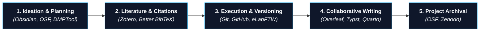
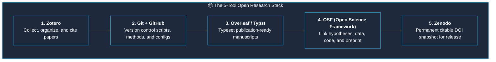

> This is **Part 9** of the [Open Science Toolbox](/posts/open-science-toolbox-free-research/) series.

Open science isn't just about the final outputs (papers, code, and datasets). It begins during the early phases: **forming a hypothesis, managing literature citations, drafting Data Management Plans (DMPs), organizing lab notes, and coordinating co-authors**.

This guide provides a minimal, high-efficiency stack of free and open tools for the **"before you start"** and **"while you work"** stages of research.

---

## 1. The Research Management Lifecycle

---

## 2. Reference Management & Citation Tools

Never format bibliographies by hand. A modern reference manager auto-extracts metadata from DOIs, syncs full-text PDFs, and integrates directly with Word, Google Docs, and LaTeX:

| Reference Manager | Cost | Open Source? | Best Operating System | Key Strengths | Direct Link |
| :--- | :---: | :---: | :--- | :--- | :--- |
| **[Zotero](https://www.zotero.org/)** | **Free** (300 MB sync) | ✅ Yes | Windows, macOS, Linux, iOS | 1-click browser import, automatic PDF renaming, active plugin ecosystem (Better BibTeX). | [zotero.org](https://www.zotero.org/) |
| **[JabRef](https://www.jabref.org/)** | **Free** | ✅ Yes | Windows, macOS, Linux | Native BibTeX/BibLaTeX desktop manager; ideal for pure LaTeX/Overleaf writers. | [jabref.org](https://www.jabref.org/) |
| **[Mendeley](https://www.mendeley.com/)** | Free (2 GB) | ❌ (Elsevier) | Desktop + Web | Built-in PDF reader with social highlighting; tight Elsevier journal integration. | [mendeley.com](https://www.mendeley.com/) |

> [!TIP]
> **The Gold Standard Setup:** Use **[Zotero](https://www.zotero.org/)** paired with the **[Zotero Connector Browser Extension](https://www.zotero.org/download/)** and the **[Better BibTeX Plugin](https://retorque.re/zotero-better-bibtex/)** to auto-sync your `.bib` library with Overleaf.

---

## 3. Connected Literature Note-Taking (Zettelkasten)

Reading papers passively leads to forgotten insights. Use bidirectional linked note-taking to connect ideas across different studies:

| Tool | Format | Cost | Superpower | Direct Link |
| :--- | :--- | :---: | :--- | :--- |
| **[Obsidian](https://obsidian.md/)** | Local Markdown (`.md`) | **Free** | Graph visualization of linked ideas; seamless integration with Zotero annotations. | [obsidian.md](https://obsidian.md/) |
| **[Logseq](https://logseq.com/)** | Local Outliner (Markdown/Org) | **Free** | Privacy-first outliner with bidirectional backlinking and PDF annotation. | [logseq.com](https://logseq.com/) |
| **[Hypothesis](https://web.hypothes.is/)** | Web Annotation Layer | **Free** | Public and private collaborative annotations overlaid directly onto open web PDFs. | [web.hypothes.is](https://web.hypothes.is/) |

---

## 4. Funder-Compliant Data Management Plans (DMPs)

Major grant agencies (NIH, NSF, European Commission Horizon Europe, UKRI) require a formal Data Management Plan before funds are disbursed:

| DMP Platform | Primary Region / Funders | Features | Direct Link |
| :--- | :--- | :--- | :--- |
| **[DMPTool](https://dmptool.org/)** | USA (NIH, NSF, DOE, USDA, DoD) | Funder-specific question templates, click-to-export PDFs, institutional review. | [dmptool.org](https://dmptool.org/) |
| **[DMPonline](https://dmponline.dcc.ac.uk/)** | UK & Europe (UKRI, Wellcome, ERC) | Maintained by Digital Curation Centre; collaborative editing with co-PIs. | [dmponline.dcc.ac.uk](https://dmponline.dcc.ac.uk/) |
| **[ARGOS](https://argos.openaire.eu/)** | European Union / OpenAIRE | Machine-actionable DMPs (maDMPs) linked to Zenodo and OpenAIRE graphs. | [argos.openaire.eu](https://argos.openaire.eu/) |

---

## 5. Collaborative Writing & Scientific Typesetting

| Authoring Tool | Collaboration Model | Free Tier | Best For | Direct Link |
| :--- | :---: | :---: | :--- | :--- |
| **[Overleaf](https://www.overleaf.com/)** | Real-time collaborative LaTeX | ✅ Free tier | Mathematics, physics, CS journal templates, publisher submission. | [overleaf.com](https://www.overleaf.com/) |
| **[Typst](https://typst.app/)** | Modern, fast markup typesetting | ✅ Free tier | Modern, lightning-fast alternative to LaTeX with clean syntax and live preview. | [typst.app](https://typst.app/) |
| **[Quarto](https://quarto.org/)** | Executable computational publishing | ✅ Open Source | Multi-language scientific reports interleaving Python, R, and Julia with text. | [quarto.org](https://quarto.org/) |
| **[HackMD](https://hackmd.io/)** | Real-time Markdown writing | ✅ Free | Fast notes, collaborative lab documentation, and shared meeting agendas. | [hackmd.io](https://hackmd.io/) |

---

## 6. The Minimum Viable Research Stack

Avoid tool fatigue. You can execute 95% of scientific workflows using just 5 core tools:

---

## References & Resources

- [Zotero Reference Manager Documentation](https://www.zotero.org/support/)
- [Open Science Framework (OSF) Project Management](https://osf.io/)
- [DMPTool — Data Management Planning](https://dmptool.org/)
- [Better BibTeX for Zotero](https://retorque.re/zotero-better-bibtex/)
- [Quarto — Next-Generation Scientific Publishing](https://quarto.org/)
- [Typst — Modern Typesetting Engine](https://typst.app/)

---

*Previous: **[Part 8 — Where to Publish or Archive Your Research for Free](/posts/open-science-publish-archive-research-free/)** | Next: **[Part 10 — How to Evaluate Scientific Research: Peer Review, Retractions & Quality](/posts/open-science-peer-review-retractions-quality/)***
