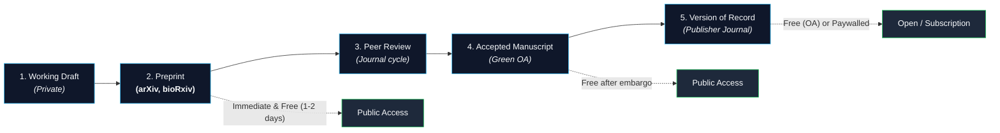
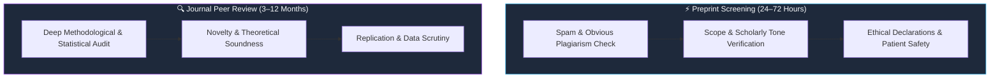
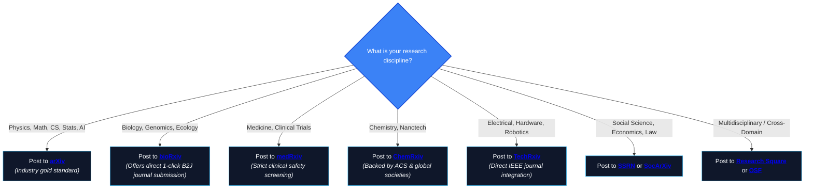

> This is **Part 2** of the [Open Science Toolbox](/posts/open-science-toolbox-free-research/) series.

A **preprint** is a complete, freely accessible scientific manuscript shared on a public server **prior to formal peer review**. It establishes priority, timestamps discovery with a permanent DOI, and accelerates scientific discourse by months or years.

---

## 1. The Publication Pipeline: Where Preprints Fit

| Lifecycle Stage | Peer-Reviewed? | Cost to Read? | Citable with DOI? | Editable? |
| :--- | :---: | :---: | :---: | :--- |
| **Working Paper** | ❌ | Usually Free | ❌ (No DOI) | Internal |
| **Preprint** | ❌ | **100% Free** | ✅ **Yes (DataCite DOI)** | ✅ Versioned (v1, v2, v3) |
| **Accepted Manuscript** | ✅ | Free (Green OA) | ✅ Yes | ❌ Fixed author text |
| **Version of Record (VoR)** | ✅ | Paywalled (or OA APC) | ✅ Yes | ❌ Publisher formatted |

> [!WARNING]
> **Critical Medical & Clinical Caveat:** Preprints have **not** undergone formal peer review. Never base immediate clinical treatments, health policies, or medical prescriptions solely on preprint findings without peer-reviewed validation.

---

## 2. Master Directory of Preprint Servers by Discipline

| Discipline | Top Preprint Server | Operator / Backing | Size | Moderation / Screening | Direct Link |
| :--- | :--- | :--- | :--- | :--- | :--- |
| **Physics, Math, CS, Stats** | **[arXiv](https://arxiv.org/)** | Cornell University | 2.4M+ | Scholarly check + category moderation (1–2 days) | [arxiv.org](https://arxiv.org/) |
| **Biology & Life Sciences** | **[bioRxiv](https://www.biorxiv.org/)** | openRxiv / CSHL | 300K+ | Basic screening & plagiarism check (<48h) | [biorxiv.org](https://www.biorxiv.org/) |
| **Medicine & Clinical** | **[medRxiv](https://www.medrxiv.org/)** | openRxiv / CSHL / BMJ / Yale | 75K+ | Enhanced safety & ethical protocol audit (2–4 days) | [medrxiv.org](https://www.medrxiv.org/) |
| **Chemistry & Materials** | **[ChemRxiv](https://chemrxiv.org/)** | ACS, RSC, GDCh, CSJ, CCS | 25K+ | Chemical society editorial check (1–2 days) | [chemrxiv.org](https://chemrxiv.org/) |
| **Engineering & Tech** | **[TechRxiv](https://www.techrxiv.org/)** | IEEE | 12K+ | IEEE scope and formatting check (1–3 days) | [techrxiv.org](https://www.techrxiv.org/) |
| **Social Sciences & Econ** | **[SSRN](https://www.ssrn.com/)** | Elsevier | 1.2M+ | Working paper series & editorial screening | [ssrn.com](https://www.ssrn.com/) |
| **Psychology** | **[PsyArXiv](https://psyarxiv.com/)** | SIPS / OSF | 18K+ | Community moderation with preregistration links | [psyarxiv.com](https://psyarxiv.com/) |
| **Earth & Space Sciences** | **[ESSOAr](https://www.essoar.org/)** / **[EarthArXiv](https://eartharxiv.org/)** | AGU / CDL | 15K+ | Earth & environmental sciences scope check | [essoar.org](https://www.essoar.org/) |
| **Multidisciplinary** | **[Research Square](https://www.researchsquare.com/)** | Springer Nature partner | 250K+ | Fast screening + live "In Review" journal badge | [researchsquare.com](https://www.researchsquare.com/) |
| **Multidisciplinary (France)**| **[HAL](https://hal.science/)** | CNRS / CCSD | 4M+ | French national repository & preprint archive | [hal.science](https://hal.science/) |

---

## 3. OSF Community Preprint Services

The [Open Science Framework (OSF)](https://osf.io/preprints/) provides open-source repository infrastructure for over 30+ domain-specific and regional preprint hubs:

| Domain | Community Server | Domain | Community Server |
| :--- | :--- | :--- | :--- |
| **Sociology & Social Sci** | [SocArXiv](https://osf.io/preprints/socarxiv) | **Agriculture** | [AgriXiv](https://osf.io/preprints/agrixiv) |
| **Education Research** | [EdArXiv](https://osf.io/preprints/edarxiv) | **Electrochemistry** | [ECSarXiv](https://osf.io/preprints/ecsarxiv) |
| **Law & Jurisprudence** | [LawArXiv](https://osf.io/preprints/lawarxiv) | **Library & Info Science** | [LISSA](https://osf.io/preprints/lissa) |
| **Marine Conservation** | [MarXiv](https://osf.io/preprints/marxiv) | **Metascience** | [MetaArXiv](https://osf.io/preprints/metaarxiv) |
| **Paleontology** | [PaleorXiv](https://osf.io/preprints/paleorxiv) | **Africa Regional Hub** | [AfricArXiv](https://osf.io/preprints/africarxiv) |
| **India Regional Hub** | [IndiaRxiv](https://osf.io/preprints/indiarxiv) | **Latin America / Iberia** | [SciELO Preprints](https://preprints.scielo.org/) |

---

## 4. Screening vs. Peer Review: What Gets Checked?

Preprint servers enforce quality control via **screening**, not exhaustive peer review:

---

## 5. Licensing: Don't Compromise Your Publication Rights

When depositing a preprint, your license choice dictates downstream reuse:

| License | Public Reading | Attribution Required | Derivative Works Allowed | Commercial Exploitation | Recommendation |
| :--- | :---: | :---: | :---: | :---: | :--- |
| **CC-BY 4.0** | ✅ | ✅ | ✅ | ✅ | **Best for maximum citations & grant compliance** |
| **CC-BY-NC** | ✅ | ✅ | ✅ | ❌ | Good if preventing commercial paywall repackaging |
| **CC-BY-ND** | ✅ | ✅ | ❌ | ✅ | ⚠️ Avoid: Disallows translation & figure reuse |
| **CC0 (Public Domain)**| ✅ | ❌ (Academic norms apply) | ✅ | ✅ | **Ideal for raw data tables and software code** |

> [!TIP]
> Always verify your target journal's policy on [Sherpa Romeo](https://v2.sherpa.ac.uk/romeo/). Almost all major publishers (Nature, Science/AAAS, Elsevier, Springer, IEEE, PLOS) fully accept preprinted manuscripts.

---

## 6. How to Select the Right Preprint Server

---

## 7. Open Review Platforms & Living Preprints

Preprints are increasingly reviewed openly by the scientific community before formal acceptance:

- **[PREreview](https://prereview.org/)** — Crowdsourced, structured peer reviews for preprints across disciplines.
- **[Review Commons](https://www.reviewcommons.org/)** — High-quality, journal-agnostic peer review. Authors receive a peer-reviewed "Refereed Preprint" that can be transferred directly to participating journals without starting over.
- **[Peer Community In (PCI)](https://peercommunityin.org/)** — Community of researchers that peer-reviews and recommends preprints for free, creating Diamond OA validation without journal fees.

---

## References & Authority Links

- [Directory of Open Access Preprint Repositories (DOAPR)](https://doapr.coar-repositories.org/repositories/)
- [Sherpa Romeo — Publisher Copyright & Self-Archiving Policies](https://v2.sherpa.ac.uk/romeo/)
- [OSF Preprint Services Infrastructure](https://help.osf.io/article/686-preprint-services)
- [openRxiv Organization](https://www.openrxiv.org/)
- [arXiv Operational Overview & Submission Help](https://info.arxiv.org/help/index.html)

---

*Previous: **[Part 1 — 25+ Academic Search Engines](/posts/open-science-search-engines-discovery-tools/)** | Next: **[Part 3 — How to Find Paywalled Research Papers for Free — Legally](/posts/open-science-find-paywalled-research-free/)***
