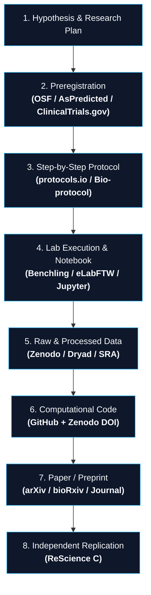
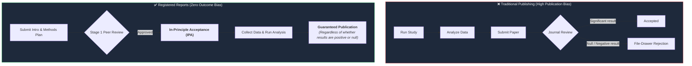

> This is **Part 6** of the [Open Science Toolbox](/posts/open-science-toolbox-free-research/) series.

A journal article typically summarizes complex experiments in 500 words of condensed text: *"Cells were incubated for 24 hours at 37°C."* Crucial procedural details — buffer pH, reagent lot numbers, incubation shaking speed, and exact code parameters — are frequently left out.

In a landmark *Nature* survey of 1,500+ scientists, **over 70% failed to reproduce another researcher's experiments, and 50% failed to reproduce their own**.

This guide covers the open infrastructure designed to eliminate the reproducibility gap: **interactive protocols, preregistrations, registered reports, and electronic lab notebooks**.

---

## 1. Reproducibility vs. Replicability

Before choosing tools, understand the crucial distinction:

```mermaid
flowchart LR
    subgraph Repro["<b>Computational Reproducibility</b>"]
        D1["Same Raw Data"] + C1["Same Code & Env"] --> R1["<b>Exact Same Numbers</b>"]
    end

    subgraph Repli["<b>Scientific Replicability</b>"]
        D2["New / Independent Data"] + C2["Same Methodology"] --> R2["<b>Consistent Scientific Finding</b>"]
    end

    classDef box fill:#0f172a,stroke:#38bdf8,stroke-width:1px,color:#f8fafc;
    class Repro,Repli box;
```

---

## 2. The Complete Open Research Pipeline

A truly open study exposes every stage of the pipeline with persistent identifiers:



---

## 3. Top Open Protocol & Methods Platforms

| Platform | Type | Peer-Reviewed? | DOI Minting | Free Access | Superpower | Direct Link |
| :--- | :--- | :---: | :---: | :---: | :--- | :--- |
| **[protocols.io](https://www.protocols.io/)** | Interactive protocol repository | Community / Optional | ✅ DataCite | ✅ Free for public | Interactive timers, step-by-step mobile checklist mode, version forking. | [protocols.io](https://www.protocols.io/) |
| **[Bio-protocol](https://bio-protocol.org/)** | Open access peer-reviewed journal | ✅ Formal peer review | ✅ DOI | ✅ Free to read | Rigorously reviewed biological & life-science protocols linked to papers. | [bio-protocol.org](https://bio-protocol.org/) |
| **[STAR Methods (Cell Press)](https://www.cell.com/star-methods)** | Structured reporting standard | ✅ Journal peer review | ✅ In paper | Free in OA articles | Standardized Key Resources Table listing all reagents, catalog IDs, and software. | [cell.com/star-methods](https://www.cell.com/star-methods) |
| **[JoVE (Journal of Visualized Experiments)](https://www.jove.com/)** | Video protocol journal | ✅ Video peer review | ✅ DOI | Freemium / Paywalled | High-definition video recordings demonstrating physical wet-lab techniques. | [jove.com](https://www.jove.com/) |
| **[OpenWetWare](https://openwetware.org/)** | Community wiki | ❌ Community wiki | ❌ | ✅ Free | Open wiki for biological and bioengineering lab protocols and reagents. | [openwetware.org](https://openwetware.org/) |

---

## 4. Preregistration & Registered Reports

Preregistration publicly timestamps your hypotheses and statistical analysis plan **before data collection begins**, eliminating p-hacking, HARKing (Hypothesizing After Results are Known), and publication bias.



### Top Preregistration Registries

| Registry | Focus / Discipline | Cost | Embargo Option | Direct Link |
| :--- | :--- | :---: | :---: | :--- |
| **[OSF Registrations](https://osf.io/registrations/)** | All disciplines (psychology, medicine, social science) | **Free** | Up to 4 years | [osf.io/registrations](https://osf.io/registrations/) |
| **[AsPredicted.org](https://aspredicted.org/)** | Fast 9-question template (Wharton Credibility Lab) | **Free** | Private until published | [aspredicted.org](https://aspredicted.org/) |
| **[ClinicalTrials.gov](https://clinicaltrials.gov/)** | Interventional human clinical trials (Mandatory by FDA/NIH) | **Free** | Public | [clinicaltrials.gov](https://clinicaltrials.gov/) |
| **[PROSPERO](https://www.crd.york.ac.uk/prospero/)** | Systematic reviews in health & social care | **Free** | Public | [crd.york.ac.uk/prospero](https://www.crd.york.ac.uk/prospero/) |

> [!TIP]
> **Over 300+ scientific journals** now accept **Registered Reports** (including *Nature Human Behaviour*, *PLOS ONE*, *Royal Society Open Science*, and *BMC Biology*). See the full journal index on [cos.io/rr](https://www.cos.io/initiatives/registered-reports).

---

## 5. Electronic Lab Notebooks (ELNs)

Replace paper lab notebooks with searchable, timestamped, version-controlled digital records:

| ELN Tool | Target Field | Open Source? | Free Tier | Direct Link |
| :--- | :--- | :---: | :---: | :--- |
| **[Benchling](https://www.benchling.com/)** | Molecular biology, CRISPR, genetics | ❌ | Free for academics | [benchling.com](https://www.benchling.com/) |
| **[eLabFTW](https://www.elabftw.net/)** | General laboratory research | ✅ 100% Open Source | Free (Self-hosted) | [elabftw.net](https://www.elabftw.net/) |
| **[SciNote](https://www.scinote.net/)** | Wet-lab experiments & compliance | Partial | Free starter tier | [scinote.net](https://www.scinote.net/) |
| **[JupyterLab / Quarto](https://quarto.org/)** | Computational & data science | ✅ Open Source | Free | [quarto.org](https://quarto.org/) |

---

## 6. The 7-Step Reproducibility Checklist

Before submitting your manuscript, ensure your research bundle is complete:

1. [ ] **Preregistration:** Publicly timestamp hypotheses and sampling plans on [OSF](https://osf.io/registrations/) or [AsPredicted](https://aspredicted.org/).
2. [ ] **Detailed Protocol:** Publish step-by-step lab recipes on [protocols.io](https://www.protocols.io/) with a citable DOI.
3. [ ] **Raw Data Deposit:** Upload raw and cleaned datasets to [Zenodo](https://zenodo.org/) or [Dryad](https://datadryad.org/) under a CC0 license.
4. [ ] **Code Archiving:** Tag a GitHub release and archive it on Zenodo with a [`CITATION.cff`](https://citation-file-format.github.io/) file.
5. [ ] **Environment Freeze:** Include a `Dockerfile`, `requirements.txt`, or `environment.yml` with pinned version numbers.
6. [ ] **Interactive Badge:** Add a 1-click execution badge using [MyBinder](https://mybinder.org/) or [Code Ocean](https://codeocean.com/).
7. [ ] **Preprint Deposit:** Post your working manuscript to [arXiv](https://arxiv.org/) or [bioRxiv](https://www.biorxiv.org/) prior to journal submission.

---

## References & Resources

- [protocols.io — Protocol Sharing Platform](https://www.protocols.io/)
- [Center for Open Science — Registered Reports Directory](https://www.cos.io/initiatives/registered-reports)
- [OSF Registries Guide](https://help.osf.io/article/158-create-a-preregistration)
- [Bio-protocol Peer-Reviewed Journal](https://bio-protocol.org/)
- [ReScience C — Computational Replication Journal](https://rescience.github.io/)
- [Baker, M. (2016). *1,500 scientists lift the lid on reproducibility*. Nature.](https://www.nature.com/articles/533452a)

---

*Previous: **[Part 5 — Scientific Code & Software](/posts/open-science-code-software-reproducible/)** | Next: **[Part 7 — Open APIs for Scientific Papers: Build Research Tools & Pipelines](/posts/open-science-apis-developers-guide/)***
