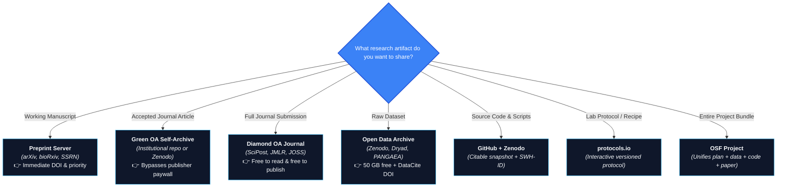
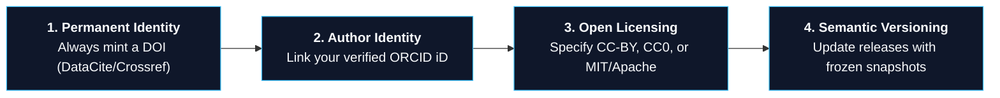

> This is **Part 8** of the [Open Science Toolbox](/posts/open-science-toolbox-free-research/) series.

Publishing research openly should not require thousands of dollars in Article Processing Charges (APCs). Whether you have a working manuscript, a raw dataset, a software package, an experimental protocol, or a PhD thesis, **you can publish and permanently archive your work with a citable DOI for $0**.

---

## 1. What Output Do You Have to Share?



---

## 2. Publishing Manuscripts for $0

### Option A: Preprint Servers (Immediate Global Access)
Deposit your working draft prior to or during journal review. You receive an instant DOI and public priority timestamp:

| Discipline | Top Preprint Server | Review Speed | Direct Link |
| :--- | :--- | :---: | :--- |
| **Physics, Math, CS, Stats** | **[arXiv](https://arxiv.org/)** | 1–2 days | [arxiv.org](https://arxiv.org/) |
| **Biology & Life Sciences** | **[bioRxiv](https://www.biorxiv.org/)** | <48 hours | [biorxiv.org](https://www.biorxiv.org/) |
| **Medicine & Health** | **[medRxiv](https://www.medrxiv.org/)** | 2–4 days | [medrxiv.org](https://www.medrxiv.org/) |
| **Chemistry** | **[ChemRxiv](https://chemrxiv.org/)** | 1–2 days | [chemrxiv.org](https://chemrxiv.org/) |
| **Engineering** | **[TechRxiv](https://www.techrxiv.org/)** (IEEE) | 1–3 days | [techrxiv.org](https://www.techrxiv.org/) |
| **Social Sciences & Econ** | **[SSRN](https://www.ssrn.com/)** | 1–2 days | [ssrn.com](https://www.ssrn.com/) |
| **Multidisciplinary** | **[Research Square](https://www.researchsquare.com/)** / **[HAL](https://hal.science/)** | 1–2 days | [researchsquare.com](https://www.researchsquare.com/) |

---

### Option B: Diamond OA Journals (Zero APC for Authors & Readers)

Diamond Open Access journals do not charge reader subscriptions or author publishing fees:

| Journal | Discipline | Peer Review Model | Direct Link |
| :--- | :--- | :--- | :--- |
| **[JMLR (Journal of Machine Learning Research)](https://jmlr.org/)** | AI / Machine Learning | Rigorous double-blind peer review | [jmlr.org](https://jmlr.org/) |
| **[SciPost](https://scipost.org/)** | Physics, Chemistry, CS, Math | Open, publicly visible peer review | [scipost.org](https://scipost.org/) |
| **[JOSS (Journal of Open Source Software)](https://joss.theoj.org/)** | Research Software | Interactive GitHub-based review | [joss.theoj.org](https://joss.theoj.org/) |
| **[Discrete Analysis](https://discreteanalysisjournal.com/)** | Mathematics | Overlay journal reviewing arXiv preprints | [discreteanalysisjournal.com](https://discreteanalysisjournal.com/) |
| **[Open Library of Humanities (OLH)](https://www.openlibhums.org/)** | Humanities & Social Sciences | Multi-journal consortium platform | [openlibhums.org](https://www.openlibhums.org/) |
| **[DOAJ (Directory of Open Access Journals)](https://doaj.org/)** | All Disciplines | Filter 13,000+ peer-reviewed journals by **"Without APCs"** | [doaj.org](https://doaj.org/) |

---

### Option C: Green OA Self-Archiving (Accepted Manuscripts)

Even when publishing in paywalled commercial journals (Elsevier, Springer, Wiley), over 90% of publisher agreements allow you to deposit your **Author's Accepted Manuscript (AAM)** in an open repository:

1. **Check Journal Embargo Rules:** Look up your journal on **[Sherpa Romeo](https://v2.sherpa.ac.uk/romeo/)**.
2. **Deposit in a Repository:** Upload your post-peer-review Word/LaTeX PDF to your university repository via **[OpenDOAR](https://v2.sherpa.ac.uk/opendoar/)** or directly to **[Zenodo](https://zenodo.org/)**.

---

## 3. The 4 Golden Rules for Research Artifacts



---

## 4. Hosting vs. Digital Preservation (Avoid the Common Trap)

Free web hosting and long-term digital preservation are **not** the same:

| Feature | Active Hosting *(GitHub, Google Drive, Personal Web)* | Digital Preservation *(Zenodo, Software Heritage, PMC)* |
| :--- | :--- | :--- |
| **Primary Goal** | Active collaboration & file sharing | Permanent, immutable digital storage for decades |
| **Risk of Link Rot** | ⚠️ High (links break when accounts change) | ✅ Zero (persistent DOIs resolve forever) |
| **Legal Guarantee** | None (terms of service can change) | Institutional non-profit charter (CERN, UNESCO, NIH) |
| **Best Practice** | Use for **active day-to-day research** | Deposit a frozen snapshot upon **paper publication** |

```text
Active Working Phase:       GitHub / Google Drive / Overleaf
                                     ↓ (On manuscript release)
Permanent Archival Phase:   Zenodo (DOI) + Software Heritage (SWH-ID) + OSF
```

---

## 5. Master Output-to-Repository Cheat Sheet

| Output Type | Best Free Destination | Storage Limit | Persistent ID |
| :--- | :--- | :--- | :--- |
| **Working Manuscript** | [arXiv](https://arxiv.org/) / [bioRxiv](https://www.biorxiv.org/) / [SSRN](https://www.ssrn.com/) | Unlimited | DataCite DOI |
| **Peer-Reviewed Diamond Paper** | [SciPost](https://scipost.org/) / [JOSS](https://joss.theoj.org/) / [JMLR](https://jmlr.org/) | N/A | Crossref DOI |
| **Accepted Manuscript (Green OA)** | Institutional Repo / [Zenodo](https://zenodo.org/) | 50 GB | DataCite DOI |
| **Research Dataset** | [Zenodo](https://zenodo.org/) / [Dryad](https://datadryad.org/) / [PANGAEA](https://www.pangaea.de/) | 50 GB / record | DataCite DOI |
| **Source Code & Software** | [GitHub Releases](https://github.com/) $\to$ [Zenodo](https://zenodo.org/) | 50 GB | Zenodo DOI + SWH-ID |
| **Experimental Protocol** | [protocols.io](https://www.protocols.io/) | Unlimited public | protocols.io DOI |
| **Study Preregistration** | [OSF Registries](https://osf.io/registrations/) | Free (4-yr embargo) | OSF DOI |
| **Conference Poster / Slides** | [Zenodo](https://zenodo.org/) / [Figshare](https://figshare.com/) | 20–50 GB | DataCite DOI |
| **PhD Thesis / Dissertation** | [ThesisCommons (OSF)](https://osf.io/preprints/thesiscommons) / Univ. Repo | Free | DataCite DOI |

---

## References & Authoritative Portals

- [Directory of Open Access Journals (DOAJ) — Zero APC Filter](https://doaj.org/)
- [Sherpa Romeo — Publisher Self-Archiving & Embargo Policies](https://v2.sherpa.ac.uk/romeo/)
- [OpenDOAR — Global Directory of Institutional Repositories](https://v2.sherpa.ac.uk/opendoar/)
- [ORCID Registry — Persistent Researcher Identifiers](https://orcid.org/)
- [Zenodo Open Science Repository (CERN)](https://zenodo.org/)
- [Episciences — Diamond OA Overlay Journal Infrastructure](https://www.episciences.org/)

---

*Previous: **[Part 7 — Open APIs for Scientific Papers](/posts/open-science-apis-developers-guide/)** | Next: **[Part 9 — Free and Open Tools for Planning and Managing Research](/posts/open-science-planning-managing-research/)***
