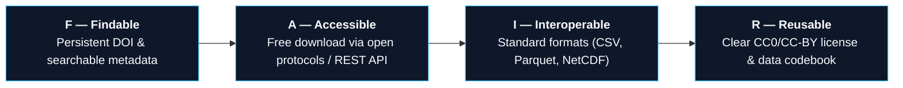
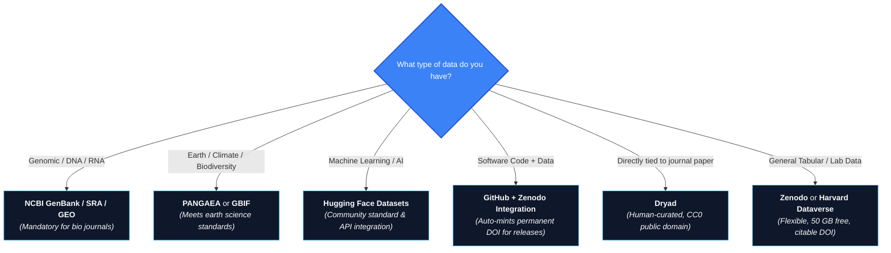

> This is **Part 4** of the [Open Science Toolbox](/posts/open-science-toolbox-free-research/) series.

Published papers show the final conclusions; **open research data** provides the raw evidence. Major research funders (NIH, NSF, Horizon Europe, Wellcome) and top journals now mandate that underlying datasets be deposited in persistent, citable repositories.

This guide helps you choose **where to deposit your research data** and **how to find existing open datasets for reuse**.

---

## 1. The FAIR Data Standard at a Glance

All leading scientific repositories adhere to the **FAIR** data principles:



---

## 2. General-Purpose Data Repositories

If your discipline does not have a specialized archive, choose one of these universal repositories:

| Repository | Operator | Free Storage Limit | DOI Minting | Default License | Killer Feature | Direct Link |
| :--- | :--- | :--- | :---: | :--- | :--- | :--- |
| **[Zenodo](https://zenodo.org/)** | CERN / OpenAIRE | **50 GB / record** (free) | ✅ DataCite | Author choice (CC-BY / CC0) | GitHub 1-click archiving; CERN long-term data guarantee. | [zenodo.org](https://zenodo.org/) |
| **[Dryad](https://datadryad.org/)** | Dryad Nonprofit | Unlimited (large files) | ✅ DataCite | **CC0 only** (Public Domain) | Human curation of data & metadata; tight journal submission tie-ins. | [datadryad.org](https://datadryad.org/) |
| **[Figshare](https://figshare.com/)** | Digital Science | 20 GB total (5 GB/file) | ✅ DataCite | CC-BY / CC0 | Interactive in-browser previews of CSVs, 3D models, and figures. | [figshare.com](https://figshare.com/) |
| **[Harvard Dataverse](https://dataverse.harvard.edu/)** | Harvard Univ. | 2.5 GB / file | ✅ DataCite | CC0 / CC-BY | Hierarchical folders; variable-level statistical codebook parsing. | [dataverse.harvard.edu](https://dataverse.harvard.edu/) |
| **[OSF Projects](https://osf.io/)** | Center for Open Science | 5 GB / file (50 GB project) | ✅ DataCite | Author choice | Unifies preregistration, data, code, and preprint in one workflow. | [osf.io](https://osf.io/) |

> [!TIP]
> **The Safe Default:** When in doubt, deposit on **[Zenodo](https://zenodo.org/)**. It accepts any data format up to 50 GB for free, issues instant DOIs, and is permanently backed by CERN's infrastructure.

---

## 3. Top Discipline-Specific Data Archives

Where discipline-specific repositories exist, journals and funding agencies strongly recommend depositing with them:

### 🧬 Life Sciences, Genomics & Medicine
- **[GenBank](https://www.ncbi.nlm.nih.gov/genbank/)** & **[SRA (Sequence Read Archive)](https://www.ncbi.nlm.nih.gov/sra/)** — Global repositories for DNA/RNA sequence data and high-throughput raw reads (NCBI).
- **[GEO (Gene Expression Omnibus)](https://www.ncbi.nlm.nih.gov/geo/)** — Microarray, RNA-seq, and functional genomics datasets.
- **[Protein Data Bank (PDB / RCSB)](https://www.rcsb.org/)** — Authoritative 3D macromolecular structures of proteins and nucleic acids.
- **[OpenNeuro](https://openneuro.org/)** — Curated open MRI, MEG, EEG, and neuroimaging datasets formatted according to BIDS standards.

### 🌍 Earth, Climate & Environmental Sciences
- **[PANGAEA](https://www.pangaea.de/)** — Open data publisher for earth system science, paleoceanography, and environmental observations.
- **[GBIF (Global Biodiversity Information Facility)](https://www.gbif.org/)** — Open access database of over 2.2 billion species occurrence records.
- **[Copernicus Climate Data Store](https://cds.climate.copernicus.eu/)** — Operational satellite observations, climate reanalysis datasets, and projections from the EU.
- **[NASA Earthdata](https://earthdata.nasa.gov/)** — Full and open satellite observations and geospatial datasets from NASA's Earth Science missions.

### ⚛️ Physics, Astronomy & Materials
- **[CERN Open Data](https://opendata.cern.ch/)** — Open access collision datasets and analysis environments from the Large Hadron Collider (LHC).
- **[HEPData](https://www.hepdata.net/)** — Numerical tables, cross-sections, and data points from published High Energy Physics papers.
- **[MAST (Mikulski Archive)](https://archive.stsci.edu/)** — Astronomical telescope observations from Hubble, JWST, Kepler, and TESS.
- **[Materials Project](https://materialsproject.org/)** — Open computational properties, band structures, and phase diagrams for 150,000+ materials.

### 🤖 Machine Learning & Data Science
- **[Hugging Face Datasets](https://huggingface.co/datasets)** — Open hub for text, audio, and multimodal datasets with 1-line Python loading via `datasets` library.
- **[Papers With Code Datasets](https://paperswithcode.com/datasets)** — Curated ML benchmark datasets mapped directly to papers and performance leaderboards.
- **[Kaggle Datasets](https://www.kaggle.com/datasets)** — Community data platform with cloud Jupyter/GPU execution notebooks.

---

## 4. Decision Flowchart: Where Should You Deposit?



---

## 5. Finding Datasets as a Consumer

If you need open data for research, model training, or validation:

| Search Tool | Scope | Direct Link |
| :--- | :--- | :--- |
| **[Google Dataset Search](https://datasetsearch.research.google.com/)** | Unified search engine across millions of datasets stored on Zenodo, Kaggle, Dataverse, NOAA, etc. | [datasetsearch.research.google.com](https://datasetsearch.research.google.com/) |
| **[re3data.org](https://www.re3data.org/)** | Global registry of 3,000+ research data repositories filterable by domain, country, and license. | [re3data.org](https://www.re3data.org/) |
| **[DataCite Commons](https://commons.datacite.org/)** | Search engine for every dataset, preprint, and software release that has been issued a DataCite DOI. | [commons.datacite.org](https://commons.datacite.org/) |
| **[Zenodo Explore](https://zenodo.org/search)** | Direct keyword search across datasets, software artifacts, and project deliverables. | [zenodo.org/search](https://zenodo.org/search) |

---

## 6. Proper Data Citation & Licensing

### Dataset Citation Standard (DataCite)
When using open data, cite the dataset directly alongside the research paper:

```text
Creator(s) (Year). Dataset Title. Repository Name. https://doi.org/10.xxxx/zenodo.xxxxxx
```

### Choosing the Right License
- **CC0 (Public Domain Dedication):** **Strongly recommended** for raw data tables. Minimizes legal hurdles for downstream aggregation.
- **CC-BY 4.0:** Requires attribution. Appropriate if funder policies require explicit attribution licensing.
- **Sensitive / Clinical Data:** Use controlled-access repositories (e.g., [dbGaP](https://www.ncbi.nlm.nih.gov/gap/), [ICPSR](https://www.icpsr.umich.edu/)) with Data Use Agreements (DUAs).

---

## References & Authoritative Repositories

- [GO FAIR Principles Documentation](https://www.go-fair.org/fair-principles/)
- [re3data — Registry of Research Data Repositories](https://www.re3data.org/)
- [Zenodo Open Repository (CERN)](https://zenodo.org/)
- [Dryad Digital Repository](https://datadryad.org/)
- [Harvard Dataverse](https://dataverse.harvard.edu/)
- [DataCite Metadata Schema](https://schema.datacite.org/)

---

*Previous: **[Part 3 — How to Find Paywalled Research Papers for Free](/posts/open-science-find-paywalled-research-free/)** | Next: **[Part 5 — Scientific Code & Software: Finding & Running Research Code](/posts/open-science-code-software-reproducible/)***
