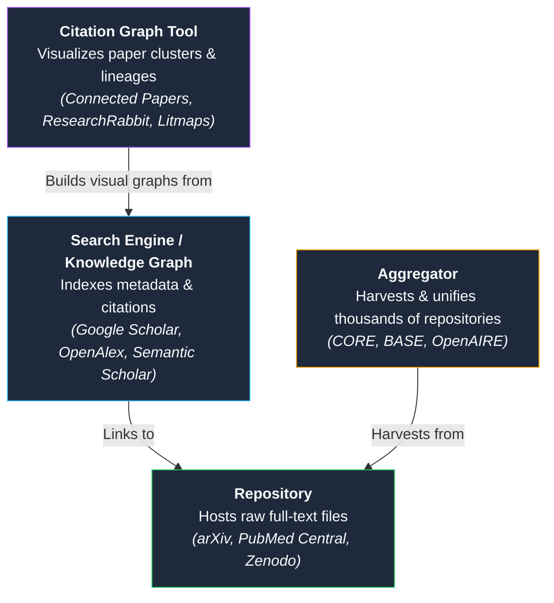
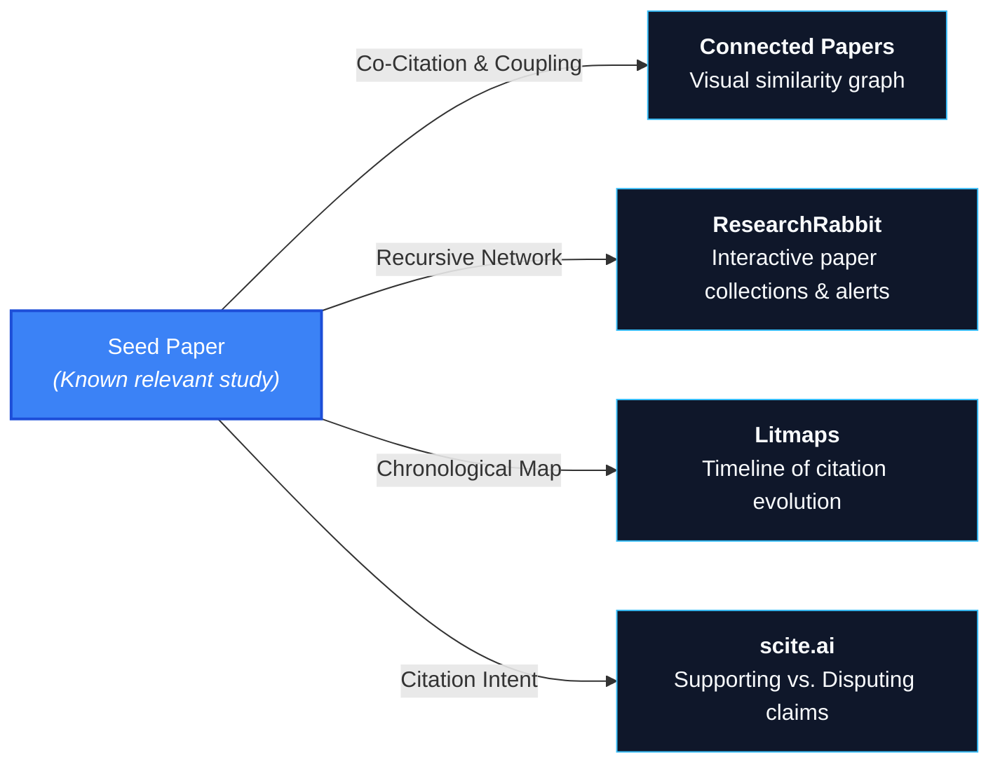
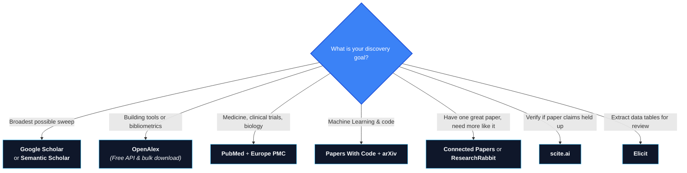

> This is **Part 1** of the [Open Science Toolbox](/posts/open-science-toolbox-free-research/) series.

Finding research is not the same as reading it. This guide focuses entirely on **discovery** — identifying what literature exists, exploring citation networks, and surfacing related work across disciplines.

If you hit a paywall once you discover a paper, see [Part 3: Finding Paywalled Research Legally](/posts/open-science-find-paywalled-research-free/).

---

## 1. Quick Taxonomy: Search Engine vs. Repository vs. Aggregator

Before searching, understand which tool does what:

| Type | Holds Full-Text PDFs? | Primary Purpose | Best Examples |
| :--- | :---: | :--- | :--- |
| **Search Engine** | ❌ (Links only) | Universal discovery & citation tracking | [Google Scholar](https://scholar.google.com/), [OpenAlex](https://openalex.org/) |
| **Repository** | ✅ | Long-term host of primary documents & data | [arXiv](https://arxiv.org/), [PMC](https://www.ncbi.nlm.nih.gov/pmc/) |
| **OA Aggregator** | ✅ | Cross-institutional full-text harvesting | [CORE](https://core.ac.uk/), [BASE](https://www.base-search.net/) |
| **Citation Graph** | ❌ | Literature neighborhood & co-citation maps | [Connected Papers](https://www.connectedpapers.com/), [ResearchRabbit](https://www.researchrabbit.ai/) |
| **AI Assistant** | ❌ / 🔗 | Semantic question answering & extraction | [Elicit](https://elicit.com/), [Consensus](https://consensus.app/) |

---

## 2. Universal Academic Search Engines

| Platform | Best For | Superpower | Limitations | Free API? |
| :--- | :--- | :--- | :--- | :---: |
| **[Google Scholar](https://scholar.google.com/)** | Broadest starting point | Massive coverage; forward citation tracking (`Cited by`) | No public API; opaque ranking; no OA filter | ❌ |
| **[OpenAlex](https://openalex.org/)** | Open research & tool building | 100% open (CC0); 250M+ works; rich API & entity schema | Web UI is evolving; metadata depends on upstream feeds | ✅ Free |
| **[Semantic Scholar](https://www.semanticscholar.org/)** | CS, Bio & fast screening | AI-powered 1-sentence TLDRs; citation intent classification | Gaps in humanities/social sciences | ✅ Free (1–10 rps) |
| **[Lens.org](https://www.lens.org/)** | Academic + Patent analysis | Links 230M+ scholarly works with 160M+ patents | Dense interface; registration needed for bulk export | ✅ (Non-profit tier) |
| **[Dimensions (Free)](https://www.dimensions.ai/)** | Grants & funding insights | Links publications directly to funding grants & trials | Advanced analytics/API locked behind enterprise tier | ❌ (Free web only) |

---

## 3. Discipline-Specific Discovery Engines

### Biomedical & Life Sciences
- **[PubMed](https://pubmed.ncbi.nlm.nih.gov/)** — The gold standard for medicine and biology (37M+ records). Features MeSH controlled vocabulary, strict clinical queries filters, and direct links to free PMC articles. Free API via [NCBI E-Utilities](https://www.ncbi.nlm.nih.gov/books/NBK25501/).
- **[Europe PMC](https://europepmc.org/)** — Extends PubMed with 9M+ directly hosted full texts, bioRxiv/medRxiv preprints, patents, and biological text-mining annotations.

### Computer Science, AI & Engineering
- **[DBLP](https://dblp.org/)** — The definitive bibliography for computer science (7M+ records). Pristine author disambiguation, conference proceedings index, and clean metadata downloads without ads or paywalls.
- **[Papers With Code](https://paperswithcode.com/)** — Essential for machine learning. Pairs published research directly with official GitHub repositories, benchmarks, datasets, and State-of-the-Art (SOTA) leaderboards.
- **[NASA ADS](https://ui.adsabs.harvard.edu/)** — The authoritative index for astronomy, astrophysics, planetary science, and physics (16M+ records). Offers citation metrics and arXiv cross-links.

---

## 4. Open Access Aggregators (Direct Full-Text Search)

These engines do not just index titles — they harvest and host open access full-text documents:

| Aggregator | Records | Key Feature | Direct Link |
| :--- | :--- | :--- | :--- |
| **[CORE](https://core.ac.uk/)** | 200M+ records (34M+ full-text PDFs) | World's largest OA aggregator. Indexes institutional repositories worldwide; offers [CORE Discovery](https://core.ac.uk/services/discovery) browser extension. | [core.ac.uk](https://core.ac.uk/) |
| **[BASE](https://www.base-search.net/)** | 400M+ documents | Operated by Bielefeld University Library. Deeply indexes academic theses, grey literature, and non-commercial institutional servers. | [base-search.net](https://www.base-search.net/) |
| **[OpenAIRE Explore](https://explore.openaire.eu/)** | 160M+ publications | European open science portal linking publications to grants, datasets, and software. | [explore.openaire.eu](https://explore.openaire.eu/) |
| **[Internet Archive Scholar](https://scholar.archive.org/)** | 35M+ preserved articles | Full-text search across digitized and web-crawled PDFs. Preserves dead-link and legacy research. | [scholar.archive.org](https://scholar.archive.org/) |

---

## 5. Citation Graph Visualizers (Beyond Keyword Search)

Keyword search often fails when different fields use different jargon for identical concepts. Citation mapping bypasses keywords by graphing bibliographic connections:

| Tool | Visual Mode | Free Tier | Best Use Case |
| :--- | :--- | :--- | :--- |
| **[Connected Papers](https://www.connectedpapers.com/)** | 2D similarity graph based on co-citation & coupling | 5 graphs / month (free) | Finding the immediate literature "neighborhood" of one paper. |
| **[ResearchRabbit](https://www.researchrabbit.ai/)** | Spotify-like interactive canvas with author & paper networks | **100% Free** | Organizing ongoing literature searches; automated alerts for new related papers. |
| **[Litmaps](https://www.litmaps.com/)** | Timeline chart showing citations mapped across years | Free tier (up to 20 articles/map) | Tracing how a scientific idea evolved over decades and finding foundational antecedents. |
| **[OpenCitations (COCI)](https://opencitations.net/)** | Open database & SPARQL/REST endpoints | **100% Free & Open (CC0)** | Programmatic citation analysis without proprietary lock-in. |

---

## 6. AI-Powered Discovery & Evidence Synthesis

| Tool | How It Works | Free Access | Best Scenario |
| :--- | :--- | :--- | :--- |
| **[Elicit](https://elicit.com/)** | Extracts structured fields (sample size, intervention, findings) across papers into a table. | Free tier (starter credits) | Systematic literature reviews and fast parameter extraction. |
| **[Consensus](https://consensus.app/)** | Queries 200M+ papers and displays an evidence meter (Yes / No / Possible). | Free tier available | Answering causal questions (e.g., *"Does creatine improve cognitive performance?"*). |
| **[scite.ai](https://scite.ai/)** | Classifies citations into **Supporting**, **Mentioning**, or **Contrasting** statements. | Free basic citation badge search | Checking if a paper's findings have been validated or disputed by subsequent studies. |

---

## 7. Master Comparison Matrix

| Platform | Primary Scope | Hosted PDFs | Free API | Bulk Data | Citation Graph | AI Summaries | Open Data (CC0/Open) |
| :--- | :--- | :---: | :---: | :---: | :---: | :---: | :---: |
| **[Google Scholar](https://scholar.google.com/)** | Universal | Links only | ❌ | ❌ | ❌ | ❌ | ❌ |
| **[OpenAlex](https://openalex.org/)** | Universal | Links (OA) | ✅ | ✅ | ✅ | ❌ | ✅ |
| **[Semantic Scholar](https://www.semanticscholar.org/)** | General (CS/Bio) | Links (OA) | ✅ | ✅ | ✅ | ✅ | Partial |
| **[CORE](https://core.ac.uk/)** | Universal OA | ✅ 34M+ | ✅ | ✅ | ❌ | ❌ | ✅ |
| **[PubMed](https://pubmed.ncbi.nlm.nih.gov/)** | Biomedical | Links (PMC) | ✅ | ✅ | ❌ | ❌ | ✅ |
| **[Europe PMC](https://europepmc.org/)** | Biomedical + Preprints | ✅ 9M+ | ✅ | ✅ | Partial | ❌ | ✅ |
| **[DBLP](https://dblp.org/)** | Computer Science | Links only | ✅ | ✅ | ❌ | ❌ | ✅ |
| **[Connected Papers](https://www.connectedpapers.com/)** | Universal | ❌ | ❌ | ❌ | ✅ | ❌ | ❌ |
| **[ResearchRabbit](https://www.researchrabbit.ai/)** | Universal | ❌ | ❌ | ❌ | ✅ | Partial | ❌ |
| **[Papers With Code](https://paperswithcode.com/)** | Machine Learning | Links (arXiv) | ✅ | ✅ | ❌ | ❌ | ✅ |

---

## 8. Automating Literature Tracking

Never run manual keyword searches repeatedly. Configure these 3 automated touchpoints in under 5 minutes:

1. **Google Scholar Alert:** Perform your core search $\to$ click **Create Alert** on the left sidebar $\to$ receive weekly digests of newly published papers matching your keywords.
2. **Semantic Scholar Research Feed:** Follow 2–3 key authors or core papers $\to$ receive a customized, AI-ranked feed of incoming preprints and journal articles.
3. **ResearchRabbit Collection:** Add 5 seed papers into a collection $\to$ turn on email notifications for automatic updates when new related works appear in the network.

---

## 9. Decision Cheat Sheet: Which Tool Should You Open?

---

## References & Further Reading

- [OpenAlex Documentation & API Guide](https://docs.openalex.org/)
- [CORE — Global Open Access Aggregation](https://core.ac.uk/)
- [Semantic Scholar Open Research Corpus](https://www.semanticscholar.org/product/corpus)
- [Connected Papers Methodology: Co-citation & Bibliographic Coupling](https://www.connectedpapers.com/about)
- [NCBI E-Utilities Help Manual](https://www.ncbi.nlm.nih.gov/books/NBK25501/)
- [Premji, McGill & Riegelman (2026). *A comparison of preprint search aggregators*. Research Synthesis Methods.](https://www.cambridge.org/core/services/aop-cambridge-core/content/view/B2BFE829E3D925AA268EB06E7B6A4053/S175928792610101Xa.pdf/a-comparison-of-preprint-search-aggregators-comprehensive-identification-of-preprints-in-the-information-retrieval-stage-of-evidence-syntheses.pdf)

---

*Next in series: **[Part 2 — The Complete Guide to Preprint Servers Across All Disciplines](/posts/open-science-preprint-servers-guide/)***
