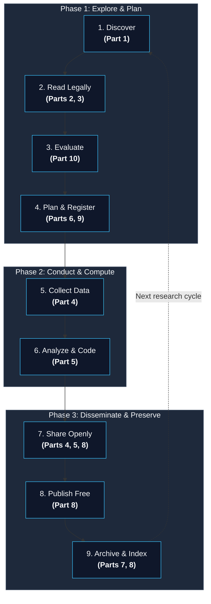
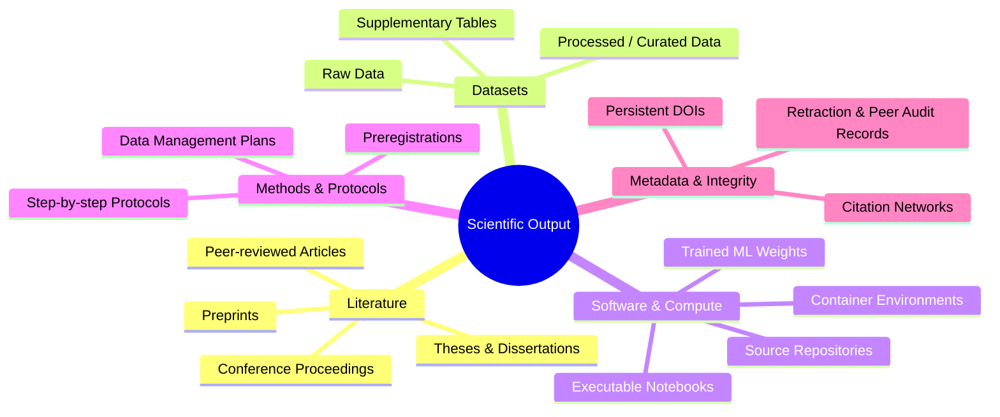
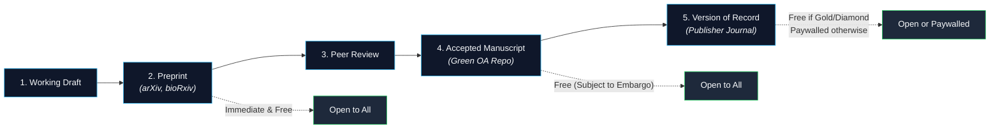
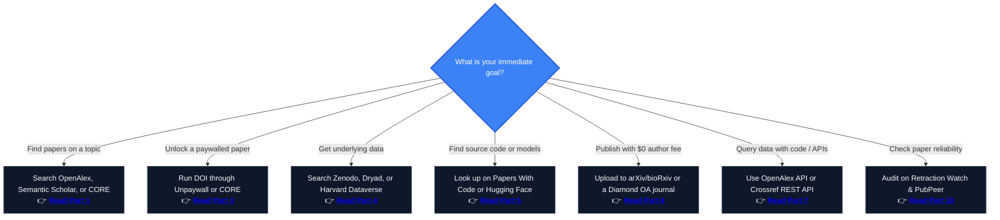

Scientific knowledge belongs to everyone. Yet navigating the landscape of freely available research — papers, data, code, and experimental protocols — can feel overwhelming. Hundreds of specialized platforms exist, each addressing a different stage of the scientific process.

This master guide maps the entire open science ecosystem across the research lifecycle. Use it as a **central navigation hub**: identify the exact category or tool you need, or dive into any of the 10 dedicated deep-dive guides linked below.

---

## The Research Lifecycle

Every scientific investigation moves through structured stages. Open science tools exist for every phase:

- **Discover & Read:** Search indexes ([Part 1](/posts/open-science-search-engines-discovery-tools/)), preprints ([Part 2](/posts/open-science-preprint-servers-guide/)), and legal full-text resolvers ([Part 3](/posts/open-science-find-paywalled-research-free/)).
- **Plan & Execute:** Open protocols & preregistrations ([Part 6](/posts/open-science-protocols-methods-reproducibility/)), reference & data management ([Part 9](/posts/open-science-planning-managing-research/)).
- **Compute & Share:** Public data repositories ([Part 4](/posts/open-science-research-data-repositories/)), open code & reproducible notebooks ([Part 5](/posts/open-science-code-software-reproducible/)).
- **Publish & Validate:** Diamond & Zero-APC publishing ([Part 8](/posts/open-science-publish-archive-research-free/)), programmatic APIs ([Part 7](/posts/open-science-apis-developers-guide/)), and post-publication peer review & retractions ([Part 10](/posts/open-science-peer-review-retractions-quality/)).

---

## What "Scientific Knowledge" Actually Contains

A common misconception is equating "scientific research" strictly with paywalled journal PDFs. A complete scientific output consists of multiple interconnected artifacts:

Each artifact has dedicated platforms engineered for open dissemination, discovery, and citation.

---

## The Categories at a Glance

| Category | Your Core Need | Direct Tools & Links | Deep-Dive Guide |
| :--- | :--- | :--- | :--- |
| **Search Engines** | "Where can I discover research on topic X?" | [OpenAlex](https://openalex.org/), [Google Scholar](https://scholar.google.com/), [Semantic Scholar](https://www.semanticscholar.org/), [CORE](https://core.ac.uk/) | [Part 1: Search & Discovery](/posts/open-science-search-engines-discovery-tools/) |
| **Preprint Servers** | "How can I access research months before publication?" | [arXiv](https://arxiv.org/), [bioRxiv](https://www.biorxiv.org/), [medRxiv](https://www.medrxiv.org/), [SSRN](https://www.ssrn.com/), [OSF Preprints](https://osf.io/preprints/) | [Part 2: Preprint Servers](/posts/open-science-preprint-servers-guide/) |
| **Legal Full-Text** | "This paper is paywalled — where is the legal open copy?" | [Unpaywall](https://unpaywall.org/), [Open Access Button](https://openaccessbutton.org/), [PMC](https://www.ncbi.nlm.nih.gov/pmc/) | [Part 3: Finding Free Papers](/posts/open-science-find-paywalled-research-free/) |
| **Open Datasets** | "Where can I download the underlying research data?" | [Zenodo](https://zenodo.org/), [Dryad](https://datadryad.org/), [Figshare](https://figshare.com/), [Dataverse](https://dataverse.harvard.edu/), [PANGAEA](https://www.pangaea.de/) | [Part 4: Data Repositories](/posts/open-science-research-data-repositories/) |
| **Scientific Software** | "Where is the reproducible code behind this paper?" | [Papers With Code](https://paperswithcode.com/), [GitHub](https://github.com/), [Software Heritage](https://www.softwareheritage.org/), [Code Ocean](https://codeocean.com/) | [Part 5: Code & Software](/posts/open-science-code-software-reproducible/) |
| **Protocols & Workflows** | "How exactly was this wet-lab or computational experiment run?" | [protocols.io](https://www.protocols.io/), [OSF](https://osf.io/), [MyBinder](https://mybinder.org/), [Bio-protocol](https://bio-protocol.org/) | [Part 6: Protocols & Reproducibility](/posts/open-science-protocols-methods-reproducibility/) |
| **Developer APIs** | "How can I query research papers and citation graphs in code?" | [OpenAlex API](https://docs.openalex.org/), [Crossref API](https://www.crossref.org/documentation/retrieve-metadata/rest-api/), [Semantic Scholar API](https://www.semanticscholar.org/product/api) | [Part 7: Developer APIs](/posts/open-science-apis-developers-guide/) |
| **Publishing & Archiving** | "How do I publish or deposit research openly with a DOI for free?" | [Zenodo](https://zenodo.org/), [arXiv](https://arxiv.org/), [JOSS](https://joss.theoj.org/), [SciPost](https://scipost.org/), [DOAJ](https://doaj.org/) | [Part 8: Publishing & Archiving](/posts/open-science-publish-archive-research-free/) |
| **Planning & Reference** | "How do I organize literature, notes, and data plans?" | [Zotero](https://www.zotero.org/), [DMPTool](https://dmptool.org/), [Obsidian](https://obsidian.md/), [Overleaf](https://www.overleaf.com/) | [Part 9: Planning & Managing](/posts/open-science-planning-managing-research/) |
| **Research Integrity** | "How do I check if a paper is flawed, disputed, or retracted?" | [Retraction Watch](https://retractiondatabase.org/), [PubPeer](https://pubpeer.com/), [scite.ai](https://scite.ai/) | [Part 10: Peer Review & Quality](/posts/open-science-peer-review-retractions-quality/) |

---

## Tailored Pathways: Where to Start

Find your role to navigate the most relevant guides immediately:

| If You Are A... | Primary Objective | Recommended Route |
| :--- | :--- | :--- |
| **Student / Self-Learner** | Find, read, and cite peer-reviewed papers without paywalls. | [Part 1](/posts/open-science-search-engines-discovery-tools/) $\to$ [Part 3](/posts/open-science-find-paywalled-research-free/) $\to$ [Part 10](/posts/open-science-peer-review-retractions-quality/) |
| **PhD Researcher / Postdoc** | Literature reviews, preprint awareness, and project workflow. | [Part 1](/posts/open-science-search-engines-discovery-tools/) $\to$ [Part 2](/posts/open-science-preprint-servers-guide/) $\to$ [Part 9](/posts/open-science-planning-managing-research/) |
| **Principal Investigator / Author** | Maximize citations, meet funder OA mandates, deposit data/code. | [Part 2](/posts/open-science-preprint-servers-guide/) $\to$ [Part 4](/posts/open-science-research-data-repositories/) $\to$ [Part 8](/posts/open-science-publish-archive-research-free/) |
| **Data Scientist / ML Engineer** | Download benchmark datasets, extract trained weights and pipelines. | [Part 4](/posts/open-science-research-data-repositories/) $\to$ [Part 5](/posts/open-science-code-software-reproducible/) $\to$ [Part 7](/posts/open-science-apis-developers-guide/) |
| **Software Developer** | Programmatically query scholarly graphs, bibliometrics, and metadata. | [Part 1](/posts/open-science-search-engines-discovery-tools/) $\to$ [Part 7](/posts/open-science-apis-developers-guide/) |
| **Evidence / Systematic Reviewer** | Comprehensive literature synthesis, grey literature, and audit trails. | [Part 1](/posts/open-science-search-engines-discovery-tools/) $\to$ [Part 2](/posts/open-science-preprint-servers-guide/) $\to$ [Part 10](/posts/open-science-peer-review-retractions-quality/) |

---

## Open Access: The Quick Cheat Sheet

Not all "free" papers operate under the same licensing or cost models. Understanding these distinctions helps you find legal copies and publish without high Article Processing Charges (APCs):

| OA Model | Definition | Who Pays? | Practical Examples |
| :--- | :--- | :--- | :--- |
| **Diamond OA** | Fully Open Access journal with **no author fees (zero APC)**. | Funded by universities, societies, or libraries | [JMLR](https://jmlr.org/), [SciPost](https://scipost.org/), [Discrete Analysis](https://discreteanalysisjournal.com/) |
| **Green OA** | Author self-archives peer-reviewed accepted manuscript in a repository. | **$0** (Free for author and reader) | Institutional Repositories, [PubMed Central](https://www.ncbi.nlm.nih.gov/pmc/), [Zenodo](https://zenodo.org/) |
| **Preprint** | Version of manuscript shared publicly before/during formal peer review. | **$0** (Free for author and reader) | [arXiv](https://arxiv.org/), [bioRxiv](https://www.biorxiv.org/), [medRxiv](https://www.medrxiv.org/) |
| **Gold OA** | Publisher makes article freely available immediately upon publication. | Author / Funder pays APC ($1k–$11k+) | *PLOS ONE*, *Nature Communications* |
| **Hybrid OA** | Open Access article published inside a subscription/paywalled journal. | Author / Funder pays APC (often very costly) | Elsevier, Springer, Wiley open options |
| **Bronze OA** | Free to read on publisher website, but lacks an open reuse license. | Publisher discretion (can be revoked anytime) | Promotional journal releases, COVID-19 portals |

> [!TIP]
> **Key Rule of Thumb:** You never need to pay an APC to make your research publicly accessible. Post a **Preprint** before submission and deposit your **Accepted Manuscript (Green OA)** upon journal acceptance.

---

## The Publication Journey & Where to Intercept Papers

---

## Quick Decision Tree: What Do You Need Right Now?

---

## 10-Part Series Navigation Guide

### 🔍 [Part 1 — 25+ Free Academic Search Engines & Discovery Tools](/posts/open-science-search-engines-discovery-tools/)
- **Focus:** Universal search indexes, citation network visualizers, biomedical search, and AI discovery.
- **Key Tools:** [OpenAlex](https://openalex.org/), [Semantic Scholar](https://www.semanticscholar.org/), [CORE](https://core.ac.uk/), [Connected Papers](https://www.connectedpapers.com/).
- **Best For:** Literature mapping, discovering related work, and uncovering open full texts.

### 📄 [Part 2 — The Complete Guide to Preprint Servers Across All Disciplines](/posts/open-science-preprint-servers-guide/)
- **Focus:** Server mechanics, moderation speeds, licensing, DOI assignment, and journal scoop policies.
- **Key Tools:** [arXiv](https://arxiv.org/), [bioRxiv](https://www.biorxiv.org/), [medRxiv](https://www.medrxiv.org/), [SSRN](https://www.ssrn.com/), [OSF Preprints](https://osf.io/preprints/).
- **Best For:** Accessing cutting-edge discoveries months ahead of traditional journal cycles.

### 🔓 [Part 3 — How to Find Paywalled Research Papers for Free — Legally](/posts/open-science-find-paywalled-research-free/)
- **Focus:** A bulletproof 6-step workflow to legally resolve paywalled articles via author repositories and Green OA.
- **Key Tools:** [Unpaywall](https://unpaywall.org/), [Open Access Button](https://openaccessbutton.org/), [Dissemin](https://dissem.in/), [Google Scholar button](https://chrome.google.com/webstore/detail/google-scholar-button/ldipcbkfgcflbgooiccgdddiejmpbkgd).
- **Best For:** Independent researchers, students, and practitioners lacking university library subscriptions.

### 📊 [Part 4 — Open Research Data Repositories: Where Scientists Share Data](/posts/open-science-research-data-repositories/)
- **Focus:** FAIR data sharing, general repositories vs. discipline archives, metadata standards, and data citation.
- **Key Tools:** [Zenodo](https://zenodo.org/), [Dryad](https://datadryad.org/), [Figshare](https://figshare.com/), [PANGAEA](https://www.pangaea.de/), [Dataverse](https://dataverse.harvard.edu/).
- **Best For:** Locating raw research datasets and fulfilling open data grant mandates.

### 💻 [Part 5 — Scientific Code & Software: Finding & Running Research Code](/posts/open-science-code-software-reproducible/)
- **Focus:** Tracking software repositories, persistent code DOIs, software preservation, and live executable environments.
- **Key Tools:** [Papers With Code](https://paperswithcode.com/), [GitHub](https://github.com/), [Software Heritage](https://www.softwareheritage.org/), [Code Ocean](https://codeocean.com/), [MyBinder](https://mybinder.org/).
- **Best For:** ML/AI engineers and computational scientists replicating published experiments.

### 🧪 [Part 6 — Protocols, Methods & Reproducibility: Beyond the Static Paper](/posts/open-science-protocols-methods-reproducibility/)
- **Focus:** Step-by-step experimental recipes, preregistration, registered reports, and interactive computational notebooks.
- **Key Tools:** [protocols.io](https://www.protocols.io/), [OSF Registries](https://osf.io/registries), [Bio-protocol](https://bio-protocol.org/), [Jupyter](https://jupyter.org/).
- **Best For:** Wet-lab experimentalists and data analysts requiring verifiable, step-by-step methodologies.

### ⚡ [Part 7 — Open APIs for Scientific Papers: Build Research Tools & Pipelines](/posts/open-science-apis-developers-guide/)
- **Focus:** Querying scholarly endpoints, bulk metadata dumps, rate limits, authentication, and SDKs.
- **Key Tools:** [OpenAlex API](https://docs.openalex.org/), [Crossref REST API](https://www.crossref.org/documentation/retrieve-metadata/rest-api/), [Semantic Scholar API](https://www.semanticscholar.org/product/api), [NCBI E-Utilities](https://www.ncbi.nlm.nih.gov/books/NBK25501/).
- **Best For:** Software engineers, scientometrics analysts, and AI application developers.

### 🏛️ [Part 8 — Where to Publish or Archive Your Research for Free](/posts/open-science-publish-archive-research-free/)
- **Focus:** Zero-cost publishing strategies, Diamond OA journals, self-archiving policies, and permanent DOIs.
- **Key Tools:** [DOAJ (Zero APC Filter)](https://doaj.org/), [Sherpa Romeo](https://v2.sherpa.ac.uk/romeo/), [SciPost](https://scipost.org/), [JOSS](https://joss.theoj.org/), [Zenodo](https://zenodo.org/).
- **Best For:** Authors seeking global visibility and high citations without paying thousands in APCs.

### 🗂️ [Part 9 — Planning and Managing Open Research Projects](/posts/open-science-planning-managing-research/)
- **Focus:** Reference management, Data Management Plans (DMPs), open collaboration, and version-controlled writing.
- **Key Tools:** [Zotero](https://www.zotero.org/), [DMPTool](https://dmptool.org/), [OSF](https://osf.io/), [Overleaf](https://www.overleaf.com/), [Obsidian](https://obsidian.md/).
- **Best For:** Organizing projects from initial hypothesis to final archival storage.

### 🛡️ [Part 10 — Research Integrity: Peer Review, Retractions & Quality Audit](/posts/open-science-peer-review-retractions-quality/)
- **Focus:** Identifying retracted papers, evaluating citation context, post-publication peer review, and avoiding predatory venues.
- **Key Tools:** [Retraction Watch Database](https://retractiondatabase.org/), [PubPeer](https://pubpeer.com/), [scite.ai](https://scite.ai/), [Cabells Predatory Reports](https://www.cabells.com/).
- **Best For:** Evaluating study credibility, systematic reviewers, and preventing citation of debunked work.

---

## Instant Platform Quick Reference

| I Want To... | Top Recommended Platform | Deep Dive |
| :--- | :--- | :--- |
| **Search 250M+ scholarly works freely** | [OpenAlex](https://openalex.org/) or [Google Scholar](https://scholar.google.com/) | [Part 1](/posts/open-science-search-engines-discovery-tools/) |
| **Auto-detect free legal PDFs in browser** | [Unpaywall Browser Extension](https://unpaywall.org/products/extension) | [Part 3](/posts/open-science-find-paywalled-research-free/) |
| **Read latest AI, Math, and Physics preprints** | [arXiv.org](https://arxiv.org/) | [Part 2](/posts/open-science-preprint-servers-guide/) |
| **Read Biology & Medicine preprints** | [bioRxiv](https://www.biorxiv.org/) & [medRxiv](https://www.medrxiv.org/) | [Part 2](/posts/open-science-preprint-servers-guide/) |
| **Access 9M+ free biomedical articles** | [PubMed Central (PMC)](https://www.ncbi.nlm.nih.gov/pmc/) | [Part 3](/posts/open-science-find-paywalled-research-free/) |
| **Explore visual citation graphs** | [Connected Papers](https://www.connectedpapers.com/) | [Part 1](/posts/open-science-search-engines-discovery-tools/) |
| **Deposit datasets with a free DOI** | [Zenodo (CERN)](https://zenodo.org/) | [Part 4](/posts/open-science-research-data-repositories/) |
| **Archive code releases with a DOI** | [GitHub + Zenodo Integration](https://zenodo.org/account/settings/github/) | [Part 5](/posts/open-science-code-software-reproducible/) |
| **Find ML papers paired with code & benchmarks** | [Papers With Code](https://paperswithcode.com/) | [Part 5](/posts/open-science-code-software-reproducible/) |
| **Explore community models & datasets** | [Hugging Face](https://huggingface.co/) | [Part 5](/posts/open-science-code-software-reproducible/) |
| **Manage citations & auto-sync PDFs** | [Zotero](https://www.zotero.org/) | [Part 9](/posts/open-science-planning-managing-research/) |
| **Build applications on research metadata** | [OpenAlex REST API](https://docs.openalex.org/) | [Part 7](/posts/open-science-apis-developers-guide/) |
| **Publish open peer-reviewed papers for $0** | [SciPost](https://scipost.org/), [JOSS](https://joss.theoj.org/), [JMLR](https://jmlr.org/) | [Part 8](/posts/open-science-publish-archive-research-free/) |
| **Check journal self-archiving & embargo policies** | [Sherpa Romeo](https://v2.sherpa.ac.uk/romeo/) | [Part 8](/posts/open-science-publish-archive-research-free/) |
| **Check if a paper is retracted or disputed** | [Retraction Watch](https://retractiondatabase.org/) & [PubPeer](https://pubpeer.com/) | [Part 10](/posts/open-science-peer-review-retractions-quality/) |
| **Check if citations support or dispute claims** | [scite.ai Smart Citations](https://scite.ai/) | [Part 10](/posts/open-science-peer-review-retractions-quality/) |

---

## What This Series Does Not Cover

To ensure 100% legal, sustainable, and institution-independent workflows, this series strictly excludes:
- **Shadow Libraries & Piracy Platforms:** No Sci-Hub, LibGen, or unauthorized mirror services. Every method presented is 100% legal and publisher-compliant.
- **Paywalled Commercial Databases:** No proprietary tools requiring university or corporate licenses (e.g., Web of Science, Scopus, SciFinder).
- **AI Text Generators:** This series focuses on scientific discovery, data access, software reproducibility, and research management — not automated manuscript generation.

---

## Authoritative References & Foundations

- [Directory of Open Access Preprint Repositories (DOAPR)](https://doapr.coar-repositories.org/repositories/) — Global registry of preprint repositories.
- [OpenAlex Documentation & Schema](https://docs.openalex.org/) — Open catalog of global scholarly papers, authors, and institutions.
- [CORE Project](https://core.ac.uk/) — World's largest aggregator of open access research outputs.
- [Directory of Open Access Journals (DOAJ)](https://doaj.org/) — Authoritative database of verified, peer-reviewed open access journals.
- [Unpaywall Database](https://unpaywall.org/) — Open database harvesting legal full-text manuscripts from 50,000+ publishers and repositories.
- [Open Science Framework (OSF)](https://osf.io/) — Center for Open Science research management portal.
- [Zenodo (CERN)](https://zenodo.org/) — Universal open-access repository built under the European OpenAIRE program.
- [Premji, McGill & Riegelman (2026). *A comparison of preprint search aggregators*. Research Synthesis Methods.](https://www.cambridge.org/core/services/aop-cambridge-core/content/view/B2BFE829E3D925AA268EB06E7B6A4053/S175928792610101Xa.pdf/a-comparison-of-preprint-search-aggregators-comprehensive-identification-of-preprints-in-the-information-retrieval-stage-of-evidence-syntheses.pdf)

---

*This is the central pillar article for the 10-part Open Science series. Follow any of the linked guides above to explore each domain in depth.*
