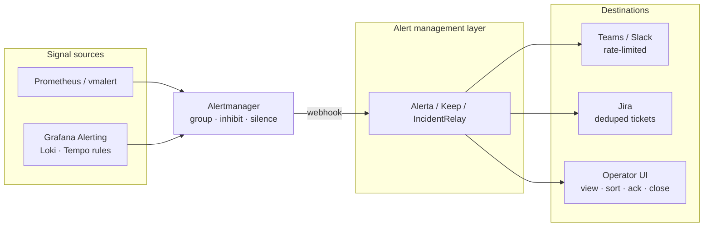

To solve high-velocity **Microsoft Teams throttling** and **Jira ticket duplication**, you need an open-source **alert router and event correlation engine**. That layer sits between your observability tools (Prometheus, VictoriaMetrics, Loki, Tempo) and notification endpoints. It acts as a **buffer**, **deduplicator**, and **operational UI pane**.

Prometheus Alertmanager groups and routes well — but it is not a full operator inbox. Teams rate-limits webhook floods. Jira creates duplicate tickets for the same flapping signal. The console must support high ingest, webhook receivers, view / sort / acknowledge / close, and deploy as Docker, Kubernetes HA, or standalone.

This guide compares the closest practical alternatives to **[Alerta](https://github.com/alerta/alerta)** — with deep dives on **Keep**, **Alerta**, and **Alertmanager + Karma** — plus on-call/incident platforms (**FluidifyAI Regen**, **GoAlert**, **IncidentRelay**), Alertmanager UIs (**Jarvis**, **Karma**), and related options.

For full three-signal platforms, see [Open-Source Observability Platforms Compared](). For metrics backends that feed these tools, see [Open-Source Metrics Tools Compared]().

### TL;DR — Revised shortlist

| Priority | Tool | Best when… |
| -------- | ---- | ---------- |
| 1 | **[Alerta](https://github.com/alerta/alerta)** | You want the simplest, most mature focused alert aggregator (ack / shelve / close / blackout) |
| 2 | **[Keep](https://github.com/keephq/keep)** | You want richer correlation, enrichment, UI workflows, and Jira sync/automation |
| 3 | **[IncidentRelay](https://github.com/roxy-wi/IncidentRelay)** | On-call rotations, reminders, and escalations are first-class requirements |
| 4 | **[Jarvis](https://github.com/kj187/jarvis)** | Minimal ops overhead and you mostly consume Alertmanager-compatible alerts |

| Use case | Best fit | Runner-up | Why |
| -------- | -------- | --------- | --- |
| **Lean alert console (ack / shelve / close)** | **Alerta** | Keep | Focused aggregator; minimal product surface |
| **Single pane + dedup / workflows before Teams/Jira** | **Keep** | Alerta | Correlation, enrichment, bi-directional integrations |
| **On-call + escalation + Teams Adaptive Cards** | **[Regen](https://github.com/FluidifyAI/Regen)** (PoC) | IncidentRelay | Full incident + schedule platform; younger project |
| **Lightest paging / ack / close backbone** | **GoAlert** | IncidentRelay | Single Go binary + Postgres; enterprise-proven at Target |
| **Better UI on existing Alertmanager only** | **Jarvis** | Karma | Claim, comments, history, multi-AM — not a generic store |
| **Broader incident / status / monitors suite** | **OneUptime** | Skylogs | Heavier than Alerta; PoC before replacing a thin console |
| **Grouping / inhibit / silence ingress** | **Alertmanager** | — | Keep as router; forward to Alerta / Keep / on-call tool |

> Jump to [Production core](#production-core-keep-alerta-alertmanager--karma), [On-call platforms](#on-call--incident-platforms-regen-goalert), [setup strategy](#actionable-setup-strategy), or [When to use what](#when-to-use-what).

**Do not start new work on Grafana OnCall OSS** — it was archived in March 2026. Prefer **Regen**, **GoAlert**, **IncidentRelay**, **Keep**, or **Alerta** depending on whether you need a full incident platform, paging, or an alert inbox.

## Table of Contents

- [TL;DR — Revised shortlist](#tldr--revised-shortlist)
- [The problem: throttling and duplicate tickets](#the-problem-throttling-and-duplicate-tickets)
- [Where an alert console sits in the stack](#where-an-alert-console-sits-in-the-stack)
- [Selection criteria](#selection-criteria)
- [Three categories (do not mix them up)](#three-categories-do-not-mix-them-up)
- [Production core: Keep, Alerta, Alertmanager + Karma](#production-core-keep-alerta-alertmanager--karma)
- [Core three-way matrix](#core-three-way-matrix)
- [On-call & incident platforms: Regen, GoAlert](#on-call--incident-platforms-regen-goalert)
- [Closest alternatives to Alerta](#closest-alternatives-to-alerta)
- [Candidate tools (detail)](#candidate-tools-detail)
- [Capability matrix](#capability-matrix)
- [Architecture & self-hosting](#architecture--self-hosting)
- [Ingest from Prometheus, VictoriaMetrics, Loki, Tempo](#ingest-from-prometheus-victoriametrics-loki-tempo)
- [Actionable setup strategy](#actionable-setup-strategy)
- [When to use what](#when-to-use-what)
- [Known limitations](#known-limitations)
- [FAQ](#faq)

## The problem: throttling and duplicate tickets

Two failure modes show up as soon as alert velocity rises:

1. **Chat throttling** — Microsoft Teams (and similar channels) reject or delay bursts of webhook posts. Every Alertmanager group that fans out as a separate message competes for the same rate limit.
2. **Ticketing duplication** — Jira (or ServiceNow) integrations that open one issue per firing alert create floods for the same `(service, alertname, instance)` fingerprint when labels flap or `repeat_interval` re-fires.

**Do not choose a tool only because it supports Teams.** Teams should be an **output channel** behind controlled routing, grouping, and rate limiting.

Alertmanager already provides grouping, deduplication, silencing, inhibition, and webhook delivery. Use it as the **ingress / routing layer**, then forward normalized alerts to Alerta, Keep, or IncidentRelay. That gap — durable ack/close, correlation policies, and gated outbound — is what the tools below fill.

## Where an alert console sits in the stack



**Pattern that works in practice:**

```text
Prometheus / vmalert / Grafana (Loki·Tempo rules)
  → Alertmanager (group / inhibit / silence)
  → Alerta or Keep or IncidentRelay (dedup, UI, ack/close)
  → Teams (throttled) + Jira (policy-gated)
```

Do not send raw high-velocity Alertmanager traffic straight to Teams or Jira.

**Lightweight variant** (stay on Alertmanager as the store):

```text
Alertmanager → Jarvis or Karma (UI: claim / silence / history)
            → optional webhook to Teams only after AM grouping
```

Jarvis/Karma improve the AM day-to-day UI; they are not a generic multi-source alert store or correlation platform.

## Selection criteria

Tools in the primary shortlist had to meet most of the following:

1. **Open source and self-hostable** — usable without a mandatory SaaS control plane
2. **Webhook / HTTP ingest** — Alertmanager-style or generic JSON payloads
3. **Operator actions** — view, filter/sort, acknowledge, and resolve/close (or claim/silence equivalent)
4. **Deployable as containers** — Docker Compose and/or Kubernetes
5. **Fits the Prometheus-adjacent stack** — path from Prometheus, VictoriaMetrics, Loki, and Tempo via Alertmanager or Grafana Alerting

## Three categories (do not mix them up)

Lists of “open-source on-call tools” often mix three different jobs:

| Category | Job | Examples in this guide |
| -------- | --- | ---------------------- |
| **Alert routers / consoles** | Ingest, dedupe, ack/close; decide *what* is noisy | Alerta, Keep, Alertmanager (+ Karma/Jarvis) |
| **Scheduling + escalation** | Decide *who* gets paged; rotations, escalate until ack | GoAlert, IncidentRelay |
| **Full incident platforms** | Alerts + on-call + incident timeline (+ often chat sync) | FluidifyAI Regen, OneUptime, Skylogs |

For **Teams throttling + Jira duplication**, start with an **alert router** (Alerta/Keep) or Alertmanager grouping. Add GoAlert/IncidentRelay/Regen when paging and schedules are the missing piece — not instead of dedup.

## Production core: Keep, Alerta, Alertmanager + Karma

These three are the most common production-shaped answers when the requirement is high velocity, self-host HA, and a path to Teams/Jira that is not a firehose.

### 1. Keep (KeepHQ)

[Keep](https://github.com/keephq/keep) consolidates fragmented monitoring alerts into one AIOps / alert-management plane.

| Dimension | What matters for Teams / Jira storms |
| --------- | ------------------------------------ |
| **High volume & velocity** | Typical deploy splits **FastAPI** backend, **Next.js** UI, and a **Redis** (or equivalent) queue. Webhooks can be accepted quickly and processed asynchronously, which reduces backpressure during alert storms. |
| **Dedup & correlation** | Declarative **YAML workflows**: aggregate identical alerts, suppress noise, cross-correlate related events **before** downstream webhooks fire — the main lever against Teams floods and duplicate Jira issues. |
| **UI controls** | View, sort, filter, acknowledge, and manually resolve/close. |
| **Deploy & integrate** | Docker, Compose, standalone, or **HA Kubernetes (Helm)**. Generic authenticated HTTP intake plus providers for Prometheus, VictoriaMetrics, Loki, Tempo, Slack, Teams, and Jira. |

Keep can sit **behind** Alertmanager (recommended if you already own AM grouping) or accept provider webhooks more directly when you want the workflow engine as the primary policy layer.

### 2. Alerta

[Alerta](https://github.com/alerta/alerta) is the classic, battle-tested alert console designed for high fan-in.

| Dimension | What matters for Teams / Jira storms |
| --------- | ------------------------------------ |
| **High volume & velocity** | Lightweight Python API backed by **MongoDB or PostgreSQL**; built for many fast-firing sources writing into one console. |
| **Dedup & correlation** | Native structural dedup on **environment + resource + event** (and related keys). Duplicates increment a **duplicate counter** on one row instead of creating thousands of unique items. |
| **UI controls** | Fast ops-center console: sort by severity/time, acknowledge, shelve, close/delete. |
| **Deploy & integrate** | Standalone, Docker, or HA behind a load balancer with shared DB. JSON webhooks plus community plugins; native Prometheus Alertmanager webhook path. |

Alerta is usually the thinnest “real” alert store if you do not need Keep-style workflow automation or IncidentRelay-style on-call.

### 3. Prometheus Alertmanager + Karma UI

Stay close to the cloud-native stack: **Alertmanager** for routing, **Karma** for a usable multi-AM dashboard.

| Dimension | What matters for Teams / Jira storms |
| --------- | ------------------------------------ |
| **High volume & velocity** | Routing trees + gossip **HA mesh** on Kubernetes; Prometheus/vmalert send to all peers. |
| **Dedup & correlation** | `group_by`, `group_wait`, `group_interval`, `repeat_interval`, plus **inhibition** and **silences** — excellent gatekeeping before any external integration. |
| **UI controls (Karma)** | Richer than stock AM UI: filter, regex search, silence management, multi-Alertmanager views. **Not** a full Alerta/Keep ack/close lifecycle — silences ≠ human acknowledge. Prefer **Jarvis** if you need claim/comments/history on top of AM. |
| **Deploy & integrate** | Official Helm charts and binaries. Native receiver for Prometheus, VictoriaMetrics (`vmalert`), Loki/Tempo via Grafana Alerting or rulers that speak Alertmanager. |

Use AM+Karma when grouping/silencing is enough and you accept that Teams/Jira still need careful `webhook_configs` (or a second hop into Keep/Alerta).

## Core three-way matrix

| Feature | Keep | Alerta | Alertmanager + Karma |
| ------- | ---- | ------ | -------------------- |
| **Primary focus** | AIOps, workflow automation, multi-source correlation | Lightweight central alert store & state tracking | Cloud-native grouping & silencing |
| **Dedup method** | YAML workflows (+ correlation rules) | Structural keys; duplicate counter on one alert | `group_by` / inhibit / silence |
| **UI feel** | Modern pane-of-glass | Fast, minimalist ops console | Filterable, read-heavy AM dashboard |
| **State operations** | View, ack, dismiss/resolve, trigger workflows | View, ack, close, shelve, blackout | View, filter, silence (Karma); no full ack/close store |
| **Native HA** | Yes (K8s; split API & queue workers) | Yes (stateless API + shared DB) | Yes (gossip protocol mesh) |
| **Best outbound story for Teams/Jira** | Workflows gate and enrich before send | Plugins / webhooks after console policy | AM `webhook_configs` only — easy to flood if misconfigured |

## On-call & incident platforms: Regen, GoAlert

When the gap is **paging / schedules / incident coordination** (not only dedup), evaluate these next to IncidentRelay.

### FluidifyAI Regen

[FluidifyAI Regen](https://github.com/FluidifyAI/Regen) is a self-hosted **full platform**: alert ingestion, on-call, escalation, incident timelines, and chat sync. AGPLv3; Docker Compose and Kubernetes (Helm). Created in 2026 — treat as **PoC-first**, not a decade-proven Alerta substitute.

| Dimension | Notes |
| --------- | ----- |
| **Dedup / noise** | Pattern matching and routing so only page-worthy signals reach on-call; claim “learns from history” — validate on your label set |
| **UI** | Central dashboard: view, sort, acknowledge, coordinate incidents |
| **Webhooks** | Prometheus Alertmanager, Grafana, CloudWatch, generic JSON |
| **Teams / Jira** | Bidirectional **Microsoft Teams** sync (Adaptive Cards, bot commands); use for structured incident sync — still put grouping upstream |
| **Extras** | On-call layers/overrides, AI post-mortems (BYO key), 1-click import from Grafana OnCall / PagerDuty / Opsgenie |

**Fit:** Drop-in *on-call + incident* replacement after Grafana OnCall archive, if you accept AGPL and a younger codebase. For pure multi-source alert store / Jira ticket gating, Keep or Alerta may still be thinner.

### GoAlert

[GoAlert](https://github.com/target/goalert) (Target) is a **scheduling + escalation** backbone: high throughput, small footprint.

| Dimension | Notes |
| --------- | ----- |
| **High volume** | Go + **PostgreSQL**; light binary absorbs spikes without a heavy UI stack |
| **UI** | On-call-oriented: active alerts, acknowledge, close, escalate |
| **Webhooks** | Prometheus Alertmanager integration keys; generic webhook path for cloud-native sources (via AM / Grafana for Loki·Tempo rules) |
| **Deploy** | **Apache-2.0** single binary → Docker or K8s (`engine` + `--api-only` replicas) |
| **Scope limit** | No full incident timeline / post-mortem product — pair with Keep/Alerta or chat runbooks if you need that |

**Fit:** Absolute lightest resource footprint when you need ack/close + rotations + throttle who gets paged — not a multi-source AIOps correlation console.

### Side matrix

| Tool | Focus | Dedup style | Primary UI actions | Deploy style |
| ---- | ----- | ----------- | ------------------ | ------------ |
| **Regen** | Incidents + on-call + chat sync | Routing / pattern matching (validate) | View, sort, ack, sync, close | Docker / HA K8s (Helm) |
| **GoAlert** | High-velocity paging & rotations | Service / integration key grouping | View, ack, close, escalate | Single Go binary / Docker |
| **OpenSearch Alerting** | Query monitors on indexed data | Query-bucket / monitor throttles | View, sort, ack in Dashboards | Distributed HA cluster |

### OpenSearch Alerting (different job)

[OpenSearch Alerting](https://docs.opensearch.org/latest/observing-your-data/alerting/) (ex–Open Distro) scales as a **data-driven monitor** plane over logs/metrics already in the cluster. Dedup/throttle via query monitors and triggers; UI lives in OpenSearch Dashboards.

**Do not treat it as a drop-in Prometheus webhook inbox.** Use it when alerts are *derived from indexed telemetry* (often via Fluent Bit / Logstash / OTel). For Prom/`vmalert`/Grafana Alerting → Teams/Jira storms, prefer Alertmanager → Alerta/Keep/GoAlert/Regen.

## Closest alternatives to Alerta

| System | Best for | Key capabilities | Fit for this requirement |
| ------ | -------- | ---------------- | ------------------------ |
| **[Keep](https://github.com/keephq/keep)** | Modern central alert-management / AIOps | Aggregation, deduplication, correlation, enrichment, filtering, workflows, dashboards, bi-directional integrations | **Strong alternative** to evaluate alongside Alerta |
| **[FluidifyAI Regen](https://github.com/FluidifyAI/Regen)** | Full on-call + incident platform | Ingest, schedules, escalation, incident timeline, Teams Adaptive Cards, OnCall migration | **PoC** if you want one AGPL platform replacing Grafana OnCall |
| **[IncidentRelay](https://github.com/roxy-wi/IncidentRelay)** | Self-hosted on-call and incident response | Normalizes alerts, routes to teams, correlates into incidents, ack/resolve, reminders, escalation policies and rotations; Alertmanager + Teams | **Good** if on-call scheduling/escalation is important |
| **[GoAlert](https://github.com/target/goalert)** | Lightest paging / escalation backbone | Alertmanager keys, ack/close, rotations, SMS/voice (Twilio) | **Strong** for footprint; not a full correlation console |
| **[OneUptime](https://github.com/OneUptime/oneuptime)** | Broader incident-management platform | Alerts, incidents, ack/resolution, status pages, monitors, on-call | Good, but **heavier** than Alerta |
| **[OpenDuty](https://github.com/openduty/openduty)** | Lightweight PagerDuty-style escalation | Alert ingestion, escalation, notification, dismissal | Smaller / archived lineage — **evaluate carefully**; not a default production pick |
| **[Jarvis](https://github.com/kj187/jarvis)** + Alertmanager | Better UI for existing Alertmanager | Real-time UI, alert history, claim ownership, comments, silences, multi-Alertmanager view | Good **lightweight** option; not a generic alert store/correlation platform |
| **[Karma](https://github.com/prymitive/karma)** + Alertmanager | Alertmanager dashboard | Aggregate multiple Alertmanagers, filtering, silences, history | Useful **UI only**; no full alert lifecycle / incident model |
| **[Zabbix](https://www.zabbix.com/)** | Teams already on Zabbix | Event workflow, acknowledge, manual close, ticket webhooks | Not ideal as a **neutral webhook hub** for all observability sources |
| **[Skylogs](https://github.com/skylogsio/skylogs)** | Full incident / on-call suite | Webhook ingest, dedup/correlation, on-call, chat/ticket-style workflows, RCA and status pages | Worth a **proof of concept**; newer project |

**Also in the landscape (secondary):** [Nightingale (n9e)](https://github.com/ccfos/nightingale) (alert-centric monitoring + notify rules), [PageFire](https://github.com/pagefire/pagefire) (single-binary on-call), [OpenSearch Alerting](https://docs.opensearch.org/latest/observing-your-data/alerting/) (query monitors — different category).

## Candidate tools (detail)

| Tool | License | Primary role | Notes |
| ---- | ------- | ------------ | ----- |
| **[Alerta](https://github.com/alerta/alerta)** | Apache 2.0 | Alert console | Mature focused aggregator; native Prometheus webhook |
| **[Keep](https://github.com/keephq/keep)** | MIT (core) | AIOps / alert + incident inbox | FastAPI + Next.js + queue; YAML workflows; Helm HA; Teams/Jira providers |
| **[FluidifyAI Regen](https://github.com/FluidifyAI/Regen)** | AGPLv3 | Full on-call + incidents | Teams Adaptive Cards; Helm; younger (2026); PoC first |
| **[IncidentRelay](https://github.com/roxy-wi/IncidentRelay)** | Open source (see repo) | On-call + incident response | `POST /api/integrations/alertmanager`; Teams outbound |
| **[GoAlert](https://github.com/target/goalert)** | Apache 2.0 | On-call + paging | Single Go binary + Postgres; Alertmanager keys; Twilio |
| **[Jarvis](https://github.com/kj187/jarvis)** | Open source (see repo) | Alertmanager frontend | History, claims, comments; SQLite or Postgres; Helm |
| **[OneUptime](https://github.com/OneUptime/oneuptime)** | Apache 2.0 (+ EE) | Full reliability suite | Replaces monitors + incidents + on-call in one deploy |
| **[Skylogs](https://github.com/skylogsio/skylogs)** | MIT | Alert + incident control center | Newer; Docker Compose path |
| **[Nightingale](https://github.com/ccfos/nightingale)** | Apache 2.0 | Alert-centric monitoring | Prom/VM/Loki datasources + notify pipelines |
| **[Alertmanager](https://github.com/prometheus/alertmanager)** | Apache 2.0 | Router / notifier | Ingress layer — not the operator inbox |
| **[Karma](https://github.com/prymitive/karma)** | Apache 2.0 | Alertmanager UI | Multi-AM aggregate; silences — not lifecycle/incidents |

> **Keep status note (2025–2026):** Elastic acquired Keep (May 2025). The OSS project is in a **community-maintained** phase (PRs and bugfixes). Still viable for self-host, but factor governance risk — Alerta remains the “no commercial owner” focused alternative.

## Capability matrix

<div style="overflow-x: auto;" markdown="1">

| Capability | Alerta | Keep | IncidentRelay | Jarvis | OneUptime | Karma | GoAlert |
| ---------- | ------ | ---- | ------------- | ------ | --------- | ----- | ------- |
| **Alert / incident inbox UI** | ⭐ | ⭐ | ⭐ | ✅ | ⭐ | ✅ | ✅ |
| **Acknowledge** | ⭐ | ✅ | ⭐ | ◐ claim | ✅ | — | ✅ |
| **Close / resolve** | ⭐ | ✅ | ⭐ | ◐ | ✅ | ◐ | ✅ |
| **Shelve / silence / blackout** | ⭐ | ✅ | ✅ | ⭐ silence | ✅ | ⭐ | ✅ |
| **Deduplication / grouping** | ⭐ | ⭐ | ✅ | inherits AM | ✅ | inherits AM | ✅ |
| **Correlation / enrichment** | ◐ plugins | ⭐ | ✅ | — | ✅ | — | ◐ |
| **Workflow / automation** | ◐ plugins | ⭐ | ✅ policies | — | ✅ | — | escalation |
| **On-call schedules** | — | ◐ workflows | ⭐ | — | ✅ | — | ⭐ |
| **Escalation / reminders** | — | ◐ | ⭐ | — | ✅ | — | ⭐ |
| **Prometheus / Alertmanager webhook** | ⭐ native | ⭐ | ⭐ | polls AM API | ✅ | polls AM API | ⭐ key type |
| **Generic HTTP webhook** | ⭐ | ⭐ | ⭐ | — | ✅ | — | ✅ |
| **Docker / Compose** | ⭐ | ⭐ | ✅ | ⭐ | ⭐ | ⭐ | ⭐ |
| **Kubernetes HA** | ✅ | ✅ | ✅ | ✅ Helm | ✅ | ✅ | ⭐ |
| **Jira / ticketing** | ◐ plugins | ⭐ | ◐ webhook | — | ✅ | — | ◐ |
| **Teams / Slack outbound** | ✅ | ⭐ | ⭐ Teams | — (AM does) | ✅ | — | ✅ |
| **Generic multi-source alert store** | ⭐ | ⭐ | ✅ | — | ✅ | — | ◐ |

</div>

**Legend:** ⭐ standout · ✅ supported · ◐ partial / plugin · — not a focus

## Architecture & self-hosting

| Tool | Typical deps | HA notes | Ops weight |
| ---- | ------------ | -------- | ---------- |
| **Alerta** | Postgres or MongoDB | Stateless API replicas behind LB; DB holds state; structural dedup in API | Low–medium |
| **Keep** | Postgres + Redis queue (+ workers) | Helm/K8s HA; FastAPI accepts webhooks, workers process async | Medium |
| **Regen** | Postgres (+ Redis in HA docs) | Compose / Helm; validate at your scale (young project) | Medium |
| **IncidentRelay** | See project docs | Self-hosted routing + schedules | Medium |
| **GoAlert** | PostgreSQL | Single binary; one engine + `--api-only` replicas | **Low–medium** |
| **Jarvis** | SQLite or PostgreSQL | Point at all AM HA members; dedupe by fingerprint | Low |
| **OneUptime** | Postgres + ClickHouse (+ more) | Full suite; heavier footprint | High |
| **Skylogs** | Docker Compose stack | Newer — validate HA yourself | Medium–high |
| **OpenSearch Alerting** | OpenSearch cluster | Horizontal data plane — heavy if you only need webhooks | High |
| **Alertmanager** | Local / optional remote config | Gossip `--cluster.*`; scrape all replicas | Low |
| **Karma** | Alertmanager API | Stateless replicas | Low |

## Ingest from Prometheus, VictoriaMetrics, Loki, Tempo

| Source | How alerts are produced | How they reach the console |
| ------ | ----------------------- | -------------------------- |
| **Prometheus** | Alerting rules → Alertmanager | `webhook_configs` → Alerta / Keep / IncidentRelay / GoAlert |
| **VictoriaMetrics** | `vmalert` → Alertmanager | Same as Prometheus |
| **Loki** | LogQL rules (Grafana Alerting or ruler) | Grafana webhook **or** Alertmanager → console |
| **Tempo** | TraceQL / Grafana rules on derived metrics | Same Grafana / Alertmanager path |

Alerta’s built-in Prometheus path:

```yaml
# alertmanager.yml (sketch)
receivers:
  - name: alerta
    webhook_configs:
      - url: "http://alerta:8080/api/webhooks/prometheus?api-key=YOUR_KEY"
        send_resolved: true
```

IncidentRelay uses `POST /api/integrations/alertmanager` (route token). GoAlert exposes a per-service Alertmanager integration key. Keep accepts Prometheus / Grafana / VictoriaMetrics / Loki / Tempo-related providers plus generic authenticated HTTP, then applies YAML workflows before Teams/Jira. Jarvis and Karma **poll** the Alertmanager API rather than acting as a separate alert store.

**Important:** Loki and Tempo do not usually stream raw logs/traces into the inbox. They evaluate **rules**; resulting events go through Grafana Alerting or Alertmanager, then into the console.

## Actionable setup strategy

1. **Deploy the buffer in HA** — Keep (Helm) or Alertmanager (gossip peers) in Kubernetes; or Alerta API replicas + shared Postgres/Mongo.
2. **Point alert producers at a webhook URL** — Prometheus / `vmalert` / Grafana Alerting (Loki·Tempo rules) → Alertmanager **or** Keep provider endpoint. Prefer **Alertmanager → Alerta/Keep/IncidentRelay** if you already rely on AM `group_*` and inhibit.
3. **Apply grouping & dedup** — e.g. aggregate by `alertname` + `cluster` (AM `group_by`, Alerta resource/event keys, or Keep workflow rules).
4. **Only then wire Teams and Jira** — downstream channels receive pre-grouped, throttled payloads. Never make Teams/Jira the first receiver of raw high-velocity firings.

```text
Observability rules
  → [optional Alertmanager: group / inhibit / silence]
  → Keep or Alerta (dedup, UI, ack/close, workflows)
  → MS Teams (rate-limited) + Jira (policy-gated tickets)
```

## When to use what

| If you need… | Choose | Avoid starting with… |
| ------------ | ------ | -------------------- |
| Simplest mature alert aggregator | **Alerta** | Full reliability suites |
| Richer correlation, enrichment, Jira automation | **Keep** | Direct Alertmanager → Jira |
| On-call + incident timeline + Teams Adaptive Cards | **Regen** (PoC) or **IncidentRelay** | Picking a tool only for “has Teams webhook” |
| Lightest paging / ack / close / escalate | **GoAlert** | Full AIOps platforms you will not operate |
| Minimal overhead, AM-native UI (claim / comments / history) | **Jarvis** | Expecting multi-source correlation |
| Multi-AM silence browser only | **Karma** | Expecting ack/close lifecycle |
| Monitors + status pages + incidents in one product | **OneUptime** | Thin console replacement without PoC |
| Cut Teams floods and Jira duplicates | **Alertmanager → Alerta or Keep** | Raw AM → Teams/Jira |
| Migration off Grafana OnCall OSS | **Regen** / **GoAlert** / **IncidentRelay** | New OnCall OSS installs |
| Neutral hub for Prom + VM + Grafana + misc webhooks | **Alerta** or **Keep** | Zabbix or OpenSearch-as-hub (unless already there) |

### Suggested topologies

**A. Dedup + chat/ticket gate (most Teams/Jira pain)**

```text
Alertmanager → Keep → (workflow) Teams + Jira
                 ↘ UI for ack/close
```

**B. Minimal focused console**

```text
Alertmanager → Alerta → Slack/Teams plugin (rate-limited)
                 ↘ blackouts during maintenance
```

**C. On-call / escalation first**

```text
Alertmanager → GoAlert or IncidentRelay or Regen → Teams / SMS / voice
                 ↘ ack / resolve / escalate in UI
```

**C2. Full incident platform (OnCall replacement PoC)**

```text
Alertmanager → Regen → Teams Adaptive Cards + on-call
                 ↘ optional Keep/Alerta upstream if dedup must be stricter
```

**D. Stay on Alertmanager as store**

```text
Alertmanager → Jarvis (claim, comments, history, silences)
            → AM webhook to Teams only after grouping
```

## Known limitations

| Tool | Key limitation |
| ---- | -------------- |
| **Alerta** | No native on-call; correlation is mostly environment + resource + event; UI polish varies |
| **Keep** | Post-acquisition OSS is community-maintained; verify roadmap and license boundaries |
| **Regen** | Young (2026); AGPL; vendor-led — PoC throughput, HA, and Jira story before production |
| **IncidentRelay** | Younger than Alerta/Keep; validate HA and Jira depth for your org |
| **GoAlert** | Paging-first; no incident timeline/post-mortem product; Twilio needed for SMS/voice |
| **Jarvis** | Alertmanager frontend — not a generic multi-source store or ticket automator |
| **OpenSearch Alerting** | Query monitors on indexed data — not a Prom webhook console substitute |
| **OneUptime** | Heavier ops surface than a thin alert console |
| **OpenDuty** | Archived / unmaintained lineage — demos only unless you fork |
| **Skylogs** | Newer project — run a PoC before production commitment |
| **Karma** | Filter/silence UI only — silences ≠ acknowledge/close; easy to over-expect vs Alerta |
| **Zabbix** | Strong if you already live there; weak as a neutral webhook hub |
| **Alertmanager** | Silences ≠ human ack; no first-class close console |
| **Nightingale** | Broader monitoring product if you only need webhook aggregation |

## FAQ

### Is Alertmanager enough if we already have grouping?

For routing and silencing, yes. For operator ack/close, deduped ticketing, and chat rate control, no. Keep Alertmanager as ingress; add Alerta, Keep, or IncidentRelay in front of humans and tickets.

### Should we pick the tool with the best Teams integration?

No. Pick the tool that **aggregates, dedupes, and rate-limits**; treat Teams as a downstream channel. Alertmanager grouping plus a console’s outbound policy matter more than which Teams Adaptive Card template looks nicest.

### Can we send Loki/Tempo alerts without Grafana?

Yes, if you run a Loki/Mimir-style ruler (or equivalent) that speaks Alertmanager. Most teams still use Grafana Alerting as the rule UI, then webhook to the console.

### Jarvis or Karma?

Both sit on Alertmanager. **Karma** is the classic multi-AM filter/silence UI. **Jarvis** adds history, claim ownership, and comments for day-to-day ops. Neither replaces Alerta/Keep as a multi-source alert store.

### What about Grafana OnCall OSS?

Archived March 2026. Do not start new deployments. Shortlist **Regen** (full platform PoC), **GoAlert** (lightest paging), **IncidentRelay**, plus **Keep** / **Alerta** if the main pain is dedup before chat/tickets.

### Regen or GoAlert?

**GoAlert** if you want the smallest footprint and own incident coordination elsewhere. **Regen** if you want schedules + incident timeline + Teams Adaptive Cards in one AGPL self-hosted package — after a PoC. Neither replaces Alerta/Keep as a pure multi-source alert store.

### Should we use OpenSearch Alerting for Prometheus webhooks?

Only if alerts are already (or will be) **query monitors on OpenSearch data**. For Alertmanager-native Prom/VM/Grafana pipelines, use AM → Alerta/Keep/GoAlert/Regen instead of standing up a search cluster just for routing.

---

*Draft: shortlist + Keep/Alerta/AM deep dive + Regen/GoAlert on-call tier + OpenSearch category caveat. Image asset placeholder — generate before publish.*
