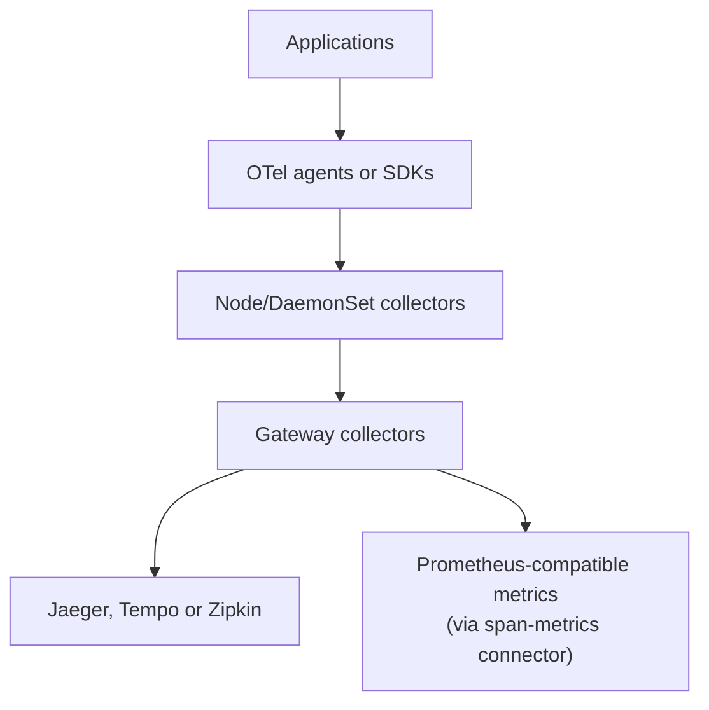

Which open-source distributed tracing backend should you self-host in 2026? This article compares dedicated trace backends (Jaeger v2, Grafana Tempo, Zipkin), auto-instrumentation tools (OpenTelemetry Operator, Odigos, eBPF), trace collectors (OpenTelemetry Collector, Alloy), language SDKs, and developer tools — covering architecture, query capabilities, storage backends, sampling strategies, span-derived metrics, and operational complexity.

> A trace is a debugging session you didn't know you'd need. The right tracing backend makes the difference between finding root cause in 30 seconds or 30 minutes.

### TL;DR — Quick Recommendations

| Use case | Best fit | Runner-up |
| :--- | :--- | :--- |
| **Complete tracing with built-in UI** | Jaeger v2 | Zipkin |
| **Most expressive trace query language** | Tempo (TraceQL) | Jaeger v2 (with ES/OS) |
| **Cheapest storage at scale (object storage)** | Tempo | — |
| **Simplest deployment** | Zipkin | Jaeger v2 (monolithic) |
| **Adaptive sampling built-in** | Jaeger v2 | — |
| **Existing Elasticsearch/OpenSearch** | Jaeger v2 | Zipkin |
| **Grafana ecosystem** | Tempo | Jaeger v2 |
| **AGPL license unacceptable** | Jaeger v2 / Zipkin | — |
| **Kubernetes auto-instrumentation** | OTel Operator | Odigos |

> Jump to [Section 1](#section-1-dedicated-open-source-tracing-backends) for backend comparison or [When to Use What](#when-to-use-what) for the full decision table.

This article focuses exclusively on **open-source, self-hostable distributed tracing tools** — no mandatory commercial licenses, no mandatory SaaS accounts. The tracing ecosystem includes backends, collectors, auto-instrumentation, SDKs, and developer tools.

**Excluded from the primary benchmark:** Multi-signal observability platforms (SigNoz, OpenObserve, ClickStack, Uptrace, Coroot, DeepFlow, Sentry) — these support tracing but are broader APM/observability systems. They are listed in Section 2 for reference but do not belong in a strict trace-backend comparison. For full-platform comparisons, see [Part 1: Open-Source Observability Platforms Compared]().

---

## Table of Contents

- [Scope & Selection Criteria](#scope--selection-criteria)
- [Legend](#legend)
- [Section 1: Dedicated Open-Source Tracing Backends](#section-1-dedicated-open-source-tracing-backends)
  - [The Candidates](#the-candidates)
  - [Jaeger v2 vs Tempo vs Zipkin](#jaeger-v2-vs-tempo-vs-zipkin)
  - [Architecture Classification](#architecture-classification)
  - [Ingestion & Protocol Support](#ingestion--protocol-support)
  - [Query & Search Capabilities](#query--search-capabilities)
  - [Storage Backends](#storage-backends)
  - [Sampling Strategies](#sampling-strategies)
  - [Span-Derived Metrics & Service Graphs](#span-derived-metrics--service-graphs)
  - [Operational Complexity](#operational-complexity)
  - [When to Use What](#when-to-use-what)
  - [Known Limitations](#known-limitations)
- [Section 2: Broader Open-Source Platforms with Tracing](#section-2-broader-open-source-platforms-with-tracing)
- [Section 3: Trace Collectors and Processing Pipelines](#section-3-trace-collectors-and-processing-pipelines)
  - [Collector Candidates](#collector-candidates)
  - [Important Collector Components](#important-collector-components)
  - [Kubernetes Collection Architecture](#kubernetes-collection-architecture)
- [Section 4: Open-Source Automatic Instrumentation](#section-4-open-source-automatic-instrumentation)
  - [Platform-Wide Auto-Instrumentation](#platform-wide-auto-instrumentation)
  - [Language-Specific Tracing SDKs and Agents](#language-specific-tracing-sdks-and-agents)
  - [Java/Kotlin Recommendation](#javakotlin-recommendation)
- [Section 5: Legacy Tracing Libraries and Protocols](#section-5-legacy-tracing-libraries-and-protocols)
- [Section 6: Trace Testing and Validation Tools](#section-6-trace-testing-and-validation-tools)
- [Section 7: Local Trace Viewers and Developer Tools](#section-7-local-trace-viewers-and-developer-tools)
- [Section 8: Trace-Derived Monitoring and Alerting](#section-8-trace-derived-monitoring-and-alerting)
- [Recommended Evaluation Scope](#recommended-evaluation-scope)
- [FAQ](#faq)
- [References](#references)

---

## Scope & Selection Criteria

| Criterion | Requirement |
| :--- | :--- |
| **Open-source** | OSI-approved license or well-known open license |
| **Self-hostable** | Runs entirely on your infrastructure |
| **No mandatory commercial license** | Free edition covers primary tracing functionality |
| **No mandatory SaaS account** | No phone-home, no cloud signup required |
| **Primarily designed for traces** | Not a multi-signal platform that also does tracing |

---

## Legend

| Symbol | Meaning |
| :---: | :--- |
| ✅ | Supported / available |
| ◐ | Partial support or requires additional setup / integration |
| ⭐ | Particular strength or best-in-class |
| — | Not supported or not applicable |

---

## Section 1: Dedicated Open-Source Tracing Backends

These are the closest equivalents to each other — purpose-built distributed trace storage and query systems.

### The Candidates

<div style="overflow-x: auto;" markdown="1">

| Platform | License | Ingestion | Query/Search | Storage | UI | Positioning |
| :--- | :--- | :--- | :--- | :--- | :--- | :--- |
| **[Jaeger v2](https://github.com/jaegertracing/jaeger)** | Apache 2.0 | OTLP, Jaeger, Zipkin, Kafka | Jaeger APIs, attribute search | OpenSearch, Elasticsearch, Cassandra, Badger, memory | Built-in | Complete tracing system, Apache licensed (⭐ 21k · 👥 500+ · Since 2016 · **CNCF Graduated**) |
| **[Grafana Tempo](https://github.com/grafana/tempo)** | AGPLv3 | OTLP, Jaeger, Zipkin | TraceQL, trace ID | S3, GCS, Azure Blob, MinIO; filesystem for dev | Grafana | Object-storage-first, TraceQL power (⭐ 4.2k · 👥 300+ · Since 2020) |
| **[Zipkin](https://github.com/openzipkin/zipkin)** | Apache 2.0 | Zipkin v1/v2; OTLP through Collector | Service, operation, tag, duration, trace ID | Cassandra, Elasticsearch/OpenSearch, memory | Built-in | Simplest possible deployment (⭐ 17.2k · 👥 150+ · Since 2012) |
| **[Hypertrace](https://github.com/hypertrace/hypertrace)** | Apache 2.0 | OpenTelemetry | Trace and service analytics | Multiple internal components | Built-in | Niche; limited maintenance (⭐ 500+ · Since 2020) |
| **[Haystack](https://github.com/ExpediaDotCom/haystack)** | Apache 2.0 | Zipkin-compatible | Trace search and trends | Cassandra, Elasticsearch, Kafka | Built-in | Historical; not recommended (⭐ 350+ · Since 2017 · Archived) |

</div>

> **Practical shortlist for new deployments:** Jaeger v2, Grafana Tempo, Zipkin. Hypertrace is niche. Haystack is no longer a strong choice.
>
> **Jaeger v1 note:** Jaeger v1 reached end of life on December 31, 2025. New deployments should use Jaeger v2, which is built on the OpenTelemetry Collector framework. [Jaeger lifecycle](https://www.jaegertracing.io/download/).

### Jaeger v2 vs Tempo vs Zipkin

<div style="overflow-x: auto;" markdown="1">

| Capability | Jaeger v2 | Grafana Tempo | Zipkin |
| :--- | :--- | :--- | :--- |
| **Dedicated to traces** | Yes | Yes | Yes |
| **OTLP ingestion** | Native | Native | Through OTel Collector (recommended) |
| **Query language** | Attribute/search APIs | TraceQL | Zipkin query API |
| **Search by arbitrary attributes** | Storage-dependent | Yes | Yes, basic |
| **Trace ID lookup** | Yes | Yes | Yes |
| **Built-in UI** | Yes | No; use Grafana | Yes |
| **Object storage** | Not primary model | Yes (primary) | No |
| **OpenSearch/Elasticsearch** | Yes | No | Yes |
| **Cassandra** | Yes | No | Yes |
| **Kafka buffering** | Optional | Required for distributed Tempo 3.0 | Optional ingestion transport |
| **Monolithic deployment** | Yes | Yes | Yes |
| **Horizontally scalable** | Yes | Yes | Yes, storage-dependent |
| **Native multi-tenancy** | Limited / deployment-dependent | Yes | No |
| **Tail sampling** | Through OTel components | Usually through OTel Collector | Usually through OTel Collector |
| **Adaptive sampling** | Yes (built-in) | External / collector-side | Client-side sampling |
| **Span metrics** | OTel span-metrics connector | Tempo metrics-generator / TraceQL metrics | External |
| **Service graphs** | Jaeger SPM / OTel connector | Tempo metrics-generator | Dependency graph |
| **Primary strength** | Complete tracing experience | Cost-efficient storage at scale | Simplicity |
| **Main limitation** | Requires external database at scale | Requires Grafana; more infrastructure | Less powerful search and analytics |

</div>

### Architecture Classification

```mermaid
graph TB
    subgraph "Jaeger v2"
        direction LR
        J_MONO[Monolithic<br/>All-in-one binary<br/>+ Badger/memory]
        J_DIST[Distributed<br/>Collector + Query<br/>+ Cassandra/ES/OS]
    end

    subgraph "Grafana Tempo"
        direction LR
        T_MONO[Monolithic<br/>Single binary<br/>+ local filesystem]
        T_DIST[Distributed<br/>Distributor/Ingester/Compactor/Querier<br/>+ Object storage + Kafka (3.0)]
    end

    subgraph "Zipkin"
        direction LR
        Z_MONO[Single server<br/>+ in-memory or<br/>Cassandra/ES/OS]
    end
```

| Architecture | Trade-off |
| :--- | :--- |
| **Jaeger monolithic** | Simple; limited to Badger/memory storage; good for dev/small workloads |
| **Jaeger distributed** | Scales with Cassandra/ES/OpenSearch; requires external DB ops |
| **Tempo monolithic** | Simple; filesystem storage; good for dev/small-medium |
| **Tempo distributed** | Cost-efficient at scale (object storage); requires Kafka for 3.0 distributed mode; more components |
| **Zipkin** | Simplest; single JAR; limited query power at scale |

### Ingestion & Protocol Support

<div style="overflow-x: auto;" markdown="1">

| Tool | OTLP gRPC | OTLP HTTP | Jaeger Thrift/gRPC | Zipkin v1/v2 | Kafka consumer | Max tested throughput |
| :--- | :---: | :---: | :---: | :---: | :---: | :--- |
| Jaeger v2 | ⭐ (native) | ⭐ (native) | ✅ (deprecated but supported) | ✅ | ⭐ | 100k+ spans/sec |
| Tempo | ⭐ (native) | ⭐ (native) | ✅ | ✅ | ⭐ (3.0 distributed) | 100k+ spans/sec |
| Zipkin | ◐ (via OTel Collector) | ◐ (via OTel Collector) | — | ⭐ (native) | ✅ | 10k–50k spans/sec (storage-dependent) |

</div>

> Jaeger v2's native protocols (Thrift, gRPC model) are deprecated. OTLP should be preferred for all new deployments.

### Query & Search Capabilities

| Capability | Jaeger v2 | Tempo | Zipkin |
| :--- | :--- | :--- | :--- |
| **Trace ID lookup** | ⭐ (fast, all backends) | ⭐ (Parquet block scan) | ✅ |
| **Service + operation filter** | ✅ | ✅ (TraceQL) | ✅ |
| **Arbitrary tag/attribute search** | ✅ (ES/OS: rich; Cassandra: limited) | ⭐ (TraceQL: structural queries) | ✅ (basic) |
| **Duration-based filter** | ✅ | ⭐ (TraceQL: `duration > 2s`) | ✅ |
| **Structural queries (parent/child)** | — | ⭐ (TraceQL: `{ .http.method = "GET" } >> { status = error }`) | — |
| **Aggregation / analytics** | ◐ (limited) | ✅ (TraceQL metrics) | — |
| **Regex on attributes** | ✅ (ES/OS) | ✅ (TraceQL `=~`) | ◐ |
| **Query language expressiveness** | Medium | ⭐ (High — TraceQL) | Low |

**Key insight:** Tempo's TraceQL is the most expressive open-source trace query language — it supports structural queries across span relationships (parent/child, sibling), duration comparisons, and aggregation. Jaeger's search power depends heavily on the storage backend (Elasticsearch/OpenSearch >> Cassandra >> Badger). Zipkin keeps it simple.

### Storage Backends

<div style="overflow-x: auto;" markdown="1">

| Tool | Supported backends | Object storage | Estimated bytes/span | Retention strategy | Compaction |
| :--- | :--- | :---: | :--- | :--- | :--- |
| Jaeger v2 | Elasticsearch, OpenSearch, Cassandra, Badger, memory, gRPC plugin | — | 500–2000 bytes (ES/Cassandra) | TTL per backend | Backend-managed |
| Tempo | S3, GCS, Azure Blob, MinIO, filesystem | ⭐ (primary) | 100–500 bytes (Parquet) | Time-based block deletion | Built-in compactor |
| Zipkin | Cassandra, Elasticsearch, OpenSearch, MySQL, memory | — | 500–2000 bytes (ES/Cassandra) | TTL per backend | Backend-managed |

</div>

> Tempo's Parquet-based block format achieves significantly better storage efficiency than Elasticsearch/Cassandra-backed solutions because it uses columnar compression and avoids per-document indexing overhead.

### Sampling Strategies

| Strategy | Jaeger v2 | Tempo | Zipkin |
| :--- | :--- | :--- | :--- |
| **Head-based (probabilistic)** | ⭐ (adaptive sampling built-in) | ◐ (OTel Collector) | ✅ (client-side) |
| **Adaptive sampling** | ⭐ (built-in, per-service/endpoint) | — (external) | — |
| **Tail-based** | ◐ (OTel tail_sampling processor) | ◐ (OTel tail_sampling processor) | ◐ (OTel tail_sampling processor) |
| **Rate-limiting** | ✅ (per-service) | ◐ (OTel Collector) | ✅ |
| **Remote sampling config** | ⭐ (sampling strategies API) | — | ✅ (HTTP endpoint) |
| **Per-endpoint policies** | ⭐ | ◐ | ◐ |

**Key insight:** Jaeger v2 has the most mature built-in sampling controller — adaptive sampling adjusts per-service/per-endpoint rates based on traffic volume. Tempo and Zipkin delegate most sampling decisions to the OpenTelemetry Collector's `tail_sampling` processor, which is powerful but lives outside the backend.

### Span-Derived Metrics & Service Graphs

| Capability | Jaeger v2 | Tempo | Zipkin |
| :--- | :--- | :--- | :--- |
| **RED metrics from spans** | OTel span-metrics connector | ⭐ Tempo metrics-generator / TraceQL metrics | External |
| **Service dependency graph** | Jaeger SPM + OTel service-graph connector | ⭐ Tempo metrics-generator | Built-in dependency graph |
| **Latency histograms** | OTel Collector | ⭐ (TraceQL metrics) | — |
| **Exemplar linking (metric → trace)** | ✅ (via OTel) | ⭐ (native exemplars) | — |

### Operational Complexity

<div style="overflow-x: auto;" markdown="1">

| Tool | Min RAM | Components (monolithic) | Components (distributed) | External dependencies | Upgrade path | Team size needed |
| :--- | :--- | :--- | :--- | :--- | :--- | :--- |
| Jaeger v2 | 512 MB | 1 binary | 2–3 (collector + query + ingester) | Cassandra/ES/OS (at scale) | Simple (OTel-based) | 1 |
| Tempo | 1 GB | 1 binary | 4–6 (distributor/ingester/compactor/querier/metrics-gen) + Kafka (3.0) | Object storage; Kafka (distributed) | Schema versioned | 1–2 |
| Zipkin | 512 MB | 1 JAR | N/A (scale via storage) | Cassandra/ES/OS (at scale) | Simple | 1 |

</div>

### When to Use What

| If you need... | Best fit | Runner-up |
| :--- | :--- | :--- |
| **Complete tracing with built-in UI** | Jaeger v2 | Zipkin |
| **Most expressive trace query language** | Tempo (TraceQL) | Jaeger v2 (with ES/OS) |
| **Cheapest storage at scale (object storage)** | Tempo | — |
| **Simplest deployment (single binary/JAR)** | Zipkin | Jaeger v2 (monolithic) |
| **Adaptive sampling built-in** | Jaeger v2 | — |
| **Existing Elasticsearch/OpenSearch** | Jaeger v2 | Zipkin |
| **Existing Cassandra** | Jaeger v2 | Zipkin |
| **Grafana ecosystem** | Tempo | Jaeger v2 (Grafana datasource exists) |
| **Multi-tenancy** | Tempo | Jaeger v2 (limited) |
| **Span-derived metrics (built-in)** | Tempo (metrics-generator) | Jaeger v2 + OTel connectors |
| **AGPL license unacceptable** | Jaeger v2 / Zipkin | — |
| **Trace analytics / structural queries** | Tempo (TraceQL) | — |

### Known Limitations

| Tool | Key limitation |
| :--- | :--- |
| **Jaeger v2** | Requires external database at scale (Cassandra/ES ops overhead); attribute search quality depends on storage backend; no object-storage-native model |
| **Tempo** | No built-in UI (requires Grafana); Kafka required for distributed mode in 3.0; AGPL license; trace search requires TraceQL learning |
| **Zipkin** | Limited search and analytics; less active development than Jaeger/Tempo; no structural query language; multi-tenancy absent |

---

## Section 2: Broader Open-Source Platforms with Tracing

These support traces but are not trace-only systems. They belong in an "all-in-one observability platforms" comparison rather than a strict trace-backend benchmark.

<div style="overflow-x: auto;" markdown="1">

| Platform | License model | Other signals | Trace storage |
| :--- | :--- | :--- | :--- |
| **[Apache SkyWalking](https://github.com/apache/skywalking)** | Apache 2.0 | Metrics, logs, profiles, topology | BanyanDB or Elasticsearch (⭐ 24k · Since 2015) |
| **[SigNoz](https://github.com/SigNoz/signoz)** | MIT (core) | Metrics, logs | ClickHouse (⭐ 20k · Since 2021) |
| **[VictoriaTraces](https://github.com/VictoriaMetrics/VictoriaMetrics)** | Apache 2.0 | Part of VictoriaMetrics stack (metrics via VM, logs via VL) | Custom local/object storage (⭐ 17.6k mono-repo · Since 2024 VT) |
| **[Uptrace](https://github.com/uptrace/uptrace)** | AGPL v3 (community) | Metrics, logs | ClickHouse (⭐ 4k · Since 2021) |
| **[OpenObserve](https://github.com/openobserve/openobserve)** | AGPL v3 | Logs, metrics, RUM | Object storage (⭐ 14k · Since 2023) |
| **[ClickStack](https://github.com/ClickHouse/ClickStack)** | Apache 2.0 | Logs, metrics, sessions | ClickHouse (⭐ 22k · Since 2023) |
| **[Coroot](https://github.com/coroot/coroot)** | Apache 2.0 | Metrics, logs, profiles | Multiple components (⭐ 4k · Since 2022) |
| **[DeepFlow](https://github.com/deepflowio/deepflow)** | Apache 2.0 | Metrics, logs, flows, eBPF | ClickHouse (⭐ 3.5k · Since 2022) |
| **[Pinpoint](https://github.com/pinpoint-apm/pinpoint)** | Apache 2.0 | APM metrics, topology | HBase / compatible (⭐ 13.6k · Since 2014) |
| **[OpenSearch Trace Analytics](https://github.com/opensearch-project/OpenSearch)** | Apache 2.0 | Logs, general search | OpenSearch (⭐ 10k · Since 2021) |
| **[OneUptime](https://github.com/OneUptime/oneuptime)** | Apache 2.0 | Metrics, logs, incidents, profiles | PostgreSQL + ClickHouse (⭐ 5k · Since 2022) |
| **[Sentry (Self-Hosted)](https://github.com/getsentry/sentry)** | FSL-1.1-Apache-2.0 (source-available) | Errors, logs/breadcrumbs, session replay, profiling | ClickHouse / Snuba + Kafka (⭐ ~45k · Since 2010) |

</div>

> **Sentry's tracing niche:** While historically built for error tracking, self-hosted Sentry has expanded into distributed tracing with native OTLP trace ingestion via Sentry Relay. Its core strength is code-level triage — linking a failing span directly to an unhandled exception, stack trace, and frontend Session Replay. However, self-hosting requires significant infrastructure (20+ containers, Kafka, ClickHouse, Snuba) and it uses the source-available FSL-1.1 license rather than pure OSI open-source.
>
> **Note:** Do not put these broader multi-signal platforms in the primary Jaeger/Tempo/Zipkin benchmark.

---

## Section 3: Trace Collectors and Processing Pipelines

These receive, batch, enrich, filter, sample, and export traces. They do not normally provide permanent trace storage.

### Collector Candidates

| Tool | License | Trace functions |
| :--- | :--- | :--- |
| **[OpenTelemetry Collector](https://github.com/open-telemetry/opentelemetry-collector)** | Apache 2.0 | Receive, process, sample, route, export (⭐ 4.7k · Since 2019 · **CNCF Graduated**) |
| **[OpenTelemetry Collector Contrib](https://github.com/open-telemetry/opentelemetry-collector-contrib)** | Apache 2.0 | Additional receivers, processors, exporters, connectors (⭐ 3.2k · Since 2019 · **CNCF**) |
| **[Grafana Alloy](https://github.com/grafana/alloy)** | Apache 2.0 | OTel-compatible collection and processing (⭐ 1.5k · Since 2024) |
| **[Jaeger v2 Collector](https://github.com/jaegertracing/jaeger)** | Apache 2.0 | Trace-specific OTel Collector distribution (⭐ 21k · **CNCF Graduated**) |
| **[Vector](https://github.com/vectordotdev/vector)** | MPL 2.0 | Routes multiple telemetry signals including traces (⭐ 18.5k · Since 2019) |
| **[Fluent Bit](https://github.com/fluent/fluent-bit)** | Apache 2.0 | Supports OpenTelemetry ingestion and forwarding (⭐ 6k · Since 2014 · **CNCF Incubating**) |
| **[Apache NiFi](https://github.com/apache/nifi)** | Apache 2.0 | Generic pipelines; can transport trace records (⭐ 5k · Since 2014) |
| **[OpenTelemetry eBPF Instrumentation](https://github.com/open-telemetry/opentelemetry-ebpf-profiler)** | Apache 2.0 / GPL (eBPF) | Zero-code traces and metrics (⭐ 800+ · Since 2023 · **CNCF**) |

### Important Collector Components

| Component | Purpose |
| :--- | :--- |
| OTLP receiver | Receives OTLP/gRPC and OTLP/HTTP |
| Jaeger receiver | Receives legacy Jaeger formats |
| Zipkin receiver | Receives Zipkin spans |
| Batch processor | Batches spans before export |
| Memory limiter | Protects Collector memory |
| Resource processor | Adds service/environment metadata |
| Attributes processor | Adds, removes, hashes, or redacts attributes |
| Filter processor | Drops unwanted spans |
| Probabilistic sampler | Head-style probabilistic sampling |
| Tail-sampling processor | Samples after examining the completed trace |
| Span-metrics connector | Generates RED metrics from spans |
| Service-graph connector | Generates service dependency metrics |
| Routing connector | Sends spans to different destinations |
| Kafka exporter/receiver | Provides buffering and decoupling |

### Kubernetes Collection Architecture



---

## Section 4: Open-Source Automatic Instrumentation

### Platform-Wide Auto-Instrumentation

<div style="overflow-x: auto;" markdown="1">

| Tool | License | Approach | Languages |
| :--- | :--- | :--- | :--- |
| **[OpenTelemetry Operator](https://github.com/open-telemetry/opentelemetry-operator)** | Apache 2.0 | Injects language agents in Kubernetes | Java, .NET, Node.js, Python, Go (⭐ 1.2k · Since 2020 · **CNCF**) |
| **[Odigos](https://github.com/odigos-io/odigos)** | Apache 2.0 | eBPF + language instrumentation | Java, Python, .NET, Node.js, Go (⭐ 3.4k · Since 2022) |
| **[OpenTelemetry eBPF Instrumentation (OBI)](https://github.com/open-telemetry/opentelemetry-ebpf-profiler)** | Apache 2.0 / GPL (eBPF) | Kernel-level zero-code instrumentation | Java, .NET, Go, Python, Ruby, Node.js, native (Since 2023 · **CNCF**) |
| **[Grafana Beyla](https://github.com/grafana/beyla)** | Apache 2.0 | eBPF | Being superseded/evolved through OTel eBPF Instrumentation (⭐ 1.5k · Since 2023) |
| **[Pixie](https://github.com/pixie-io/pixie)** | Apache 2.0 | eBPF-based Kubernetes visibility | Language-independent protocols (⭐ 5.6k · Since 2020 · **CNCF Sandbox**) |
| **[Cilium Hubble](https://github.com/cilium/hubble)** | Apache 2.0 | eBPF network-flow visibility | Network-level (not full application tracing) (⭐ 3.6k · Since 2019 · **CNCF**) |

</div>

> **OBI note:** OpenTelemetry eBPF Instrumentation (formerly based on Grafana Beyla) reached its first alpha release in late 2025. It generates traces without modifying application source code, but runtime-aware agents generally provide deeper framework and business-operation spans. [OBI announcement](https://opentelemetry.io/blog/2025/obi-announcing-first-release/).

### Language-Specific Tracing SDKs and Agents

OpenTelemetry should generally be the default for new applications.

| Language | Recommended open-source instrumentation |
| :--- | :--- |
| **Java / Kotlin** | OpenTelemetry Java Agent, OpenTelemetry Java SDK, Micrometer Tracing, Zipkin Brave |
| **Python** | OpenTelemetry Python SDK, `opentelemetry-instrument` |
| **Go** | OpenTelemetry Go SDK, OTel contrib instrumentation |
| **Node.js** | OpenTelemetry JS SDK and auto-instrumentations |
| **Browser JavaScript** | OpenTelemetry JS/browser instrumentation |
| **.NET** | OpenTelemetry .NET SDK and automatic instrumentation |
| **Rust** | `opentelemetry-rust`, `tracing`, `tracing-opentelemetry` |
| **Ruby** | OpenTelemetry Ruby SDK and auto-instrumentation |
| **PHP** | OpenTelemetry PHP SDK and instrumentation extension |
| **C++** | OpenTelemetry C++ |
| **Erlang / Elixir** | OpenTelemetry Erlang/Elixir |
| **Swift / iOS** | OpenTelemetry Swift |
| **Android** | OpenTelemetry Android |

> OpenTelemetry's Kubernetes Operator can inject zero-code instrumentation for Java, .NET, Node.js, Python, and Go. [OTel zero-code docs](https://opentelemetry.io/docs/zero-code/).

### Java/Kotlin Recommendation

```text
OpenTelemetry Java Agent
        ↓ OTLP
OpenTelemetry Collector
        ↓
Jaeger v2 or Grafana Tempo
```

Use Micrometer Tracing when the application is already based on Spring Boot and you require application-controlled instrumentation.

---

## Section 5: Legacy Tracing Libraries and Protocols

| Project / Protocol | Status | Recommendation |
| :--- | :--- | :--- |
| OpenTracing | Archived / merged into OpenTelemetry | Migrate to OpenTelemetry |
| OpenCensus | Superseded by OpenTelemetry | Migrate to OpenTelemetry |
| Jaeger native clients | Deprecated in favor of OpenTelemetry | Do not use for new applications |
| Jaeger Thrift protocol | Deprecated but supported | Migrate to OTLP |
| Jaeger native gRPC model | Deprecated but supported | Migrate to OTLP |
| Zipkin B3 propagation | Still supported | Use when compatibility requires it |
| **W3C Trace Context** | **Current cross-vendor standard** | **Recommended default** |
| **W3C Baggage** | **Current context propagation standard** | Use carefully; avoid secrets |

---

## Section 6: Trace Testing and Validation Tools

| Tool | License | Function |
| :--- | :--- | :--- |
| **[Tracetest](https://github.com/kubeshop/tracetest)** | Open-source core (production self-hosting has edition caveats) | Assert behavior using distributed traces |
| **[otel-cli](https://github.com/tobert/otel-cli)** | Apache 2.0 | Create spans from shell scripts |
| **[telemetrygen](https://github.com/open-telemetry/opentelemetry-collector-contrib/tree/main/cmd/telemetrygen)** | Apache 2.0 | Generate test traces and telemetry |
| **[Jaeger HotROD](https://github.com/jaegertracing/jaeger/tree/main/examples/hotrod)** | Apache 2.0 | Demo traced application |
| **[OpenTelemetry Demo](https://opentelemetry.io/docs/demo/)** | Apache 2.0 | Multi-service reference application |
| **[Tempo Vulture](https://grafana.com/docs/tempo/latest/operations/tempo-vulture/)** | AGPLv3 | Continuously writes and verifies traces |
| **[Testcontainers](https://testcontainers.com/)** | MIT | Run tracing backends in integration tests |
| **[Malabi](https://github.com/aspecto-io/malabi)** | Apache 2.0 | Trace-based testing for Node.js |
| **[otel-arrow](https://github.com/open-telemetry/otel-arrow)** | Apache 2.0 | Experimental efficient telemetry transport |

> **Tracetest note:** Tracetest's repository provides an open-source core suitable for local/hobby use. Its current production self-hosted offering has commercial licensing considerations. Qualify before treating as unrestricted OSS. [Tracetest repo](https://github.com/kubeshop/tracetest).

---

## Section 7: Local Trace Viewers and Developer Tools

| Tool | License | Purpose |
| :--- | :--- | :--- |
| **[otel-desktop-viewer](https://github.com/CtrlSpice/otel-desktop-viewer)** | Apache 2.0 | Local OTLP receiver and web trace viewer |
| **[otel-tui](https://github.com/ymtdzzz/otel-tui)** | Open-source | Terminal OpenTelemetry viewer |
| **[otel-gui](https://github.com/metafab/otel-gui)** | Open-source | Lightweight local OTLP trace viewer |
| **[Venator](https://github.com/kmdreko/venator)** | MIT | Desktop viewer for Rust/OTel logs and traces |
| **[Jaeger UI](https://github.com/jaegertracing/jaeger-ui)** | Apache 2.0 | Standalone Jaeger trace UI |
| **[Grafana](https://grafana.com/oss/grafana/)** | AGPLv3 | Tempo, Jaeger, and Zipkin visualization |
| **[Aspire Dashboard](https://github.com/microsoft/aspire)** | MIT | Local OTLP dashboard for .NET and other applications (⭐ 6.3k · 👥 312) |

> These are helpful during development but most are not production storage backends.

---

## Section 8: Trace-Derived Monitoring and Alerting

Tracing backends usually do not alert directly on individual traces. Instead, generate metrics from spans and alert using Prometheus-compatible tooling.

### Metrics to Generate from Spans

- Request rate (per service, per operation)
- Error rate (per service, per operation)
- Duration/latency histograms (p50, p95, p99)
- Service dependency edges
- Database call latency
- External API latency
- Messaging producer/consumer duration

### Architecture

```text
Application traces
       ↓
OpenTelemetry Collector
       ↓
Span-metrics connector + Service-graph connector
       ↓
Prometheus / VictoriaMetrics
       ↓
Alertmanager
```

### Useful Trace-Derived Alerts

- Span error rate exceeds 5%
- P99 server-span latency exceeds 2 seconds
- Database spans account for majority of request latency
- A downstream dependency disappears from the service graph
- Trace contains an unexpected retry loop
- Messaging consumer span duration exceeds processing SLO
- No spans received from a previously active service
- Collector refused or dropped spans
- Tail-sampling decision latency increases
- Trace completeness falls (parent spans missing)

---

## Recommended Evaluation Scope

### Dedicated trace backends (primary benchmark)

- Jaeger v2
- Grafana Tempo
- Zipkin

**Benchmark dimensions:** Ingestion throughput, query latency, trace-ID lookup, arbitrary-attribute search, storage compression, retention cost, dropped spans, tail-sampling behavior, Kubernetes resources, horizontal scaling, multi-tenancy, failure recovery, operational complexity.

### Collection and processing (separate evaluation)

- OpenTelemetry Collector
- Grafana Alloy
- Jaeger v2 Collector (OTel distribution)

### Auto-instrumentation (separate evaluation)

- OpenTelemetry Operator
- OpenTelemetry language agents
- Odigos
- OpenTelemetry eBPF Instrumentation

### Developer and testing tools

- Tracetest
- telemetrygen
- otel-cli
- OTel Desktop Viewer
- Tempo Vulture

### Broader platforms with tracing (covered in Part 1)

- SkyWalking, SigNoz, VictoriaTraces, Uptrace, OpenObserve, ClickStack, Coroot, DeepFlow, Pinpoint, OpenSearch, OneUptime, Sentry

---

## FAQ

**What is the best open-source distributed tracing tool in 2026?**
**Jaeger v2** for a complete, batteries-included tracing system with built-in UI and Apache 2.0 license. **Grafana Tempo** for the most powerful query language (TraceQL) and cheapest storage at scale via object storage. The choice depends on whether you prioritize built-in UI + adaptive sampling (Jaeger) or query expressiveness + storage cost (Tempo).

**Should I use Jaeger or Tempo?**
Use **Jaeger v2** if you want a self-contained system with built-in UI, adaptive sampling, and existing Elasticsearch/Cassandra infrastructure. Use **Tempo** if you already use Grafana, want object-storage-native architecture, need TraceQL structural queries, or want built-in span-derived metrics. Both handle 100k+ spans/sec.

**Is Zipkin still relevant in 2026?**
Zipkin remains the simplest tracing backend — a single JAR file with a built-in UI. It's ideal for small teams, development environments, or organizations that need minimal operational overhead. For production at scale, Jaeger v2 or Tempo offer better query capabilities and throughput.

**What is TraceQL?**
TraceQL is Grafana Tempo's purpose-built trace query language. It supports structural queries across span parent/child relationships (`{ .http.method = "GET" } >> { status = error }`), duration filters, regex on attributes, and aggregation — making it the most expressive open-source trace query language available.

**How do I get alerts from traces?**
Tracing backends don't alert directly. Use the **OpenTelemetry Collector's span-metrics connector** to generate RED metrics (Rate, Error, Duration) from spans, export them to Prometheus/VictoriaMetrics, and alert via Alertmanager. Tempo also has a built-in metrics-generator for this purpose.

**What happened to Jaeger v1?**
Jaeger v1 reached end of life on December 31, 2025. Jaeger v2 is a complete rewrite built on the OpenTelemetry Collector framework. It's backwards-compatible with v1 APIs but uses OTLP as the primary protocol. All new deployments should use v2.

---

## References

### Dedicated Trace Backends

- [Jaeger v2 Documentation](https://www.jaegertracing.io/docs/latest/)
- [Jaeger Architecture](https://www.jaegertracing.io/docs/2.20/architecture/)
- [Grafana Tempo Documentation](https://grafana.com/docs/tempo/latest/)
- [Tempo Block Format](https://grafana.com/docs/tempo/latest/reference-tempo-architecture/block-format/)
- [Zipkin Documentation](https://zipkin.io/)
- [Zipkin Repository](https://github.com/openzipkin/zipkin)
- [Hypertrace](https://github.com/hypertrace/hypertrace)
- [VictoriaTraces](https://github.com/VictoriaMetrics/VictoriaTraces)

### Collection & Processing

- [OpenTelemetry Collector](https://opentelemetry.io/docs/collector/)
- [OpenTelemetry Collector Contrib](https://github.com/open-telemetry/opentelemetry-collector-contrib)
- [Grafana Alloy](https://grafana.com/docs/alloy/latest/)
- [Vector](https://vector.dev/docs/)

### Auto-Instrumentation

- [OpenTelemetry Operator](https://github.com/open-telemetry/opentelemetry-operator)
- [Odigos](https://github.com/odigos-io/odigos)
- [OpenTelemetry eBPF Instrumentation](https://opentelemetry.io/docs/zero-code/obi/)
- [OpenTelemetry Zero-Code](https://opentelemetry.io/docs/zero-code/)
- [Pixie](https://px.dev/)

### SDKs & Instrumentation

- [OpenTelemetry Language SDKs](https://opentelemetry.io/docs/languages/)
- [Micrometer Tracing](https://micrometer.io/docs/tracing)
- [Zipkin Brave](https://github.com/openzipkin/brave)

### Standards & Protocols

- [W3C Trace Context](https://www.w3.org/TR/trace-context/)
- [W3C Baggage](https://www.w3.org/TR/baggage/)
- [OpenTelemetry Specification](https://opentelemetry.io/docs/specs/otel/)

### Testing & Validation

- [Tracetest](https://github.com/kubeshop/tracetest)
- [telemetrygen](https://github.com/open-telemetry/opentelemetry-collector-contrib/tree/main/cmd/telemetrygen)
- [OpenTelemetry Demo](https://opentelemetry.io/docs/demo/)
- [Tempo Vulture](https://grafana.com/docs/tempo/latest/operations/tempo-vulture/)

### Broader Platforms & APM

- [Apache SkyWalking](https://skywalking.apache.org/docs/)
- [SigNoz Documentation](https://signoz.io/docs/)
- [Sentry Documentation](https://docs.sentry.io/)
- [OneUptime Documentation](https://oneuptime.com/docs)

---

*Last verified: September 2026. Features, licensing, and performance characteristics change — always check official sources.*
