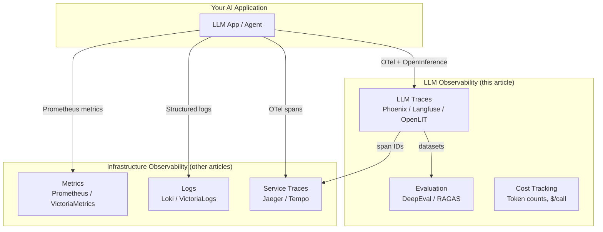

Which open-source tool should you use to trace, monitor, evaluate, and debug your LLM and AI agent applications in 2026? This article compares self-hostable LLM observability platforms (Arize Phoenix, Langfuse, OpenLIT, Helicone, Lunary), instrumentation standards (OpenInference, OpenLLMetry, OTel GenAI), and evaluation frameworks (DeepEval, RAGAS, Promptfoo) — covering architecture, tracing capabilities, cost tracking, prompt management, and evaluation workflows.

> Traditional observability (Prometheus, Jaeger, Loki) tells you that your API is slow. LLM observability tells you *why* — which prompt template produced a hallucination, which retrieval step returned irrelevant context, and how much that 4000-token completion cost.

### TL;DR — Quick Recommendations

| Use case | Best fit | Runner-up |
| :--- | :--- | :--- |
| **Full LLM observability platform (self-hosted)** | Langfuse | Arize Phoenix |
| **OTel-native, send to existing backend** | OpenLIT | OpenLLMetry |
| **AI gateway + observability + routing** | Helicone | LiteLLM |
| **Lightweight tracing + prompt management** | Lunary | Langfuse |
| **LLM evaluation in CI/CD (pytest-style)** | DeepEval | Promptfoo |
| **RAG-specific evaluation metrics** | RAGAS | DeepEval |
| **Existing Grafana/Prometheus stack** | OpenLIT | Phoenix (OTel export) |
| **Session replay + user feedback loops** | Langfuse | Phoenix |
| **Apache 2.0 license required** | OpenLIT / Phoenix | Helicone |

> Jump to [Section 1](#section-1-llm-observability-platforms) for platform comparison or [When to Use What](#when-to-use-what) for the full decision table.

**Excluded:** LangSmith (commercial, not self-hostable), Braintrust (commercial core), Weights & Biases (commercial). For infrastructure observability (metrics, logs, traces for your services), see [Open-Source Observability Platforms Compared](). For distributed tracing of non-LLM services, see [Distributed Tracing Tools Compared]().

---

## Table of Contents

- [Scope & Why LLM Observability Is Different](#scope--why-llm-observability-is-different)
- [Legend](#legend)
- [Section 1: LLM Observability Platforms](#section-1-llm-observability-platforms)
  - [The Candidates](#the-candidates)
  - [Feature Comparison](#feature-comparison)
  - [Architecture & Self-Hosting](#architecture--self-hosting)
  - [When to Use What](#when-to-use-what)
  - [Known Limitations](#known-limitations)
- [Section 2: LLM Instrumentation Libraries & Standards](#section-2-llm-instrumentation-libraries--standards)
- [Section 3: LLM Evaluation Frameworks](#section-3-llm-evaluation-frameworks)
- [Section 4: AI Gateways with Observability](#section-4-ai-gateways-with-observability)
- [Section 5: How LLM Observability Connects to Infrastructure Observability](#section-5-how-llm-observability-connects-to-infrastructure-observability)
- [FAQ](#faq)
- [References](#references)

---

## Scope & Why LLM Observability Is Different

Traditional observability tracks request latency, error rates, and resource usage. LLM observability adds:

| Dimension | Traditional observability | LLM observability |
| :--- | :--- | :--- |
| **What you trace** | HTTP requests, DB queries, queue messages | LLM calls, tool invocations, retrieval steps, agent reasoning |
| **Key metrics** | Latency, error rate, throughput | Token count, cost, hallucination rate, relevance score |
| **Debugging** | Stack traces, logs | Prompt/completion pairs, retrieval context, chain-of-thought |
| **Evaluation** | Unit tests, integration tests | LLM-as-judge, human feedback, RAG metrics (faithfulness, relevance) |
| **Cost** | Compute + storage | Per-token pricing across providers ($0.01–$60/M tokens) |

---

## Legend

| Symbol | Meaning |
| :---: | :--- |
| ✅ | Supported / available |
| ◐ | Partial support or requires integration |
| ⭐ | Particular strength or best-in-class |
| — | Not supported |

---

## Section 1: LLM Observability Platforms

These are self-hostable platforms that provide tracing, analytics, and debugging for LLM applications.

### The Candidates

| Platform | GitHub | License | Since | Stars | What it does |
| :--- | :--- | :--- | :--- | ---: | :--- |
| **[Arize Phoenix](https://phoenix.arize.com/)** | [Arize-ai/phoenix](https://github.com/Arize-ai/phoenix) | Elastic License 2.0 (self-host free) | 2023 | ~8k | AI observability platform — tracing, evaluation, datasets, prompt experiments |
| **[Langfuse](https://langfuse.com/)** | [langfuse/langfuse](https://github.com/langfuse/langfuse) | MIT (core) / EE features | 2023 | ~8k | LLM engineering platform — tracing, prompt management, evaluation, cost tracking, datasets |
| **[OpenLIT](https://openlit.io/)** | [openlit/openlit](https://github.com/openlit/openlit) | Apache 2.0 | 2024 | ~2.5k | OTel-native AI observability — auto-instrumentation for 50+ LLM providers, GPU monitoring, guardrails, vault |
| **[Helicone](https://helicone.ai/)** | [Helicone/helicone](https://github.com/Helicone/helicone) | Apache 2.0 | 2023 | ~3k | AI gateway + observability — proxy-based logging, cost analytics, caching, rate limiting, routing |
| **[Lunary](https://lunary.ai/)** | [lunary-ai/lunary](https://github.com/lunary-ai/lunary) | Apache 2.0 | 2023 | ~1.3k | LLM observability + prompt management — tracing, analytics, evaluations, user tracking |

### Feature Comparison

| Capability | Phoenix | Langfuse | OpenLIT | Helicone | Lunary |
| :--- | :---: | :---: | :---: | :---: | :---: |
| **LLM call tracing** | ⭐ | ⭐ | ⭐ | ⭐ | ✅ |
| **Agent/chain tracing** | ⭐ | ⭐ | ✅ | ◐ | ✅ |
| **Token & cost tracking** | ✅ | ⭐ | ✅ | ⭐ | ✅ |
| **Prompt management** | ✅ | ⭐ | ✅ | ◐ | ✅ |
| **Evaluation / scoring** | ⭐ | ⭐ | ✅ | ◐ | ✅ |
| **Datasets & experiments** | ⭐ | ⭐ | ◐ | — | ◐ |
| **User session tracking** | ◐ | ⭐ | ◐ | ✅ | ✅ |
| **Human feedback collection** | ✅ | ⭐ | ◐ | ◐ | ✅ |
| **OpenTelemetry native** | ⭐ | ✅ (ingestion) | ⭐ | ◐ | ◐ |
| **LLM-as-judge evals** | ⭐ | ✅ | ✅ | — | ◐ |
| **Guardrails / safety** | ◐ | ◐ | ⭐ | ◐ | — |
| **GPU monitoring** | — | — | ⭐ | — | — |
| **Multi-provider routing** | — | — | — | ⭐ | — |
| **Caching / rate limiting** | — | — | — | ⭐ | — |
| **API key vault** | — | — | ⭐ | — | — |
| **Built-in playground** | ⭐ | ✅ | ✅ | ◐ | ✅ |
| **Self-hostable** | ✅ | ✅ | ✅ | ✅ | ✅ |

### Architecture & Self-Hosting

| Platform | Language | Storage | Self-host complexity | Docker Compose | External deps |
| :--- | :--- | :--- | :--- | :---: | :--- |
| Phoenix | Python | SQLite (dev) / PostgreSQL (prod) | Low | ✅ | PostgreSQL |
| Langfuse | TypeScript | PostgreSQL + ClickHouse | Medium | ✅ | PostgreSQL, ClickHouse, Redis |
| OpenLIT | Python + TS | ClickHouse | Low-Medium | ✅ | ClickHouse |
| Helicone | TypeScript | ClickHouse + Supabase | Medium | ✅ | PostgreSQL, ClickHouse, Kafka |
| Lunary | TypeScript | PostgreSQL | Low | ✅ | PostgreSQL |

### When to Use What

| If you need... | Best fit | Runner-up |
| :--- | :--- | :--- |
| **Full evaluation + experiments workflow** | Phoenix | Langfuse |
| **Best prompt management + versioning** | Langfuse | Lunary |
| **OTel-native, export to existing Grafana/Prometheus** | OpenLIT | Phoenix |
| **AI gateway (routing, caching, rate limiting) + observability** | Helicone | LiteLLM + OpenLIT |
| **Simplest self-hosted (fewest deps)** | Lunary | Phoenix (SQLite mode) |
| **Team collaboration (annotations, feedback)** | Langfuse | Phoenix |
| **GPU monitoring alongside LLM tracing** | OpenLIT | — |
| **Multi-provider cost optimization** | Helicone | Langfuse (cost tracking) |
| **Apache 2.0 license** | OpenLIT / Helicone / Lunary | — |
| **Largest community / ecosystem integrations** | Langfuse | Phoenix |

### Known Limitations

| Platform | Key limitation |
| :--- | :--- |
| **Phoenix** | Elastic License 2.0 (not OSI-approved); evaluation features are its strength, tracing UI less mature than Langfuse |
| **Langfuse** | MIT core but some features EE-gated; ClickHouse dependency adds self-host complexity; not OTel-native at the core |
| **OpenLIT** | Younger project; evaluation features less mature than Phoenix/Langfuse; smaller community |
| **Helicone** | Proxy-based architecture adds latency; primarily a gateway that also does observability, not an observability platform that also routes |
| **Lunary** | Smaller community (~1.3k stars); fewer integrations than Langfuse/Phoenix; evaluation features basic |

---

## Section 2: LLM Instrumentation Libraries & Standards

These don't store data — they instrument your LLM calls and emit telemetry to any compatible backend.

| Library | GitHub | License | Stars | Approach | Compatible backends |
| :--- | :--- | :--- | ---: | :--- | :--- |
| **[OpenInference](https://github.com/Arize-ai/openinference)** | [Arize-ai/openinference](https://github.com/Arize-ai/openinference) | Apache 2.0 | ~1.7k | Semantic conventions for AI/LLM spans on OpenTelemetry | Phoenix, any OTel backend |
| **[OpenLLMetry](https://github.com/traceloop/openllmetry)** | [traceloop/openllmetry](https://github.com/traceloop/openllmetry) | Apache 2.0 | ~5k | OTel-based auto-instrumentation for LLM providers + vector DBs | Langfuse, Phoenix, Grafana, Datadog, any OTel backend |
| **[OpenTelemetry GenAI SIG](https://github.com/open-telemetry/community/tree/main/projects/gen-ai)** | (OTel community) | Apache 2.0 | — | Official OTel semantic conventions for generative AI | Any OTel backend (emerging standard) |
| **[OpenLIT SDK](https://github.com/openlit/openlit)** | [openlit/openlit](https://github.com/openlit/openlit) | Apache 2.0 | ~2.5k | One-line auto-instrumentation (`openlit.init()`) for 50+ providers | OpenLIT platform, any OTel backend |
| **[LiteLLM](https://github.com/BerriAI/litellm)** | [BerriAI/litellm](https://github.com/BerriAI/litellm) | MIT | ~18k | Unified API for 100+ LLMs with built-in logging callbacks | Langfuse, Helicone, Phoenix, custom |

> **Standards convergence:** OpenInference (Arize), OpenLLMetry (Traceloop), and the OTel GenAI SIG are converging toward a unified standard. OpenTelemetry's GenAI semantic conventions are expected to absorb the best of both. For new projects, prefer OTel-native instrumentation.

---

## Section 3: LLM Evaluation Frameworks

Evaluation frameworks test LLM output quality. They complement observability platforms — observability shows *what happened*, evaluation measures *how good it was*.

| Framework | GitHub | License | Stars | Focus | Runs in CI? |
| :--- | :--- | :--- | ---: | :--- | :---: |
| **[DeepEval](https://github.com/confident-ai/deepeval)** | [confident-ai/deepeval](https://github.com/confident-ai/deepeval) | Apache 2.0 | ~4.5k | Pytest-style LLM unit testing — 50+ metrics, RAG, agents, safety | ⭐ |
| **[RAGAS](https://github.com/explodinggradients/ragas)** | [explodinggradients/ragas](https://github.com/explodinggradients/ragas) | Apache 2.0 | ~7.5k | RAG evaluation framework — faithfulness, relevance, context precision | ✅ |
| **[Promptfoo](https://github.com/promptfoo/promptfoo)** | [promptfoo/promptfoo](https://github.com/promptfoo/promptfoo) | MIT | ~5k | Prompt testing and comparison — CLI-first, red-teaming, model grading | ⭐ |
| **[MLflow LLM Evaluate](https://mlflow.org/)** | [mlflow/mlflow](https://github.com/mlflow/mlflow) | Apache 2.0 | ~19k | LLM evaluation within MLflow experiment tracking | ✅ |
| **[Giskard](https://github.com/Giskard-AI/giskard)** | [Giskard-AI/giskard](https://github.com/Giskard-AI/giskard) | Apache 2.0 | ~4k | AI quality testing — vulnerability scanning, bias detection, RAG evals | ✅ |

> **Integration:** Phoenix and Langfuse can use DeepEval/RAGAS as evaluation backends — you trace with the platform and evaluate with the framework.

---

## Section 4: AI Gateways with Observability

These sit between your application and LLM providers, adding observability, routing, and cost control.

| Gateway | GitHub | License | Stars | Key capability |
| :--- | :--- | :--- | ---: | :--- |
| **[Helicone](https://github.com/Helicone/helicone)** | [Helicone/helicone](https://github.com/Helicone/helicone) | Apache 2.0 | ~3k | AI gateway + full observability platform |
| **[LiteLLM Proxy](https://github.com/BerriAI/litellm)** | [BerriAI/litellm](https://github.com/BerriAI/litellm) | MIT | ~18k | Unified OpenAI-compatible proxy for 100+ models; logging to Langfuse/etc. |
| **[Traceloop Hub](https://github.com/traceloop/hub)** | [traceloop/hub](https://github.com/traceloop/hub) | Apache 2.0 | ~200+ | Rust LLM gateway with OTel observability built-in |
| **[Portkey AI Gateway](https://github.com/Portkey-AI/gateway)** | [Portkey-AI/gateway](https://github.com/Portkey-AI/gateway) | MIT | ~6.5k | AI gateway — routing, fallbacks, caching, load balancing |

---

## Section 5: How LLM Observability Connects to Infrastructure Observability

> **Key insight:** LLM observability and infrastructure observability are complementary layers. OpenTelemetry is the bridge — an LLM call is a span that can be correlated with your service trace. Tools like OpenLIT and Phoenix export OTel data that your existing Grafana/Prometheus stack can consume.

---

## FAQ

**What is LLM observability?**
LLM observability is the practice of tracing, monitoring, and evaluating LLM/AI agent behavior in production — tracking prompts, completions, token usage, cost, latency, and output quality. It answers "why did my AI produce this response?" the same way traditional tracing answers "why was this request slow?"

**Do I need a separate tool or can I use Jaeger/Grafana?**
You can send LLM spans to Jaeger/Tempo via OpenTelemetry, but you'll lose LLM-specific features (prompt/completion rendering, token cost tracking, evaluation scoring, prompt versioning). Dedicated LLM observability tools understand AI-specific data structures. The recommended approach is both: LLM tool for AI-specific debugging + infrastructure observability for system health.

**Phoenix vs Langfuse — which should I choose?**
**Langfuse** if you need the best prompt management, team collaboration (annotations, user feedback), and the largest integration ecosystem (LangChain, LlamaIndex, OpenAI SDK, 20+ frameworks). **Phoenix** if you prioritize evaluation/experimentation workflows, want tighter OTel integration via OpenInference, or prefer Python-first tooling.

**What is OpenInference vs OpenLLMetry?**
Both are OTel-based instrumentation specs for LLM tracing. **OpenInference** (Arize) defines semantic conventions — attribute names for LLM spans. **OpenLLMetry** (Traceloop) provides auto-instrumentation packages that emit OTel spans for specific LLM providers. They're complementary and converging toward OTel's official GenAI semantic conventions.

**Can I self-host all of these?**
Yes — all platforms listed in Section 1 are self-hostable via Docker Compose. Langfuse requires the most external dependencies (PostgreSQL + ClickHouse + Redis). Phoenix and Lunary are simplest (PostgreSQL only, or SQLite for dev).

**How much does LLM observability add to latency?**
Instrumentation overhead is negligible (<1ms per call). Proxy-based tools like Helicone add 10-50ms network hop. Async logging (Langfuse, Phoenix) adds zero latency to your application's hot path — traces are sent in background batches.

---

## References

### LLM Observability Platforms
- [Arize Phoenix Documentation](https://docs.arize.com/phoenix/)
- [Arize Phoenix GitHub](https://github.com/Arize-ai/phoenix)
- [Langfuse Documentation](https://langfuse.com/docs)
- [Langfuse GitHub](https://github.com/langfuse/langfuse)
- [OpenLIT Documentation](https://docs.openlit.io/)
- [OpenLIT GitHub](https://github.com/openlit/openlit)
- [Helicone Documentation](https://docs.helicone.ai/)
- [Helicone GitHub](https://github.com/Helicone/helicone)
- [Lunary Documentation](https://docs.lunary.ai/)
- [Lunary GitHub](https://github.com/lunary-ai/lunary)

### Instrumentation Standards
- [OpenInference](https://github.com/Arize-ai/openinference)
- [OpenLLMetry](https://github.com/traceloop/openllmetry)
- [OpenTelemetry GenAI Semantic Conventions](https://opentelemetry.io/docs/specs/semconv/gen-ai/)
- [LiteLLM](https://github.com/BerriAI/litellm)

### Evaluation Frameworks
- [DeepEval](https://github.com/confident-ai/deepeval)
- [RAGAS](https://github.com/explodinggradients/ragas)
- [Promptfoo](https://github.com/promptfoo/promptfoo)
- [MLflow LLM Evaluate](https://mlflow.org/docs/latest/llms/llm-evaluate/)
- [Giskard](https://github.com/Giskard-AI/giskard)

### AI Gateways
- [Helicone AI Gateway](https://github.com/Helicone/helicone)
- [LiteLLM Proxy](https://github.com/BerriAI/litellm)
- [Traceloop Hub](https://github.com/traceloop/hub)
- [Portkey AI Gateway](https://github.com/Portkey-AI/gateway)

### Related Articles in This Series
- [Open-Source Observability Platforms Compared]()
- [Distributed Tracing Tools Compared]()
- [CNCF Observability Landscape Guide]()

---

*Last verified: October 2026. LLM observability is a fast-moving space — tools, integrations, and standards evolve rapidly. Always check official sources.*
