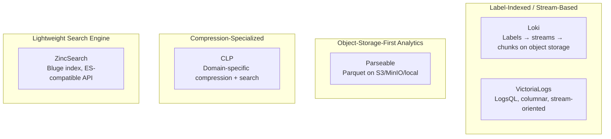

> Logs are the cheapest signal to produce and the most expensive to store. Choosing the right backend is a cost decision as much as a feature one.

This article focuses exclusively on **open-source, self-hostable tools primarily intended for logs** — no mandatory commercial licenses, no mandatory SaaS accounts. Using a strict definition, the log-specific ecosystem is smaller than the metrics world.

**Excluded:** Multi-signal observability platforms (OpenObserve, SigNoz, ClickStack, OneUptime, HyperDX, GreptimeDB), general analytical databases (ClickHouse), and managed services. These are covered in [Part 1: Open-Source Observability Platforms Compared]().

---

## Table of Contents

- [Scope & Selection Criteria](#scope--selection-criteria)
- [Section 1: Log Storage, Search and Analytics Platforms](#section-1-log-storage-search-and-analytics-platforms)
  - [The Candidates](#the-candidates)
  - [Architecture Classification](#architecture-classification)
  - [Feature Comparison](#feature-comparison)
  - [Query Language Comparison](#query-language-comparison)
  - [Storage Architecture & Efficiency](#storage-architecture--efficiency)
  - [Ingestion & Protocol Support](#ingestion--protocol-support)
  - [Operational Complexity](#operational-complexity)
  - [When to Use What](#when-to-use-what)
  - [Known Limitations](#known-limitations)
- [Section 2: General Search Databases Commonly Used for Logs](#section-2-general-search-databases-commonly-used-for-logs)
  - [The Candidates](#the-candidates-1)
  - [Comparison](#comparison)
  - [Licensing Notes](#licensing-notes)
- [Section 3: Complete Open-Source Log-Management Interfaces](#section-3-complete-open-source-log-management-interfaces)
  - [The Candidates](#the-candidates-2)
  - [Comparison](#comparison-1)
- [Section 4: Open-Source Log Collectors and Pipelines](#section-4-open-source-log-collectors-and-pipelines)
  - [The Candidates](#the-candidates-3)
  - [Comparison](#comparison-2)
  - [When to Use What](#when-to-use-what-1)
- [Section 5: Log Viewing and Command-Line Analysis Tools](#section-5-log-viewing-and-command-line-analysis-tools)
- [Section 6: Open-Source Application Logging Libraries](#section-6-open-source-application-logging-libraries)
- [Recommended Evaluation Scope](#recommended-evaluation-scope)
- [References](#references)

---

## Scope & Selection Criteria

| Criterion | Requirement |
| :--- | :--- |
| **Open-source** | OSI-approved license or well-known open license |
| **Self-hostable** | Runs entirely on your infrastructure |
| **No mandatory commercial license** | Free edition covers primary log functionality |
| **No mandatory SaaS account** | No phone-home, no cloud signup required |
| **Primarily designed for logs** | Not a multi-signal observability platform that also does logs |

---

## Section 1: Log Storage, Search and Analytics Platforms

These are the closest equivalents to Loki and VictoriaLogs — purpose-built log backends.

### The Candidates

| Platform | License | Query Language | Storage Model | Full-text Search | UI Included | GitHub | Recommendation |
| :--- | :--- | :--- | :--- | ---: | ---: | :--- | :--- |
| **[Grafana Loki](https://github.com/grafana/loki)** | AGPLv3 | LogQL | Filesystem or object storage | Limited; label-first | No; use Grafana | — | Strong |
| **[VictoriaLogs](https://github.com/VictoriaMetrics/VictoriaLogs)** | Apache 2.0 | LogsQL | Local storage | Yes | Basic UI / Grafana | ⭐ 2.2k · 👥 365 | Strong |
| **[Parseable](https://github.com/parseablehq/parseable)** | AGPLv3 | SQL-oriented query APIs | Object storage | Yes | Yes | — | Strong / emerging |
| **[CLP](https://github.com/y-scope/clp)** | Apache 2.0 | CLP search/query interfaces | Highly compressed log archives | Yes | Yes | — | Specialized |
| **[ZincSearch](https://github.com/zincsearch/zincsearch)** | Apache 2.0 | Elasticsearch-compatible APIs | Local / object-oriented | Yes | Yes | — | Lightweight / niche |

> **Quickwit note:** [Quickwit](https://github.com/quickwit-oss/quickwit) (AGPLv3, Rust, object-storage-first, Elasticsearch-compatible API) was acquired by Datadog in 2025. Its historical open-source code remains available, but it should not be treated as an actively independent project for new long-term deployments. [Datadog acquisition announcement](https://www.datadoghq.com/blog/datadog-acquires-quickwit/).

> **LogDevice note:** [LogDevice](https://github.com/facebookarchive/LogDevice) (BSD) is a distributed append-only log *store*, not an observability log-search platform. Its repository is archived. Not comparable with Loki.

### Architecture Classification

| Architecture | Trade-off |
| :--- | :--- |
| **Label-indexed / stream-based** | Cheap storage, fast recent queries by label; full-text search requires filter expressions |
| **Object-storage analytics** | Lowest cost at rest; columnar format good for aggregations |
| **Compression-specialized** | Extreme compression ratios; specialized query interface |
| **Lightweight search** | Easy to deploy; limited scale compared to distributed systems |

### Feature Comparison

| Criterion | Loki | VictoriaLogs | Parseable | CLP | ZincSearch |
| :--- | :---: | :---: | :---: | :---: | :---: |
| **Full-text search** | ◐ (line filter, not inverted index) | ⭐ | ✅ | ⭐ (on compressed data) | ⭐ |
| **Structured log support** | ✅ (detected fields) | ⭐ | ⭐ (schema-on-read) | ✅ | ✅ |
| **Aggregation queries** | ✅ (LogQL metric queries) | ✅ | ✅ (SQL) | ◐ | ◐ |
| **Alerting** | ✅ (ruler) | ✅ (vmalert) | ✅ | — | — |
| **Live tail** | ✅ | ✅ | ✅ | ◐ | ◐ |
| **Multi-tenancy** | ⭐ | ✅ | ✅ | — | — |
| **Log pattern detection** | ⭐ | — | — | ⭐ (native) | — |
| **RBAC** | ✅ (via Grafana) | ◐ | ✅ | — | ✅ |
| **High availability** | ⭐ (microservices mode) | ◐ (replication planned) | ✅ (distributed mode) | — | — |
| **Retention policies** | ✅ (per-tenant) | ✅ | ✅ | Manual | ◐ |

### Query Language Comparison

| Tool | Language | Style | Full-text syntax | Aggregations | Joins | Learning curve |
| :--- | :--- | :--- | :--- | :---: | :---: | :--- |
| Loki | LogQL | PromQL-like for logs | `\|= "error"`, `\|~ "regex"` | ✅ (metric queries) | — | Medium (if you know PromQL) |
| VictoriaLogs | LogsQL | Purpose-built log query | `"error"`, `_msg:~"regex"` | ✅ | — | Low |
| Parseable | SQL (via API) | Standard SQL | `WHERE message LIKE '%error%'` | ⭐ | ✅ | Low (SQL) |
| CLP | CLP query syntax | Specialized | Wildcard/substring on compressed | ◐ | — | Medium |
| ZincSearch | ES-compatible | Lucene/ES DSL | `message: error` | ◐ | — | Low-Medium (if you know ES) |

### Storage Architecture & Efficiency

| Tool | Storage model | Object storage native | Compression | Expected ratio (structured JSON) | Index strategy |
| :--- | :--- | :---: | :--- | :--- | :--- |
| Loki | Chunks on object storage; label index (TSDB/BoltDB) | ⭐ | Snappy / Gzip / LZ4 / ZSTD | 5–10x | Labels only (no full-text index) |
| VictoriaLogs | Columnar + dictionary encoding on local disk | ✅ (planned/limited) | LZ4 / ZSTD | 10–30x | Column-based with full-text |
| Parseable | Parquet files on object storage | ⭐ | Parquet + ZSTD | 10–20x | Columnar + row-group filters |
| CLP | Domain-specific encoding (variable/dictionary) | ◐ | Custom (extreme ratios) | 20–100x+ (claimed) | Specialized search on compressed |
| ZincSearch | Bluge segments (inverted index) | ◐ | Segment compression | 2–5x | Full inverted index |

> CLP's compression ratios are exceptional because it exploits log-specific structure (repeated templates with variable components). This comes with a more specialized query model.

### Ingestion & Protocol Support

| Tool | OTLP | Syslog | Fluent Bit / Fluentd | HTTP/JSON push | Kafka | Promtail/Alloy |
| :--- | :---: | :---: | :---: | :---: | :---: | :---: |
| Loki | ✅ (via Alloy/OTel Collector) | ✅ (via agent) | ⭐ | ✅ (push API) | ✅ | ⭐ (Alloy) |
| VictoriaLogs | ✅ | ✅ | ⭐ | ⭐ (Elasticsearch-compatible) | ✅ | — |
| Parseable | ✅ | ◐ (via collector) | ✅ | ⭐ (native HTTP) | ✅ | — |
| CLP | ◐ | ◐ | ◐ | ◐ (file/stream-based) | — | — |
| ZincSearch | ◐ | ◐ | ✅ | ⭐ (ES-compatible bulk API) | ◐ | — |

### Operational Complexity

| Tool | Min RAM (useful) | Single binary | External dependencies | Upgrade path | Team size needed |
| :--- | :--- | :---: | :--- | :--- | :--- |
| Loki | 2 GB | ◐ (monolithic mode) | Object storage (prod) | Schema versions; plan ahead | 1–2 |
| VictoriaLogs | 512 MB | ⭐ | None | Simple | 1 |
| Parseable | 1 GB | ⭐ | Object storage (optional) | Simple | 1 |
| CLP | 1 GB+ | ◐ | None | Manual (archives) | 1 |
| ZincSearch | 512 MB | ⭐ | None | Simple | 1 |

### When to Use What

| If you need... | Best fit | Runner-up |
| :--- | :--- | :--- |
| **Object-storage-first, cost-optimized at scale** | Loki | Parseable |
| **Lowest operational overhead, single binary** | VictoriaLogs | ZincSearch |
| **SQL access to logs** | Parseable | — |
| **PromQL/LogQL ecosystem (Grafana native)** | Loki | VictoriaLogs (Grafana plugin) |
| **Extreme compression (archival/cold storage)** | CLP | Loki (ZSTD) |
| **Elasticsearch drop-in replacement (lightweight)** | ZincSearch | VictoriaLogs (ES-compat API) |
| **Minimal footprint (edge, small team)** | VictoriaLogs | ZincSearch |
| **Multi-tenant SaaS-style log platform** | Loki | Parseable |
| **Pattern detection / log structure analysis** | Loki (pattern detection) | CLP |
| **Apache 2.0 license requirement** | VictoriaLogs | CLP |
| **Existing Prometheus/Grafana investment** | Loki | VictoriaLogs |

### Known Limitations

| Tool | Key limitation |
| :--- | :--- |
| **Loki** | Not designed for high-cardinality labels; full-text search requires filter expressions, not free-text index; schema version migrations require planning |
| **VictoriaLogs** | Younger project; scaling/replication story still maturing; object-storage support limited |
| **Parseable** | Newer project; ecosystem integrations still growing; not yet battle-tested at extreme scale |
| **CLP** | Specialized query model — not a general-purpose log search engine; limited ecosystem integration |
| **ZincSearch** | Single-node only; no distributed mode; smaller community; limited aggregation capabilities |

---

## Section 2: General Search Databases Commonly Used for Logs

These are open-source and free to self-host, but they are not exclusively log databases. Included because log management is one of their primary production uses.

### The Candidates

| Platform | License | Log Stack | Strength | Strictly logs-only? |
| :--- | :--- | :--- | :--- | ---: |
| **[OpenSearch](https://opensearch.org/)** | Apache 2.0 | OpenSearch + Dashboards + collector | Full-text search, analytics, alerting | No |
| **[Apache Solr](https://solr.apache.org/)** | Apache 2.0 | Solr + log shipper | Mature Lucene search | No |
| **[Apache Lucene](https://lucene.apache.org/)** | Apache 2.0 | Embedded / custom application | Search library underlying many log systems | No |
| **[Elasticsearch](https://www.elastic.co/elasticsearch)** | Multiple (AGPL v3 core since 8.16; Elastic License 2.0 some features) | Elasticsearch + Kibana | Rich search and analytics | No |

> OpenSearch is the safest fully Apache-licensed alternative for building an Elasticsearch-style log stack.

### Comparison

| Tool | Full-text search | Structured fields | Aggregations | Alerting | Object storage | Operational overhead | Min RAM |
| :--- | :---: | :---: | :---: | :---: | :---: | :--- | :--- |
| OpenSearch | ⭐ | ⭐ | ⭐ | ⭐ | ✅ (remote store) | Medium-High (JVM tuning) | 4 GB+ |
| Solr | ⭐ | ⭐ | ✅ | ◐ | ◐ | Medium-High | 4 GB+ |
| Lucene | ⭐ | ⭐ | ✅ | — (library) | — | N/A (embedded) | — |
| Elasticsearch | ⭐ | ⭐ | ⭐ | ⭐ (Watcher) | ✅ (frozen tier) | Medium-High (JVM tuning) | 4 GB+ |

### Licensing Notes

- **OpenSearch:** Apache 2.0 throughout — safest for any deployment model
- **Elasticsearch:** Core is AGPL v3 since 8.16+; some features under Elastic License 2.0; ML/anomaly detection requires Platinum/Enterprise (paid)
- **Solr / Lucene:** Apache 2.0, fully open

---

## Section 3: Complete Open-Source Log-Management Interfaces

UIs and platforms that provide log exploration, search, dashboards, and alerting — typically backed by one of the storage engines above.

### The Candidates

| Tool | License | Backend | Purpose |
| :--- | :--- | :--- | :--- |
| **[OpenSearch Dashboards](https://opensearch.org/docs/latest/dashboards/)** | Apache 2.0 | OpenSearch | Search, dashboards, alerting |
| **[Grafana](https://grafana.com/oss/grafana/)** | AGPLv3 | Loki, VictoriaLogs, OpenSearch, ES | Log exploration and dashboards |
| **[Kibana](https://www.elastic.co/kibana)** | Elastic / AGPL-related licensing (varies by source/distribution) | Elasticsearch | Log search and visualization |
| **[Graylog Open](https://graylog.org/products/source-available/)** | Source-available (not strictly OSI open-source) | OpenSearch / data node | Complete log management |
| **[Dozzle](https://github.com/amir20/dozzle)** | MIT | Docker runtime | Live Docker log viewer |
| **[Logdy](https://github.com/logdyhq/logdy-core)** | Apache 2.0 | Local streams / files | Browser-based local log viewer |
| **[lnav](https://lnav.org/)** | BSD-2-Clause | Local files / journal | Terminal log analysis |
| **[GoAccess](https://goaccess.io/)** | MIT | Access-log files | Real-time web access-log analytics |

> **Graylog clarification:** Graylog can be used without paying in some configurations, but its current server licensing is source-available rather than conventional OSI-approved open source. Treat it as a separate "free / source-available" category.

### Comparison

| Tool | Full search | Dashboards | Alerting | Multi-user | Deployment complexity | Best for |
| :--- | :---: | :---: | :---: | :---: | :--- | :--- |
| OpenSearch Dashboards | ⭐ | ⭐ | ⭐ | ✅ | Medium (needs OpenSearch) | Full log analytics |
| Grafana | ⭐ | ⭐ | ⭐ | ⭐ | Low (stateless) | Multi-backend exploration |
| Kibana | ⭐ | ⭐ | ⭐ | ✅ | Medium (needs ES) | Elastic ecosystem |
| Graylog Open | ⭐ | ✅ | ⭐ | ✅ | Medium-High | All-in-one log management |
| Dozzle | ✅ | — | — | ◐ | Very low | Docker container logs |
| Logdy | ✅ | — | — | — | Very low | Local dev/debugging |
| lnav | ⭐ | — | — | — | None (single binary) | Terminal log analysis |
| GoAccess | ✅ | ✅ (access-log specific) | — | — | Very low | Web server access logs |

---

## Section 4: Open-Source Log Collectors and Pipelines

These collect, parse, enrich, and forward logs but do not normally provide long-term storage.

### The Candidates

| Tool | License | Logs only? | Best use |
| :--- | :--- | ---: | :--- |
| **[Fluent Bit](https://fluentbit.io/)** | Apache 2.0 | Primarily logs, also metrics/traces | Lightweight Kubernetes and edge agent |
| **[Fluentd](https://www.fluentd.org/)** | Apache 2.0 | Primarily logs | Central log aggregation and routing |
| **[Logstash](https://www.elastic.co/logstash)** | Elastic licensing | Primarily events/logs | Complex parsing and Elasticsearch pipelines |
| **[syslog-ng OSE](https://www.syslog-ng.com/products/open-source-log-management/)** | GPL / LGPL | Yes | Syslog collection, processing, routing |
| **[rsyslog](https://www.rsyslog.com/)** | GPL | Yes | High-performance Linux/syslog collection |
| **[Loggie](https://github.com/loggie-io/loggie)** | Apache 2.0 | Primarily logs | Kubernetes-native log collection |
| **[Fluent Operator](https://github.com/fluent/fluent-operator)** | Apache 2.0 | Primarily logs | Manage Fluent Bit/Fluentd in Kubernetes |
| **[Logging Operator](https://github.com/kube-logging/logging-operator)** | Apache 2.0 | Primarily logs | Kubernetes logging pipelines |
| **[Filebeat](https://www.elastic.co/beats/filebeat)** | Free / source-available licensing | Yes | Lightweight file and container log shipper |
| **[Promtail](https://grafana.com/docs/loki/latest/send-data/promtail/)** | AGPLv3 | Yes | **Legacy** Loki agent; EOL March 2026 |

> **Promtail note:** Promtail reached end of life in March 2026. For new Loki installations, use Fluent Bit, Grafana Alloy, or an OpenTelemetry-based collector instead. Alloy and OpenTelemetry Collector are multi-signal tools and do not belong in a strict log-only list.

### Comparison

| Tool | Syslog native | File tailing | Container/K8s | Parsing/enrichment | Multi-output | Backpressure handling | Resource footprint |
| :--- | :---: | :---: | :---: | :---: | :---: | :---: | :--- |
| Fluent Bit | ✅ | ⭐ | ⭐ | ✅ (filters) | ⭐ | ✅ | Very low (~15 MB) |
| Fluentd | ✅ | ⭐ | ⭐ | ⭐ (plugins) | ⭐ | ✅ | Medium (~100 MB) |
| Logstash | ✅ | ✅ | ✅ | ⭐ (grok, dissect) | ⭐ | ✅ | High (JVM, 500 MB+) |
| syslog-ng | ⭐ | ✅ | ◐ | ⭐ (parsers, rewrite) | ✅ | ✅ | Low |
| rsyslog | ⭐ | ✅ | ◐ | ✅ (rainerscript) | ✅ | ✅ | Very low |
| Loggie | ◐ | ✅ | ⭐ | ✅ | ✅ | ✅ | Low |
| Fluent Operator | — | — | ⭐ (manages FB/FD) | — (delegated) | — | — | Low (operator) |
| Logging Operator | — | — | ⭐ (manages FB/FD) | — (delegated) | — | — | Low (operator) |
| Filebeat | ◐ | ⭐ | ✅ | ✅ (processors) | ◐ | ✅ | Low (~50 MB) |
| Promtail | ◐ | ✅ | ✅ | ✅ (pipeline stages) | — (Loki only) | ✅ | Low |

### When to Use What

| If you need... | Best fit | Runner-up |
| :--- | :--- | :--- |
| **Lightweight K8s log shipper** | Fluent Bit | Loggie |
| **Central aggregator with rich routing** | Fluentd | syslog-ng |
| **Complex parsing (grok, multi-line)** | Logstash | Fluentd |
| **Syslog infrastructure (RFC5424)** | syslog-ng | rsyslog |
| **Maximum throughput syslog receiver** | rsyslog | syslog-ng |
| **Elastic/OpenSearch shipper** | Filebeat | Fluent Bit |
| **K8s logging with GitOps management** | Fluent Operator / Logging Operator | — |
| **Loki shipper (new deployment)** | Fluent Bit | Grafana Alloy (multi-signal) |

---

## Section 5: Log Viewing and Command-Line Analysis Tools

Useful for local troubleshooting but not centralized log platforms.

| Tool | Purpose |
| :--- | :--- |
| **[lnav](https://lnav.org/)** | Interactive terminal log viewer with parsing and SQL queries |
| **[GoAccess](https://goaccess.io/)** | NGINX / Apache access-log analytics (real-time) |
| **[Angle Grinder (ag)](https://github.com/rcoh/angle-grinder)** | Slice and aggregate structured logs from terminal |
| **[jq](https://jqlang.github.io/jq/)** | JSON log processing |
| **[Miller](https://miller.readthedocs.io/)** | Process JSON, CSV, and structured records |
| **[Stern](https://github.com/stern/stern)** | Tail logs from multiple Kubernetes pods |
| **[Kubetail](https://github.com/kubetail-org/kubetail)** | Kubernetes log viewer |
| **[kail](https://github.com/boz/kail)** | Tail Kubernetes logs by workload or label |
| **[MultiTail](https://www.vanheusden.com/multitail/)** | View multiple log files simultaneously |
| **[Logwatch](https://sourceforge.net/projects/logwatch/)** | Periodic Linux log summaries |
| **[AWStats](https://www.awstats.org/)** | Web and access-log analytics |

---

## Section 6: Open-Source Application Logging Libraries

These generate structured application logs but do not collect or store them.

| Ecosystem | Libraries |
| :--- | :--- |
| **Java / Kotlin** | [SLF4J](https://www.slf4j.org/), [Logback](https://logback.qos.ch/), [Log4j 2](https://logging.apache.org/log4j/2.x/) |
| **Go** | [zap](https://github.com/uber-go/zap), [zerolog](https://github.com/rs/zerolog), standard library `slog` |
| **Python** | Standard `logging`, [structlog](https://www.structlog.org/), [Loguru](https://github.com/Delgan/loguru) |
| **Node.js** | [Pino](https://getpino.io/), [Winston](https://github.com/winstonjs/winston), [Bunyan](https://github.com/trentm/node-bunyan) |
| **.NET** | [Serilog](https://serilog.net/), [NLog](https://nlog-project.org/) |
| **Rust** | [tracing](https://github.com/tokio-rs/tracing), [log](https://github.com/rust-lang/log) |
| **PHP** | [Monolog](https://github.com/Seldaek/monolog) |

---

## Recommended Evaluation Scope

For a modern open-source log-platform benchmark, evaluate:

| Priority | Platform | Why include |
| ---: | :--- | :--- |
| 1 | **Loki** | Label-indexed, object-storage-oriented baseline |
| 2 | **VictoriaLogs** | Efficient log-specific database with LogsQL |
| 3 | **Parseable** | Modern object-storage-based log analytics with SQL |
| 4 | **OpenSearch** | Full-text indexed search baseline (general-purpose but primary log use) |
| 5 | **CLP** | Compression-focused architecture |
| 6 | **ZincSearch** | Lightweight Elasticsearch-style alternative |

Evaluate collectors separately:

- Fluent Bit
- Fluentd
- syslog-ng
- rsyslog
- Loggie

---

## Benchmark & Migration Tools

| Tool | License | Purpose | GitHub |
| :--- | :--- | :--- | :--- |
| **[log-collectors-benchmark](https://github.com/VictoriaMetrics/log-collectors-benchmark)** | Apache 2.0 | Benchmarks log collector agents (Fluent Bit, Vector, Alloy, etc.) on ingestion throughput and resource usage | ⭐ 27 · 👥 1 |
| **[sql-to-logsql](https://github.com/VictoriaMetrics/sql-to-logsql)** | Apache 2.0 | Converts SQL queries to LogsQL syntax for migrating to VictoriaLogs | ⭐ 36 · 👥 3 |

---

## References

### Log Platforms
- [Grafana Loki Documentation](https://grafana.com/docs/loki/latest/)
- [VictoriaLogs Documentation](https://docs.victoriametrics.com/victorialogs/)
- [VictoriaLogs GitHub](https://github.com/VictoriaMetrics/VictoriaLogs)
- [Parseable Documentation](https://www.parseable.com/docs)
- [CLP GitHub](https://github.com/y-scope/clp)
- [ZincSearch GitHub](https://github.com/zincsearch/zincsearch)
- [Quickwit (archived context)](https://github.com/quickwit-oss/quickwit)

### Benchmark & Migration Tools
- [log-collectors-benchmark](https://github.com/VictoriaMetrics/log-collectors-benchmark)
- [sql-to-logsql](https://github.com/VictoriaMetrics/sql-to-logsql)

### Search Databases
- [OpenSearch Documentation](https://docs.opensearch.org/latest/)
- [Elasticsearch Guide](https://www.elastic.co/guide/en/elasticsearch/reference/current/index.html)
- [Apache Solr Documentation](https://solr.apache.org/guide/)
- [Apache Lucene](https://lucene.apache.org/)

### Log Interfaces
- [OpenSearch Dashboards](https://opensearch.org/docs/latest/dashboards/)
- [Grafana](https://grafana.com/docs/grafana/latest/)
- [Kibana](https://www.elastic.co/guide/en/kibana/current/index.html)
- [Graylog](https://graylog.org/products/source-available/)
- [Dozzle](https://github.com/amir20/dozzle)
- [lnav](https://lnav.org/)
- [GoAccess](https://goaccess.io/)

### Log Collectors
- [Fluent Bit Documentation](https://docs.fluentbit.io/)
- [Fluentd Documentation](https://docs.fluentd.org/)
- [syslog-ng Documentation](https://www.syslog-ng.com/technical-documents/list/syslog-ng-open-source-edition)
- [rsyslog Documentation](https://www.rsyslog.com/doc/)
- [Loggie](https://github.com/loggie-io/loggie)
- [Fluent Operator](https://github.com/fluent/fluent-operator)
- [Logging Operator](https://github.com/kube-logging/logging-operator)

### CLI Tools
- [lnav](https://lnav.org/)
- [GoAccess](https://goaccess.io/)
- [Angle Grinder](https://github.com/rcoh/angle-grinder)
- [jq](https://jqlang.github.io/jq/)
- [Miller](https://miller.readthedocs.io/)
- [Stern](https://github.com/stern/stern)

---

*Last verified: September 2026. Features, licensing, and performance characteristics change — always check official sources.*
