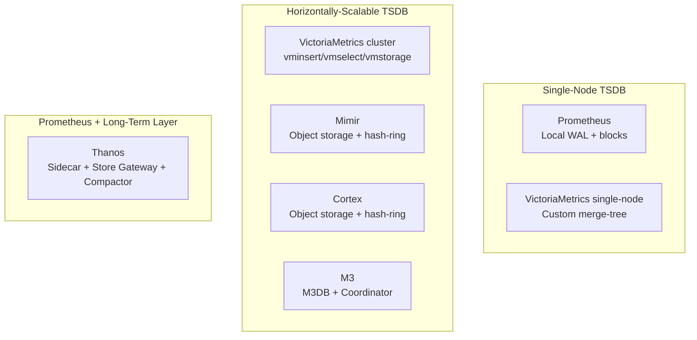

> Metrics are the first signal you check and the last signal you want to lose. Your TSDB choice determines cost at scale, query speed under cardinality pressure, and how long you can retain history.

This article focuses exclusively on **open-source, self-hostable metrics tools** — platforms primarily designed for collecting, storing, querying, and alerting on numeric time-series data. No mandatory commercial licenses, no SaaS accounts required.

**Excluded:** Managed services (Grafana Cloud Metrics, Amazon Managed Prometheus, Azure Managed Prometheus), logs/traces-focused observability platforms (SigNoz, OpenObserve, ClickStack, Elastic), and commercial-only products.

For full-platform comparisons covering logs + metrics + traces together, see [Part 1: Open-Source Observability Platforms Compared]().

---

## Table of Contents

- [Scope & Selection Criteria](#scope--selection-criteria)
- [Section 1: Prometheus-Compatible Metrics Systems](#section-1-prometheus-compatible-metrics-systems)
  - [The Candidates](#the-candidates)
  - [Architecture Classification](#architecture-classification)
  - [Feature Comparison](#feature-comparison)
  - [Cardinality & Scale](#cardinality--scale)
  - [Long-Term Storage & Object Storage](#long-term-storage--object-storage)
  - [High Availability & Multi-Cluster](#high-availability--multi-cluster)
  - [Alerting & Recording Rules](#alerting--recording-rules)
  - [Operational Complexity](#operational-complexity)
  - [When to Use What](#when-to-use-what)
  - [Known Limitations](#known-limitations)
  - [Other Emerging or Niche Tools](#other-emerging-or-niche-tools)
- [Section 2: Open-Source Metrics/Time-Series Databases](#section-2-open-source-metricstime-series-databases)
  - [The Candidates](#the-candidates-1)
  - [Comparison](#comparison)
  - [When to Use What](#when-to-use-what-1)
- [Section 3: Open-Source Metrics Monitoring Suites](#section-3-open-source-metrics-monitoring-suites)
  - [The Candidates](#the-candidates-2)
  - [Comparison](#comparison-1)
  - [When to Use What](#when-to-use-what-2)
- [Section 4: Open-Source Metric Collectors and Agents](#section-4-open-source-metric-collectors-and-agents)
  - [The Candidates](#the-candidates-3)
  - [Comparison](#comparison-2)
- [Section 5: Open-Source Metrics Instrumentation Libraries](#section-5-open-source-metrics-instrumentation-libraries)
- [Section 6: Ecosystem & Complementary Tools](#section-6-ecosystem--complementary-tools)
- [Recommended Benchmark Scope](#recommended-benchmark-scope)
- [References](#references)

---

## Scope & Selection Criteria

| Criterion | Requirement |
| :--- | :--- |
| **Open-source** | Source-available under an OSI-approved or well-known open license |
| **Self-hostable** | Runs entirely on your infrastructure, no cloud dependency |
| **No mandatory commercial license** | Free edition covers primary metrics functionality |
| **No mandatory SaaS account** | No phone-home, no cloud signup required |
| **Primarily designed for metrics** | Not a logs/traces platform that also does metrics |

---

## Section 1: Prometheus-Compatible Metrics Systems

These are the strongest candidates if you want something comparable to Prometheus or VictoriaMetrics — PromQL-compatible, scrape-oriented, cloud-native metrics.

### The Candidates

| Project | License | Scrapes metrics itself? | PromQL | Distributed | Object storage | GitHub | Recommendation |
| :--- | :--- | ---: | ---: | ---: | ---: | :--- | :--- |
| **[Prometheus](https://github.com/prometheus/prometheus)** | Apache 2.0 | Yes | Yes | No, not natively | No | ⭐ 65.8k · 👥 1,203 | Baseline |
| **[VictoriaMetrics](https://github.com/VictoriaMetrics/VictoriaMetrics)** | Apache 2.0 (Community) | Yes | MetricsQL/PromQL | Yes, cluster edition | Limited; not primary | ⭐ 17.6k · 👥 407 | Strong |
| **[Grafana Mimir](https://github.com/grafana/mimir)** | AGPLv3 | No | Yes | Yes | Yes | ⭐ 5.2k · 👥 448 | Strong |
| **[Thanos](https://github.com/thanos-io/thanos)** | Apache 2.0 | No; extends Prometheus | Yes | Yes | Yes | ⭐ 14.2k · 👥 691 | Strong |
| **[Cortex](https://github.com/cortexproject/cortex)** | Apache 2.0 | No | Yes | Yes | Yes | ⭐ 5.9k · 👥 334 | Strong, overlaps Mimir |
| **[M3](https://github.com/m3db/m3)** | Apache 2.0 | Through coordinator | Yes | Yes | Primarily distributed disks | ⭐ 4.9k · 👥 113 | Consider for extreme scale |

### Architecture Classification

| Architecture | Trade-off |
| :--- | :--- |
| **Single-node TSDB** | Simple, fast, low ops; limited by single machine's resources |
| **Horizontally-scalable TSDB** | Handles millions of active series; more components to operate |
| **Prometheus + long-term** | Keep Prometheus simple, offload history to object storage; dedup complexity |

### Feature Comparison

| Criterion | Prometheus | VictoriaMetrics | Mimir | Thanos | Cortex | M3 |
| :--- | :---: | :---: | :---: | :---: | :---: | :---: |
| **Query language** | PromQL | MetricsQL (PromQL superset) | PromQL | PromQL | PromQL | M3QL / PromQL |
| **Remote write receive** | ✅ (receiver flag) | ⭐ | ⭐ | ✅ (Receive component) | ⭐ | ✅ |
| **Remote read** | ✅ | ✅ | ✅ | ✅ | ✅ | ✅ |
| **OTLP metrics ingestion** | ✅ (experimental) | ✅ | ✅ | ✅ (via Receive) | ✅ | ◐ |
| **Scrape targets directly** | ⭐ | ⭐ (vmagent) | — (use Prometheus/Alloy) | — (use Prometheus) | — (use Prometheus) | ◐ (coordinator) |
| **Multi-tenancy** | — | ✅ (cluster) | ⭐ | ✅ | ⭐ | ✅ |
| **Downsampling** | — (recording rules only) | ✅ (enterprise) | ✅ (compactor) | ⭐ (compactor) | ✅ | ⭐ |
| **Exemplars** | ✅ | ✅ | ✅ | ✅ | ✅ | ◐ |
| **Native histograms** | ✅ | ✅ | ✅ | ✅ | ◐ | — |
| **Grafana datasource** | ⭐ (native) | ⭐ (native) | ⭐ (native) | ⭐ (native) | ⭐ (native) | ⭐ (native) |
| **Recording rules** | ⭐ | ✅ (vmalert) | ✅ (ruler) | ✅ (ruler) | ✅ (ruler) | ◐ |
| **Alerting** | ⭐ (→ Alertmanager) | ✅ (vmalert → AM) | ✅ (ruler → AM) | ✅ (ruler → AM) | ✅ (ruler → AM) | ◐ |
| **Service discovery** | ⭐ | ⭐ (vmagent) | — | — | — | ◐ |
| **Global deduplication** | — | ✅ | ✅ | ✅ (compactor) | ✅ | ✅ |

### Cardinality & Scale

| Tool | Practical active series (single instance) | Practical active series (cluster) | Cardinality limit behavior | High-churn handling | Series retention limit |
| :--- | :--- | :--- | :--- | :--- | :--- |
| Prometheus | 1–5M | N/A (single-node) | OOM crash | Manual relabeling | Disk-limited |
| VictoriaMetrics | 10–50M (single) | 100M+ (cluster) | Graceful degradation + limits | ⭐ (designed for churn) | Time or size |
| Mimir | N/A (distributed) | 100M+ | Per-tenant limits, rejection | ✅ | Configurable |
| Thanos | Prometheus per shard | Aggregated via Store | Prometheus limits per shard | Prometheus limits | Object storage TTL |
| Cortex | N/A (distributed) | 100M+ | Per-tenant limits, rejection | ✅ | Configurable |
| M3 | N/A (distributed) | 50M+ | Configurable namespace limits | ✅ | Namespace-based |

### Long-Term Storage & Object Storage

| Tool | Object storage | Multi-year retention | Tiered storage | Global query across regions |
| :--- | :---: | :---: | :---: | :---: |
| Prometheus | — (local only) | ◐ (disk-limited) | — | — (federation limited) |
| VictoriaMetrics | ◐ (enterprise only) | ⭐ (local is efficient) | ✅ (enterprise) | ✅ (vmselect multi-level) |
| Mimir | ⭐ (primary architecture) | ⭐ | ✅ (compaction tiers) | ✅ (multi-zone) |
| Thanos | ⭐ (primary architecture) | ⭐ | ✅ (compaction) | ⭐ (Store Gateway) |
| Cortex | ⭐ (primary architecture) | ⭐ | ✅ | ✅ (multi-zone) |
| M3 | ◐ (primarily local disks) | ⭐ | ✅ (retention tiers) | ✅ (M3 Coordinator) |

### High Availability & Multi-Cluster

| Tool | HA model | Deduplication | Global query view | Multi-cluster federation |
| :--- | :--- | :---: | :---: | :---: |
| Prometheus | Dual scrape + external | External (Thanos/Cortex) | ◐ (federation API) | ◐ |
| VictoriaMetrics | vminsert replication | ✅ (dedup flag) | ⭐ | ⭐ |
| Mimir | Replication factor (default 3) | ✅ (hash-ring) | ⭐ | ⭐ |
| Thanos | Sidecar per Prometheus instance | ✅ (compactor) | ⭐ (querier fan-out) | ⭐ |
| Cortex | Replication factor (default 3) | ✅ (hash-ring) | ⭐ | ⭐ |
| M3 | RF-configurable per namespace | ✅ | ⭐ | ⭐ |

### Alerting & Recording Rules

| Tool | Built-in alerting | Recording rules | Alertmanager compatible | Rule evaluation HA |
| :--- | :---: | :---: | :---: | :---: |
| Prometheus | ⭐ | ⭐ | ⭐ (defines it) | — (dual-eval only) |
| VictoriaMetrics | ✅ (vmalert) | ✅ | ⭐ | ✅ (cluster-aware) |
| Mimir | ✅ (ruler) | ✅ | ⭐ | ⭐ (ruler HA) |
| Thanos | ✅ (ruler) | ✅ | ⭐ | ✅ (ruler replicas) |
| Cortex | ✅ (ruler) | ✅ | ⭐ | ⭐ |
| M3 | ◐ (external Prometheus rules) | ✅ | ⭐ | ◐ |

### Operational Complexity

| Tool | Min RAM | Components to run | Upgrade path | Config complexity | Team size needed |
| :--- | :--- | :--- | :--- | :--- | :--- |
| Prometheus | 2 GB | 1 binary | Simple | Low | 1 |
| VictoriaMetrics (single) | 1 GB | 1 binary (+ vmagent optional) | Simple | Low | 1 |
| VictoriaMetrics (cluster) | 4 GB+ | 3+ (vminsert/vmselect/vmstorage) | Simple | Medium | 1–2 |
| Mimir | 8 GB+ | 5+ (microservices mode) or 1 (monolithic) | Helm-managed | High | 2+ |
| Thanos | 4 GB+ | 4+ (sidecar/store/query/compact) | Per-component | Medium-High | 1–2 |
| Cortex | 8 GB+ | 5+ (similar to Mimir) | Helm-managed | High | 2+ |
| M3 | 8 GB+ | 3+ (M3DB/Coordinator/Aggregator) | Complex | High | 2+ |

### When to Use What

| If you need... | Best fit | Runner-up |
| :--- | :--- | :--- |
| **Simple single-cluster monitoring** | Prometheus | VictoriaMetrics (single) |
| **Prometheus drop-in replacement, lower resource usage** | VictoriaMetrics (single) | Prometheus |
| **Scale to millions of series, distributed** | VictoriaMetrics (cluster) | Mimir |
| **Multi-tenant metrics platform** | Mimir | Cortex |
| **Long-term retention on cheap object storage** | Thanos | Mimir |
| **Extend existing Prometheus without replacing it** | Thanos | — |
| **Multi-year analytics at extreme scale (Uber-scale)** | M3 | VictoriaMetrics (cluster) |
| **AGPL license unacceptable** | VictoriaMetrics / Thanos / Cortex | Prometheus |
| **Lowest operational overhead at scale** | VictoriaMetrics (cluster) | Mimir (monolithic mode) |
| **Global view across 10+ clusters** | Thanos | Mimir |
| **MetricsQL extras (WITH expressions, label transforms)** | VictoriaMetrics | — |

### Known Limitations

| Tool | Key limitation |
| :--- | :--- |
| **Prometheus** | Single-node only; OOM under cardinality explosion; no native long-term storage or HA |
| **VictoriaMetrics** | Downsampling, some cluster features (multi-retention, dedup) require enterprise license |
| **Mimir** | Complex microservices deployment; requires object storage; AGPL license |
| **Thanos** | Eventual consistency (not real-time on recent data); compactor is single point of failure; dedup not always perfect |
| **Cortex** | Effectively superseded by Mimir (same team); maintenance is community-driven |
| **M3** | Effectively unmaintained (Uber reduced investment); complex to operate; steep learning curve |

### Other Emerging or Niche Tools

| Tool | License | Notes |
| :--- | :--- | :--- |
| **[SquirrelDB](https://github.com/bleemeo/squirreldb)** | AGPLv3 | Distributed TSDB on Cassandra; Prometheus-compatible APIs. ⭐ 43 · 👥 5. Small community, niche use case. |
| **[Vulcan](https://github.com/digitalocean/vulcan)** | Apache 2.0 | DigitalOcean's distributed Prometheus-compatible TSDB. ⭐ 527 · 👥 4. **Archived** (Nov 2017, read-only). |

---

## Section 2: Open-Source Metrics/Time-Series Databases

These store numeric time-series data but are not necessarily Prometheus-native. Different architectures, different query languages, different trade-offs.

### The Candidates

| Project | License | Storage architecture | Interface/query | Positioning |
| :--- | :--- | :--- | :--- | :--- |
| **[InfluxDB 3 Core](https://github.com/influxdata/influxdb)** | MIT / Apache 2.0 | Columnar / object-store-oriented | SQL, InfluxDB line protocol | Modern general-purpose TSDB (⭐ 31.7k · 👥 527) |
| **[InfluxDB OSS 2.x](https://github.com/influxdata/influxdb)** | MIT | Local TSM engine | Flux, InfluxQL | Established but older generation |
| **[Graphite](https://graphite.readthedocs.io/en/latest/overview.html)** | Apache 2.0 | Whisper files | Graphite functions | Mature, metrics-only, push-based |
| **[OpenTSDB](https://github.com/OpenTSDB/opentsdb)** | LGPL / GPL | HBase or Bigtable | OpenTSDB API | Scalable but operationally heavy (⭐ 5.1k · 👥 127) |
| **[KairosDB](https://github.com/kairosdb/kairosdb)** | Apache 2.0 | Cassandra | REST and Graphite API | Useful in Cassandra environments (⭐ 1.8k · 👥 58) |
| **[Gnocchi](https://github.com/gnocchixyz/gnocchi)** | Apache 2.0 | Pluggable (file, Ceph, Swift, S3) | REST API | Metrics-as-a-Service; OpenStack heritage (⭐ 323 · 👥 94) |
| **[RRDtool](https://oss.oetiker.ch/rrdtool/)** | GPL | Fixed-size RRD files | RRD API/CLI | Appliances and network graphs |
| **[Performance Co-Pilot (PCP)](https://github.com/performancecopilot/pcp)** | GPL / LGPL | Local and distributed archives | PCP tools/APIs | Linux performance metrics (⭐ 1.1k · 👥 179) |

### Comparison

| Tool | Scrape-based | Push-based | PromQL compat | SQL | Compression | Object storage | Cardinality limit | Current status |
| :--- | :---: | :---: | :---: | :---: | :--- | :---: | :--- | :--- |
| InfluxDB 3 Core | — | ⭐ (line protocol) | — | ⭐ | Parquet/columnar | ⭐ | Unbounded | Active, new generation |
| InfluxDB OSS 2.x | — | ⭐ | — | — (Flux) | TSM | — | Moderate | Maintenance mode |
| Graphite | — | ⭐ | — | — | Fixed-size files | — | Label-limited | Mature, stable |
| OpenTSDB | — | ✅ | — | — | HBase compression | ◐ (via HBase) | Millions (HBase) | Low activity |
| KairosDB | — | ✅ | — | — | Cassandra compression | ◐ | Cassandra-limited | Low activity |
| Gnocchi | — | ✅ | — | — | Pluggable | ✅ (S3/Ceph/Swift) | Archive-policy-based | Mature, OpenStack |
| RRDtool | — | ✅ | — | — | Fixed-size | — | Fixed by design | Stable, legacy |
| PCP | ⭐ (pmcd) | — | ◐ (via pmseries/Redis) | — | PCP archives | — | Host-level | Active, Linux-focused |

### When to Use What

| If you need... | Best fit | Runner-up |
| :--- | :--- | :--- |
| **Modern SQL-first TSDB, no Prometheus dependency** | InfluxDB 3 Core | — |
| **Simple push-based metrics with dashboards** | Graphite | Gnocchi |
| **Hadoop/HBase environment, massive scale** | OpenTSDB | KairosDB |
| **Cassandra environment** | KairosDB | — |
| **OpenStack / cloud metering** | Gnocchi | — |
| **Embedded devices, fixed-size storage** | RRDtool | — |
| **Linux kernel/system performance deep-dive** | Performance Co-Pilot | — |
| **Existing InfluxDB 1.x/2.x investment** | InfluxDB 3 Core (migrate) | InfluxDB 2.x |

---

## Section 3: Open-Source Metrics Monitoring Suites

Complete monitoring products — they collect, store, alert, and visualize metrics out of the box. Different from bare TSDBs in that they are full operational monitoring solutions.

### The Candidates

| Project | License | Primary focus | Suitable for |
| :--- | :--- | :--- | :--- |
| **[Zabbix](https://www.zabbix.com/)** | GPL | Infrastructure and network metrics | Servers, VMs, databases, SNMP |
| **[Netdata Agent](https://github.com/netdata/netdata)** | GPL v3+ | High-resolution real-time metrics | Host and container troubleshooting |
| **[Icinga 2](https://icinga.com/docs/icinga-2/latest/)** | GPL | Checks, availability, performance data | Traditional infrastructure monitoring |
| **[LibreNMS](https://www.librenms.org/)** | GPL | SNMP / network monitoring | Routers, switches, firewalls |
| **[OpenNMS](https://www.opennms.com/)** | AGPL | Large-scale network monitoring | Telecom and enterprise networks |
| **[Cacti](https://www.cacti.net/)** | GPL | SNMP and RRD graphs | Network capacity monitoring |
| **[Munin](https://munin-monitoring.org/)** | GPL | Server metrics | Simple host monitoring |
| **[Nagios Core](https://www.nagios.org/projects/nagios-core/)** | GPL | Availability and plugin checks | Traditional server monitoring |
| **[Checkmk Raw Edition](https://checkmk.com/product/raw-edition)** | GPL | Infrastructure monitoring | Agent and SNMP monitoring |
| **[Shinken](https://github.com/naparuba/shinken)** | AGPL | Nagios-compatible monitoring | Legacy/Nagios environments |

### Comparison

| Tool | Agent-based | SNMP | Auto-discovery | Built-in dashboards | Alerting | API | Prometheus export | Scale |
| :--- | :---: | :---: | :---: | :---: | :---: | :---: | :---: | :--- |
| Zabbix | ⭐ | ⭐ | ⭐ | ⭐ | ⭐ | ✅ | ✅ | Enterprise-grade |
| Netdata | ⭐ (zero-config) | ✅ | ⭐ | ⭐ (real-time) | ✅ | ✅ | ⭐ | Single-host focused |
| Icinga | ⭐ | ✅ | ✅ | ✅ (Icinga Web) | ⭐ | ✅ | ✅ | Medium-large |
| LibreNMS | ◐ | ⭐ | ⭐ | ⭐ | ✅ | ✅ | ◐ | Network-focused |
| OpenNMS | ⭐ | ⭐ | ⭐ | ✅ | ⭐ | ✅ | ◐ | Enterprise network |
| Cacti | — | ⭐ | ◐ | ⭐ (RRD graphs) | ◐ | ◐ | — | Network/capacity |
| Munin | ⭐ (plugins) | ◐ | ◐ | ✅ (static HTML) | ◐ | — | ◐ | Small/medium |
| Nagios Core | ⭐ (plugins) | ✅ | ◐ | ◐ | ⭐ | ◐ | ◐ | Traditional |
| Checkmk Raw | ⭐ | ⭐ | ⭐ | ⭐ | ⭐ | ✅ | ✅ | Enterprise-grade |
| Shinken | ⭐ (Nagios compat) | ✅ | ◐ | ◐ | ✅ | ◐ | — | Legacy |

### When to Use What

| If you need... | Best fit | Runner-up |
| :--- | :--- | :--- |
| **Enterprise infrastructure monitoring (all-in-one)** | Zabbix | Checkmk Raw |
| **Real-time per-second metrics, zero config** | Netdata | — |
| **Network/SNMP-focused monitoring** | LibreNMS | OpenNMS |
| **Large telecom / enterprise networks** | OpenNMS | Zabbix |
| **Nagios replacement with modern UX** | Icinga 2 | Checkmk Raw |
| **Simple server monitoring, minimal setup** | Munin | Netdata |
| **Existing Nagios plugin ecosystem** | Icinga 2 | Shinken |
| **Network capacity graphing (RRD-based)** | Cacti | LibreNMS |

---

## Section 4: Open-Source Metric Collectors and Agents

These do not replace a metrics database — they collect, process, and forward metrics to backends.

### The Candidates

| Tool | License | Function |
| :--- | :--- | :--- |
| **[Telegraf](https://github.com/influxdata/telegraf)** | MIT | Plugin-based metric collection and forwarding (⭐ 17.8k · 👥 1,423) |
| **[collectd](https://collectd.org/)** | MIT / GPL components | Lightweight system metric collector |
| **[StatsD](https://github.com/statsd/statsd)** | MIT | Application metric aggregation (UDP) |
| **[Prometheus Node Exporter](https://github.com/prometheus/node_exporter)** | Apache 2.0 | Linux host metrics (⭐ 13.7k · 👥 462) |
| **[Prometheus Blackbox Exporter](https://github.com/prometheus/blackbox_exporter)** | Apache 2.0 | HTTP, TCP, DNS, ICMP probing |
| **[Prometheus SNMP Exporter](https://github.com/prometheus/snmp_exporter)** | Apache 2.0 | SNMP metrics for Prometheus |
| **[Prometheus JMX Exporter](https://github.com/prometheus/jmx_exporter)** | Apache 2.0 | JVM metrics for Prometheus |
| **[Grafana Beyla](https://github.com/grafana/beyla)** | Apache 2.0 | eBPF-based application metrics (zero-code) |
| **[Glouton](https://github.com/bleemeo/glouton)** | Apache 2.0 | Single-binary monitoring agent with auto-discovery, embedded TSDB, and local dashboard (⭐ 61 · 👥 12) |
| **[mtail](https://github.com/google/mtail)** | Apache 2.0 | Produces metrics by parsing application logs |
| **[Diamond](https://github.com/python-diamond/Diamond)** | MIT | Python metrics collector |
| **[tcollector](https://github.com/OpenTSDB/tcollector)** | LGPL | Collects and forwards metrics to OpenTSDB |

> **Note:** OpenTelemetry Collector and Grafana Alloy are open-source and can collect metrics, but they are not metrics-only — they also process logs and traces. They remain the recommended multi-signal collectors for OTel-native environments.

### Comparison

| Tool | System metrics | App metrics | Network/SNMP | Push | Pull/scrape | Multi-output | Plugin ecosystem |
| :--- | :---: | :---: | :---: | :---: | :---: | :---: | :--- |
| Telegraf | ⭐ | ⭐ | ✅ | ⭐ | ✅ | ⭐ | 300+ plugins |
| collectd | ⭐ | ◐ | ✅ | ⭐ | — | ✅ | 100+ plugins |
| StatsD | — | ⭐ | — | ⭐ (UDP) | — | ✅ | Protocol-based |
| Node Exporter | ⭐ | — | — | — | ⭐ (Prometheus) | — | Linux-specific |
| Blackbox Exporter | — | — | ✅ (probes) | — | ⭐ (Prometheus) | — | HTTP/TCP/DNS/ICMP |
| SNMP Exporter | — | — | ⭐ | — | ⭐ (Prometheus) | — | SNMP MIB-based |
| JMX Exporter | — | ⭐ (JVM) | — | — | ⭐ (Prometheus) | — | JMX MBeans |
| Beyla | — | ⭐ (eBPF) | — | ⭐ (OTLP/Prom) | — | ✅ | Zero-config |
| mtail | — | ✅ (from logs) | — | — | ⭐ (Prometheus) | — | Regex-based |
| Diamond | ⭐ | ◐ | ◐ | ⭐ | — | ✅ | Python-based |
| tcollector | ⭐ | ◐ | — | ⭐ (OpenTSDB) | — | — | Script-based |

---

## Section 5: Open-Source Metrics Instrumentation Libraries

Libraries developers embed inside applications to expose metrics:

| Library | Language/ecosystem | Purpose |
| :--- | :--- | :--- |
| **[Prometheus client libraries](https://prometheus.io/docs/instrumenting/clientlibs/)** | Go, Java, Python, Ruby, .NET, others | Expose Prometheus-format metrics |
| **[Micrometer](https://micrometer.io/)** | Java / Kotlin / JVM | Vendor-neutral metrics instrumentation |
| **[Dropwizard Metrics](https://metrics.dropwizard.io/)** | Java / JVM | Counters, gauges, timers, histograms |
| **[OpenTelemetry Metrics SDK](https://opentelemetry.io/docs/specs/otel/metrics/)** | Multiple languages | Vendor-neutral metric instrumentation |
| **[OpenMetrics](https://openmetrics.io/)** | Specification / ecosystem | Standard metrics exposition format |
| **[go-metrics](https://github.com/rcrowley/go-metrics)** | Go | Application metrics library |
| **[prom-client](https://github.com/siimon/prom-client)** | Node.js | Prometheus metrics for Node |
| **[prometheus-net](https://github.com/prometheus-net/prometheus-net)** | .NET | Prometheus metrics for .NET |
| **[App Metrics](https://www.app-metrics.io/)** | .NET | Application metrics instrumentation |
| **[HdrHistogram](https://hdrhistogram.github.io/HdrHistogram/)** | Multiple languages | High-dynamic-range latency histograms |

---

## Section 6: Ecosystem & Complementary Tools

Tools that complement the metrics platforms above — alerting, dashboards, and complete self-hosted monitoring solutions.

| Tool | License | Purpose | GitHub |
| :--- | :--- | :--- | :--- |
| **[Prometheus Alertmanager](https://github.com/prometheus/alertmanager)** | Apache 2.0 | Alert routing, deduplication, grouping, and notification (used by Prometheus, VictoriaMetrics, Mimir, Thanos, Cortex) | ⭐ 8.6k · 👥 410 |
| **[Dashglass](https://github.com/bleemeo/dashglass)** | Apache 2.0 | Lightweight Prometheus-native dashboards with GitOps-first file storage — single Go binary, no database | ⭐ 6 · 👥 1 |
| **[Bleemeo Community Edition](https://github.com/bleemeo/bleemeo-community-edition)** | Open-source | Complete self-hosted monitoring stack combining Glouton (agent) + SquirrelDB (TSDB) + Grafana, with push model and horizontal scaling | ⭐ 14 · 👥 5 |

---

## Recommended Benchmark Scope

For a fair performance comparison, only architecturally comparable tools should be benchmarked together. Mixing a single-node TSDB with a network monitoring suite produces misleading results.

**Primary benchmark tier (Prometheus-compatible, cloud-native):**

1. Prometheus
2. VictoriaMetrics
3. Grafana Mimir
4. Thanos
5. Cortex
6. M3
7. InfluxDB 3 Core

**What to benchmark:**

- Ingestion rate (active series × scrape interval)
- Cardinality handling (100k → 1M → 5M+ active series)
- Query latency (instant, range, heavy aggregation)
- Storage efficiency (bytes per datapoint after compaction)
- Memory usage under load
- Recovery time after crash
- Downsampling query performance (7d, 30d, 90d ranges)

**Useful open-source benchmark and testing tools:**

| Tool | License | Purpose | GitHub |
| :--- | :--- | :--- | :--- |
| **[prometheus-benchmark](https://github.com/VictoriaMetrics/prometheus-benchmark)** | Apache 2.0 | Benchmark for Prometheus-compatible systems — generates production-like write (remote_write, OTLP) and read (alerting rules) workloads | ⭐ 209 · 👥 10 |
| **[promqlsmith](https://github.com/cortexproject/promqlsmith)** | Apache 2.0 | Random PromQL query generator for fuzz-testing PromQL engines | ⭐ 25 · 👥 6 |
| **[vmestimator](https://github.com/VictoriaMetrics/vmestimator)** | Apache 2.0 | Real-time cardinality estimation for VictoriaMetrics/Prometheus — measures series count across label dimensions | ⭐ 58 · 👥 10 |
| **[metricsql](https://github.com/VictoriaMetrics/metricsql)** | Apache 2.0 | Go library for parsing MetricsQL/PromQL queries | ⭐ 245 · 👥 22 |
| **[vmgather](https://github.com/VictoriaMetrics/vmgather)** | Apache 2.0 | Collects diagnostic information from VictoriaMetrics deployments for support/debugging | ⭐ 9 · 👥 3 |

**Not benchmarked together** (different use cases):

- Traditional TSDBs (Graphite, OpenTSDB) — different ingestion model, different query patterns
- Monitoring suites (Zabbix, Netdata) — full products, not bare TSDBs
- Collectors (Telegraf, StatsD) — pipeline components, not storage

---

## References

### Prometheus-Compatible Systems
- [Prometheus Documentation](https://prometheus.io/docs/)
- [VictoriaMetrics Documentation](https://docs.victoriametrics.com/)
- [Grafana Mimir Documentation](https://grafana.com/docs/mimir/latest/)
- [Thanos Documentation](https://thanos.io/tip/thanos/getting-started.md/)
- [Cortex Documentation](https://cortexmetrics.io/docs/)
- [M3 Documentation](https://m3db.io/docs/)
- [SquirrelDB](https://github.com/bleemeo/squirreldb)
- [Vulcan](https://github.com/digitalocean/vulcan)

### Time-Series Databases
- [InfluxDB 3 Core Documentation](https://docs.influxdata.com/influxdb3/core/)
- [InfluxDB 2.x Documentation](https://docs.influxdata.com/influxdb/v2/)
- [Graphite Documentation](https://graphite.readthedocs.io/en/latest/overview.html)
- [OpenTSDB Documentation](https://opentsdb.net/docs/build/html/index.html)
- [KairosDB Documentation](https://kairosdb.github.io/docs/index.html)
- [Gnocchi Documentation](https://gnocchi.xyz/)
- [RRDtool Documentation](https://oss.oetiker.ch/rrdtool/)
- [Performance Co-Pilot](https://pcp.io/)

### Monitoring Suites
- [Zabbix Documentation](https://www.zabbix.com/documentation)
- [Netdata Documentation](https://learn.netdata.cloud/docs/)
- [Icinga 2 Documentation](https://icinga.com/docs/icinga-2/latest/)
- [LibreNMS Documentation](https://docs.librenms.org/)
- [OpenNMS Documentation](https://docs.opennms.com/)
- [Cacti Documentation](https://docs.cacti.net/)
- [Checkmk Documentation](https://docs.checkmk.com/)
- [Nagios Core Documentation](https://www.nagios.org/documentation/)

### Collectors and Agents
- [Telegraf Documentation](https://docs.influxdata.com/telegraf/)
- [collectd Documentation](https://collectd.org/wiki/index.php/Main_Page)
- [StatsD](https://github.com/statsd/statsd)
- [Grafana Beyla](https://grafana.com/docs/beyla/latest/)
- [mtail](https://github.com/google/mtail)

### Instrumentation Libraries
- [Prometheus Client Libraries](https://prometheus.io/docs/instrumenting/clientlibs/)
- [Micrometer](https://micrometer.io/docs)
- [OpenTelemetry Metrics](https://opentelemetry.io/docs/specs/otel/metrics/)
- [OpenMetrics](https://openmetrics.io/)

### Ecosystem & Complementary Tools
- [Prometheus Alertmanager](https://github.com/prometheus/alertmanager)
- [Dashglass](https://github.com/bleemeo/dashglass)
- [Bleemeo Community Edition](https://github.com/bleemeo/bleemeo-community-edition)
- [Glouton](https://github.com/bleemeo/glouton)

### Benchmark & Testing Tools
- [prometheus-benchmark](https://github.com/VictoriaMetrics/prometheus-benchmark)
- [promqlsmith](https://github.com/cortexproject/promqlsmith)
- [vmestimator](https://github.com/VictoriaMetrics/vmestimator)
- [metricsql (Go library)](https://github.com/VictoriaMetrics/metricsql)
- [vmgather](https://github.com/VictoriaMetrics/vmgather)

---

*Last verified: September 2026. Features, licensing, and performance characteristics change — always check official sources.*
