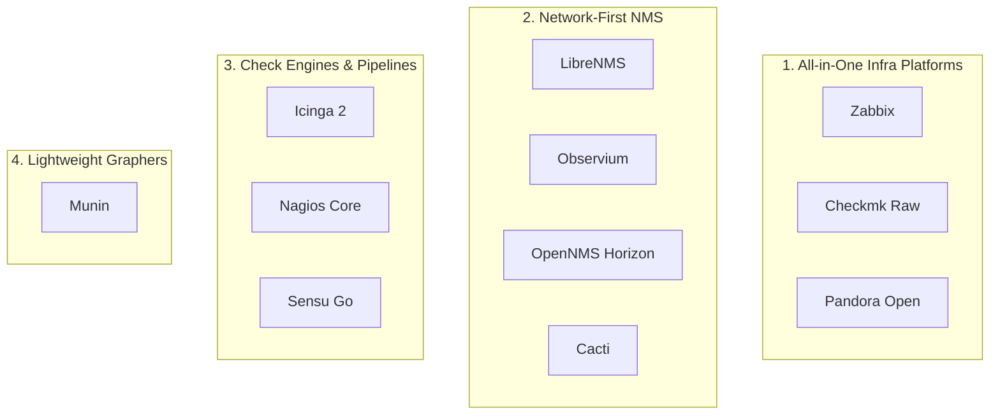

**Open-source NMS (Network Management System)** monitoring is the practice of discovering, polling, and alerting on servers, switches, routers, and applications using SNMP, agents, ICMP, and plugin checks — typically for NOC and sysadmin workflows rather than public status pages.

Commercial suites (SolarWinds, PRTG, LogicMonitor) cover this well until device count, licensing, or data residency push teams toward self-hosted open source.

This guide compares **11 leading open-source NMS and infrastructure monitoring tools** that auto-discover devices, collect host/network metrics, and drive operational alerts:

1. **[Checkmk](https://github.com/Checkmk/checkmk)**{:target="_blank" rel="noopener"} — Rule-based Raw Edition for fast host/service discovery across mixed estates.
2. **[Zabbix](https://github.com/zabbix/zabbix)**{:target="_blank" rel="noopener"} — All-in-one enterprise monitoring with proxies, templates, and trigger-based alerting.
3. **[LibreNMS](https://github.com/librenms/librenms)**{:target="_blank" rel="noopener"} — Network-first SNMP auto-discovery, topology maps, and interface graphs.
4. **[OpenNMS Horizon](https://github.com/opennms/opennms)**{:target="_blank" rel="noopener"} — Distributed fault and performance management for complex networks.
5. **[Icinga 2](https://github.com/Icinga/icinga2)**{:target="_blank" rel="noopener"} — Modern Nagios-compatible engine with DSL config, zones, and REST API.
6. **[Nagios Core](https://github.com/NagiosEnterprises/nagioscore)**{:target="_blank" rel="noopener"} — Classic plugin-driven monitoring engine with a massive check ecosystem.
7. **[Sensu Go](https://github.com/sensu/sensu-go)**{:target="_blank" rel="noopener"} — Agent-based monitoring router with event pipelines, filters, and handlers.
8. **[Pandora Open](https://github.com/pandorafms/pandora-open)**{:target="_blank" rel="noopener"} — Multi-layer infrastructure platform (agents, SNMP, Netflow, GIS consoles).
9. **[Observium Community](https://observium.org/)**{:target="_blank" rel="noopener"} — Autodiscovery-focused network monitoring with broad device OS support.
10. **[Cacti](https://github.com/cacti/cacti)**{:target="_blank" rel="noopener"} — RRD-based network graphing and SNMP data collection classic.
11. **[Munin](https://github.com/munin-monitoring/munin)**{:target="_blank" rel="noopener"} — Lightweight master/node resource graphing for servers and services.

For external synthetic probing and public status pages, see our [open-source uptime monitoring tools comparison](). For logs + metrics + traces platforms, see [open-source observability platforms compared](). For alert routing after NMS triggers fire, see the draft alert-management series when published.

## TL;DR — Quick Recommendations

| Use Case | Best Fit | Runner-Up | Why |
| -------- | -------- | --------- | --- |
| **Mixed servers + network in one platform** | **Zabbix** | Checkmk | Templates, proxies, triggers, and broad OS/device coverage |
| **Network-first SNMP discovery & topology** | **LibreNMS** | Observium | Fast auto-discovery, interface graphs, wide device OS support |
| **Fast rule-based setup with sensible defaults** | **Checkmk (Raw)** | Icinga 2 | Agent discovery + rule engine reduces per-host toil |
| **Distributed fault / performance / flows** | **OpenNMS Horizon** | Zabbix | Built for large, alarm-heavy, multi-site network estates |
| **Modern Nagios-compatible automation** | **Icinga 2** | Checkmk | Config DSL, zones/HA, REST API, plugin compatibility |
| **Plugin ecosystem / legacy estates** | **Nagios Core** | Icinga 2 | Thousands of community checks; high manual config cost |
| **Event pipeline / check automation** | **Sensu Go** | Icinga 2 | Filters, handlers, and remediation-oriented event routing |
| **Multi-tenant ops console + Netflow** | **Pandora Open** | OpenNMS | Agents + SNMP + visual consoles under GPL |
| **Simple RRD graphs / capacity charts** | **Cacti** | Munin | Classic SNMP → RRD graphing for traffic and sensors |
| **Lightweight server resource graphs** | **Munin** | Cacti | Master/node plugins with minimal operational surface |

> Jump to [When to Use What](#when-to-use-what) for the decision tree, or the [Capability Matrices](#discovery--collection-matrix) below.
{: .prompt-tip }

## Approach & Scope Demarcation

### Selection Criteria

Tools in the primary comparison had to meet most of the following:

1. **Open Source:** Public source under an OSI-recognized or commonly accepted open-source license (GPL, AGPL, MIT, Apache, QPL Community, etc.).
2. **Infrastructure / Network Focus:** Discovers or polls hosts, network devices, or services via SNMP, agents, ICMP, WMI, or plugins — not only outward HTTP synthetic checks.
3. **Operational Dashboard:** Provides a NOC-oriented UI for inventory, graphs, and/or alert state (not a headless exporter alone).
4. **Self-Hostable:** Usable without a mandatory paid cloud control plane (commercial editions may exist alongside a free/community core).

### What This Guide Is NOT

1. **Uptime / status-page products — Uptime Kuma, Gatus, OpenStatus, Upptime:**  
   Covered in [Open-Source Uptime Monitoring Tools Compared](). Those tools answer “is the URL up from outside?” and publish customer status pages; NMS tools answer “is this switch port / host disk / BGP peer healthy inside the estate?”
2. **Three-signal observability platforms — SigNoz, OpenObserve, Grafana LGTM:**  
   Covered in [Open-Source Observability Platforms Compared](). Overlap exists (Zabbix can ingest metrics; OpenNMS can emit telemetry), but the primary UX and polling model differ.
3. **Cloud-native runtime security / CNI observability — Falco, Cilium Hubble, Calico:**  
   These are eBPF security and networking planes, not classic NMS. Treat them as a separate Security deep dive.
4. **Pure event stream processors — [Riemann](https://github.com/riemann/riemann)**{:target="_blank" rel="noopener"}:**  
   Riemann aggregates and routes events with a stream language; it is closer to an alert/event pipeline than an inventory NMS. Listed under [Honorable Mentions](#honorable-mentions--adjacent-tools).

## Legend

| Symbol | Meaning |
| :---: | ------- |
| ✅ | Fully supported and documented out of the box |
| ◐ | Partial support, plugin/module, or edition-dependent |
| ⭐ | Standout strength for this category |
| — | Not supported or out of scope |
| EE | Stronger or exclusive in a commercial / professional edition |

## Candidate Tools Evaluated

| Tool | Primary Stack | Collection Model | License (OSS Core) | Primary Persona |
| ---- | ------------- | ---------------- | ------------------ | --------------- |
| **[Checkmk](https://github.com/Checkmk/checkmk)**{:target="_blank" rel="noopener"} | Python / C++ | Agent + SNMP + rules | GPL-2.0 (Raw) | Sysadmin, MSP |
| **[Zabbix](https://github.com/zabbix/zabbix)**{:target="_blank" rel="noopener"} | C / PHP / Go (proxy) | Agent + SNMP + proxies | AGPLv3 (7.x) | Enterprise NOC |
| **[LibreNMS](https://github.com/librenms/librenms)**{:target="_blank" rel="noopener"} | PHP / MySQL / RRD | SNMP auto-discovery | GPL-3.0 | Network engineer |
| **[OpenNMS](https://github.com/opennms/opennms)**{:target="_blank" rel="noopener"} | Java | SNMP / flows / Minion | AGPL-3.0 | Large network ops |
| **[Icinga 2](https://github.com/Icinga/icinga2)**{:target="_blank" rel="noopener"} | C++ | Checks / agents / zones | GPL-2.0 | Platform SRE |
| **[Nagios Core](https://github.com/NagiosEnterprises/nagioscore)**{:target="_blank" rel="noopener"} | C | Plugins (NRPE/SSH) | GPL-2.0 | Legacy estates |
| **[Sensu Go](https://github.com/sensu/sensu-go)**{:target="_blank" rel="noopener"} | Go | Agent checks + pipelines | MIT | Cloud / ephemeral infra |
| **[Pandora Open](https://github.com/pandorafms/pandora-open)**{:target="_blank" rel="noopener"} | Perl / PHP / MySQL | Agents + SNMP + Netflow | GPL-2.0 | Multi-tenant ops |
| **[Observium](https://observium.org/)**{:target="_blank" rel="noopener"} | PHP / MySQL / RRD | SNMP autodiscovery | QPL (Community) | Network SMB / ISP |
| **[Cacti](https://github.com/cacti/cacti)**{:target="_blank" rel="noopener"} | PHP / MySQL / RRD | SNMP polling | GPL-2.0 | Capacity graphing |
| **[Munin](https://github.com/munin-monitoring/munin)**{:target="_blank" rel="noopener"} | Perl | Master/node plugins | GPL-2.0 | Homelab / small ops |

## Architectural Archetypes



| Archetype | Tools | How It Operates | Best Fit |
| --------- | ----- | --------------- | -------- |
| **All-in-One Infra** | Zabbix, Checkmk, Pandora Open | One product for hosts, apps, and often network devices | Teams that want a single ops console |
| **Network-First NMS** | LibreNMS, Observium, OpenNMS, Cacti | SNMP inventory, interface RRD/graphs, topology | NOC / network engineering |
| **Check Engine / Pipeline** | Icinga 2, Nagios Core, Sensu Go | Schedule checks → evaluate state → handlers/alerts | Plugin ecosystems and automation |
| **Lightweight Grapher** | Munin | Pull node plugins into simple RRD dashboards | Small estates, low ops budget |

---

## Discovery & Collection Matrix

| Capability | Checkmk | Zabbix | LibreNMS | OpenNMS | Icinga 2 | Nagios | Sensu Go | Pandora | Observium | Cacti | Munin |
| :--- | :---: | :---: | :---: | :---: | :---: | :---: | :---: | :---: | :---: | :---: | :---: |
| **SNMP polling** | ✅ | ✅ | ⭐ | ⭐ | ◐ | ◐ plugin | ◐ | ✅ | ⭐ | ⭐ | — |
| **Host agents** | ⭐ | ⭐ | — | ◐ | ✅ | ✅ NRPE | ⭐ | ⭐ | ◐ apps | — | ⭐ |
| **Auto-discovery** | ⭐ rules | ⭐ LLD | ⭐ SNMP | ⭐ | ◐ | — | ◐ | ✅ | ⭐ | ◐ | ◐ |
| **Network topology maps** | ◐ | ◐ | ⭐ | ⭐ | — | — | — | ◐ | ⭐ | ◐ | — |
| **Netflow / sFlow / IPFIX** | ◐ | ◐ | ✅ | ⭐ | — | — | — | ✅ | EE | ◐ | — |
| **Trap / syslog ingest** | ✅ | ✅ | ✅ | ⭐ | ◐ | ◐ | ◐ | ✅ | ✅ | — | — |
| **WMI / Windows depth** | ✅ | ✅ | ◐ | ◐ | ✅ | ◐ | ◐ | ✅ | ◐ | — | ◐ |
| **Kubernetes / cloud APIs** | ◐ | ✅ | — | ◐ | ◐ | — | ⭐ | ◐ | — | — | — |
| **Distributed pollers / proxies** | ✅ | ⭐ proxies | ✅ | ⭐ Minions | ⭐ zones | ◐ | ✅ | ✅ | EE | ◐ | ◐ |

**Key Insights:**

- **Best network autodiscovery:** **LibreNMS** and **Observium** minimize per-device setup for SNMP estates.
- **Best mixed estate (servers + network):** **Zabbix** and **Checkmk** reduce tool sprawl.
- **Best distributed collection:** **Zabbix proxies**, **OpenNMS Minions**, and **Icinga zones** scale beyond a single poller.

---

## Alerting, UI & Operations Matrix

| Capability | Checkmk | Zabbix | LibreNMS | OpenNMS | Icinga 2 | Nagios | Sensu Go | Pandora | Observium | Cacti | Munin |
| :--- | :---: | :---: | :---: | :---: | :---: | :---: | :---: | :---: | :---: | :---: | :---: |
| **Threshold / state alerts** | ⭐ | ⭐ | ✅ | ⭐ | ⭐ | ✅ | ✅ | ✅ | EE | ◐ | ◐ |
| **Escalation / dependencies** | ✅ | ✅ | ◐ | ✅ | ⭐ | ⭐ | ◐ handlers | ✅ | ◐ | — | — |
| **Notification channels** | ✅ | ⭐ | ✅ | ✅ | ✅ | ✅ | ⭐ handlers | ✅ | ◐ | ◐ | ◐ |
| **NOC dashboard UX** | ⭐ | ⭐ | ⭐ | ✅ | ✅ | ◐ classic | ◐ | ⭐ | ⭐ | ◐ graphs | ◐ |
| **Config as code / API** | ◐ | ✅ | ✅ API | ✅ | ⭐ DSL+API | ◐ | ⭐ | ✅ | ◐ | ◐ | ◐ |
| **Multi-tenant / ACL depth** | EE | ✅ | ✅ | ✅ | ✅ | ◐ | ✅ | ⭐ | ◐ | ◐ | — |
| **Commercial edition upsell** | EE | ◐ support | — | Meridian | ◐ repos | XI | EE | — | Pro/Ent | — | — |

**Key Insights:**

- **Alert-first check engines:** **Icinga 2** and **Nagios** still excel when the product *is* the check scheduler.
- **Event-driven automation:** **Sensu Go** shines when checks are inputs to a filter/handler pipeline (“monitoring router”).
- **Edition boundaries:** **Checkmk**, **Observium**, and **Sensu** expose meaningful features behind commercial tiers — verify Raw/Community coverage before committing.

---

## Licensing / "Actually Free" Notes

| Tool | OSS Core Reality | Watch-Outs |
| ---- | ---------------- | ---------- |
| **Checkmk Raw** | Fully usable GPL core | Enterprise features (reporting, advanced scalability) are commercial |
| **Zabbix** | AGPLv3 core is complete for most estates | Optional paid support / Zabbix Cloud |
| **LibreNMS** | Community GPL-3.0 project | Self-host ops cost (PHP, MySQL, RRD, pollers) |
| **OpenNMS Horizon** | Open AGPL distribution | Meridian is the supported commercial train |
| **Icinga 2** | Fully open core | Optional repository subscriptions for some distros |
| **Nagios Core** | GPL engine | Nagios XI is the commercial product; Core UI is dated |
| **Sensu Go** | MIT backend | Full product experience historically tied to commercial packaging/limits — verify current free tier |
| **Pandora Open** | GPL-2.0 continuation of Pandora FMS open lineage | Younger as “Pandora Open”; validate migration path from FMS 777 |
| **Observium Community** | QPL Community with slower release cadence | Professional/Enterprise unlock realtime updates, billing, advanced alerting |
| **Cacti / Munin** | Fully free classics | Smaller modern feature velocity vs Zabbix/LibreNMS |

> Open source removes license seat fees — not hardware, storage, on-call, or the engineer-hours to keep pollers healthy.
{: .prompt-warning }

---

## When to Use What

```text
                    What is the primary estate?
                              │
           ┌──────────────────┴──────────────────┐
           ▼                                     ▼
    [ Network devices ]                   [ Servers + apps ]
           │                                     │
   ┌───────┴────────┐                    ┌───────┴────────┐
   ▼                ▼                    ▼                ▼
[ SNMP-first ] [ Distributed ]    [ One platform ]  [ Check engine ]
   │                │                    │                │
LibreNMS /      OpenNMS              Zabbix /         Icinga 2 /
Observium       Horizon              Checkmk          Sensu Go
```

### Detailed Decision Guide

- **Choose Zabbix if:** You want one self-hosted product for network gear, servers, VMs, and common applications with proxies for remote sites.
- **Choose Checkmk Raw if:** You want fast agent discovery and rule-based configuration with less per-host YAML/UI clicking.
- **Choose LibreNMS if:** Your core job is SNMP inventory, interface graphs, and topology for switches/routers/firewalls.
- **Choose OpenNMS Horizon if:** You run a large or multi-site network with heavy fault, performance, and flow requirements.
- **Choose Icinga 2 if:** You are leaving Nagios but want DSL config, clustering, and a modern API while keeping plugin skills.
- **Choose Nagios Core if:** You already own a large plugin library and accept higher manual configuration cost.
- **Choose Sensu Go if:** Infrastructure is ephemeral and you need an event pipeline (filter → transform → handler) more than classic SNMP maps.
- **Choose Pandora Open if:** You need agents + SNMP + Netflow + multi-tenant visual consoles under a GPL umbrella.
- **Choose Observium Community if:** You want broad device autodiscovery for smaller or lab networks and can live with Community release cadence.
- **Choose Cacti if:** You primarily need trustworthy historical SNMP graphs (traffic, sensors) rather than a full alert platform.
- **Choose Munin if:** You want the smallest useful server graphing stack for a handful of hosts.

---

## Known Limitations & Gotchas

| Tool | Key Limitation | Practical Impact |
| ---- | -------------- | ---------------- |
| **Checkmk** | Raw vs Enterprise feature split | Validate required modules before planning scale-out |
| **Zabbix** | Template sprawl and trigger tuning | Powerful but needs governance or alert noise rises |
| **LibreNMS** | Host/agent monitoring is not the center | Pair with Zabbix/Checkmk/Prometheus for deep host metrics |
| **OpenNMS** | Heavier Java / Minion architecture | Overkill for small SNMP graphs-only use cases |
| **Icinga 2** | DSL learning curve | Worth it for automation; slower for click-only admins |
| **Nagios Core** | Manual config; aging stock UI | Fine for stable estates; poor greenfield default |
| **Sensu Go** | Less “classic NMS inventory” UX | Great pipeline; weaker out-of-box network topology |
| **Pandora Open** | Community transition from commercial dual-license era | Confirm docs, packages, and upgrade path carefully |
| **Observium** | Community edition lags Professional | Advanced alerting/billing/realtime updates may be EE |
| **Cacti** | Graphing-first, alerting secondary | Not a full NOC alerting replacement alone |
| **Munin** | Limited scale and modern integrations | Ideal for small graphs, not enterprise NOC |

---

## FAQ

### NMS vs uptime monitoring — which do I need?

Use **NMS** (this guide) for internal inventory: SNMP interfaces, agent CPU/disk, traps, and NOC dashboards. Use **uptime/status tools** for external synthetic probes and public incident pages — see [Open-Source Uptime Monitoring Tools Compared](). Many orgs run both.

### Can Zabbix or Checkmk replace Prometheus?

Sometimes for classic host/network estates — not as a drop-in for Kubernetes scrape-based metrics and PromQL ecosystems. For TSDB-centric stacks, see [Open-Source Metrics Tools Compared]().

### Is Observium fully open source?

**Observium Community** is released under the QPL on a slower cadence. **Professional/Enterprise** add realtime updates and features such as advanced alerting and traffic accounting. Treat edition boundaries as a first-class evaluation item ([observium.org](https://observium.org/){:target="_blank" rel="noopener"}).

### Where does Sensu fit if LibreNMS already graphs my switches?

**Sensu Go** is an agent/event pipeline for checks and automated handlers. Pair LibreNMS (network SNMP) with Sensu or Icinga (host/service checks) when you need remediation workflows beyond graphs.

---

## Honorable Mentions & Adjacent Tools

- **[Riemann](https://github.com/riemann/riemann)**{:target="_blank" rel="noopener"} — Clojure event stream processor for aggregating and routing monitoring events; not an inventory NMS.
- **[NetXMS](https://github.com/netxms/netxms)**{:target="_blank" rel="noopener"} — Full-featured NMS alternative often shortlisted with OpenNMS for large networks.
- **Prometheus + exporters** — Cloud-native metrics path; complements rather than replaces SNMP NMS for device estates ([metrics tools comparison]()).

---

## How This Fits the Observability Series

> ### 🧭 The Complete Observability Guide & Comparison Series
>
> - **Unified Platforms:** [Open-Source Observability Platforms Compared]()
> - **Hands-On Testing:** [Benchmarking Open-Source Observability: Real Hardware & Ingestion Numbers]()
> - **Cost & Licensing Analysis:** [Paid Observability Platforms & Enterprise Pricing Comparison]()
> - **Deep-Dive Specialized Signal Guides:**
>   - **Logging:** [Open-Source Log Management Tools Compared (Loki, VictoriaLogs, Parseable, CLP)]()
>   - **Metrics & TSDBs:** [Open-Source Metrics Tools & Time-Series DBs Compared]()
>   - **Distributed Tracing:** [Open-Source Distributed Tracing Tools Compared (Jaeger, Tempo, Zipkin)]()
>   - **Continuous Profiling:** [Open-Source Continuous Profiling Tools Compared (Pyroscope, Parca, Perforator)]()
>   - **Uptime & Status:** [10 Best Open-Source Uptime Monitoring Tools Compared]()
>   - **NMS & Infra Monitoring:** [Open-Source NMS Tools Compared: Checkmk to LibreNMS](/posts/open-source-nms-tools-compared/) *(This Guide)*
{: .prompt-info }

---

## References

### Official Projects & Repositories

- **Checkmk:** [GitHub](https://github.com/Checkmk/checkmk){:target="_blank" rel="noopener"} · [Website](https://checkmk.com/){:target="_blank" rel="noopener"}
- **Zabbix:** [GitHub](https://github.com/zabbix/zabbix){:target="_blank" rel="noopener"} · [Website](https://www.zabbix.com/){:target="_blank" rel="noopener"}
- **LibreNMS:** [GitHub](https://github.com/librenms/librenms){:target="_blank" rel="noopener"} · [Website](https://www.librenms.org/){:target="_blank" rel="noopener"}
- **OpenNMS:** [GitHub](https://github.com/opennms/opennms){:target="_blank" rel="noopener"} · [Website](https://www.opennms.com/){:target="_blank" rel="noopener"}
- **Icinga 2:** [GitHub](https://github.com/Icinga/icinga2){:target="_blank" rel="noopener"} · [Website](https://icinga.com/){:target="_blank" rel="noopener"}
- **Nagios Core:** [GitHub](https://github.com/NagiosEnterprises/nagioscore){:target="_blank" rel="noopener"} · [Website](https://www.nagios.org/){:target="_blank" rel="noopener"}
- **Sensu Go:** [GitHub](https://github.com/sensu/sensu-go){:target="_blank" rel="noopener"} · [Website](https://sensu.io/){:target="_blank" rel="noopener"}
- **Pandora Open:** [GitHub](https://github.com/pandorafms/pandora-open){:target="_blank" rel="noopener"} · [Website](https://pandoraopen.io/){:target="_blank" rel="noopener"}
- **Observium:** [Website](https://observium.org/){:target="_blank" rel="noopener"}
- **Cacti:** [GitHub](https://github.com/cacti/cacti){:target="_blank" rel="noopener"} · [Website](https://www.cacti.net/){:target="_blank" rel="noopener"}
- **Munin:** [GitHub](https://github.com/munin-monitoring/munin){:target="_blank" rel="noopener"} · [Website](https://munin-monitoring.org/){:target="_blank" rel="noopener"}
- **Riemann:** [GitHub](https://github.com/riemann/riemann){:target="_blank" rel="noopener"} · [Website](https://riemann.io/){:target="_blank" rel="noopener"}

---

*Draft created: October 2026. Star counts, edition boundaries, and features change — verify against official docs before publishing. Hero WebP + real LQIP still required before moving to `_posts/`.*
