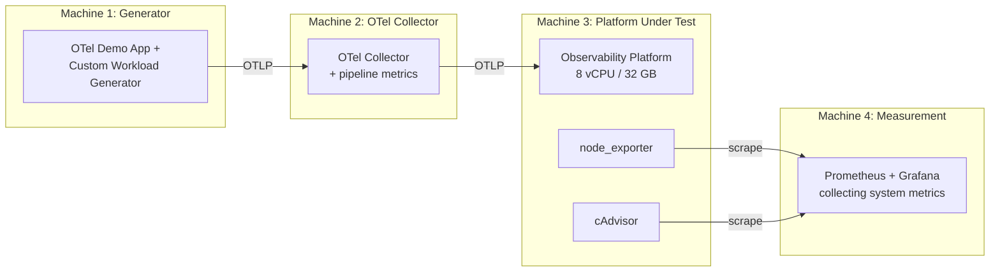

> Feature tables tell you what exists. Benchmarks tell you what works.

This is Part 2 of our open-source observability comparison. [Part 1](/posts/open-source-observability-platform-comparison/) evaluated documented capabilities across 12 platforms and 25 criteria. Here we deploy each platform on identical hardware and measure what documentation can't tell you.

**The rule:** Same hardware, same OTel Collector, same telemetry dataset, same retention config. No marketing. No trust. Just numbers.

---

## Table of Contents

- [Methodology](#methodology)
  - [Infrastructure](#infrastructure)
  - [Isolation Rules](#isolation-rules)
  - [Open-Source Benchmark Tools & Frameworks](#open-source-benchmark-tools--frameworks)
  - [Telemetry Generator](#telemetry-generator)
  - [Measurement Stack](#measurement-stack)
- [The 15 Benchmarks](#the-15-benchmarks)
  - [Benchmark 1 — Idle Footprint](#benchmark-1--idle-footprint)
  - [Benchmark 2 — Log Ingestion Throughput](#benchmark-2--log-ingestion-throughput)
  - [Benchmark 3 — Trace Ingestion](#benchmark-3--trace-ingestion)
  - [Benchmark 4 — Metrics Cardinality](#benchmark-4--metrics-cardinality)
  - [Benchmark 5 — Storage Efficiency](#benchmark-5--storage-efficiency)
  - [Benchmark 6 — Log Query Latency](#benchmark-6--log-query-latency)
  - [Benchmark 7 — Metrics Queries](#benchmark-7--metrics-queries)
  - [Benchmark 8 — Trace Queries](#benchmark-8--trace-queries)
  - [Benchmark 9 — Signal Correlation (Qualitative)](#benchmark-9--signal-correlation-qualitative)
  - [Benchmark 10 — Failure / Backpressure](#benchmark-10--failure--backpressure)
  - [Benchmark 11 — Retention / Deletion](#benchmark-11--retention--deletion)
  - [Benchmark 12 — TTFT (Time To First Telemetry)](#benchmark-12--ttft-time-to-first-telemetry)
  - [Benchmark 13 — Upgrade Challenge](#benchmark-13--upgrade-challenge)
  - [Benchmark 14 — Restart / Recovery](#benchmark-14--restart--recovery)
  - [Benchmark 15 — Noisy-Neighbor Query](#benchmark-15--noisy-neighbor-query)
- [Results](#results)
  - [Hero Table](#hero-table)
  - [Detailed Results per Benchmark](#detailed-results-per-benchmark)
- [Category Winners](#category-winners)
- [Scoring (25 Criteria)](#scoring-25-criteria)
- [Conclusion](#conclusion)
- [Reproducibility](#reproducibility)
- [References](#references)

---

## Methodology

### Infrastructure

**Phase 1 — Single-node (primary comparison):**

```text
CPU:        8 vCPU (dedicated, not burstable)
RAM:        32 GB
Disk:       500 GB NVMe
OS:         Ubuntu 24.04 LTS
Filesystem: ext4
Docker:     27.x (same version for all runs)
Kernel:     6.8.x
```

**Phase 2 — Scale test:**

```text
CPU:        16 vCPU
RAM:        64 GB
Disk:       1 TB NVMe
```

### Isolation Rules

1. **Never run platforms simultaneously** — CPU cache/IO contention invalidates results
2. **Clean VM per run** — clone base image → deploy → benchmark → destroy
3. **Generator on separate machine** — prevent workload CPU from being attributed to platform
4. **Independent measurement** — never use the product being benchmarked to measure itself



**Execution pattern:**

```bash
# For each platform:
terraform apply -var="platform=signoz"    # Provision clean VM
ansible-playbook deploy.yml               # Deploy platform
./run-benchmarks.sh                       # Execute all benchmarks
./collect-results.sh                      # Export measurements
terraform destroy                         # Clean slate for next
```

### Open-Source Benchmark Tools & Frameworks

Rather than reinventing synthetic load from scratch, our benchmarking harness builds upon established open-source tools, load generators, and sizing specifications:

| Category | Open-Source Tool / Library | Primary Role & Strength |
| :--- | :--- | :--- |
| **Telemetry & Load Generation** | **[telemetrygen](https://github.com/open-telemetry/opentelemetry-collector-contrib/tree/main/cmd/telemetrygen)** | Official OpenTelemetry CLI for generating high-rate synthetic OTLP logs, metrics, and traces over HTTP/gRPC. |
| | **[OpenTelemetry Astronomy Shop](https://github.com/open-telemetry/opentelemetry-demo)** | Multi-service enterprise demo simulating realistic trace waterfalls, span links, and cross-service error propagation. |
| | **[TSBS (Time Series Benchmark Suite)](https://github.com/timescale/tsbs)** | Standardized suite for benchmarking time-series databases across varied ingestion volumes and queries. |
| | **[flog](https://github.com/mingrammer/flog)** / **[logbench](https://github.com/openobserve/logbench)** | High-throughput fake log generators for RFC5424, Common Log Format, and arbitrary JSON schemas. |
| | **[k6](https://github.com/grafana/k6)** + **[xk6-distributed-tracing](https://github.com/grafana/xk6-distributed-tracing)** | Programmable HTTP/gRPC load testing tool with native distributed trace context propagation. |
| | **[ghz](https://github.com/bojand/ghz)** | High-performance gRPC benchmarking tool tailored for saturated OTLP/gRPC ingestion tests. |
| **Storage & Query Engines** | **[Rally (esrally / opensearch-benchmark)](https://github.com/elastic/rally)** | Macrobenchmarking framework with standardized logging and metrics tracks (e.g., `http_logs`, `metricbeat`). |
| | **[clickhouse-benchmark](https://clickhouse.com/docs/en/operations/utilities/clickhouse-benchmark)** | Built-in ClickHouse utility for executing concurrent analytical queries and measuring p50/p95/p99 query latencies. |
| | **[prombench](https://github.com/prometheus/prombench)** | Official automated Prometheus benchmarking harness designed to stress-test PromQL query engines at scale. |
| **Chaos & Resilience** | **[Chaos Mesh](https://github.com/chaos-mesh/chaos-mesh)** / **[Litmus](https://github.com/litmuschaos/litmus)** | Kubernetes-native chaos engineering platforms to automate process kills, CPU spikes, and node draining during ingestion. |
| | **[Toxiproxy](https://github.com/Shopify/toxiproxy)** | TCP proxy used to inject network latency, bandwidth limits, and connection drops between OTel Collector and platforms. |
| **Profiling & System Metrics** | **[cAdvisor](https://github.com/google/cadvisor)**, **[node_exporter](https://github.com/prometheus/node_exporter)**, **[pidstat](https://man7.org/linux/man-pages/man1/pidstat.1.html)** | Non-intrusive container and OS resource utilization collectors. |
| | **[py-spy](https://github.com/benfred/py-spy)** / **[pprof](https://github.com/google/pprof)** | Sampling profilers to pinpoint GC pauses, lock contention, and memory leaks during saturation runs. |

#### Official Sizing & Benchmarking Guides

- **[OpenTelemetry Collector Sizing Guide](https://github.com/open-telemetry/opentelemetry-collector/blob/main/docs/performance.md):** Official memory/CPU formulas for buffering, batching, and queueing under backpressure.
- **[VictoriaMetrics Benchmark Methodology](https://docs.victoriametrics.com/articles/):** Guidance on measuring TSDB write amplification and RAM per active time series.
- **[Elasticsearch / OpenSearch Sizing Principles](https://www.elastic.co/guide/en/elasticsearch/reference/current/tune-for-indexing-speed.html):** Recommended segment merge policies, refresh intervals, and bulk sizing for log ingestion.
- **[ClickHouse Observability Schemas Guide](https://clickhouse.com/blog/storing-log-data-in-clickhouse-fluent-bit-vector):** Optimal codecs (`ZSTD`, `DoubleDelta`), sorting keys, and partitioning schemes for telemetry tables.

### Telemetry Generator

**Primary workload:** [OpenTelemetry Astronomy Shop (Demo)](https://github.com/open-telemetry/opentelemetry-demo) — produces realistic logs, metrics, and traces across multiple microservices.

**Supplementary generators:**

- Custom log generator using `telemetrygen` and `flog` (structured JSON, configurable rate)
- Custom metrics generator using `tsbs` and `telemetrygen` (configurable cardinality, histogram support)
- Custom trace generator using `xk6-distributed-tracing` and `telemetrygen` (configurable depth, service count, error rate)

All generators use standard OTLP export — no vendor-specific integrations.

### Measurement Stack

System-level metrics captured externally:

| Metric | Source |
| :--- | :--- |
| CPU (per-process) | pidstat / cAdvisor |
| Memory (RSS, working set) | cAdvisor / docker stats |
| Disk I/O (read/write throughput, IOPS) | iostat / node_exporter |
| Network (RX/TX bytes) | node_exporter |
| Container restarts / OOMs | Docker events / cAdvisor |

Application-level metrics:

| Metric | Source |
| :--- | :--- |
| Records ingested/sec | OTel Collector pipeline metrics |
| Records dropped | OTel Collector exporter metrics |
| Backpressure events | OTel Collector queue metrics |
| Query latency | Custom query runner (p50/p95/p99) |

---

## The 15 Benchmarks

### Benchmark 1 — Idle Footprint

**Goal:** What does it cost to run with zero incoming telemetry?

**Procedure:** Deploy platform, wait for all services healthy, measure for 10 minutes with no data flowing.

**Result table:**

| Platform | Containers | Idle RAM | Idle CPU % | Initial Disk | Ready Time |
| :--- | ---: | ---: | ---: | ---: | ---: |
| SigNoz | | | | | |
| OpenObserve | | | | | |
| ClickStack | | | | | |
| OneUptime | | | | | |
| Uptrace | | | | | |
| Coroot | | | | | |
| Grafana LGTM | | | | | |
| Apache SkyWalking | | | | | |
| OpenSearch Observability | | | | | |
| VictoriaMetrics stack | | | | | |
| Highlight.io | | | | | |
| Elastic Observability | | | | | |

<!-- TODO: Fill after running benchmarks -->

---

### Benchmark 2 — Log Ingestion Throughput

**Workload:** Structured JSON logs via OTLP

```json
{
  "timestamp": "2026-08-20T10:00:00.123456Z",
  "service.name": "checkout-service",
  "severity": "INFO",
  "trace_id": "abc123def456789...",
  "span_id": "span789...",
  "attributes": {
    "http.method": "POST",
    "http.route": "/api/v1/checkout",
    "http.status_code": 200,
    "user_id": "usr_7f3a2b1c-...",
    "cart.items": 3,
    "region": "us-east-1"
  },
  "body": "Checkout completed successfully for order #12345"
}
```

**Ramp schedule (30 minutes each):**

| Rate | Duration | Total Records |
| ---: | :--- | ---: |
| 1,000 logs/sec | 30 min | ~1.8M |
| 10,000 logs/sec | 30 min | ~18M |
| 25,000 logs/sec | 30 min | ~45M |
| 50,000 logs/sec | 30 min | ~90M |

**Captured metrics per rate:**

- Actual records/sec ingested (sustained)
- Dropped/rejected records
- OTel Collector backpressure events
- Platform CPU / RAM / disk write / network
- Storage consumed after settling

**Result table:**

| Platform | 1k/s | 10k/s | 25k/s | 50k/s | Saturation point | CPU at 10k/s | RAM at 10k/s |
| :--- | :---: | :---: | :---: | :---: | ---: | ---: | ---: |
| SigNoz | | | | | | | |
| OpenObserve | | | | | | | |
| ClickStack | | | | | | | |
| ... | | | | | | | |

<!-- TODO: Fill after running benchmarks -->

---

### Benchmark 3 — Trace Ingestion

**Workload:**

- 1,000 root traces/sec
- 8 services in trace path
- ~10 spans per trace average = **10,000 spans/sec**
- Span types: HTTP, gRPC, PostgreSQL, Redis, Kafka
- Error rate: 5%
- Slow spans (>1s): 2%

**Metrics:**

- Sustained spans/sec ingested
- Missing/dropped spans (trace completeness check)
- Trace ID lookup latency under load
- Service map accuracy (all services visible?)
- CPU / RAM during ingestion

**Result table:**

| Platform | Spans/s sustained | Trace completeness | Lookup latency (p95) | Service map accurate | CPU | RAM |
| :--- | ---: | ---: | ---: | :---: | ---: | ---: |
| SigNoz | | | | | | |
| OpenObserve | | | | | | |
| ... | | | | | | |

<!-- TODO: Fill after running benchmarks -->

---

### Benchmark 4 — Metrics Cardinality

**Ramp active time series:**

| Phase | Active Series | Labels |
| :--- | ---: | :--- |
| Baseline | 100,000 | service, namespace, pod, container, region, method, status |
| Scale 1 | 500,000 | + http.route |
| Scale 2 | 1,000,000 | + customer_id (bounded) |
| Scale 3 | 2,000,000 | higher churn |
| Pathological | 5,000,000+ | + user_id = random UUID (cardinality explosion) |

**Metrics per phase:**

- Ingest CPU / memory
- Disk growth rate
- Simple query latency (`rate(metric[5m])`)
- Compaction CPU
- OOM events / restarts

**Key question:** How gracefully does each platform degrade under cardinality explosion? Hard crash vs slow degradation vs explicit rejection.

---

### Benchmark 5 — Storage Efficiency

**Procedure:** Ingest identical telemetry across all platforms, wait for compaction to settle, measure stored bytes.

**Target ingestion:**

- Logs: ~100 GB raw (calculated from record size × count)
- Traces: ~50 GB raw
- Metrics: ~X million datapoints at Y cardinality

**Formula:**

```text
compression_ratio = raw_input_bytes / stored_bytes_after_compaction
```

**Result table:**

| Platform | Raw Input | Stored | Compression Ratio | Time to compact |
| :--- | ---: | ---: | ---: | ---: |
| SigNoz | 150 GB | | | |
| OpenObserve | 150 GB | | | |
| ... | | | | |

<!-- TODO: Fill after running benchmarks -->

---

### Benchmark 6 — Log Query Latency

**Fixed query suite (easy → brutal):**

| ID | Query | Complexity |
| :--- | :--- | :--- |
| Q1 | `service=checkout`, last 15 min, limit 100 | Simple recent filter |
| Q2 | Full-text `"connection refused"`, last 24h | Text search |
| Q3 | `service=checkout AND status>=500`, last 24h | Structured filter |
| Q4 | Count errors group by service, last 24h | Aggregation |
| Q5 | `user_id=<specific-uuid>`, last 7 days | High-cardinality lookup |
| Q6 | Rare token (1 in 10M logs), full retention | Needle in haystack |

**Report p50, p95, p99 latency** — run each query 20 times, discard first 2 (cold cache).

**Result table:**

| Platform | Q1 p95 | Q2 p95 | Q3 p95 | Q4 p95 | Q5 p95 | Q6 p95 |
| :--- | ---: | ---: | ---: | ---: | ---: | ---: |
| SigNoz | | | | | | |
| OpenObserve | | | | | | |
| ... | | | | | | |

<!-- TODO: Fill after running benchmarks -->

---

### Benchmark 7 — Metrics Queries

**Query suite (PromQL or equivalent):**

| ID | Query | Range |
| :--- | :--- | :--- |
| M1 | `rate(http_requests_total[5m])` | 15 min |
| M2 | `sum by (service)(rate(http_requests_total{status=~"5.."}[5m]))` | 6h |
| M3 | `histogram_quantile(0.99, sum by (le,service)(rate(http_request_duration_seconds_bucket[5m])))` | 24h |
| M4 | M3 repeated | 7 days |
| M5 | M3 repeated | 30 days |

**Report:** p50/p95/p99 latency, CPU during query, memory spike during query.

---

### Benchmark 8 — Trace Queries

| ID | Query | Type |
| :--- | :--- | :--- |
| T1 | Lookup by known trace ID | Point lookup |
| T2 | `service=checkout AND duration>2s` | Filter by latency |
| T3 | `service=checkout AND error=true AND db.system=postgresql` | Multi-attribute filter |
| T4 | Find slow traces without knowing trace ID | Real APM discovery |

**Report:** Latency, result completeness, waterfall render time (for UI-based queries).

---

### Benchmark 9 — Signal Correlation (Qualitative)

**The most valuable benchmark in this article.**

**Setup:** Inject a known failure — 3-second PostgreSQL query in payment-service causing:

```text
Frontend → checkout-service → payment-service → PostgreSQL (3s delay)
```

This produces:
- Latency metric spike on payment-service
- Slow distributed trace (3+ seconds)
- Slow DB span in trace waterfall
- Application error/warning log from checkout-service (timeout)

**Test scenarios:**

| Scenario | Start from | Goal | Measure |
| :--- | :--- | :--- | :--- |
| **A** | Metric alert / dashboard spike | Find the slow SQL query | Clicks, time, queries needed |
| **B** | Error log in log viewer | Find the distributed trace | Clicks, time, context preserved |
| **C** | Slow trace in trace explorer | Find related application logs | Clicks, time, filtering UX |

**Captured:**

- Time-to-root-cause (stopwatch)
- Number of UI interactions (clicks, page navigations)
- Manual queries required (typed vs click-through)
- Context lost during navigation (did you lose the time window? service filter?)

**Scoring:** 1-5 scale per scenario, with notes on friction points.

---

### Benchmark 10 — Failure / Backpressure

**Procedure:** Kill the backend for 5 minutes while telemetry generator continues at 10k logs/sec + 1k traces/sec.

**Measure:**

| Metric | What we're checking |
| :--- | :--- |
| Telemetry lost | Records that never appear after recovery |
| Recovery duration | Time from backend-up to caught-up |
| Collector memory | Growth during outage (OOM risk?) |
| Duplicate data | Does replay cause duplicates? |
| Ingest spike | Backend overwhelmed by catchup? |
| UI timeline gaps | Visible gaps in dashboards/explorer? |

---

### Benchmark 11 — Retention / Deletion

**Config:** Logs = 7 days, Metrics = 30 days, Traces = 3 days.

**Verify:**

- Data deleted automatically (no manual intervention)
- Disk space actually reclaimed (not just marked)
- CPU spikes during deletion/compaction
- Different retention per signal supported
- Query behavior at retention boundary (graceful error vs hang)

---

### Benchmark 12 — TTFT (Time To First Telemetry)

**Scenario:** Fresh Ubuntu VM, engineer follows official docs.

**Timer starts at:** `git clone` or `helm repo add`

**Timer stops when:**

- [ ] Logs visible in UI
- [ ] Metrics visible in UI
- [ ] Traces visible in UI
- [ ] Log → trace navigation works (click trace_id in log, see trace)

**Captured:**

| Metric | What |
| :--- | :--- |
| Total time | Minutes from start to all-signals-working |
| Commands executed | Shell history line count |
| YAML/config LOC | Lines of configuration written |
| Containers/pods | Runtime footprint |
| Documentation errors | Steps that didn't work as documented |
| Manual fixes | Workarounds needed beyond docs |

**Result table:**

| Platform | TTFT (min) | Commands | Config LOC | Containers | Doc errors | Fixes needed |
| :--- | ---: | ---: | ---: | ---: | ---: | ---: |
| SigNoz | | | | | | |
| OpenObserve | | | | | | |
| ... | | | | | | |

<!-- TODO: Fill after running benchmarks -->

---

### Benchmark 13 — Upgrade Challenge

**Procedure:**

1. Deploy version N-1
2. Ingest 24 hours of telemetry
3. Upgrade to current version (following official upgrade docs)

**Measure:**

| Metric | What |
| :--- | :--- |
| Upgrade duration | Time from start to fully operational |
| Downtime | Period where ingestion or queries don't work |
| Manual steps | Beyond `helm upgrade` or `docker compose pull` |
| Data loss | Any telemetry missing post-upgrade? |
| Config changes | Breaking config format changes? |
| Rollback success | Can you go back if upgrade fails? |

---

### Benchmark 14 — Restart / Recovery

**Procedure:** With 7 days of stored telemetry, `kill -9` the main backend process (or `kubectl delete pod --force`).

**Measure:**

| Metric | What |
| :--- | :--- |
| Restart time | Seconds until process healthy |
| Ingestion resume | Seconds until new data accepted |
| Query resume | Seconds until queries return results |
| Corruption | Any data corruption / recovery process needed? |
| CPU spike | Startup CPU usage vs steady-state |

---

### Benchmark 15 — Noisy-Neighbor Query

**Procedure:** Run continuous ingestion (10k logs/sec, 1k traces/sec) while simultaneously executing a massive analytical query:

```text
Last 30 days, count logs group by service, http.route, status
```

**Measure:**

| Metric | Impact |
| :--- | :--- |
| Ingestion latency | Does it increase during heavy query? |
| Data dropped | Any records lost during query? |
| Dashboard latency | Do simple dashboard queries slow down? |
| CPU saturation | Does the system max out? |
| Memory spike | Dangerous memory growth? |
| Query isolation | Does the platform have workload separation? |

---

## Results

### Hero Table

<!-- TODO: Fill after all benchmarks complete -->

| Platform | TTFT | Idle RAM | Max Logs/s | Max Spans/s | 150GB→stored | Log Q5 p95 | Trace T1 | Correlation | Ops Score | OSS Score | **Total** |
| :--- | ---: | ---: | ---: | ---: | ---: | ---: | ---: | ---: | ---: | ---: | ---: |
| SigNoz | | | | | | | | | | | |
| OpenObserve | | | | | | | | | | | |
| ClickStack | | | | | | | | | | | |
| OneUptime | | | | | | | | | | | |
| Uptrace | | | | | | | | | | | |
| Coroot | | | | | | | | | | | |
| Grafana LGTM | | | | | | | | | | | |
| Apache SkyWalking | | | | | | | | | | | |
| OpenSearch Observability | | | | | | | | | | | |
| VictoriaMetrics stack | | | | | | | | | | | |
| Highlight.io | | | | | | | | | | | |
| Elastic Observability | | | | | | | | | | | |

### Detailed Results per Benchmark

<!-- TODO: Link to or embed detailed results per benchmark -->

---

## Category Winners

<!-- TODO: Fill after benchmarks -->

| Category | Winner | Runner-up | Notes |
| :--- | :--- | :--- | :--- |
| **Best overall OSS observability** | | | |
| **Best for OpenTelemetry** | | | |
| **Best for logs at scale** | | | |
| **Best storage efficiency** | | | |
| **Best query performance** | | | |
| **Best for Kubernetes** | | | |
| **Best zero-code/eBPF** | | | |
| **Best APM experience** | | | |
| **Best signal correlation** | | | |
| **Lowest operational overhead** | | | |
| **Lowest hardware requirements** | | | |
| **Best for Prometheus/Grafana users** | | | |
| **Best reliability platform** | | | |

---

## Scoring (25 Criteria)

Weighted scores from [Part 1's criteria framework](/posts/open-source-observability-platform-comparison/#the-25-scored-criteria), populated with both documentation-based and benchmark-based evidence.

<!-- TODO: Fill with weighted scores after benchmarks -->

| # | Criterion | Weight | SigNoz | OpenObserve | ClickStack | OneUptime | Uptrace | Coroot | Grafana | SkyWalking | OpenSearch | Victoria | Highlight | Elastic |
| ---: | :--- | ---: | ---: | ---: | ---: | ---: | ---: | ---: | ---: | ---: | ---: | ---: | ---: | ---: |
| 1 | Free completeness | **7%** | | | | | | | | | | | | |
| 2 | License friendliness | 4% | | | | | | | | | | | | |
| 3 | Logs | **5%** | | | | | | | | | | | | |
| 4 | Metrics | **5%** | | | | | | | | | | | | |
| 5 | Traces | **5%** | | | | | | | | | | | | |
| 6 | OTel native | **5%** | | | | | | | | | | | | |
| 7 | Prometheus compat | 3% | | | | | | | | | | | | |
| 8 | Signal correlation | 4% | | | | | | | | | | | | |
| 9 | APM | 4% | | | | | | | | | | | | |
| 10 | K8s monitoring | 4% | | | | | | | | | | | | |
| 11 | Infra monitoring | 3% | | | | | | | | | | | | |
| 12 | eBPF | 3% | | | | | | | | | | | | |
| 13 | Profiling | 2% | | | | | | | | | | | | |
| 14 | Dashboards/UX | 4% | | | | | | | | | | | | |
| 15 | Alerting/SLO | 4% | | | | | | | | | | | | |
| 16 | Query UX | 4% | | | | | | | | | | | | |
| 17 | Install complexity | 3% | | | | | | | | | | | | |
| 18 | Ops complexity | 4% | | | | | | | | | | | | |
| 19 | Ingestion throughput | **5%** | | | | | | | | | | | | |
| 20 | Query performance | **5%** | | | | | | | | | | | | |
| 21 | Storage efficiency | **5%** | | | | | | | | | | | | |
| 22 | CPU efficiency | 3% | | | | | | | | | | | | |
| 23 | Memory efficiency | 3% | | | | | | | | | | | | |
| 24 | High-cardinality | 3% | | | | | | | | | | | | |
| 25 | HA/scalability | 3% | | | | | | | | | | | | |
| | **Weighted Total** | **100%** | | | | | | | | | | | | |

---

## Conclusion

<!-- TODO: Write after all benchmarks complete -->

---

## Reproducibility

All benchmark code, configurations, and raw results are available:

- **Repository:** [github.com/sagarnikam123/observability-benchmark](https://github.com/sagarnikam123/observability-benchmark) <!-- TODO: Create repo -->
- **Docker Compose files:** One per platform, pinned versions
- **OTel Collector config:** Single shared configuration
- **Generator scripts:** Configurable rate, duration, cardinality
- **Query suites:** Exact queries used for each benchmark
- **Result CSVs:** Raw measurements for independent analysis
- **Terraform/Ansible:** Infrastructure provisioning for reproducible environments

To reproduce:

```bash
git clone https://github.com/sagarnikam123/observability-benchmark
cd observability-benchmark
make benchmark PLATFORM=signoz    # Deploy + benchmark + collect
make benchmark PLATFORM=openobserve
# ... repeat for each platform
make report                       # Generate comparison tables
```

---

## References

### Observability Platforms
- [SigNoz Documentation](https://signoz.io/docs/)
- [OpenObserve Documentation](https://openobserve.ai/docs/)
- [ClickStack Documentation](https://clickhouse.com/docs/use-cases/observability/clickstack)
- [OneUptime Documentation](https://oneuptime.com/docs)
- [Uptrace Documentation](https://uptrace.dev/get/overview.html)
- [Coroot Documentation](https://docs.coroot.com/)
- [Grafana LGTM Stack](https://grafana.com/oss/)
- [Apache SkyWalking Documentation](https://skywalking.apache.org/docs/)
- [OpenSearch Observability](https://docs.opensearch.org/latest/observing-your-data/)
- [VictoriaMetrics Documentation](https://docs.victoriametrics.com/)
- [VictoriaLogs](https://docs.victoriametrics.com/victorialogs/)
- [VictoriaTraces](https://docs.victoriametrics.com/victoriatraces/)
- [Highlight.io Documentation](https://www.highlight.io/docs)
- [Elastic Observability Documentation](https://www.elastic.co/docs/current/observability)

### Benchmarking Tools & Generators
- [OpenTelemetry Demo (Astronomy Shop)](https://github.com/open-telemetry/opentelemetry-demo)
- [OpenTelemetry telemetrygen CLI](https://github.com/open-telemetry/opentelemetry-collector-contrib/tree/main/cmd/telemetrygen)
- [Time Series Benchmark Suite (TSBS)](https://github.com/timescale/tsbs)
- [Elastic Rally (esrally)](https://github.com/elastic/rally)
- [OpenSearch Benchmark](https://github.com/opensearch-project/opensearch-benchmark)
- [ClickHouse Benchmark Utility](https://clickhouse.com/docs/en/operations/utilities/clickhouse-benchmark)
- [Prometheus Prombench](https://github.com/prometheus/prombench)
- [flog Log Generator](https://github.com/mingrammer/flog)
- [xk6-distributed-tracing](https://github.com/grafana/xk6-distributed-tracing)
- [Chaos Mesh](https://chaos-mesh.org/)
- [Shopify Toxiproxy](https://github.com/Shopify/toxiproxy)
- [OpenTelemetry Collector Performance Guide](https://github.com/open-telemetry/opentelemetry-collector/blob/main/docs/performance.md)

---

*Benchmarks run: <!-- TODO: Date -->. Platform versions: <!-- TODO: List versions -->. Hardware: 8 vCPU / 32 GB RAM / 500 GB NVMe / Ubuntu 24.04.*
