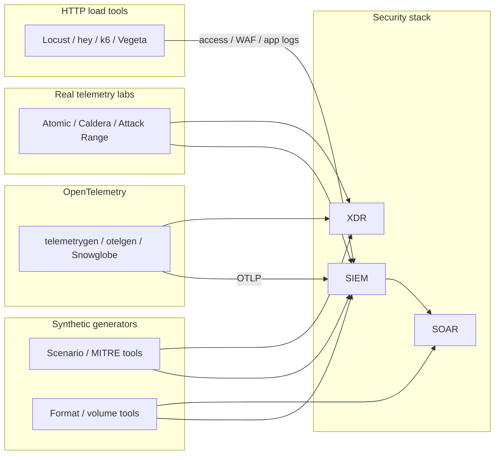

Testing a SIEM, XDR, or SOAR stack without production traffic means you need **synthetic security telemetry**: auth failures, firewall denies, EDR process events, cloud audit trails, OTLP streams, and multi-stage attack stories that parsers and playbooks can actually consume.

This catalog lists **open-source** generators and related tools found via public GitHub / project sites. Related sections cover HTTP load tools, Faker/SDV libraries, and attack emulation — useful companions, not always “fake log printers.” For general (non-security) fake logs aimed at Loki/ELK pipeline soak tests, see [Generate Fake Logs for Testing Log Aggregation Platforms]().

### TL;DR — Quick picks

| Need | Start here | Why |
| ---- | ---------- | --- |
| **Correlated multi-source hunt scenarios** | [EvidenceForge](https://github.com/Cisco-Talos/EvidenceForge) | One storyline → Windows, Sysmon, Zeek, eCAR, syslog, IDS, web/proxy |
| **MITRE / kill-chain synthetic logs** | [summved/log-generator](https://github.com/summved/log-generator), [loggen](https://github.com/sheru-pan/loggen), [SplunkForge](https://github.com/marez8505/SplunkForge) | ATT&CK-mapped events and attack chains |
| **CEF / LEEF / syslog wire formats** | [Rosetta](https://github.com/ayman-m/rosetta), [log-simulators](https://github.com/expanso-io/log-simulators) | Formats traditional SIEMs expect |
| **High-volume pipeline soak** | [log-simulators](https://github.com/expanso-io/log-simulators), [flog](https://github.com/mingrammer/flog), [fuzzy-train](https://github.com/sagarnikam123/fuzzy-train) | Rate, backfill, stdout/TCP/UDP |
| **OTLP logs / metrics / traces** | [telemetrygen](https://github.com/open-telemetry/opentelemetry-collector-contrib/blob/main/cmd/telemetrygen/README.md), [otelgen](https://github.com/krzko/otelgen), [snowglobe](https://github.com/ImmersiveFusion/snowglobe) | Synthetic OpenTelemetry into collectors |
| **Real host/network telemetry** | [Atomic Red Team](https://github.com/redcanaryco/atomic-red-team), [Attack Range](https://github.com/splunk/attack_range), [Caldera](https://github.com/mitre/caldera) | Execute TTPs in a lab; collectors see real events |

> Use synthetic generators for **safe, repeatable** parser/rule/playbook tests. Use attack emulation when you need **ground-truth host/network telemetry**. Never point either at production without approval.



## How to choose a generator

| Criterion | What to check |
| --------- | ------------- |
| **Purpose** | Detection content, SOC training, parser/CEF normalization, OTLP soak, or ingest performance? |
| **Correlation** | Same user/host/PID across Windows + network + proxy, or independent noise? |
| **Formats** | JSON, syslog RFC3164/5424, CEF, LEEF, Windows XML/EVTX, ECS, OTLP, vendor syslog |
| **Delivery** | File only vs TCP/UDP/HTTP/syslog/OTLP to a collector |
| **License** | Apache/MIT vs education-only / AGPL / Business Source |
| **Risk** | Synthetic text is low risk; Atomic/Caldera/Attack Range need isolated labs |

## 1. Security scenario & MITRE-oriented generators

Tools that invent **attack-shaped** events (often ATT&CK-mapped) for detection engineering and SOC training.

| Tool | Link | What it does / features |
| ---- | ---- | ----------------------- |
| **EvidenceForge** (Cisco Talos) | [github.com/Cisco-Talos/EvidenceForge](https://github.com/Cisco-Talos/EvidenceForge) | YAML scenarios → **correlated** multi-format set: Windows Security (~30 Event IDs), Sysmon, 13 Zeek types, **eCAR EDR/XDR**, syslog, bash history, Snort, web, proxy, ASA. Deterministic seeds; targets for default / SOF-ELK / Splunk layouts. Community forks exist (e.g. [kraven-security/EvidenceForge](https://github.com/kraven-security/EvidenceForge)) — prefer upstream. |
| **Enterprise SIEM Log Generator** | [github.com/summved/log-generator](https://github.com/summved/log-generator) | Node.js generator with **MITRE ATT&CK**, D3FEND-oriented defensive activity, attack chains (e.g. ransomware / insider), JSON / syslog / CEF, HTTP/syslog shipping toward Splunk, ELK, Wazuh, QRadar-style sinks. |
| **Loggen (loggen-cli)** | [github.com/sheru-pan/loggen](https://github.com/sheru-pan/loggen) · [PyPI](https://pypi.org/project/loggen-cli/) · [Docker](https://hub.docker.com/r/sheru/loggen) | CLI for SOC training: `auth`, `firewall`, `ids`, `web`, `system`, plus `loggen mitre T1110.001`-style technique mapping. |
| **SplunkForge** | [github.com/marez8505/SplunkForge](https://github.com/marez8505/SplunkForge) | Multi-stage attack datasets (brute force, phishing, ransomware, exfil, insider) across WinEventLog, Sysmon, firewall, proxy, DNS; ships **30+ SPL** rules and ATT&CK coverage matrix. |
| **Event-Horizon** | [github.com/PrototypePrime/Event_Horizon](https://github.com/PrototypePrime/Event_Horizon) | High-volume security log generator claiming **75+** vendor/product styles (firewalls, Windows, AWS, EDR names, etc.) for rule/dashboard/SOC training. License: free for personal/educational use; commercial use restricted. |
| **LogKitchen** | [github.com/markjuk72/LogKitchen](https://github.com/markjuk72/LogKitchen) | Python CLI/TUI/web UI: Linux syslog, auditd, **CEF firewall** (Palo Alto / Cisco / Fortinet / Check Point / pfSense flavors), Windows Security Event IDs, POS security logs; seedable output; ADX/Kustainer demo path. |
| **siem-log-simulator** | [github.com/johnnypax/siem-log-simulator](https://github.com/johnnypax/siem-log-simulator) | REST API (`/api/v1`) for ssh, firewall, web, app, dns, vpn, endpoint, ids profiles; renderers for syslog, ECS JSON, CEF, nginx; scenarios (brute force, port scan, outages); scheduler + rotating files for Elastic/Filebeat labs. |
| **LogForge** (Fulcrum) | [github.com/Fulcrum-Technology-Solutions/LogForge](https://github.com/Fulcrum-Technology-Solutions/LogForge) | Template-driven synthetic events with FastAPI + CLI; outputs to file, console, HTTP, TCP, syslog; entity registry and metrics for pipeline/detection labs. |
| **Wazuh Log Generator** | [github.com/JimmyZghendy/wazuh-log-generator](https://github.com/JimmyZghendy/wazuh-log-generator) | Sample AD XML, MSSQL/MySQL, Palo Alto CSV, Apache access, Linux auth logs with **embedded attack patterns** meant to trip default Wazuh rules (including frequency/correlation). |

## 2. SIEM wire formats & high-volume pipelines

Generators focused on **formats, transport, and soak volume** that collectors and SIEMs parse.

| Tool | Link | What it does / features |
| ---- | ---- | ----------------------- |
| **Rosetta** | [github.com/ayman-m/rosetta](https://github.com/ayman-m/rosetta) | Python library: generate Syslog, **CEF**, **LEEF**, JSON, Windows Event XML; invent observables (IPs, URLs, hashes, CVEs, ATT&CK IDs); convert formats; **send** over TCP/UDP/HTTP(S); incident bundles for multi-event stories. |
| **Expanso log-simulators** | [github.com/expanso-io/log-simulators](https://github.com/expanso-io/log-simulators) | `uv`-runnable suite: web, syslog, Windows XML, Cisco ASA, **CEF/LEEF**, JSON app (+PII demos), CloudTrail/VPC Flow, Kubernetes CRI, PostgreSQL, IoT, etc. Shared CLI: `--rate`, `--backfill`, `--scenario`, TCP/UDP output. Anomaly scenarios (`auth-burst`, `port-scan`, `malware-burst`, `crash-loop`, …). |
| **LogSalvo** | [github.com/willcurtis/logsalvo](https://github.com/willcurtis/logsalvo) | Syslog traffic studio (CLI + GUI): RFC3164/5424 generation and **receive/parse**; UDP/TCP/TLS; CEF / Cisco / UniFi-aware inspection; rate/count/duration controls. |
| **flog** | [github.com/mingrammer/flog](https://github.com/mingrammer/flog) | Lightweight fake logs: Apache common/combined/error, RFC3164/5424, JSON. Great for volume and format smoke tests; not ATT&CK-aware. |
| **fuzzy-train** | [github.com/sagarnikam123/fuzzy-train](https://github.com/sagarnikam123/fuzzy-train) · [Docker Hub](https://hub.docker.com/r/sagarnikam123/fuzzy-train) | Multi-format fake logs (JSON, logfmt, Apache, RFC3164/5424); rate, stdout/file, Docker/K8s. Best for collector soak; pair with §1 when you need threat content. |
| **nflow-generator** | [github.com/nerdalert/nflow-generator](https://github.com/nerdalert/nflow-generator) | Mock **NetFlow v5** datagrams to a collector (HTTP/SSH/DNS-style flows, optional protocol spikes). Complements logs for flow-enabled SIEMs/NDR. |

## 3. Platform-specific: Splunk, SOAR, Elastic-oriented

| Tool | Link | What it does / features |
| ---- | ---- | ----------------------- |
| **Splunk Eventgen** | [github.com/splunk/eventgen](https://github.com/splunk/eventgen) · [docs](https://splunk.github.io/eventgen/) | Official-style sample **replay** and tokenized/Jinja generation into Splunk (modinput, HEC, file, syslog, TCP/UDP). Ideal when you have real sample logs to mutate continuously. |
| **Splunk SOAR Generator connector** | [github.com/splunk-soar-connectors/generator](https://github.com/splunk-soar-connectors/generator) | SOAR app that **polls** semi-random CEF-ish artifacts from template files so you can exercise playbooks without a live SIEM feed. |
| **EVTX-ATTACK-SAMPLES** | [github.com/sbousseaden/EVTX-ATTACK-SAMPLES](https://github.com/sbousseaden/EVTX-ATTACK-SAMPLES) | ~200 Windows **EVTX** attack samples (static corpus) plus Winlogbeat bulk-replay script — replay into ELK/SIEM for detection unit tests. |

## 4. OpenTelemetry / synthetic observability telemetry

These tools speak **OTLP** (gRPC `:4317` / HTTP `:4318`) rather than classic CEF/syslog. Use them when your SIEM, XDR, or security analytics stack ingests OpenTelemetry (or when validating collectors that feed security backends).

| Tool | Link | What it does / features |
| ---- | ---- | ----------------------- |
| **telemetrygen** (OTel Contrib) | [README](https://github.com/open-telemetry/opentelemetry-collector-contrib/blob/main/cmd/telemetrygen/README.md) · [cmd/telemetrygen](https://github.com/open-telemetry/opentelemetry-collector-contrib/tree/main/cmd/telemetrygen) | Official Collectors Contrib utility (alpha): simulate clients emitting **traces, metrics, and logs** over OTLP. Install via `go install …/cmd/telemetrygen@latest` or Docker. Flags for duration/`inf`, rate, count, batching, `--otlp-attributes` (resource) vs `--telemetry-attributes` (per signal). Typical smoke: `telemetrygen traces\|logs\|metrics --otlp-insecure --duration 5s`. |
| **otelgen** | [github.com/krzko/otelgen](https://github.com/krzko/otelgen) | CLI synthetic **logs, metrics, and traces** over OTLP gRPC/HTTP. Trace scenarios (single/multi), span events/links; metrics (sum, gauge, histogram, exponential histogram, exemplars); logs with levels, attributes, and trace-context correlation. Rate/duration/headers; brew, binary, or Docker. Apache-2.0. |
| **Honeycomb loadgen** | [github.com/honeycombio/loadgen](https://github.com/honeycombio/loadgen) | Trace-focused load generator: configurable spans/trace, depth, fields, traces/sec, ramp up/down, quantity or duration. Emits **OTLP or Honeycomb** protocol to agents/backends. |
| **test-telemetry-generator** (Cisco Open) | [github.com/cisco-open/test-telemetry-generator](https://github.com/cisco-open/test-telemetry-generator) | YAML-driven OTel generator (no real infra monitored). Define resources/traces/targets in YAML; fat JAR or Docker; OTLP HTTP export. Apache-2.0. |
| **Snowglobe** | [github.com/ImmersiveFusion/snowglobe](https://github.com/ImmersiveFusion/snowglobe) | Single-binary OTLP generator for **logs + traces + metrics** from a realistic **~28-service** topology: chaos injection, saga compensation, timeout cascades, and **GenAI semantic-convention** agent spans. |
| **OpenTelemetry Demo** (Astronomy Shop) | [github.com/open-telemetry/opentelemetry-demo](https://github.com/open-telemetry/opentelemetry-demo) | Official multi-language microservice demo that emits **real** instrumented telemetry (not a fake-packet CLI). Best for authentic distributed traces/logs/metrics. |
| **otel-loadgen** (similar) | [github.com/streamfold/otel-loadgen](https://github.com/streamfold/otel-loadgen) | High-throughput OTLP load tool with workers, batching, stats, optional sink/control servers for distributed load tests. |
| **spanforge** (similar) | [github.com/robmcelhinney/spanforge](https://github.com/robmcelhinney/spanforge) | Realistic synthetic distributed traces → OTLP HTTP/gRPC, Zipkin JSON, JSONL; profiles, error/retry patterns, latency percentiles. |

**When OTel helps security stacks:** validate OTLP receivers before SIEM/XDR wiring; correlate log↔trace on `trace_id`; soak cardinality with loadgen tools; prefer Snowglobe or the OTel Demo for topology-shaped failures; prefer telemetrygen/otelgen for quick collector smoke tests.

## 5. HTTP / API load tools (traffic → real access & app logs)

These tools do **not** print fake SIEM events. They generate **client traffic** against a lab web app, API, reverse proxy, or WAF so the **server side** writes access/app/WAF logs your SIEM can ingest.

| Tool | Link | What it does / features |
| ---- | ---- | ----------------------- |
| **Locust** | [github.com/locustio/locust](https://github.com/locustio/locust) · [docs](https://docs.locust.io/) | Python load tests as code (`HttpUser`, `@task`); distributed workers; web UI or headless CI. Best for **realistic user flows** that leave coherent access/app logs. MIT. |
| **hey** | [github.com/rakyll/hey](https://github.com/rakyll/hey) | Tiny Go CLI (ApacheBench-style): `-n`, `-c`, `-z`, `-q`, custom method/headers/body, HTTP/2. Fast one-shot floods. Apache-2.0. |
| **k6** (Grafana) | [github.com/grafana/k6](https://github.com/grafana/k6) · [k6.io](https://k6.io/) | JS scripts on a Go runtime; HTTP/WebSocket/gRPC/browser; thresholds & scenarios. AGPL-3.0 (check license for your org). |
| **Vegeta** | [github.com/tsenart/vegeta](https://github.com/tsenart/vegeta) | Go HTTP load tool/library focused on **constant request rate**, UNIX-pipe composability. MIT. |
| **oha** | [github.com/hatoo/oha](https://github.com/hatoo/oha) | Rust CLI inspired by hey/ab with a live TUI. |
| **wrk** | [github.com/wg/wrk](https://github.com/wg/wrk) | High-throughput C HTTP benchmarker with optional **Lua** scripting. |
| **Apache JMeter** | [github.com/apache/jmeter](https://github.com/apache/jmeter) · [jmeter.apache.org](https://jmeter.apache.org/) | Multi-protocol load platform; GUI + CLI. Apache-2.0. |
| **Artillery** | [github.com/artilleryio/artillery](https://github.com/artilleryio/artillery) · [artillery.io](https://www.artillery.io/) | Node.js load testing with YAML/JS scenarios. |

> Point these only at disposable lab hosts. Load tools can look like DoS or credential stuffing to upstream WAF/SOC.

## 6. Real attack emulation (produces real logs)

These are **not** fake-log printers. They run techniques in a lab so EDR/SIEM agents emit **authentic** telemetry.

| Tool | Link | What it does / features |
| ---- | ---- | ----------------------- |
| **Atomic Red Team** | [github.com/redcanaryco/atomic-red-team](https://github.com/redcanaryco/atomic-red-team) | Portable ATT&CK technique tests; pair with [Invoke-AtomicRedTeam](https://github.com/redcanaryco/invoke-atomicredteam). |
| **MITRE Caldera** | [github.com/mitre/caldera](https://github.com/mitre/caldera) | Adversary emulation platform; agents execute abilities; SIEM/XDR see real host activity. |
| **Splunk Attack Range** | [github.com/splunk/attack_range](https://github.com/splunk/attack_range) · [docs](https://attack-range.readthedocs.io/) | Terraform/Ansible labs (AWS/Azure/GCP/local) with Splunk + optional Atomic/Caldera simulation. |
| **DetectionLab** | [github.com/clong/DetectionLab](https://github.com/clong/DetectionLab) | Classic defender lab (WEF, Sysmon, Splunk, osquery, …). Check maintenance status before new builds. |

## 7. General-purpose fake & synthetic data libraries

Most of these are **not** SIEM log emitters. They invent people, IPs, JSON documents, or statistical table rows. Typical pattern: generate fields → assemble CEF/syslog/JSON → ship to a collector. Prefer §1–§2 for ready-made security formats.

### 7.1 Rule-based Faker libraries (by language)

| Tool | Link | What it does / features |
| ---- | ---- | ----------------------- |
| **Faker** (Python) | [github.com/joke2k/faker](https://github.com/joke2k/faker) | Classic Python fake-data package: names, addresses, IPs, locales, providers, seeding. |
| **@faker-js/faker** | [github.com/faker-js/faker](https://github.com/faker-js/faker) · [fakerjs.dev](https://fakerjs.dev/) | Official JS/TS Faker: person/location/finance/internet modules, 70+ locales, `faker.seed()`. |
| **DataFaker** | [github.com/datafaker-net/datafaker](https://github.com/datafaker-net/datafaker) · [datafaker.net](https://www.datafaker.net/) | JVM fake data (Java/Kotlin/Groovy); transformers for CSV/JSON/SQL/XML/YAML. |
| **gofakeit** | [github.com/brianvoe/gofakeit](https://github.com/brianvoe/gofakeit) | Go fake-data library + CLI: structs, JSON, providers, seeding. |
| **Bogus** | [github.com/bchavez/Bogus](https://github.com/bchavez/Bogus) | .NET (C#/F#/VB) Faker port — fluent rules, locales, seeding. |
| **Mimesis** (similar) | [github.com/lk-geimfari/mimesis](https://github.com/lk-geimfari/mimesis) | Fast Python alternative to Faker: typed providers, schemas, relational refs. |

### 7.2 Schema, UI, and API fake-data tools

| Tool | Link | What it does / features |
| ---- | ---- | ----------------------- |
| **json-schema-faker** | [github.com/json-schema-faker/json-schema-faker](https://github.com/json-schema-faker/json-schema-faker) | Generate JSON from **JSON Schema** (+ Faker hooks) — useful for ECS/OCSF-like fixtures. |
| **generatedata** | [github.com/benkeen/generatedata](https://github.com/benkeen/generatedata) · [generatedata.com](https://generatedata.com/) | Extensible random test-data engine/UI; export CSV/SQL/JSON. GPL-3. |
| **Fake Store API** | [github.com/keikaavousi/fake-store-api](https://github.com/keikaavousi/fake-store-api) · [fakestoreapi.com](https://fakestoreapi.com/) | Fake e-commerce REST API — pair with §5 load tools for shopping-like access logs. |

### 7.3 ML / statistical synthetic data & domain tools

| Tool | Link | What it does / features |
| ---- | ---- | ----------------------- |
| **SDV** | [github.com/sdv-dev/SDV](https://github.com/sdv-dev/SDV) · [sdv.dev](https://sdv.dev/) | Tabular synthesizers (GaussianCopula, CTGAN wrappers, multi-table, sequential), quality reports. Business Source License — review before commercial use. |
| **Copulas** | [github.com/sdv-dev/Copulas](https://github.com/sdv-dev/Copulas) | Multivariate distributions via Gaussian / Vine / Archimedean copulas. |
| **CTGAN** | [github.com/sdv-dev/CTGAN](https://github.com/sdv-dev/CTGAN) | Conditional GAN (+ TVAE) for single-table synthetic data. |
| **DeepEcho** | [github.com/sdv-dev/DeepEcho](https://github.com/sdv-dev/DeepEcho) | Mixed-type multivariate **time-series** synthesis. |
| **fg-data-synthetic** | [github.com/Data-Centric-AI-Community/fg-data-synthetic](https://github.com/Data-Centric-AI-Community/fg-data-synthetic) | Tabular + time-series GANs + Streamlit UI (`pip install fg-data-synthetic`). |
| **NeMo Data Designer** | [github.com/NVIDIA-NeMo/DataDesigner](https://github.com/NVIDIA-NeMo/DataDesigner) | NVIDIA NeMo toolkit for synthetic datasets from scratch or seed data. |
| **Synthea** | [github.com/synthetichealth/synthea](https://github.com/synthetichealth/synthea) | Synthetic **patient** population simulator (FHIR, C-CDA, CSV) — healthcare SIEM/compliance labs. Apache-2.0. |
| **fg-data-profiling** / **fg-data-quality** | [profiling](https://github.com/Data-Centric-AI-Community/fg-data-profiling) · [quality](https://github.com/Data-Centric-AI-Community/fg-data-quality) | Inspect and validate synthetic vs real tables before shipping events. |

```text
Faker / SDV / schema-faker  →  map fields to CEF|syslog|JSON|ECS
                            →  file / TCP / HEC
                            →  SIEM parsers + SOAR playbooks
```

## When to use what

| Goal | Prefer |
| ---- | ------ |
| Cross-log hunt scenarios | EvidenceForge |
| MITRE-mapped analytics | loggen, summved/log-generator, SplunkForge |
| CEF · LEEF · syslog | Rosetta, `logsim-cef`, LogKitchen |
| Collector soak (files/syslog) | log-simulators, flog, fuzzy-train |
| OTLP collector / OTel-aware XDR | telemetrygen, otelgen, Honeycomb loadgen, Snowglobe |
| Near-real microservice telemetry | OpenTelemetry Demo |
| Web / API / WAF access logs | Locust or k6 (flows); hey, Vegeta, oha, wrk (volume) |
| Custom field realism | Faker / @faker-js/faker / DataFaker / gofakeit / Bogus / Mimesis |
| Statistical table clones | SDV, CTGAN, Copulas, DeepEcho, fg-data-synthetic |
| Healthcare FHIR records | Synthea |
| Wazuh default rules | wazuh-log-generator |
| Splunk sample replay / SOAR poll | Eventgen, SOAR Generator connector |
| Real process/network behavior | Atomic Red Team + Attack Range / Caldera |
| Replay Windows attack EVTX | EVTX-ATTACK-SAMPLES + Winlogbeat |

## Practical wiring tips

1. **Generate → ship → SIEM → SOAR** — Prefer file + Fluent Bit / Vector / Alloy, or native syslog/HEC/OTLP, over pasting into the UI.
2. **Seed everything** — Reproducible seeds (`--seed`, scenario YAML) make CI detection tests stable.
3. **Separate benign baseline from attack bursts** — Many false positives come from training only on attack-shaped noise.
4. **Match sourcetypes** — CEF fields, Windows Event IDs, ASA mnemonics, and OTLP semantic conventions matter more than pretty JSON.
5. **Isolate attack emulation and load tests** — Atomic/Caldera/Attack Range and Locust/hey/k6 belong on disposable lab hosts only.
6. **License check** — Event-Horizon (education/commercial limits); k6 AGPL-3.0; SDV Business Source License; Eventgen/Attack Range assume Splunk ecosystem constraints.

## FAQ

**Is synthetic data enough to validate XDR?**  
It validates parsers, enrichment, and many correlation rules. Behavioral / EDR detections usually need real process, file, and network telemetry from Atomic/Caldera-style labs.

**CEF vs LEEF vs syslog vs OTLP?**  
CEF is common for ArcSight-style inputs; LEEF for QRadar-style pipelines; syslog is the lowest-common-denominator transport; OTLP is for OpenTelemetry collectors and OTel-aware backends (§4).

**Can I use these against a production SIEM?**  
Only in a dedicated test index/tenant with change control. Volume generators can create cost and retention incidents; attack emulators can trigger real response workflows.

**Are Locust, Faker, and SDV “fake log generators”?**  
No. [Locust](https://github.com/locustio/locust) / [hey](https://github.com/rakyll/hey) drive HTTP traffic; Faker-family libraries invent **fields**; [SDV](https://github.com/sdv-dev/SDV) invents **tables**. You still format and ship events. For ready-made correlated security logs, use [EvidenceForge](https://github.com/Cisco-Talos/EvidenceForge) (§1).

**Where do general (non-security) fake logs fit?**  
Use [fuzzy-train](https://github.com/sagarnikam123/fuzzy-train), [flog](https://github.com/mingrammer/flog), or [Generate Fake Logs…]() for observability soak tests.

## Summary

Pick by wire format and realism: **correlated scenario synthesizers** (EvidenceForge, MITRE CLIs), **format/volume feeders** (Rosetta, log-simulators, flog, fuzzy-train, Eventgen), **OpenTelemetry synthetics** (telemetrygen, otelgen, Snowglobe, OTel Demo), **HTTP load companions**, **Faker/SDV building blocks**, and **real emulation labs** (Atomic Red Team, Caldera, Attack Range). Ship into an isolated stack before trusting detections in production.
