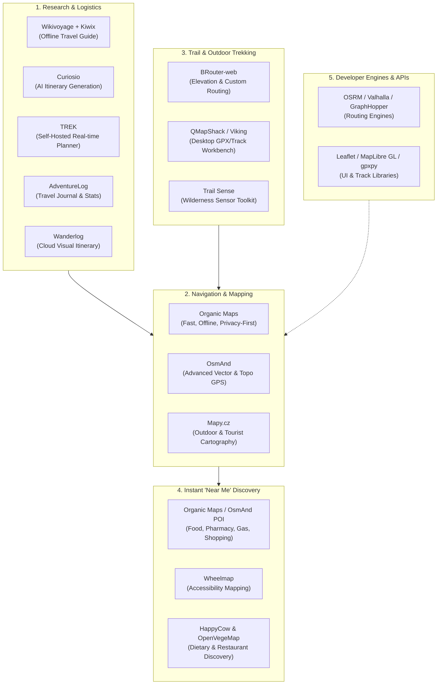

Commercial travel applications are increasingly cluttered with subscription tiers, paywalled offline features, invasive ad tracking, and data lock-in. Whether planning a multi-week international expedition, mapping a backcountry mountain trek, or simply looking for the best street food or open pharmacy within walking distance, a mature ecosystem of **open-source**, **community-driven**, and **generous free/freemium** tools exists to replace proprietary platforms.

This guide catalogs the best open-source and free tools across the entire travel lifecycle: from pre-trip research and collaborative itineraries to offline GPS navigation, topological trail analysis, instant "near me" discovery, and developer libraries for building custom travel applications.

---

## The Open Travel Stack

A modern open travel workflow separates travel into five distinct layers, combining privacy-first offline storage with community data from [OpenStreetMap (OSM)](https://www.openstreetmap.org/){:target="_blank"} and [Wikivoyage](https://www.wikivoyage.org/){:target="_blank"}:



---

## Trip Planning, Itinerary & Travel Management

Managing flight details, lodging reservations, daily itineraries, and expenses without vendor lock-in.

### 1. TREK

* **License & Pricing:** Open-source (AGPLv3), 100% Free self-hosted.
* **Platform:** Web, Docker (`mauriceboe/trek`).
* **Best for:** The ultimate self-hosted, real-time collaborative alternative to Wanderlog and TripIt.

[TREK](https://github.com/liketrek/TREK){:target="_blank"} is a modern, full-featured, self-hosted travel planner built for individuals and travel groups. It combines day-by-day visual planning, real-time WebSocket sync between collaborators, budget tracking, and booking imports in a unified interface.

* **Drag-and-Drop Planning:** Drag places, notes, and bookings between days; auto-sort daily routes via 2-opt algorithms and OSRM (Open Source Routing Machine) for driving, walking, or cycling.
* **Open Map Stack:** Native integration with MapLibre GL, Leaflet, OpenFreeMap, and OpenStreetMap; queries live POIs by category via Overpass.
* **Automated Booking Import:** Parses reservation confirmations (EML, PDF, PKPass, HTML) directly using KDE's [KItinerary](https://invent.kde.org/pim/kitinerary){:target="_blank"}.
* **Expense & Budget Management:** Split costs in integer cents with custom shares, track multi-currency expenses (real-time rates via Frankfurter, no key required), and view automated settle-up suggestions.
* **Packing & Logistics:** Packing lists with weight roll-ups, to-do lists with assignees and due dates, 16-day weather forecasts via Open-Meteo, and PDF summary exports.
* **Media & Archiving:** Links directly with [Immich](https://immich.app/){:target="_blank"} or Synology Photos for automatic travel photo matching, and marks visited territories on [geoBoundaries](https://www.geoboundaries.org/){:target="_blank"} world maps.

### 2. OpenTrip

* **License & Pricing:** Open-source, 100% Free web app & self-hostable.
* **Platform:** Web ([opentrip.im](https://opentrip.im){:target="_blank"}), PWA (installable on iOS/Android), Self-hosted (React 19, Hono, PostgreSQL).
* **Best for:** Small group trips needing shared day schedules, split expenses, and activity voting in a fast, modern PWA.

[OpenTrip](https://github.com/stvlynn/OpenTrip){:target="_blank"} is a sleek, modern open-source collaborative travel planner tailored for friends and families traveling together:

* **Live Route & Day Board:** Stops plotted on an interactive map with day filters, local weather, and place search.
* **Fair Expense Splitting:** Tracks shared spending, individual balances, and automatically computes minimal settle-up debt transfers.
* **Collaborative Decisions:** Built-in voting on attractions and restaurants, shared reservation tracking, and an integrated AI trip assistant.
* **Zero-Friction Access:** Operates as an installable Progressive Web App (PWA) — no app store downloads or logins required for quick guest invites.

### 3. TripSage AI

* **License & Pricing:** Open-source (MIT), 100% Free self-hosted.
* **Platform:** Web, Next.js 16, Supabase, Docker.
* **Best for:** Intelligent agentic travel research and automated itinerary generation with Bring-Your-Own-Key (BYOK) LLMs.

[TripSage AI](https://github.com/BjornMelin/tripsage-ai){:target="_blank"} is a next-generation open-source AI travel companion built with the Vercel AI SDK, Supabase (pgvector), and Next.js 16:

* **Agentic Multi-Agent Search:** Orchestrates 15+ specialized tools for live flight pricing (via Duffel), accommodation lookup, Open-Meteo weather forecasting, and map routing.
* **BYOK Privacy & Cost Control:** Bring your own API key (OpenAI, Anthropic, OpenRouter, or xAI) stored in encrypted Supabase Vault — zero middleman subscriptions or inflated token markups.
* **Hybrid RAG:** Uses vector similarity search with `pgvector` to remember your personal travel preferences, past itineraries, and dietary restrictions.

### 4. AdventureLog

* **License & Pricing:** Open-source (AGPLv3), 100% Free self-hosted.
* **Platform:** Web, Docker, Self-hosted.
* **Best for:** Self-hosters who want private, self-managed travel tracking and personal travel journals.

[AdventureLog](https://github.com/seanmorley15/AdventureLog){:target="_blank"} (formerly Wanderer) is a lightweight self-hosted travel tracker. It allows you to create itineraries, log destinations visited, attach photos and notes, and view personal travel statistics on interactive global maps without sharing location history with ad networks.

* Features full Docker Compose deployment.
* Supports custom markers, notes, and visit dates.
* Multi-user support with private and shared journals.

### 5. Wanderlog (Web & Mobile)

* **License & Pricing:** Proprietary, generous Free tier (no credit card required; optional Pro upgrade for offline route optimization).
* **Platform:** Web, iOS, Android.
* **Best for:** Collaborative group trip planning, road trip routing, and interactive day-by-day itineraries.

[Wanderlog](https://wanderlog.com/){:target="_blank"} is one of the most intuitive visual trip planners available. The free tier offers unlimited itinerary creation, real-time collaboration with travel partners, automated import of flight/hotel reservation emails, and route distance calculation between daily attractions on an integrated map.

### 6. Curiosio

* **License & Pricing:** Free to use web service.
* **Platform:** Web.
* **Best for:** Algorithmic multi-city road trip planning based on time, budget, and curiosity points.

[Curiosio](https://curiosio.com/){:target="_blank"} uses open graph algorithms and geopolitical data to generate optimized road trip itineraries. You specify a start and finish location, budget, number of travelers, and total trip days; Curiosio calculates driving routes, stops, scenic attractions, and daily schedules automatically.

### 7. Wikivoyage + Kiwix (Offline World Travel Guide)

* **License & Pricing:** Creative Commons (CC BY-SA 4.0), 100% Free & Open-source reader.
* **Platform:** Android, iOS, Windows, macOS, Linux.
* **Best for:** Complete, offline cultural, safety, dining, and transit guides without an internet connection.

[Wikivoyage](https://www.wikivoyage.org/){:target="_blank"} is the Wikipedia foundation's open-content travel guide, maintained by global volunteers. By pairing it with [Kiwix](https://kiwix.org/){:target="_blank"} (an open-source offline reader), you can download the entire worldwide Wikivoyage database (including historical context, neighborhood safety ratings, food recommendations, and transit tips) directly to your phone or laptop storage.

---

## Offline Navigation & Turn-by-Turn GPS

Reliable navigation without mobile data roaming fees, cellular dead zones, or battery-draining telemetry.

### 1. Organic Maps

* **License & Pricing:** Open-source (Apache 2.0), 100% Free, no ads, no trackers.
* **Platform:** Android, iOS, Linux.
* **Best for:** Lightweight, ultra-fast offline navigation for city walking, driving, and basic hiking.

[Organic Maps](https://organicmaps.app/){:target="_blank"} is a community-driven fork of MapsWithMe/MAPS.ME that completely stripped out tracking code, ads, and bloat. It downloads country or regional maps based on OpenStreetMap data directly to your device storage.

* **Key Strengths:** Exceptionally fast vector map rendering, low battery consumption, offline search, elevation profiles, contour lines, cycling routes, and walking paths.
* **Privacy:** Zero location tracking, zero telemetry, no user account registration required.

### 2. OsmAnd (Open Street Maps Automated Navigation Directions)

* **License & Pricing:** Open-source core (GPLv3); free on F-Droid / Google Play (Free tier allows 7 map downloads; F-Droid build has full access).
* **Platform:** Android, iOS.
* **Best for:** Advanced power users needing topological layers, nautical charts, GPX recording, and hillshading.

[OsmAnd](https://osmand.net/){:target="_blank"} is the most feature-rich OpenStreetMap navigation engine available on mobile. Beyond turn-by-turn driving and pedestrian directions, OsmAnd supports multi-layered map overlays (satellite imagery, OpenSeaMap, contour lines, relief hillshading), customizable route recalculations, and advanced GPX track recording.

### 3. Mapy.cz (Windy Maps)

* **License & Pricing:** Free to use (freemium account for cross-device sync).
* **Platform:** Web, Android, iOS.
* **Best for:** The world's clearest outdoor tourist and trail cartography.

[Mapy.cz](https://en.mapy.cz/){:target="_blank"} offers some of the most beautifully styled outdoor tourist maps in existence. Marked hiking trails, cycling routes, ski tracks, water sources, and viewpoints are highlighted with standard international trail colors, making route planning significantly clearer than generic road maps. Maps can be downloaded offline per country or region for free.

---

## Hiking, Trail Planning & Outdoor Topography

Tools designed for remote wilderness expeditions, trail route calculation, GPX track editing, and survival sensors.

### 1. BRouter & BRouter-web

* **License & Pricing:** Open-source (MIT / GPLv3), 100% Free.
* **Platform:** Web ([brouter.de/brouter-web](https://brouter.de/brouter-web/){:target="_blank"}), Android (as an offline routing service for OsmAnd/Locus).
* **Best for:** Elevation-aware, highly customizable hiking and cycling routing.

BRouter is a high-performance offline and online routing engine that takes elevation, surface quality (gravel, pavement, mud), and steep gradients into account. The browser-based interface allows you to draw multi-day hiking or bikepacking routes, visualize interactive elevation cross-sections, and export clean GPX tracks.

### 2. QMapShack & Viking (Desktop Track Workbenches)

* **License & Pricing:** Open-source (GPLv3), 100% Free.
* **Platform:** Linux, macOS, Windows.
* **Best for:** Organizing massive GPX track libraries, editing waypoints, and pre-planning multi-stage treks.

* **[QMapShack](https://github.com/Maproom/qmapshack){:target="_blank"}:** The premier open-source desktop GIS tool for outdoor enthusiasts. Supports digital elevation models (DEM) for 3D terrain shading, GPX track merging/splitting, waypoint management, and side-by-side vector map comparison.
* **[Viking](https://github.com/viking-gps/viking){:target="_blank"}:** Lightweight desktop GPS data editor and analyzer for plotting coordinates, geo-referencing maps, and exporting waypoint layers.

### 3. Trail Sense

* **License & Pricing:** Open-source (MIT), 100% Free on F-Droid and Google Play.
* **Platform:** Android.
* **Best for:** Offline wilderness navigation, backcountry survival tools, and device sensor monitoring.

[Trail Sense](https://github.com/kylecorry31/Trail-Sense){:target="_blank"} transforms your smartphone's internal hardware sensors into a rugged outdoor instrument panel that works completely off-grid:

* **Navigation:** Compass with magnetic declination correction, beacon positioning, and breadcrumb backtracking (to retrace your steps if lost).
* **Weather & Environment:** Barometric weather prediction (storm alarms based on pressure drops), digital altimeter, and sunset/sunrise/golden hour calculators.
* **Safety:** Flashlight Morse code SOS signaling, whistle tool, and distance-to-horizon triangulation.

### 4. OpenTopoMap

* **License & Pricing:** Open Data (CC BY-SA), Free tile service.
* **Platform:** Web ([opentopomap.org](https://opentopomap.org/){:target="_blank"}) & Garmin GPS device downloads.
* **Best for:** Classic topographic map styling rendered with 20-meter contour lines and hillshade layers.

OpenTopoMap renders OpenStreetMap vector data and SRTM elevation measurements in the traditional visual style of European and US national topographic surveys. You can print physical waterproof trail paper maps or load the map tiles onto handheld Garmin devices.

---

## Instant "Near Me" Discovery: Food, Shopping & Local Amenities

Finding authentic food, dietary-compliant dining, groceries, ATMs, and public services in your immediate radius without commercial search engine ad bias.

### 1. Offline Point of Interest (POI) Engines (Organic Maps & OsmAnd)

Commercial search engines prioritize sponsored business listings. Both **Organic Maps** and **OsmAnd** provide instantaneous, zero-latency spatial queries against local OpenStreetMap data without internet access:

* **Food & Dining:** Filter immediately by `Cuisine` (e.g., Italian, Thai, Street Food), `Outdoor Seating`, or `Vegetarian`.
* **Essential Services:** Locate the nearest drinking water fountains (`amenity=drinking_water`), public toilets (`amenity=toilets`), automated teller machines (ATMs), gas/petrol stations, and 24/7 pharmacies.
* **Shopping:** Instant listings for supermarkets, bakeries, clothing stores, and outdoor equipment suppliers sorted strictly by radial distance.

### 2. Overpass Turbo & Overpass Ultra

* **License & Pricing:** Open-source (AGPLv3), 100% Free web interfaces.
* **Platform:** Web ([overpass-turbo.eu](https://overpass-turbo.eu/){:target="_blank"}, [overpass-ultra.us](https://overpass-ultra.us/){:target="_blank"}).
* **Best for:** Instant custom spatial queries for unique amenities within walking distance.

Overpass allows you to execute precise spatial queries directly on the live OpenStreetMap database. For instance, run a single query to find every bakery with fresh bread or every coffee shop with public Wi-Fi within 1,000 meters of your current coordinates:

```text
/* Find all cafes with free Wi-Fi within 1km */
[out:json][timeout:25];
(
  node["amenity"="cafe"]["internet_access"="wlan"](around:1000, 37.7749, -122.4194);
  way["amenity"="cafe"]["internet_access"="wlan"](around:1000, 37.7749, -122.4194);
);
out body;
>;
out skel qt;
```

### 3. HappyCow & OpenVegeMap

* **License & Pricing:** HappyCow (Free web version / Freemium app); OpenVegeMap (100% Open-source web).
* **Platform:** Web, iOS, Android.
* **Best for:** Finding vegan, vegetarian, and plant-forward restaurants nearby worldwide.

* **[OpenVegeMap](https://openvegemap.net/){:target="_blank"}:** An open-source web application that queries OpenStreetMap tags (`diet:vegan=*`, `diet:vegetarian=*`) to plot verified vegetarian dining locations near your location.
* **[HappyCow](https://www.happycow.net/){:target="_blank"}:** The world's largest community database of plant-based dining options, providing user-submitted reviews, opening hours, photos, and price levels across 180+ countries.

### 4. Wheelmap

* **License & Pricing:** Open-source (AGPLv3), 100% Free.
* **Platform:** Web ([wheelmap.org](https://wheelmap.org/){:target="_blank"}), iOS, Android.
* **Best for:** Checking wheelchair accessibility, stroller access, and step-free access for nearby businesses and transit hubs.

Created by the non-profit organization Sozialhelden, Wheelmap crowdsources accessibility information using a clear traffic-light rating system (Green = fully wheelchair accessible; Yellow = partial/small step; Red = inaccessible). It is an invaluable resource for travelers with reduced mobility, luggage carts, or families with strollers.

### 5. Too Good To Go (Food Waste & Budget Dining)

* **License & Pricing:** Free mobile app (pay only a fraction of retail for food bundles).
* **Platform:** iOS, Android.
* **Best for:** Discovering heavily discounted fresh meals, bakery boxes, and grocery items nearby while traveling.

[Too Good To Go](https://toogoodtogo.com/){:target="_blank"} connects travelers with local bakeries, cafes, supermarkets, and restaurants that have surplus food at the end of breakfast, lunch, or dinner service. Meals are sold in "Surprise Bags" at roughly 60–75% off standard menu prices, making it an excellent tool for budget-conscious culinary exploration.

---

## Developer Libraries & APIs for Custom Travel Stacks

For developers building custom itinerary builders, GPS track processors, or travel dashboards:

| Library / Tool | Language / Runtime | Purpose | License |
| :--- | :--- | :--- | :--- |
| **[OpenTripPlanner (OTP)](https://www.opentripplanner.org/){:target="_blank"}** | Java | Multi-modal transit planner combining GTFS schedules, walking, bike-share | LGPLv3 |
| **[OSRM](https://project-osrm.org/){:target="_blank"}** | C++ | Ultra-fast shortest path routing engine on road networks | BSD 2-Clause |
| **[Valhalla](https://github.com/valhalla/valhalla){:target="_blank"}** | C++ | Turn-by-turn routing with dynamic costing, time-distance matrices, elevation | MIT |
| **[GraphHopper](https://www.graphhopper.com/open-source/){:target="_blank"}** | Java | Memory-efficient routing engine for car, bike, and walking | Apache 2.0 |
| **[Leaflet.js](https://leafletjs.com/){:target="_blank"}** | JavaScript | Mobile-friendly interactive web map rendering | BSD 2-Clause |
| **[MapLibre GL](https://maplibre.org/){:target="_blank"}** | JS, Native | Open-source vector tile map rendering (fork of Mapbox GL) | BSD 3-Clause |
| **[gpxpy](https://github.com/tkrajina/gpxpy){:target="_blank"}** | Python | Parse, manipulate, extract elevation, and calculate speed on GPX files | Apache 2.0 |
| **[Nominatim](https://nominatim.org/){:target="_blank"}** | C / PHP / PostgreSQL | OpenStreetMap geocoding (address to coordinates) and reverse geocoding | GPLv2 |

> For researchers and transport modelers, the [`otpr`](https://github.com/marcusyoung/otpr){:target="_blank"} R package provides an API wrapper for querying running OpenTripPlanner instances to compute travel-time isochrones and accessibility surfaces.

---

## Feature Comparison Matrix

| Tool | Category | License / Pricing | Offline Support | Mobile / Desktop | Primary Strength |
| :--- | :--- | :--- | :--- | :--- | :--- |
| **TREK** | Trip Planning | Open-source (AGPLv3) / Free | Local server storage | Docker / Web | Self-hosted Wanderlog alternative, real-time sync, KItinerary |
| **OpenTrip** | Trip Planning | Open-source / Free | Web app + PWA offline | Web / Mobile PWA | Fast group planning, expense splitting, voting, no app install |
| **TripSage AI** | AI Trip Research | Open-source (MIT) / Free | Local self-hosted | Web / Docker | Agentic travel planning, BYOK LLMs, pgvector personal memory |
| **Organic Maps** | Maps & Navigation | Open-source (Apache 2.0) / Free | Full offline vector maps | Android, iOS, Linux | Privacy-first, zero ads, lightning fast |
| **OsmAnd** | Maps & Navigation | Open-source (GPLv3) / Free | Full offline vector maps | Android, iOS | Contours, nautical charts, GPX tracking |
| **Mapy.cz** | Maps & Outdoor | Proprietary / 100% Free | Full offline maps | Web, Android, iOS | Clear international hiking & tourist trails |
| **AdventureLog** | Trip Management | Open-source (AGPLv3) / Free | Local server storage | Docker / Web | Self-hosted travel journal & stats |
| **Wanderlog** | Trip Management | Proprietary / Free tier | Pro-only offline | Web, Android, iOS | Collaborative day-by-day itineraries |
| **Wikivoyage (Kiwix)** | Travel Research | Open Content (CC BY-SA) / Free | 100% offline document | All OS platforms | Complete worldwide travel encyclopedia |
| **BRouter-web** | Hiking & Cycling | Open-source (MIT/GPLv3) / Free | Web-based (exports GPX) | Web, Android | Elevation-aware, custom gravel/trail routing |
| **Trail Sense** | Outdoor Survival | Open-source (MIT) / Free | 100% offline | Android | Compass, barometer storms, backtrack trail |
| **QMapShack** | Trail Planning | Open-source (GPLv3) / Free | Offline GIS maps | Linux, macOS, Win | Advanced GPX editing & elevation profiles |
| **OpenTripPlanner** | Routing Engine | Open-source (LGPLv3) / Free | Server engine | Server / Docker | Scheduled public transit GTFS + walking/bike routing |
| **Wheelmap** | Local Discovery | Open-source (AGPLv3) / Free | Online | Web, Android, iOS | Wheelchair and stroller accessibility |
| **OpenVegeMap** | Food Discovery | Open-source (GPLv3) / Free | Online | Web | Filter vegan/vegetarian places via OSM |

---

## Recommended Stacks by Traveler Profile

### 1. The Backcountry Hiker & Mountaineer

* **Pre-trip planning:** [BRouter-web](https://brouter.de/brouter-web/){:target="_blank"} (elevation profiling) + [QMapShack](https://github.com/Maproom/qmapshack){:target="_blank"} (GPX waypoint preparation).
* **On-trail navigation:** [OsmAnd](https://osmand.net/){:target="_blank"} (loaded with contour lines and hillshade tiles).
* **Safety & Sensor Backup:** [Trail Sense](https://github.com/kylecorry31/Trail-Sense){:target="_blank"} (barometer storm alarm and backtrack beacon).

### 2. The City Explorer & Foodie

* **Navigation & POI:** [Organic Maps](https://organicmaps.app/){:target="_blank"} (fast offline street navigation + direct searching for drinking water and bakeries).
* **Dining & Culture:** [OpenVegeMap](https://openvegemap.net/){:target="_blank"} / [HappyCow](https://www.happycow.net/){:target="_blank"} + [Wikivoyage via Kiwix](https://kiwix.org/){:target="_blank"} (offline destination history and neighborhood safety advice).
* **Budget Food:** [Too Good To Go](https://toogoodtogo.com/){:target="_blank"} for evening surprise food packs.

### 3. The Digital Nomad, Road Tripper & Group Traveler

* **Trip Central & Itinerary:** [TREK](https://github.com/liketrek/TREK){:target="_blank"} (self-hosted collaborative planning, expense splitting, reservation PDF parsing) or [Wanderlog](https://wanderlog.com/){:target="_blank"}.
* **Route Ideation:** [Curiosio](https://curiosio.com/){:target="_blank"} for automatic road trip stop calculations.
* **Driving Navigation:** [Organic Maps](https://organicmaps.app/){:target="_blank"} or [OsmAnd](https://osmand.net/){:target="_blank"} with voice prompts and offline speed camera / speed limit alerts.
* **Private Photo & Travel Journal:** [AdventureLog](https://github.com/seanmorley15/AdventureLog){:target="_blank"} or [TREK with Immich integration](https://github.com/liketrek/TREK){:target="_blank"}.
