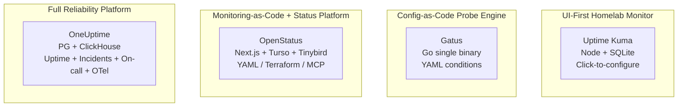

Which open-source uptime monitoring tool should you self-host in 2026? Uptime monitoring answers a different question than APM or log platforms: *is this endpoint reachable and behaving correctly right now?* Commercial SaaS tools (UptimeRobot, Pingdom, Better Stack) make that easy — until probe volume, status-page branding, or data residency push you toward self-hosting. This guide compares four open-source uptime monitoring tools teams actually deploy: **Uptime Kuma**, **Gatus**, **OpenStatus**, and **OneUptime**.

For full three-signal observability platforms (logs + metrics + traces), see our [open-source observability platform comparison](). For commercial pricing context, see the [paid observability platforms pricing guide]().

## TL;DR — Quick Recommendations

| Use case | Best fit | Why |
| -------- | -------- | --- |
| **Homelab / fastest UI setup** | Uptime Kuma | One Docker container, 90+ notification channels, polished status pages |
| **GitOps / YAML-as-code checks** | Gatus | Single Go binary, condition expressions, Prometheus metrics |
| **Monitoring-as-code + agent MCP / Terraform** | OpenStatus | YAML/Terraform/CLI/MCP, branded status pages; multi-region via cloud or private locations |
| **Uptime + incidents + on-call + OTel in one box** | OneUptime | Widest reliability scope; replaces Pingdom + PagerDuty + Statuspage + APM |

> Jump to [When to Use What](#when-to-use-what) for the full decision table, or [Architecture Classification](#architecture-classification) for how these tools differ at the design level.

## Table of Contents

- [TL;DR — Quick Recommendations](#tldr--quick-recommendations)
- [Approach](#approach)
- [Candidate Tools Evaluated](#candidate-tools-evaluated)
- [Architecture Classification](#architecture-classification)
- [Core Monitoring Capability Matrix](#core-monitoring-capability-matrix)
- [Status Page & Incident Communication Matrix](#status-page--incident-communication-matrix)
- [Alerting & Reliability Operations Matrix](#alerting--reliability-operations-matrix)
- [Configuration, IaC & Developer Experience Matrix](#configuration-iac--developer-experience-matrix)
- [Architecture & Operational Complexity Matrix](#architecture--operational-complexity-matrix)
- [Licensing / "Actually Free" Matrix](#licensing--actually-free-matrix)
- [When to Use What](#when-to-use-what)
- [Known Limitations & Gotchas](#known-limitations--gotchas)
- [FAQ](#faq)
- [Honorable Mentions](#honorable-mentions)
- [How This Fits the Observability Series](#how-this-fits-the-observability-series)
- [References](#references)

## Approach

We evaluate tools whose **primary job** is synthetic uptime / availability checks and status communication — not full observability platforms that merely include a ping monitor as a side feature.

| Selection Criterion | Requirement |
| ------------------- | ----------- |
| **Open source** | Public source repo with a usable self-hosted path |
| **Self-hostable** | Runs on your infrastructure without a mandatory cloud account |
| **Uptime-first** | HTTP/TCP/DNS (or equivalent) probes are a core product surface |
| **Active project** | Maintained releases and community usage as of mid–late 2026 |

**Excluded:** SaaS-only uptime products (Pingdom, UptimeRobot cloud), pure cron-heartbeat tools (covered under Honorable Mentions), and multi-signal platforms already covered in the companion observability platform comparison — except OneUptime, which is included here because its uptime + status-page + on-call story is a direct UptimeRobot/Statuspage replacement.

## Legend

| Symbol | Meaning |
| ------ | ------- |
| ✅ | Clearly supported / documented |
| ◐ | Partial support or requires extra setup |
| ⭐ | Particular strength worth testing |
| — | Not supported or not applicable |
| EE | Enterprise / paid boundary — verify before committing |

## Candidate Tools Evaluated

| Tool | Language | Storage | License | GitHub (Sep 2026) |
| ---- | -------- | ------- | ------- | ----------------- |
| **[Uptime Kuma](https://github.com/louislam/uptime-kuma)** | JavaScript (Node.js + Vue) | SQLite (local volume) | MIT | ⭐ ~91.7k · Since 2021 |
| **[Gatus](https://github.com/TwiN/gatus)** | Go | Memory / SQLite / PostgreSQL | Apache 2.0 | ⭐ ~12.1k · Since 2019 |
| **[OpenStatus](https://github.com/openstatusHQ/openstatus)** | TypeScript (Next.js) | Turso/libSQL + Tinybird | AGPL-3.0 | ⭐ ~9.1k · Since 2023 |
| **[OneUptime](https://github.com/OneUptime/oneuptime)** | TypeScript | PostgreSQL + ClickHouse | Apache 2.0 (+ EE dir) | ⭐ ~7.6k · Since 2021 |

Star counts retrieved from the GitHub API on 2026-09-22; project links appear in the table above and in [References](#references).

## Architecture Classification

Understanding design philosophy matters more than feature checklists. A single-binary YAML checker is a different operational animal from a multi-container reliability platform — even when both claim "uptime + status page."

| Architecture class | Tool | What you operate | Typical footprint (approx.) |
| ------------------ | ---- | ---------------- | --------------------------- |
| **UI-first monitor** | Uptime Kuma | One container + persistent volume | Hundreds of MB RAM on a small VPS |
| **Config-as-code probe** | Gatus | One binary/container + config file | Tens of MB RAM; lightest of the four |
| **MaC status platform** | OpenStatus | Compose stack (dashboard, status pages, API, probes, analytics) | Multi-service; larger than Kuma/Gatus |
| **Reliability platform** | OneUptime | Docker Compose or Helm (10+ services at full scope) | Multi-GB RAM for a full-stack deploy |

## Core Monitoring Capability Matrix

| Criterion | Uptime Kuma | Gatus | OpenStatus | OneUptime |
| --------- | ----------- | ----- | ---------- | --------- |
| **HTTP(S) checks** | ✅ | ✅ | ✅ | ✅ |
| **TCP / port checks** | ✅ | ✅ | ✅ | ✅ |
| **DNS checks** | ✅ | ✅ | ✅ | ✅ |
| **ICMP / ping** | ✅ | ✅ | ◐ | ✅ |
| **Keyword / body assert** | ✅ keyword | ⭐ condition DSL | ✅ | ✅ |
| **JSON path / query assert** | ✅ JSON query | ⭐ `[BODY].path` | ✅ | ✅ |
| **SSL / cert expiry** | ✅ | ⭐ `[CERTIFICATE_EXPIRATION]` | ✅ | ✅ |
| **gRPC** | — | ✅ | — | ◐ |
| **WebSocket** | ✅ | ✅ | — | ◐ |
| **SSH / STARTTLS / UDP / SCTP** | — | ⭐ | — | — |
| **Docker container monitor** | ✅ | — | — | ✅ (infra agents) |
| **Push / heartbeat monitors** | ✅ | ✅ external endpoints | ✅ | ✅ |
| **Multi-step suites / flows** | ◐ | ⭐ suites (alpha) | ✅ flows | ✅ synthetics / workflows |
| **Multi-region probes** | ◐ (manual multi-instance) | ◐ external push / remote (exp.) | ⭐ public regions on managed cloud; ◐ self-host = private locations you run | ⭐ global probes |
| **Min practical interval** | 20s (UI); can go lower | Default 60s; configurable | Cloud tier limits; self-host lower | Configurable |
| **Prometheus metrics export** | ◐ | ⭐ native | ◐ | ✅ (OTel / metrics stack) |

**Takeaway:** Gatus wins on **protocol breadth and assertion expressiveness** (condition language over status, body, latency, certs). Uptime Kuma wins on **monitor-type variety for operators who click** (Docker, Steam, MQTT-adjacent patterns, keyword, JSON query). OpenStatus (managed cloud) and OneUptime win when **geographic probe diversity** matters more than exotic protocol coverage — self-hosted OpenStatus relies on private locations you operate.

## Status Page & Incident Communication Matrix

| Criterion | Uptime Kuma | Gatus | OpenStatus | OneUptime |
| --------- | ----------- | ----- | ---------- | --------- |
| **Public status page** | ⭐ | ✅ (dashboard / status) | ⭐ | ⭐ |
| **Custom domain mapping** | ✅ | ◐ (reverse proxy) | ✅ | ✅ |
| **Password / private page** | ✅ | ◐ basic auth / OIDC gate | ✅ | ✅ |
| **Maintenance windows** | ✅ | ✅ per-endpoint | ✅ | ✅ |
| **Subscriber email / SMS** | ◐ RSS-focused | — | ✅ email + RSS + webhooks | ⭐ email + SMS |
| **Manual incident posts** | ✅ | — | ✅ | ⭐ full incident workflow |
| **Auto-open incidents from checks** | ◐ | — | ✅ | ⭐ |
| **Branding / theming** | ✅ | ◐ functional UI | ⭐ | ⭐ |
| **Multiple status pages** | ✅ | ◐ | ✅ | ✅ |

If your main goal is a **customer-facing status page with subscribers**, OpenStatus and OneUptime are in a different league from Gatus. Uptime Kuma sits in the middle — strong status pages for homelabs and small products, weaker on SMS subscriber fan-out and formal incident workflow.

## Alerting & Reliability Operations Matrix

| Criterion | Uptime Kuma | Gatus | OpenStatus | OneUptime |
| --------- | ----------- | ----- | ---------- | --------- |
| **Notification channel count** | ⭐ 90+ | ✅ 40+ providers | ✅ Slack/Discord/PagerDuty/email… | ⭐ SMS / call / push / Slack |
| **Failure threshold / anti-flap** | ✅ | ⭐ `failure-threshold` / `success-threshold` | ✅ | ✅ |
| **On-call schedules** | — | — | ◐ | ⭐ |
| **Escalation policies** | — | — | ◐ | ⭐ |
| **Incident declare → postmortem** | ◐ lightweight | — | ◐ | ⭐ |
| **Workflow automation** | — | — | ◐ | ⭐ visual workflows |
| **AI / agent assist on incidents** | — | — | ⭐ MCP for agents | ⭐ agentic auto-fix PR path |
| **Team RBAC** | ◐ single-user oriented | ◐ auth gate | ✅ | ✅ (EE for SAML/OIDC/SCIM) |

Uptime Kuma's notification breadth is unmatched for "tell me on Telegram/Discord/Gotify." OneUptime is the only candidate that honestly replaces **PagerDuty-class on-call** plus incident management in the same deploy. OpenStatus is the best fit when **AI agents and IaC** should own monitor lifecycle; Gatus is best when alerting is "page Slack/PagerDuty from YAML conditions" without an incident product.

## Configuration, IaC & Developer Experience Matrix

| Criterion | Uptime Kuma | Gatus | OpenStatus | OneUptime |
| --------- | ----------- | ----- | ---------- | --------- |
| **Primary config model** | Web UI → SQLite | ⭐ YAML files | ⭐ YAML + Terraform + CLI | UI + API + agents |
| **Git-friendly / reviewable** | ◐ export/backup | ⭐ | ⭐ | ◐ |
| **Hot reload config** | UI live | ✅ (with caveats) | ✅ apply from CI | ✅ |
| **REST / typed API** | ✅ | ✅ | ⭐ | ⭐ |
| **Terraform provider** | — | — | ⭐ | ◐ |
| **MCP server for agents** | — | — | ⭐ | ◐ |
| **CLI `--json` for agents** | — | ◐ | ⭐ | ◐ |
| **Learning curve** | Lowest | Low (if you like YAML) | Medium | Highest |

The real split is **clicks vs commits**. Uptime Kuma optimizes for interactive setup. Gatus and OpenStatus optimize for pull-requestable monitoring. OneUptime optimizes for productized reliability operations — configuration is secondary to workflow breadth.

## Architecture & Operational Complexity Matrix

> This table may be **more valuable than the feature table** — it explains what you actually have to operate at 2 AM.

| Criterion | Uptime Kuma | Gatus | OpenStatus | OneUptime |
| --------- | ----------- | ----- | ---------- | --------- |
| **Install path** | `docker run` / Compose | Single binary or tiny image | `docker compose` / Coolify / Railway | Compose (`npm start`) or Helm |
| **External dependencies** | None (SQLite volume) | Optional Postgres | libSQL + Tinybird Local (self-host) | PostgreSQL + ClickHouse (+ more) |
| **HA / multi-node** | — (SQLite single-writer) | ◐ remote/external patterns | ✅ private locations + managed | ✅ K8s Helm |
| **Backup story** | Volume backup of `/app/data` | Config in Git + optional DB | DB + analytics store | Platform backup scripts |
| **Upgrade risk** | Low–medium (watch SQLite migrations) | Low | Medium (multi-service) | Medium–high (many services) |
| **Team size to operate** | 1 | 1 | 1–2 | 2+ for full stack |
| **Also does logs/traces/APM** | — | — | — | ⭐ |

**Ops bottom line:** Treat OneUptime as a **platform deployment**, not an uptime sidecar. Treat Gatus as a **library-shaped binary** you can drop beside any service mesh. Uptime Kuma and OpenStatus sit between those extremes.

Install and ops details: see each project's docs linked under [References](#references).

## Licensing / "Actually Free" Matrix

> Don't score "open source = 10" because a GitHub repo exists. Score by: **how much uptime functionality can you run without purchasing a license?**

| Tool | License | Fully usable self-hosted? | Watch-outs |
| ---- | ------- | ------------------------- | ---------- |
| **Uptime Kuma** | MIT | ✅ | No commercial fork drama; single-maintainer bus factor |
| **Gatus** | Apache 2.0 | ✅ | Managed Gatus.io is optional paid; OSS is complete for core monitoring |
| **OpenStatus** | AGPL-3.0 | ✅ | AGPL obligations if you offer it as a network service to third parties; enterprise features via vendor |
| **OneUptime** | Apache 2.0 (+ EE directory) | ✅ Community image | SAML/OIDC/SCIM/audit dashboards live under Enterprise license in `ee/` |

## When to Use What

| If you need... | Best fit | Runner-up |
| -------------- | -------- | --------- |
| **Fastest path from zero to monitors** | Uptime Kuma | Gatus |
| **Beautiful UI + 90+ notification integrations** | Uptime Kuma | OneUptime |
| **Every check in Git, reviewed like infra** | Gatus | OpenStatus |
| **Condition DSL (latency, JSON, certs, multi-protocol)** | Gatus | OpenStatus |
| **Tiny resource footprint (Pi / small VPS)** | Gatus | Uptime Kuma |
| **Terraform + CLI + MCP monitoring-as-code** | OpenStatus | OneUptime |
| **Branded public status page + email subscribers** | OpenStatus | OneUptime |
| **Multi-region probes without running your own workers** | OpenStatus (cloud) / OneUptime | Gatus external endpoints |
| **On-call schedules + escalations + postmortems** | OneUptime | — |
| **Uptime + logs + traces + APM in one product** | OneUptime | See the companion observability platform comparison |
| **Replace UptimeRobot only** | Uptime Kuma | Gatus |
| **Replace UptimeRobot + Statuspage + PagerDuty** | OneUptime | OpenStatus (+ external on-call) |

## Known Limitations & Gotchas

| Tool | Key limitation | Practical impact |
| ---- | -------------- | ---------------- |
| **Uptime Kuma** | SQLite single-node; config lives in DB not Git; not multi-region by design | Fine for one VPS; weak for geo-distributed probing and GitOps review |
| **Gatus** | Status page is functional, not a marketing-grade Statuspage.io clone; no subscriber fan-out; limited HA story | Great internal health board; weak customer incident communication |
| **OpenStatus** | Heavier self-host stack than Kuma/Gatus; AGPL; public multi-region probes are managed-cloud; self-host uses private locations | Budget time for Compose/Coolify; legal review if you resell monitoring; plan your own probe geography |
| **OneUptime** | Full stack is resource-heavy (multi-service); EE boundary for SSO/SCIM | Overkill if you only need HTTP pings; plan RAM/CPU like an observability platform |

> These are known ceilings, not dealbreakers. Match friction to your team's strengths: UI operators → Kuma; YAML/GitOps → Gatus/OpenStatus; reliability org → OneUptime.

## FAQ

### What is the best open-source alternative to UptimeRobot?

For most individuals and small teams, **Uptime Kuma** — one container, rich monitor types, and notification coverage closest to UptimeRobot's "just tell me when it's down" experience. If you want checks as code instead of clicks, choose **Gatus**.

### Uptime Kuma vs Gatus — which should I pick?

Choose **Uptime Kuma** if you want a GUI, status pages, and maximum notification integrations. Choose **Gatus** if monitors must live in Git, you need JSON/cert/latency condition expressions, or you care about the lightest possible footprint. Feature lists matter less than that workflow split.

### Is OpenStatus just another status page?

No. OpenStatus combines **uptime / API monitoring**, **status pages**, and **monitoring-as-code** (YAML, Terraform, CLI, MCP). It is closer to "Better Stack / Checkly-shaped OSS" than to a static status-page generator.

### When is OneUptime worth the operational cost?

When you are stitching together **uptime + status page + on-call + incident management (+ optionally OTel APM)**. If you only need HTTP checks, OneUptime is heavier than Uptime Kuma or Gatus. We also evaluate OneUptime in the broader observability platform comparison linked in the intro.

### Can I run multi-region monitoring with these tools?

**OneUptime** productizes global probes. **OpenStatus** offers public multi-region locations on its managed cloud; a self-hosted OpenStatus deploy uses **private locations** (probes you run yourself), not the vendor’s public region fleet. **Gatus** supports pushing results from remote workers into a central instance (external endpoints / experimental remote patterns). **Uptime Kuma** typically means running separate instances or relying on an external checker to watch your watcher.

### Does Gatus replace Prometheus Alertmanager?

No — and it is not trying to. Gatus answers *synthetic* "is the dependency up?" independent of traffic. Prometheus/Alertmanager answer *telemetry-based* "are error rates / latencies anomalous?" Most production teams eventually want both. See our [open-source metrics tools comparison]() for the TSDB side.

### Is AGPL a problem for OpenStatus self-hosting?

For **internal** self-hosting (your team monitoring your services), AGPL typically does not force you to publish private modifications. If you **offer OpenStatus as a service to external customers**, AGPL obligations apply — consult counsel. MIT/Apache tools (Kuma, Gatus, OneUptime Community) are simpler for vendors embedding monitoring.

## Honorable Mentions

### Healthchecks

[Healthchecks](https://github.com/healthchecks/healthchecks) (BSD-3, Python/Django, ⭐ ~10k+) — Best-in-class **cron / job heartbeat** monitoring (expect a ping by time T, else alert). Complementary to website uptime tools, not a substitute for HTTP synthetic monitoring.

### Upptime

[Upptime](https://github.com/upptime/upptime) — GitHub Actions–powered uptime checks that open Issues and publish a Pages status site. Excellent zero-infra option; constrained by Actions schedules and GitHub as the control plane.

### Statping-ng

[Statping-ng](https://github.com/statping-ng/statping-ng) — Maintained fork of Statping with UI + API. Smaller community than Kuma/Gatus; evaluate maintenance cadence before adopting.

### Cachet / CachetHQ

Historically popular status-page software. Treat carefully for new greenfield deployments — monitoring depth and maintenance trajectory lag the four primary candidates above.

### Better Stack / Checkly / UptimeRobot (commercial)

Useful baselines for feature expectations (multi-region, scripting, status subscribers). Pricing and lock-in are covered in the paid observability platforms pricing guide linked in the intro.

## How This Fits the Observability Series

> - **Unified Platforms:** [Open-Source Observability Platforms Compared]()
> - **Hands-On Testing:** [Benchmarking Open-Source Observability]()
> - **Cost & Licensing:** [Paid Observability Platforms & Enterprise Pricing Comparison]()
> - **Signal Deep Dives:**
>   - **Logging:** [Open-Source Log Management Tools Compared]()
>   - **Metrics:** [Open-Source Metrics Tools Compared]()
>   - **Tracing:** [Open-Source Distributed Tracing Tools Compared]()
>   - **Profiling:** [Open-Source Continuous Profiling Tools Compared]()
> - **Uptime / Status:** Open-Source Uptime Monitoring Tools Compared

## References

### Official sites & docs

- [Uptime Kuma site](https://uptime.kuma.pet) · [How to Install (wiki)](https://github.com/louislam/uptime-kuma/wiki/%F0%9F%94%A7-How-to-Install)
- [Gatus site](https://gatus.io/) · GitHub repo linked in [Candidate Tools](#candidate-tools-evaluated)
- [OpenStatus site](https://openstatus.dev) · [OpenStatus documentation](https://docs.openstatus.dev/) · [Probes & locations](https://www.openstatus.dev/docs/concept/probes-and-locations)
- [OneUptime site](https://oneuptime.com) · [OneUptime documentation](https://oneuptime.com/docs)

---

*Last verified: September 2026. Star counts, features, and licensing change — always check official repositories and docs before adopting.*
