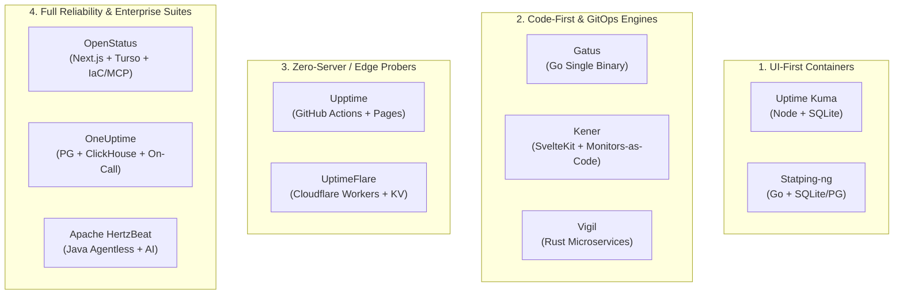

**Open-source uptime monitoring** is the practice of deploying self-hosted, vendor-neutral software to continuously probe external endpoints (HTTP, TCP, DNS, and SSL) for availability, latency, and functional correctness. Unlike internal APM or log aggregation platforms, synthetic probers actively answer whether a service is reachable and behaving correctly from the outside world while powering public status pages for incident communication.

Commercial SaaS tools (UptimeRobot, Pingdom, Better Stack) make that easy — until probe volume, custom status-page branding, data privacy, or budget constraints push you toward open source.

This guide evaluates and compares the **10 leading open-source uptime monitoring tools** that offer active synthetic probing, alerting, and status communication:

1. **[Uptime Kuma](https://github.com/louislam/uptime-kuma)** — The gold standard for UI-first homelab & SMB monitoring.
2. **[Gatus](https://github.com/TwiN/gatus)** — Ultra-lightweight Go single binary with YAML condition expressions.
3. **[OpenStatus](https://github.com/openstatusHQ/openstatus)** — Modern Monitoring-as-Code with Terraform, CLI, MCP agents, and Next.js status pages.
4. **[OneUptime](https://github.com/OneUptime/oneuptime)** — Complete reliability suite replacing Pingdom, Statuspage, PagerDuty, and APM in one deploy.
5. **[Kener](https://github.com/rajnandan1/kener)** — Sleek SvelteKit status page with monitors-as-code and live SVG badges.
6. **[Upptime](https://github.com/upptime/upptime)** — Zero-infrastructure, 100% serverless monitor running on GitHub Actions & Pages.
7. **[UptimeFlare](https://github.com/lyc8503/UptimeFlare)** — Serverless edge prober running across 310+ cities on Cloudflare Workers & Pages.
8. **[Vigil](https://github.com/valeriansaliou/vigil)** — High-performance Rust microservices status page and prober.
9. **[Apache HertzBeat](https://github.com/apache/hertzbeat)** — Top-level Apache project for agentless multi-protocol synthetic & infrastructure monitoring.
10. **[Statping-ng](https://github.com/statping-ng/statping-ng)** — Classic self-hosted status board and prober in a single Go binary.

For full three-signal observability platforms (logs + metrics + traces), see our [open-source observability platform comparison](). For commercial pricing context, see the [paid observability platforms pricing guide]().

## TL;DR — Quick Recommendations

| Use Case | Best Fit | Runner-Up | Why |
| -------- | -------- | --------- | --- |
| **Homelab / fastest point-and-click UI** | **Uptime Kuma** | Statping-ng | Single Docker container, 90+ notification channels, polished status pages |
| **GitOps / declarative YAML checks** | **Gatus** | Upptime | Single Go binary, condition DSL over latency/body/certs, native Prometheus metrics |
| **Monitoring-as-Code + Terraform / AI MCP** | **OpenStatus** | Gatus | Native Terraform provider, typed API, and Model Context Protocol (MCP) server for agents |
| **All-in-one: Uptime + Status + On-Call + OTel** | **OneUptime** | OpenStatus | Replaces UptimeRobot + PagerDuty + Statuspage in a single unified deployment |
| **Modern SvelteKit status page + live badges** | **Kener** | OpenStatus | Sleek design, monitors-as-code (JSON/YAML), embeddable live SVG badges |
| **Zero-infrastructure / 100% serverless on GitHub** | **Upptime** | UptimeFlare | Runs entirely on GitHub Actions cron schedules; commits data to Git and publishes to Pages |
| **Global multi-region edge probing ($0 servers)** | **UptimeFlare** | Upptime | Probes from 310+ Cloudflare edge cities; runs on Cloudflare Workers + KV free tier |
| **Ultra-lightweight microservices prober (<25MB RAM)** | **Vigil** | Gatus | Native Rust binary, microservice push agents, ultra-low resource footprint |
| **Enterprise agentless & multi-protocol checks** | **Apache HertzBeat** | OneUptime | HTTP, JMX, SNMP, JDBC, SSH probers with AI diagnostics and clustering |

> Jump to [When to Use What](#when-to-use-what) for the detailed decision guide, or review the [Comparison Matrices](#core-monitoring-capability-matrix) below.
{: .prompt-tip }

## Approach & Scope Demarcation

### Selection Criteria

To qualify for this comparison, tools had to meet four strict criteria:

1. **Open Source:** Public source code repository under a recognized OSI or permissive open-source license.
2. **Active Synthetic Engine:** Must contain an active prober daemon or scheduled engine that tests external endpoints (HTTP, TCP, DNS, etc.).
3. **Status Communication Surface:** Must provide a built-in status page or dashboard for incident transparency.
4. **Deployable Without Mandatory Paid Cloud:** Fully usable self-hosted or via free-tier serverless/Git automation platforms.

### What This Guide Is NOT: Exclusions & NMS Demarcation

To keep the comparison practically actionable, we deliberately exclude three adjacent categories:

1. **Traditional Network Management Systems (NMS) — [Zabbix](https://github.com/zabbix/zabbix), [Nagios Core](https://github.com/NagiosEnterprises/nagioscore), [LibreNMS](https://github.com/librenms/librenms), [Icinga 2](https://github.com/Icinga/icinga2):**  
   These are enterprise infrastructure monitoring suites focused on SNMP polling, switch port health, server CPU/memory agents, and hardware sensors. While they can ping URLs, they lack developer-friendly public status pages, subscriber email/SMS workflows, modern UI branding, and GitOps workflows.
2. **Headless Metric Exporters — [Prometheus Blackbox Exporter](https://github.com/prometheus/blackbox_exporter):**  
   Blackbox Exporter is the industry standard for probing HTTP, DNS, TCP, ICMP, and gRPC endpoints in Kubernetes. However, it is an exporter that generates Prometheus metrics, not a status communication product. (See [FAQ](#faq) for how to use it alongside status tools).
3. **Inverted / Cron Heartbeat Monitors — [Healthchecks](https://github.com/healthchecks/healthchecks):**  
   Healthchecks is a dead-man's snitch: your backup scripts and background cron jobs ping *it*. If a job goes silent, it alerts. This is the inverse of active outward synthetic probing.
4. **Static Status Page Generators without Probers — [Cachet](https://github.com/cachethq/cachet), [cState](https://github.com/cstate/cstate):**  
   These provide incident communication frontends but require third-party scripts or manual API calls to report uptime.

## Legend

| Symbol | Meaning |
| :---: | ------- |
| ✅ | Fully supported and documented out of the box |
| ◐ | Partial support, experimental, or requires extra scripting/plugins |
| ⭐ | Standout strength or benchmark implementation |
| — | Not supported or out of scope |
| EE | Enterprise edition / commercial boundary required |

## Candidate Tools Evaluated

| Tool | Primary Language / Stack | Storage / State | License | GitHub Stars (Sep 2026) | MCP / AI Agents | Primary Persona |
| ---- | ------------------------ | --------------- | ------- | ----------------------- | :-------------: | --------------- |
| **[Uptime Kuma](https://github.com/louislam/uptime-kuma)** | Node.js + Vue.js | SQLite (local volume) | MIT | ⭐ ~92.0k | ◐ Community | Homelabber, SMB, UI-first DevOps |
| **[Gatus](https://github.com/TwiN/gatus)** | Go | Memory / SQLite / PostgreSQL | Apache 2.0 | ⭐ ~12.2k | — | SRE, Kubernetes / GitOps Engineer |
| **[OpenStatus](https://github.com/openstatusHQ/openstatus)** | TypeScript (Next.js) | Turso (libSQL) + Tinybird | AGPL-3.0 | ⭐ ~9.2k | ⭐ Official | Modern Web Dev, Platform Engineer |
| **[OneUptime](https://github.com/OneUptime/oneuptime)** | TypeScript | PostgreSQL + ClickHouse | Apache 2.0 (+ EE) | ⭐ ~7.7k | ⭐ Official | SRE Team, Reliability Org |
| **[Kener](https://github.com/rajnandan1/kener)** | TypeScript (SvelteKit + Node.js) | SQLite / JSON configs | MIT | ⭐ ~4.2k | — | Developer, Product Team |
| **[Upptime](https://github.com/upptime/upptime)** | TypeScript / GitHub Actions | Git Repository / GitHub Issues | MIT | ⭐ ~16.5k | ◐ Copilot Actions | Indie Hacker, Open Source Maintainer |
| **[UptimeFlare](https://github.com/lyc8503/UptimeFlare)** | TypeScript / Cloudflare Workers | Cloudflare KV | MIT | ⭐ ~3.6k | — | Jamstack Dev, Zero-Budget Operator |
| **[Vigil](https://github.com/valeriansaliou/vigil)** | Rust | In-memory + local config | MPL-2.0 | ⭐ ~4.7k | — | Microservice Architect, Systems Dev |
| **[Apache HertzBeat](https://github.com/apache/hertzbeat)** | Java (Spring Boot) + Vue | H2 / MySQL / VictoriaMetrics | Apache 2.0 | ⭐ ~5.6k | ⭐ Official | Enterprise IT, Multi-Protocol Ops |
| **[Statping-ng](https://github.com/statping-ng/statping-ng)** | Go + Vue.js | SQLite / MySQL / PostgreSQL | GPL-3.0 | ⭐ ~2.2k | — | Self-Host Enthusiast, Classic Ops |

## Architectural Archetypes

Before evaluating features, it is critical to understand the four architectural patterns that govern open-source uptime tools:


```mermaid
flowchart TD
    subgraph S1["1. UI-First Containers"]
        UK["Uptime Kuma<br/>(Node + SQLite)"]
        SP["Statping-ng<br/>(Go + SQLite/PG)"]
    end

    subgraph S2["2. Code-First & GitOps Engines"]
        GA["Gatus<br/>(Go Single Binary)"]
        KN["Kener<br/>(SvelteKit + Monitors-as-Code)"]
        VG["Vigil<br/>(Rust Microservices)"]
    end

    subgraph S3["3. Zero-Server / Edge Probers"]
        UP["Upptime<br/>(GitHub Actions + Pages)"]
        UF["UptimeFlare<br/>(Cloudflare Workers + KV)"]
    end

    subgraph S4["4. Full Reliability & Enterprise Suites"]
        OS["OpenStatus<br/>(Next.js + Turso + IaC/MCP)"]
        OU["OneUptime<br/>(PG + ClickHouse + On-Call)"]
        HB["Apache HertzBeat<br/>(Java Agentless + AI)"]
    end
```

| Archetype | Tools | How It Operates | Best Fit |
| --------- | ----- | --------------- | -------- |
| **UI-First Container** | Uptime Kuma, Statping-ng | Single container with embedded DB; configured via interactive web GUI | Homelabs, small business apps, operators who prefer visual setup |
| **Code-First Engine** | Gatus, Kener, Vigil | Single binary or lightweight runtime reading YAML/JSON configurations | GitOps pipelines, microservices, developers who version checks in Git |
| **Zero-Server Edge** | Upptime, UptimeFlare | Runs completely on third-party serverless infrastructure (GitHub or Cloudflare) | $0 budget, zero server maintenance, indie projects, open-source repos |
| **Reliability Suite** | OpenStatus, OneUptime, HertzBeat | Multi-service platform integrating monitoring, incidents, on-call, or telemetry | Engineering teams replacing multi-tool commercial SaaS stacks |

---

## Core Monitoring Capability Matrix

| Capability | Uptime Kuma | Gatus | OpenStatus | OneUptime | Kener | Upptime | UptimeFlare | Vigil | HertzBeat | Statping-ng |
| :--- | :---: | :---: | :---: | :---: | :---: | :---: | :---: | :---: | :---: | :---: |
| **HTTP(S) GET/POST** | ✅ | ✅ | ✅ | ✅ | ✅ | ✅ | ✅ | ✅ | ✅ | ✅ |
| **TCP Port Probes** | ✅ | ✅ | ✅ | ✅ | ✅ | ✅ | ✅ | ✅ | ✅ | ✅ |
| **DNS Resolution** | ✅ | ✅ | ✅ | ✅ | ✅ | ◐ script | — | — | ✅ | ◐ |
| **ICMP / Ping** | ✅ | ✅ | ◐ | ✅ | ◐ | ◐ TCP ping | — | ✅ | ✅ | ✅ |
| **Keyword / Body Assert** | ✅ keyword | ⭐ condition DSL | ✅ | ✅ | ✅ regex | ✅ response | ◐ text | ◐ text | ⭐ DSL | ✅ |
| **JSON Path / Query** | ✅ JSON query | ⭐ `[BODY].path` | ✅ | ✅ | ✅ | ◐ jq script | ◐ | — | ⭐ JSON path | ◐ |
| **SSL / TLS Expiry** | ✅ | ⭐ conditions | ✅ | ✅ | ✅ | ✅ | ◐ | ✅ | ✅ | ✅ |
| **gRPC & WebSockets** | ◐ WS only | ⭐ gRPC + WS | — | ◐ WS only | — | — | — | — | ◐ gRPC | ◐ gRPC |
| **Advanced Protocols (SSH/SNMP/JDBC)** | — | ⭐ SSH/STARTTLS | — | — | — | — | — | — | ⭐ JMX/SNMP/JDBC | — |
| **Docker Container Health** | ✅ | — | — | ✅ agent | — | — | — | — | ✅ K8s/Docker | — |
| **Multi-Step Synthetic Flows** | ◐ | ⭐ suites (alpha) | ✅ flows | ✅ workflows | ◐ chained | ◐ Actions | — | — | ◐ | — |
| **Multi-Region Probes** | ◐ multi-instance | ◐ remote push | ⭐ cloud fleet / ◐ private | ⭐ global | ◐ workers | ◐ runners | ⭐ 310+ edge cities | ◐ reporters | ◐ cluster | — |
| **Minimum Interval** | 20s | 10s–60s | Configurable | Configurable | 1s–60s | **5 minutes** | 1–2 minutes | 5s–30s | 10s | 30s |
| **Prometheus Metrics Export** | ◐ scrape | ⭐ native `/metrics` | ◐ | ✅ OTel stack | ◐ API | — | — | ◐ prometheus | ⭐ native | ✅ `/metrics` |

**Key Insights:**

- **Best Assertion Power:** **Gatus** and **Apache HertzBeat** provide expressive condition languages evaluating status code, response time, SSL expiration, and nested JSON payloads simultaneously.
- **Widest Protocol Coverage:** **Apache HertzBeat** excels beyond web endpoints, natively checking databases (MySQL/PostgreSQL), JMX, SNMP, and SSH.
- **Geographic Edge Probing:** **UptimeFlare** automatically leverages Cloudflare's network of 310+ cities, making it an extraordinary free synthetic checker for global latency.

---

## Status Page & Incident Communication Matrix

| Capability | Uptime Kuma | Gatus | OpenStatus | OneUptime | Kener | Upptime | UptimeFlare | Vigil | HertzBeat | Statping-ng |
| :--- | :---: | :---: | :---: | :---: | :---: | :---: | :---: | :---: | :---: | :---: |
| **Public Status Page** | ⭐ Polished | ✅ Functional | ⭐ Modern | ⭐ Enterprise | ⭐ SvelteKit | ⭐ Pages | ✅ Interactive | ✅ Responsive | ◐ Dashboard | ✅ Classic |
| **Custom Domain Mapping** | ✅ | ◐ proxy | ✅ | ✅ | ✅ | ✅ CNAME | ✅ Cloudflare | ◐ proxy | ◐ proxy | ✅ |
| **Password / Private Page** | ✅ | ◐ basic auth | ✅ | ✅ | ✅ session | — public | ◐ CF access | ◐ basic auth | ✅ RBAC | ✅ |
| **Incident Timeline Posts** | ✅ Manual | — | ✅ Rich text | ⭐ Full lifecycle | ✅ UI / API | ⭐ GitHub Issues | ✅ Issues | ✅ Events | ◐ Logs | ✅ Incidents |
| **Auto-Open on Outage** | ◐ | — | ✅ | ⭐ Auto-declare | ✅ | ⭐ Auto Issue | ◐ | ◐ | ◐ | ✅ |
| **Subscriber Email / SMS** | ◐ RSS | — | ✅ Email + RSS | ⭐ Email + SMS | ◐ RSS/Webhooks | ◐ Watch/RSS | ◐ Webhooks | ◐ Webhooks | ◐ Webhooks | ◐ Email |
| **Maintenance Windows** | ✅ | ✅ per-endpoint | ✅ | ✅ | ✅ | ◐ workflow pause | ◐ | ◐ | ✅ | ◐ |
| **Embeddable Status Badges** | ◐ | ✅ | ✅ | ✅ | ⭐ Live SVG/PNG | ⭐ shields.io | ◐ | ✅ | ◐ | ✅ |
| **Design Customization** | Light/Dark CSS | Minimal CSS | ⭐ Tailwind theming | ⭐ Full branding | ⭐ Svelte themes | Markdown/CSS | Custom CSS | Clean HTML | Enterprise UI | Custom SCSS |

**Key Insights:**

- **Most Modern Public Facing UI:** **OpenStatus** and **Kener** produce status pages that look and feel like premium modern SaaS products.
- **Most Automated Incident Workflow:** **Upptime** uses GitHub Issues natively: an outage opens an issue with response time logs; resolution automatically closes the issue and tallies downtime.
- **Enterprise Incident Communications:** **OneUptime** provides end-to-end subscriber fan-out across Email, SMS, webhooks, and private team dashboards.

---

## Alerting & Reliability Operations Matrix

| Capability | Uptime Kuma | Gatus | OpenStatus | OneUptime | Kener | Upptime | UptimeFlare | Vigil | HertzBeat | Statping-ng |
| :--- | :---: | :---: | :---: | :---: | :---: | :---: | :---: | :---: | :---: | :---: |
| **Notification Channels** | ⭐ 90+ | ✅ 40+ | ✅ 15+ | ⭐ SMS/Call/Slack | ✅ Slack/Discord/Email | ✅ 10+ | ✅ 10+ Webhooks | ✅ Slack/Twilio/Telegram | ⭐ 20+ channels | ✅ 10+ |
| **Anti-Flap / Thresholds** | ✅ | ⭐ Failure/Success counts | ✅ | ✅ | ✅ | ◐ Consecutive runs | ◐ | ✅ | ⭐ Smart threshold | ✅ |
| **On-Call Schedules** | — | — | ◐ | ⭐ Native | — | — | — | — | — | — |
| **Escalation Policies** | — | — | ◐ | ⭐ Native | — | — | — | — | ◐ | — |
| **Automated Remediation** | — | — | ◐ | ⭐ Workflows | — | ⭐ GitHub Actions | — | — | ◐ Hooks | — |
| **AI / Agent Integrations** | ◐ Community MCP | — | ⭐ Native MCP | ⭐ Native MCP + Auto-fix | — | ◐ Copilot Actions | — | — | ⭐ Native MCP + AI diag | — |

**Key Insights:**

- **Notification Variety King:** **Uptime Kuma** supports over 90 notification services (Gotify, Telegram, Pushover, Discord, Matrix, Signal, Ntfy).
- **PagerDuty Replacement:** **OneUptime** is the only candidate featuring genuine on-call rotation schedules, escalation policies, and SMS/phone alerting in the same package.
- **AI Agent Native:** **OpenStatus**, **OneUptime**, and **Apache HertzBeat** provide native Model Context Protocol (MCP) servers allowing autonomous AI coding agents to query status, investigate errors, and update status pages programmatically.

---

## Configuration, IaC & Developer Experience Matrix

| Capability | Uptime Kuma | Gatus | OpenStatus | OneUptime | Kener | Upptime | UptimeFlare | Vigil | HertzBeat | Statping-ng |
| :--- | :---: | :---: | :---: | :---: | :---: | :---: | :---: | :---: | :---: | :---: |
| **Configuration Model** | Web UI → SQLite | ⭐ YAML files | ⭐ YAML/Terraform/CLI | UI + API | ⭐ JSON/YAML | ⭐ `.upptimerc.yml` | JavaScript/Worker | Config file (`.cfg`) | Web UI + YAML | Web UI + YAML |
| **Git-Reviewable (GitOps)** | ◐ export | ⭐ Native Git | ⭐ Native Git | ◐ | ⭐ Native Git | ⭐ 100% Git-native | ◐ Git commit | ⭐ Git-native | ◐ | ◐ |
| **Hot Reload Config** | Live UI | ✅ Live reload | ✅ CI sync | ✅ Live UI | ✅ Live reload | ✅ Commit trigger | ✅ Worker deploy | ✅ Service reload | ✅ | ◐ |
| **Terraform Provider** | — | — | ⭐ Official | ◐ Community | — | — | — | — | — | — |
| **Model Context Protocol (MCP)** | ◐ Community bridge | — | ⭐ Official (`/mcp`) | ⭐ Official (`/MCP`) | — | — | — | — | ⭐ Official (Native) | — |
| **Typed REST/GraphQL API** | ✅ | ✅ | ⭐ Typed API | ⭐ Comprehensive | ✅ REST API | ◐ GitHub API | ◐ Cloudflare API | ✅ REST API | ⭐ OpenAPI | ✅ REST API |
| **Learning Curve** | Lowest | Low | Medium | High | Low | Lowest | Low | Low | Medium | Low |

**Key Insights:**

- **Model Context Protocol (MCP) Readiness:** **OpenStatus** (`https://api.openstatus.dev/mcp`), **OneUptime** (`/MCP`), and **Apache HertzBeat** offer official, first-party MCP servers designed for AI agents (Claude Desktop, Cursor, Antigravity) to query uptime telemetry and manage monitors safely. **Uptime Kuma** is supported via popular community bridges (`@davidfuchs/mcp-uptime-kuma`), while Gatus, Kener, Upptime, and Vigil rely on standard Git or REST automation.
- **Infrastructure as Code:** **OpenStatus** is the clear winner for teams managing monitors alongside cloud infrastructure via its official Terraform provider and CLI.

---

## Architecture & Operational Complexity Matrix

> What must you configure, patch, and monitor in production?
{: .prompt-info }

| Dimension | Uptime Kuma | Gatus | OpenStatus | OneUptime | Kener | Upptime | UptimeFlare | Vigil | HertzBeat | Statping-ng |
| :--- | :---: | :---: | :---: | :---: | :---: | :---: | :---: | :---: | :---: | :---: |
| **Runtime Stack** | Node.js + Vue | Go Binary | Next.js + Bun/Node | Node / TS Services | Node.js / SvelteKit | GitHub Actions | CF Workers | Rust Binary | Java / Spring Boot | Go Binary |
| **External Database** | None (SQLite) | None (or PG) | Turso / Tinybird | PG + ClickHouse | None (SQLite) | None (Git) | Cloudflare KV | None (RAM) | H2 (or PG/MySQL) | None (or PG/MySQL) |
| **Local RAM Footprint** | ~150–300 MB | ⭐ ~15–30 MB | ~250–500 MB | 2–4 GB+ | ~50–150 MB | **0 MB (Serverless)** | **0 MB (Serverless)** | ⭐ ~10–25 MB | ~500 MB – 1 GB | ~50–100 MB |
| **High Availability (HA)** | — Single writer | ◐ Remote push | ✅ Distributed | ✅ K8s Helm | ◐ Multi-worker | ⭐ GitHub infra | ⭐ Cloudflare edge | ◐ Reporters | ✅ Cluster mode | ◐ |
| **Server Required?** | Yes (VPS) | Yes (VPS/K8s) | Yes (or Cloud) | Yes (Cluster/VPS) | Yes (VPS) | **No** | **No** | Yes (VPS/Binary) | Yes (VPS/Cluster) | Yes (VPS) |

**Key Insights:**

- **Zero Server Overhead:** **Upptime** and **UptimeFlare** run completely serverless. You operate no Linux servers, run no Docker daemons, and manage no database migrations.
- **Lightest Self-Hosted Footprint:** **Vigil** (Rust) and **Gatus** (Go) consume less than 30MB of RAM, making them ideal sidecars on tiny VPSs or embedded devices.
- **Heaviest Infrastructure:** **OneUptime** requires planning for a production platform (PostgreSQL, ClickHouse, Redis, background workers).

---

## Licensing / "Actually Free" Matrix

> How much uptime functionality can you run without commercial enterprise boundaries?
{: .prompt-info }

| Tool | License | Open Source Integrity | Watch-Outs / Commercial Limits |
| ---- | ------- | --------------------- | ------------------------------ |
| **Uptime Kuma** | MIT | 100% Free | Fully free; single maintainer project bus-factor |
| **Gatus** | Apache 2.0 | 100% Free | Fully free core binary; optional paid Gatus.io cloud |
| **OpenStatus** | AGPL-3.0 | Self-Hostable | AGPL obligations if reselling as a service; cloud tier for hosted probers |
| **OneUptime** | Apache 2.0 (+ EE) | Community Edition Free | Advanced enterprise features (SAML/SCIM, audit logs) reside in `ee/` directory |
| **Kener** | MIT | 100% Free | Permissive open source; free for commercial use |
| **Upptime** | MIT | 100% Free | Free; subject to GitHub Actions runner minutes (2,000 min/mo private; unlimited public) |
| **UptimeFlare** | MIT | 100% Free | Free; subject to Cloudflare Workers free quotas (100k requests/day) |
| **Vigil** | MPL-2.0 | 100% Free | Free for internal and commercial deployments |
| **Apache HertzBeat** | Apache 2.0 | 100% Free | Top-level Apache Foundation governance |
| **Statping-ng** | GPL-3.0 | 100% Free | Open source community fork; slow commit cadence |

---

## When to Use What

```text
                     Where do you want your monitors to run?
                                     │
           ┌─────────────────────────┴────────────────────────┐
           ▼                                                  ▼
    [ No Servers / $0 ]                                [ Self-Hosted / VPS ]
           │                                                  │
   ┌───────┴───────┐                                  ┌───────┴───────────────────┐
   ▼               ▼                                  ▼                           ▼
[ GitHub ]   [ Cloudflare ]                    [ How do you configure? ]   [ Full Reliability Suite ]
   │               │                                  │                           │
Upptime       UptimeFlare                     ┌───────┴───────┐               OneUptime
                                              ▼               ▼
                                         [ Web GUI ]     [ Git / Code ]
                                              │               │
                                        Uptime Kuma      ┌────┴────────────────┐
                                                         ▼                     ▼
                                                   [ Go / Rust ]       [ TypeScript / IaC ]
                                                         │                     │
                                                   Gatus / Vigil       OpenStatus / Kener
```

### Detailed Decision Guide

- **Choose Uptime Kuma if:** You want a point-and-click UI that runs in one Docker container and can ping almost anything, sending alerts to Telegram, Discord, or Gotify with zero YAML editing.
- **Choose Gatus if:** You want your monitors checked into Git alongside your Kubernetes manifests, evaluated with rich conditional assertions (latency, JSON body, certs), and exposed as native Prometheus metrics.
- **Choose OpenStatus if:** You treat monitoring as code via Terraform, want an AI agent (via MCP) to manage your status endpoints, and need a gorgeous customer-facing status page.
- **Choose OneUptime if:** You want to consolidate UptimeRobot, Statuspage.io, PagerDuty, and OpenTelemetry APM into a single self-hosted reliability platform.
- **Choose Kener if:** You are building a developer product and want a beautiful, Tailwind-styled SvelteKit status page with live embeddable SVG badges and monitors declared in JSON/YAML.
- **Choose Upptime if:** You want a completely free, zero-server status page for an open-source project or indie app running 100% inside a GitHub repository.
- **Choose UptimeFlare if:** You want geo-distributed probing from 310+ cities without running multi-region servers, hosted entirely on Cloudflare's free edge tier.
- **Choose Vigil if:** You run microservices and need an ultra-low-footprint Rust status server that uses less than 25MB of RAM.
- **Choose Apache HertzBeat if:** You need an enterprise-grade agentless prober that monitors databases, JMX, SNMP, and SSH alongside HTTP endpoints.

---

## Known Limitations & Gotchas

| Tool | Key Limitation | Practical Impact |
| ---- | -------------- | ---------------- |
| **Uptime Kuma** | SQLite single-node; config stored in DB; no native multi-region | Hard to scale across multiple probe locations; not pull-request friendly |
| **Gatus** | Status page is functional rather than marketing-grade | Great for internal team engineering boards; less suited for consumer SaaS branding |
| **OpenStatus** | Compose stack is heavier than Kuma/Gatus; AGPL licensing | Requires orchestrating multiple services (Next.js, Turso, Tinybird); legal review if reselling |
| **OneUptime** | Significant compute footprint (PostgreSQL + ClickHouse + workers) | Overkill if you only need simple HTTP checks; budget RAM like an APM tool |
| **Kener** | Smaller plugin community than Uptime Kuma | Focuses cleanly on core HTTP/TCP checks rather than niche IoT protocols |
| **Upptime** | 5-minute minimum interval; dependent on GitHub Actions uptime | Cannot trigger sub-minute outage alerts; Actions queue delays can skew latency graphs |
| **UptimeFlare** | Bound to Cloudflare Workers execution limits | Subject to Cloudflare free tier quotas; advanced custom scripts require Worker adjustments |
| **Vigil** | Minimalist status interface; manual alerting configuration | Prioritizes raw speed and microservices over rich subscriber management workflows |
| **Apache HertzBeat** | Java/JVM memory baseline | Requires 500MB+ RAM; heavier initial setup than Go/Rust single binaries |
| **Statping-ng** | Community maintenance cadence has slowed | Evaluation needed before deploying in critical production environments |

---

## FAQ

### What is the best zero-cost, zero-maintenance uptime tool?

**Upptime** (GitHub Actions) or **UptimeFlare** (Cloudflare Workers). Both run entirely on free cloud tiers without managing a Linux server, Docker container, or database.

### Which uptime monitoring tools support Model Context Protocol (MCP) for AI agents?

- **OpenStatus** provides an official, cloud/self-hosted MCP server (`https://api.openstatus.dev/mcp`) enabling LLM agents (Claude Desktop, Cursor, Antigravity) to inspect monitor latency, declare status incidents, and schedule maintenance with built-in audit logging and safety gates.
- **OneUptime** includes an official native MCP server in its repository (`/MCP`), allowing AI coding assistants to correlate alerts, inspect traces, and suggest postmortems.
- **Apache HertzBeat** features an official native MCP server for agentic metric querying and automated anomaly diagnosis.
- **Uptime Kuma** can be connected to AI agents using popular community MCP servers (`@davidfuchs/mcp-uptime-kuma` or PyPI `uptime-kuma-mcp-server`) via its Socket.IO API.
- **Gatus, Kener, Upptime, UptimeFlare, and Vigil** currently do not provide dedicated MCP servers; automation relies on Git commits, GitHub Actions, or REST APIs.

### What is the difference between Gatus and Prometheus Blackbox Exporter?

**Blackbox Exporter** is a headless metric scraper: it probes endpoints and exposes numbers for Prometheus to scrape and Alertmanager to route. **Gatus** is a complete, self-contained application: it probes endpoints, evaluates condition expressions, displays its own status board, and fires alerts directly (while still optionally exporting Prometheus metrics).

### Can I use Prometheus Blackbox Exporter with these tools?

Yes! Many high-scale engineering organizations run **Prometheus Blackbox Exporter** internally for microservice SLO alerts, and pair it with a public status tool like **OpenStatus**, **Kener**, or **Uptime Kuma** for external customer communication.

### Uptime Kuma vs. Kener: Which should I pick?

Pick **Uptime Kuma** if you prioritize 90+ notification integrations, interactive UI configuration, and niche monitor types (Steam, Docker, DNS). Pick **Kener** if you prioritize modern web design (SvelteKit + Tailwind), monitors declared as code in Git, and live embeddable SVG status badges.

---

## Honorable Mentions & Specialized Alternatives

- **[Cachet](https://github.com/cachethq/cachet)** (PHP/Laravel) — The veteran open-source status page system. A major v3 rewrite modernizes the platform for enterprise incident communication.
- **[cState](https://github.com/cstate/cstate)** (Hugo/Jamstack) — Ultra-fast, minimal static status page generator deployed to Netlify or GitHub Pages without server-side compute.
- **[Healthchecks](https://github.com/healthchecks/healthchecks)** (Python/Django) — The premier open-source "dead-man's snitch" for monitoring cron jobs, backups, and scheduled tasks.
- **[Statusnook](https://github.com/goksan/statusnook)** (Go/Docker) — 1-click deployable status page solution for lightweight infrastructure.

---

## How This Fits the Observability Series

> ### 🧭 The Complete Observability Guide & Comparison Series
>
> - **Unified Platforms:** [Open-Source Observability Platforms Compared]()
> - **Hands-On Testing:** [Benchmarking Open-Source Observability: Real Hardware & Ingestion Numbers]()
> - **Cost & Licensing Analysis:** [Paid Observability Platforms & Enterprise Pricing Comparison]()
> - **Deep-Dive Specialized Signal Guides:**
>   - **Logging:** [Open-Source Log Management Tools Compared (Loki, VictoriaLogs, Parseable, CLP)]()
>   - **Metrics & TSDBs:** [Open-Source Metrics Tools & Time-Series DBs Compared]()
>   - **Distributed Tracing:** [Open-Source Distributed Tracing Tools Compared (Jaeger, Tempo, Zipkin)]()
>   - **Continuous Profiling:** [Open-Source Continuous Profiling Tools Compared (Pyroscope, Parca, Perforator)]()
>   - **Uptime & Status:** [10 Best Open-Source Uptime Monitoring Tools Compared](/posts/open-source-uptime-monitoring-tools-compared/) *(This Guide)*
> - **LLM Observability:** [Open-Source LLM Observability Tools Compared](/posts/open-source-llm-observability-tools-compared/) *(Upcoming)*
{: .prompt-info }

---

## References

### Official Projects & Repositories

- **Uptime Kuma:** [Website](https://uptime.kuma.pet){:target="_blank" rel="noopener"} · [GitHub](https://github.com/louislam/uptime-kuma){:target="_blank" rel="noopener"}
- **Gatus:** [Website](https://gatus.io/){:target="_blank" rel="noopener"} · [GitHub](https://github.com/TwiN/gatus){:target="_blank" rel="noopener"}
- **OpenStatus:** [Website](https://openstatus.dev){:target="_blank" rel="noopener"} · [GitHub](https://github.com/openstatusHQ/openstatus){:target="_blank" rel="noopener"} · [Docs](https://docs.openstatus.dev/){:target="_blank" rel="noopener"}
- **OneUptime:** [Website](https://oneuptime.com){:target="_blank" rel="noopener"} · [GitHub](https://github.com/OneUptime/oneuptime){:target="_blank" rel="noopener"} · [Docs](https://oneuptime.com/docs){:target="_blank" rel="noopener"}
- **Kener:** [Website](https://kener.ing){:target="_blank" rel="noopener"} · [GitHub](https://github.com/rajnandan1/kener){:target="_blank" rel="noopener"} · [Docs](https://kener.ing/docs){:target="_blank" rel="noopener"}
- **Upptime:** [Website](https://upptime.js.org){:target="_blank" rel="noopener"} · [GitHub](https://github.com/upptime/upptime){:target="_blank" rel="noopener"}
- **UptimeFlare:** [GitHub](https://github.com/lyc8503/UptimeFlare){:target="_blank" rel="noopener"}
- **Vigil:** [GitHub](https://github.com/valeriansaliou/vigil){:target="_blank" rel="noopener"}
- **Apache HertzBeat:** [Website](https://hertzbeat.apache.org){:target="_blank" rel="noopener"} · [GitHub](https://github.com/apache/hertzbeat){:target="_blank" rel="noopener"}
- **Statping-ng:** [GitHub](https://github.com/statping-ng/statping-ng){:target="_blank" rel="noopener"}
- **Prometheus Blackbox Exporter:** [GitHub](https://github.com/prometheus/blackbox_exporter){:target="_blank" rel="noopener"}
- **Healthchecks:** [Website](https://healthchecks.io){:target="_blank" rel="noopener"} · [GitHub](https://github.com/healthchecks/healthchecks){:target="_blank" rel="noopener"}
- **Cachet:** [Website](https://cachethq.com){:target="_blank" rel="noopener"} · [GitHub](https://github.com/cachethq/cachet){:target="_blank" rel="noopener"}
- **cState:** [GitHub](https://github.com/cstate/cstate){:target="_blank" rel="noopener"}

---

*Last verified: September 2026. Star counts, features, and licensing change — always check official repositories and docs before adopting.*
