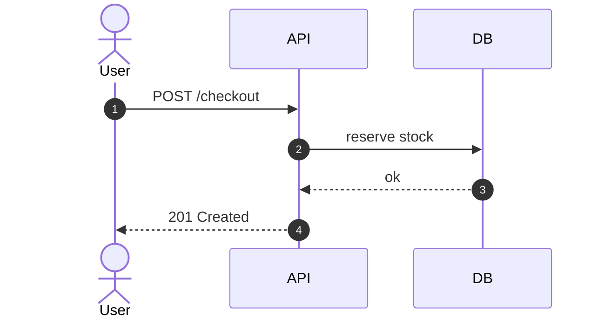
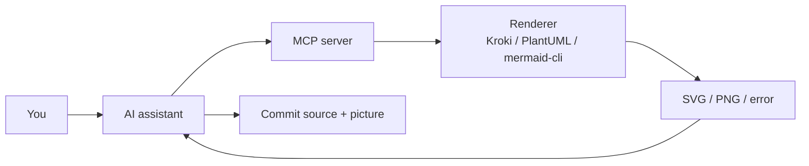

A concept is explained when someone **sees** the structure, the order, or the change — not when they finish a wall of prose.

You need three things:

1. **A clear question** (what should the viewer understand in ten seconds?)
2. **The right form** (flowchart vs sequence vs mind map vs short animation…)
3. **A tool whose source you can actually run** (Mermaid, diagrams.net, Manim Community…)

This guide is the **tool-first companion** to *Data Visualization for Beginners* (forms: which chart or diagram). That companion is still unpublished on this site; until it is, treat this page as the **builder catalog** — still images, motion, life-science figures, and **MCP** so an agent can render and check a diagram instead of inventing broken syntax.

> **Last verified:** October 2026. Licenses (including biology/icon assets), MCP package names, and Stack Overflow survey figures re-checked against primary pages. Community MCP repos move; pin versions at install time.

Five families:

| Family | Primary job | Examples |
| ------ | ----------- | -------- |
| **A. Diagram-as-code** | Text in Git → SVG/PNG in docs | Mermaid, PlantUML, Graphviz, D2, Kroki |
| **B. Canvas** | Drag boxes, sketch, workshop | diagrams.net, Excalidraw, Penpot, bpmn.io |
| **C. Life science** | Pathways, cells, named anatomy | Reactome, Cytoscape.js, Bioicons, Z-Anatomy |
| **D. Motion** | Time: transform, demo, voice-over | Glaxnimate, Pencil2D, Manim Community, Motion Canvas, OBS, VHS |
| **E. Agent renderers** | Validate/export from Cursor / Claude Code | PlantUML MCP, Excalidraw MCP, Markmap MCP, Kroki wrappers, Blender MCP |

Paid whiteboards (Miro, Lucid, Whimsical, IcePanel, Eraser SaaS) appear only as **contrast**. Source on GitHub is not the same as an OSI license — see [license traps](#license-traps-source-available-is-not-open-source).

## TL;DR — Pick a tool by the question

### Still pictures (structure)

| If you want to show… | Use this form | Prefer these OSS tools |
| -------------------- | ------------- | ---------------------- |
| **How a system is built / how parts talk** | Architecture / C4 | D2, C4-PlantUML, Graphviz, diagrams.net |
| **Step-by-step “if/then”** | Flowchart | Mermaid, diagrams.net, Nomnoml |
| **Who calls whom, in order** | Sequence diagram | Mermaid `sequenceDiagram`, PlantUML, D2 sequence |
| **States + what triggers a change** | State / lifecycle | Mermaid `stateDiagram`, PlantUML state |
| **How data enters, transforms, stores** | Data-flow / graph | Graphviz, D2, diagrams.net DFD shapes |
| **Brainstorm one topic outward** | Mind map | Markmap, Mermaid `mindmap`, Freeplane |
| **Standard business process exchange** | BPMN 2.0 | bpmn-js (keep the watermark), Kroki BPMN |
| **Hand-drawn workshop sketch** | Whiteboard | Excalidraw (MIT), diagrams.net sketch |
| **ASCII that diffs in a PR** | Boxes in text | svgbob, Pikchr, ditaa, D2 ASCII export |
| **Protocol bytes / digital timing** | Bytefield or waveform | [bytefield-svg](https://github.com/Deep-Symmetry/bytefield-svg) (EPL-2.0); [WaveDrom](https://wavedrom.com/) (MIT) |
| **Database schema as text** | ER / DBML | [DBML](https://www.dbml.org/) + [dbml-renderer](https://github.com/softwaretechnik-berlin/dbml-renderer) (ISC); [erd](https://github.com/BurntSushi/erd) (Unlicense); or Mermaid `erDiagram` |
| **Embed a diagram editor in a product** | JS graph/model library | JointJS (MPL-2.0), maxGraph, bpmn-js; not GoJS / JointJS+ |
| **Metabolic / signaling pathway** | Curated map or interaction network | [Reactome](https://reactome.org/) viewer; Cytoscape.js / desktop |
| **Cell / molecule figure (BioRender-style)** | Icon library + vector canvas | [Inkscape](https://inkscape.org/) + [Bioicons](https://bioicons.com/) (credit **per icon**) |
| **Lab apparatus / public-health pictogram** | Icon pack + canvas | Bioicons lab gear; [Health Icons](https://healthicons.org/) (CC0). [Chemix](https://chemix.org/) is **not OSS** |
| **Anatomy / organ systems** | Named 3D atlas or anatomogram | [Z-Anatomy](https://www.z-anatomy.com/) (Blender, CC BY-SA); [Open Anatomy](https://www.openanatomy.org/) + 3D Slicer |

### Motion (time)

| If you want to show… | Use this form | Prefer these OSS tools |
| -------------------- | ------------- | ---------------------- |
| **Lightweight SVG / Lottie / GIF for slides or web** | Vector motion | [Glaxnimate](https://glaxnimate.org/) ([GPL-3](https://invent.kde.org/graphics/glaxnimate); pairs with Kdenlive/Shotcut) |
| **Whiteboard / sketch explanation** | Frame-by-frame 2D | [Pencil2D](https://www.pencil2d.org/) ([GPL-2](https://github.com/pencil2d/pencil/blob/master/LICENSE.TXT)) |
| **Browser timeline tween (Flash-like)** | Vector clip | [Candlestick](https://github.com/Candlestickers/Candlestick) (GPL-3 fork; **alpha**). Upstream [Wick Editor](https://www.wickeditor.com/) is GPL-3 but the original project is largely unmaintained |
| **A concept transforming (math, CS, data)** | Programmatic 2D video | [Manim Community](https://docs.manim.community/en/stable/) |
| **UI-style motion + voice-over** | TypeScript animation | [Motion Canvas](https://motioncanvas.io/) |
| **3D / Grease Pencil metaphor** | Desktop 3D | [Blender](https://www.blender.org/) |
| **Click-through of a real UI** | Screen + voice | [OBS Studio](https://obsproject.com/) + [Kdenlive](https://kdenlive.org/) / [Shotcut](https://shotcut.org/) |
| **“Type this command” lesson** | Terminal tape | [VHS](https://github.com/charmbracelet/vhs) (MIT) or [asciinema](https://asciinema.org/) (GPL-3) |
| **Encode / concat / GIF** | CLI media | [FFmpeg](https://ffmpeg.org/) |

### AI agents (MCP)

Start with these three. Blender, cloud-icon Python, PlantUML, and the rest live in [Part E](#part-e-ai-agents-mcp-and-why-you-must-render). Hosted Mermaid Chart (`mcp.mermaid.ai`) is a **product**, not the MIT library — keep it out of this table.

| If the agent must… | Start with | Privacy note |
| ------------------ | ---------- | ------------ |
| **Render Mermaid / many languages and catch bad syntax** | Local [hustcc/mcp-mermaid](https://github.com/hustcc/mcp-mermaid) or mermaid-cli; **or** self-hosted Kroki via [uml-mcp](https://github.com/antoinebou12/uml-mcp) / [mcp-kroki](https://github.com/aescanero/mcp-kroki) | Do not POST internals to public kroki.io |
| **Hand-drawn sketch in chat** | [excalidraw/excalidraw-mcp](https://github.com/excalidraw/excalidraw-mcp) | Hosted `mcp.excalidraw.com` ToS ≠ MIT package |
| **Markdown outline → mind map** | [YuChenSSR/mindmap-mcp-server](https://github.com/YuChenSSR/mindmap-mcp-server) (HTML) or [isdmx/markmap-mcp-server](https://github.com/isdmx/markmap-mcp-server) (PNG/SVG) | Local/Docker preferred |

> Jump to [diagram-as-code](#part-a-diagram-as-code-text--picture), [canvas](#part-b-canvas-tools-workshops--icons), [life science](#part-c-life-science-pathways-cells-anatomy), [motion](#part-d-motion--video-when-a-still-picture-is-not-enough), or [MCP](#part-e-ai-agents-mcp-and-why-you-must-render).

## Table of Contents

- [TL;DR — Pick a tool by the question](#tldr--pick-a-tool-by-the-question)
- [Why this matters](#why-this-matters)
- [Core concepts](#core-concepts)
- [Choose by goal: decision flow](#choose-by-goal-decision-flow)
- [Part A: Diagram-as-code (text → picture)](#part-a-diagram-as-code-text--picture)
- [Part B: Canvas tools (workshops & icons)](#part-b-canvas-tools-workshops--icons)
- [Part C: Life science — pathways, cells, anatomy](#part-c-life-science-pathways-cells-anatomy)
- [Part D: Motion & video](#part-d-motion--video-when-a-still-picture-is-not-enough)
- [Part E: AI agents, MCP, and why you must render](#part-e-ai-agents-mcp-and-why-you-must-render)
- [Direct comparison](#direct-comparison)
- [Practical paths](#practical-paths)
- [License traps (source-available is not open source)](#license-traps-source-available-is-not-open-source)
- [Common mistakes](#common-mistakes)
- [When to use what](#when-to-use-what)
- [FAQ](#faq)
- [References](#references)

## Why this matters

Docs rot when the picture is a PNG nobody can edit. Workshops stall when every box lives in a paid cloud. Explainers fail when a static flowchart tries to show *change*.

| Situation | Text / screenshot alone | Better OSS visual |
| --------- | ----------------------- | ----------------- |
| README architecture | “See the wiki…” | Mermaid or D2 in the same file GitHub already renders |
| Design review | 40-box Lucid export | C4 Context + one Container (Structurizr DSL or C4-PlantUML) |
| Teaching a concept | Bullet definitions | Concept flowchart, Markmap, or a 60-second Manim clip |
| Paper / lecture cell figure | BioRender as the only path | Inkscape + Bioicons, Reactome, or Z-Anatomy |
| Agent-written docs | Plausible Mermaid that does not compile | MCP or Kroki **validate + PNG** in the loop |
| CLI lesson | Paste a transcript | VHS tape or asciinema cast |

GitHub has rendered fenced `mermaid` in Issues, PRs, wikis, and Markdown since February 2022 ([GitHub Blog](https://github.blog/developer-skills/github/include-diagrams-markdown-files-mermaid/), updated 23 Jul 2024; [Creating diagrams](https://docs.github.com/en/get-started/writing-on-github/working-with-advanced-formatting/creating-diagrams)). GitLab can render Mermaid, PlantUML, and optional Kroki ([GitLab Flavored Markdown](https://docs.gitlab.com/user/markdown/)). That is why diagram-as-code is the default for engineering docs.

## Core concepts

### One visual, one message

Title with the conclusion (“Checkout calls payment, then inventory”), not the file name (`diagram-v3`). If the viewer needs a lecture before they “get” it, pick a simpler form or split the picture.

### Still vs time

| Job | Question shape | Family |
| --- | -------------- | ------ |
| **Map** | How is it built? Who does what? | A or B (still) |
| **Biology map** | Which molecules, cells, or organs? | C (life science) |
| **Order** | What happens first? | Sequence / flowchart (A) |
| **Change** | How does X become Y? | D (motion) |
| **Check** | Did the model emit valid syntax? | E (MCP / Kroki / CLI) |

A sequence diagram shows **order**. A Manim clip shows **transformation**. Do not animate a flowchart unless motion adds information.

### How diagrams get built

| Build style | Best when | Weak when |
| ----------- | --------- | --------- |
| **Diagram-as-code** | Git diffs, PRs, docs beside code | Sticky-note workshops |
| **Canvas** | Icons, freeform layout, non-coders | Source of truth for a 5-year architecture |
| **Embeddable JS editor** | Product UI with boxes and links | Teaching a one-off slide (use diagrams.net) |
| **Curated pathway / atlas** | Expert maps, named anatomy | Inventing reactions or organs from clipart |
| **Icon library + vector** | Repeatable cell/molecule stills | Treating Bioicons/Servier as one MIT grant |
| **Data/render gateway (Kroki)** | One HTTP API for many languages | You only ever need GitHub Mermaid |
| **Programmatic video** | Repeatable explainers | One-off meeting recording (use OBS) |
| **MCP / CLI render** | Agents and CI | Treating a hosted MCP URL as “local OSS” |

### Audience first

| Audience | Prefer | Soften or avoid |
| -------- | ------ | --------------- |
| Non-technical | diagrams.net, Excalidraw, simple Mermaid flowchart | Unexplained C4 Level 4, raw DOT |
| Stakeholders | C4 Context/Container, one sequence | 80-box meshes |
| Engineers | Mermaid/D2 in Git, PlantUML, Graphviz | Metaphor icing that hides interfaces |
| Educators | Glaxnimate / Pencil2D for clips; Manim CE when the concept is math; Inkscape + Bioicons for biology figures | Remotion in a 4+ person company without reading the [license FAQ](https://www.remotion.dev/docs/license/faq); Canva or BioRender as “open source” |

## Choose by goal: decision flow

```mermaid
flowchart TD
    Q["What must the viewer understand?"] --> T{"Does time / transformation matter?"}
    T -->|Yes| Prec{"Need code-precise motion?"}
    Prec -->|Yes math/CS| Manim["Manim Community"]
    Prec -->|Yes TypeScript UI| MC["Motion Canvas"]
    Prec -->|No| Mot{"Mouse timeline vs sketch?"}
    Mot -->|SVG / Lottie / GIF| Glax["Glaxnimate"]
    Mot -->|Hand-drawn frames| P2d["Pencil2D"]
    Mot -->|Browser tween (alpha fork)| Wick["Candlestick / Wick"]
    Mot -->|Already on screen| Rec["OBS + Kdenlive / Shotcut"]
    T -->|No| BioQ{"Pathway, cell, or anatomy?"}
    BioQ -->|Yes curated map| Rx["Reactome"]
    BioQ -->|Yes icons / still| Ic["Inkscape + Bioicons"]
    BioQ -->|Yes named 3D| Za["Z-Anatomy / Slicer"]
    BioQ -->|No| Git{"Must live in Git / PRs?"}
    Git -->|Yes| Dac["Diagram-as-code"]
    Dac --> Kind{"Which still form?"}
    Kind -->|Flow, sequence, or state in Markdown| Mer["Mermaid"]
    Kind -->|Mind map from headings| Mm["Markmap"]
    Kind -->|Nested architecture| D2["D2 or Graphviz"]
    Kind -->|Real C4 model| C4["C4-PlantUML or Structurizr CLI"]
    Kind -->|Many languages, one API| Kroki["Kroki"]
    Git -->|No| Can{"Workshop or cloud icons?"}
    Can -->|Sketch| Ex["Excalidraw"]
    Can -->|Icons / infra| Dio["diagrams.net"]
    Can -->|BPMN XML| Bpmn["bpmn-js"]
```

If an **AI agent** writes the diagram, add a render step (MCP, Kroki, or `mmdc`) after this tree. Models are widely used and widely *almost right*: the 2025 Stack Overflow Developer Survey reports **84%** using or planning to use AI tools, **66%** frustrated that AI solutions are almost right, and more developers **distrust** AI accuracy (**46%**) than trust it (**33%**) ([survey.stackoverflow.co/2025](https://survey.stackoverflow.co/2025)). A renderer is a linter for pictures.

## Part A: Diagram-as-code (text → picture)

Maintain the **source as text**. The picture is a build artifact.

### Mermaid — “Markdown that GitHub already draws”

**What it is:** MIT library ([mermaid-js/mermaid](https://github.com/mermaid-js/mermaid)) with flowchart, sequence, class, state, ER, Gantt, git graph, mindmap, timeline, Sankey, and more ([mermaid.js.org](https://mermaid.js.org/)).

**Best for:** READMEs, GitHub/GitLab docs, this blog (`mermaid: true` in Chirpy).

**Not the same thing:** [mermaid.live](https://mermaid.live) (playground), GitHub’s bundled renderer (often behind npm), and [Mermaid Chart / mermaid.ai MCP](https://mermaid.ai/docs/ai/mcp-server) (product).

**Export:** [mermaid-cli](https://github.com/mermaid-js/mermaid-cli) (`mmdc`) → PNG/SVG/PDF (needs a Chromium stack).



*Typical Mermaid sequence for a README — edit the text, not the pixels.*

**Weak when:** deep nested containers, strict C4, Graphviz-quality layouts.

### PlantUML — “full UML, optional C4”

**What it is:** Diagram-as-code with a **multi-license** jar family (GPL-3 default text; also GPL-2, LGPL, Apache-2.0, EPL, MIT jars) ([plantuml.com/license](https://plantuml.com/license), [download](https://plantuml.com/download)). Generated **images are not GPL** just because you used PlantUML — the FAQ is explicit.

**Best for:** sequence, class, state, activity, component, deployment; **C4** via [C4-PlantUML](https://github.com/plantuml-stdlib/C4-PlantUML).

**GitHub:** not native. Use Kroki, a PlantUML server, GitLab, or CI.

**MCP:** npm `@plantuml/mcp-js` lives in the PlantUML repo ([plantuml-mcp-js](https://github.com/plantuml/plantuml/tree/master/plantuml-mcp-js)) — **no JVM**, **SVG output** (not a full PlantUML PNG server).

**Caveat:** Graphviz is often required. ditaa is omitted from some MIT jars.

### Graphviz (DOT) — “layout that still wins on graphs”

**What it is:** AT&T-era layout engines; current repo license **EPL-2.0** ([graphviz.org/license](https://graphviz.org/license/), [GitLab graphviz/graphviz](https://gitlab.com/graphviz/graphviz)).

**Best for:** dependency graphs, compilers’ output, data-flow meshes, large node-link pictures.

**Weak when:** you want GitHub-native Markdown with zero install.

### D2 — “readable architecture as code”

**What it is:** [d2lang.com](https://d2lang.com/) language, **MPL-2.0**. Nested containers, sequence (`shape: sequence_diagram`), sketch mode, ASCII export. Bundled layouts: **dagre** and **ELK**.

**Best for:** architecture that Mermaid flattens badly.

**License trap:** **TALA** (Terrastruct’s architecture layout) is a **separate commercial** engine — not part of the MPL-2.0 CLI default. Terrastruct’s hosted UI is also separate from the open language.

**MCP:** **no official server** as of maintainer comments on [terrastruct/d2#2518](https://github.com/terrastruct/d2/issues/2518) (2025). Community: [i2y/d2mcp](https://github.com/i2y/d2mcp).

### C4: Structurizr DSL and C4-PlantUML

The [C4 model](https://c4model.com/) is **notation-independent**. Tools implement views (Context, Container, Component, Code).

| Tool | License / status (retrieved 2026-10-04) | Use when |
| ---- | ---------------------------------------- | -------- |
| **[C4-PlantUML](https://github.com/plantuml-stdlib/C4-PlantUML)** | **[MIT](https://github.com/plantuml-stdlib/C4-PlantUML/blob/master/LICENSE)** | **Start here** if you already run PlantUML — live stdlib, not an archived viewer |
| **Structurizr DSL + CLI** | Follow [docs.structurizr.com](https://docs.structurizr.com/) for the current CLI/local path. [Lite](https://github.com/structurizr/lite) was MIT but is **archived**. Cloud/server is **open-core** | One model, many views; export to PlantUML/Mermaid. Do **not** clone Lite as the product |
| **Mermaid C4** | Fine for a sketch | Not a long-lived model |
| **IcePanel** | **Not OSS** | Contrast only |

### Markmap, Nomnoml, Pikchr, ASCII

| Tool | License (retrieved) | Best for |
| ---- | ------------------- | -------- |
| **[Markmap](https://markmap.js.org/)** | [MIT](https://github.com/markmap/markmap) | Mind maps from Markdown headings |
| **[Nomnoml](https://www.nomnoml.com/)** | [MIT](https://github.com/skanaar/nomnoml) | Small UML in the browser |
| **[Pikchr](https://pikchr.org/)** | [0-clause BSD](https://pikchr.org/home/doc/trunk/homepage.md) | Tiny PIC-like figures (SQLite-style); Kroki `pikchr` |
| **[svgbob](https://github.com/ivanceras/svgbob)** | [Apache-2.0](https://github.com/ivanceras/svgbob) | ASCII boxes → SVG; Kroki `svgbob` |
| **ditaa** | Follow the [PlantUML jar](https://plantuml.com/download) (GPL family includes it; MIT jar omits it) | ASCII art diagrams |

### Kroki — one HTTP API for the zoo

**[Kroki](https://kroki.io/)** gateway is **[MIT](https://github.com/yuzutech/kroki/blob/main/LICENSE)**; bundled diagram engines keep their own licenses ([`licenses/`](https://github.com/yuzutech/kroki/tree/main/licenses)). It accepts PlantUML, Graphviz, Mermaid, D2, BPMN, Excalidraw, Pikchr, svgbob, ditaa, blockdiag, C4, Structurizr, TikZ, and more ([usage](https://docs.kroki.io/kroki/setup/usage/)). POST JSON or GET deflate+base64.

**Use it as:** GitLab admin opt-in renderer, CI step, or the engine behind MCP wrappers. **Self-host** if diagrams contain internals. Public kroki.io is a convenience, not a vault.


### Niche diagram-as-code (specialty jobs)

These are OSS text→picture tools for **one job**. Prefer Mermaid/PlantUML/D2 first; reach here when the form matches. Most also render through [Kroki](https://kroki.io/).

| Tool | Job | License |
| ---- | --- | ------- |
| **[blockdiag](http://blockdiag.com/)** family (`seqdiag`, `actdiag`, `nwdiag`, `packetdiag`, `rackdiag`) | Simple block / sequence / network / rack pictures in Python | **Apache-2.0** |
| **[WaveDrom](https://wavedrom.com/)** | Digital timing diagrams from WaveJSON | **MIT** |
| **[bytefield-svg](https://github.com/Deep-Symmetry/bytefield-svg)** | Protocol / packet byte layouts | **EPL-2.0** |
| **[DBML](https://www.dbml.org/)** + **[dbml-renderer](https://github.com/softwaretechnik-berlin/dbml-renderer)** | Database schema as text → SVG | Language docs open; renderer **ISC**. [dbdiagram.io](https://dbdiagram.io/) is a **hosted** editor, not the OSS grant |
| **[erd](https://github.com/BurntSushi/erd)** | ER diagrams from a tiny text format (Haskell + Graphviz) | **Unlicense** |
| **[WireViz](https://github.com/wireviz/WireViz)** | Cable / wiring harness diagrams from YAML | **GPL-3.0** |
| **TikZ / PGF** (via LaTeX or Kroki `tikz`) | Publication figures in papers | LPPL-family TeX; steep — see [FAQ](#what-about-tikz--latex) |

**Not diagram-as-code for this catalog:** Vega / Vega-Lite (charts → data-viz companion), GraphQL schema visualizers, SchemaSpy (DB introspection HTML), and free SaaS editors (Eraser, Lucid, IcePanel). “Free to use in a browser” ≠ OSI.

### Bonus: Python “Diagrams” (cloud icons as code)

[mingrammer/diagrams](https://github.com/mingrammer/diagrams) (**[MIT](https://github.com/mingrammer/diagrams/blob/master/LICENSE)**) builds cloud architecture pictures from Python (Graphviz under the hood): declare AWS/GCP/Azure/K8s nodes as objects, wire them with `>>` / `<<`, export PNG/SVG with vendor icons. Handy when you already write Python. Still diagram-as-code — not a video tool.

## Part B: Canvas tools (workshops & icons)

### diagrams.net / draw.io — “the Apache editor with cloud stickers”

Editor source is **Apache-2.0** ([jgraph/drawio](https://github.com/jgraph/drawio)). Hosted [app.diagrams.net](https://app.diagrams.net) has its own [terms](https://www.drawio.com/trust/terms-of-use/). **draw.io** and **diagrams.net** are the same editor lineage with split branding; trademarks are not an Apache grant.

**Best for:** flowcharts, network/infra with AWS/GCP/K8s shape libraries, DFDs, export to PNG/SVG/XML.

Official intro: [Learn how to diagram with draw.io](https://www.youtube.com/watch?v=w3zm-wbmlpc) (draw.io channel).

### Excalidraw — “hand-drawn, MIT”

**[excalidraw/excalidraw](https://github.com/excalidraw/excalidraw)** is **MIT**. [excalidraw.com](https://excalidraw.com) is a hosted app with its own ToS; Excalidraw+ is paid.

**Best for:** informal architecture, teaching sketches, “this is a draft on purpose.”

**MCP:** [excalidraw/excalidraw-mcp](https://github.com/excalidraw/excalidraw-mcp), hosted [mcp.excalidraw.com](https://mcp.excalidraw.com).

### Penpot and Inkscape — polish, not UML

| Tool | License | Role |
| ---- | ------- | ---- |
| **[Penpot](https://penpot.app/)** | MPL-2.0 | Open design tool; UI explainers, self-host |
| **[Inkscape](https://inkscape.org/about/license/)** | GPL-2+ source; binaries often GPL-3 because of GPL-3 files | Finish SVGs from Mermaid/D2 for a blog hero |

### bpmn.io — workflows with a mandatory watermark

[bpmn-js](https://github.com/bpmn-io/bpmn-js) uses the **bpmn.io license**: MIT-like **plus a visible watermark you must not remove** ([bpmn.io/license](https://bpmn.io/license)). Use it when you need real **BPMN 2.0 XML**, not a flowchart labeled “BPMN.”

### Freeplane — desktop mind maps

[Freeplane](https://www.freeplane.org/) is a Java desktop mind mapper, **[GPL-2 or later](https://github.com/freeplane/freeplane/blob/1.13.x/license.txt)**. Use it for personal knowledge maps; use **Markmap** when the outline already lives in Markdown.


### Embed a diagram editor in a product (JS libraries)

[Cabot’s 2024 roundup](https://modeling-languages.com/javascript-drawing-libraries-diagrams/) is about **building a browser editor**, not picking a README tool. Use it when the picture must be *editable inside your app*. For a blog or GitHub doc, stay on Mermaid / diagrams.net.

| Library | Role | License trap |
| ------- | ---- | ------------ |
| **[JointJS](https://www.jointjs.com/)** ([clientIO/joint](https://github.com/clientIO/joint)) | SVG diagrams, ERD/UML-ish shapes, JSON (de)serialize | Core is **MPL-2.0**. **JointJS+** (ex-Rappid) is **commercial** ([license](https://www.jointjs.com/license)) |
| **[maxGraph](https://github.com/maxGraph/maxGraph)** | TypeScript successor to archived **mxGraph** (the engine behind diagrams.net) | **Apache-2.0**. Do not treat jgraph/mxgraph (archived) as maintained |
| **[diagram-js](https://github.com/bpmn-io/diagram-js)** + **bpmn-js** | Toolbox for BPMN / DMN / CMMN on the web | Same **bpmn.io watermark** rule as bpmn-js |
| **[Eclipse Sprotty](https://github.com/eclipse-sprotty/sprotty)** / **[GLSP](https://www.eclipse.org/glsp/)** | Custom modeling language + LSP-style backend | **EPL-2.0**. Right for a language workbench; wrong for a slide |
| **[projectstorm/react-diagrams](https://github.com/projectstorm/react-diagrams)** | React node-and-wire flows (Blender/LabVIEW-ish) | **MIT** |
| **[Svelvet](https://github.com/open-source-labs/Svelvet)** | Svelte node diagrams; D3 zoom | **MIT**. Svelte stack only |
| **jsPlumb Community** ([jsplumb/community-edition](https://github.com/jsplumb/community-edition)) | Connect DOM nodes with SVG edges | Dual **MIT or GPL-2**. That repo is **no longer updated**. **jsPlumb Toolkit** is commercial |
| **[vis-network](https://github.com/visjs/vis-network)** | Interactive networks in the browser | **Apache-2.0 or MIT**. Cabot marks **vis.js** abandoned; this is the maintained split. Still a *graph*, not UML |
| **[dagre](https://github.com/dagrejs/dagre)** | Directed-graph **layout** (x,y for nodes) | **MIT**. **dagre-d3** (the old D3 renderer) is abandoned; layout itself is what Mermaid-class tools sit on |
| **[@steelbreeze/state](https://github.com/steelbreeze/state)** (Cabot’s “state.js”) | Executable hierarchical FSM in TS/JS | **MIT**. It **runs** a machine; it does not draw one. Picture: Mermaid/PlantUML `state` |

**Same roundup, not diagram editors:** **[D3](https://d3js.org/)** (ISC) is a DOM/SVG substrate — charts belong in the data-viz companion, not this catalog. **Fabric.js**, **Paper.js**, **p5.js**, **Two.js** are canvas/vector APIs.

**Skip or contrast:** **GoJS**, **Mindfusion**, **JointJS+**, **jsPlumb Toolkit**, **yFiles** — products. **tldraw** is listed there as a drawing app; the **SDK is not OSI** (see traps). Abandoned: **vis.js** (use vis-network), **dagre-d3**, **Raphaël**, **Draw2D**, **jsUML2**. Comment-thread only: Blockly (blocks, not architecture), grafloria.

### Not OSS canvases (contrast)

Miro, Whimsical, Lucidchart, FigJam, IcePanel, **GoJS**, **JointJS+**, **Mindfusion**, **yFiles**: fine if the team already pays. They are not the open-source path. **tldraw.com** is usable as a website; the **SDK is not OSI open source** (production keys; see traps).

## Part C: Life science — pathways, cells, anatomy

BioRender is the usual paid default for cells and pathways. You do not need it for a teaching figure if you split the job: **curated pathway data**, **icon libraries**, or a **named 3D atlas**. Wang et al. (2015) still give the right encoding rule for biology software: pick **charts**, **networks**, or **hierarchies** before you pick a library ([Open source libraries and frameworks for biological data visualisation](https://pmc.ncbi.nlm.nih.gov/articles/PMC4409855/), *Proteomics*; PMC4409855). Cytoscape sits in the network family; a glycolysis textbook plate is not a scatterplot.

### Pathways and reactions

| Tool | What it is | License trap |
| ---- | ---------- | ------------ |
| **[Reactome](https://reactome.org/)** | Expert-curated human pathway database + [Diagram Viewer](https://reactome.org/dev/diagram) (export, or load by pathway ID such as glycolysis `R-HSA-70171`). Data **CC0**; illustrations/icons **CC BY 4.0**; most software **Apache-2.0** ([license](https://reactome.org/license)) | FoamTree overviews have a **special** vendor license — do not treat the whole site as Apache. Credit the art |
| **Reactome Diagram JS widget** | Embed a live map in a page via their HTTP API ([diagram JS](https://reactome.org/dev/diagram/js)). Pathway ID in; click events out | Hosted API: fine for public pathways; not an air-gapped atlas |
| **[Cytoscape](https://cytoscape.org/)** (desktop) + **[Cytoscape.js](https://js.cytoscape.org/)** (MIT) | Interaction **networks**: overlay expression or annotations on nodes/edges. Desktop for analysts; JS for a web canvas. Pair with **NetworkX** when the graph already lives in Python — export a node/edge list, then style metabolites vs enzymes. Same network idea as PMC4409855 | Cytoscape.js is not a pathway *database*; you still need Reactome, SBML, or a file |
| **[Gephi](https://gephi.org/)** | Large graphs when you are exploring a mesh, not teaching one reaction | Wrong first tool for a textbook glycolysis figure |

**Skip or contrast**

- **[Pathway Tools](https://pathwaytools.com/)** (SRI) — strong pathway collages and omics overlays, **not OSI OSS**. Academic/non-commercial license; commercial terms separately ([MetaCyc academic license](https://metacyc.org/ptools-academic-license.shtml), [SRI request form](https://bioinformatics.ai.sri.com/ptools/licensing/ptools-license-intermediate.shtml)).
- **[Viime-Path](https://github.com/girder/viime-path)** — Reactome + orthogonal layout (HOLA / WebCola / D3). The [bioRxiv preprint](https://www.biorxiv.org/content/10.1101/2023.03.07.531550v1) is **CC BY-NC-ND 4.0**. Parent [girder/viime](https://github.com/girder/viime) is Apache-2.0; the path repo has no SPDX `LICENSE` in the default tree — check before you ship. Not a default OSS stack.

### Anatomy and physiology

| Tool | Role | License |
| ---- | ---- | ------- |
| **[Z-Anatomy](https://www.z-anatomy.com/)** ([Blender template](https://github.com/Z-Anatomy/Models-of-human-anatomy)) | Layered, named 3D human atlas in Blender; isolate systems, cross-section, export frames. Pairs with Blender MCP if an agent should pose a camera | **CC BY-SA 4.0** on Z-Anatomy’s share; **also attribute BodyParts3D** (CC BY-SA 2.1 JP) and other nested credits in the repo README |
| **[Open Anatomy Project](https://www.openanatomy.org/)** | NIH-linked atlases authored in **[3D Slicer](https://www.slicer.org/)**; web indexes (e.g. SPL/NAC brain). Browser: [OABrowser](https://github.com/mhalle/oabrowser/) | [3D Slicer License](https://www.slicer.org/LICENSE) (BSD-like; extra medical-use wording). **Not a clinical device** |
| **Open 3D Man / [AnatomyTOOL](https://anatomytool.org/open3dmodel)** | University-backed educational meshes (skull, muscle, organs) | **CC BY-SA** — ShareAlike on derivatives |
| **EBI anatomograms / PyAnatomogram** | Color organs from a data map (expression, inflammation scores) using EBI Gene Expression SVG anatomograms ([PyPI](https://pypi.org/project/pyanatomogram/)) | Wrapper: **no SPDX on PyPI** — check Bitbucket before you ship. The **maps** are typically **CC BY 4.0** (EMBL-EBI Expression Atlas) |
| **[Vitessce](https://vitessce.io/)** (MIT) | Spatial omics / tissue dashboards (OME-Zarr, Jupyter + React). Related multimodal slide pipelines: [fusion-tools](https://pmc.ncbi.nlm.nih.gov/articles/PMC12462499/) | Wrong tool for a textbook organ sketch; right when the “anatomy” is a multiplexed slide |

**Technique:** still 2D teaching figure → Bioicons + Inkscape. Interactive public pathway → Reactome widget. Named 3D fly-through → Z-Anatomy in Blender (then OBS). Spatial cell atlas → Vitessce, not clipart.

### BioRender-style stills without BioRender

Drawing organelles from scratch is slow. Combine a **vector editor you already have** with **per-asset licenses**:

| Combo | How | Watch |
| ----- | --- | ----- |
| **Inkscape + [Bioicons](https://bioicons.com/)** | Site/repo is MIT; **each SVG keeps its own CC** (often CC BY 3.0 Servier, CC0, MIT). Paste into Inkscape, label, export PDF/SVG | Attribute **every** CC BY icon and note modifications ([Bioicons licensing primer](https://blog.bioicons.com/post/licensing/)) |
| **diagrams.net + [Servier Medical Art](https://smart.servier.com/)** | Import SVGs, connect with arrows for a physiological flowchart | Servier is **CC BY 3.0**, not public domain. Credit Servier on the slide |
| **Inkscape + [Health Icons](https://healthicons.org/)** ([repo](https://github.com/resolvetosavelives/healthicons)) | Public-health pictograms (outline/filled/negative, SVG+PNG) | **Icons CC0**; **repo MIT**. Good for clinics/campaigns, not organelles |
| **Inkscape + [SciDraw](https://www.scidraw.io/)** | Animals, rigs, and lab setups drawn by scientists | Credit the **drawing author** and SciDraw (DOI + logo on [about](https://www.scidraw.io/about/)). Not a single OSI grant |

Espinoza’s 2024 Medium list of “six open-source web-based” tools is [Bioicons, Servier, Health Icons, SciDraw, diagrams.net, Chemix](https://medium.com/@vespinozag/tools-to-illustrate-your-scientific-works-open-source-web-based-c5bd12aaec5b). **Chemix** ([chemix.org](https://chemix.org/)) is a useful **hosted lab-diagram app** (free tier; your drawings). It is **not OSI OSS**. Public/commercial use needs Chemix attribution unless you subscribe ([image license](https://help.chemix.org/article/24-license)).


Do not call the combo “one MIT license.” BioRender remains easier for teams that will pay for a house style; this path is for people who can credit sources.

### Embed vs export

- **Static paper/slide:** Inkscape + Bioicons / Health Icons (CC0) / SciDraw (credit author); diagrams.net + Servier; or Reactome PNG/SVG export. Lab glassware in a hurry: Chemix (SaaS, not OSS) or Bioicons apparatus SVGs.
- **Live web pathway:** Reactome Diagram widget (pathway ID in, click events out).
- **Custom network in a notebook or SPA:** build the graph (NetworkX or a file), render with **Cytoscape.js** (web) or Cytoscape desktop.
- **3D atlas stills/video:** Z-Anatomy / Slicer → PNG sequence or OBS.
- **Spatial tissue:** Vitessce — that is a dashboard, not a metaphor infographic.

## Part D: Motion & video (when a still picture is not enough)

Pick this family only when **time adds information** (a process changing, a path being traced, a command being typed). For a static architecture or flowchart, stay in Parts A–B. For cells and pathways, stay in Part C unless motion actually adds information.

Two output styles:

| Target | Typical files | First OSS pick |
| ------ | ------------- | -------------- |
| **Drop on a video timeline** (Resolve, Kdenlive, CapCut…) | MP4, WebM, GIF | Glaxnimate, Pencil2D, ManimCE, OBS |
| **Embed in slides / web / UI** (tiny, scalable) | Animated SVG, Lottie JSON, transparent GIF | Glaxnimate → then `lottie-web` to play |

Canva Animation Maker, SVGator, LottieFiles’ hosted creator, and Pixilart are **easy** but **not open source**. They sit in [contrast](#lightweight-motion-not-oss) only.

### Wick Editor / Candlestick — “browser timeline, with a caveat”

**[Wick Editor](https://www.wickeditor.com/)** ([Wicklets/wick-editor](https://github.com/Wicklets/wick-editor)) is **GPL-3**: timeline, clips, basic tweening, export to video/GIF, runs in the browser. The original project is **largely unmaintained** (community maintainers point new work at the fork). **[Candlestick](https://github.com/Candlestickers/Candlestick)** is a **GPL-3** community fork ([candlestickers.app](https://candlestickers.app)); it reads `.wick` files. As of late 2025–2026 it is still **alpha** — fine to try, not a “zero-install production” default.

**Best for:** short Flash-like concept loops if you accept alpha software.

**Prefer first:** Glaxnimate (vector/Lottie) or Pencil2D (sketch frames).

**Weak when:** you need Git-diffable diagram source (use Mermaid), or publication-quality math motion (use ManimCE).

### Pencil2D — “MS Paint with onion skin”

**[Pencil2D](https://www.pencil2d.org/)** ([pencil2d/pencil](https://github.com/pencil2d/pencil)) is **GPL-2**. Desktop, cross-platform, bitmap + vector layers, frame-by-frame. Not Evolus Pencil (GUI mockups).

**Best for:** whiteboard / sketch explainers you will drop into a video. Minimal chrome compared with Krita or Blender Grease Pencil.

**Weak when:** you want automatic tweens of SVG icons (use Glaxnimate or Wick) or code-driven diagrams (Manim / Motion Canvas).

### Glaxnimate — “SVG and Lottie without SVGator”

**[Glaxnimate](https://glaxnimate.org/)** is a KDE **GPL-3** vector animator ([invent.kde.org/graphics/glaxnimate](https://invent.kde.org/graphics/glaxnimate)). Tween vectors; export **Lottie**, animated **SVG/SMIL**, GIF/WebP, stills. It is a **separate app**: [Kdenlive opens it](https://docs.kdenlive.org/en/titles_and_graphics/graphics_and_animations/glaxnimate.html) as the animation editor (you set the binary path). Shotcut can drive Glaxnimate as a **producer** (timeline clip as background via IPC). Not “embedded inside” either NLE.

**Best for:** lightweight icons and concept motion that must stay sharp on a slide or a web page — the OSS answer to “SVGator / LottieFiles creator.”

**Play the file:** Airbnb **[lottie-web](https://github.com/airbnb/lottie-web)** (MIT) and related runtimes play JSON. That is **not** the same as the LottieFiles SaaS.

**Weak when:** you need After Effects feature-parity; Glaxnimate’s Lottie support is real but incomplete ([formats](https://docs.glaxnimate.org/en/formats.html)).

### Heavier OSS (keep off the “five-minute” path)

| Tool | License | When it is worth it |
| ---- | ------- | ------------------- |
| **[Synfig Studio](https://www.synfig.org/)** | GPL-3 | Bone rigs, long vector films; steep vs Wick/Glaxnimate |
| **[Krita](https://krita.org/)** | GPL | Painted frame-by-frame; a full illustration suite, not a concept tool |
| **Blender Grease Pencil** | GPL | 2D in a 3D app; overkill for a 15-second icon bounce |

### Manim Community — “equations that move”

**[ManimCE](https://docs.manim.community/en/stable/)** is **MIT**, forked from Grant Sanderson’s pipeline. Beginners should use **Manim Community**, not [3b1b/manim](https://github.com/3b1b/manim) (ManimGL). Pi creatures are **copyrighted**. Playground: [try.manim.community](https://try.manim.community). Quickstart: [tutorials/quickstart](https://docs.manim.community/en/stable/tutorials/quickstart.html).

**Best for:** math, algorithms, “watch this structure rewrite itself.”

**Weak when:** you only need a flowchart (use Mermaid) or photoreal 3D (use Blender).

### Motion Canvas — “TypeScript explainer engine”

**[motion-canvas/motion-canvas](https://github.com/motion-canvas/motion-canvas)** is **MIT**: generator-based animation + real-time editor, aimed at informative vector motion and voice-over ([motioncanvas.io](https://motioncanvas.io/)).

**Best for:** UI-shaped explainers if you already live in TypeScript. Strong OSS alternative when people say “Remotion” but need an OSI license.

### Blender, OBS, NLEs, FFmpeg

| Tool | License (retrieved) | Role |
| ---- | ------------------- | ---- |
| **[Blender](https://www.blender.org/about/license/)** | GPL-2+ source; binaries often GPL-3; **your artwork is yours** | 3D, Grease Pencil 2D |
| **[OBS Studio](https://obsproject.com/)** | GPL-2+ | Record canvas + voice + slides |
| **Kdenlive / Shotcut / OpenShot** | GPL-3 family | Cut the recording |
| **[FFmpeg](https://www.ffmpeg.org/legal.html)** | LGPL-2.1+; GPL if `--enable-gpl` | Concat, subtitles, GIF; codec/patent caveats |

### Terminal lessons: VHS vs asciinema

| Tool | License | Output | Best for |
| ---- | ------- | ------ | -------- |
| **[VHS](https://github.com/charmbracelet/vhs)** | MIT | GIF/MP4 from a `.tape` script | Reproducible “type this” clips in Git |
| **[asciinema](https://asciinema.org/)** | GPL-3+ | `.cast` + player | Shareable terminal, not always a pixel video |

### Slides-as-code (then record)

[reveal.js](https://github.com/hakimel/reveal.js) and [Marp](https://marp.app/) are **MIT**. **slides.com** is a paid host, not the reveal.js license. Record with OBS.

### Remotion — do not call it open source

[Remotion](https://www.remotion.dev/docs/license/faq) is **source-available, not OSI OSS**. Free for individuals and organizations of three or fewer; company license at four people. Code written by an agent still counts as a seat. Prefer **Motion Canvas** or **ManimCE** on an OSS-only stack.

### Lightweight motion (not OSS)

Easy does not mean open. Use these only if the team already lives there; they are **not** in the OSS catalog.

| Tool | What it actually is | OSS stand-in |
| ---- | ------------------- | ------------ |
| **Canva Animation Maker** | Free-tier SaaS; templates, motion paths | Glaxnimate (vector) or Pencil2D (sketch) |
| **SVGator** | Commercial SVG animator | **Glaxnimate** |
| **LottieFiles creator** | Hosted marketplace/editor | Glaxnimate export + **lottie-web** (MIT) to play |
| **Pixilart** | Free web/mobile pixel app; **not** an OSI project | [LibreSprite](https://libresprite.github.io/) (GPL-2 fork of old Aseprite) for pixel GIFs; or Pencil2D |
| **Aseprite** (compiled) | Source-available; binary redistribution restricted | LibreSprite |

## Part E: AI agents, MCP, and why you must render

[Model Context Protocol](https://modelcontextprotocol.io/) is a **pipe**: the assistant (Cursor, Claude Code, Claude Desktop, Windsurf, …) sends text to a specialized renderer and gets bytes or a URL back. It is not a video codec. Open-source MCP servers are strong at **static SVG/PNG, Markmap HTML, and sketch canvases**. Motion still means generating **code** (Manim, Motion Canvas, Blender Python) and rendering it **outside** MCP — or recording the screen with OBS.

MCP earns its keep when it **compiles** a diagram or **rejects** bad syntax. A model that dumps unrendered Mermaid into a README is how broken docs ship.

The same 2025 Stack Overflow survey that shows heavy AI adoption also shows **66%** “almost right” frustration and **46%** distrust of AI accuracy ([SO 2025](https://survey.stackoverflow.co/2025)). **52%** of respondents do not use agents or stick to simpler AI. If you *do* use agents for diagrams, render-in-the-loop is the whole point.



### What to plug in

| Server | Maintainer signal | Strength | Watch-out |
| ------ | ----------------- | -------- | --------- |
| [hustcc/mcp-mermaid](https://github.com/hustcc/mcp-mermaid) / [peng-shawn/mermaid-mcp-server](https://github.com/peng-shawn/mermaid-mcp-server) | Community | Local stdio/SSE; validate + export Mermaid | Vet like any npm MCP |
| [excalidraw-mcp](https://github.com/excalidraw/excalidraw-mcp) | Excalidraw org | Sketch in-chat; `.mcpb` for Claude Desktop; [MCP Apps](https://github.com/excalidraw/excalidraw-mcp) interactive canvas | Hosted `mcp.excalidraw.com` vs self-deploy; iterate later on [excalidraw.com](https://excalidraw.com/) |
| [YuChenSSR/mindmap-mcp-server](https://github.com/YuChenSSR/mindmap-mcp-server) | Community (MIT) | Markdown → Markmap **HTML** (pip) | HTML size vs `--return-type file` |
| [isdmx/markmap-mcp-server](https://github.com/isdmx/markmap-mcp-server) | Community (MIT) | Same Markmap stack; **PNG/JPG/SVG** export | Newer/smaller; still `npx` supply chain |
| [`@plantuml/mcp-js`](https://github.com/plantuml/plantuml/tree/master/plantuml-mcp-js) | PlantUML org tree | UML **SVG**, no JVM | Not a PNG/PlantUML-server replacement; confirm npm README |
| [walterfan/mcp-diagram-server](https://github.com/walterfan/mcp-diagram-server) | Community | PlantUML + Graphviz + Mermaid → SVG/PNG (Python/FastAPI) | PlantUML path still wants **Java** locally; not D2 |
| [ByteOverDev/diagrams-mcp](https://github.com/byteoverdev/diagrams-mcp) | Community | `mingrammer/diagrams` cloud icons + optional Mermaid/PlantUML | Graphviz required; executing Python diagrams is a sandbox concern |
| [i2y/d2mcp](https://github.com/i2y/d2mcp) | Community | D2 when you need nested architecture as code | **No official D2 MCP** ([d2#2518](https://github.com/terrastruct/d2/issues/2518)) |
| [antoinebou12/uml-mcp](https://github.com/antoinebou12/uml-mcp) | Community | 30+ Kroki types, `validate_uml` | Depends on Kroki/PlantUML/Mermaid.ink |
| [aescanero/mcp-kroki](https://github.com/aescanero/mcp-kroki) | Community | Per-type generate/validate against **your** Kroki | Pair with a local Kroki compose stack |
| [antvis/mcp-server-chart](https://github.com/antvis/mcp-server-chart) | AntV | 25+ **charts** + `generate_mind_map` | Charts ≠ C4; private SSR via `VIS_REQUEST_SERVER` |
| [Blender Lab MCP](https://www.blender.org/lab/mcp-server/) | Blender Foundation (experimental) | Docs + Python API for Blender **5.1+** | Not a 2D flowchart tool; needs add-on + client |
| [mcp-for-blender](https://pypi.org/project/mcp-for-blender/) (`ahujasid`) | Community MIT | Broader scene/object control on older Blender | **Not** made by Blender; arbitrary `bpy` is code exec |

The reference filesystem server is still published as [`@modelcontextprotocol/server-filesystem`](https://www.npmjs.com/package/@modelcontextprotocol/server-filesystem) from [modelcontextprotocol/servers](https://github.com/modelcontextprotocol/servers) (`src/filesystem`). Use it so an agent can write Manim/Motion Canvas/D2 source to a **pinned directory**. Other servers from that org were moved to **servers-archived** — do not copy old GitHub/Postgres examples from the archive. Check the [MCP registry](https://github.com/modelcontextprotocol/registry) at install time; community MCP is a supply-chain choice.

**No MCP required:** a shell tool calling **Kroki HTTP**, `mmdc`, or `plantuml.jar` is often easier to lock down in CI. You can wrap that HTTP later.

**Skip:** “sequential thinking” and other reasoning MCPs — they do not draw.

### MCP does not emit `.mp4`

Standard MCP tool results are text, JSON, images, or (with [MCP Apps](https://github.com/excalidraw/excalidraw-mcp)) an HTML widget. There is no native “here is a video payload” path. Honest motion setups:

| Approach | What actually happens | OSS? |
| -------- | --------------------- | ---- |
| Agent writes **ManimCE** / **Motion Canvas** + filesystem MCP or the terminal | Code lands on disk; you (or CI) render MP4 | Yes |
| Mermaid sequence / state via MCP | You get a **still** SVG/PNG. Click-through in mermaid.live or a chat artifact is UI chrome, not a video file | Mermaid.js is MIT; the MCP may not be |
| **Blender MCP** | Agent drives `bpy` (objects, cameras, keyframes); Blender renders | Blender GPL; MCP servers as above |
| **Remotion + filesystem MCP** | Agent writes React; Remotion renders | Filesystem MCP is OSS; **Remotion is not** ([FAQ](https://www.remotion.dev/docs/license/faq)) |

### MCP that is not open source (contrast)

| Server | What it is | OSS stand-in |
| ------ | ---------- | ------------ |
| **Miro MCP** (`mcp.miro.com`, `/miro:code_explain_on_board`) | Official **hosted** product; OAuth into Miro | Excalidraw MCP (sketch) or D2/Mermaid MCP (code-to-diagram). Mapping a git tree onto a **paid canvas** is not an OSS path |
| **Mermaid Chart MCP** | Product on `mcp.mermaid.ai` | hustcc / peng-shawn mermaid servers or mermaid-cli |
| **Java `mcp-diagram` JAR** (directory listings such as mcp.so) | Community binary; D2 + Mermaid advertised | Prefer a **GitHub repo you can read**: uml-mcp, mcp-kroki, walterfan, i2y/d2mcp |

For token-side MCP middleware (compression, not pictures), see [Reduce AI Token Usage — Part 2: Tools]().

## Direct comparison

Trap column only — first-choice tools are in the TL;DR and [When to use what](#when-to-use-what).

| Need | Not OSS / stale / trap | Use instead |
| ---- | ---------------------- | ----------- |
| Nested architecture as “OSS C4” | IcePanel, Eraser SaaS, Structurizr **Lite** clone | C4-PlantUML or current Structurizr CLI ([docs](https://docs.structurizr.com/)) |
| Mind map SaaS | Whimsical | Markmap |
| Whiteboard SDK in your app | tldraw **SDK** (keys) | Excalidraw MIT |
| Embed a graph editor in a product | GoJS, JointJS+, jsPlumb Toolkit as “open source JS” | JointJS MPL, maxGraph, or bpmn-js (keep watermark) |
| Cloud icon poster | Lucid | diagrams.net or mingrammer Diagrams |
| “BPMN” flowchart | Generic boxes labeled BPMN | bpmn-js (keep watermark) or a flowchart |
| Math/product video as “OSS React” | Remotion; 3b1b Pi creatures | ManimCE or Motion Canvas |
| Five-minute concept loop | Canva Animation Maker; **Wick Editor as if maintained** | Glaxnimate; Pencil2D; Candlestick only if you accept **alpha** |
| Tiny SVG/Lottie embed | SVGator, LottieFiles creator | Glaxnimate + lottie-web |
| Pixel GIF as “open source web app” | Pixilart | LibreSprite or Pencil2D |
| Record a GUI | Loom as the only path | OBS + Kdenlive/Shotcut |
| Agent diagrams | Unauthenticated hosted MCP; **Miro MCP** as OSS; Mermaid Chart as mermaid.js | Local mermaid MCP, Kroki, Excalidraw MCP |
| Agent “video MCP” | Remotion + filesystem MCP as open-source video | Filesystem MCP + ManimCE/Motion Canvas/Blender |
| Cell / pathway plate as “OSS BioRender” | BioRender; Servier as public domain; Bioicons as one MIT grant | Inkscape + **per-icon** Bioicons/Servier credit; Reactome for curated maps |

## Practical paths

- **Docs next to code:** Mermaid in Markdown (GitHub) → D2 when nesting hurts → Structurizr/C4-PlantUML when C4 is mandatory.  
- **Workshop then freeze:** Excalidraw or diagrams.net → rewrite the *kept* view as Mermaid/D2 in Git.  
- **Product canvas (editable in the browser):** JointJS (MPL) or maxGraph; BPMN XML → bpmn-js. Do not start from GoJS because a 2024 roundup listed it next to Mermaid.  
- **Cloud blueprint for a slide:** diagrams.net shape libraries, or Python Diagrams → SVG → Inkscape.  
- **Course video:** still diagram in Mermaid/D2 → narrate in OBS **or** rebuild the key transformation in ManimCE / Motion Canvas.  
- **Lightweight concept clip (no code):** Glaxnimate (vector) or Pencil2D (sketch frames) → drop MP4/GIF on the NLE timeline. Browser tween: Candlestick (alpha), not unmaintained Wick as the default.  
- **Icon motion on a slide or web page:** Glaxnimate → animated SVG or Lottie JSON; play Lottie with lottie-web. Not SVGator/LottieFiles.  
- **CLI course:** write a VHS `.tape` so the GIF is reproducible.  
- **Agent-assisted docs:** model drafts Mermaid/PlantUML → MCP or Kroki **must succeed** → commit **source + rendered SVG**. Never commit only a chat screenshot.  
- **Agent-assisted clip:** filesystem MCP (or the terminal) writes ManimCE / Motion Canvas / Blender Python → render locally. Do not expect MCP to return an `.mp4`.  
- **Biology teaching plate:** Inkscape + Bioicons (credit each SVG), Health Icons (CC0 pictograms), or SciDraw (credit author + DOI); diagrams.net + Servier (CC BY 3.0). Curated metabolism: Reactome export or widget. Interaction overlay: Cytoscape / Cytoscape.js. Lab setup: not Chemix-as-OSS — Bioicons apparatus or Chemix with their attribution rules.
- **Anatomy still or fly-through:** Z-Anatomy in Blender (CC BY-SA + BodyParts3D credit) or Open Anatomy / 3D Slicer; record with OBS if you need video.
- **Air-gapped:** self-host Kroki + mermaid-cli + PlantUML; skip `mcp.mermaid.ai` and public kroki.io. Reactome’s hosted widget is not air-gapped.

## License traps (source-available is not open source)

1. **mermaid.js vs mermaid.live vs Mermaid Chart MCP** — MIT is the **library**. The hosted MCP is a product ([docs](https://mermaid.ai/docs/ai/mcp-server)).  
2. **tldraw.com vs tldraw SDK** — the site is usable; production `@tldraw/tldraw` needs a [license key](https://tldraw.dev/community/license). 1.x MIT is a parked line. Hobby keys watermark.  
3. **draw.io vs diagrams.net** — same Apache editor; hosted terms and trademarks are separate.  
4. **Excalidraw package vs excalidraw.com** — MIT library; hosted ToS.  
5. **PlantUML jar family** — pick the download that matches ditaa/ELK needs; PNGs you generate are yours per [plantuml.com/license](https://plantuml.com/license).  
6. **bpmn-js watermark** — removing it violates [bpmn.io/license](https://bpmn.io/license).  
7. **Remotion** — [not OSI OSS](https://www.remotion.dev/docs/license/faq); headcount 4+ needs a company license. Pairing it with the **filesystem MCP** (OSS) does not change Remotion’s license.  
8. **Miro MCP** — official hosted connector; not an open-source diagram engine.  
9. **Structurizr Lite** — archived; server binaries are licensed/open-core. Use C4-PlantUML or the current CLI from [docs.structurizr.com](https://docs.structurizr.com/).  
10. **Eraser / IcePanel / Whimsical** — products. Eraser’s optional MIT renderer (2026) is not the SaaS.  
11. **Obsidian + Mermaid** — Mermaid syntax is OSS; **Obsidian is not** an OSS diagram product.  
12. **ManimCE vs 3b1b/manim** — [community docs](https://docs.manim.community/en/stable/).  
13. **Pencil (Evolus) vs Pencil2D** — GUI mockups vs 2D animation.  
14. **LottieFiles vs lottie-web vs Glaxnimate** — the runtime can be MIT; the hosted creator is not. Animate in Glaxnimate.  
15. **Pixilart / Canva / SVGator as “open source”** — free or web-based ≠ OSI.  
16. **Wick Editor vs Candlestick** — both GPL-3; Wick upstream is largely unmaintained. Candlestick is the living fork and still **alpha**.  
17. **FFmpeg** — LGPL vs GPL configure; codecs have extra legal layers.  
18. **Community MCP** — treat like any executable you `npx -y` in CI.  
19. **Bioicons vs MIT on the website** — the *repo* is MIT; **each icon keeps its own CC**. Credit Servier/CC BY assets ([primer](https://blog.bioicons.com/post/licensing/)).  
20. **Servier Medical Art** — **CC BY 3.0**, not public domain.  
21. **Reactome** — data CC0, art CC BY 4.0, software mostly Apache-2.0; FoamTree is a **special** license ([reactome.org/license](https://reactome.org/license)).  
22. **Pathway Tools** — academic/non-commercial, not OSI.  
23. **Viime-Path** — [preprint](https://www.biorxiv.org/content/10.1101/2023.03.07.531550v1) is **CC BY-NC-ND**; the path repo may lack SPDX — not a default OSS stack.  
24. **Z-Anatomy / AnatomyTOOL** — CC BY-SA (ShareAlike) plus nested BodyParts3D credits.  
25. **3D Slicer / Open Anatomy** — read the Slicer license medical-use wording; not a clinical device.  
26. **Vitessce** — MIT spatial dashboards, not clipart organs.  
27. **JointJS vs JointJS+** — MPL-2.0 core; **+** is paid ([jointjs.com/license](https://www.jointjs.com/license)).  
28. **jsPlumb Community vs Toolkit** — community MIT/GPL-2 and **unmaintained**; Toolkit is commercial.  
29. **mxGraph vs maxGraph vs diagrams.net** — original mxGraph is archived; **maxGraph** is the Apache-2.0 fork; the draw.io *app* is Apache but not “drop mxGraph into my SaaS overnight.”  
30. **Cabot 2024 JS list** — mix of OSS, commercial, and abandoned libraries. Filter by SPDX, not by the heading “JavaScript drawing libraries.”  
31. **vis.js vs vis-network** — the monolith is abandoned; **vis-network** is the living Apache/MIT split.  
32. **state.js** — [@steelbreeze/state](https://github.com/steelbreeze/state) is an FSM **runtime**, not a state *diagram* renderer.  
33. **Health Icons** — icons **CC0**; git repo **MIT** ([healthicons.org](https://healthicons.org/)).  
34. **SciDraw** — free drawings; **credit the author and SciDraw** (DOI), not “public domain pack.”  
35. **Chemix** — web lab editor, **not open source**. Espinoza lists it next to Bioicons; filter that. Attribution rules on [help.chemix.org](https://help.chemix.org/article/24-license).  
36. **D2 vs TALA** — D2 language/CLI is **MPL-2.0** (dagre/ELK); **TALA** layout and Terrastruct’s product UI are commercial.

## Common mistakes

| Mistake | Why it hurts | Fix |
| ------- | ------------ | --- |
| PNG-only architecture in Slack | Cannot review or reuse | Commit Mermaid/D2/PlantUML |
| 80-box “architecture” | Nobody can read it | C4 Context, then one Container |
| Flowchart used as a sequence | Order and actors disappear | `sequenceDiagram` / PlantUML seq |
| Mind map used as a concept map | Missing “how they relate” | Linking phrases, or a real concept map |
| Animating a static org chart | Motion without new information | Still diagram + one sentence |
| Calling Pixilart or Canva “open source” | Wrong license in an OSS roundup | Wick / Pencil2D / Glaxnimate / LibreSprite |
| Trusting chat Mermaid | SO “almost right” | MCP / Kroki / `mmdc` |
| Calling tldraw/Remotion “open source” | License surprise in production | Read vendor license pages |
| Public Kroki with internal names | Data leaves the building | Self-host |
| GitHub Mermaid vs local mermaid.js mismatch | Renders in live editor, fails on GitHub | Check GitHub `info` / supported subset |
| BPMN without the watermark | License violation | Keep bpmn.io badge or use a flowchart |
| Calling Bioicons “MIT, no credit” | CC BY icons in the pack | Credit **each** SVG ([primer](https://blog.bioicons.com/post/licensing/)) |
| Calling Servier public domain | Attribution missing | CC BY 3.0 — name Servier on the slide |
| Calling Chemix “open source” | SaaS next to Bioicons on a Medium list | Inkscape + Bioicons apparatus, or Chemix **with** their attribution |
| BioRender as “open source” | Wrong license in an OSS roundup | Inkscape + Bioicons, Reactome, or Z-Anatomy |

## When to use what

| Goal | Best form | Runner-up | Tool starter |
| ---- | --------- | --------- | ------------ |
| README tomorrow | Flowchart / sequence | State diagram | Mermaid |
| Nested services / networks | Architecture as code | Canvas with icons | D2 or Graphviz |
| Stakeholder system view | C4 Context/Container | Simple blocks | C4-PlantUML |
| API or checkout order | Sequence | Swimlane on canvas | Mermaid sequence |
| Object lifecycle | State machine | Swimlane | Mermaid / PlantUML state |
| Data path | Graph / DFD | Annotated flowchart | Graphviz / diagrams.net |
| Protocol bit layout | Bytefield | Annotated table | bytefield-svg |
| Digital timing | Waveform | Sequence | WaveDrom |
| DB schema in Git | ER / DBML | Mermaid ER | DBML renderer or erd |
| Cable harness | Wiring YAML | Hand-drawn | WireViz |
| Brainstorm | Mind map | Outline | Markmap |
| Facilitation workshop | Whiteboard | Stickies on paper | Excalidraw |
| Infra icons | Canvas or Python Diagrams | — | diagrams.net |
| In-app editable graph | Embed JS library | Export PNG from diagrams.net | JointJS or maxGraph |
| Interactive network widget | Graph library | Cytoscape.js | vis-network |
| Layout engine only | dagre | Graphviz on the server | dagrejs/dagre |
| Process standard | BPMN | Flowchart | bpmn-js |
| Math/CS video | Programmatic 2D | Slides + OBS | ManimCE |
| Quick concept loop, no code | Vector motion | Sketch frames | Glaxnimate |
| Hand-drawn explainer | Frame-by-frame | Grease Pencil | Pencil2D |
| Tiny SVG/Lottie embed | Vector motion | Transparent GIF | Glaxnimate |
| Product explainer | Motion Canvas | OBS recording | Motion Canvas |
| Terminal course | Tape/cast | Screen record | VHS |
| Agent-drawn UML | MCP + PlantUML/Kroki | CLI in CI | Kroki or PlantUML server (PNG); `@plantuml/mcp-js` is SVG-only |
| Metabolic / signaling map | Curated pathway | Custom network | Reactome; else Cytoscape.js |
| Cell / molecule still | Icons + vector | Canvas flowchart | Inkscape + Bioicons |
| Named anatomy | 3D atlas | Anatomogram | Z-Anatomy or Open Anatomy / Slicer |
| Spatial tissue | Multiplex dashboard | Overlay on a photo | Vitessce |

## FAQ

### What is the easiest OSS tool if I only need a flowchart in GitHub?

**Mermaid** in a fenced `mermaid` block. GitHub renders it natively ([docs](https://docs.github.com/en/get-started/writing-on-github/working-with-advanced-formatting/creating-diagrams)).

### Mermaid vs PlantUML vs D2?

| Need | Prefer |
| ---- | ------ |
| GitHub Markdown today, simple flows/sequences | **Mermaid** |
| Full UML or C4-PlantUML | **PlantUML** |
| Nested architecture, nicer containers | **D2** |
| Huge graphs / compiler-style meshes | **Graphviz** |

### Do I need MCP?

Only if an **agent** should render or validate. Humans can use mermaid.live, diagrams.net, or a CLI. MCP does not replace learning the form (see *Data Visualization for Beginners* when that companion is published). Cursor, Claude Code, Claude Desktop, and Windsurf are **clients**; pick the one you already use — the servers above are the catalog.

### Can MCP generate video?

Not as a first-class payload. Generate **code** (ManimCE, Motion Canvas, Blender) and render it, or record the UI. Mermaid sequence/state diagrams from MCP are still **images** unless you click through them in a live viewer.

### Is Kroki a replacement for MCP?

It is a **renderer**. MCP is a **plug**. Many MCP servers call Kroki. In CI, HTTP to Kroki is enough.

### Can I use these pictures commercially?

Follow **each tool’s license**. Mermaid/Excalidraw/Markmap MIT is straightforward. PlantUML: follow the jar you downloaded; images you author are yours per their license page. bpmn-js keeps the watermark. Blender: your artwork is yours. Do not ship tldraw SDK or Remotion under “MIT because GitHub.” Bioicons and Servier are **per-asset** (often CC BY): credit the icon author, not only “MIT Bioicons.” Reactome maps need the art/data split on [reactome.org/license](https://reactome.org/license). CC BY-SA anatomy (Z-Anatomy, Open 3D Man) ShareAlike-binds derivatives.

### Flowchart vs sequence vs state vs data flow?

- **Flowchart** — steps and decisions.  
- **Sequence** — messages between named actors over time.  
- **State / lifecycle** — states of *one* object and transitions.  
- **Data flow** — where information moves and sits (stores, transforms).

### Mind map vs architecture diagram?

A **mind map** is a radial outline. An **architecture diagram** shows runtime/deployable parts and links. Do not present a mind map as a system design.

### Manim vs Motion Canvas vs Wick vs OBS?

**Glaxnimate** if the deliverable is SVG/Lottie. **Pencil2D** if you draw frames. **Candlestick** (Wick fork, alpha) only if you want a browser timeline and accept instability. **ManimCE** if the idea is mathematical or tightly scripted 2D. **Motion Canvas** if you want a TypeScript editor and product-like motion. **OBS** if the truth is already on screen (IDE, diagrams.net, a cluster UI).

**Synfig** and **Krita** are excellent OSS, but they are the wrong first tool for rapid concept sketching — bones/paint suites, not five-minute explainers.

### What replaces BioRender in this catalog?

Nothing as a single house-style SaaS. **Inkscape + Bioicons** (or diagrams.net + Servier) for stills; **Health Icons** for CC0 public-health pictograms; **SciDraw** for credited animal/setup drawings; **Reactome** for curated pathways; **Cytoscape.js** for custom networks; **Z-Anatomy / Open Anatomy** for named 3D anatomy. Vitessce is for spatial omics, not a metaphor cell. Chemix is a handy lab-diagram **website**, not an OSS stack.


### I need a JavaScript library inside my web app, not a README picture

That is a different job than this catalog’s default. Start with [Cabot 2024](https://modeling-languages.com/javascript-drawing-libraries-diagrams/) **after** you filter licenses: **JointJS** (MPL-2.0) or **maxGraph** (Apache-2.0) for generic graphs; **bpmn-js** for BPMN XML; **react-diagrams** / **Svelvet** for node-wire UIs; **Sprotty/GLSP** for a custom language. Skip GoJS, JointJS+, and the tldraw SDK if the requirement is OSI.

### Is draw.io open source?

The **editor** ([jgraph/drawio](https://github.com/jgraph/drawio)) is Apache-2.0. The **hosted app** is a service with terms. Self-host or use the desktop app if that distinction matters.

### What about TikZ / LaTeX?

Unbeatable in papers; steep. Kroki can render `tikz`. For blogs and READMEs, start with Mermaid.

## References

### Forms and C4

- Companion (forms): *Data Visualization for Beginners* — unpublished on this site at last verification; this post is the tool catalog
- [C4 model](https://c4model.com/)
- [GitHub: Creating diagrams](https://docs.github.com/en/get-started/writing-on-github/working-with-advanced-formatting/creating-diagrams)
- [GitHub Blog: Mermaid in Markdown (2022, updated 2024)](https://github.blog/developer-skills/github/include-diagrams-markdown-files-mermaid/)
- [GitLab Flavored Markdown diagrams](https://docs.gitlab.com/user/markdown/)

### Diagram-as-code and canvas

- [Mermaid](https://mermaid.js.org/) · [mermaid-cli](https://github.com/mermaid-js/mermaid-cli) · [mermaid.live](https://mermaid.live)
- [PlantUML license](https://plantuml.com/license) · [C4-PlantUML](https://github.com/plantuml-stdlib/C4-PlantUML)
- [Graphviz license](https://graphviz.org/license/) · [D2](https://d2lang.com/) · [Structurizr docs](https://docs.structurizr.com/)
- [Kroki](https://kroki.io/) · [Kroki HTTP usage](https://docs.kroki.io/kroki/setup/usage/)
- [Markmap](https://markmap.js.org/) · [Nomnoml](https://www.nomnoml.com/) · [Pikchr](https://pikchr.org/)
- [blockdiag](http://blockdiag.com/) · [WaveDrom](https://wavedrom.com/) · [bytefield-svg](https://github.com/Deep-Symmetry/bytefield-svg)
- [DBML](https://www.dbml.org/) · [dbml-renderer](https://github.com/softwaretechnik-berlin/dbml-renderer) · [erd](https://github.com/BurntSushi/erd) · [WireViz](https://github.com/wireviz/WireViz)
- [diagrams.net / draw.io](https://www.drawio.com/) · [jgraph/drawio](https://github.com/jgraph/drawio)
- [Excalidraw](https://github.com/excalidraw/excalidraw) · [Penpot](https://penpot.app/) · [Inkscape license](https://www.inkscape.org/about/license/)
- [bpmn.io license](https://bpmn.io/license) · [mingrammer/diagrams](https://github.com/mingrammer/diagrams)
- [Cabot 2024: JS drawing libraries](https://modeling-languages.com/javascript-drawing-libraries-diagrams/) · [JointJS license](https://www.jointjs.com/license) · [maxGraph](https://github.com/maxGraph/maxGraph) · [Sprotty](https://github.com/eclipse-sprotty/sprotty) · [react-diagrams](https://github.com/projectstorm/react-diagrams)
- [vis-network](https://github.com/visjs/vis-network) · [dagre](https://github.com/dagrejs/dagre) · [@steelbreeze/state](https://github.com/steelbreeze/state) · [Svelvet](https://github.com/open-source-labs/Svelvet)
- [svgbob (Apache-2.0)](https://github.com/ivanceras/svgbob) · [Freeplane license](https://github.com/freeplane/freeplane/blob/1.13.x/license.txt)

### Life science

- [Wang et al. 2015, PMC4409855](https://pmc.ncbi.nlm.nih.gov/articles/PMC4409855/) — charts vs networks vs hierarchies
- [Reactome](https://reactome.org/) · [license](https://reactome.org/license) · [Diagram Viewer](https://reactome.org/dev/diagram) · [diagram JS](https://reactome.org/dev/diagram/js)
- [Cytoscape](https://cytoscape.org/) · [Cytoscape.js](https://js.cytoscape.org/) · [Gephi](https://gephi.org/)
- [Bioicons](https://bioicons.com/) · [licensing primer](https://blog.bioicons.com/post/licensing/)
- [Servier Medical Art](https://smart.servier.com/)
- [Health Icons](https://healthicons.org/) · [resolvetosavelives/healthicons](https://github.com/resolvetosavelives/healthicons)
- [SciDraw](https://www.scidraw.io/) · [about / credit](https://www.scidraw.io/about/)
- [Chemix](https://chemix.org/) (hosted; not OSS) · [image license](https://help.chemix.org/article/24-license)
- [Espinoza 2024, Medium](https://medium.com/@vespinozag/tools-to-illustrate-your-scientific-works-open-source-web-based-c5bd12aaec5b) — six web tools; Chemix is not OSI
- [Z-Anatomy](https://www.z-anatomy.com/) · [Models-of-human-anatomy](https://github.com/Z-Anatomy/Models-of-human-anatomy)
- [Open Anatomy](https://www.openanatomy.org/) · [3D Slicer](https://www.slicer.org/) · [OABrowser](https://github.com/mhalle/oabrowser/)
- [AnatomyTOOL Open 3D Man](https://anatomytool.org/open3dmodel)
- [PyAnatomogram](https://pypi.org/project/pyanatomogram/)
- [Vitessce](https://vitessce.io/) · [fusion-tools (PMC12462499)](https://pmc.ncbi.nlm.nih.gov/articles/PMC12462499/)
- Pathway Tools [academic license](https://metacyc.org/ptools-academic-license.shtml) (contrast) · [Viime-Path](https://github.com/girder/viime-path) · [preprint CC BY-NC-ND](https://www.biorxiv.org/content/10.1101/2023.03.07.531550v1)

### Motion

- [Wick Editor](https://www.wickeditor.com/) · [Wicklets/wick-editor (GPL-3)](https://github.com/Wicklets/wick-editor) — largely unmaintained
- [Candlestick](https://github.com/Candlestickers/Candlestick) (GPL-3 fork; alpha)
- [Pencil2D](https://www.pencil2d.org/) · [pencil2d/pencil (GPL-2)](https://github.com/pencil2d/pencil)
- [Glaxnimate](https://glaxnimate.org/) · [Kdenlive integration](https://docs.kdenlive.org/en/titles_and_graphics/graphics_and_animations/glaxnimate.html) · [formats (Lottie/SVG)](https://docs.glaxnimate.org/en/formats.html)
- [lottie-web (MIT runtime)](https://github.com/airbnb/lottie-web) — not the LottieFiles SaaS
- [LibreSprite](https://libresprite.github.io/) (pixel GIFs; GPL-2)
- [Manim Community](https://docs.manim.community/en/stable/) · [try.manim.community](https://try.manim.community)
- [Motion Canvas](https://motioncanvas.io/) · [Blender license](https://www.blender.org/about/license/)
- [OBS Studio](https://obsproject.com/) · [FFmpeg legal](https://www.ffmpeg.org/legal.html)
- [VHS](https://github.com/charmbracelet/vhs) · [asciinema](https://asciinema.org/)
- [Synfig](https://www.synfig.org/) · [Krita](https://krita.org/) (steeper; not first-line concept tools)
- [Remotion license FAQ](https://www.remotion.dev/docs/license/faq) (not OSI OSS)
- [tldraw license](https://tldraw.dev/community/license) (SDK not OSI OSS)

### MCP and surveys

- [Model Context Protocol](https://modelcontextprotocol.io/) · [MCP servers repo](https://github.com/modelcontextprotocol/servers) · [`@modelcontextprotocol/server-filesystem`](https://www.npmjs.com/package/@modelcontextprotocol/server-filesystem)
- [Mermaid Chart MCP](https://mermaid.ai/docs/ai/mcp-server) (product; contrast)
- [PlantUML mcp-js](https://github.com/plantuml/plantuml/tree/master/plantuml-mcp-js)
- [Excalidraw MCP](https://github.com/excalidraw/excalidraw-mcp)
- [YuChenSSR/mindmap-mcp-server](https://github.com/YuChenSSR/mindmap-mcp-server) · [isdmx/markmap-mcp-server](https://github.com/isdmx/markmap-mcp-server)
- [walterfan/mcp-diagram-server](https://github.com/walterfan/mcp-diagram-server) · [ByteOverDev/diagrams-mcp](https://github.com/byteoverdev/diagrams-mcp)
- [uml-mcp](https://github.com/antoinebou12/uml-mcp) · [mcp-kroki](https://github.com/aescanero/mcp-kroki)
- [Blender Lab MCP](https://www.blender.org/lab/mcp-server/) · [mcp-for-blender](https://pypi.org/project/mcp-for-blender/) (community; not Blender)
- [AntV mcp-server-chart](https://github.com/antvis/mcp-server-chart)
- [Stack Overflow Developer Survey 2025](https://survey.stackoverflow.co/2025)
