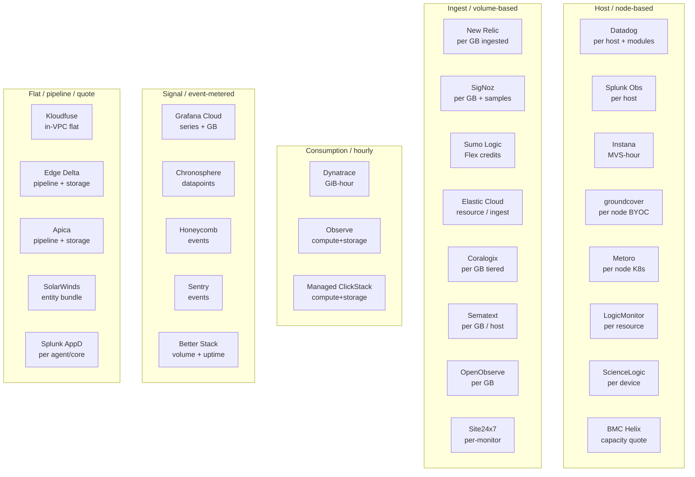

Open-source platforms cover a lot of ground, but many teams still buy a managed commercial platform to eliminate backend operational overhead. When evaluating **paid observability platform pricing**, a direct "$/month" comparison is almost meaningless without knowing *what* is being metered — hosts, ingested GB, events, data points, active metric series, users, or compute credits.

This post provides a comprehensive **enterprise observability pricing comparison** across **29 commercial platforms** supporting logs, metrics, and traces. The unified table below acts as the canonical benchmark: comparing signal coverage, primary pricing meters, public list pricing structures, trial/free tier access, and official vendor documentation. Detailed notes expose the most common pricing traps. For self-hosted alternatives, see our companion [open-source observability platform comparison]().

> **Pricing changes often.** All figures reflect public list prices as of **September 2026**, sourced directly from vendor pricing cards. Committed-use contracts are typically negotiable and lower. Always verify directly on vendor sites before finalizing infrastructure budgets.

### TL;DR: Quick Recommendations

| Use case | Best fit | Why |
| :--- | :--- | :--- |
| **Broadest feature set, deep integrations** | Datadog | Widest module catalog; metered per dimension |
| **Predictable, ingest-based bill** | New Relic | One meter (GB ingested) + per-seat users |
| **Deepest automatic full-stack + AI** | Dynatrace | OneAgent auto-discovery, Davis AI |
| **Streaming metrics at scale** | Splunk Observability | Real-time SignalFx-based analytics |
| **Prometheus/OTel-native, PAYG** | Grafana Cloud | LGTM stack managed, generous free tier |
| **Search + logs heritage** | Elastic Cloud | Resource- or ingest-based, OTel-native |
| **High-cardinality wide events** | Honeycomb | Event-based pricing, cardinality is free |
| **Cost-controlled metrics at huge scale** | Chronosphere | Control plane trims data before you pay |
| **Cheapest usage-based, OTel-first** | SigNoz Cloud | $0.30/GB, no per-host/per-user fees |

The questions that matter when buying:

- What exactly is metered, and can one noisy service blow up the bill?
- Are logs, metrics, and traces billed on the same meter or separately?
- Do I pay per user/seat on top of data?
- Is there a usable free tier, and where's the enterprise-feature boundary?

---

## Table of Contents

- [Selection Criteria](#selection-criteria)
- [The Candidates: Unified Comparison](#the-candidates-unified-comparison)
- [Observability Pricing Models at a Glance](#observability-pricing-models-at-a-glance)
- [Per-Tool Pricing Detail](#per-tool-pricing-detail)
  - [Datadog](#datadog)
  - [New Relic](#new-relic)
  - [Dynatrace](#dynatrace)
  - [Splunk Observability Cloud](#splunk-observability-cloud)
  - [Grafana Cloud](#grafana-cloud)
  - [Elastic Cloud](#elastic-cloud)
  - [Sumo Logic](#sumo-logic)
  - [Honeycomb](#honeycomb)
  - [Chronosphere](#chronosphere)
  - [SigNoz Cloud](#signoz-cloud)
- [How to Compare Real Cost & Avoid Pricing Traps](#how-to-compare-real-cost--avoid-pricing-traps)
- [Frequently Asked Questions (FAQ)](#frequently-asked-questions-faq)
- [References](#references)

---

## Selection Criteria

| Criterion | Requirement |
| :--- | :--- |
| **Signals** | Supports logs + metrics + traces (all, or a strong minimum of two with the third available) |
| **Delivery** | Commercial SaaS / managed (paid) — self-managed enterprise editions noted where relevant |
| **OTel support** | Accepts OpenTelemetry (OTLP) |
| **Scope** | General-purpose observability, not single-signal only |

**Excluded:** single-signal-only tools, pure SIEM, and free-only OSS (covered in the [open-source comparison]()).

---

## The Candidates: Unified Comparison

> **Reading the table:** `✅` = clearly supported, `◐` = partial/newer/available through an integration, `—` = not a focus. Prices are current public list prices or starting prices where published; rows marked *quote-based* mean the vendor does not publish a usable rate card. “Free” means a continuing free tier; “Trial” means time-limited access.

| Platform | Logs | Metrics | Traces / APM | RUM | OTLP | Pricing meter | Current public pricing structure | Free / trial | Official pricing or product page |
| :--- | :---: | :---: | :---: | :---: | :---: | :--- | :--- | :--- | :--- |
| **Datadog** | ✅ | ✅ | ✅ | ✅ | ✅ | Host + GB + product units | Infrastructure from ~$15/host/mo; APM, logs, custom metrics, RUM and synthetics are separate meters | Free up to 5 hosts | [pricing](https://www.datadoghq.com/pricing/) |
| **New Relic** | ✅ | ✅ | ✅ | ✅ | ✅ | Data ingest + users or compute | 100 GB/mo free; paid plans combine data ingest with core/full-platform users or compute | Free tier | [pricing](https://newrelic.com/pricing) |
| **Dynatrace** | ✅ | ✅ | ✅ | ✅ | ✅ | Hourly consumption | Foundation $7/host/mo; Infrastructure $29/host/mo; Full-Stack $58 per 8 GiB host/mo; logs from $0.20/GiB ingest | Trial | [pricing](https://www.dynatrace.com/pricing/) |
| **Splunk Observability Cloud** | ✅ | ✅ | ✅ | ✅ | ✅ | Host bundle | Infrastructure $15/host/mo; App & Infra $60; End-to-End $75, billed annually | 14-day trial | [pricing](https://www.splunk.com/en_us/products/pricing/observability.html) |
| **Grafana Cloud** | ✅ | ✅ | ✅ | ✅ | ✅ | Active series + GB + add-ons | Free tier; Pro has a $19/mo platform fee plus usage; Enterprise custom | Free tier | [pricing](https://grafana.com/pricing/) |
| **Elastic Cloud** | ✅ | ✅ | ✅ | ✅ | ✅ | Resource-based or ingest/retention | Hosted is resource-based; Serverless Observability is usage-based; self-managed is license/node based | Trial | [pricing](https://www.elastic.co/pricing/) |
| **Sumo Logic** | ✅ | ✅ | ✅ | ◐ | ✅ | Flex credits | Product/data configuration is quoted at subscription; credits cover logs, metrics, traces and query/scan usage | Limited free tier | [pricing](https://www.sumologic.com/pricing) |
| **Honeycomb** | ◐ | ✅ | ✅ | — | ✅ | Events + metric data points | Free and Pro tiers with event-volume limits; Enterprise is custom; Pro includes up to 3.75B metric points/mo | Free tier | [pricing](https://honeycomb.io/pricing) |
| **Chronosphere** | ✅ | ✅ | ✅ | — | ✅ | Persisted datapoints or capacity | Contract/quote-based; consumption measures persisted metric datapoints and supports data shaping before storage | Demo | [platform](https://chronosphere.io/platform/) |
| **SigNoz Cloud** | ✅ | ✅ | ✅ | — | ✅ | GB + metric samples | Teams starts at $49/mo including $49 usage; logs/traces $0.30/GB; metrics $0.10/million samples; Enterprise from $4,000/mo | Trial / self-hosted community | [pricing](https://signoz.io/pricing/) |
| **IBM Instana** | ✅ | ✅ | ✅ | ✅ | ✅ | Managed virtual server hours | Pay-per-use from $0.03 per MVS-hour; 14-day full-access trial | Trial | [pricing](https://www.ibm.com/products/instana/pricing) |
| **SolarWinds Observability SaaS** | ✅ | ✅ | ✅ | ✅ | ✅ | Service + node + GB + checks | App $27.50/service/mo; infrastructure $15.75/node/mo; logs $5/GB/mo; RUM $10/100k page views | Trial | [pricing](https://www.solarwinds.com/solarwinds-observability/pricing) |
| **LogicMonitor (LM Envision)** | ✅ | ✅ | ✅ | ◐ | ✅ | Monitored resources | Quote-based; LM Envision is the current LogicMonitor platform and pricing is tied to monitored resources | Demo | [platform](https://www.logicmonitor.com/platform/) |
| **Observe by Snowflake** | ✅ | ✅ | ✅ | — | ✅ | Lakehouse compute + storage | Quote/consumption-based; Snowflake credits can be applied, but no public unit rate is shown | Demo | [product](https://www.snowflake.com/en/product/observe/) |
| **Kloudfuse** | ✅ | ✅ | ✅ | ✅ | ✅ | Fixed capacity in your cloud | Flat-pricing, Self-SaaS/BYOC model; public per-unit price is not shown; no overage or per-seat fees | Demo | [product](https://www.kloudfuse.com/) |
| **Coralogix** | ✅ | ✅ | ✅ | ✅ | ✅ | GB by signal + AI tokens | Logs $0.42/GB; traces $0.16/GB; metrics $0.06/GB; AI $1.50/million tokens; features, users and hosts included | No public free tier shown | [pricing](https://www.coralogix.com/pricing/) |
| **Sematext Cloud** | ✅ | ✅ | ✅ | ✅ | ✅ | Per app/host/GB | Logs from $4.50/mo; infrastructure $2.80/mo; tracing $19/mo; 14-day trial; usage depends on hosts, containers, data and retention | 14-day trial | [pricing](https://sematext.com/pricing/) |
| **ManageEngine Site24x7** | ✅ | ✅ | ✅ | ✅ | ◐ | Monitor bundles + add-ons | Plans start at $9/mo; fixed monitor allocations, with APM, logs, RUM and other capabilities sold in packs/add-ons | 30-day trial | [pricing](https://www.site24x7.com/site24x7-pricing.html) |
| **Apica Observe (Ascent)** | ✅ | ✅ | ✅ | — | ✅ | Quote / telemetry capacity | Quote-based; Ascent combines collection, shaping, storage and observability, positioning pipeline optimization as the cost lever | Demo | [product](https://www.apica.io/) |
| **ScienceLogic AI Platform** | ✅ | ✅ | ◐ | — | ✅ | Managed devices | Skylar One from $5/device/mo; Advanced from $6; Compliance from $12; HA from $20; Analytics/Advisor quote | Trial / demo | [pricing](https://sciencelogic.com/why-sciencelogic/pricing) |
| **BMC Helix Observability & AIOps** | ✅ | ✅ | ✅ | — | ✅ | Enterprise capacity / quote | Public product page describes usage across events, metrics, logs and topology; no public rate card | Demo | [product](https://www.bmc.com/it-solutions/observability-aiops.html) |
| **Splunk AppDynamics** | ✅ | ✅ | ✅ | ✅ | ✅ | Enterprise license / quote | Quote-based business-transaction and application observability licensing; separate from Splunk Observability Cloud | Demo | [product](https://www.splunk.com/en_us/products/splunk-appdynamics.html) |
| **groundcover** | ✅ | ✅ | ✅ | ◐ | ✅ | Average monitored nodes | Free; Pro $30/host/mo; Enterprise $35/host/mo; On-Prem $50/host/mo; averages monitored Kubernetes/Linux hosts | Free tier | [pricing](https://www.groundcover.com/pricing) |
| **Metoro** | ✅ | ✅ | ✅ | — | ✅ | Kubernetes nodes | $20/node/mo; Hobby is free up to 2 nodes; AI SRE model usage passed through at cost | Free up to 2 nodes | [pricing](https://metoro.io/pricing) |
| **Edge Delta** | ✅ | ✅ | ✅ | — | ✅ | AI teammates + credits | Hobby free; Pro $20/mo including $20 credits; Custom for retention, private deployment, scale and support | Free tier | [pricing](https://edgedelta.com/pricing) |
| **Managed ClickStack** | ✅ | ✅ | ✅ | ◐ session | ✅ | ClickHouse compute + storage | No event/host/user meter; pay for ClickHouse Cloud compute, storage, transfer and pipelines; 30-day trial with $300 credits | Trial | [pricing model](https://clickhouse.com/cloud/clickstack) · [billing](https://clickhouse.com/docs/cloud/manage/billing/overview) |
| **OpenObserve Cloud** | ✅ | ✅ | ✅ | ✅ | ✅ | GB ingested + GB queried | $0.50/GB ingested + $0.01/GB queried; retention included; Enterprise custom; annual plans include 30% ingestion discount | 14-day trial | [pricing](https://openobserve.ai/pricing/) |
| **Sentry** | ◐ | ◐ | ✅ | ◐ replay | ✅ | Errors + spans + replays + logs | Developer free; Team $26/mo; Business $80/mo; 50k errors/mo included on paid plans, then usage-based overages | Free tier | [pricing](https://sentry.io/pricing) |
| **Better Stack** | ✅ | ✅ | ◐ | ◐ | ✅ | Retained GB + product tiers | Metrics: 30 GB/mo free, then $0.50/GB EU or $0.75/GB US; logs/traces/uptime billed by product usage | Free tier | [pricing](https://betterstack.com/pricing) · [metrics billing](https://betterstack.com/docs/logs/billing-for-metrics/) |

> The table intentionally combines breadth and cost. For detailed trade-offs, continue to [Observability Pricing Models at a Glance](#observability-pricing-models-at-a-glance) and the [per-tool notes](#per-tool-pricing-detail).

---

## Observability Pricing Models at a Glance

| Model | Platforms | Watch out for |
| :--- | :--- | :--- |
| **Per host / node / device** | Datadog, Splunk Observability, groundcover, Metoro, LogicMonitor, ScienceLogic | Ephemeral fleets inflate counts; groundcover and Metoro average monitored nodes |
| **Per managed-server hour** | IBM Instana | Usage tracks managed virtual server hours rather than a simple host count |
| **Per GB ingested** | New Relic, SigNoz, Elastic (serverless), Coralogix, Sematext, OpenObserve | Log-heavy apps drive most of the bill |
| **Per event / datapoint** | Honeycomb, Chronosphere, Sentry | Sampling and cardinality strategy matter |
| **Per series + per GB** | Grafana Cloud, Better Stack | Active metric series / mixed meters can surprise you |
| **Credits (ingest + scan)** | Sumo Logic | Queries/dashboards burn credits, not just ingest |
| **Compute + storage** | Managed ClickStack, Observe by Snowflake | Model warehouse/cluster compute, not events or hosts |
| **Hourly consumption** | Dynatrace | Full-stack billed on host RAM (GiB), min per host |
| **Per-monitor bundle** | Site24x7 | Fixed monitor counts per plan; overages as add-ons |
| **Pipeline + storage** | Edge Delta, Apica | Pipeline may be free; you pay on stored/optimized data |
| **Flat / in-VPC / quote** | Kloudfuse, BMC Helix, SolarWinds, Splunk AppDynamics | Enterprise contracts; get a quote and model your own scale |
| **Per user / seat** | New Relic (+ any with seat tiers) | Seats stack on top of data costs |

---

## Per-Tool Pricing Detail

> These deep dives cover the 10 platforms that anchor the main pricing models. The other 19 are in the [unified table](#the-candidates--unified-comparison) above with their link, meter, and pricing structure. All rates are **list prices, September 2026**, usually billed annually. Monthly/on-demand rates run higher.

### Datadog

- **Link:** <https://www.datadoghq.com/pricing/>
- **Model:** Modular, metered independently per product.
- **Short structure:**
  - Infrastructure: ~$15/host/mo (Pro), ~$23/host/mo (Enterprise)
  - APM: ~$31–$40/host/mo
  - Log Management: ~$0.10/GB ingested + ~$1.70 per million events indexed (15-day retention)
  - Custom metrics, RUM, Synthetics billed separately
  - Free tier: up to 5 hosts
- **Gotcha:** independent meters compound. Real bills often land 2–3× initial estimates once logs, APM, and custom metrics stack up. [Datadog docs — pricing](https://docs.datadoghq.com/account_management/billing/pricing/)

### New Relic

- **Link:** <https://newrelic.com/pricing>
- **Model:** Data ingest + per-user, no per-host charge.
- **Short structure:**
  - 100 GB/mo free ingest + 1 full-platform user, forever
  - Data: ~$0.40/GB beyond free (Original) or ~$0.60/GB (Data Plus)
  - Users: per full-platform seat (roughly $99–$349/mo depending on edition); core/basic users cheaper or free
  - Editions: Free, Standard, Pro, Enterprise
- **Gotcha:** bill = data + users + optional compute units; each scales independently. [New Relic — data ingest billing](https://docs.newrelic.com/docs/accounts/accounts-billing/new-relic-one-pricing-billing/data-ingest-billing/)

### Dynatrace

- **Link:** <https://www.dynatrace.com/pricing/>
- **Model:** Hourly consumption drawn against a platform commitment (DPS).
- **Short structure:**
  - Full-Stack Monitoring: ~$0.08/hour per 8 GiB host (billed on RAM, ~$58/mo per 8 GiB host); min 4 GiB/host
  - Infrastructure Monitoring: ~$0.04/hour per host (~$29/mo)
  - Foundation & Discovery: from ~$7/mo per host
  - Logs: ~$0.20/GiB ingest; Real User Monitoring, Synthetics, etc. metered separately
- **Gotcha:** full-stack cost scales with host RAM, not host count — a 16 GiB host costs 2× an 8 GiB host. [Dynatrace rate card](https://www.dynatrace.com/pricing/rate-card/)

### Splunk Observability Cloud

- **Link:** <https://www.splunk.com/en_us/products/pricing/observability.html>
- **Model:** Per host, tiered by bundle; logs can add per-GB.
- **Short structure:**
  - Infrastructure Monitoring: from ~$15/host/mo (annual)
  - App + Infrastructure: ~$60/host/mo
  - End-to-End (full observability): ~$75/host/mo
  - Trial: 14-day full access (up to 15 hosts / container pooling; no perpetual free tier)
  - Container allocation pooled (10/host Commercial, 20/host Enterprise)
- **Gotcha:** flat per-host bundles are predictable but can cost more than metered rivals at low log volume, and less as logs explode. [Splunk observability pricing FAQ](https://www.splunk.com/en_us/products/pricing/faqs/observability.html)

### Grafana Cloud

- **Link:** <https://grafana.com/pricing/>
- **Model:** Per active series (metrics) + per GB (logs, traces), PAYG.
- **Short structure:**
  - Free: 10k metric series, 50 GB logs, 50 GB traces, 14-day retention
  - Pro: from ~$19/mo platform fee + usage
    - Metrics: ~$6.50 per 1,000 active series
    - Logs/traces: ~$0.40/GB write (+ ~$0.10/GB/mo retention)
  - Advanced/Enterprise adds SSO, support SLAs, more meters (profiles, k6, frontend)
- **Gotcha:** many meters (metrics, logs, traces, profiles, synthetics, frontend, users). Active-series count is the usual surprise. [Grafana Cloud contract pricing terms](https://grafana.com/docs/grafana-cloud/billing-and-usage/contract-pricing-terms/)

### Elastic Cloud

- **Link:** <https://www.elastic.co/pricing/>
- **Model:** Two paths — Hosted (resource-based) or Serverless (ingest + retention + egress).
- **Short structure:**
  - Hosted: pay for compute/storage resources you provision (RAM, storage, zones)
  - Serverless Observability: per GB ingested + per GB retained/mo + egress (50 GB egress free, then ~$0.05/GB)
  - Metrics (TSDS) priced at ~25% of standard per-GB rates (effective July 2026)
  - Self-managed Elastic remains an option (AGPL core)
- **Gotcha:** hosted vs serverless are different mental models; pick before you estimate. [Elastic serverless observability pricing](https://www.elastic.co/pricing/serverless-observability)

### Sumo Logic

- **Link:** <https://www.sumologic.com/pricing>
- **Model:** Product configuration plus Flex credits; usage is allocated across observability and security products.
- **Short structure:**
  - Plans include Free, Essentials, Enterprise Operations, Enterprise Security and Enterprise Suite
  - Sumo quotes the activated products and data volume at subscription time; current public page does not show a universal per-credit rate
  - Free accounts have limited daily credits, users and retention; confirm current limits before budgeting
- **Gotcha:** query/scan behavior and activated products affect the quote, not just ingestion. [Sumo Logic Flex accounts](https://www.sumologic.com/help/docs/manage/manage-subscription/sumo-logic-flex-accounts/)

### Honeycomb

- **Link:** <https://honeycomb.io/pricing>
- **Model:** Event volume plus metric data points.
- **Short structure:**
  - Free and Pro plans are available; the pricing page currently presents usage limits rather than a universal per-event list rate
  - Free includes Honeycomb Metrics up to 100M data points/month; Pro supports up to 3.75B data points/month
  - Enterprise is custom and adds larger event volumes, SLOs, service maps, private connectivity and support
- **Gotcha:** high-cardinality fields are central to the product, but event volume still needs sampling and retention controls. [Honeycomb pricing](https://honeycomb.io/pricing)

### Chronosphere

- **Link:** <https://chronosphere.io/platform/>
- **Model:** Consumption (per persisted metric datapoint) or capacity commitment.
- **Short structure:**
  - Metrics billed per persisted datapoint; rate varies by effective datapoint resolution (EDR)
  - A Control Plane lets you aggregate/drop data *before* it's persisted, so you pay for what matters
  - Pricing is quote-based (no public per-unit list price); logs and traces also supported
- **Gotcha:** value is in cost control at massive metric scale (Kubernetes-heavy shops). Requires investment in shaping rules. [Chronosphere consumption licensing](https://docs.chronosphere.io/administer/limits-licensing/concepts/consumption-licensing)

### SigNoz Cloud

- **Link:** <https://signoz.io/pricing/>
- **Model:** Usage-based, no per-host or per-user fees.
- **Short structure:**
  - Logs & traces: ~$0.30/GB ingested
  - Metrics: ~$0.10 per million samples
  - Teams plan starts at ~$49/mo (e.g. ~163 GB logs/traces or ~490M metric samples)
  - Self-hosted OSS (MIT core) remains free
- **Gotcha:** cheapest metered option and OTel-first, but a younger platform than the incumbents — fewer turnkey integrations. [SigNoz Cloud $49 plan](https://signoz.io/blog/cloud-teams-plan-now-at-49usd/)

---

## How to Compare Real Cost & Avoid Pricing Traps

A per-unit rate tells you little until you map it to *your* telemetry shape. Before comparing quotes:

1. **Measure your volumes** — GB/day of logs, active metric series, spans/events per month, host count (including autoscaling peaks).
2. **Identify the dominant meter** — for most teams, logs dominate; for Kubernetes-heavy shops, metric cardinality does.
3. **Add the hidden layers** — per-user seats (New Relic, Datadog full-platform), indexing/scan fees (Datadog logs, Sumo Logic), retention tiers.
4. **Model a spike** — a product launch or incident can 3–5× ingest. Host-based (Splunk) and shaped (Chronosphere) models blunt this; pure per-GB/per-event models don't (tip: simulate ingestion spikes in staging using a [synthetic log generator]()).
5. **Check the enterprise boundary** — SSO, RBAC, longer retention, and anomaly detection often sit behind higher tiers.

> Rule of thumb: usage-based platforms (SigNoz, Grafana, New Relic) are cheapest at small/medium scale; shaped or committed models (Chronosphere, Dynatrace, Splunk) win when you can control or predict volume at large scale.

---

## Frequently Asked Questions (FAQ)

**Which paid platform is cheapest for a small team?**
For low volume and OTel-native pipelines, **SigNoz Cloud** ($0.30/GB, no seats) and **Grafana Cloud** (generous free tier, PAYG) are typically the least expensive. **New Relic**'s 100 GB/mo free tier is also strong for getting started.

**Why do Datadog bills blow up?**
Independent per-dimension meters (hosts, APM hosts, log ingest, log indexing, custom metrics, RUM) compound. Teams frequently see 2–3× their estimate once every module is enabled.

**Host-based or usage-based — which is safer?**
Host-based (Splunk, Datadog infra) is predictable if your fleet is stable, but punishes ephemeral/autoscaling workloads. Usage-based (per GB/event) tracks actual data but can spike during incidents. Match the model to your workload's shape.

**Do these support OpenTelemetry?**
Yes — all listed platforms accept OTLP. SigNoz, Honeycomb, Grafana Cloud, and Elastic are OTel-first; the incumbents (Datadog, New Relic, Dynatrace, Splunk) accept OTLP alongside their own agents.

**Can I self-host any of these?**
Elastic (AGPL core), SigNoz (MIT core), Grafana (LGTM OSS), and Splunk Enterprise offer self-managed options. Dynatrace, Datadog, New Relic, Honeycomb, and Chronosphere are SaaS-first.

---

## References

- [Datadog pricing](https://www.datadoghq.com/pricing/) · [billing docs](https://docs.datadoghq.com/account_management/billing/pricing/)
- [New Relic pricing](https://newrelic.com/pricing) · [data ingest billing](https://docs.newrelic.com/docs/accounts/accounts-billing/new-relic-one-pricing-billing/data-ingest-billing/)
- [Dynatrace pricing](https://www.dynatrace.com/pricing/) · [rate card](https://www.dynatrace.com/pricing/rate-card/)
- [Splunk Observability pricing](https://www.splunk.com/en_us/products/pricing/observability.html)
- [Grafana Cloud pricing](https://grafana.com/pricing/) · [contract terms](https://grafana.com/docs/grafana-cloud/billing-and-usage/contract-pricing-terms/)
- [Elastic Cloud pricing](https://www.elastic.co/pricing/) · [serverless observability](https://www.elastic.co/pricing/serverless-observability)
- [Sumo Logic pricing](https://www.sumologic.com/pricing) · [Flex accounts](https://www.sumologic.com/help/docs/manage/manage-subscription/sumo-logic-flex-accounts/)
- [Honeycomb pricing](https://honeycomb.io/pricing) · [2026 Pro plan changes](https://docs.honeycomb.io/get-started/honeycomb/2026-pro-plan-changes)
- [Chronosphere platform](https://chronosphere.io/platform/) · [consumption licensing](https://docs.chronosphere.io/administer/limits-licensing/concepts/consumption-licensing)
- [SigNoz pricing](https://signoz.io/pricing/)
- [IBM Instana pricing](https://www.ibm.com/products/instana/pricing)
- [SolarWinds Observability SaaS pricing](https://www.solarwinds.com/solarwinds-observability/pricing)
- [LogicMonitor LM Envision](https://www.logicmonitor.com/platform/)
- [Observe by Snowflake](https://www.snowflake.com/en/product/observe/)
- [Kloudfuse](https://www.kloudfuse.com/)
- [Coralogix pricing](https://www.coralogix.com/pricing/)
- [Sematext pricing](https://sematext.com/pricing/)
- [Site24x7 pricing](https://www.site24x7.com/site24x7-pricing.html)
- [Apica](https://www.apica.io/)
- [ScienceLogic pricing](https://sciencelogic.com/why-sciencelogic/pricing)
- [BMC Helix observability](https://www.bmc.com/it-solutions/observability-aiops.html)
- [Splunk AppDynamics](https://www.splunk.com/en_us/products/splunk-appdynamics.html)
- [groundcover pricing](https://www.groundcover.com/pricing)
- [Metoro pricing](https://metoro.io/pricing)
- [Edge Delta pricing](https://edgedelta.com/pricing)
- [Managed ClickStack](https://clickhouse.com/cloud/clickstack) · [ClickHouse Cloud billing](https://clickhouse.com/docs/cloud/manage/billing/overview)
- [OpenObserve Cloud pricing](https://openobserve.ai/pricing/)
- [Sentry pricing](https://sentry.io/pricing)
- [Better Stack pricing](https://betterstack.com/pricing) · [metrics billing](https://betterstack.com/docs/logs/billing-for-metrics/)

> List prices as of September 2026. Verify on vendor sites before committing — observability pricing changes frequently.
