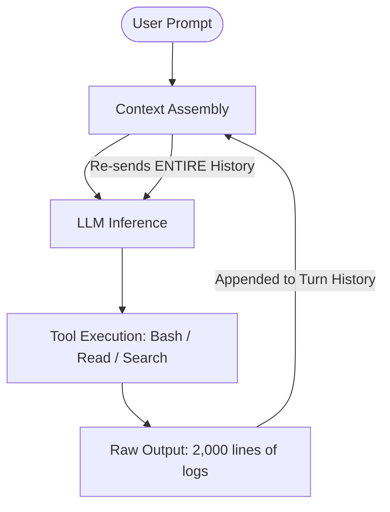
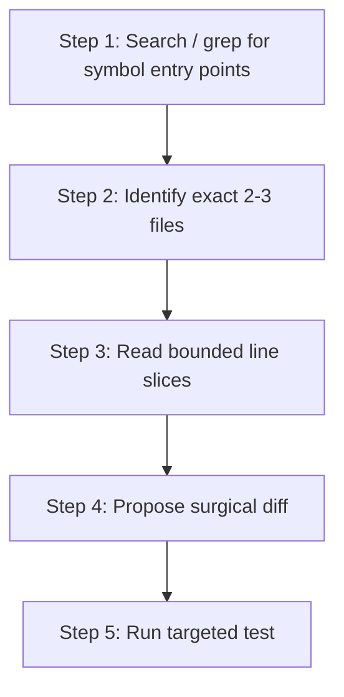
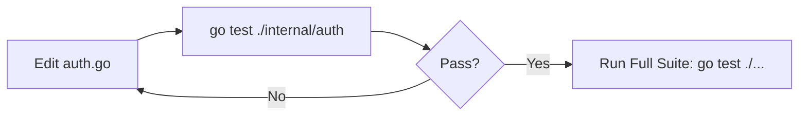
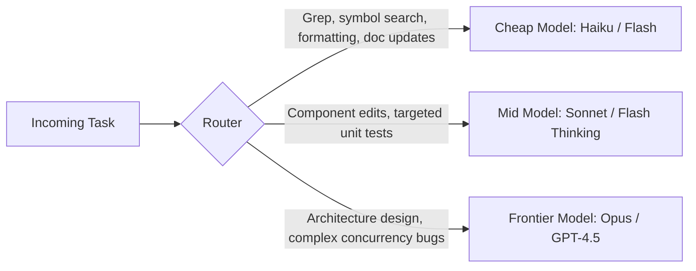

Autonomous AI coding agents—including **Claude Code, Gemini CLI, Cursor, Kiro, Codex, Cline, Continue, and Antigravity**—have revolutionized software development. However, their interactive tool loops make them immense token consumers. A single multi-turn refactoring, bug hunt, or infrastructure debugging session can effortlessly burn **200,000 to over 1,000,000 tokens** in twenty minutes.

Across all agent frameworks, the biggest savings do **not** come from shaving five words off your prompt. They come from systematically controlling **what gets sent to the model on every single agent turn**.

This article is **Part 1** of our 3-part guide to agent efficiency:
* **Part 1 (This Guide):** *The Techniques* — 25 practical, tool-agnostic methods to eliminate context bloat.
* **[Part 2: The Tools](reduce-ai-token-usage-part2-tools.html)** — A standardized catalog of open-source tools (RTK, Headroom, LeanCTX, Graphify, Serena, etc.).
* **[Part 3: Stacks & Benchmarks](reduce-ai-token-usage-part3-stacks-benchmarks.html)** — Tested architectures, agent configuration matrices (Claude Code, Gemini CLI, Cursor, Kiro, Codex, Cline, Antigravity), and empirical benchmarks.

---

## Table of Contents

- [The Agent Token Loop Problem](#the-agent-token-loop-problem)
- [The Token Optimization Hierarchy](#the-token-optimization-hierarchy)
- [1. Context Hygiene & Ignore Files](#1-context-hygiene--ignore-files)
- [2. Keeping Instruction Files Small & Lazy-Loaded](#2-keeping-instruction-files-small--lazy-loaded)
- [3. Progressive Context Disclosure](#3-progressive-context-disclosure)
- [4. Search Before Cat (Local Filtering First)](#4-search-before-cat-local-filtering-first)
- [5. Targeted Testing Over Full Test Suites](#5-targeted-testing-over-full-test-suites)
- [6. Aggressive Session Resets](#6-aggressive-session-resets)
- [7. Targeted Session Compaction](#7-targeted-session-compaction)
- [8. Model Routing & Workload Tiering](#8-model-routing--workload-tiering)
- [9. Tuning Reasoning & Effort Levels](#9-tuning-reasoning--effort-levels)
- [10. MCP Server Pruning & Profile Splitting](#10-mcp-server-pruning--profile-splitting)
- [11. Deferred / Lazy MCP Tool Loading](#11-deferred--lazy-mcp-tool-loading)
- [12. Prompt Caching & Prefix Stability](#12-prompt-caching--prefix-stability)
- [13. Tool & Terminal Output Throttling](#13-tool--terminal-output-throttling)
- [14. Local Preprocessing (jq, awk, ripgrep)](#14-local-preprocessing-jq-awk-ripgrep)
- [15. Repository Maps vs Raw Dumps](#15-repository-maps-vs-raw-dumps)
- [16. Semantic Code Indexing & AST Retrieval](#16-semantic-code-indexing--ast-retrieval)
- [17. Subagent Isolation & Stopping Conditions](#17-subagent-isolation--stopping-conditions)
- [18. Loop Guards & Failure Backoffs](#18-loop-guards--failure-backoffs)
- [19. Preventing Redundant File Re-Reads](#19-preventing-redundant-file-re-reads)
- [20. Terse Output Rules (Caveman Formatting)](#20-terse-output-rules-caveman-formatting)
- [21. Skipping Planning Overhead on Trivial Edits](#21-skipping-planning-overhead-on-trivial-edits)
- [22. Separating Exploration from Implementation](#22-separating-exploration-from-implementation)
- [23. Local Model Offloading (Ollama / LM Studio)](#23-local-model-offloading-ollama--lm-studio)
- [24. Measuring Tokens per Successful Task](#24-measuring-tokens-per-successful-task)
- [25. Universal AGENTS.md Blueprint](#25-universal-agentsmd-blueprint)
- [Next in the Series](#next-in-the-series)

---

## The Agent Token Loop Problem

In standard chat prompts, cost is static. In an autonomous agent loop, **cost compounds quadratically**:



Every command output, full file read, and MCP JSON schema remains in working memory for all subsequent turns. An agent reading a 1,000-line file on Turn 2 pays for those 1,000 lines on Turns 3, 4, 5... all the way to Turn 30.

---

## The Token Optimization Hierarchy

Prioritize token reduction in this order for maximum cost savings without hurting code quality:

<div style="overflow-x: auto;" markdown="1">

| Rank | Strategy | Potential Savings | Applies To | Core Impact |
| :--- | :--- | :--- | :--- | :--- |
| **1** | **Context Hygiene & Ignore Rules** | ⭐⭐⭐⭐⭐ (50–90%) | All Agents | Stops massive generated directories from entering context |
| **2** | **Instruction Sizing (`AGENTS.md`)** | ⭐⭐⭐⭐⭐ (40–70%) | All Agents | Shrinks static system prompt billed on every turn |
| **3** | **Fresh Sessions Between Tasks** | ⭐⭐⭐⭐⭐ (50–80%) | All Agents | Eliminates carrying stale context into new jobs |
| **4** | **Model Routing (Cheap vs Frontier)** | ⭐⭐⭐⭐⭐ (60–85% $) | All Agents | Uses fast/cheap models for grep, formatting, and edits |
| **5** | **MCP Pruning & Deferred Loading** | ⭐⭐⭐⭐⭐ (30–60%) | MCP Agents | Prevents 50+ tool schemas from injecting thousands of tokens |
| **6** | **Search / Index Before Reading** | ⭐⭐⭐⭐ (40–80%) | All Agents | Replaces full file dumps with targeted line slices |
| **7** | **Tool & Terminal Output Filtering** | ⭐⭐⭐⭐ (60–95% shell) | CLI Agents | Filters noise from `kubectl`, tests, `git`, and logs |
| **8** | **Prompt Caching Prefix Stability** | ⭐⭐⭐⭐ (50–90% cost) | Anthropic / Gemini | Keeps static prefixes byte-stable for 90% cache discounts |
| **9** | **Targeted Session Compaction** | ⭐⭐⭐⭐ (40–70%) | Long sessions | Summarizes history at natural task milestones |
| **10** | **Terse Output Formatting** | ⭐⭐⭐⭐ (60–80% output) | All Agents | Eliminates expensive conversational pleasantries |

</div>

---

## 1. Context Hygiene & Ignore Files

The number one mistake is allowing the agent to scan or index the entire repository indiscriminately.

```text
Bad Flow:
Agent ──> Scans Repo ──> Reads node_modules/, dist/, coverage/, .terraform/ ──> Massive Context Blowup
```

### Aggressive Exclusions
Configure your tool-specific ignore files (`.gitignore`, `.aiignore`, `.clineignore`, `.cursorignore`, `.geminiignore`):

```gitignore
node_modules/
.git/
dist/
build/
coverage/
vendor/
target/
.terraform/
*.lock
*.log
*.min.js
*.map
tmp/
cache/
generated/
```

> **Note on Lock Files:** Do not blindly delete access to lock files permanently. Agents occasionally need them to debug dependency conflicts. The rule is: *exclude them from automatic scanning by default, but allow manual reading when explicitly requested.*

---

## 2. Keeping Instruction Files Small & Lazy-Loaded

System instructions—such as `AGENTS.md`, `CLAUDE.md`, `GEMINI.md`, or `.cursorrules`—are part of the system prompt injected on **every single turn**.

### Bad (800+ lines of static docs):
```markdown
# Company Architecture
Our system was created in 2019 using a microservices pattern... [800 lines of history, standards, and tutorials]
```

### Good (Compact, actionable rules ~50 lines):
```markdown
# Project: Go 1.24 + Terraform

## Rules
- Modify only files relevant to the current task.
- Search symbols before reading entire files.
- Never scan vendor/, dist/, or .terraform/ directories.
- Run targeted unit tests before invoking full test suites.
- For deep architecture context, read `docs/architecture.md` on demand.
```

Keeping documentation in `docs/architecture.md` creates **lazy-loaded context**: the agent only pays for it when it actually needs to read it.

---

## 3. Progressive Context Disclosure

Instead of letting the agent read entire subdirectories upfront, guide it to discover context in stages:



* **Bad prompt:** `"Read the repository and fix authentication."`
* **Good prompt:** `"Investigate authentication failure. First search for token validation entry points, identify the relevant file, read only that section, and propose a minimal fix."`

---

## 4. Search Before Cat (Local Filtering First)

For CLI-based agents, printing entire files or logs into stdout is disastrous.

| Instead of Running... | Use Targeted Filtering... | Context Saved |
| :--- | :--- | :--- |
| `cat huge.log` | `grep -n "ERROR" huge.log \| tail -50` | 99% |
| `cat package-lock.json` | `grep -n '"react"' package-lock.json` | 98% |
| `kubectl logs my-pod` | `kubectl logs my-pod --tail=100` | 95% |
| `kubectl get pods -A -o yaml` | `kubectl get pod foo -n bar -o jsonpath='{.status.containerStatuses}'` | 97% |
| `terraform plan` | Run targeted plan on the changed module | 90% |

The core philosophy: **filter locally on the host machine → send the small result → reason with the LLM**.

---

## 5. Targeted Testing Over Full Test Suites

Autonomous agents frequently execute full test suites (`npm test`, `pytest`, `go test ./...`, `mvn test`) after every single 2-line edit.

Teach the agent the **targeted testing loop**:



```markdown
<!-- Add to AGENTS.md -->
- When verifying changes, always run the smallest relevant unit test first.
- Only run the full integration test suite once targeted tests pass.
```

---

## 6. Aggressive Session Resets

When working across multiple tasks, continuing in the same conversation forces subsequent tasks to carry all previous context history.

```text
Task 1: Terraform config  ──> Context: 40k tokens
Task 2: Kubernetes pods   ──> Context: 40k + 25k = 65k tokens
Task 3: Python API fix    ──> Context: 65k + 30k = 95k tokens (paying for Terraform & K8s!)
```

Claude and Gemini CLI explicitly recommend using `/clear` or starting a fresh session when switching topics:

```bash
# Claude Code:
/clear

# Gemini CLI:
/clear
```

---

## 7. Targeted Session Compaction

When a task requires continuity over 30+ turns, periodically compact the conversation.

In Claude Code, you can pass custom instructions to `/compact`:

```text
/compact Preserve:
- Current objective
- Files modified so far
- Unresolved errors and test failures
- Key architectural decisions

Discard:
- Exploratory search outputs
- Verbose terminal logs
- Abandoned hypotheses
```

> **Prompt Caching Note:** Compaction rewrites the conversation prefix, which temporarily creates a cache miss. Compact at natural task milestones, not after every turn.

---

## 8. Model Routing & Workload Tiering

Never use a 2-trillion-parameter frontier model for mechanical or exploratory tasks:



Using Claude 3.5 Haiku or Gemini 2.0 Flash for file exploration and simple formatting saves **70–90% on API costs** before the frontier model even receives the task.

---

## 9. Tuning Reasoning & Effort Levels

For models supporting dynamic reasoning effort (e.g. Claude 3.7 Sonnet Thinking, Gemini 2.0 Flash Thinking, o3-mini):

* **Low Effort / Thinking Off:** Variable renames, formatting JSON, writing standard boilerplate, updating READMEs.
* **Medium Effort:** Typical feature development and unit testing.
* **High Effort:** Complex race conditions, distributed system debugging, cryptographic code, architecture design.

---

## 10. MCP Server Pruning & Profile Splitting

Every MCP server you attach injects its JSON tool schemas into every prompt. Having 10 MCP servers active can easily consume **3,000–6,000 prompt tokens per turn before any code is read**.

### Solution: Split into Workload Profiles

* **Coding Profile:** Filesystem, Git, GitHub
* **DevOps Profile:** Kubernetes, AWS, Terraform
* **Incident Profile:** Datadog, Sentry, PagerDuty

Disable servers you are not actively using for the current task.

---

## 11. Deferred / Lazy MCP Tool Loading

Modern MCP specifications support **Tool Discovery / Tool Search**. Instead of injecting 50 schemas upfront:

1. The client exposes a single meta-tool: `search_tools(query: "kubernetes")`.
2. When the model needs Kubernetes functionality, it calls `search_tools` and dynamically loads the 3 required schemas into context.

---

## 12. Prompt Caching & Prefix Stability

Modern APIs (Anthropic, Google Gemini, OpenAI) offer **Prompt Caching** (up to 90% discount on cached tokens).

To maintain high cache hit rates:
1. **Never Put Timestamps or Random UUIDs in System Prompts:** Any dynamic variable at the top of the prompt invalidates the entire cache downstream.
2. **Order Static Blocks First:** Place system instructions, MCP schemas, and project specs before the dynamic conversation history.
3. **Avoid Mid-Session Config Changes:** Reconnecting MCP servers or switching model flags mid-chat invalidates the cache prefix.

---

## 13. Tool & Terminal Output Throttling

Instruct the agent directly:

```markdown
<!-- Global Instruction -->
When running shell commands:
- Always pipe verbose commands through head/tail or grep.
- Never print entire JSON blobs when only one field is needed.
- Strip ANSI colors and progress spinners from tool outputs.
```

---

## 14. Local Preprocessing (jq, awk, ripgrep)

Before sending 50 MB of raw logs or JSON payloads to an LLM, process them locally:

```bash
# Instead of dumping a 10 MB AWS API response:
aws ec2 describe-instances | jq '.Reservations[].Instances[] | {Id: .InstanceId, State: .State.Name}'
```

`jq`, `awk`, and `ripgrep` shrink multi-megabyte payloads down to 5 KB of clean JSON before they reach the model.

---

## 15. Repository Maps vs Raw Dumps

A lightweight repository map provides structural awareness at a fraction of the cost:

```text
repo/
├── cmd/
│   └── api/ (main.go)
├── internal/
│   ├── auth/ (service.go, jwt.go) [Authenticate, ValidateToken, ParseJWT]
│   ├── database/ (pool.go, migrations.go)
│   └── billing/ (stripe.go, webhook.go)
```

The agent uses the map to pick exact files rather than opening 20 directories blind.

---

## 16. Semantic Code Indexing & AST Retrieval

For large codebases, use AST-based knowledge graphs (**Graphify**) or LSP symbol indexes (**Serena**):
* **AST Graphs:** Answer questions like *"Where does UserService interact with billing?"* in 1 graph query (~300 tokens) instead of reading 15 files (~25,000 tokens).
* **LSP Indexing:** Queries exact function signatures and callers without reading whole file bodies.

---

## 17. Subagent Isolation & Stopping Conditions

When an agent needs to explore 30 files, spawn an **isolated subagent**:

```text
Main Agent ──> Spawns Subagent: "Locate token validation logic"
                 └── Reads 25 files in isolated sandbox
                 └── Returns 100-word summary to Main Agent
Main Agent Context remains completely clean!
```

> **Warning:** Subagents multiply token costs if spawned carelessly. Limit subagent delegation to independent, read-heavy exploratory tasks.

---

## 18. Loop Guards & Failure Backoffs

Autonomous agents can get stuck in endless retry loops:

```text
Edit ──> Test Fails ──> Edit ──> Test Fails ──> (Repeats 15 times = 300k tokens burned)
```

### Prevention Rules:
* *"If the same approach fails twice, stop and explain the blocker to the user."*
* *"Do not retry an identical command unless inputs have changed."*
* *"Cap debugging iterations at 3 attempts before asking for guidance."*

---

## 19. Preventing Redundant File Re-Reads

Agents often re-read the same large configuration file on Turns 3, 7, 12, and 18.

```markdown
<!-- Add to Agent Rules -->
- Do not re-read files already inspected in this session unless their contents were modified.
- Rely on your previous turn history for unchanged source files.
```

---

## 20. Terse Output Rules (Caveman Formatting)

Output tokens are billed at **3–5× the price of input tokens**. Eliminate prose bloat:

```text
Verbose Agent (1,200 tokens):
"Sure! I'd be glad to help you fix this issue. After analyzing your authentication service, 
I noticed that the token expiration check was missing a timezone offset. Here is an explanation 
of how JWT tokens work and why this was causing an error... [3 pages of text] ... I have updated the file."

Terse Agent (45 tokens):
Done.
- Fixed timezone offset in `internal/auth/jwt.go:42`.
- Added regression test in `jwt_test.go`.
- `go test ./internal/auth` passed.
```

---

## 21. Skipping Planning Overhead on Trivial Edits

Do not demand multi-step implementation plans for simple 5-line fixes:
* **Complex Task:** *"Explore codebase, create implementation plan, request review, then execute."*
* **Trivial Task:** *"Fix typo in README directly with targeted edit."*

---

## 22. Separating Exploration from Implementation

For large refactors, split the workflow into two distinct user turns:
1. **Turn 1 (Exploration):** *"Search only. Locate relevant files and summarize the root cause. Do NOT modify any code."*
2. **Turn 2 (Execution):** *"Implement the agreed fix on `src/auth.ts`."*

This prevents the agent from generating speculative code edits while it is still searching.

---

## 23. Local Model Offloading (Ollama / LM Studio)

Use local models (Qwen 2.5 Coder, Llama 3, DeepSeek) for routine offline workloads:
* Generating vector embeddings for local codebase search.
* Summarizing test run logs.
* Formatting git commit messages and PR descriptions.

---

## 24. Measuring Tokens per Successful Task

Track efficiency using metrics that matter:

$$\text{Efficiency} = \frac{\text{Total Tokens Billed}}{\text{Successful Tasks Completed}}$$

Use built-in agent commands:
* **Claude Code:** `/usage`
* **Gemini CLI:** `/stats`
* **RTK:** `rtk gain`
* **Headroom:** `headroom perf`

---

## 25. Universal AGENTS.md Blueprint

Standardize this concise `AGENTS.md` across all your repositories:

```markdown
# Agent Guidelines

## Context Efficiency
- Search symbols/grep before reading full files.
- Read only lines relevant to the active task.
- Never scan vendor/, dist/, .terraform/, or node_modules/ directories.
- Do not re-read unchanged files already in history.
- Prefer targeted command outputs (pipe through head/grep/jq).
- Run targeted unit tests before running full test suites.

## Workflow
1. Locate relevant symbols and entry points.
2. Read the minimum necessary code slices.
3. Make surgical, minimal changes (YAGNI).
4. Run targeted unit tests.
5. Provide a concise summary (<=5 bullet points, no conversational filler).

## Loop Guards
- Stop and ask for input if the same test fails twice.
- Do not retry identical failed commands without modifying arguments.
- Do not create subagents for trivial tasks.
```

---

## Next in the Series

Now that you have the complete playbook of techniques:

👉 **Continue to [Part 2: Open-Source Tools to Reduce Token Usage in AI Coding Agents](reduce-ai-token-usage-part2-tools.html)** — A detailed catalog and breakdown of top tools (RTK, Headroom, LeanCTX, Graphify, Serena, Ponytail, Caveman, and more).

👉 **Jump to [Part 3: Building a Token-Efficient AI Coding Agent Stack](reduce-ai-token-usage-part3-stacks-benchmarks.html)** — Tested architectures, agent-by-agent configuration matrices (Claude Code, Gemini CLI, Cursor, Kiro, Codex, Cline, Antigravity), and real-world benchmark data.
