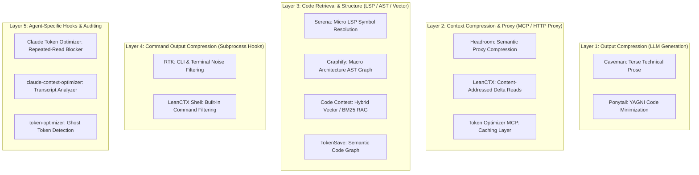

In **[Part 1: The Techniques]()**, we explored the architectural mechanisms of agent token bloat and the 25 core optimization principles. 

In this article (**Part 2**), we move from principles to software. If you want to **reduce token usage** with minimal effort, these are the open-source tools that do it for you. We catalog and evaluate the **leading open-source tools, MCP middleware, CLI proxies, and context compressors** engineered specifically to cut token consumption across every layer of the agent stack.

> **Last verified:** July 2026. Tool versions and install commands confirmed against latest releases.

---

## Series Navigation

* **[Part 1: The Techniques]()** — What causes token bloat and 25 methods to prevent it.
* **Part 2 (This Guide):** *The Tools* — Standardized catalog and layer breakdown of token-saving software.
* **[Part 3: Stacks & Benchmarks]()** — Tested combinations, compatibility matrix, and empirical benchmark results.

---

## Table of Contents

- [The Agent Optimization Stack](#the-agent-optimization-stack)
- [Comprehensive Tool Comparison Matrix](#comprehensive-tool-comparison-matrix)
- [1. RTK (Rust Token Killer) — CLI Output Interception](#1-rtk-rust-token-killer--cli-output-interception)
- [2. Headroom — API-Level Context Compression Proxy](#2-headroom--api-level-context-compression-proxy)
- [3. LeanCTX — Context Engineering, Caching & Session Memory](#3-leanctx--context-engineering-caching--session-memory)
- [4. Serena — LSP-Powered Semantic Code Retrieval](#4-serena--lsp-powered-semantic-code-retrieval)
- [5. Graphify — Codebase Knowledge Graph (AST)](#5-graphify--codebase-knowledge-graph-ast)
- [6. Token Optimizer MCP — Comprehensive Tool & Cache Suite](#6-token-optimizer-mcp--comprehensive-tool--cache-suite)
- [7. Code Context (Zilliz) — Hybrid Semantic & BM25 Code RAG](#7-code-context-zilliz--hybrid-semantic--bm25-code-rag)
- [8. Claude Token Optimizer & Context Optimizers](#8-claude-token-optimizer--context-optimizers)
- [9. Caveman & caveman-shrink — Terse Agent Outputs & Middleware](#9-caveman--caveman-shrink--terse-agent-outputs--middleware)
- [10. Ponytail — Minimal Code Generation Rules](#10-ponytail--minimal-code-generation-rules)
- [11. TokenSave — Native Semantic Code Graph](#11-tokensave--native-semantic-code-graph)
- [12. Repomix — Offline Context Packaging for Web LLMs](#12-repomix--offline-context-packaging-for-web-llms)
- [13. Graft — Plain-English Codebase Graph](#13-graft--plain-english-codebase-graph)
- [14. CodeGraph — SQLite-Native Code Knowledge Graph](#14-codegraph--sqlite-native-code-knowledge-graph)
- [15. Token Savior — Pointer-Based Code Navigation](#15-token-savior--pointer-based-code-navigation)
- [16. context-mode — Bulky Output Sandboxing](#16-context-mode--bulky-output-sandboxing)
- [17. semble — Natural-Language Code Search](#17-semble--natural-language-code-search)
- [18. Trellis — Progressive Spec System](#18-trellis--progressive-spec-system)
- [19. Context7 — Live Documentation Injection](#19-context7--live-documentation-injection)
- [20. dirac — Surgical Context Curation](#20-dirac--surgical-context-curation)
- [Usage & Cost Monitoring Utilities](#usage--cost-monitoring-utilities)
- [Conflicts & Overlaps: What Stacks Safely](#conflicts--overlaps-what-stacks-safely)
- [Frequently Asked Questions](#frequently-asked-questions)
- [Next in the Series](#next-in-the-series)

---

## The Agent Optimization Stack

Rather than installing ten overlapping tools, think of token optimization as a multi-tier pipeline. Each layer addresses a different point in the [Model Context Protocol (MCP)](https://modelcontextprotocol.io/) request lifecycle:



---

## Comprehensive Tool Comparison Matrix

<div style="overflow-x: auto;" markdown="1">

| Tool | Primary Layer | How It Reduces Tokens | Typical Savings | Integration Type | Supported Agents | License |
| :--- | :--- | :--- | :--- | :--- | :--- | :--- |
| **[RTK](#1-rtk-rust-token-killer--cli-output-interception)** | Shell Output | Intercepts CLI output (git, tests, builds, docker) | 60–90% (shell) | Rust CLI / Hooks | Claude, Gemini, Cursor, Copilot, Antigravity | MIT |
| **[Headroom](#2-headroom--api-level-context-compression-proxy)** | API Proxy | Semantically compresses payloads before API | 60–95% (input) | Local HTTP Proxy / MCP | Claude Code, Codex, Cursor, Aider | Apache 2.0 |
| **[LeanCTX](#3-leanctx--context-engineering-caching--session-memory)** | Context / Memory | Cached re-reads (~13 tokens), shell filter, memory | 60–90% + cache | Rust Binary (MCP) | Claude, Cursor, Kiro, Codex, Antigravity | MIT |
| **[Serena](#4-serena--lsp-powered-semantic-code-retrieval)** | Code Retrieval | Symbol-level LSP access (callers, definitions) | Eliminates raw reads | Python MCP (LSP) | Claude, Cursor, Kiro, Codex, Antigravity | Apache 2.0 |
| **[Graphify](#5-graphify--codebase-knowledge-graph-ast)** | Knowledge Graph | Single graph query replaces multi-file reads | 5–70× (replaces reads) | Python CLI / AST | Claude, Kiro, Gemini, Cursor, Antigravity | MIT |
| **[Token Optimizer MCP](#6-token-optimizer-mcp--comprehensive-tool--cache-suite)** | Smart Reads / Cache | 70+ tools with content-hash caching & smart reads | 95%+ on re-reads | Node.js MCP | Any MCP client (Codex, Claude, Gemini) | MIT |
| **[Code Context](#7-code-context-zilliz--hybrid-semantic--bm25-code-rag)** | Semantic Code RAG | Hybrid BM25 + Vector indexing for codebases | ~40% token reduction | MCP + Milvus/Zilliz | Claude Code, Codex, MCP clients | Apache 2.0 |
| **[Claude Token Optimizer](#8-claude-token-optimizer--context-optimizers)** | Claude Hooks | Blocks repeated file reads, large-file guards | 30–50% (Claude) | VS Code / Claude Hooks | Claude Code | MIT |
| **[Caveman](#9-caveman--caveman-shrink--terse-agent-outputs--middleware)** | Output Prose | Strips conversational filler and pleasantries | 60–80% (output) | Prompt Rule / Plugin | Claude, Cursor, Kiro, Gemini, Windsurf | MIT |
| **[Ponytail](#10-ponytail--minimal-code-generation-rules)** | Code Rules | Forces stdlib/native reuse over boilerplate | ~20–30% (code) | Prompt Rule / Plugin | Claude, Cursor, Kiro, Gemini, Cline | MIT |
| **[TokenSave](#11-tokensave--native-semantic-code-graph)** | Code Graph | Pre-indexed semantic graph for code queries | Varies | Rust MCP | Any MCP client | MIT |
| **[Repomix](#12-repomix--offline-context-packaging-for-web-llms)** | Offline Bundling | Packs codebase into token-counted XML/Markdown | N/A (offline) | Node.js CLI | Standalone (ChatGPT, Claude Web) | MIT |
| **[Graft](#13-graft--plain-english-codebase-graph)** | Knowledge Graph | Linked markdown + symbol wiring graph served via MCP | 66% SWE-bench (vs 54% cold) | MCP / CLI | Claude, Codex, Cursor, Gemini | MIT |
| **[CodeGraph](#14-codegraph--sqlite-native-code-knowledge-graph)** | Knowledge Graph | Tree-sitter AST → SQLite symbol/call/import graph | 58% fewer tool calls | TypeScript MCP | Claude, Codex, Cursor, Kiro | MIT |
| **[Token Savior](#15-token-savior--pointer-based-code-navigation)** | Code Navigation | Indexes by symbol so agents navigate by pointer | 77% active token cut | MCP Server | Any MCP client | MIT |
| **[context-mode](#16-context-mode--bulky-output-sandboxing)** | Context Proxy | Sandboxes bulky tool output outside LLM, retrieves via BM25 | Prevents blowup | MCP Server | Any MCP client | MIT |
| **[semble](#17-semble--natural-language-code-search)** | Code Search | Natural-language code retrieval replacing grep+read | ~98% token cut | MCP / CLI | Any MCP client | MIT |
| **[Trellis](#18-trellis--progressive-spec-system)** | Context Delivery | Progressive specs — loads only relevant standards per step | Replaces bloated CLAUDE.md | Config Files | Claude, Cursor, Kiro, Codex | MIT |
| **[Context7](#19-context7--live-documentation-injection)** | Context Delivery | Injects up-to-date, version-specific library docs | Eliminates hallucinated APIs | MCP / CLI | Any MCP client | Apache 2.0 |
| **[dirac](#20-dirac--surgical-context-curation)** | Context / Edit | Hash-anchored edits + parallel ops + AST manipulation | 50–80% cost cut | Agent Harness | Claude, Codex, Cursor | MIT |

</div>

### Quick Start: Which Tools Do You Need?

* **Solo dev, want instant savings with zero setup?** Start with **Caveman + Ponytail** (prompt rules, no runtime).
* **Working in a medium codebase, want the best daily driver?** Add **RTK + Graphify + Serena** (CLI filtering + architecture graph + symbol lookup).
* **Large monorepo or team environment?** Choose **LeanCTX** (context caching + memory) or **Headroom** (API proxy compression) as your foundation, then layer Graphify + Serena on top.
* **Using Claude Code specifically?** Add **Claude Token Optimizer** for repeated-read blocking.

---

## 1. RTK (Rust Token Killer) — CLI Output Interception

* **Repository:** [github.com/rtk-ai/rtk](https://github.com/rtk-ai/rtk)
* **What Problem It Solves:** Commands like `kubectl logs`, `git status`, `npm test`, `pytest`, and `cargo build` generate hundreds of lines of noise, bloating context on every shell tool execution.
* **How It Works:** Lightweight Rust binary that intercepts shell tool outputs via hooks and converts verbose terminal output into concise 1–2 line summaries before the LLM reads them.

```bash
# Install binary:
brew install rtk

# Enable auto-rewrite hooks:
rtk init -g               # Claude Code
rtk init -g --gemini      # Gemini CLI
rtk init --agent cursor   # Cursor
rtk init --agent antigravity # Antigravity

# Inspect savings:
rtk gain                  # View total token & dollar savings
```

* **Claimed / Measured Savings:** 60–90% on shell command executions.
* **Targeted Outputs:** `git`, `docker`, `kubectl`, `cargo`, `npm`, `pytest`, `go`, build/test logs.
* **Limitation:** Only intercepts commands the agent runs through its shell tool — direct MCP tool outputs or API responses bypass RTK entirely.
* **License:** MIT
* **Best Paired With:** Serena, Graphify, Caveman, Ponytail.

---

## 2. Headroom — API-Level Context Compression Proxy

* **Repository:** [github.com/headroomlabs-ai/headroom](https://github.com/headroomlabs-ai/headroom)
* **What Problem It Solves:** Multi-turn chat histories, file reads, and tool execution logs compound into hundreds of thousands of input tokens.
* **How It Works:** Operates as a local HTTP proxy between your agent and the LLM API endpoint (or as an agent wrapper). It applies semantic deduplication, history compression, and text compaction to reduce payloads by 60–95%.

```bash
# Install:
pipx install --python python3.13 "headroom-ai[all]"

# Option A: Direct wrapper
headroom wrap claude      # Or: codex, cursor, aider, copilot

# Option B: Global daemon (add to shell config or set per-session with export)
export ANTHROPIC_BASE_URL=http://127.0.0.1:8787
headroom proxy --port 8787
```

* **Claimed / Measured Savings:** 60–95% input token reduction across full sessions.
* **Features:** Cross-agent shared memory, live compression dashboard (`headroom perf`).
* **Limitation:** Adds a local proxy hop — introduces slight latency (~50–100ms per request). Requires Python 3.13+.
* **License:** Apache 2.0

---

## 3. LeanCTX — Context Engineering, Caching & Session Memory

* **Repository:** [github.com/yvgude/lean-ctx](https://github.com/yvgude/lean-ctx)
* **What Problem It Solves:** Re-reading unchanged files wastes full tokens repeatedly, terminal outputs bloat context, and agents lose architectural knowledge across separate sessions.
* **How It Works:** Rust-based context layer exposing 50+ MCP tools for selective file reading (`map`, `signatures`, `diff`), content-addressed cached re-reads (~13 tokens on re-read), 95+ shell filtering patterns, and persistent session memory.

```bash
# Install:
brew tap yvgude/lean-ctx && brew install lean-ctx
lean-ctx onboard          # Detects installed agents and adds MCP config entries

# Usage:
lean-ctx read src/main.rs -m map   # Read symbol outline
lean-ctx gain                      # View savings stats
```

* **Claimed / Measured Savings:** 60–90% on shell outputs; 99% on cached re-reads.
* **Limitation:** Requires Rust toolchain for building from source; MCP-based integration means agents without MCP support cannot use it.
* **License:** MIT
* **Best For:** Large codebases, monorepos, and teams needing durable cross-session memory.

---

## 4. Serena — LSP-Powered Semantic Code Retrieval

* **Repository:** [github.com/oraios/serena](https://github.com/oraios/serena)
* **What Problem It Solves:** Prevents the agent from needing raw context in the first place. Instead of grepping and reading 10 whole files to find an authentication handler, the agent uses IDE-level LSP semantic tools.
* **How It Works:** Integrates language servers (Pyright, TypeScript, etc.) into an MCP server exposing `find_symbol`, `find_referencing_symbols`, `insert_after_symbol`, and type diagnostics.

```bash
# Install:
uv tool install serena-agent
npm install -g pyright bash-language-server

# Initialize in repo:
cd your-project
serena init && serena project create . --index
```

### MCP Configuration
Add to `.kiro/settings/mcp.json`, `~/.claude/settings.json`, or `.cursor/mcp.json`:
```json
{
  "mcpServers": {
    "serena": {
      "command": "serena",
      "args": ["start-mcp-server", "--context", "ide", "--project-from-cwd"]
    }
  }
}
```

* **Claimed / Measured Savings:** Eliminates 80–95% of full-file read operations.
* **Limitation:** Language support depends on available language servers — Python (Pyright) and TypeScript are first-class; other languages may have gaps. Requires per-project initialization.
* **License:** Apache 2.0
* **Best Paired With:** Graphify (Graphify provides macro architecture; Serena provides micro symbol definitions).

---

## 5. Graphify — Codebase Knowledge Graph (AST)

* **Repository:** [github.com/Graphify-Labs/graphify](https://github.com/Graphify-Labs/graphify)
* **What Problem It Solves:** Eliminates expensive multi-file exploratory reads when discovering architectural dependencies and relationships.
* **How It Works:** Uses local tree-sitter AST parsing (37+ languages) to build a deterministic knowledge graph (`graph.json`). The agent queries the graph in 1 call instead of reading raw files. 100% local, free, and instant.

```bash
# Install:
uv tool install graphifyy
graphify install && graphify kiro install

# Build graph per project:
cd your-project
graphify extract . --code-only
graphify hook install                  # Auto-rebuilds on commit
```

* **Queries:** `graphify query "auth to database"`, `graphify path "A" "B"`, `graphify explain "Service"`.
* **Limitation:** Graph must be rebuilt after significant code changes (mitigated by the commit hook). Very large monorepos (100k+ files) may have slow initial extraction.
* **License:** MIT

---

## 6. Token Optimizer MCP — Comprehensive Tool & Cache Suite

* **Repository:** [github.com/ooples/token-optimizer-mcp](https://github.com/ooples/token-optimizer-mcp)
* **What Problem It Solves:** Replaces standard read/grep/build tools with 70+ specialized smart tools.
* **Key Tools:** `smart_read`, `smart_grep`, `smart_diff`, `smart_logs`, `smart_test`, `smart_build`, `smart_cache`, `context_delta`.
* **How It Works:** Wraps reads, searches, and test executions in content-hash tracking, returning deltas or compressed summaries instead of full payloads.

```json
{
  "mcpServers": {
    "token-optimizer": {
      "command": "npx",
      "args": ["-y", "@ooples/token-optimizer-mcp@latest"]
    }
  }
}
```

* **Limitation:** Large number of exposed tools (70+) adds schema tokens to context — ironic for a token optimizer. Best used as a replacement for native tools, not alongside them.
* **License:** MIT

---

## 7. Code Context (Zilliz) — Hybrid Semantic & BM25 Code RAG

* **Repository:** [github.com/zilliztech/claude-context](https://github.com/zilliztech/claude-context)
* **What Problem It Solves:** Prevents agents from repeatedly scanning directories and raw files by providing hybrid semantic and keyword search.
* **How It Works:** Indexes code chunks into Milvus/Zilliz with embeddings (OpenAI, VoyageAI, Ollama, Gemini) and BM25 sparse search. The agent retrieves the top 5 relevant code chunks rather than reading 20 files.

```bash
# Install:
pip install claude-code-context

# Index your codebase:
claude-context index .

# MCP configuration:
```
```json
{
  "mcpServers": {
    "code-context": {
      "command": "claude-context",
      "args": ["serve"]
    }
  }
}
```

* **Claimed / Measured Savings:** ~40% token reduction in controlled retrieval evaluations.
* **Limitation:** Requires an embedding provider (OpenAI API key, or local Ollama). Initial indexing can be slow on large repos. Vector search quality depends on embedding model choice.
* **License:** Apache 2.0

---

## 8. Claude Token Optimizer & Context Optimizers

For developers using **Claude Code** specifically:

### A. Claude Token Optimizer ([baignoire57/claudetokenoptimizer](https://github.com/baignoire57/claudetokenoptimizer))
* **Mechanism:** VS Code companion using native Claude Code hooks.
* **Key Features:**
  * **Repeated-Read Blocker:** Tracks file hashes (`service.go: ABC123`). If Claude re-reads the unchanged file 10 minutes later, it blocks the redundant read.
  * **Large-File Guards:** Intercepts full file reads on files >500 lines, pushing Claude to use line-bounded reads or search.
  * **Bash Output Compaction:** Auto-compacts test and build output.

### B. claude-context-optimizer ([uwilleer/claude-context-optimizer](https://github.com/uwilleer/claude-context-optimizer))
* **Mechanism:** Pure hooks, settings, permissions, and transcript analyzer (zero runtime daemon).
* **Claimed Savings:** ~30% baseline token footprint reduction.

### C. token-optimizer ([alexgreensh/token-optimizer](https://github.com/alexgreensh/token-optimizer))
* **Mechanism:** Focuses on "ghost tokens", context-window degradation, and compaction checkpoints for Claude Code, OpenCode, and Codex.

* **Limitation (all three):** Claude Code-specific — none of these work with Gemini, Cursor, or other agents. Hook APIs may break across Claude Code version updates.
* **License:** MIT (all three)

---

## 9. Caveman & caveman-shrink — Terse Agent Outputs & Middleware

* **Repository:** [github.com/JuliusBrussee/caveman](https://github.com/JuliusBrussee/caveman)
* **What Problem It Solves:** LLM outputs are typically 3–5× the cost of input tokens (varies by provider). Agents waste tokens on conversational pleasantries, restating prompts, and apologetic fluff.
* **How It Works:** Prompt rule forcing the agent into terse, direct technical fragments and diffs.
* **Extended Ecosystem:** `caveman-shrink` acts as MCP middleware to compress lengthy tool descriptions before injection.

```bash
# Universal installer (Claude, Cursor, Windsurf, Kiro, Gemini):
curl -fsSL https://raw.githubusercontent.com/JuliusBrussee/caveman/main/install.sh | bash
```

* **Claimed Savings:** 60–80% reduction in output prose tokens.
* **Limitation:** Terse output can frustrate developers who want explanations. Not suitable for onboarding contexts where verbose reasoning helps learning.
* **License:** MIT

---

## 10. Ponytail — Minimal Code Generation Rules

* **Repository:** [github.com/DietrichGebert/ponytail](https://github.com/DietrichGebert/ponytail)
* **What Problem It Solves:** Over-engineering and bloated code generation.
* **How It Works:** Forces the agent down a strict decision ladder: YAGNI → reuse existing code → stdlib → native platform feature → installed dependency → 1-liner.

```bash
# Claude Code (copy rule to project or global config):
curl -o ~/.claude/AGENTS.md https://raw.githubusercontent.com/DietrichGebert/ponytail/main/AGENTS.md

# Kiro / Cursor rule:
mkdir -p ~/.kiro/steering
curl -o ~/.kiro/steering/ponytail.md https://raw.githubusercontent.com/DietrichGebert/ponytail/main/.kiro/steering/ponytail.md
```

* **Limitation:** Pure prompt steering — effectiveness depends on the model following instructions. May conflict with project requirements that demand defensive coding or explicit abstractions.
* **License:** MIT

---

## 11. TokenSave — Native Semantic Code Graph

* **Repository:** [github.com/aovestdipaperino/tokensave](https://github.com/aovestdipaperino/tokensave)
* **What Problem It Solves:** Provides symbol and caller lookups without Python runtime dependencies — ideal for teams that want Serena-like code intelligence but prefer a Rust-native toolchain.
* **How It Works:** Pre-indexes your codebase into a semantic graph. Agents query symbols, callers, and definitions via MCP instead of reading raw files.

```bash
# Install:
cargo install tokensave

# Index your repository:
tokensave index .

# Query (via MCP or CLI):
tokensave query "find callers of authenticate()"
```

* **Best For:** Rust/Go/C++ codebases where Python-based LSP tools add unwanted overhead.
* **Limitation:** Newer project with smaller community — fewer language grammars supported compared to Graphify or Serena.
* **License:** MIT

---

## 12. Repomix — Offline Context Packaging for Web LLMs

* **Repository:** [github.com/yamadashy/repomix](https://github.com/yamadashy/repomix)
* **What Problem It Solves:** When using web-based LLMs (ChatGPT, Claude Web, Gemini Web) that don't have filesystem access, you need a way to package your codebase into a single context-efficient payload.
* **How It Works:** Scans your repository (respecting `.gitignore`), counts tokens per file, and outputs a single XML or Markdown document optimized for pasting into web LLM chat windows.

```bash
# Install:
npm install -g repomix

# Package current directory:
repomix

# Package with token budget:
repomix --max-tokens 100000 --output context.md
```

* **Best For:** Code review sessions in web UIs, sharing codebase context with non-IDE agents, and offline/air-gapped environments.
* **Limitation:** Static snapshot — doesn't update as code changes. Not useful for multi-turn iterative agent workflows (use Graphify/Serena instead).
* **License:** MIT

---

## 13. Graft — Plain-English Codebase Graph

* **Repository:** [github.com/NanoNets/Graft](https://github.com/NanoNets/Graft)
* **What Problem It Solves:** Agents rediscover repository structure every session because they lack a persistent, human-readable map of how code connects.
* **How It Works:** Builds a local, regenerable graph of plain-English system explanations and code relationships using tree-sitter, then serves it inside Claude Code, Cursor, Codex, and Gemini via MCP and statusline hooks. Unlike raw AST graphs (Graphify), Graft produces *prose explanations* of what each component does and how it relates to others.

```bash
# Install:
npm install -g @nanonets/graft

# Build graph for your project:
graft index .

# Query via MCP (auto-registered) or CLI:
graft query "how does auth connect to billing"
```

* **Claimed / Measured Savings:** Achieved 66% on SWE-bench Verified vs 54% with cold Claude Code — proving that persistent structural context directly improves task success.
* **Limitation:** Graph regeneration needed after major refactors. Prose descriptions may become stale if not auto-rebuilt.
* **License:** MIT
* **Best Paired With:** Serena (Graft provides macro prose context; Serena provides micro symbol lookups).

---

## 14. CodeGraph — SQLite-Native Code Knowledge Graph

* **Repository:** [github.com/nicobailon/codegraph](https://github.com/nicobailon/codegraph)
* **What Problem It Solves:** Agents burn tokens on grep-and-read exploration cycles when they could query a pre-indexed structural database.
* **How It Works:** Tree-sitter parses 21+ languages into a local SQLite symbol/call/import graph with FTS5 full-text search and OS-native file watchers for incremental sync. No embeddings, no vector store, no API keys — everything stays local.

```bash
# Install:
npm install -g codegraph

# Index your repository:
codegraph index .

# Query symbols, callers, imports:
codegraph query "callers of authenticate"
codegraph query "imports of billing module"
```

* **Claimed / Measured Savings:** 58% fewer tool calls and 47% fewer tokens in vendor benchmarks across 7 codebases. Independent review measured 70% median tool-call reduction.
* **Limitation:** 47K+ stars but still pre-1.0 (single maintainer). Symbol graphs fail on fuzzy semantic queries — pair with natural-language search (semble) for best coverage.
* **License:** MIT
* **Best Paired With:** semble (for natural-language queries that symbols can't answer).

---

## 15. Token Savior — Pointer-Based Code Navigation

* **Repository:** [github.com/nicobailon/token-savior](https://github.com/nicobailon/token-savior)
* **What Problem It Solves:** Agents read entire files when they only need one function. Token Savior indexes codebases by symbol so agents navigate by pointer (function/class reference) instead of reading raw file content.
* **How It Works:** MCP server that exposes navigation tools — jump to definition, find callers, get function body — so agents request exactly the 20 lines they need instead of pulling 500-line files into context.

```json
{
  "mcpServers": {
    "token-savior": {
      "command": "npx",
      "args": ["-y", "token-savior-mcp"]
    }
  }
}
```

* **Claimed / Measured Savings:** 77% active token cut, 76% wall-time reduction.
* **Limitation:** Symbol-based navigation only — doesn't help with understanding architecture or relationships between modules (pair with Graft/Graphify for that).
* **License:** MIT

---

## 16. context-mode — Bulky Output Sandboxing

* **Repository:** [github.com/abstracted-ai/context-mode](https://github.com/abstracted-ai/context-mode)
* **What Problem It Solves:** MCP tool outputs (Playwright snapshots, GitHub issue bodies, log dumps) enter the context window in full, bloating subsequent turns.
* **How It Works:** Intercepts raw tool output before it enters the context window, sandboxing bulky data outside the LLM. When the agent needs specific information, it retrieves relevant fragments via BM25 keyword matching. Implements the "think in code" paradigm — replacing ten file-read tool calls with one script execution.

```json
{
  "mcpServers": {
    "context-mode": {
      "command": "npx",
      "args": ["-y", "context-mode-mcp"]
    }
  }
}
```

* **Claimed / Measured Savings:** Prevents context blowup from Playwright snapshots, GitHub API responses, and verbose logs that would otherwise consume 10–50K tokens per tool call.
* **Limitation:** Adds an indirection layer — BM25 retrieval may miss relevant fragments if keywords don't match. Best for known-noisy tool outputs.
* **License:** MIT

---

## 17. semble — Natural-Language Code Search

* **Repository:** [github.com/MinishLab/semble](https://github.com/MinishLab/semble)
* **What Problem It Solves:** `grep` + `read` cycles burn tokens when the agent doesn't know the exact symbol name. semble lets agents search code by meaning ("find the rate limiting middleware") instead of exact pattern matching.
* **How It Works:** Lightweight semantic code search that runs on CPU with zero external dependencies. Ships as an MCP server and CLI. Achieves 99% of a full transformer-based retriever's accuracy at a fraction of the compute.

```bash
# Install:
pip install semble

# Index your codebase:
semble index .

# Search by meaning:
semble search "authentication token validation"
```

* **Claimed / Measured Savings:** ~98% token reduction compared to grep+read cycles (returns only the relevant code block, not entire files).
* **Limitation:** CPU-only inference adds ~100ms per query. Best for medium codebases (under 500K lines); very large monorepos may need chunking.
* **License:** MIT
* **Best Paired With:** CodeGraph (semble handles fuzzy/semantic queries; CodeGraph handles structural/symbol queries).

---

## 18. Trellis — Progressive Spec System

* **Repository:** [github.com/trellis-ai/trellis](https://github.com/trellis-ai/trellis)
* **What Problem It Solves:** Monolithic `CLAUDE.md` / `AGENTS.md` files grow to 800+ lines and are injected on every turn, wasting thousands of tokens on irrelevant rules.
* **How It Works:** Replaces the single instruction file with a progressive spec system — agents load only the standards, task PRDs, and session journals relevant to the current step. A cross-platform adapter layer translates the same configuration into Claude Code's `CLAUDE.md`, Cursor's rules, Codex's `AGENTS.md`, and more.

```bash
# Install:
npm install -g trellis-ctx

# Initialize in your project:
trellis init

# Generates .trellis/ with modular specs:
# .trellis/standards/typescript.md
# .trellis/tasks/current-sprint.md
# .trellis/sessions/journal.md
```

* **Claimed / Measured Savings:** Reduces system prompt from 800+ lines to only the 50–100 lines relevant per task step.
* **Limitation:** Requires upfront effort to decompose existing monolithic instruction files into modular specs. Cross-platform adapters may lag behind agent updates.
* **License:** MIT

---

## 19. Context7 — Live Documentation Injection

* **Repository:** [github.com/upstash/context7](https://github.com/upstash/context7)
* **What Problem It Solves:** Agents hallucinate APIs from stale training data. When you ask for Next.js 15 code, the agent generates Next.js 13 patterns because that's what it was trained on.
* **How It Works:** MCP server and CLI that injects up-to-date, version-specific library documentation directly into agent context at query time. Fetches docs from official sources and serves only the relevant sections.

```json
{
  "mcpServers": {
    "context7": {
      "command": "npx",
      "args": ["-y", "@upstash/context7-mcp@latest"]
    }
  }
}
```

* **Claimed / Measured Savings:** Eliminates hallucinated APIs and outdated code examples. Reduces retry loops caused by generating code against wrong API versions.
* **Limitation:** Depends on documentation being available and parseable for the library in question. Less useful for internal/proprietary libraries.
* **License:** Apache 2.0

---

## 20. dirac — Surgical Context Curation

* **Repository:** [github.com/dirac-ai/dirac](https://github.com/dirac-ai/dirac)
* **What Problem It Solves:** Standard file-read + string-replace editing wastes tokens by reading entire files and sending full contents back. dirac optimizes for precise, minimal context delivery.
* **How It Works:** Combines hash-anchored edits (edit by line reference without re-reading the file), massively parallel operations, and AST-level manipulation to minimize both reads and writes. The agent references code by stable anchors rather than re-fetching content.

* **Claimed / Measured Savings:** 50–80% cost reduction while improving code quality (fewer hallucinations from cleaner context).
* **Limitation:** Requires learning dirac's edit model (hash-anchored references). Not a drop-in replacement for standard file tools in every agent.
* **License:** MIT
* **Best Paired With:** Graphify or Graft for architectural awareness; dirac handles the editing efficiency layer.

---

## Usage & Cost Monitoring Utilities

* **`ccusage`:** Real-time token and dollar tracking specifically for Claude Code (`npx ccusage`).
* **`rtk gain`:** Live token and dollar savings accounting across CLI commands.
* **`headroom perf`:** Live compression ratio and latency dashboard for proxy sessions.
* **LiteLLM:** Proxy-level routing, cost tracking, and caching across multiple LLM providers.

---

## Conflicts & Overlaps: What Stacks Safely

<div style="overflow-x: auto;" markdown="1">

| Layer | Tools | Compatibility Rule | Explanation |
| :--- | :--- | :--- | :--- |
| **Output Prose** | Caveman, Ponytail | ✅ **Stack with everything** | Pure prompt steering; zero runtime overhead. |
| **Shell Interception** | RTK vs LeanCTX Shell | ⚠️ **Pick ONE** | Both intercept terminal output; running both causes double-rewrites. |
| **Context Proxy & Cache** | Headroom vs LeanCTX Proxy vs Token Optimizer MCP vs context-mode | ⚠️ **Pick ONE** | Running multiple proxies causes nested compression and latency overhead. |
| **Code Intelligence (Graph)** | Graphify vs Graft vs CodeGraph | ⚠️ **Pick ONE** | All build AST/symbol graphs — overlapping functionality. Graft adds prose explanations; CodeGraph adds SQLite; Graphify adds community detection. |
| **Code Intelligence (LSP)** | Serena + Token Savior | ✅ **Complementary** | Serena resolves symbols via LSP; Token Savior provides pointer-based navigation. |
| **Code Search** | semble vs Code Context | ⚠️ **Pick ONE** | Both provide semantic code search; semble is CPU-only/lightweight, Code Context uses vector stores. |
| **Context Delivery** | Trellis vs monolithic AGENTS.md | ⚠️ **Pick ONE approach** | Trellis replaces monolithic instruction files with progressive specs. |
| **Documentation** | Context7 | ✅ **Stacks with everything** | Fills a unique gap — live library docs. No conflicts. |
| **Editing** | dirac vs standard file tools | ⚠️ **Pick ONE** | dirac replaces native read/edit; running both adds confusion. |
| **Claude-Specific Hooks** | Claude Token Optimizer | ✅ **Pairs with RTK/Serena** | Adds repeated-read blocking natively in Claude Code. |

</div>

---

## Frequently Asked Questions

**Which tool should I install first to reduce token usage?**
Start with **Caveman** (zero setup, 60–80% output token reduction) and **RTK** (`brew install rtk`, 60–90% shell output reduction). These two cover the highest-cost token sources without changing your workflow.

**RTK vs Headroom vs LeanCTX — which should I choose?**
They operate at different layers. RTK filters CLI output only. Headroom compresses the entire API payload (including file reads and history). LeanCTX provides cached reads + session memory + shell filtering. Pick ONE from the proxy/cache layer (Headroom or LeanCTX), and RTK can stack with LeanCTX but not alongside LeanCTX's shell filtering. See the Conflicts table above.

**Do these tools work with Claude Code, Cursor, and Gemini CLI?**
Most do. RTK, Caveman, Ponytail, Graphify, and Serena work across all major agents. Headroom is strongest with Anthropic-API agents (Claude Code, Codex, Aider). Claude Token Optimizer is Claude Code-specific. Check the "Supported Agents" column in the comparison matrix.

**Will these tools break my existing MCP setup?**
No — they add alongside existing tools. Caveman and Ponytail are pure prompt rules. RTK is a CLI hook. Graphify and Serena register as additional MCP servers. The only conflict risk is running two proxy-layer tools simultaneously (Headroom + LeanCTX + Token Optimizer MCP — pick one).

**Are these tools free and open source?**
Yes. Every tool listed here is MIT or Apache 2.0 licensed. No paid tiers, no usage limits, no telemetry. They run entirely locally.

**How do I measure actual savings after installing these tools?**
Use `rtk gain` (RTK savings), `headroom perf` (proxy compression stats), `/usage` in Claude Code (session totals), or `npx ccusage` (historical dollar tracking). Compare your tokens-per-task before and after.

<script type="application/ld+json">
{
  "@context": "https://schema.org",
  "@type": "FAQPage",
  "mainEntity": [
    {
      "@type": "Question",
      "name": "Which tool should I install first to reduce token usage?",
      "acceptedAnswer": {
        "@type": "Answer",
        "text": "Start with Caveman (zero setup, 60–80% output token reduction) and RTK (brew install rtk, 60–90% shell output reduction). These two cover the highest-cost token sources without changing your workflow."
      }
    },
    {
      "@type": "Question",
      "name": "RTK vs Headroom vs LeanCTX — which should I choose?",
      "acceptedAnswer": {
        "@type": "Answer",
        "text": "They operate at different layers. RTK filters CLI output only. Headroom compresses the entire API payload. LeanCTX provides cached reads, session memory, and shell filtering. Pick one from the proxy/cache layer (Headroom or LeanCTX)."
      }
    },
    {
      "@type": "Question",
      "name": "Do these tools work with Claude Code, Cursor, and Gemini CLI?",
      "acceptedAnswer": {
        "@type": "Answer",
        "text": "Most do. RTK, Caveman, Ponytail, Graphify, and Serena work across all major agents. Headroom is strongest with Anthropic-API agents. Claude Token Optimizer is Claude Code-specific."
      }
    },
    {
      "@type": "Question",
      "name": "Will these tools break my existing MCP setup?",
      "acceptedAnswer": {
        "@type": "Answer",
        "text": "No — they add alongside existing tools. Caveman and Ponytail are prompt rules, RTK is a CLI hook, and Graphify and Serena register as additional MCP servers."
      }
    },
    {
      "@type": "Question",
      "name": "Are these tools free and open source?",
      "acceptedAnswer": {
        "@type": "Answer",
        "text": "Yes. Every tool listed here is MIT or Apache 2.0 licensed with no paid tiers, no usage limits, and runs entirely locally."
      }
    },
    {
      "@type": "Question",
      "name": "How do I measure actual savings after installing these tools?",
      "acceptedAnswer": {
        "@type": "Answer",
        "text": "Use rtk gain (RTK savings), headroom perf (proxy compression stats), /usage in Claude Code (session totals), or npx ccusage (historical dollar tracking)."
      }
    }
  ]
}
</script>

---

## Next in the Series

Now that you know every tool in the ecosystem and their compatibility rules:

**Proceed to [Part 3: Building a Token-Efficient AI Coding Agent Stack]()** — Dive into complete reference architectures (Option A Minimal, Option B Balanced, Option C Max Context), agent setup matrices, and empirical benchmark data.

---

*Last verified: July 2026. Tool versions and install commands confirmed against latest releases.*
