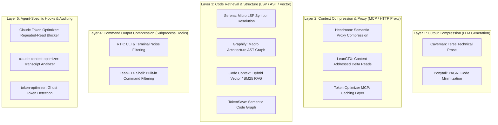

In **[Part 1: The Techniques](reduce-ai-token-usage-part1-techniques.html)**, we explored the architectural mechanisms of agent token bloat and the 25 core optimization principles. 

In this article (**Part 2**), we move from principles to software. We catalog and evaluate the **leading open-source tools, MCP middleware, CLI proxies, and context compressors** engineered specifically to reduce token consumption across every layer of the agent stack.

---

## Series Navigation

* **[Part 1: The Techniques](reduce-ai-token-usage-part1-techniques.html)** — What causes token bloat and 25 methods to prevent it.
* **Part 2 (This Guide):** *The Tools* — Standardized catalog and layer breakdown of token-saving software.
* **[Part 3: Stacks & Benchmarks](reduce-ai-token-usage-part3-stacks-benchmarks.html)** — Tested combinations, compatibility matrix, and empirical benchmark results.

---

## Table of Contents

- [The Agent Optimization Stack](#the-agent-optimization-stack)
- [Comprehensive Tool Comparison Matrix](#comprehensive-tool-comparison-matrix)
- [1. RTK (Rust Token Killer) — CLI Output Interception](#1-rtk-rust-token-killer--cli-output-interception)
- [2. Headroom — API-Level Context Compression Proxy](#2-headroom--api-level-context-compression-proxy)
- [3. LeanCTX — Context Engineering, Caching & Session Memory](#3-leanctx--context-engineering-caching--session-memory)
- [4. Serena — LSP-Powered Semantic Code Retrieval](#4-serena--lsp-powered-semantic-code-retrieval)
- [5. Graphify — Codebase Knowledge Graph (AST)](#5-graphify--codebase-knowledge-graph-ast)
- [6. Token Optimizer MCP — Comprehensive Tool & Cache Suite](#6-token-optimizer-mcp--comprehensive-tool--cache-suite)
- [7. Code Context (Zilliz) — Hybrid Semantic & BM25 Code RAG](#7-code-context-zilliz--hybrid-semantic--bm25-code-rag)
- [8. Claude Token Optimizer & Context Optimizers](#8-claude-token-optimizer--context-optimizers)
- [9. Caveman & caveman-shrink — Terse Agent Outputs & Middleware](#9-caveman--caveman-shrink--terse-agent-outputs--middleware)
- [10. Ponytail — Minimal Code Generation Rules](#10-ponytail--minimal-code-generation-rules)
- [11. TokenSave — Native Semantic Code Graph](#11-tokensave--native-semantic-code-graph)
- [12. Repomix — Offline Context Packaging for Web LLMs](#12-repomix--offline-context-packaging-for-web-llms)
- [Usage & Cost Monitoring Utilities](#usage--cost-monitoring-utilities)
- [Conflicts & Overlaps: What Stacks Safely](#conflicts--overlaps-what-stacks-safely)
- [Next in the Series](#next-in-the-series)

---

## The Agent Optimization Stack

Rather than installing ten overlapping tools, think of token optimization as a multi-tier pipeline:



---

## Comprehensive Tool Comparison Matrix

<div style="overflow-x: auto;" markdown="1">

| Tool | Primary Layer | How It Reduces Tokens | Typical Savings | Integration Type | Supported Agents |
| :--- | :--- | :--- | :--- | :--- | :--- |
| **[RTK](#1-rtk-rust-token-killer--cli-output-interception)** | Shell Output | Intercepts CLI output (git, tests, builds, docker) | 60–90% (shell) | Rust CLI / Hooks | Claude, Gemini, Cursor, Copilot, Antigravity |
| **[Headroom](#2-headroom--api-level-context-compression-proxy)** | API Proxy | Semantically compresses payloads before API | 60–95% (input) | Local HTTP Proxy / MCP | Claude Code, Codex, Cursor, Aider |
| **[LeanCTX](#3-leanctx--context-engineering-caching--session-memory)** | Context / Memory | Cached re-reads (~13 tokens), shell filter, memory | 60–90% + cache | Rust Binary (MCP) | Claude, Cursor, Kiro, Codex, Antigravity |
| **[Serena](#4-serena--lsp-powered-semantic-code-retrieval)** | Code Retrieval | Symbol-level LSP access (callers, definitions) | Eliminates raw reads | Python MCP (LSP) | Claude, Cursor, Kiro, Codex, Antigravity |
| **[Graphify](#5-graphify--codebase-knowledge-graph-ast)** | Knowledge Graph | Single graph query replaces multi-file reads | 5–70× (replaces reads) | Python CLI / AST | Claude, Kiro, Gemini, Cursor, Antigravity |
| **[Token Optimizer MCP](#6-token-optimizer-mcp--comprehensive-tool--cache-suite)** | Smart Reads / Cache | 74 tools with content-hash caching & smart reads | 95%+ on re-reads | Node.js MCP | Any MCP client (Codex, Claude, Gemini) |
| **[Code Context](#7-code-context-zilliz--hybrid-semantic--bm25-code-rag)** | Semantic Code RAG | Hybrid BM25 + Vector indexing for codebases | ~40% token reduction | MCP + Milvus/Zilliz | Claude Code, Codex, MCP clients |
| **[Claude Token Optimizer](#8-claude-token-optimizer--context-optimizers)** | Claude Hooks | Blocks repeated file reads, large-file guards | 30–50% (Claude) | VS Code / Claude Hooks | Claude Code |
| **[Caveman](#9-caveman--caveman-shrink--terse-agent-outputs--middleware)** | Output Prose | Strips conversational filler and pleasantries | 60–80% (output) | Prompt Rule / Plugin | Claude, Cursor, Kiro, Gemini, Windsurf |
| **[Ponytail](#10-ponytail--minimal-code-generation-rules)** | Code Rules | Forces stdlib/native reuse over boilerplate | ~20–30% (code) | Prompt Rule / Plugin | Claude, Cursor, Kiro, Gemini, Cline |
| **[TokenSave](#11-tokensave--native-semantic-code-graph)** | Code Graph | Pre-indexed semantic graph for code queries | Varies | Rust MCP | Any MCP client |
| **[Repomix](#12-repomix--offline-context-packaging-for-web-llms)** | Offline Bundling | Packs codebase into token-counted XML/Markdown | N/A (offline) | Node.js CLI | Standalone (ChatGPT, Claude Web) |

</div>

---

## 1. RTK (Rust Token Killer) — CLI Output Interception

* **Repository:** [github.com/rtk-ai/rtk](https://github.com/rtk-ai/rtk)
* **What Problem It Solves:** Commands like `kubectl logs`, `git status`, `npm test`, `pytest`, and `cargo build` generate hundreds of lines of noise, bloating context on every shell tool execution.
* **How It Works:** Standalone 4 MB Rust binary that intercepts shell tool outputs via hooks and converts verbose terminal output into concise 1–2 line summaries before the LLM reads them.

```bash
# Install binary:
brew install rtk

# Enable auto-rewrite hooks:
rtk init -g               # Claude Code
rtk init -g --gemini      # Gemini CLI
rtk init --agent cursor   # Cursor
rtk init --agent antigravity # Antigravity

# Inspect savings:
rtk gain                  # View total token & dollar savings
```

* **Claimed / Measured Savings:** 60–90% on shell command executions.
* **Targeted Outputs:** `git`, `docker`, `kubectl`, `cargo`, `npm`, `pytest`, `go`, build/test logs.
* **Best Paired With:** Serena, Graphify, Caveman, Ponytail.

---

## 2. Headroom — API-Level Context Compression Proxy

* **Repository:** [github.com/headroomlabs-ai/headroom](https://github.com/headroomlabs-ai/headroom)
* **What Problem It Solves:** Multi-turn chat histories, file reads, and tool execution logs compound into hundreds of thousands of input tokens.
* **How It Works:** Operates as a local HTTP proxy between your agent and the LLM API endpoint (or as an agent wrapper). It applies semantic deduplication, history compression, and text compaction to reduce payloads by 60–95%.

```bash
# Install:
pipx install --python python3.13 "headroom-ai[all]"

# Option A: Direct wrapper
headroom wrap claude      # Or: codex, cursor, aider, copilot

# Option B: Global daemon
echo 'export ANTHROPIC_BASE_URL=http://127.0.0.1:8787' >> ~/.zshrc
headroom proxy --port 8787
```

* **Claimed / Measured Savings:** 60–95% input token reduction across full sessions.
* **Features:** Cross-agent shared memory, live compression dashboard (`headroom perf`).

---

## 3. LeanCTX — Context Engineering, Caching & Session Memory

* **Repository:** [github.com/yvgude/lean-ctx](https://github.com/yvgude/lean-ctx)
* **What Problem It Solves:** Re-reading unchanged files wastes full tokens repeatedly, terminal outputs bloat context, and agents lose architectural knowledge across separate sessions.
* **How It Works:** Rust-based context layer exposing 51+ MCP tools for selective file reading (`map`, `signatures`, `diff`), content-addressed cached re-reads (~13 tokens on re-read), 95+ shell filtering patterns, and persistent session memory.

```bash
# Install:
brew tap yvgude/lean-ctx && brew install lean-ctx
lean-ctx onboard          # Auto-configures all detected agents

# Usage:
lean-ctx read src/main.rs -m map   # Read symbol outline
lean-ctx gain                      # View savings stats
```

* **Claimed / Measured Savings:** 60–90% on shell outputs; 99% on cached re-reads.
* **Best For:** Large codebases, monorepos, and teams needing durable cross-session memory.

---

## 4. Serena — LSP-Powered Semantic Code Retrieval

* **Repository:** [github.com/oraios/serena](https://github.com/oraios/serena)
* **What Problem It Solves:** Prevents the agent from needing raw context in the first place. Instead of grepping and reading 10 whole files to find an authentication handler, the agent uses IDE-level LSP semantic tools.
* **How It Works:** Integrates language servers (Pyright, TypeScript, etc.) into an MCP server exposing `find_symbol`, `find_referencing_symbols`, `insert_after_symbol`, and type diagnostics.

```bash
# Install:
uv tool install serena-agent
npm install -g pyright bash-language-server

# Initialize in repo:
cd your-project
serena init && serena project create . --index
```

### MCP Configuration
Add to `.kiro/settings/mcp.json`, `~/.claude/settings.json`, or `.cursor/mcp.json`:
```json
{
  "mcpServers": {
    "serena": {
      "command": "serena",
      "args": ["start-mcp-server", "--context", "ide", "--project-from-cwd"]
    }
  }
}
```

* **Claimed / Measured Savings:** Eliminates 80–95% of full-file read operations.
* **Best Paired With:** Graphify (Graphify provides macro architecture; Serena provides micro symbol definitions).

---

## 5. Graphify — Codebase Knowledge Graph (AST)

* **Repository:** [github.com/Graphify-Labs/graphify](https://github.com/Graphify-Labs/graphify)
* **What Problem It Solves:** Eliminates expensive multi-file exploratory reads when discovering architectural dependencies and relationships.
* **How It Works:** Uses local tree-sitter AST parsing (37+ languages) to build a deterministic knowledge graph (`graph.json`). The agent queries the graph in 1 call instead of reading raw files. 100% local, free, and instant.

```bash
# Install:
uv tool install graphifyy
graphify install && graphify kiro install

# Build graph per project:
cd your-project
graphify extract . --code-only
graphify hook install                  # Auto-rebuilds on commit
```

* **Queries:** `graphify query "auth to database"`, `graphify path "A" "B"`, `graphify explain "Service"`.

---

## 6. Token Optimizer MCP — Comprehensive Tool & Cache Suite

* **Repository:** [github.com/ooples/token-optimizer-mcp](https://github.com/ooples/token-optimizer-mcp)
* **What Problem It Solves:** Replaces standard read/grep/build tools with 74 specialized smart tools.
* **Key Tools:** `smart_read`, `smart_grep`, `smart_diff`, `smart_logs`, `smart_test`, `smart_build`, `smart_cache`, `context_delta`.
* **How It Works:** Wraps reads, searches, and test executions in content-hash tracking, returning deltas or compressed summaries instead of full payloads.

```json
{
  "mcpServers": {
    "token-optimizer": {
      "command": "npx",
      "args": ["-y", "@ooples/token-optimizer-mcp@latest"]
    }
  }
}
```

---

## 7. Code Context (Zilliz) — Hybrid Semantic & BM25 Code RAG

* **Repository:** [github.com/zilliztech/claude-context](https://github.com/zilliztech/claude-context)
* **What Problem It Solves:** Prevents agents from repeatedly scanning directories and raw files by providing hybrid semantic and keyword search.
* **How It Works:** Indexes code chunks into Milvus/Zilliz with embeddings (OpenAI, VoyageAI, Ollama, Gemini) and BM25 sparse search. The agent retrieves the top 5 relevant code chunks rather than reading 20 files.
* **Claimed / Measured Savings:** ~40% token reduction in controlled retrieval evaluations.

---

## 8. Claude Token Optimizer & Context Optimizers

For developers using **Claude Code** specifically:

### A. Claude Token Optimizer ([baignoire57/claudetokenoptimizer](https://github.com/baignoire57/claudetokenoptimizer))
* **Mechanism:** VS Code companion using native Claude Code hooks.
* **Key Features:**
  * **Repeated-Read Blocker:** Tracks file hashes (`service.go: ABC123`). If Claude re-reads the unchanged file 10 minutes later, it blocks the redundant read.
  * **Large-File Guards:** Intercepts full file reads on files >500 lines, pushing Claude to use line-bounded reads or search.
  * **Bash Output Compaction:** Auto-compacts test and build output.

### B. claude-context-optimizer ([uwilleer/claude-context-optimizer](https://github.com/uwilleer/claude-context-optimizer))
* **Mechanism:** Pure hooks, settings, permissions, and transcript analyzer (zero runtime daemon).
* **Claimed Savings:** ~30% baseline token footprint reduction.

### C. token-optimizer ([alexgreensh/token-optimizer](https://github.com/alexgreensh/token-optimizer))
* **Mechanism:** Focuses on "ghost tokens", context-window degradation, and compaction checkpoints for Claude Code, OpenCode, and Codex.

---

## 9. Caveman & caveman-shrink — Terse Agent Outputs & Middleware

* **Repository:** [github.com/JuliusBrussee/caveman](https://github.com/JuliusBrussee/caveman)
* **What Problem It Solves:** LLM outputs are 3–5× the cost of input tokens. Agents waste tokens on conversational pleasantries, restating prompts, and apologetic fluff.
* **How It Works:** Prompt rule forcing the agent into terse, direct technical fragments and diffs.
* **Extended Ecosystem:** `caveman-shrink` acts as MCP middleware to compress lengthy tool descriptions before injection.

```bash
# Universal installer (Claude, Cursor, Windsurf, Kiro, Gemini):
curl -fsSL https://raw.githubusercontent.com/JuliusBrussee/caveman/main/install.sh | bash
```

* **Claimed Savings:** 60–80% reduction in output prose tokens.

---

## 10. Ponytail — Minimal Code Generation Rules

* **Repository:** [github.com/DietrichGebert/ponytail](https://github.com/DietrichGebert/ponytail)
* **What Problem It Solves:** Over-engineering and bloated code generation.
* **How It Works:** Forces the agent down a strict decision ladder: YAGNI → reuse existing code → stdlib → native platform feature → installed dependency → 1-liner.

```bash
# Claude Code:
claude plugin install ponytail@ponytail

# Kiro / Cursor rule:
mkdir -p ~/.kiro/steering
curl -o ~/.kiro/steering/ponytail.md https://raw.githubusercontent.com/DietrichGebert/ponytail/main/.kiro/steering/ponytail.md
```

---

## 11. TokenSave — Native Semantic Code Graph

* **Repository:** [github.com/aovestdipaperino/tokensave](https://github.com/aovestdipaperino/tokensave)
* **What Problem It Solves:** Lightweight, Rust-native semantic graph for symbol and caller lookups without Python runtime dependencies.
* **Install:** `cargo install tokensave` and run `tokensave index .` in your repository.

---

## 12. Repomix — Offline Context Packaging for Web LLMs

* **Repository:** [github.com/yamadashy/repomix](https://github.com/yamadashy/repomix)
* **What Problem It Solves:** Packaging repositories into a clean, token-counted XML/Markdown file for ChatGPT, Claude Web, or Gemini Web.
* **Install:** `npm install -g repomix` and run `repomix`.

---

## Usage & Cost Monitoring Utilities

* **`ccusage`:** Real-time token and dollar tracking specifically for Claude Code (`npx ccusage`).
* **`rtk gain`:** Live token and dollar savings accounting across CLI commands.
* **`headroom perf`:** Live compression ratio and latency dashboard for proxy sessions.
* **LiteLLM:** Proxy-level routing, cost tracking, and caching across multiple LLM providers.

---

## Conflicts & Overlaps: What Stacks Safely

<div style="overflow-x: auto;" markdown="1">

| Layer | Tools | Compatibility Rule | Explanation |
| :--- | :--- | :--- | :--- |
| **Output Prose** | Caveman, Ponytail | ✅ **Stack with everything** | Pure prompt steering; zero runtime overhead. |
| **Shell Interception** | RTK vs LeanCTX Shell | ⚠️ **Pick ONE** | Both intercept terminal output; running both causes double-rewrites. |
| **Context Proxy & Cache** | Headroom vs LeanCTX Proxy vs Token Optimizer MCP | ⚠️ **Pick ONE** | Running multiple proxies causes nested compression and latency overhead. |
| **Code Intelligence** | Serena + Graphify | ✅ **Perfect Pair** | Graphify handles macro architecture; Serena resolves micro symbols via LSP. |
| **Code RAG** | Code Context vs Serena | ⚠️ **Pick ONE** | Code Context uses vector chunks; Serena uses exact LSP symbols. |
| **Claude-Specific Hooks** | Claude Token Optimizer | ✅ **Pairs with RTK/Serena** | Adds repeated-read blocking natively in Claude Code. |

</div>

---

## Next in the Series

Now that you know every tool in the ecosystem and their compatibility rules:

👉 **Proceed to [Part 3: Building a Token-Efficient AI Coding Agent Stack](reduce-ai-token-usage-part3-stacks-benchmarks.html)** — Dive into complete reference architectures (Option A Minimal, Option B Balanced, Option C Max Context), agent setup matrices, and empirical benchmark data.
