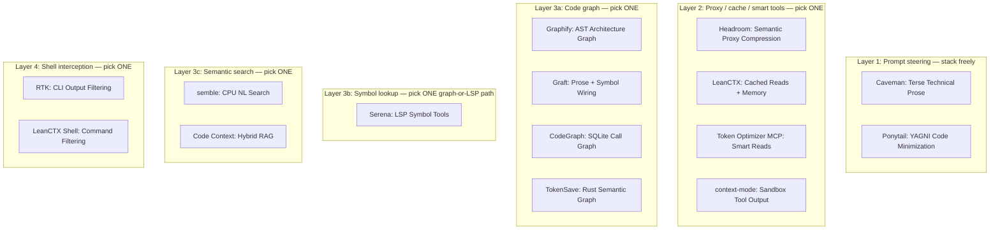

In **[Part 1: The Techniques]()**, we explored the architectural mechanisms of agent token bloat and the 25 core optimization principles. 

In this article (**Part 2**), we move from principles to software. If you want to **reduce token usage** with minimal effort, these are the open-source tools that do it for you. We catalog and evaluate **18 open-source tools, MCP middleware, CLI proxies, and context compressors** engineered specifically to cut token consumption across every layer of the agent stack.

> **Last verified:** September 2026. Repository URLs, licenses, and install commands re-checked against current releases. GitHub ★ / contributor counts in the matrix are snapshots from Sep 2026 and change quickly. Savings figures are **vendor- or author-reported** unless noted otherwise.

---

## Series Navigation

* **[Part 1: The Techniques]()** — What causes token bloat and 25 methods to prevent it.
* **Part 2 (This Guide):** *The Tools* — Standardized catalog and layer breakdown of token-saving software.

### TL;DR

* Start with **Caveman + Ponytail** (prompt rules, zero runtime).
* Add **RTK** for shell noise, then **one** code-intel tool (Graphify *or* Graft *or* CodeGraph) plus **Serena** for symbols.
* Pick **one** proxy/cache layer (Headroom *or* LeanCTX *or* Token Optimizer MCP *or* context-mode)—do not nest them.
* Savings % below are **author/vendor-reported**; measure tokens per successful task on your workload.
* Prefer verified package installs over `curl | bash` when both exist.

---

## The Agent Optimization Stack

Rather than installing ten overlapping tools, think of token optimization as a multi-tier pipeline. Each layer addresses a different point in the [Model Context Protocol (MCP)](https://modelcontextprotocol.io/) request lifecycle:


```mermaid
graph TD
    subgraph "Layer 1: Prompt steering — stack freely"
        CAVE[Caveman: Terse Technical Prose]
        PONY[Ponytail: YAGNI Code Minimization]
    end

    subgraph "Layer 2: Proxy / cache / smart tools — pick ONE"
        HEADROOM[Headroom: Semantic Proxy Compression]
        LCTX_P[LeanCTX: Cached Reads + Memory]
        TOMCP[Token Optimizer MCP: Smart Reads]
        CMODE[context-mode: Sandbox Tool Output]
    end

    subgraph "Layer 3a: Code graph — pick ONE"
        GRAPH[Graphify: AST Architecture Graph]
        GRAFT[Graft: Prose + Symbol Wiring]
        CGRAPH[CodeGraph: SQLite Call Graph]
        TSAVE[TokenSave: Rust Semantic Graph]
    end

    subgraph "Layer 3b: Symbol lookup — pick ONE graph-or-LSP path"
        SERENA[Serena: LSP Symbol Tools]
    end

    subgraph "Layer 3c: Semantic search — pick ONE"
        SEMBLE[semble: CPU NL Search]
        CCONTEXT[Code Context: Hybrid RAG]
    end

    subgraph "Layer 4: Shell interception — pick ONE"
        RTK[RTK: CLI Output Filtering]
        LCTX_S[LeanCTX Shell: Command Filtering]
    end

```

Peers marked “pick ONE” are alternatives, not a shopping list—details in [Conflicts & Overlaps](#conflicts--overlaps-what-stacks-safely). Serena pairs with **one** graph tool (skip Serena if that graph is TokenSave). Caveman + Ponytail stack with everything.

---

## Comprehensive Tool Comparison Matrix

Typical savings are **illustrative / author-reported** unless you re-measure. Prefer the Conflicts table before stacking peers. Sorted by GitHub ★ (Sep 2026, descending)—tool sections below follow the same order. Star/contributor columns are snapshots and change quickly. **Install Scope** is where you typically wire the tool (user/global agent vs per-project index/rules); many CLIs are global while their indexes live in the repo.

<div style="overflow-x: auto;" markdown="1">

| Tool | ★ Stars | Contributors | Primary Layer | How It Reduces Tokens | Typical Savings | Integration Type | Install Scope | License |
| :--- | ---: | ---: | :--- | :--- | :--- | :--- | :--- | :--- |
| **[Ponytail](https://github.com/DietrichGebert/ponytail)** | 147k | 64 | Code Rules | Forces stdlib/native reuse over boilerplate | ~20–30% (code) | Prompt Rule / Plugin | User or project rules | MIT |
| **[Graphify](https://github.com/Graphify-Labs/graphify)** | 122.1k | 281 | Knowledge Graph | Single graph query replaces multi-file reads | 5–70× (replaces reads) | Python CLI / AST | Global CLI + project graph | Apache 2.0 |
| **[Caveman](https://github.com/JuliusBrussee/caveman)** | 108k | 57 | Output Prose | Strips conversational filler and pleasantries | 60–80% (output) | Prompt Rule / Plugin | User/global agent skill | MIT |
| **[RTK](https://github.com/rtk-ai/rtk)** | 81.9k | 169 | Shell Output | Intercepts CLI output (git, tests, builds, docker) | 60–90% (shell) | Rust CLI / Hooks | Global CLI + agent hooks | Apache 2.0 |
| **[Headroom](https://github.com/headroomlabs-ai/headroom)** | 74k | 289 | API Proxy | Semantically compresses payloads before API | 60–95% (input) | Local HTTP Proxy / MCP | User/global session wrapper | Apache 2.0 |
| **[CodeGraph](https://github.com/colbymchenry/codegraph)** | 72k | 48 | Knowledge Graph | Tree-sitter AST → SQLite symbol/call/import graph | ~62% fewer tokens / ~44% $ (author) | TypeScript MCP | Global CLI + project index / MCP | MIT |
| **[Context7](https://github.com/upstash/context7)** | 62k | 128 | Context Delivery | Injects up-to-date, version-specific library docs | Eliminates hallucinated APIs | MCP / CLI | Agent MCP (user or project) | MIT |
| **[Serena](https://github.com/oraios/serena)** | 29.9k | 243 | Code Retrieval | Symbol-level LSP access (callers, definitions) | Eliminates raw reads | Python MCP (LSP) | Global CLI + project index | GPL-3.0-or-later / MIT |
| **[Repomix](https://github.com/yamadashy/repomix)** | 29k | 78 | Offline Bundling | Packs codebase into token-counted XML/Markdown | N/A (offline) | Node.js CLI | Global CLI (run per project) | MIT |
| **[context-mode](https://github.com/mksglu/context-mode)** | 24k | 111 | Context Proxy | Sandboxes bulky tool output outside LLM, retrieves on demand | Prevents blowup | MCP Server | Agent MCP (user) | Elastic-2.0 |
| **[Code Context](https://github.com/zilliztech/claude-context)** | 12.6k | 27 | Semantic Code RAG | Hybrid BM25 + Vector indexing for codebases | ~40% token reduction | MCP + Milvus/Zilliz | User package + project index | MIT |
| **[Graft](https://github.com/trailhq/Graft)** | 9.3k | 34 | Knowledge Graph | Linked markdown + symbol wiring graph served via MCP | 66% SWE-bench (vs 54% cold) | MCP / CLI | Global CLI + project graph | MIT |
| **[semble](https://github.com/MinishLab/semble)** | 6.2k | 10 | Code Search | Natural-language code retrieval replacing grep+read | ~98% token cut | MCP / CLI | User package + project index | MIT |
| **[LeanCTX](https://github.com/yvgude/lean-ctx)** | 3.8k | 60 | Context / Memory | Cached re-reads (~13 tokens), shell filter, memory | 60–90% + cache | Rust Binary (MCP) | Global CLI + agent MCP | Apache 2.0 |
| **[dirac](https://github.com/dirac-run/dirac)** | 1.5k | 18 | Context / Edit | Hash-anchored edits + parallel ops + AST manipulation | 50–80% cost cut (author) | Agent Harness | User CLI / editor extension | Apache 2.0 |
| **[Token Savior](https://github.com/Mibayy/token-savior)** | 1.2k | 7 | Code Navigation | Indexes by symbol so agents navigate by pointer | ~80% active tokens (author) | MCP / Python | User package + agent MCP | MIT |
| **[TokenSave](https://github.com/aovestdipaperino/tokensave)** | 650 | 39 | Code Graph | Pre-indexed semantic graph for code queries | Varies | Rust MCP | Global CLI + project index | MIT |
| **[Token Optimizer MCP](https://github.com/ooples/token-optimizer-mcp)** | 537 | 8 | Smart Reads / Cache | 70+ tools with content-hash caching & smart reads | 95%+ on re-reads | Node.js MCP | Agent MCP (user or project) | MIT |

</div>

### Quick Start: Which Tools Do You Need?

* **Solo dev, want instant savings with zero setup?** Start with **Caveman + Ponytail** (prompt rules, no runtime).
* **Working in a medium codebase, want the best daily driver?** Add **RTK + Graphify + Serena** (CLI filtering + architecture graph + symbol lookup).
* **Large monorepo or team environment?** Choose **LeanCTX** (context caching + memory) **or** **Headroom** (API proxy compression)—not both—as your foundation, then layer Graphify + Serena on top. If LeanCTX's shell filter is on, skip RTK (same layer).

---

## 1. [Ponytail](https://github.com/DietrichGebert/ponytail) — YAGNI Code Rules

Steering file that pushes reuse → stdlib → platform → dependency before generating new code.

```bash
curl -o ~/.claude/AGENTS.md https://raw.githubusercontent.com/DietrichGebert/ponytail/main/AGENTS.md
# Or merge the same rules into your project AGENTS.md / Cursor rules
```

**Watch out:** Pure prompt rules—no daemon. Stack with Caveman for output + generation discipline.

---

## 2. [Graphify](https://github.com/Graphify-Labs/graphify) — Local AST Knowledge Graph

Builds a local `graph.json` (tree-sitter, 37+ languages) so one graph query replaces multi-file exploration.

```bash
uv tool install graphifyy   # note the double-y package name
graphify install
cd your-project
graphify extract . --code-only
graphify hook install       # rebuild on commit
```

Useful: `graphify query "auth to database"`, `graphify path "A" "B"`.

**Watch out:** Rebuild after big refactors (hook helps). Huge monorepos can be slow on first extract. Pick **one** graph tool (vs Graft/CodeGraph/TokenSave).

---

## 3. [Caveman](https://github.com/JuliusBrussee/caveman) — Terse Outputs (& shrink middleware)

Prompt/plugin rules that cut conversational filler; optional `caveman-shrink` compresses MCP tool descriptions.

```bash
npx skills add JuliusBrussee/caveman -g
# or: npm install -g @caveman-ai/cli && caveman setup --install
```

**Watch out:** Too terse for teaching/onboarding threads. Zero runtime cost—good default with Ponytail.

---

## 4. [RTK](https://github.com/rtk-ai/rtk) — CLI Output Interception

Intercepts agent shell output (`git`, `kubectl`, tests, builds) into short summaries before it hits the model.

```bash
brew install rtk
rtk init -g                 # Claude Code
rtk init -g --gemini        # Gemini CLI
rtk init --agent cursor     # Cursor
rtk gain                    # savings report
```

**Watch out:** Only covers the agent's shell tool—MCP/API payloads bypass it. **Pairs with:** Serena or Graphify + Caveman.

---

## 5. [Headroom](https://github.com/headroomlabs-ai/headroom) — API Proxy Compression

Local proxy/wrapper that compresses full session payloads (history, reads, tool logs) before they reach the API.

```bash
pipx install --python python3.13 "headroom-ai[all]"
headroom wrap claude        # or: codex, cursor, aider
# Or daemon:
# export ANTHROPIC_BASE_URL=http://127.0.0.1:8787 && headroom proxy --port 8787
headroom perf               # compression dashboard
```

**Watch out:** Extra hop (~50–100ms); needs Python 3.13+. Pick **one** proxy/cache/smart-tool layer—don't nest with LeanCTX, Token Optimizer MCP, or context-mode.

---

## 6. [CodeGraph](https://github.com/colbymchenry/codegraph) — SQLite Symbol/Call Graph

Tree-sitter → SQLite graph exposed over MCP so agents answer from structure instead of file crawls.

```bash
npm install -g codegraph
# Register MCP per upstream docs for your agent
```

**Watch out:** Author benches show fewer tokens processed but **higher residual context** after answers—budget long sessions carefully. Pick **one** graph (vs Graphify/Graft/TokenSave). Pair with semble for fuzzy NL search.

---

## 7. [Context7](https://github.com/upstash/context7) — Live Library Docs

Injects current, version-specific docs at query time so agents stop inventing old APIs.

```json
{
  "mcpServers": {
    "context7": {
      "command": "npx",
      "args": ["-y", "@upstash/context7-mcp@latest"]
    }
  }
}
```

**Watch out:** Network service—not offline; weak for private/internal libraries. Stacks with everything else.

---

## 8. [Serena](https://github.com/oraios/serena) — LSP Symbol Tools

Exposes IDE-grade `find_symbol` / references / diagnostics over MCP so the agent stops opening whole files to hunt definitions.

```bash
uv tool install serena-agent
npm install -g pyright bash-language-server
cd your-project && serena init && serena project create . --index
```

```json
{
  "mcpServers": {
    "serena": {
      "command": "serena",
      "args": ["start-mcp-server", "--context", "ide", "--project-from-cwd"]
    }
  }
}
```

**Watch out:** Quality follows the language server (Pyright/TS strong; others vary). **Pairs with:** one graph tool (e.g. Graphify) for architecture—skip Serena if TokenSave is already your graph/symbol layer.

---

## 9. [Repomix](https://github.com/yamadashy/repomix) — Offline Repo Pack for Web LLMs

Packs a token-counted XML/Markdown snapshot for ChatGPT/Claude **web**—not for multi-turn IDE agents.

```bash
npm install -g repomix
repomix                     # pack current repo
```

**Watch out:** Static snapshot; goes stale as you edit. Use Graphify/Serena for iterative agent loops instead.

---

## 10. [context-mode](https://github.com/mksglu/context-mode) — Sandbox Bulky Tool Output

Keeps large tool dumps out of the window and pulls fragments back via search/index tools (ELv2 license).

```bash
claude mcp add context-mode -- npx -y context-mode
# Full Claude plugin / other agents: see upstream platform docs
```

**Watch out:** Same layer as Headroom/LeanCTX/Token Optimizer MCP—**pick one**. Hook-heavy setup is Claude-oriented.

---

## 11. [Code Context](https://github.com/zilliztech/claude-context) — Hybrid Code RAG

Indexes the repo (BM25 + embeddings via Milvus/Zilliz) and returns top chunks instead of directory crawls.

```bash
pip install claude-code-context
claude-context index .
```

```json
{
  "mcpServers": {
    "code-context": {
      "command": "claude-context",
      "args": ["serve"]
    }
  }
}
```

**Watch out:** Needs an embedding provider (API or local Ollama). Not fully offline if you use hosted Zilliz/embeddings.

---

## 12. [Graft](https://github.com/trailhq/Graft) — Plain-English Codebase Graph

Local regenerable graph of prose explanations + symbol wiring, served via MCP/hooks (npm still `@nanonets/graft`).

```bash
npm install -g @nanonets/graft
graft init
```

**Watch out:** Optional anonymous usage ping—disable with `graft telemetry disable` or `DO_NOT_TRACK=1`. Pick **one** graph (vs Graphify/CodeGraph/TokenSave).

---

## 13. [semble](https://github.com/MinishLab/semble) — NL Code Search (CPU)

Search by meaning (“rate limiting middleware”) on CPU with no external vector DB.

```bash
pip install semble
semble index .
semble search "authentication token validation"
```

**Watch out:** ~100ms/query on CPU; best under ~500K LOC. **Pairs with:** CodeGraph for structural queries.

---

## 14. [LeanCTX](https://github.com/yvgude/lean-ctx) — Cached Reads & Session Memory

MCP + CLI for map/signature/diff reads, ~13-token cached re-reads, shell filtering, and durable session memory.

```bash
brew tap yvgude/lean-ctx && brew install lean-ctx
lean-ctx onboard            # wire MCP into detected agents
lean-ctx read src/main.rs -m map
lean-ctx gain
```

**Watch out:** MCP-only for agent use. If LeanCTX shell filtering is on, skip RTK. **Best for:** monorepos / multi-session work.

---

## 15. [dirac](https://github.com/dirac-run/dirac) — Hash-Anchored Agent Harness

Full agent (VS Code / CLI / ACP) with hash-anchored edits, parallel ops, and optional cheap utility-model routing. Site: [dirac.run](https://dirac.run/).

```bash
npm install -g dirac-cli    # Node 22.13–24.x
# Or install VS Code / Open VSX extension dirac-run.dirac
```

**Watch out:** Don't run Dirac **and** another full agent editing the same tree. Use its built-ins, or add Graphify/Graft only if you want an external graph.

---

## 16. [Token Savior](https://github.com/Mibayy/token-savior) — Pointer Navigation

Indexes symbols so the agent navigates by pointer instead of re-pasting large file bodies.

```bash
pip install "token-savior-recall[mcp]"
ts init --agent claude --yes
# or: claude mcp add token-savior -- $(which token-savior)
```

**Watch out:** Navigation only—optional add-on beside one graph tool or Serena; still pair with a graph for module relationships.

---

## 17. [TokenSave](https://github.com/aovestdipaperino/tokensave) — Rust Semantic Code Graph

Pre-indexed semantic graph over MCP—handy when you want symbol/caller lookups without a Python LSP stack.

```bash
cargo install tokensave
tokensave index .
tokensave query "find callers of authenticate()"
```

**Watch out:** Fewer language grammars than Graphify/Serena today. Counts as your **one** graph pick (skip Serena if you use TokenSave for symbol/caller lookups). Prefer Graphify for broad polyglot coverage.

---

## 18. [Token Optimizer MCP](https://github.com/ooples/token-optimizer-mcp) — Smart Read/Cache Suite

Replaces native read/grep/test tools with hash-aware `smart_*` variants that return deltas/summaries.

```json
{
  "mcpServers": {
    "token-optimizer": {
      "command": "npx",
      "args": ["-y", "@ooples/token-optimizer-mcp@latest"]
    }
  }
}
```

**Watch out:** 70+ tool schemas add their own context cost—use as a **replacement** for native tools, not beside another proxy (Headroom/LeanCTX/context-mode).

---

## Usage & Cost Monitoring Utilities

* **`ccusage`:** Real-time token and dollar tracking specifically for Claude Code (`npx ccusage`).
* **`rtk gain`:** Live token and dollar savings accounting across CLI commands.
* **`headroom perf`:** Live compression ratio and latency dashboard for proxy sessions.
* **LiteLLM:** Proxy-level routing, cost tracking, and caching across multiple LLM providers.

---

## Conflicts & Overlaps: What Stacks Safely

<div style="overflow-x: auto;" markdown="1">

| Layer | Tools | Compatibility Rule | Explanation |
| :--- | :--- | :--- | :--- |
| **Prompt steering** | Caveman (output prose) + Ponytail (YAGNI code rules) | ✅ **Stack with everything** | Pure prompt/plugin rules; zero runtime overhead. Different jobs—use both. |
| **Shell interception** | RTK vs LeanCTX shell filter | ⚠️ **Pick ONE** | Both rewrite agent terminal output; running both double-filters. LeanCTX without shell filtering can still sit beside RTK. |
| **Proxy / cache / smart tools** | Headroom vs LeanCTX (MCP reads/cache) vs Token Optimizer MCP vs context-mode | ⚠️ **Pick ONE** | Different mechanisms (HTTP proxy, cached/smart reads, tool-output sandbox) but nesting them stacks compression and competing tool surfaces. |
| **Code intelligence (graph)** | Graphify vs Graft vs CodeGraph vs TokenSave | ⚠️ **Pick ONE** | All expose AST/symbol graphs for structure queries. Differ in UX/storage (community detection, prose wiring, SQLite, Rust MCP)—not additive. |
| **Symbol lookup** | Serena vs TokenSave | ⚠️ **Pick ONE** | Both answer find-symbol / callers without dumping files. Serena uses LSP; TokenSave uses a pre-indexed graph (so it also counts as your graph pick above). |
| **Pointer navigation** | Token Savior | ✅ **Optional add-on** | Navigation sugar only—pair with one graph tool or Serena; not a substitute for either. |
| **Code search** | semble vs Code Context | ⚠️ **Pick ONE** | Both provide semantic code search; semble is CPU-only/lightweight, Code Context uses vector stores. Either can pair with one graph tool. |
| **Offline bundling** | Repomix | ✅ **Orthogonal (web chat)** | Snapshot pack for ChatGPT/Claude **web**, not multi-turn IDE agents. Use instead of Graphify/Serena loops when pasting a repo into a browser LLM. |
| **Instruction files** | Progressive / lazy `AGENTS.md` (Part 1 §2) vs monolithic dumps | ⚠️ **Prefer progressive** | Keep instruction files small; load deep docs on demand (see Part 1). Unrelated to Context7. |
| **Live library docs** | Context7 | ✅ **Stacks with everything** | Network docs CDN—fills a gap local graph/search tools don't. Weak for private/internal libraries. |
| **Editing** | dirac vs Claude Code / Cursor agent / Aider / other full harness | ⚠️ **Pick ONE** | Dirac is a full agent with its own edit model; don't dual-drive the same tree. External graph tools are optional add-ons only. |

</div>

---

## Frequently Asked Questions

**Which tool should I install first to reduce token usage?**
Start with **Caveman** (zero setup, 60–80% output token reduction) and **RTK** (`brew install rtk`, 60–90% shell output reduction). These two cover the highest-cost token sources without changing your workflow.

**RTK vs Headroom vs LeanCTX — which should I choose?**
They operate at different layers. RTK filters CLI output only. Headroom compresses the entire API payload (including file reads and history). LeanCTX provides cached reads + session memory + optional shell filtering. Pick **one** proxy/cache/smart-tool (Headroom, LeanCTX, Token Optimizer MCP, or context-mode). RTK stacks with LeanCTX only if LeanCTX's shell filter is off—otherwise pick RTK **or** LeanCTX shell. See the Conflicts table above.

**Do these tools work with Claude Code, Cursor, and Gemini CLI?**
Most do. RTK, Caveman, Ponytail, Graphify, and Serena work across all major agents. Headroom is strongest with Anthropic-API agents (Claude Code, Codex, Aider). Check each tool section for agent-specific setup notes.

**Will these tools break my existing MCP setup?**
No — they add alongside existing tools. Caveman and Ponytail are pure prompt rules. RTK is a CLI hook. Graphify and Serena register as additional MCP servers. The only conflict risk is running two proxy-layer tools simultaneously (Headroom + LeanCTX + Token Optimizer MCP — pick one).

**Are these tools free and open source?**
Most are open-source under MIT or Apache 2.0, but **not all**: Serena's application layer is GPL-3.0-or-later, and context-mode uses Elastic License 2.0. Several tools phone home or use the network (Context7 docs CDN, optional Graft telemetry, embedding APIs / Zilliz for Code Context). Prefer local modes where available, and read each project's license and privacy docs.

**How do I measure actual savings after installing these tools?**
Use `rtk gain` (RTK savings), `headroom perf` (proxy compression stats), `/usage` in Claude Code (session totals), or `npx ccusage` (historical dollar tracking). Compare your tokens-per-task before and after.

<script type="application/ld+json">
{
  "@context": "https://schema.org",
  "@type": "FAQPage",
  "mainEntity": [
    {
      "@type": "Question",
      "name": "Which tool should I install first to reduce token usage?",
      "acceptedAnswer": {
        "@type": "Answer",
        "text": "Start with Caveman (zero setup, 60–80% output token reduction) and RTK (brew install rtk, 60–90% shell output reduction). These two cover the highest-cost token sources without changing your workflow."
      }
    },
    {
      "@type": "Question",
      "name": "RTK vs Headroom vs LeanCTX — which should I choose?",
      "acceptedAnswer": {
        "@type": "Answer",
        "text": "They operate at different layers. RTK filters CLI output only. Headroom compresses the entire API payload. LeanCTX provides cached reads, session memory, and shell filtering. Pick one from the proxy/cache layer (Headroom or LeanCTX)."
      }
    },
    {
      "@type": "Question",
      "name": "Do these tools work with Claude Code, Cursor, and Gemini CLI?",
      "acceptedAnswer": {
        "@type": "Answer",
        "text": "Most do. RTK, Caveman, Ponytail, Graphify, and Serena work across all major agents. Headroom is strongest with Anthropic-API agents. Check each tool section for agent-specific setup notes."
      }
    },
    {
      "@type": "Question",
      "name": "Will these tools break my existing MCP setup?",
      "acceptedAnswer": {
        "@type": "Answer",
        "text": "No — they add alongside existing tools. Caveman and Ponytail are prompt rules, RTK is a CLI hook, and Graphify and Serena register as additional MCP servers."
      }
    },
    {
      "@type": "Question",
      "name": "Are these tools free and open source?",
      "acceptedAnswer": {
        "@type": "Answer",
        "text": "Most are MIT or Apache 2.0, but Serena includes GPL-3.0-or-later components and context-mode uses Elastic License 2.0. Some tools use the network (Context7, embeddings) or optional telemetry. Check each project license and privacy docs."
      }
    },
    {
      "@type": "Question",
      "name": "How do I measure actual savings after installing these tools?",
      "acceptedAnswer": {
        "@type": "Answer",
        "text": "Use rtk gain (RTK savings), headroom perf (proxy compression stats), /usage in Claude Code (session totals), or npx ccusage (historical dollar tracking)."
      }
    }
  ]
}
</script>

---

## Next in the Series

Now that you know the tools and their compatibility rules, return to **[Part 1: The Techniques]()** for the tool-agnostic playbook—or apply the Quick Start stacks above and measure tokens per successful task before adding more layers.

---

*Last verified: September 2026. Tool ecosystems change rapidly — always check official repositories for the latest install commands, licenses, and compatibility.*
