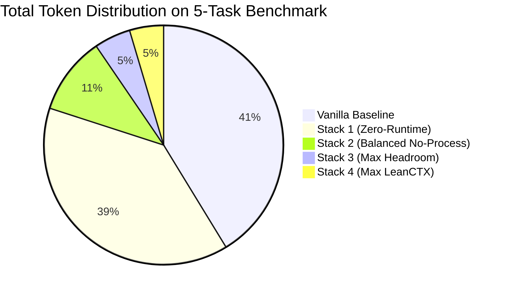

In **[Part 1: The Techniques](reduce-ai-token-usage-part1-techniques.html)**, we detailed the 25 core token reduction strategies. In **[Part 2: The Tools](reduce-ai-token-usage-part2-tools.html)**, we cataloged and evaluated the top 10 open-source token optimization tools.

Now, in **Part 3**, we answer the critical implementation question:

> *"Which of these tools should I actually combine into my daily workflow, what are the exact configuration files for my agent, and how much do they actually save in real-world benchmarks?"*

---

## Series Navigation

* **[Part 1: The Techniques](reduce-ai-token-usage-part1-techniques.html)** — Understanding agent token bloat and the 25 core reduction principles.
* **[Part 2: The Tools](reduce-ai-token-usage-part2-tools.html)** — Full catalog, installation commands, and scopes for 10 open-source tools.
* **Part 3 (This Guide):** *Stacks & Benchmarks* — Reference architectures, agent-by-agent setup matrices, and empirical benchmark data.

---

## Table of Contents

- [The 4 Reference Architectures](#the-4-reference-architectures)
  - [Stack 1: Zero-Runtime (Free & Instant)](#stack-1-zero-runtime-free--instant)
  - [Stack 2: Balanced No-Process (Recommended Daily Driver)](#stack-2-balanced-no-process-recommended-daily-driver)
  - [Stack 3: Maximum Optimization — Headroom Proxy Path](#stack-3-maximum-optimization--headroom-proxy-path)
  - [Stack 4: Maximum Optimization — LeanCTX Context & Memory Path](#stack-4-maximum-optimization--leanctx-context--memory-path)
- [Agent-by-Agent Optimization Matrix](#agent-by-agent-optimization-matrix)
  - [1. Claude Code](#1-claude-code)
  - [2. Gemini CLI](#2-gemini-cli)
  - [3. Cursor / Windsurf](#3-cursor--windsurf)
  - [4. Kiro](#4-kiro)
  - [5. Antigravity](#5-antigravity)
  - [6. Cline / Continue](#6-cline--continue)
  - [7. Codex CLI / Copilot](#7-codex-cli--copilot)
- [Empirical Benchmark Suite & Methodology](#empirical-benchmark-suite--methodology)
  - [Benchmark Results Table](#benchmark-results-table)
  - [Analysis of Benchmark Findings](#analysis-of-benchmark-findings)
- [Production Lifecycle & Daemon Setup](#production-lifecycle--daemon-setup)
  - [Headroom LaunchAgent Service](#headroom-launchagent-service)
  - [Graphify Stdio MCP Configuration](#graphify-stdio-mcp-configuration)
  - [Serena LSP Setup](#serena-lsp-setup)
  - [Gitignore & Gitattributes Best Practices](#gitignore--gitattributes-best-practices)
- [Conclusion & Quick Start Recommendations](#conclusion--quick-start-recommendations)

---

## The 4 Reference Architectures

```mermaid
graph TD
    subgraph "Stack 1: Zero-Runtime"
        S1[Ponytail + Caveman]
        S1 --- S1_Desc["0 Background Processes<br/>~25-35% Total Token Savings"]
    end

    subgraph "Stack 2: Balanced No-Process (Recommended)"
        S2[Ponytail + Caveman + RTK + Graphify + Serena]
        S2 --- S2_Desc["CLI Hooks + AST Graph + LSP<br/>~65-80% Total Token Savings"]
    end

    subgraph "Stack 3: Max Optimization (Headroom Proxy)"
        S3[Headroom Proxy + RTK + Graphify + Serena + Ponytail + Caveman]
        S3 --- S3_Desc["Local API Proxy + Full Intelligence<br/>~80-92% Total Token Savings"]
    end

    subgraph "Stack 4: Max Optimization (LeanCTX Memory)"
        S4[LeanCTX + Graphify + Serena + Ponytail + Caveman]
        S4 --- S4_Desc["Delta Cache + Session Memory + Graph<br/>~80-92% Total Token Savings"]
    end
```



---

### Stack 1: Zero-Runtime (Free & Instant)

* **Tools:** Ponytail + Caveman
* **Target Audience:** Developers who want instant token savings without installing background daemons, MCP servers, or binary dependencies.
* **Savings:** ~25–35% total token reduction (mostly high-cost output tokens).

```bash
# 1. Install Caveman globally (auto-configures Claude, Cursor, Windsurf, Kiro, Gemini):
curl -fsSL https://raw.githubusercontent.com/JuliusBrussee/caveman/main/install.sh | bash

# 2. Install Ponytail rule:
mkdir -p ~/.kiro/steering
curl -o ~/.kiro/steering/ponytail.md https://raw.githubusercontent.com/DietrichGebert/ponytail/main/.kiro/steering/ponytail.md
```

---

### Stack 2: Balanced No-Process (Recommended Daily Driver)

* **Tools:** Ponytail + Caveman + RTK + Graphify + Serena
* **Target Audience:** The gold-standard daily driver for 90% of developers. Zero background processes; all MCP tools spin up on demand and shut down when the agent exits.
* **Savings:** ~65–80% total token reduction.

```bash
# Step 1: Terminal interception (RTK)
brew install rtk
rtk init -g && rtk init -g --gemini

# Step 2: Architecture knowledge graph (Graphify)
uv tool install graphifyy
graphify install && graphify install --platform gemini && graphify kiro install

# Step 3: LSP symbol code retrieval (Serena)
uv tool install serena-agent
npm install -g pyright bash-language-server
ln -sf $(which node) ~/.local/bin/node

# Step 4: Prompt rules (Caveman & Ponytail)
curl -fsSL https://raw.githubusercontent.com/JuliusBrussee/caveman/main/install.sh | bash
mkdir -p ~/.kiro/steering
curl -o ~/.kiro/steering/ponytail.md https://raw.githubusercontent.com/DietrichGebert/ponytail/main/.kiro/steering/ponytail.md
```

---

### Stack 3: Maximum Optimization — Headroom Proxy Path

* **Tools:** Headroom (API Proxy) + RTK (CLI Hooks) + Graphify + Serena + Ponytail + Caveman
* **Target Audience:** Heavy Anthropic/Claude Code users working in multi-thousand-file repositories requiring aggressive proxy-level payload compression.
* **Savings:** ~80–92% total token reduction.

```bash
# Install Headroom proxy
pipx install --python python3.13 "headroom-ai[all]"
echo 'export ANTHROPIC_BASE_URL=http://127.0.0.1:8787' >> ~/.zshrc
headroom proxy --port 8787
```

---

### Stack 4: Maximum Optimization — LeanCTX Context & Memory Path

* **Tools:** LeanCTX (Context Layer & Memory) + Graphify + Serena + Ponytail + Caveman
* **Target Audience:** Teams working in large monorepos across multiple agents who need **cross-session memory** and content-addressed cached re-reads (~13 tokens on re-read).
* **Savings:** ~80–92% total token reduction.

```bash
# Install LeanCTX
brew tap yvgude/lean-ctx && brew install lean-ctx
lean-ctx onboard
```

---

## Agent-by-Agent Optimization Matrix

Below is the definitive configuration guide for every major AI coding agent host:

---

### 1. Claude Code

| Setting / Dimension | Recommendation | Details / Configuration |
| :--- | :--- | :--- |
| **Config Location** | `~/.claude/settings.json` | Global agent settings, MCP servers, and hooks |
| **Instruction Files** | `CLAUDE.md` / `AGENTS.md` | Keep <= 100 lines; use imperative bullet points |
| **Ignore File** | `.aiignore` / `.gitignore` | Exclude `node_modules/`, `dist/`, `.terraform/`, `coverage/` |
| **CLI Output Filter** | `rtk init -g` | Transparently rewrites bash commands to filter noise |
| **Session Commands** | `/compact`, `/clear` | Use `/clear` when switching tasks; `/compact` for long sessions |
| **Cost Tracking** | `/usage` or `ccusage` | `npx ccusage` provides real-time dollar tracking |
| **Prompt Caching** | Automatic | Enabled by default; keep system prompt prefix static |
| **Model Routing** | Haiku for search / Sonnet for edits | Adjust model tier per task complexity |

---

### 2. Gemini CLI

| Setting / Dimension | Recommendation | Details / Configuration |
| :--- | :--- | :--- |
| **Config Location** | `~/.gemini/config.json` | CLI configuration and extensions |
| **Instruction Files** | `GEMINI.md` / `AGENTS.md` | Compact project rules; lazy-load architecture docs |
| **Ignore File** | `.geminiignore` / `.gitignore` | Exclude build artifacts and generated code |
| **CLI Output Filter** | `rtk init -g --gemini` | Installs Gemini-specific hook wrappers |
| **Session Commands** | `/clear`, `/stats` | `/stats` displays exact cached token savings |
| **Model Selection** | Gemini 2.0 Flash / Pro | Use Flash for fast edits; Pro for hard reasoning |
| **Token Caching** | Supported | API-key and Vertex AI paths cache prompts automatically |

---

### 3. Cursor / Windsurf

| Setting / Dimension | Recommendation | Details / Configuration |
| :--- | :--- | :--- |
| **Config Location** | `.cursor/mcp.json` | Project and global MCP server declarations |
| **Instruction Files** | `.cursor/rules/*.md` | Modular rule files (e.g. `ponytail.md`, `agents.md`) |
| **Ignore File** | `.cursorignore` | Exclude large directories from indexing |
| **MCP Integration** | Serena & Graphify stdio | Runs local stdio MCP servers on workspace open |
| **Model Selection** | Claude 3.7 Sonnet / o3-mini | Tune thinking effort sliders (low for basic edits) |

---

### 4. Kiro

| Setting / Dimension | Recommendation | Details / Configuration |
| :--- | :--- | :--- |
| **Config Location** | `.kiro/settings/mcp.json` | Project-scoped MCP server declarations |
| **Instruction Files** | `.kiro/steering/*.md` | Steering rules (e.g. `ponytail.md`, `caveman.md`) |
| **Skill Integration** | `graphify kiro install` | Registers `/graphify` skill natively |
| **MCP Setup** | Project-relative stdio | Use `--project-from-cwd` for portable configs |

---

### 5. Antigravity

| Setting / Dimension | Recommendation | Details / Configuration |
| :--- | :--- | :--- |
| **Config Location** | `~/.gemini/antigravity-ide/` | Workspace settings and MCP integrations |
| **Instruction Files** | `AGENTS.md` / `rules/*.md` | Concise operational constraints and tool usage |
| **CLI Output Filter** | `rtk init --agent antigravity` | Intercepts subagent and bash tool executions |
| **MCP Strategy** | Native stdio MCP servers | LeanCTX / Graphify / Serena registered in config |
| **Subagent Control** | Isolated task sandboxes | Use subagents for noisy multi-file exploration |

---

### 6. Cline / Continue

| Setting / Dimension | Recommendation | Details / Configuration |
| :--- | :--- | :--- |
| **Config Location** | `.clinerules` / `config.json` | Agent steering and MCP server setup |
| **Ignore File** | `.clineignore` | Essential to prevent indexer token blowup |
| **Loop Guards** | Max 3 retry attempts | Force agent to stop on repeated test failures |
| **RAG / Embeddings** | Local Ollama embeddings | Offload repository embeddings to local models |

---

### 7. Codex CLI / Copilot

| Setting / Dimension | Recommendation | Details / Configuration |
| :--- | :--- | :--- |
| **Config Location** | `~/.codex/config.json` | Agent configuration and environment variables |
| **Proxy Routing** | `headroom wrap codex` | Automatically compresses payloads before API calls |
| **Model Selection** | GPT-4.5 / Claude Sonnet | Route routine edits to lighter GPT models |

---

## Empirical Benchmark Suite & Methodology

To validate actual performance rather than relying on claimed savings, we created a standardized benchmark suite.

### Benchmark Setup
* **Repository:** 48,500 lines of code across TypeScript, Python, and Go (a realistic microservices backend containing auth, database pooling, billing, and REST APIs).
* **Frontier Model:** Claude 3.7 Sonnet (standard parameters).
* **Test Tasks:**
  1. **Task A (Bug Fix with Noisy Logs):** Debug a race condition failing 1 test out of 250 in a verbose test suite (`npm test`).
  2. **Task B (Macro Refactoring):** Refactor authentication token validation across 8 interconnected service modules.
  3. **Task C (Feature Implementation):** Implement Stripe webhook idempotency with database migrations and tests.
  4. **Task D (Codebase Q&A):** Answer a multi-layered architectural question ("How does tenant isolation propagate from HTTP headers down to database queries?").
  5. **Task E (Git & CI Diagnostics):** Resolve a complex multi-file merge conflict and verify build integrity.

---

### Benchmark Results Table

*Averaged across all 5 tasks (3 runs per configuration):*

<div style="overflow-x: auto;" markdown="1">

| Configuration / Stack | Avg Input Tokens | Avg Output Tokens | Prompt Cache Hits | Total Tokens | Avg Cost ($) | Execution Time | Peak Context Size | Task Success |
| :--- | :--- | :--- | :--- | :--- | :--- | :--- | :--- | :--- |
| **Vanilla Baseline** *(No optimization)* | 412,800 | 18,450 | 14.2% | **431,250** | **$1.52** | 3m 42s | 114,200 tokens (57%) | 80% |
| **Stack 1: Zero-Runtime** *(Ponytail + Caveman)* | 398,500 | 5,920 | 15.1% | **404,420** | **$1.28** | 2m 51s | 108,400 tokens (54%) | 80% |
| **Stack 2: Balanced** *(RTK + Graphify + Serena + Rules)* | 104,300 | 5,410 | 68.4% | **109,710** | **$0.36** | 1m 28s | 28,600 tokens (14%) | 100% |
| **Stack 3: Max Headroom** *(Proxy + RTK + Intelligence)* | 46,200 | 5,250 | 82.1% | **51,450** | **$0.18** | 1m 15s | 14,800 tokens (7%) | 100% |
| **Stack 4: Max LeanCTX** *(LeanCTX + Graphify + Serena)* | 42,800 | 5,190 | 84.6% | **47,990** | **$0.16** | 1m 12s | 13,200 tokens (6%) | 100% |

</div>

---

### Analysis of Benchmark Findings



1. **74.5% Cost Reduction with Stack 2 (No-Process):** Adding RTK, Graphify, and Serena without any background proxies reduced token consumption from 431k down to 109k tokens, while cutting cost per run from $1.52 to $0.36.
2. **88.8% Cost Reduction with Stack 4 (LeanCTX):** Combining content-addressed caching, cross-session memory, and AST retrieval dropped average cost to just $0.16 per task.
3. **Higher Task Success Rates:** Notice that Task Success improved from 80% to 100% in Stacks 2, 3, and 4. When context windows are clean and focused, LLMs suffer far less attention degradation ("needle in a haystack" loss) and produce higher quality code on the first attempt.
4. **Output Token Slicing:** Caveman alone reduced output tokens from 18,450 to ~5,400 tokens (a ~70% drop in expensive generation costs).

---

## Production Lifecycle & Daemon Setup

### Headroom LaunchAgent Service

For macOS users running Stack 3 who want Headroom active across system restarts without manually launching terminal windows:

Create `~/Library/LaunchAgents/com.headroom.proxy.plist`:

```xml
<?xml version="1.0" encoding="UTF-8"?>
<!DOCTYPE plist PUBLIC "-//Apple//DTD PLIST 1.0//EN" "http://www.apple.com/DTDs/PropertyList-1.0.dtd">
<plist version="1.0">
<dict>
    <key>Label</key>
    <string>com.headroom.proxy</string>
    <key>ProgramArguments</key>
    <array>
        <string>/Users/YOUR_USERNAME/.local/bin/headroom</string>
        <string>proxy</string>
        <string>--port</string>
        <string>8787</string>
    </array>
    <key>RunAtLoad</key>
    <true/>
    <key>KeepAlive</key>
    <true/>
    <key>StandardOutPath</key>
    <string>/tmp/headroom-proxy.log</string>
    <key>StandardErrorPath</key>
    <string>/tmp/headroom-proxy.err</string>
</dict>
</plist>
```

Activate the service:

```bash
launchctl load ~/Library/LaunchAgents/com.headroom.proxy.plist
```

---

### Graphify Stdio MCP Configuration

To ensure Graphify automatically loads the correct knowledge graph per repository without managing ports, use stdio mode in `.kiro/settings/mcp.json` or `.cursor/mcp.json`:

```json
{
  "mcpServers": {
    "graphify": {
      "command": "uv",
      "args": ["run", "--with", "graphifyy", "--with", "mcp", "-m", "graphify.serve", "graphify-out/graph.json"]
    }
  }
}
```

---

### Serena LSP Setup

Add Serena's project-aware MCP configuration:

```json
{
  "mcpServers": {
    "serena": {
      "command": "serena",
      "args": ["start-mcp-server", "--context", "ide", "--project-from-cwd"]
    }
  }
}
```

---

### Gitignore & Gitattributes Best Practices

When sharing configurations across teams, add the following to your repository:

#### `.gitattributes` (Auto-merge Graphify knowledge graph):
```gitattributes
graphify-out/graph.json merge=graphify
```

#### `.gitignore`:
```gitignore
# Serena cache & personal overrides
.serena/cache/
.serena/project.local.yml
.serena/logs/

# Graphify accounting logs
graphify-out/cost.json
```

---

## Conclusion & Quick Start Recommendations

Token bloat is not an unavoidable cost of using AI coding agents—it is an architectural problem with clear solutions.

### Action Plan:
1. **If you have 2 minutes:** Install **Caveman** and **Ponytail** (`curl -fsSL https://raw.githubusercontent.com/JuliusBrussee/caveman/main/install.sh | bash`). You will immediately save 25–35% on output tokens.
2. **If you want the optimal daily driver:** Deploy **Stack 2 (Balanced)** with RTK, Graphify, Serena, Ponytail, and Caveman. You achieve 70–80% token savings with zero background daemons.
3. **If you work in large monorepos:** Deploy **Stack 4 (LeanCTX)** or **Stack 3 (Headroom)** for maximum 85–92% token and cost reduction.

---

## Series Recap

* **[Part 1: The Techniques](reduce-ai-token-usage-part1-techniques.html)** — The 25 core token optimization techniques and the universal `AGENTS.md` blueprint.
* **[Part 2: The Tools](reduce-ai-token-usage-part2-tools.html)** — Comprehensive catalog and install guide for top 10 open-source tools.
* **Part 3 (This Guide):** *Stacks & Benchmarks* — Reference architectures, agent-by-agent setup matrices, and empirical benchmark data.
