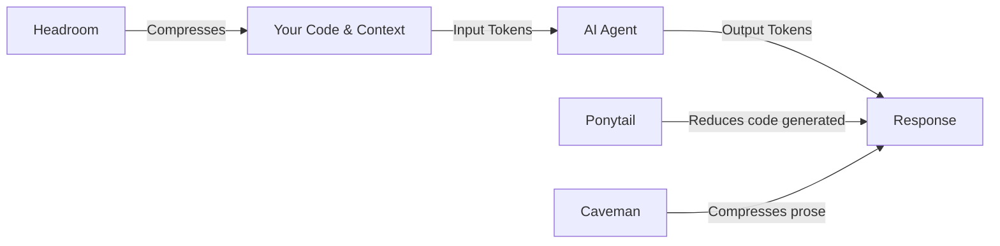
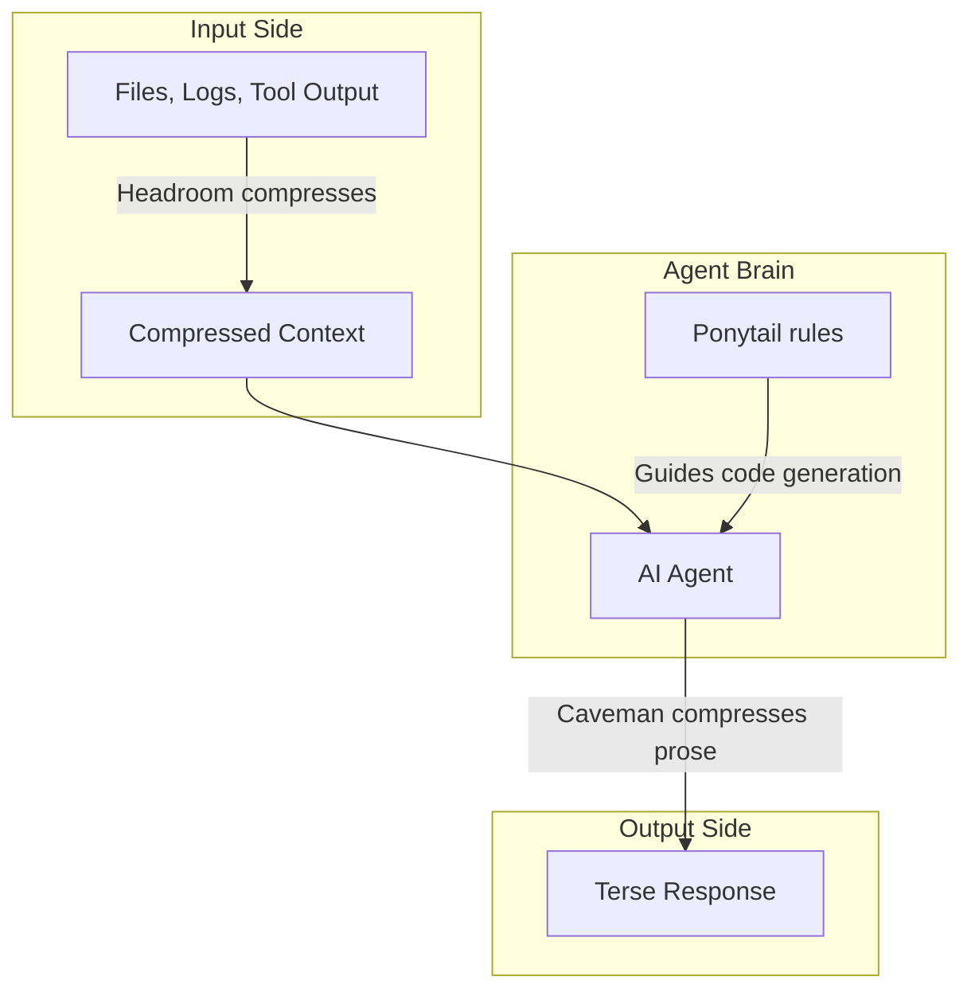
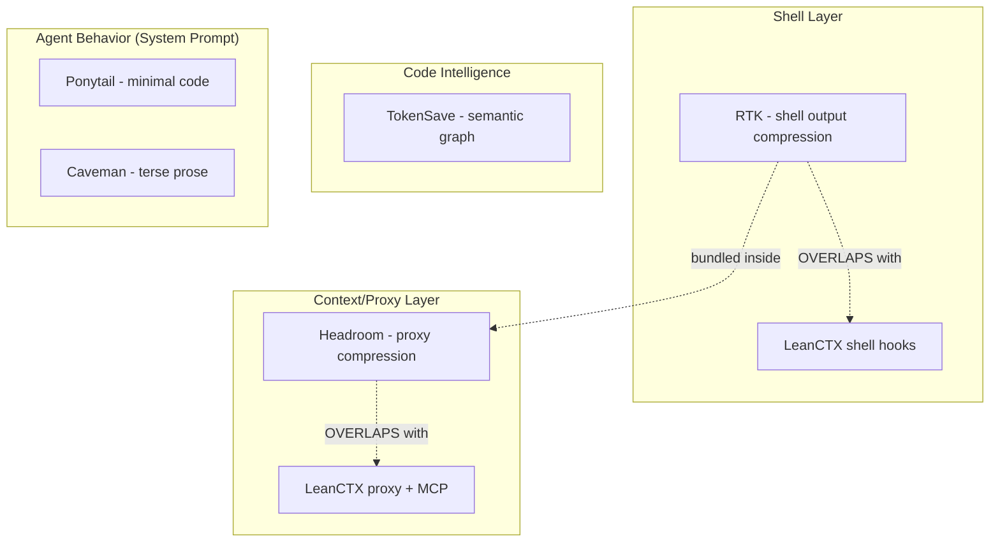

AI coding agents are powerful — but they burn through tokens fast. Every file read, every tool output, every verbose response eats into your context window and your wallet. The good news: a new wave of open-source tools can cut token usage by 50–95% without sacrificing accuracy.

This guide covers six complementary tools across the full token pipeline — what problem each solves, how to install them, how to integrate them with your AI agent, and which ones stack well together without conflicts.

---

## Table of Contents

- [The Token Problem](#the-token-problem)
- [Ponytail — Write Less Code](#ponytail--write-less-code)
  - [What It Does](#what-ponytail-does)
  - [The Ladder](#the-ladder)
  - [Install Ponytail](#install-ponytail)
  - [Usage & Commands](#ponytail-usage--commands)
  - [Benchmarks](#ponytail-benchmarks)
- [Caveman — Compress Agent Output](#caveman--compress-agent-output)
  - [What It Does](#what-caveman-does)
  - [Install Caveman](#install-caveman)
  - [Usage & Commands](#caveman-usage--commands)
  - [Intensity Levels](#caveman-intensity-levels)
- [Headroom — Compress Agent Input](#headroom--compress-agent-input)
  - [What It Does](#what-headroom-does)
  - [Install Headroom](#install-headroom)
  - [Usage Modes](#headroom-usage-modes)
  - [Agent Compatibility](#headroom-agent-compatibility)
- [How They Work Together](#how-they-work-together)
- [Complete Token Optimization Tool Ecosystem](#complete-token-optimization-tool-ecosystem)
  - [RTK — Rust Token Killer](#rtk--rust-token-killer)
  - [LeanCTX — Context Intelligence Layer](#leanctx--context-intelligence-layer)
  - [TokenSave — Semantic Code Intelligence](#tokensave--semantic-code-intelligence)
- [How They Relate (and Which Ones Conflict)](#how-they-relate-and-which-ones-conflict)
  - [Conflicts / Overlaps](#conflicts--overlaps)
- [Recommended Stacks (No Conflicts)](#recommended-stacks-no-conflicts)
- [Quick Install Cheat Sheet (macOS)](#quick-install-cheat-sheet-macos)
- [Comparison Table](#comparison-table)
- [Recommendations by Use Case](#recommendations-by-use-case)
- [Do These Tools Need to Be Running?](#do-these-tools-need-to-be-running)
- [Upgrade & Uninstall](#upgrade--uninstall)
- [TL;DR — The Non-Conflicting Stack](#tldr--the-non-conflicting-stack)
- [Conclusion](#conclusion)

---

## The Token Problem

Every interaction with an AI coding agent involves tokens — the unit of text the model processes. You pay for:

1. **Input tokens** — everything the agent reads (files, tool outputs, logs, conversation history)
2. **Output tokens** — everything the agent writes back (explanations, code, reasoning)

On Claude Opus, output tokens cost 5× input tokens. On GPT-4, it's 3×. A typical coding session can easily consume 100k–500k tokens. At scale, this adds up to real money.



The three tools in this guide attack different parts of this pipeline:

| Tool | Target | How It Saves |
| ------ | -------- | -------------- |
| **Ponytail** | Code generation | Agent writes less code (reuses stdlib, native features, existing code) |
| **Caveman** | Agent responses | Agent speaks in compressed fragments (~75% fewer output tokens) |
| **Headroom** | Agent input | Compresses files, tool outputs, and logs before they reach the model |

---

## Ponytail — Write Less Code

### What Ponytail Does

Ponytail makes your AI agent think like a lazy senior developer. "Lazy" meaning efficient — not careless. The premise: the best code is the code you never wrote.

Instead of generating a 50-line cache class, the agent reaches for `@lru_cache`. Instead of installing a date picker library, it uses `<input type="date">`. The code ends up small because it's necessary, not because it's golfed.

### The Ladder

Before writing any code, the agent stops at the first rung that holds:

```
1. Does this need to exist?   → YAGNI, skip it
2. Already in this codebase?  → reuse it
3. Stdlib does it?            → use it
4. Native platform feature?   → use it (<input type="date"> over flatpickr)
5. Installed dependency?      → use it, don't add a new one
6. Can it be one line?        → one line
7. Only then: minimum code that works
```

Safety is never simplified away — validation, error handling, security, and accessibility stay intact.

### Install Ponytail

#### Claude Code

```bash
/plugin marketplace add DietrichGebert/ponytail
/plugin install ponytail@ponytail
```

(Send these as two separate prompts.)

#### Gemini CLI

```bash
gemini extensions install https://github.com/DietrichGebert/ponytail
```

#### Kiro

[Kiro](https://kiro.dev/) (an AI-powered IDE by AWS) uses steering files for always-on rules:

```bash
# Global (all projects)
mkdir -p ~/.kiro/steering
curl -o ~/.kiro/steering/ponytail.md \
  https://raw.githubusercontent.com/DietrichGebert/ponytail/main/.kiro/steering/ponytail.md

# Or project-level
mkdir -p .kiro/steering
curl -o .kiro/steering/ponytail.md \
  https://raw.githubusercontent.com/DietrichGebert/ponytail/main/.kiro/steering/ponytail.md
```

#### Cursor / Windsurf / Cline

Copy the matching rules file from the [ponytail repo](https://github.com/DietrichGebert/ponytail):

- Cursor: `.cursor/rules/`
- Windsurf: `.windsurf/rules/`
- Cline: `.clinerules/`

#### Codex CLI

```bash
codex plugin marketplace add DietrichGebert/ponytail
```

### Ponytail Usage & Commands

| Command | Description |
| --------- | ------------- |
| `/ponytail lite` | Builds what you asked, names the lazier alternative in one line |
| `/ponytail full` | The ladder enforced. Stdlib and native first. Shortest diff. (Default) |
| `/ponytail ultra` | YAGNI extremist. Ships the one-liner and challenges the requirement |
| `/ponytail off` | Disable |
| `/ponytail-review` | Review current diff for over-engineering |
| `/ponytail-audit` | Scan whole repo for bloat |

> Commands require a skill-capable host (Claude Code, Codex, Gemini CLI). Rule-file installs (Cursor, Kiro, Windsurf) get the always-on behavior without slash commands.

### Ponytail Benchmarks

Measured on real Claude Code sessions editing a FastAPI + React repo (12 feature tasks, Haiku 4.5):

| Metric | Reduction |
| -------- | ----------- |
| Lines of code | -54% (up to 94%) |
| Tokens used | -22% |
| Cost | -20% |
| Time | -27% |
| Safety preserved | 100% |

---

## Caveman — Compress Agent Output

### What Caveman Does

Caveman makes your AI agent respond in ultra-compressed fragments. No articles, no pleasantries, no restating what you already know. Technical accuracy stays at 100% — it's the prose that gets crushed.

**Normal response:**
> "Great question! Let me help you with that. The issue you're experiencing is likely caused by a missing dependency in your package.json file. You'll need to install the axios library..."

**Caveman response:**
> "Missing dep. `npm i axios` fix it."

Same information. ~75% fewer tokens.

### Install Caveman

#### Universal installer (auto-detects all agents)

```bash
curl -fsSL https://raw.githubusercontent.com/JuliusBrussee/caveman/main/install.sh | bash
```

Preview first without installing:

```bash
curl -fsSL https://raw.githubusercontent.com/JuliusBrussee/caveman/main/install.sh | bash -s -- --dry-run
```

#### Claude Code only

```bash
claude plugin marketplace add JuliusBrussee/caveman
claude plugin install caveman@caveman
```

#### Gemini CLI only

```bash
gemini extensions install https://github.com/JuliusBrussee/caveman
```

#### Kiro

Caveman is available as a built-in skill in Kiro. Activate it by saying "caveman mode" or "use caveman" in chat.

#### Cursor / Windsurf / Cline (rule file)

```bash
# From the caveman repo clone
node bin/install.js --with-init --only cursor --only windsurf
```

Or manually copy the rule from `src/rules/caveman-activate.md` into your agent's rules directory.

### Caveman Usage & Commands

| Command | Description |
| --------- | ------------- |
| `/caveman` | Activate caveman mode (or say "caveman mode") |
| `/caveman lite` | Light compression — still readable prose |
| `/caveman full` | Default. Fragments, no articles |
| `/caveman ultra` | Maximum compression. Barely sentences. |
| `/caveman off` | Disable |
| `/caveman-review` | Code review in compressed format |
| `/caveman-commit` | Generate terse commit messages |
| `/caveman-stats` | Show token savings for current session |
| `/caveman-compress` | Compress a memory file (CLAUDE.md, etc.) |

### Caveman Intensity Levels

| Level | Style | Example |
| ------- | ------- | --------- |
| `lite` | Shorter prose, still grammatical | "The bug is in the auth middleware. Missing null check on line 42." |
| `full` | Fragments, no articles | "Bug in auth middleware. Missing null check line 42." |
| `ultra` | Telegram-style | "auth middleware L42. null check missing." |

Set default level with the `CAVEMAN_DEFAULT_MODE` env var (`lite`/`full`/`ultra`/`off`), or a `defaultMode` field in `~/.config/caveman/config.json`.

---

## Headroom — Compress Agent Input

### What Headroom Does

Headroom compresses everything your AI agent **reads** — tool outputs, log files, RAG chunks, code search results, conversation history — before it reaches the LLM. The model gets the same signal with a fraction of the tokens.

It achieves 60–95% compression depending on content type:

<div style="overflow-x: auto;" markdown="1">

| Content Type | Before | After | Savings |
| ------------- | -------- | ------- | --------- |
| Code search (100 results) | 17,765 tokens | 1,408 tokens | 92% |
| SRE incident debugging | 65,694 tokens | 5,118 tokens | 92% |
| GitHub issue triage | 54,174 tokens | 14,761 tokens | 73% |
| Codebase exploration | 78,502 tokens | 41,254 tokens | 47% |

</div>

The compression is **reversible** — originals are cached locally and retrievable on demand.

### Install Headroom

Headroom requires Python 3.10+. Since macOS system Python is externally managed, use `pipx`:

```bash
# Install pipx if you don't have it
brew install pipx

# Install headroom (use python3.13 for full dollar-savings tracking)
pipx install --python python3.13 "headroom-ai[all]"

# Verify
headroom --version
headroom doctor
```

Alternative with a virtual environment:

```bash
python3 -m venv ~/headroom-venv
source ~/headroom-venv/bin/activate
pip install "headroom-ai[all]"
```

Or Docker:

```bash
docker pull ghcr.io/chopratejas/headroom:latest
```

### Headroom Usage Modes

#### 1. Wrap an existing agent (easiest)

```bash
headroom wrap claude    # wraps Claude Code
headroom wrap codex     # wraps Codex
headroom wrap copilot   # wraps GitHub Copilot CLI
headroom wrap aider     # wraps Aider
headroom wrap opencode  # wraps OpenCode
```

Undo with:

```bash
headroom unwrap claude
```

#### 2. Proxy mode (works with any agent)

```bash
headroom proxy --port 8787
```

Then point your agent's API base URL to `http://localhost:8787`. Zero code changes.

#### 3. MCP server (for MCP-capable agents)

```bash
headroom mcp install
```

Exposes `headroom_compress`, `headroom_retrieve`, and `headroom_stats` tools.

#### 4. Library (for custom apps)

```python
from headroom import compress

compressed = compress(messages)
```

#### Useful commands

```bash
headroom doctor        # health check
headroom perf          # show compression stats
headroom dashboard     # live savings dashboard (proxy must be running)
headroom learn         # mine failed sessions, write corrections
headroom output-savings  # show output token reduction estimate
```

### Headroom Agent Compatibility

| Agent | Support | Notes |
| ------- | --------- | ------- |
| Claude Code | ✅ Full | `headroom wrap claude` |
| Codex | ✅ Full | Shares memory with Claude |
| Copilot CLI | ✅ Full | `headroom wrap copilot` |
| Aider | ✅ Full | `headroom wrap aider` |
| OpenCode | ✅ Full | `headroom wrap opencode` |
| Cline | ✅ Full | `headroom wrap cline` |
| Cursor | Manual | Starts proxy, configure base URL in settings |
| Gemini CLI | Proxy only | Use `headroom proxy --port 8787` |
| Kiro | Proxy/MCP | Use proxy mode or MCP server |

---

## How They Work Together

These tools aren't mutually exclusive — they attack different parts of the token pipeline:



| Stack | What You Get |
| ------- | ------------- |
| Ponytail only | Agent writes minimal code. Good default for any project. |
| Caveman only | Agent speaks in fragments. Saves output tokens. |
| Headroom only | Input compressed. Best for large codebases with lots of file reads. |
| Ponytail + Caveman | Less code + terse explanations. Maximum token efficiency. |
| All three | Full pipeline compression. Best cost savings for heavy agent usage. |

> **Note:** Ponytail and Caveman can sometimes give conflicting signals (ponytail wants concise code, caveman wants concise prose — both active can confuse the agent about *what* to be concise about). In practice, they complement each other well: ponytail governs code decisions, caveman governs communication style.

---

## Complete Token Optimization Tool Ecosystem

Beyond the three tools covered in depth above, the broader ecosystem includes **6 major tools** that operate at different layers. Understanding the full landscape helps you pick the right combination.

<div style="overflow-x: auto;" markdown="1">

| Tool | Layer | What It Compresses | Install | Stars |
| ------ | ------- | ------------------- | --------- | ------- |
| **[RTK](https://github.com/rtk-ai/rtk)** | Shell output | CLI command output (git, tests, builds, docker, kubectl) | `brew install rtk` | 68k |
| **[Headroom](https://github.com/headroomlabs-ai/headroom)** | All input context | Files, tool outputs, logs, RAG, conversation history | `pipx install "headroom-ai[all]"` | 56k |
| **[LeanCTX](https://github.com/yvgude/lean-ctx)** | All context + memory | File reads, shell, session memory, code graph (MCP server) | `brew tap yvgude/lean-ctx && brew install lean-ctx` | 3.1k |
| **[Ponytail](https://github.com/DietrichGebert/ponytail)** | Code generation | Makes agent write less code (system prompt rules) | Rule file or plugin | 72k |
| **[Caveman](https://github.com/JuliusBrussee/caveman)** | Agent prose output | Compresses how the agent communicates back to you | `curl \| bash` one-liner | — |
| **[TokenSave](https://tokensave.dev/)** | Code intelligence | Pre-indexed semantic graph so agent queries instead of scanning | `cargo install tokensave` | — |

</div>

### RTK — Rust Token Killer

RTK sits between your AI agent and the shell. When the agent runs `git status`, `cargo test`, or `docker ps`, RTK intercepts the output and returns a compact, LLM-friendly summary — before those tokens ever hit the context window.

- Single 4 MB Rust binary, <10ms overhead
- 100+ supported commands (git, npm, cargo, pytest, docker, kubectl, AWS CLI, etc.)
- Auto-rewrite hook: `git status` transparently becomes `rtk git status`

**Example savings:**

<div style="overflow-x: auto;" markdown="1">

| Command | Without RTK | With RTK | Savings |
| ----------------------------------- | ---------------------------------- | ------------------------- | ------- |
| `git push` | ~200 tokens (15 lines of progress) | ~10 tokens ("ok main") | 95% |
| `cargo test` (15 tests, 2 failures) | ~200+ lines | ~20 lines (failures only) | 90% |
| 30-min session total | ~118k tokens | ~24k tokens | 80% |

</div>

#### Install RTK

```bash
brew install rtk
```

Or via curl:

```bash
curl -fsSL https://raw.githubusercontent.com/rtk-ai/rtk/refs/heads/master/install.sh | sh
```

#### Integrate RTK with Your AI Agent

```bash
# Claude Code (PreToolUse hook — transparent rewrite)
rtk init -g

# Gemini CLI (BeforeTool hook)
rtk init -g --gemini

# Codex (AGENTS.md + RTK.md instructions)
rtk init -g --codex

# Cursor (hooks.json)
rtk init -g --agent cursor

# Windsurf (.windsurfrules)
rtk init -g --agent windsurf

# Cline / Roo Code (.clinerules)
rtk init --agent cline

# GitHub Copilot (PreToolUse hook)
rtk init -g --copilot

# OpenCode (plugin)
rtk init -g --opencode

# Google Antigravity
rtk init --agent antigravity
```

After running `rtk init`, **restart your AI tool**. The hook rewrites Bash commands automatically — `git status` becomes `rtk git status` transparently.

#### Using RTK

Once hooked, it's invisible — your agent gets compressed output automatically. You can also use it manually:

```bash
rtk git status          # compact status
rtk git diff            # condensed diff
rtk cargo test          # failures only, -90% tokens
rtk docker ps           # compact container list
rtk ls .                # token-optimized directory tree
rtk read src/main.rs    # smart file reading

# See your savings
rtk gain                # summary stats
rtk gain --graph        # ASCII graph (last 30 days)
rtk discover            # find missed savings opportunities
```

### LeanCTX — Context Intelligence Layer

LeanCTX is the most ambitious tool in this space. It's a full context engineering layer — not just compression, but also caching, memory persistence, code graph, and multi-agent coordination.

Key features beyond basic compression:

- **Cached re-reads**: first read costs normal tokens, re-reads cost ~13 tokens
- **Session memory**: context persists across chats (no more "I already told you this")
- **10 read modes**: `full`, `map`, `signatures`, `diff`, `lines:N-M`, `density:X`, etc.
- **76+ MCP tools**: from file reads to multi-agent orchestration
- **Shell compression**: 95+ patterns (similar to RTK)
- **Request proxy**: compresses the full request to the model (system prompt + history), prompt-cache-safe

#### Install LeanCTX

```bash
# Homebrew (macOS / Linux)
brew tap yvgude/lean-ctx && brew install lean-ctx

# Or universal installer (no Rust needed)
curl -fsSL https://leanctx.com/install.sh | sh

# Or via npm
npm install -g lean-ctx-bin

# Or via cargo
cargo install lean-ctx
```

#### Integrate LeanCTX with Your AI Agent

The easiest way — auto-detects all installed agents:

```bash
lean-ctx onboard
```

Or target a specific agent:

```bash
# Cursor
lean-ctx init --agent cursor

# Claude Code
lean-ctx init --agent claude

# Codex CLI
lean-ctx init --agent codex

# Gemini CLI
lean-ctx init --agent gemini

# Windsurf
lean-ctx init --agent windsurf

# GitHub Copilot
lean-ctx init --agent copilot

# Cline / Roo Code
lean-ctx init --agent cline

# Kiro
lean-ctx init --agent kiro

# OpenCode
lean-ctx init --agent opencode

# Aider
lean-ctx init --agent aider
```

After setup, **restart your shell and AI tool** so the MCP + hooks are active.

#### Using LeanCTX

```bash
# Verify setup
lean-ctx doctor

# Compressed file reading (agent calls these automatically via MCP)
lean-ctx read src/server.rs -m map        # API surface overview, ~13 tok on re-read
lean-ctx read src/server.rs -m signatures # function signatures only

# Compressed shell output
lean-ctx -c "git status"
lean-ctx -c "npm test"

# Session memory — persists across chats
lean-ctx overview                          # task-aware project recap
lean-ctx knowledge recall "auth"           # recall facts from past sessions

# Code intelligence
lean-ctx graph impact src/auth.rs          # blast radius analysis

# See savings
lean-ctx gain                              # token savings summary
lean-ctx gain --live                       # real-time dashboard
lean-ctx dashboard                         # browser-based Context Manager

# Enable the request proxy (compresses full requests to model)
lean-ctx proxy enable
```

### TokenSave — Semantic Code Intelligence

TokenSave takes a different approach: instead of compressing what the agent reads, it pre-indexes your codebase into a semantic knowledge graph. The agent queries the graph and gets instant, structured answers — the right symbols, relationships, and source code — in one MCP call instead of many grep/read calls.

#### Install TokenSave

```bash
# Via cargo
cargo install tokensave

# Or via Homebrew (check tokensave.dev for latest tap name)
brew install aovestdipaperino/tap/tokensave
```

#### Integrate TokenSave with Your AI Agent

TokenSave runs as an MCP server. Add it to your agent's MCP config:

```json
{
  "mcpServers": {
    "tokensave": {
      "command": "tokensave",
      "args": ["serve"],
      "env": {}
    }
  }
}
```

For Claude Code, add to `~/.claude.json`. For Kiro, add to `.kiro/settings/mcp.json`. For Cursor, add to `.cursor/mcp.json`.

#### Using TokenSave

Once the MCP server is running, the agent automatically uses it for code lookups:

```bash
# Index your project first
tokensave index .

# The MCP server exposes tools like:
# - search: find symbols by name or description
# - callers: who calls this function?
# - context: get related code for a symbol
```

The agent calls these tools instead of running multiple `grep` and `read` operations, getting precise answers in a single round-trip.

---

## How They Relate (and Which Ones Conflict)



### Conflicts / Overlaps

<div style="overflow-x: auto;" markdown="1">

| Pair | Verdict | Explanation |
| ------ | --------- | ------------- |
| **RTK + Headroom** | ✅ Safe | Headroom bundles RTK internally for shell rewriting. They're designed together. |
| **RTK + LeanCTX** | ⚠️ Pick one | Both compress shell output with similar patterns. Running both creates double-rewriting. |
| **Headroom + LeanCTX** | ⚠️ Pick one | Both run as proxies that compress requests. LeanCTX can install Headroom as an addon (`lean-ctx addon add headroom`) but running both standalone duplicates work. |
| **Ponytail + Caveman** | ✅ Safe | Different domains — Ponytail governs code decisions, Caveman governs communication style. |
| **Ponytail + any input tool** | ✅ Safe | Ponytail is just system prompt rules; it never touches the data pipeline. |
| **Caveman + any input tool** | ✅ Safe | Same — system prompt rules only. |
| **TokenSave + LeanCTX** | ✅ Safe | Different data sources — TokenSave provides code graph (MCP), LeanCTX provides read compression + memory. |
| **TokenSave + RTK** | ✅ Safe | TokenSave handles code lookups, RTK handles CLI output. |
| **TokenSave + Headroom** | ✅ Safe | Non-overlapping — one indexes code, the other compresses context. |

</div>

> **Rule of thumb:** You can safely run ALL the system-prompt tools (Ponytail, Caveman) with ANY input-side tool. The conflicts only exist *within* the input-side tools — specifically between RTK/Headroom and LeanCTX, because they do the same job (shell + proxy compression).

---

## Recommended Stacks (No Conflicts)

### Stack 1: Zero Runtime (just rule files)

```
Ponytail + Caveman
```

- No processes, no binaries, just injected rules
- Ponytail reduces code generated, Caveman reduces prose output
- **Best for:** free-tier users, light usage, quick setup

### Stack 2: Shell-Focused (one binary)

```
RTK + Ponytail + Caveman
```

- RTK compresses shell output (single Rust binary, <10ms overhead)
- Ponytail + Caveman shape agent behavior
- **Install:** `brew install rtk && rtk init -g`
- **Best for:** developers who run lots of git/test/build commands via the agent

### Stack 3: Full Proxy Compression

```
Headroom (bundles RTK) + Ponytail + Caveman
```

- Headroom as the input proxy — compresses everything including tool outputs
- RTK is bundled inside Headroom for shell rewriting
- Ponytail for code decisions, Caveman for terse responses
- **Install:** `pipx install "headroom-ai[all]" && headroom wrap claude`
- **Best for:** heavy agent users wanting maximum savings with one unified tool

### Stack 4: Context Engineering (large codebases)

```
LeanCTX + TokenSave + Ponytail + Caveman
```

- LeanCTX as the primary context layer (replaces both RTK and Headroom)
- TokenSave for pre-indexed code intelligence queries
- Ponytail + Caveman for agent behavior
- **Install:** `brew tap yvgude/lean-ctx && brew install lean-ctx && lean-ctx onboard`
- **Best for:** large codebases, long sessions, teams needing memory persistence and code graph

---

## Quick Install Cheat Sheet (macOS)

| Tool | Install | Then Run |
| ------ | --------- | ---------- |
| **RTK** | `brew install rtk` | `rtk init -g` (Claude Code) / `rtk init -g --gemini` |
| **Headroom** | `pipx install --python python3.13 "headroom-ai[all]"` | `headroom wrap claude` or `headroom proxy --port 8787` |
| **LeanCTX** | `brew tap yvgude/lean-ctx && brew install lean-ctx` | `lean-ctx onboard` |
| **TokenSave** | `cargo install tokensave` or `brew install aovestdipaperino/tap/tokensave` | Runs as MCP server |
| **Ponytail** | Depends on agent — see [Install Ponytail](#install-ponytail) section | Always-on after install |
| **Caveman** | `curl -fsSL https://raw.githubusercontent.com/JuliusBrussee/caveman/main/install.sh \| bash` | Say `/caveman` in chat |

> **Note:** For Kiro specifically — Ponytail goes in `~/.kiro/steering/ponytail.md`, Caveman is a built-in skill (say "caveman mode"), and LeanCTX supports Kiro via `lean-ctx init --agent kiro`.

---

## Comparison Table

<div style="overflow-x: auto;" markdown="1">

| Feature | RTK | Headroom | LeanCTX | Ponytail | Caveman | TokenSave |
| --------- | ----- | ---------- | --------- | ---------- | --------- | ----------- |
| **Target** | Shell output | All input context | All context + memory | Code generation | Agent responses | Code lookups |
| **Token savings** | 60–90% (shell) | 60–95% (all input) | 60–90% + caching | ~22% (less code) | ~75% (output) | Varies (fewer reads) |
| **Runtime** | Rust binary | Python process | Rust binary | None (rules) | None (rules) | Rust binary (MCP) |
| **Memory/caching** | No | Cross-agent memory | Session + knowledge graph | No | No | Indexed graph |
| **Reversible** | Tee (failures) | Yes (CCR) | Yes (content-addressed) | N/A | N/A | N/A |
| **Agents supported** | 14+ | 13+ | 30+ | 16+ | 30+ | MCP-capable |
| **License** | Apache 2.0 | Apache 2.0 | Apache 2.0 | MIT | MIT | — |
| **Install effort** | `brew install` | `pipx install` | `brew install` | Copy a file | One-liner | `cargo install` |

</div>

---

## Recommendations by Use Case

**"I just want lower bills"**
→ Start with **Headroom**. It gives the largest absolute savings (60–95% on input) with zero behavior change.

**"My agent over-engineers everything"**
→ **Ponytail**. It stops the agent from writing 50-line abstractions when stdlib has a one-liner.

**"Responses are too verbose, I lose context"**
→ **Caveman**. The agent still gives you the same information, just in fewer tokens.

**"I'm on a free tier with limited tokens"**
→ **Ponytail + Caveman** (no runtime needed, just rule files). Add RTK if you can install a binary.

**"I run lots of shell commands (git, tests, builds)"**
→ **RTK** — single binary, instant savings on every CLI command the agent runs.

**"I work on a large codebase with many files"**
→ **LeanCTX + TokenSave** — cached reads, code graph, session memory so the agent doesn't re-scan.

**"I manage a team spending $10k+/month on AI"**
→ **Headroom (team plan)** or **LeanCTX (cloud)** + Ponytail + Caveman for full pipeline coverage.

---

## Do These Tools Need to Be Running?

A common question: "Do I need to start these tools every time I reboot my machine?"

<div style="overflow-x: auto;" markdown="1">

| Tool | Runs as... | Start on boot? | Start/Stop |
| ------ | ----------- | ---------------- | ------------ |
| **Ponytail** | Static file (rules injected into agent prompt) | No — always loaded automatically | Nothing to manage |
| **Caveman** | Static file / plugin hooks | No — loaded when agent starts | Nothing to manage |
| **RTK** | On-demand binary (called per command, exits immediately) | No — invoked per-command by the hook | Nothing to manage |
| **Headroom (wrap)** | Background proxy process | **Yes — needs to be running** | See below |
| **Headroom (MCP)** | MCP server | Auto-started by agent on connect | Nothing to manage |
| **LeanCTX (MCP)** | MCP server | Auto-started by agent on connect | Nothing to manage |
| **LeanCTX (proxy)** | Background proxy process | **Yes — needs to be running** | See below |
| **TokenSave** | MCP server | Auto-started by agent on connect | Nothing to manage |

</div>

### Tools that need no lifecycle management

**Ponytail, Caveman, RTK, TokenSave, LeanCTX (MCP mode)** — these either live as static config files or are started automatically by the AI agent when it connects. After initial setup, they just work. Reboot your machine, open your agent, they're active.

### Tools that need a running process

**Headroom** (when using `wrap` or `proxy` mode) and **LeanCTX** (when using `proxy enable`) run a local HTTP proxy that intercepts traffic between your agent and the LLM provider. This proxy must be running for compression to work.

#### Headroom — start/stop

```bash
# Start (wraps your agent — proxy starts automatically)
headroom wrap claude

# The proxy stays running in the background while your agent is active.
# When you close the agent, the proxy stops.

# Or run proxy standalone (stays running until you kill it):
headroom proxy --port 8787

# Stop standalone proxy:
# Ctrl+C in the terminal, or:
kill $(lsof -ti:8787)
```

> With `headroom wrap`, the proxy lifecycle is tied to your agent session — it starts when you launch the wrapped agent and stops when you exit. No manual management needed in normal use.

#### Headroom — auto-start on boot (run without worry)

If you set `ANTHROPIC_BASE_URL=http://127.0.0.1:8787` in your shell config so all agent traffic routes through Headroom, you need the proxy running *before* any agent starts. The cleanest solution is a macOS LaunchAgent — it starts the proxy at login and restarts it if it crashes. Set it once, never think about it again.

**Step 1: Create the LaunchAgent plist**

```bash
mkdir -p ~/Library/LaunchAgents

cat > ~/Library/LaunchAgents/com.headroom.proxy.plist << 'EOF'
<?xml version="1.0" encoding="UTF-8"?>
<!DOCTYPE plist PUBLIC "-//Apple//DTD PLIST 1.0//EN" "http://www.apple.com/DTDs/PropertyList-1.0.dtd">
<plist version="1.0">
<dict>
    <key>Label</key>
    <string>com.headroom.proxy</string>
    <key>ProgramArguments</key>
    <array>
        <string>/Users/YOUR_USERNAME/.local/bin/headroom</string>
        <string>proxy</string>
        <string>--port</string>
        <string>8787</string>
    </array>
    <key>RunAtLoad</key>
    <true/>
    <key>KeepAlive</key>
    <true/>
    <key>StandardOutPath</key>
    <string>/tmp/headroom-proxy.log</string>
    <key>StandardErrorPath</key>
    <string>/tmp/headroom-proxy.err</string>
</dict>
</plist>
EOF
```

Replace `YOUR_USERNAME` with your macOS username (or use `$HOME/.local/bin/headroom`).

**Step 2: Load it (starts immediately + on every future login)**

```bash
launchctl load ~/Library/LaunchAgents/com.headroom.proxy.plist
```

**Step 3: Verify**

```bash
launchctl list | grep headroom    # should show PID and exit status 0
curl -s http://127.0.0.1:8787/health   # should respond
headroom doctor                   # all checks should pass
```

**Step 4: Add the env var to your shell** (if not already)

```bash
# Add to ~/.zshrc
export ANTHROPIC_BASE_URL=http://127.0.0.1:8787
```

Now every Anthropic-backed agent (Claude Code, Kiro, Cursor, etc.) in any terminal automatically routes through Headroom. The proxy is always on, always compressing, and restarts on crash.

**To stop/unload:**

```bash
# Stop and prevent auto-start
launchctl unload ~/Library/LaunchAgents/com.headroom.proxy.plist

# Or just stop temporarily (restarts on next login)
launchctl stop com.headroom.proxy
```

**Linux equivalent** (systemd):

```bash
# Create a user service
mkdir -p ~/.config/systemd/user

cat > ~/.config/systemd/user/headroom-proxy.service << 'EOF'
[Unit]
Description=Headroom AI token compression proxy
After=network.target

[Service]
ExecStart=%h/.local/bin/headroom proxy --port 8787
Restart=always
RestartSec=3

[Install]
WantedBy=default.target
EOF

systemctl --user daemon-reload
systemctl --user enable --now headroom-proxy
```

#### LeanCTX — start/stop

```bash
# MCP mode (default) — auto-started by agent, no management needed
lean-ctx doctor   # verify it's connected

# Proxy mode — if you enabled it:
lean-ctx proxy enable    # enables proxy (starts on next agent session)
lean-ctx proxy disable   # disables proxy

# LeanCTX can also run as a persistent service:
lean-ctx serve           # starts the server (foreground)

# Or install as a system service (auto-start on boot):
lean-ctx init --autostart   # creates LaunchAgent (macOS) or systemd unit (Linux)

# Stop/remove autostart:
lean-ctx uninstall --keep-config
```

### Summary

For most users: **install once, forget forever**. The only scenario requiring active process management is Headroom's proxy mode — and even that auto-starts when you use `headroom wrap`. If your agent works after a reboot without you doing anything extra, you're set.

---

## TL;DR — The Non-Conflicting Stack

If you want maximum savings without conflicts, install this:

```bash
# 1. Input compression (pick ONE — Headroom or LeanCTX)
pipx install --python python3.13 "headroom-ai[all]"
headroom wrap claude

# 2. Agent writes less code (always safe to add)
mkdir -p ~/.kiro/steering
curl -o ~/.kiro/steering/ponytail.md \
  https://raw.githubusercontent.com/DietrichGebert/ponytail/main/.kiro/steering/ponytail.md

# 3. Agent talks less (always safe to add)
curl -fsSL https://raw.githubusercontent.com/JuliusBrussee/caveman/main/install.sh | bash
```

**Result:** Input compressed 60–95% (Headroom + bundled RTK), code generation minimized (Ponytail), prose output cut ~75% (Caveman). No overlaps, no double-processing.

---

## Upgrade & Uninstall

All these tools are actively maintained. Here's how to keep them current or remove them cleanly:

| Tool | Upgrade | Uninstall |
| ------ | --------- | ----------- |
| **RTK** | `brew upgrade rtk` | `rtk init -g --uninstall && brew uninstall rtk` |
| **Headroom** | `headroom update` | `pipx uninstall headroom-ai` + remove LaunchAgent |
| **LeanCTX** | `lean-ctx update` | `lean-ctx uninstall` (removes hooks, configs, binary) |
| **TokenSave** | `cargo install tokensave` (overwrites) | `cargo uninstall tokensave` |
| **Ponytail (Claude Code)** | `/plugin remove ponytail` then reinstall | `/plugin remove ponytail` |
| **Ponytail (Gemini)** | `gemini extensions update caveman` | `gemini extensions uninstall ponytail` |
| **Ponytail (Kiro/Cursor)** | Re-download the rule file | Delete the rule file (e.g. `~/.kiro/steering/ponytail.md`) |
| **Caveman (Claude Code)** | `claude plugin remove caveman` then reinstall | `claude plugin remove caveman` |
| **Caveman (Gemini)** | `gemini extensions update caveman` | `gemini extensions uninstall caveman` |
| **Caveman (universal)** | Re-run the install script | `npx -y github:JuliusBrussee/caveman -- --uninstall` |

**Headroom full cleanup** (if you used proxy mode with LaunchAgent):

```bash
# Stop and remove auto-start
launchctl unload ~/Library/LaunchAgents/com.headroom.proxy.plist
rm ~/Library/LaunchAgents/com.headroom.proxy.plist

# Remove env var from ~/.zshrc
# Delete the line: export ANTHROPIC_BASE_URL=http://127.0.0.1:8787

# Uninstall the package
pipx uninstall headroom-ai
```

**RTK full cleanup:**

```bash
rtk init -g --uninstall   # removes hooks, RTK.md, settings.json entry
brew uninstall rtk        # or: cargo uninstall rtk
```

**LeanCTX full cleanup:**

```bash
lean-ctx uninstall              # removes hooks, configs, autostart, data dir, binary
# If installed via package manager:
brew uninstall lean-ctx         # or: cargo uninstall lean-ctx / npm uninstall -g lean-ctx-bin
```

> **Tip:** Ponytail and Caveman are just rule files / plugins — removing them leaves zero residual state. RTK, Headroom, and LeanCTX write hooks and config entries that their uninstall commands clean up.

---

## Conclusion

Token optimization isn't about getting worse answers — it's about getting the same quality with less waste. The ecosystem now has mature tools for every layer:

- **Ponytail** makes the agent think before it writes (less unnecessary code)
- **Caveman** makes the agent communicate efficiently (less prose)
- **RTK** compresses shell command output (git, tests, builds)
- **Headroom** compresses everything the agent reads (proxy layer, bundles RTK)
- **LeanCTX** goes further with caching, memory, and code graph intelligence
- **TokenSave** pre-indexes your code so the agent queries instead of scanning

Pick a stack that matches your needs. Start with Ponytail + Caveman (zero effort), add RTK or Headroom for input savings, and graduate to LeanCTX if you need session memory and code intelligence. They all respect the same principle: same answers, fewer tokens.

---

**Resources:**

- [RTK GitHub](https://github.com/rtk-ai/rtk) — 68k stars, Apache 2.0
- [Headroom GitHub](https://github.com/headroomlabs-ai/headroom) — 55.9k stars, Apache 2.0
- [LeanCTX GitHub](https://github.com/yvgude/lean-ctx) — 3.1k stars, Apache 2.0
- [TokenSave](https://tokensave.dev/) — Rust, semantic code graph
- [Ponytail GitHub](https://github.com/DietrichGebert/ponytail) — 72k stars, MIT
- [Caveman GitHub](https://github.com/JuliusBrussee/caveman) — getcaveman.dev, MIT
- [Ponytail Benchmarks](https://github.com/DietrichGebert/ponytail/blob/main/benchmarks/results/2026-06-18-agentic.md)
- [Headroom Docs](https://headroom-docs.vercel.app/docs)
- [LeanCTX Docs](https://leanctx.com/docs/getting-started)
- [RTK Website](https://www.rtk-ai.app/)
