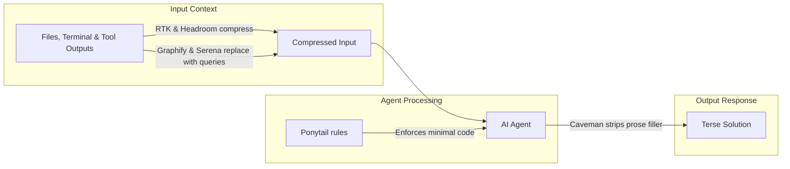
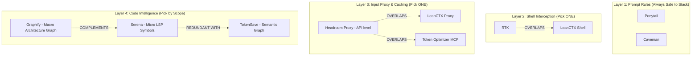

AI coding agents burn through tokens fast. Every file read, tool output, and verbose explanation eats into your context window and budget. 

This guide provides a direct, practical reference for **10 token optimization tools** across every layer of the agent pipeline — when to use them, quick setup and removal commands, and how to combine them without conflicts.

---

## Table of Contents

- [The Token Problem & Pipeline](#the-token-problem--pipeline)
- [Tool Comparison Matrix](#tool-comparison-matrix)
- [1. Ponytail — Minimal Code Generation](#1-ponytail--minimal-code-generation)
- [2. Caveman — Terse Agent Responses](#2-caveman--terse-agent-responses)
- [3. RTK — Shell Output Interception](#3-rtk--shell-output-interception)
- [4. Headroom — Full Input Proxy Compression](#4-headroom--full-input-proxy-compression)
- [5. LeanCTX — Context Engineering & Memory](#5-leanctx--context-engineering--memory)
- [6. Graphify — Codebase Knowledge Graph](#6-graphify--codebase-knowledge-graph)
- [7. Serena — Semantic Code Retrieval via LSP](#7-serena--semantic-code-retrieval-via-lsp)
- [8. Token Optimizer MCP — Smart Reads with Caching](#8-token-optimizer-mcp--smart-reads-with-caching)
- [9. TokenSave — Semantic Code Graph](#9-tokensave--semantic-code-graph)
- [10. Repomix — Context Packing for LLMs](#10-repomix--context-packing-for-llms)
- [Conflicts & Overlaps (What Stacks Safely)](#conflicts--overlaps-what-stacks-safely)
- [Recommended Stacks](#recommended-stacks)
- [Do These Tools Need to Be Running?](#do-these-tools-need-to-be-running)
- [What to Commit vs Gitignore](#what-to-commit-vs-gitignore)
- [Resources & Documentation](#resources--documentation)

---

## The Token Problem & Pipeline

Every agent interaction consumes both **input tokens** (files, logs, tool outputs, conversation history) and **output tokens** (generated code, explanations). Different tools optimize different stages:


```mermaid
graph LR
    subgraph "Input Context"
        A[Files, Terminal & Tool Outputs] -->|RTK & Headroom compress| B[Compressed Input]
        A -->|Graphify & Serena replace with queries| B
    end
    
    subgraph "Agent Processing"
        B --> C[AI Agent]
        D[Ponytail rules] -->|Enforces minimal code| C
    end
    
    subgraph "Output Response"
        C -->|Caveman strips prose filler| E[Terse Solution]
    end
```

---

## Tool Comparison Matrix

<div style="overflow-x: auto;" markdown="1">

| Tool | Layer | How It Saves | Token Savings | Runtime | Install | License | GitHub Stars |
| :--- | :--- | :--- | :--- | :--- | :--- | :--- | :--- |
| **[Ponytail](https://github.com/DietrichGebert/ponytail)** | Code generation (Rules) | Agent writes minimal code (stdlib & native first) | ~22% (less code) | None (rules) | Copy rule / plugin | MIT | 106k |
| **[Caveman](https://github.com/JuliusBrussee/caveman)** | Agent prose (Rules) | Strips conversational filler and prose | ~75% (output) | None (rules) | `curl \| bash` | MIT | 99k |
| **[RTK](https://github.com/rtk-ai/rtk)** | Shell output interception | Intercepts CLI output (git, tests, builds, docker) | 60–90% (shell) | Rust binary | `brew install rtk` | Apache 2.0 | 76.6k |
| **[Headroom](https://github.com/headroomlabs-ai/headroom)** | Input proxy compression | Compresses file reads, tool outputs, and history | 60–95% (input) | Python proxy process | `pipx install "headroom-ai[all]"` | Apache 2.0 | 66.8k |
| **[LeanCTX](https://github.com/yvgude/lean-ctx)** | Context + memory (MCP/Proxy) | Cached reads, shell compression, session memory | 60–90% + caching | Rust binary (MCP) | `brew install lean-ctx` | Apache 2.0 | 3.6k |
| **[Graphify](https://github.com/Graphify-Labs/graphify)** | Knowledge graph (AST) | Queries graph instead of reading multiple raw files | 5–70× (replaces reads) | Python CLI + AST | `uv tool install graphifyy` | MIT | 108k |
| **[Serena](https://github.com/oraios/serena)** | Code retrieval (LSP) | Symbol-level access via LSP — fetches exact code directly | Eliminates raw reads | Python (MCP) | `uv tool install serena-agent` | Apache 2.0 | 28.2k |
| **[Token Optimizer MCP](https://github.com/ooples/token-optimizer-mcp)** | Smart reads & tools (MCP) | Smart reads/grep/diffs with hash caching | 95%+ (with cache) | Node.js (MCP) | `npx -y @ooples/token-optimizer-mcp@latest` | MIT | 487 |
| **[TokenSave](https://github.com/aovestdipaperino/tokensave)** | Code intelligence (MCP) | Pre-indexed semantic graph for code queries | Varies (fewer reads) | Rust binary (MCP) | `cargo install tokensave` | Native MCP | 579 |
| **[Repomix](https://github.com/yamadashy/repomix)** | Context packing (CLI) | Packs repo into one AI-friendly file for one-shot tasks | N/A (offline tool) | Node.js CLI | `npm install -g repomix` | MIT | 27.9k |

</div>

### Config Scope at a Glance

| Tool | Scope | What "Global" does | What "Per-project" does |
| :--- | :--- | :--- | :--- |
| **Ponytail** | 🌐 Global | Rule file in `~/.kiro/steering/` or plugin — active for all projects | — |
| **Caveman** | 🌐 Global | Universal installer registers for all agents — active everywhere | — |
| **RTK** | 🌐 Global | `rtk init -g` installs hooks in user-level agent config | — |
| **Headroom** | 🌐 Global | Proxy + env var routes all Anthropic agent traffic through compression | — |
| **LeanCTX** | 🌐 Global | `lean-ctx onboard` registers MCP for all projects | — |
| **Token Optimizer MCP** | 🌐 Global | Add MCP entry to user-level config — works for all projects | — |
| **Repomix** | 🌐 Global | `npm install -g` — run in any project on demand | — |
| **Graphify** | 🌐 + 📁 Both | `graphify install` registers `/graphify` skill globally | `graphify extract .` builds graph per repo; MCP config points at this project's `graph.json` |
| **TokenSave** | 🌐 + 📁 Both | MCP config registered globally (one-time) | `tokensave index .` required in each repo to build the index |
| **Serena** | 📁 Per-project | — | MCP config in project's `.kiro/settings/mcp.json` pointing at workspace root |

> **Legend:** 🌐 Global = configure once, applies to all projects. 📁 Per-project = requires setup in each repository (graph build, index, or workspace-specific MCP config).

---

## 1. Ponytail — Minimal Code Generation

* **Repository:** [github.com/DietrichGebert/ponytail](https://github.com/DietrichGebert/ponytail)
* **Config scope:** 🌐 Global — configure once, works in all projects
* **When to Use:** When your agent tends to over-engineer, generating 50-line custom classes when a standard library feature or 1-liner already exists.
* **How It Works:** Injects system prompt rules forcing the agent down a decision ladder: YAGNI → reuse existing code → stdlib → native platform feature → installed dependency → 1-liner.

### Install & Setup
```bash
# Claude Code:
/plugin marketplace add DietrichGebert/ponytail
/plugin install ponytail@ponytail

# Gemini CLI:
gemini extensions install https://github.com/DietrichGebert/ponytail

# Kiro / Cursor / Windsurf / Cline (Rule file):
mkdir -p .kiro/steering # or .cursor/rules
curl -o .kiro/steering/ponytail.md https://raw.githubusercontent.com/DietrichGebert/ponytail/main/.kiro/steering/ponytail.md
```

### Scope: Global vs Per-Project

| Scope | How | Path |
| :--- | :--- | :--- |
| **Global** (all projects) | Install plugin or copy rule to user-level dir | `~/.kiro/steering/ponytail.md` or `~/.cursor/rules/ponytail.md` |
| **Per-project** (this repo only) | Copy rule to project dir, commit to git | `.kiro/steering/ponytail.md` or `.cursor/rules/ponytail.md` |

```bash
# Global (applies to every project you open):
mkdir -p ~/.kiro/steering
curl -o ~/.kiro/steering/ponytail.md https://raw.githubusercontent.com/DietrichGebert/ponytail/main/.kiro/steering/ponytail.md

# Per-project (commit to git, team shares it):
mkdir -p .kiro/steering
curl -o .kiro/steering/ponytail.md https://raw.githubusercontent.com/DietrichGebert/ponytail/main/.kiro/steering/ponytail.md
git add .kiro/steering/ponytail.md
```

> Claude Code plugin and Gemini CLI extension are always global. Rule-file installs (Kiro, Cursor, Windsurf) support both scopes.

### Quick Usage
Always active in the background. In skill-capable hosts:
* `/ponytail full` — Standard mode (default)
* `/ponytail ultra` — Aggressive YAGNI 1-liners
* `/ponytail-review` — Review diff for bloat

### Update & Uninstall
```bash
# Update: Re-download rule file or run plugin update
gemini extensions update ponytail

# Uninstall:
/plugin remove ponytail                          # Claude Code
rm ~/.kiro/steering/ponytail.md                  # Kiro/Cursor rule
```

---

## 2. Caveman — Terse Agent Responses

* **Repository:** [github.com/JuliusBrussee/caveman](https://github.com/JuliusBrussee/caveman)
* **Config scope:** 🌐 Global — configure once, works in all projects
* **When to Use:** When you want to cut down verbose conversational output and save up to 75% on output tokens.
* **How It Works:** System prompt rule that removes pleasantries, conversational filler, and restating questions, responding only in compact technical fragments.

### Install & Setup
```bash
# Universal installer (auto-detects Claude, Cursor, Windsurf, Kiro, Gemini):
curl -fsSL https://raw.githubusercontent.com/JuliusBrussee/caveman/main/install.sh | bash

# Claude Code plugin:
claude plugin install caveman@caveman
```

### Scope: Global vs Per-Project

| Scope | How |
| :--- | :--- |
| **Global** (default) | The universal installer and plugin install are global — applies to all projects automatically |
| **Per-project** | Not typically needed. If you want it repo-scoped, add a rule file to `.kiro/steering/caveman.md` or `.cursor/rules/caveman.md` |

> The universal installer detects all agents on your machine and installs globally. No per-project step needed unless you want to limit it to specific repos.

### Quick Usage
* Say `"caveman mode"` in chat or use `/caveman full` (fragments, no articles)
* `/caveman lite` — Shorter prose, full sentences
* `/caveman off` — Disable

### Update & Uninstall
```bash
# Update:
curl -fsSL https://raw.githubusercontent.com/JuliusBrussee/caveman/main/install.sh | bash

# Uninstall:
npx -y github:JuliusBrussee/caveman -- --uninstall
```

---

## 3. RTK — Shell Output Interception

* **Repository:** [github.com/rtk-ai/rtk](https://github.com/rtk-ai/rtk)
* **Config scope:** 🌐 Global — configure once, works in all projects
* **When to Use:** When running lots of terminal commands (`git`, `cargo`, `npm`, `pytest`, `docker`) that produce hundreds of lines of useless logs.
* **How It Works:** Standalone 4 MB Rust binary that intercepts shell tool outputs via hooks and converts verbose terminal output into concise 1–2 line summaries before the LLM reads them.

### Install & Setup
```bash
# Install binary:
brew install rtk
# Or: curl -fsSL https://raw.githubusercontent.com/rtk-ai/rtk/refs/heads/master/install.sh | sh

# Enable auto-rewrite hooks (pick your agent):
rtk init -g               # Claude Code
rtk init -g --gemini      # Gemini CLI
rtk init --agent cursor   # Cursor
rtk init --agent antigravity # Antigravity
```

### Scope: Global vs Per-Project

| Scope | How |
| :--- | :--- |
| **Global** (default) | `rtk init -g` — installs hooks in user-level agent config. All projects benefit. |
| **Per-project** | `rtk init` (without `-g`) — installs hooks in the current project directory only. |

```bash
# Global (recommended — one-time setup, works everywhere):
rtk init -g

# Per-project only (committed to repo, team shares hooks):
cd your-project
rtk init
git add .claude/settings.json   # or equivalent for your agent
```

> The binary itself (`brew install rtk`) is always global. The `-g` flag controls whether the *hooks* (that tell the agent to route commands through RTK) are user-level or project-level.

### Quick Usage
Automatic once initialized. Manual inspection commands:
```bash
rtk gain           # View total tokens and dollar savings
rtk gain --graph   # Visual 30-day savings graph
rtk discover       # Discover missed token savings
```

### Update & Uninstall
```bash
brew upgrade rtk                            # Update
rtk init -g --uninstall && brew uninstall rtk # Clean uninstall
```

---

## 4. Headroom — Full Input Proxy Compression

* **Repository:** [github.com/headroomlabs-ai/headroom](https://github.com/headroomlabs-ai/headroom)
* **Config scope:** 🌐 Global — proxy runs system-wide, compresses all agent traffic
* **When to Use:** For comprehensive 60–95% input token reduction across all file reads, tool outputs, and long chat histories.
* **How It Works:** Runs as a local proxy between your agent and the LLM API, semantically compressing payloads before forwarding.

### Install & Setup
```bash
# Install with Python 3.10+:
pipx install --python python3.13 "headroom-ai[all]"

# Quick start (wraps your agent directly):
headroom wrap claude      # Or: codex, copilot, aider, opencode
```

### Scope: Global vs Per-Project

| Scope | How |
| :--- | :--- |
| **Global** (recommended) | Set `ANTHROPIC_BASE_URL=http://127.0.0.1:8787` in `~/.zshrc` — all Anthropic-backed agents route through the proxy automatically |
| **Per-session** | Run `headroom wrap claude` before starting a session — proxy lives only for that session |

```bash
# Global (always-on proxy, survives reboots — see Stack 3 for LaunchAgent setup):
echo 'export ANTHROPIC_BASE_URL=http://127.0.0.1:8787' >> ~/.zshrc

# Per-session (ad-hoc, no permanent config):
headroom wrap claude   # starts proxy, wraps agent, stops when you exit
```

> Headroom is inherently global — it's a proxy that sits between ALL your agents and the Anthropic API. There's no per-project mode. Non-Anthropic agents (Gemini CLI) aren't affected by the proxy.

### Quick Usage
```bash
# Standalone proxy mode (port 8787):
headroom proxy --port 8787

# Health check & live analytics:
headroom doctor
headroom perf
```

### Update & Uninstall
```bash
headroom update               # Update
pipx uninstall headroom-ai    # Uninstall
```

---

## 5. LeanCTX — Context Engineering & Memory

* **Repository:** [github.com/yvgude/lean-ctx](https://github.com/yvgude/lean-ctx)
* **Config scope:** 🌐 Global — `onboard` registers MCP for all projects
* **When to Use:** When you need cached re-reads (~13 tokens on second read), persistent memory across chats, and shell output compression in one tool.
* **How It Works:** Rust-based context layer exposing 76+ MCP tools for selective file reading (`map`, `signatures`, `diff`), session memory recall, and impact graphs.

### Install & Setup
```bash
# Install binary:
brew tap yvgude/lean-ctx && brew install lean-ctx
# Or: curl -fsSL https://leanctx.com/install.sh | sh

# Auto-configure all detected agents:
lean-ctx onboard
```

### Scope: Global vs Per-Project

| Scope | How |
| :--- | :--- |
| **Global** (default) | `lean-ctx onboard` — writes MCP config to user-level agent settings. All projects use it. |
| **Per-project** | `lean-ctx init --agent kiro --project` — writes MCP config to the project's `.kiro/settings/mcp.json` |

```bash
# Global (recommended — one-time, all projects benefit):
lean-ctx onboard

# Per-project (commit to git for team use):
cd your-project
lean-ctx init --agent kiro --project
git add .kiro/settings/mcp.json
```

> The binary and MCP server are always global (installed once). The `onboard` vs `--project` choice controls where the MCP registration lives — user-level or repo-level. Session memory persists globally regardless.

### Quick Usage
```bash
lean-ctx doctor                    # Verify setup
lean-ctx read src/main.rs -m map   # Read symbol map (~13 tokens on re-read)
lean-ctx overview                  # Task-aware project recap
lean-ctx gain                      # Show savings stats
```

### Update & Uninstall
```bash
lean-ctx update       # Update
lean-ctx uninstall    # Removes hooks, binary, and configs
```

---

## 6. Graphify — Codebase Knowledge Graph

* **Repository:** [github.com/Graphify-Labs/graphify](https://github.com/Graphify-Labs/graphify)
* **Config scope:** 🌐 Global (skill registration) + 📁 Per-project (graph build & MCP)
* **When to Use:** On medium-to-large codebases where the agent wastes thousands of tokens reading 10–20 files just to answer architecture or dependency questions.
* **How It Works:** Parses your repo locally into an AST-based knowledge graph (`graph.json`). The agent queries the graph in 1 call instead of grepping and reading raw files. Code parsing is 100% local via tree-sitter (37+ languages). Only docs/PDFs/images need an LLM — use `--code-only` to skip them entirely.

### Install & Setup
```bash
# Standard install (code AST only):
uv tool install graphifyy

# With extras (add what your projects use):
uv tool install "graphifyy[terraform]"              # Terraform/HCL .tf files
uv tool install "graphifyy[gemini,sql]"             # SQL + Gemini doc extraction
uv tool install "graphifyy[terraform,sql,gemini]"   # combine multiple extras

# Register skill with your agent:
graphify install                       # Claude Code
graphify kiro install                  # Kiro
graphify install --platform gemini     # Gemini CLI
```

> **Common extras:**
> * `[terraform]`: Adds `tree-sitter-hcl` so `.tf`/`.tfvars`/`.hcl` files are parsed into the graph (without it, Terraform files are silently skipped).
> * `[sql]`: Adds `tree-sitter-sql` so `.sql` migration and query files are indexed.
> * `[gemini]`: Adds API dependencies for semantic doc/image extraction.
> * Full list: [Optional extras](https://github.com/Graphify-Labs/graphify#optional-extras-install-only-what-you-need)

**Rebuilding after adding extras:**
```bash
graphify extract . --code-only --force
```
`--force` overwrites the existing graph even if the new build has fewer/different nodes. Required after adding an extra (e.g. `[terraform]`) because the previous run cached those files as "zero nodes" — without `--force`, graphify skips them.

### Scope: Global vs Per-Project

| Scope | What it does | How |
| :--- | :--- | :--- |
| **Global** (skill registration) | Registers the `/graphify` skill so any project can use it | `graphify install` / `graphify kiro install` |
| **Per-project** (graph + hooks) | Builds the graph for THIS repo and auto-rebuilds on commit | `graphify extract . --code-only && graphify hook install` |
| **Per-project** (MCP server) | Registers MCP config pointing at this project's graph | Add to `.kiro/settings/mcp.json` (see below) |

```bash
# Per-project graph build (choose one mode in each repo):

# Mode A: Code-Only (Recommended — 100% Free, Fully Local, Fast):
# Uses local tree-sitter to parse source files. Zero API calls, zero cost.
cd your-project
graphify extract . --code-only
graphify hook install                  # auto-rebuild on every git commit (~10s)
git add graphify-out/ .gitattributes && git commit -m "chore: add knowledge graph"
```

> `graphify hook install` also creates `.gitattributes` with a custom merge driver (`graphify-out/graph.json merge=graphify`) so two developers committing in parallel get their graphs union-merged automatically — no conflict markers.

> **Handling Git Hook Updates (Prevent Dirty Trees):**
> `graphify hook install` creates a post-commit hook that regenerates `graphify-out/` after each commit, leaving the working directory dirty. Replace it with a self-amending post-commit hook that folds the graph update into the same commit automatically:
>
> Add to `.git/hooks/post-commit`:
> ```bash
> #!/bin/sh
> # Guard prevents infinite loop from --amend re-triggering this hook.
> [ -n "$GRAPHIFY_RUNNING" ] && exit 0
> if command -v graphify >/dev/null 2>&1; then
>     export GRAPHIFY_RUNNING=1
>     graphify extract . --code-only >/dev/null 2>&1
>     git add graphify-out/
>     git commit --amend --no-edit --no-verify
> fi
> ```
> *(Make executable with `chmod +x .git/hooks/post-commit`)*

```bash
# Mode B: Full Multimodal (Code + Markdown Docs + Images):
# Uses Gemini to semantically summarize non-code docs and diagrams.
graphify extract .
```

#### Per-Project MCP Configuration
Add to `.kiro/settings/mcp.json` or `.cursor/mcp.json`:

```json
{
  "mcpServers": {
    "graphify": {
      "command": "uv",
      "args": ["run", "--with", "graphifyy", "--with", "mcp", "-m", "graphify.serve", "graphify-out/graph.json"]
    }
  }
}
```

> **Key distinction:** The skill (global) teaches the agent the `/graphify` command. The graph itself (per-project) is the actual data — each repo has its own `graphify-out/graph.json`. Both are needed.

### Quick Usage
```bash
# Build graph (code-only, free, fully local):
/graphify . --code-only

# Rerun clustering on an existing graph (skips file re-parsing):
graphify . --cluster-only

# Query graph directly:
graphify query "how does auth connect to the database?"
graphify path "UserService" "DatabasePool"
graphify explain "RateLimiter"
```

> **When to use `--cluster-only`?**
> Use `graphify . --cluster-only` when you have already built `graphify-out/graph.json` and only want to recompute the architectural communities (clusters) and regenerate `GRAPH_REPORT.md` and `graph.html` without re-scanning or re-parsing your source files. Fast and useful after merging multi-repo graphs or tweaking cluster settings.

### Update & Uninstall
```bash
uv tool upgrade graphifyy && graphify install # Update
graphify uninstall --purge                   # Uninstall and delete graphify-out/
```

---

## 7. Serena — Semantic Code Retrieval via LSP

* **Repository:** [github.com/oraios/serena](https://github.com/oraios/serena)
* **Config scope:** 📁 Per-project — MCP config must point at this project's workspace
* **When to Use:** When you want IDE-grade symbol resolution (callers, definitions, hover type info) across 30+ languages without scanning whole files.
* **How It Works:** Runs an LSP-powered MCP server that retrieves only exact symbol definitions and reference graphs on demand. Uses basedpyright (Python), bash-language-server (Bash), and other language servers under the hood.

### Install & Setup
```bash
# Install Serena (the PyPI package is serena-agent, not serena):
uv tool install serena-agent

# Verify:
serena --version

# Prerequisites — Serena needs language servers + Node.js:
npm install -g pyright bash-language-server
# Ensure node is accessible by Serena's subprocess:
ln -sf $(which node) ~/.local/bin/node
```

### Initialize or Re-index a Project (per repo)
```bash
cd your-project

# One-time global init (creates ~/.serena/serena_config.yml):
serena init

# First time in a repo (creates .serena/project.yml and indexes symbols):
serena project create . --index

# If the project is already created, re-index existing symbols with:
serena project index

# Verify LSP health and symbol retrieval:
serena project health-check
```

### Scope: Global vs Per-Project

| Scope | How |
| :--- | :--- |
| **Global** | Add MCP config to user-level settings (`~/.kiro/settings/mcp.json`) — Serena starts for every project |
| **Per-project** (recommended) | Add MCP config to project's `.kiro/settings/mcp.json` — only starts for this repo |

Add to your agent's MCP config (`.kiro/settings/mcp.json`, `.cursor/mcp.json`, etc.):
```json
{
  "mcpServers": {
    "serena": {
      "command": "serena",
      "args": ["start-mcp-server", "--context", "ide", "--project-from-cwd"]
    }
  }
}
```

> **Important:** `--project-from-cwd` auto-detects the project root (walks up to find `.serena/project.yml`). Fully portable — no absolute paths, works for any teammate. If Serena fails with "No such file or directory", add `"env": {"PATH": "/opt/homebrew/bin:/usr/local/bin:/usr/bin:/bin"}` — this means Node.js isn't on the MCP subprocess PATH (needed by the LSP backend).

### Quick Usage
Exposes tools automatically to your agent: `find_symbol`, `find_referencing_symbols`, `find_declaration`, `get_symbols_overview`, `get_diagnostics_for_file`.

On first activation, Serena auto-onboards: it reads your project structure, build system, and test setup, then stores knowledge as markdown memories in `.serena/memories/`. Future sessions skip the scan and use cached knowledge — similar to LeanCTX's session memory but scoped to code structure.

**Context options & config locations for different agents:**

| Agent | Config File Path | Context Flag & Args |
| :--- | :--- | :--- |
| **Kiro (Per-project)** | `.kiro/settings/mcp.json` *(repo root)* | `"args": ["start-mcp-server", "--context", "ide", "--project-from-cwd"]` |
| **Kiro (Global)** | `~/.kiro/settings/mcp.json` | `"args": ["start-mcp-server", "--context", "ide", "--project-from-cwd"]` |
| **Cursor** | `.cursor/mcp.json` or `~/.cursor/mcp.json` | `"args": ["start-mcp-server", "--context", "ide", "--project-from-cwd"]` |
| **Claude Code** | `~/.claude/settings.json` | `"args": ["start-mcp-server", "--context", "claude-code", "--project-from-cwd"]` |
| **Antigravity** | `~/.gemini/antigravity/mcp.json` | `"args": ["start-mcp-server", "--context", "antigravity", "--project-from-cwd"]` |
| **Codex / Terminal Agents** | Terminal command *(from project root)* | `serena start-mcp-server --context codex --project-from-cwd` |

### Update & Uninstall
```bash
uv tool upgrade serena-agent   # Update
uv tool uninstall serena-agent # Uninstall
rm -rf .serena/                # Remove project config
```

---

## 8. Token Optimizer MCP — Smart Reads with Caching

* **Repository:** [github.com/ooples/token-optimizer-mcp](https://github.com/ooples/token-optimizer-mcp)
* **Config scope:** 🌐 Global — add MCP config once, works for all projects
* **When to Use:** When you want an all-in-one MCP server providing smart cached reads, compressed search results, and build/test deduplication.
* **How It Works:** Wraps reads, greps, and test commands in a content-hash caching layer, claiming 95%+ token reduction on repetitive context.

### Install & Setup

### Scope: Global vs Per-Project

| Scope | How |
| :--- | :--- |
| **Global** | Add MCP config to user-level settings — works for all projects |
| **Per-project** | Add MCP config to project's `.kiro/settings/mcp.json` — only this repo |

> Either scope works identically. Global is simpler (configure once). Per-project is better if only certain repos benefit from aggressive caching.

Add to your agent's MCP configuration:
```json
{
  "mcpServers": {
    "token-optimizer": {
      "command": "npx",
      "args": ["-y", "@ooples/token-optimizer-mcp@latest"]
    }
  }
}
```

### Quick Usage
Agent calls tools automatically: `smart_read`, `smart_grep`, `smart_diff`, `smart_test`, `smart_cache`.

### Update & Uninstall
* **Update:** Handled automatically on each run by `npx`.
* **Uninstall:** Remove entry from your MCP config.

---

## 9. TokenSave — Semantic Code Graph

* **Repository:** [github.com/aovestdipaperino/tokensave](https://github.com/aovestdipaperino/tokensave)
* **Config scope:** 🌐 Global (MCP config) + 📁 Per-project (`tokensave index .` required per repo)
* **When to Use:** When you want a lightweight, Rust-native semantic graph for code symbol and caller lookups.
* **How It Works:** Pre-indexes the codebase into a local semantic graph, exposing search, caller, and context tools via MCP.

### Install & Setup
```bash
cargo install tokensave
# Or: brew install aovestdipaperino/tap/tokensave
```

### Scope: Global vs Per-Project

| Scope | What | How |
| :--- | :--- | :--- |
| **Global** (binary) | Install once, available everywhere | `cargo install tokensave` |
| **Per-project** (index) | Each repo needs its own index | `tokensave index .` in each project |
| **MCP config** | Global or per-project | Add to user-level or project-level MCP config |

```bash
# Per-project index (required for each repo):
cd your-project
tokensave index .
```

Add to your agent's MCP config:
```json
{
  "mcpServers": {
    "tokensave": {
      "command": "tokensave",
      "args": ["serve"]
    }
  }
}
```

### Quick Usage
```bash
tokensave index .   # Index project once before starting session
```

### Update & Uninstall
```bash
cargo install tokensave   # Update (reinstalls)
cargo uninstall tokensave # Uninstall
```

---

## 10. Repomix — Context Packing for LLMs

* **Repository:** [github.com/yamadashy/repomix](https://github.com/yamadashy/repomix)
* **Config scope:** 🌐 Global — install once, run in any project
* **When to Use:** When you need to bundle an entire repository (or subfolder) into one clean, token-counted file to paste into ChatGPT, Claude Web, or web LLMs.
* **How It Works:** Offline CLI that recursively parses files, strips noise, formats boundaries with XML/Markdown, and calculates total token counts.

### Install & Setup
```bash
npm install -g repomix
```

### Scope: Global vs Per-Project

| Scope | How |
| :--- | :--- |
| **Global** (binary) | `npm install -g repomix` — available in any project |
| **Per-project** (config) | Create `repomix.config.json` in project root to customize include/exclude patterns |

```bash
# Global install (one-time):
npm install -g repomix

# Per-project config (optional — customize what gets packed):
cat > repomix.config.json << 'EOF'
{
  "include": ["src/**", "docs/**"],
  "ignore": ["node_modules", "dist", "*.test.*"]
}
EOF
```

> Repomix is an offline CLI tool — it doesn't integrate with agents at runtime. No MCP config, no hooks. Just run it when you need a packed file.

### Quick Usage
```bash
repomix                            # Packs repo into repomix-output.txt
repomix --include "src/**/*.ts"    # Pack specific directory
repomix --remote https://github.com/user/repo # Pack remote repo
```

### Update & Uninstall
```bash
npm update -g repomix     # Update
npm uninstall -g repomix  # Uninstall
```

---

## Conflicts & Overlaps (What Stacks Safely)


```mermaid
graph TB
    subgraph "Layer 1: Prompt Rules (Always Safe to Stack)"
        PONY[Ponytail]
        CAVE[Caveman]
    end
    
    subgraph "Layer 2: Shell Interception (Pick ONE)"
        RTK[RTK]
        LCTX_S[LeanCTX Shell]
    end
    
    subgraph "Layer 3: Input Proxy & Caching (Pick ONE)"
        HEADROOM[Headroom Proxy - API level]
        LCTX_P[LeanCTX Proxy]
        TOMCP[Token Optimizer MCP]
    end
    
    subgraph "Layer 4: Code Intelligence (Pick by Scope)"
        GRAPH[Graphify - Macro Architecture Graph]
        SERENA[Serena - Micro LSP Symbols]
        TSAVE[TokenSave - Semantic Graph]
    end

    RTK -.->|OVERLAPS| LCTX_S
    HEADROOM -.->|OVERLAPS| LCTX_P
    HEADROOM -.->|OVERLAPS| TOMCP
    SERENA -.->|REDUNDANT WITH| TSAVE
    GRAPH -.->|COMPLEMENTS| SERENA
```

### Compatibility Rules at a Glance

<div style="overflow-x: auto;" markdown="1">

| Layer | Tools | Conflict Rule | Why |
| :--- | :--- | :--- | :--- |
| **System Prompts** | Ponytail, Caveman | ✅ **Stack with everything** | Pure prompt rules; no runtime processes or hooks. |
| **Shell Hooks** | RTK, LeanCTX Shell | ⚠️ **Pick ONE** | Both intercept CLI execution; running both causes double-rewriting. |
| **Proxy / Caching** | Headroom, LeanCTX Proxy, Token Optimizer MCP | ⚠️ **Pick ONE** | Running multiple proxies causes nested compression and latency overhead. |
| **Code Intelligence** | Graphify + (Serena OR TokenSave) | ✅ **Complementary** | Graphify maps macro architecture; Serena/TokenSave resolves exact symbol definitions. |
| **Offline Packaging** | Repomix | ✅ **No conflicts** | Runs offline to pack files; zero interference with live agent sessions. |

</div>

---

## Recommended Stacks

### Stack 1: Zero Runtime (Free & Instant)
* **Tools:** Ponytail + Caveman
* **Why:** Pure rule files, no processes or dependencies. Reduces code bloat and trims conversational filler.
* **Install:**
  ```bash
  curl -fsSL https://raw.githubusercontent.com/JuliusBrussee/caveman/main/install.sh | bash
  # Ponytail: copy rule file for your agent (see section 1 above)
  ```

### Stack 2: No-Process Code Intelligence (Recommended Start)
* **Tools:** Ponytail + Caveman + RTK + Graphify + Serena
* **Why:** Covers output, shell, and code intelligence layers without any background processes. All tools either run on-demand or auto-start via MCP.
* **Install:**
  ```bash
  brew install rtk && rtk init -g && rtk init -g --gemini
  uv tool install graphifyy && graphify install && graphify install --platform gemini && graphify kiro install
  pip install serena
  curl -fsSL https://raw.githubusercontent.com/JuliusBrussee/caveman/main/install.sh | bash
  # Ponytail: copy rule file for your agent
  ```

### Stack 3: Maximum Optimization — Headroom Path (Proxy + Code Intelligence)
* **Tools:** Headroom (API Proxy) + RTK (CLI Hooks) + Graphify + Serena + Ponytail + Caveman
* **Why:** Headroom compresses ALL remaining input (files, tool output, history) at the API proxy level. Graphify and Serena eliminate most reads entirely. Covers large codebases well.
* **Tradeoff:** Requires Headroom running as a background process. No session memory across chats.
* **Install:**
  ```bash
  pipx install --python python3.13 "headroom-ai[all]"
  brew install rtk && rtk init -g && rtk init -g --gemini  # RTK hooks for CLI output interception
  uv tool install graphifyy && graphify install && graphify install --platform gemini && graphify kiro install
  pip install serena
  curl -fsSL https://raw.githubusercontent.com/JuliusBrussee/caveman/main/install.sh | bash
  ```
* **Run Headroom as a service (survives reboots):**
  ```bash
  mkdir -p ~/Library/LaunchAgents

  cat > ~/Library/LaunchAgents/com.headroom.proxy.plist << 'EOF'
  <?xml version="1.0" encoding="UTF-8"?>
  <!DOCTYPE plist PUBLIC "-//Apple//DTD PLIST 1.0//EN" "http://www.apple.com/DTDs/PropertyList-1.0.dtd">
  <plist version="1.0">
  <dict>
      <key>Label</key>
      <string>com.headroom.proxy</string>
      <key>ProgramArguments</key>
      <array>
          <string>/Users/YOUR_USERNAME/.local/bin/headroom</string>
          <string>proxy</string>
          <string>--port</string>
          <string>8787</string>
      </array>
      <key>RunAtLoad</key>
      <true/>
      <key>KeepAlive</key>
      <true/>
      <key>StandardOutPath</key>
      <string>/tmp/headroom-proxy.log</string>
      <key>StandardErrorPath</key>
      <string>/tmp/headroom-proxy.err</string>
  </dict>
  </plist>
  EOF

  launchctl load ~/Library/LaunchAgents/com.headroom.proxy.plist
  ```
  > On macOS 13+ you can also use `launchctl bootstrap gui/$(id -u) ~/Library/LaunchAgents/com.headroom.proxy.plist`. Both forms work.

  Replace `YOUR_USERNAME` with your macOS username. Then add to `~/.zshrc`:
  ```bash
  export ANTHROPIC_BASE_URL=http://127.0.0.1:8787
  ```
  This routes all Anthropic-backed agents (Kiro, Codex) through Headroom automatically. Gemini CLI/Antigravity isn't Anthropic-backed, but RTK + Graphify + Serena + Ponytail + Caveman still cover it fully.

* **Remove LaunchAgent (when no longer needed):**
  ```bash
  launchctl unload ~/Library/LaunchAgents/com.headroom.proxy.plist
  # Or on macOS 13+: launchctl bootout gui/$(id -u)/com.headroom.proxy
  rm ~/Library/LaunchAgents/com.headroom.proxy.plist
  # Remove from ~/.zshrc:
  #   export ANTHROPIC_BASE_URL=http://127.0.0.1:8787
  ```

### Stack 4: Maximum Optimization — LeanCTX Path (Context + Memory + Code Intelligence)
* **Tools:** LeanCTX + Graphify + Serena + Ponytail + Caveman
* **Why:** LeanCTX replaces Headroom AND RTK as the context layer — cached reads (~13 tokens on re-read), shell compression, AND persistent session memory across chats. Combined with Graphify (architecture graph) and Serena (symbol-level access), this is the most comprehensive stack for large codebases and long-running sessions.
* **Tradeoff:** LeanCTX MCP auto-starts (no background process needed). More tools in the stack, but no manual service management.
* **Best for:** Large monorepos, teams, long sessions where context continuity matters.
* **Install:**
  ```bash
  brew tap yvgude/lean-ctx && brew install lean-ctx && lean-ctx onboard
  uv tool install graphifyy && graphify install && graphify install --platform gemini && graphify kiro install
  pip install serena
  curl -fsSL https://raw.githubusercontent.com/JuliusBrussee/caveman/main/install.sh | bash
  ```

### Which Maximum Stack to Choose?

| | Stack 3 (Headroom) | Stack 4 (LeanCTX) |
| :--- | :--- | :--- |
| **Session memory** | ❌ No | ✅ Persists across chats |
| **Cached re-reads** | Proxy-level compression | ~13 tokens on re-read (content-addressed) |
| **Shell compression** | RTK (via hooks) | Built-in (95+ patterns) |
| **Background process** | ⚠️ Yes (proxy on port 8787) | ❌ No (MCP auto-starts) |
| **Gemini CLI support** | Proxy doesn't cover it (RTK hooks still work) | ✅ Full via MCP |
| **Best for** | Heavy Anthropic agent users (Kiro, Codex, Claude) | Multi-agent users, large codebases, teams |

### Graphify MCP — Per-Project Setup (Recommended)

Graphify serves graph.json per-project via stdio — each agent auto-starts and stops the server when it opens the project. No persistent service needed.

Add to your project's MCP config (`.kiro/settings/mcp.json`, `.cursor/mcp.json`, etc.):

```json
{
  "mcpServers": {
    "graphify": {
      "command": "uv",
      "args": ["run", "--with", "graphifyy", "--with", "mcp", "-m", "graphify.serve", "graphify-out/graph.json"]
    }
  }
}
```

This is project-scoped — each repo has its own `graphify-out/graph.json`, and the MCP server serves only that project's graph. When you switch projects, the agent connects to the correct graph automatically.

**Per project, first time:**
```bash
cd your-project
graphify extract . --code-only    # build graph (free, local, ~30 sec)
graphify hook install             # auto-rebuild on every commit
git add graphify-out/ .gitattributes && git commit -m "chore: add knowledge graph"
```

**Why not a global HTTP server?** A single HTTP server can only serve one graph at a time (unless you use `GRAPHIFY_MAX_CONTEXTS` for multi-project). Stdio mode is simpler for multi-project developers — each project gets its own isolated MCP server, started and stopped by the agent, with zero port management.

---

## Do These Tools Need to Be Running?

<div style="overflow-x: auto;" markdown="1">

| Tool | Type | Needs Background Process? | Lifecycle Notes |
| :--- | :--- | :--- | :--- |
| **Ponytail / Caveman** | Static rules / prompt | ❌ No | Injected into agent session automatically |
| **RTK** | CLI binary | ❌ No | Executed per-command by agent hooks |
| **Graphify / Repomix** | CLI tools | ❌ No | Ran on demand or on commit (`graphify hook install`) |
| **Serena / TokenSave / Token Optimizer** | MCP Servers | ❌ No | Auto-started and stopped by the AI agent |
| **LeanCTX (MCP mode)** | MCP Server | ❌ No | Auto-started by agent on connect (default mode) |
| **Headroom (proxy mode)** | HTTP Proxy | ⚠️ **Yes** | Auto-starts with `wrap` mode, or run via LaunchAgent for always-on |
| **LeanCTX (proxy mode)** | HTTP Proxy | ⚠️ **Yes** | Optional mode via `lean-ctx proxy enable` — only if you want proxy-level compression |

</div>

---

## What to Commit vs Gitignore

When using these tools per-project, some files should be committed (shared with your team) and some should stay local. Here's the breakdown:

<div style="overflow-x: auto;" markdown="1">

| Path | Commit to Git? | Why |
| :--- | :--- | :--- |
| `.kiro/steering/*.md` | ✅ Yes | Ponytail/LeanCTX rules — team shares same behavior |
| `.kiro/settings/mcp.json` | ✅ Yes (if using `--project-from-cwd` and relative paths) | Portable MCP config — team gets Serena + Graphify without setup |
| `.serena/project.yml` | ✅ Yes | Project language config — team shares same LSP setup |
| `.serena/project.local.yml` | ❌ No (auto-gitignored) | Personal overrides |
| `.serena/cache/` | ❌ No (auto-gitignored) | LSP symbol cache — rebuilt on index |
| `.serena/memories/` | ✅ Yes | Onboarding knowledge — team benefits from cached project understanding |
| `.serena/logs/` | ❌ No | Debug logs, local only |
| `graphify-out/graph.json` | ✅ Yes | Knowledge graph — team queries without rebuilding |
| `graphify-out/graph.html` | ✅ Yes | Interactive visualization |
| `graphify-out/GRAPH_REPORT.md` | ✅ Yes | Architecture summary |
| `graphify-out/cost.json` | ❌ No | Local token accounting |
| `graphify-out/cache/` | ⚠️ Optional | Commit for faster builds, skip to keep repo small |
| `AGENTS.md` / `LEAN-CTX.md` | ✅ Yes | Agent instructions — team shares same context |
| `.gitattributes` | ✅ Yes | Graphify merge driver — prevents `graph.json` conflicts on parallel commits |

</div>

**Recommended `.gitignore` additions:**

```gitignore
# Serena (auto-handled by .serena/.gitignore, but be explicit)
.serena/cache/
.serena/project.local.yml
.serena/logs/

# Graphify
graphify-out/cost.json
# graphify-out/cache/   # uncomment to skip cache from git
```

> **Tip:** Serena ships its own `.serena/.gitignore` that already excludes `cache/` and `project.local.yml`. Graphify's `graphify-out/` is meant to be committed. Use `--project-from-cwd` and relative paths in `.kiro/settings/mcp.json` so it's portable and committable.

---

## Resources & Documentation

* **RTK:** [GitHub Repository](https://github.com/rtk-ai/rtk) (76.6k ★) · [Official Website](https://www.rtk-ai.app/)
* **Headroom:** [GitHub Repository](https://github.com/headroomlabs-ai/headroom) (66.8k ★) · [Documentation](https://headroom-docs.vercel.app/docs)
* **LeanCTX:** [GitHub Repository](https://github.com/yvgude/lean-ctx) (3.6k ★) · [Documentation](https://leanctx.com/docs/getting-started)
* **Graphify:** [GitHub Repository](https://github.com/Graphify-Labs/graphify) (108k ★) · [Kiro Setup Guide](https://builder.aws.com/content/3Bs2aqRyKTc4YuAH0EzViNmKcZs/reduce-ai-coding-agent-token-usage-by-40-70percent-with-graphify-knowledge-graphs-in-kiro)
* **Serena:** [GitHub Repository](https://github.com/oraios/serena) (28.2k ★)
* **Token Optimizer MCP:** [GitHub Repository](https://github.com/ooples/token-optimizer-mcp) (487 ★)
* **TokenSave:** [GitHub Repository](https://github.com/aovestdipaperino/tokensave) (579 ★) · [Website](https://tokensave.dev/)
* **Repomix:** [GitHub Repository](https://github.com/yamadashy/repomix) (27.9k ★) · [Website](https://repomix.com/)
* **Ponytail:** [GitHub Repository](https://github.com/DietrichGebert/ponytail) (106k ★) · [Benchmarks](https://github.com/DietrichGebert/ponytail/blob/main/benchmarks/results/2026-06-18-agentic.md)
* **Caveman:** [GitHub Repository](https://github.com/JuliusBrussee/caveman) (99k ★)
