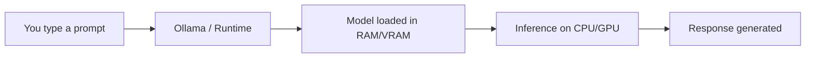
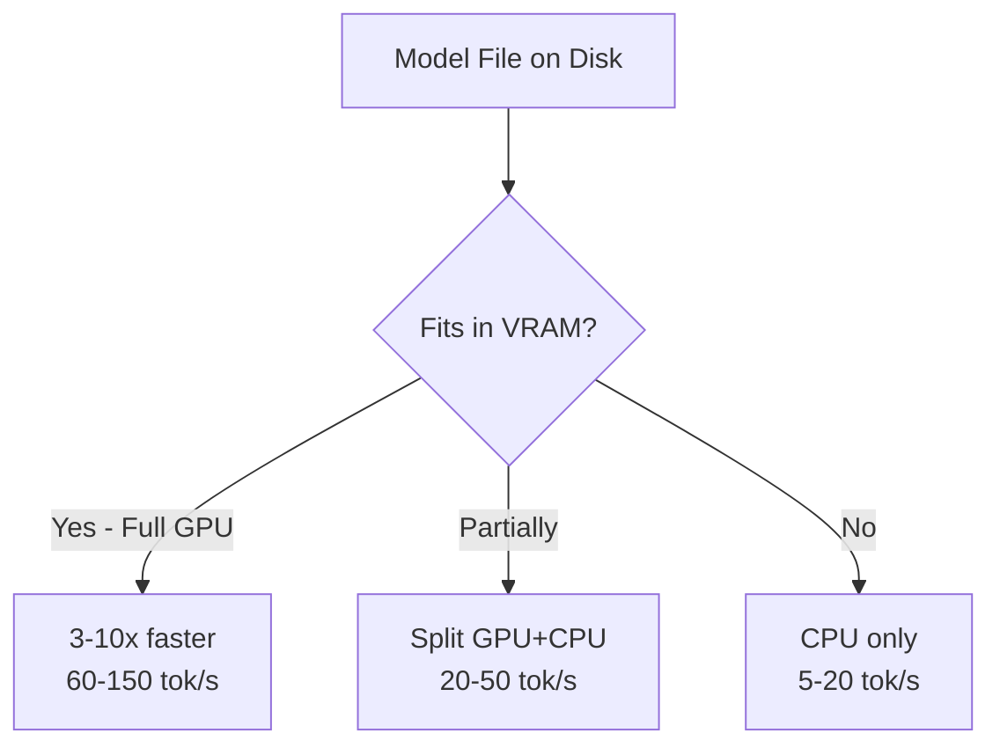
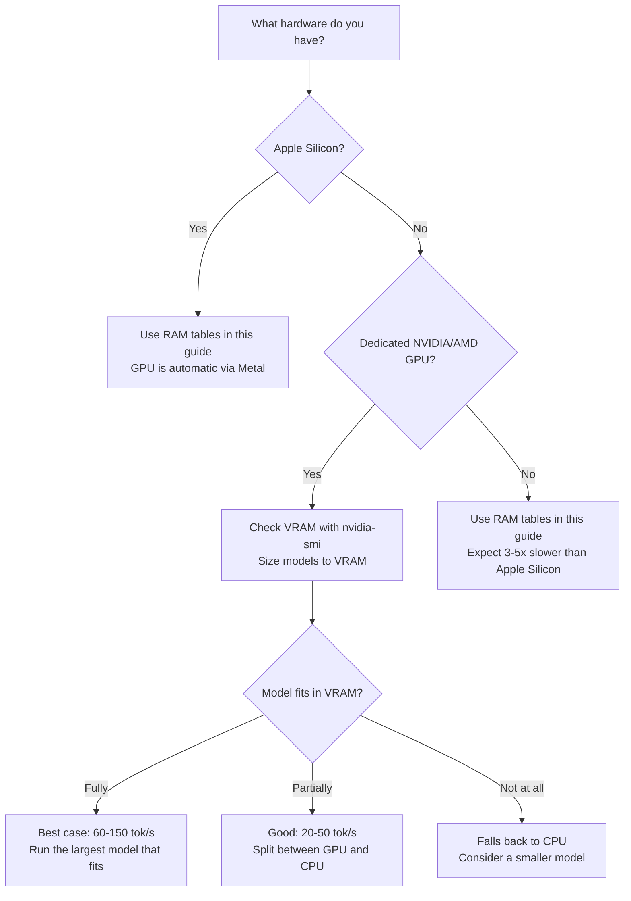

You don't need a cloud subscription or an expensive GPU to use AI in your daily workflow. Open-source models have matured to the point where a regular laptop can run capable AI for coding, writing, image generation, audio transcription, and more — completely free, completely private.

This guide covers everything: how to pick the right model for your hardware, how to set it up, and how to integrate it into your actual workflow.

---

## Table of Contents

- [Why Run AI Locally?](#why-run-ai-locally)
- [How Local AI Models Work](#how-local-ai-models-work-quick-primer)
- [The RAM Budget Rule](#the-ram-budget-rule)
- [Got a GPU? How It Changes Everything](#got-a-gpu-how-it-changes-everything)
- [Context Window: Why It Matters](#context-window-why-it-matters)
- [Model Recommendations by RAM and Use Case](#model-recommendations-by-ram-and-use-case)
  - [8 GB RAM — The Essentials](#8-gb-ram--the-essentials)
  - [16 GB RAM — The Sweet Spot](#16-gb-ram--the-sweet-spot-for-most-developers)
  - [24 GB RAM — Power User Territory](#24-gb-ram--power-user-territory)
  - [32 GB RAM — Maximum Local AI](#32-gb-ram--maximum-local-ai-experience)
- [Setup Guide: Ollama](#setup-guide-ollama-text-code-vision-models)
- [Beyond Ollama: Other Free Tools](#beyond-ollama-other-free-tools-to-run-local-ai)
- [Setup Guide: Whisper.cpp (Audio)](#setup-guide-whispercpp-audio-transcription)
- [Setup Guide: Piper (Text-to-Speech)](#setup-guide-piper-text-to-speech)
- [Setup Guide: Image Generation](#setup-guide-image-generation-stable-diffusion)
- [What About Video Generation?](#what-about-video-generation)
- [Customizing Models with Modelfile](#customizing-models-with-modelfile)
- [Integrate with Your Editor & Workflow](#integrate-with-your-editor--workflow)
- [Ollama Integrations](#ollama-integrations-where-you-can-use-local-models)
- [Speed Benchmarks: What to Expect](#speed-benchmarks-what-to-expect-on-apple-silicon)
- [Local vs Cloud: Honest Comparison](#local-vs-cloud-honest-comparison)
- [How to Evaluate a Model Yourself](#how-to-evaluate-a-model-yourself)
- [Daily Workflow Examples](#daily-workflow-examples)
- [Quick Reference Table](#quick-reference-best-model-for-each-task)
- [Tips for the Best Experience](#tips-for-the-best-experience)
- [Frequently Asked Questions](#frequently-asked-questions)
- [References](#references)

---

## Why Run AI Locally?

Before diving into models and setup, here's why local AI is worth your time:

- **Zero cost** — no API fees, no subscriptions, no token limits
- **Full privacy** — your code, documents, and data never leave your machine
- **Works offline** — airports, trains, remote locations — no internet needed
- **No rate limits** — run as many queries as your hardware allows
- **Customizable** — fine-tune models, adjust parameters, create custom system prompts

The trade-off is straightforward: local models are smaller and less capable than cloud giants like GPT-4o or Claude. But for 80% of daily tasks — code completions, explaining errors, summarizing documents, generating images — they're more than enough.

---

## How Local AI Models Work (Quick Primer)



When you run a model locally:

1. The **model weights** (a large file, typically 2-20 GB) are loaded into your RAM or GPU memory
2. A **runtime** like [Ollama](https://ollama.com) manages the model, accepts prompts via an API, and returns responses
3. **Inference** (generating the response) happens on your CPU or GPU — Apple Silicon Macs use the unified memory GPU, which is efficient for this

### Key Concept: Quantization

Quantization is compressing a model's weights from high-precision numbers (16-bit floats) to lower-precision ones (4-bit integers). Think of it like reducing image quality from PNG to JPEG — the file gets much smaller, you lose some detail, but it's usually good enough. Without quantization, a 14B model would be ~28 GB (won't fit on most laptops). Quantized to Q4, it's ~9 GB — fits comfortably on 16 GB RAM.

Models come in different **quantization levels** that trade quality for size:

| Quantization | Quality | Size Reduction | When to Use |
|-------------|---------|---------------|-------------|
| **F16** (full) | Best | None (baseline) | Only if you have massive RAM |
| **Q8** | Near-perfect | ~50% smaller | Best quality-to-size ratio |
| **Q6_K** | Excellent | ~58% smaller | Sweet spot for most users |
| **Q4_K_M** | Good | ~70% smaller | Default for most Ollama models |
| **Q3_K** | Acceptable | ~75% smaller | When RAM is very tight |
| **Q2_K** | Degraded | ~80% smaller | Last resort |

Most models on Ollama default to **Q4_K_M** — a good balance. You don't need to worry about this unless you're optimizing for a specific RAM budget.

> **Pro tip**: A bigger model at lower quantization (e.g., 14B at Q3) often outperforms a smaller model at higher quantization (e.g., 7B at Q8). When a model barely fits your RAM, try the next smaller quantization rather than dropping to a smaller model.

> **Look for "Unsloth Dynamic" GGUFs**: When downloading models from Hugging Face, you'll often see versions uploaded by [Unsloth](https://unsloth.ai). Their "Dynamic 2.0" quantization intelligently varies precision per layer — giving important layers higher precision and less critical ones lower. The result: better quality at the same file size (benchmarks show +1% accuracy while being 2 GB smaller than standard quants). If you see both a regular GGUF and an Unsloth GGUF for the same model, prefer the Unsloth version.

---

## The RAM Budget Rule

Not all your RAM is available for AI models. Here's the realistic breakdown:

| Total RAM | OS + Apps Overhead | Available for Models | Practical Model Size Limit |
|-----------|-------------------|---------------------|--------------------------|
| **8 GB** | ~4 GB | ~4 GB | Up to 3B-7B parameter models |
| **16 GB** | ~5 GB | ~11 GB | Up to 7B-14B parameter models |
| **24 GB** | ~6 GB | ~18 GB | Up to 14B-22B parameter models |
| **32 GB** | ~8 GB | ~24 GB | Up to 22B-30B parameter models |

> **Rule of thumb**: The model file size (shown by `ollama list`) should be **at most 80%** of your available RAM. Going beyond that causes memory swapping, which makes inference painfully slow.

> **Got 36 GB or more?** MacBook Pros with M4 Pro/Max chips come in 36, 48, 64, and 128 GB configurations. If that's you, follow the 32 GB recommendations — you can run the same models with more headroom, larger context windows, or multiple models loaded simultaneously. At 64 GB+, you can run 70B parameter models like Llama 3.1 70B or Qwen3 32B at full quality.

---

## Got a GPU? How It Changes Everything

The rest of this guide is organized by RAM because that's the universal constraint — everyone has RAM, not everyone has a dedicated GPU. But if you **do** have a GPU, it fundamentally changes what you can run and how fast.

### Why GPU Matters for AI

GPUs have hundreds of parallel cores optimized for the matrix math that drives AI inference. A model loaded into GPU memory (VRAM) runs **3-10x faster** than the same model on CPU. The key constraint shifts from total RAM to **VRAM** — your GPU's dedicated memory.

> **What is VRAM?** VRAM (Video RAM) is memory physically built into your graphics card — separate from your system RAM. It's ultra-fast memory that only the GPU can access directly. When people say "my RTX 4070 has 12 GB," they mean 12 GB of VRAM. Your system RAM (16/32 GB) and VRAM (8/12/24 GB) are independent pools — a model loaded into VRAM runs dramatically faster because the GPU doesn't need to fetch data over the slower system bus.



### Step 1: Identify Your GPU

#### macOS (Apple Silicon)

Apple Silicon (M1/M2/M3/M4) uses **unified memory** — the GPU and CPU share the same RAM pool. There's no separate VRAM. This is actually an advantage: your entire RAM is available to the GPU.

```bash
# Check your chip and memory
system_profiler SPHardwareDataType | grep -E "Chip|Memory"

# Example output:
# Chip: Apple M2 Pro
# Memory: 16 GB
```

Your "GPU memory" = your total RAM. Ollama and llama.cpp automatically use the Metal GPU on Apple Silicon — no setup needed.

> **What is Metal?** Metal is Apple's GPU programming framework — the equivalent of NVIDIA's CUDA. It lets software (like Ollama, llama.cpp, Whisper.cpp) run AI computations directly on Apple Silicon's built-in GPU cores. You don't install it separately — it's part of macOS. When you see "Metal acceleration," it simply means the tool is using your Mac's GPU instead of just the CPU, which makes inference 2-4x faster.

#### Linux (NVIDIA)

```bash
# Check if NVIDIA GPU is detected
nvidia-smi

# Example output shows:
# GPU Name: NVIDIA GeForce RTX 4070 Ti
# Memory: 12288 MiB (12 GB VRAM)
# Driver Version: 560.35.03
# CUDA Version: 12.6
```

If `nvidia-smi` is not found, you need to install NVIDIA drivers:

```bash
# Ubuntu/Debian
sudo apt install nvidia-driver-560

# Or use the NVIDIA CUDA toolkit
# See: https://docs.ollama.com/gpu
```

#### Linux (AMD)

```bash
# Check for AMD GPU
rocminfo | grep -E "Name|Marketing"

# Or simpler
lspci | grep -i "vga\|3d"

# Check VRAM
rocm-smi --showmeminfo vram
```

AMD GPU support requires ROCm. Supported cards: RX 6000/7000 series, Radeon PRO, Instinct. See [Ollama AMD docs](https://docs.ollama.com/gpu).

#### Windows (NVIDIA/AMD/Intel)

```powershell
# PowerShell — check GPU name and VRAM
Get-CimInstance Win32_VideoController | Select-Object Name, AdapterRAM

# Or open Task Manager → Performance → GPU
# Shows GPU name, dedicated memory (VRAM), and utilization
```

For NVIDIA specifically:
```powershell
nvidia-smi
```

### Step 2: Understand VRAM vs RAM

| Scenario | What Determines Model Size | Speed |
|----------|---------------------------|-------|
| **Apple Silicon** (M1-M4) | Total unified RAM (shared between CPU & GPU) | Fast — GPU uses all available memory |
| **Dedicated NVIDIA GPU** | VRAM is primary; system RAM is backup for overflow | Fastest when model fits fully in VRAM |
| **AMD GPU (ROCm)** | VRAM (same as NVIDIA, but Linux-only) | Fast when supported |
| **Intel Arc GPU** | VRAM (limited Ollama support) | Moderate |
| **No dedicated GPU** | System RAM only, CPU inference | Slowest |

> **Key insight**: On a system with 32 GB RAM + 12 GB VRAM (e.g., RTX 4070 Ti), the VRAM is what matters most for speed. A 7B model fits entirely in 12 GB VRAM and runs at 60-100+ tok/s. The 32 GB RAM becomes relevant only for models that exceed your VRAM.

### Step 3: Model Selection by VRAM

If you have a dedicated NVIDIA/AMD GPU, choose models based on **VRAM**, not system RAM:

| VRAM | Best Model Size | Examples | Expected Speed |
|------|----------------|---------|----------------|
| **6 GB** | 3B-7B (Q4) | Qwen2.5-Coder 3B, Gemma 3 4B, Llama 3.2 3B | 40-80 tok/s |
| **8 GB** | 7B (Q4) | Llama 3.1 8B, Mistral 7B, Qwen2.5-Coder 7B | 50-100 tok/s |
| **12 GB** | 7B (Q8) or 14B (Q4) | Qwen2.5-Coder 14B, Phi-4 14B, Gemma 4 E4B | 30-70 tok/s |
| **16 GB** | 14B (Q6) or 22B (Q4) | Codestral 22B, Mistral Small 24B | 25-50 tok/s |
| **24 GB** | 22B (Q6) or 30B (Q4) | Qwen3 30B-A3B, Gemma 4 26B, Qwen3-Coder 30B | 20-45 tok/s |
| **48 GB** | 70B (Q4) | Llama 3.1 70B, Qwen3 32B (full precision) | 15-30 tok/s |

*Speeds approximate for NVIDIA RTX 4000-series. Older cards (RTX 3000) are ~20-30% slower.*

> **Compared to CPU-only**: A 7B model on CPU might give you 10-20 tok/s. The same model fully loaded in 8 GB VRAM gives 60-100 tok/s. That's the difference between "usable" and "feels instant."

### Step 4: How GPU Offloading Works

Ollama (and llama.cpp) automatically handles GPU offloading:

- **Full offload**: Model fits entirely in VRAM → maximum speed
- **Partial offload**: Model is split — some layers on GPU, rest on CPU → faster than CPU-only, slower than full GPU
- **No offload**: No compatible GPU or VRAM too small → CPU-only

You can control this with environment variables:

```bash
# Force specific number of GPU layers (advanced)
OLLAMA_NUM_GPU_LAYERS=35 ollama run qwen2.5-coder:14b

# Disable GPU entirely (useful for testing)
OLLAMA_NO_GPU=1 ollama run llama3.1
```

To check what Ollama is actually using:

```bash
# See GPU utilization while a model is running
ollama ps

# NVIDIA: watch GPU memory and utilization in real-time
watch -n 1 nvidia-smi

# macOS: check GPU usage in Activity Monitor → GPU History
```

### Practical Decision Tree



### Summary: How GPU Changes the Rules

| Without GPU (CPU-only) | With GPU |
|----------------------|----------|
| Model size limited by RAM | Model size limited by VRAM (for full speed) |
| 5-25 tok/s typical | 30-150 tok/s typical |
| All RAM recommendations in this guide apply directly | Use VRAM table above for model sizing |
| Larger context windows eat into available RAM | Context window uses VRAM too — budget accordingly |
| One model at a time on ≤16 GB | Can keep model in VRAM + run apps normally (system RAM stays free) |

> **Apple Silicon users**: You already have the GPU advantage built-in — Metal acceleration is automatic. The RAM-based tables in this guide already account for GPU usage via unified memory. No extra setup needed.

> **No GPU? No problem.** Every model in this guide runs on CPU. A GPU makes things faster, but it's not required. If you're on an Intel/AMD laptop without a discrete GPU, follow the RAM-based recommendations and expect slower speeds.

---

## Context Window: Why It Matters

The **context window** is how much text a model can "see" at once — your prompt, the conversation history, and the response all share this window. For coding, this is critical:

| Context Size | What It Means | Good For |
|-------------|---------------|----------|
| **4K tokens** | ~3,000 words | Short Q&A, simple completions |
| **8K tokens** | ~6,000 words | Single-file code review, short conversations |
| **32K tokens** | ~24,000 words | Multi-file context, longer conversations |
| **128K tokens** | ~96,000 words | Entire codebase context, long documents |
| **256K tokens** | ~192,000 words | Very large documents, extensive code analysis |

**Important**: [Ollama often defaults to a conservative 2048 tokens](https://docs.ollama.com/context-length) (or the model's minimum) to save RAM. You usually need to explicitly set a larger context:

```bash
# To set context window, use the API or a Modelfile
# Or interactively in the prompt type: /set parameter num_ctx 32768

# Or in API calls
curl http://localhost:11434/api/generate -d '{
  "model": "qwen3:30b-a3b",
  "prompt": "your prompt here",
  "options": { "num_ctx": 32768 }
}'
```

> **RAM impact**: Larger context windows consume more RAM. On 16 GB, stick to 8K-16K context. On 32 GB, you can comfortably use 32K-64K.

### Context Windows of Popular Models

| Model | Max Context | Default on Ollama |
|-------|------------|-------------------|
| Gemma 4 (all sizes) | 128K-256K | 2048 |
| Qwen3 (all sizes) | 32K-128K | 2048 |
| Qwen3-Coder 30B | 128K | 2048 |
| Llama 3.1 8B | 128K | 2048 |
| Codestral 22B | 32K | 2048 |
| Mistral Small 24B | 128K | 2048 |

Always override the default if you need more context for coding or document analysis.

---


## Model Recommendations by RAM and Use Case

### 8 GB RAM — The Essentials

With 8 GB, you can run one small model at a time. Close unnecessary apps (especially browsers with many tabs) to free up memory.

#### Text & Chat

| Model | Size | Command | Context | Strengths |
|-------|------|---------|---------|-----------|
| **Gemma 4 E2B** | ~7.2 GB | `ollama pull gemma4:e2b` | 128K | Google's latest, vision built-in. ⚠️ Tight fit — requires closing all apps, will use swap on 8 GB |
| **Gemma 3 4B** | ~3.3 GB | `ollama pull gemma3:4b` | 128K | Efficient small model, good general knowledge |
| **Phi-4 Mini 3.8B** | ~2.5 GB | `ollama pull phi4-mini` | 16K | Microsoft's small model, strong reasoning for its size |
| **Llama 3.2 3B** | ~2 GB | `ollama pull llama3.2:3b` | 128K | Meta's compact model, fast and capable |

#### Coding

| Model | Size | Command | Context | Strengths |
|-------|------|---------|---------|-----------|
| **Qwen2.5-Coder 3B** | ~2 GB | `ollama pull qwen2.5-coder:3b` | 32K | Best small coding model, fill-in-the-middle support |
| **DeepSeek-Coder 1.3B** | ~0.8 GB | `ollama pull deepseek-coder:1.3b` | 16K | Ultra-light, good for autocomplete only |

#### Image Understanding (Vision)

| Model | Size | Command | Strengths |
|-------|------|---------|-----------|
| **Gemma 4 E2B** | ~7.2 GB | `ollama pull gemma4:e2b` | Vision built-in — describe images, read diagrams |
| **MiniCPM-V 3B** | ~2 GB | `ollama pull minicpm-v` | Lighter vision model, works better on 8 GB |

#### Audio (Speech-to-Text)

| Tool | Size | Command | Strengths |
|------|------|---------|-----------|
| **Whisper.cpp (small)** | ~0.5 GB | See [setup below](#setup-guide-whispercpp-audio-transcription) | Fast transcription, decent accuracy |
| **Whisper.cpp (large-v3-turbo q5)** | ~0.57 GB | See [setup below](#setup-guide-whispercpp-audio-transcription) | Near-large quality, fast — best value |
| **Whisper.cpp (base)** | ~0.15 GB | See [setup below](#setup-guide-whispercpp-audio-transcription) | Ultra-light, basic accuracy |

#### Text-to-Speech

| Tool | Size | Command | Strengths |
|------|------|---------|-----------|
| **Piper** | ~60 MB per voice | See [setup below](#setup-guide-piper-text-to-speech) | Fast neural TTS, runs on CPU, 30+ languages |

> **8 GB verdict**: You can do basic chat, simple code completions, light image understanding, and audio transcription. Don't expect multi-turn complex reasoning or large codebase analysis. Gemma 4 E2B is the most capable option but leaves almost no headroom.

---

### 16 GB RAM — The Sweet Spot for Most Developers

This is where local AI becomes genuinely useful. You can run 7B-14B models comfortably.

#### Text & Chat

| Model | Size | Command | Context | Strengths |
|-------|------|---------|---------|-----------|
| **Gemma 4 E4B** | ~9.6 GB | `ollama pull gemma4` | 128K | Google's latest, vision + text, excellent quality |
| **Gemma 3 12B** | ~8.1 GB | `ollama pull gemma3:12b` | 128K | Excellent general-purpose, multimodal |
| **Llama 3.1 8B** | ~4.7 GB | `ollama pull llama3.1` | 128K | Meta's workhorse, great instruction following |
| **Mistral 7B** | ~4.1 GB | `ollama pull mistral` | 32K | Fast, good at structured output and summarization |
| **Phi-4 14B** | ~9 GB | `ollama pull phi4` | 16K | Microsoft's reasoning model, punches above its weight |

#### Coding

| Model | Size | Command | Context | Strengths |
|-------|------|---------|---------|-----------|
| **Qwen2.5-Coder 7B** | ~4.7 GB | `ollama pull qwen2.5-coder:7b` | 32K | Best coding model at this size, excellent completions |
| **Qwen2.5-Coder 14B** | ~9 GB | `ollama pull qwen2.5-coder:14b` | 32K | Stronger code generation, fits tight on 16 GB |
| **DeepSeek-Coder-V2 Lite 16B** | ~9 GB | `ollama pull deepseek-coder-v2:16b` | 128K | MoE architecture, good at code generation |

#### Image Understanding (Vision)

| Model | Size | Command | Strengths |
|-------|------|---------|-----------|
| **Gemma 4 E4B** | ~9.6 GB | `ollama pull gemma4` | Built-in vision — handles text + images in one model |
| **Gemma 3 12B** | ~8.1 GB | `ollama pull gemma3:12b` | Built-in vision, slightly older but proven |
| **LLaVA 13B** | ~8 GB | `ollama pull llava:13b` | Dedicated vision model, good image analysis |

#### Audio (Speech-to-Text)

| Tool | Size | Command | Strengths |
|------|------|---------|-----------|
| **Whisper.cpp (large-v3-turbo q5)** | ~0.57 GB | See [setup below](#setup-guide-whispercpp-audio-transcription) | Best speed/quality ratio — recommended |
| **Whisper.cpp (medium)** | ~1.5 GB | See [setup below](#setup-guide-whispercpp-audio-transcription) | Good accuracy, handles accents well |
| **Whisper.cpp (small)** | ~0.5 GB | See [setup below](#setup-guide-whispercpp-audio-transcription) | Faster, slightly less accurate |

#### Text-to-Speech

| Tool | Size | Command | Strengths |
|------|------|---------|-----------|
| **Piper (medium quality)** | ~60 MB per voice | See [setup below](#setup-guide-piper-text-to-speech) | Natural-sounding, real-time on CPU |

> **16 GB verdict**: This is where local AI becomes a real productivity tool. You get solid coding assistance, good chat, image understanding, and audio transcription. Run one model at a time for best performance.

---

### 24 GB RAM — Power User Territory

You can run larger models and even keep two smaller models loaded simultaneously.

#### Text & Chat

| Model | Size | Command | Context | Strengths |
|-------|------|---------|---------|-----------|
| **Gemma 4 26B (MoE)** | ~18 GB | `ollama pull gemma4:26b` | 256K | Google's latest MoE, vision + text, 256K context |
| **Qwen3 14B** | ~9 GB | `ollama pull qwen3:14b` | 128K | Strong reasoning, supports thinking mode |
| **Gemma 3 27B** | ~17 GB | `ollama pull gemma3:27b` | 128K | Excellent quality, proven multimodal |
| **Mistral Small 24B** | ~14 GB | `ollama pull mistral-small` | 128K | Great at structured tasks, function calling |

#### Coding

| Model | Size | Command | Context | Strengths |
|-------|------|---------|---------|-----------|
| **Codestral 22B** | ~13 GB | `ollama pull codestral` | 32K | Mistral's dedicated coding model, 80+ languages |
| **Qwen2.5-Coder 14B** | ~9 GB | `ollama pull qwen2.5-coder:14b` | 32K | Best dedicated coding model at this tier |
| **DeepSeek-Coder-V2 16B** | ~9 GB | `ollama pull deepseek-coder-v2:16b` | 128K | Good at code generation and explanation |

#### Image Understanding (Vision)

| Model | Size | Command | Strengths |
|-------|------|---------|-----------|
| **Gemma 4 26B** | ~18 GB | `ollama pull gemma4:26b` | Best vision at this tier, 256K context |
| **Gemma 3 27B** | ~17 GB | `ollama pull gemma3:27b` | Built-in vision, excellent quality |

#### Audio (Speech-to-Text)

| Tool | Size | Command | Strengths |
|------|------|---------|-----------|
| **Whisper.cpp (large-v3-turbo q5)** | ~0.57 GB | See [setup below](#setup-guide-whispercpp-audio-transcription) | Best speed/quality — recommended |
| **Whisper.cpp (large-v3)** | ~3 GB | See [setup below](#setup-guide-whispercpp-audio-transcription) | Best transcription quality |
| **Whisper.cpp (medium)** | ~1.5 GB | See [setup below](#setup-guide-whispercpp-audio-transcription) | Good balance of speed and accuracy |

#### Text-to-Speech

| Tool | Size | Command | Strengths |
|------|------|---------|-----------|
| **Piper (high quality)** | ~100 MB per voice | See [setup below](#setup-guide-piper-text-to-speech) | Best local TTS quality |

#### Recommended Dual-Model Setup

With 24 GB, you can run a chat model + a small autocomplete model simultaneously:

```bash
# Chat/reasoning model (~14 GB)
ollama pull mistral-small

# Tab-autocomplete model (~4.7 GB)
ollama pull qwen2.5-coder:7b
```

> **24 GB verdict**: You get near-cloud-quality responses for most tasks. The dual-model setup (reasoning + autocomplete) is a game-changer for coding workflows. Gemma 4 26B is the standout pick if you run one model at a time.

---

### 32 GB RAM — Maximum Local AI Experience

This is the best consumer-level experience. You can run the largest open models and multi-model setups.

#### Text & Chat

| Model | Size | Command | Context | Strengths |
|-------|------|---------|---------|-----------|
| **Qwen3 30B-A3B** | ~18 GB | `ollama pull qwen3:30b-a3b` | 128K | MoE — 30B knowledge, 3B inference speed. Best value |
| **Gemma 4 26B (MoE)** | ~18 GB | `ollama pull gemma4:26b` | 256K | Google's latest, vision + text, 256K context |
| **Gemma 4 31B (Dense)** | ~20 GB | `ollama pull gemma4:31b` | 256K | Dense model, highest quality Gemma 4 |
| **Gemma 3 27B** | ~17 GB | `ollama pull gemma3:27b` | 128K | Proven quality, multimodal built-in |
| **Command-R 35B** | ~20 GB | `ollama pull command-r` | 128K | Cohere's model, excellent at RAG and tool use |

#### Coding

| Model | Size | Command | Context | Strengths |
|-------|------|---------|---------|-----------|
| **Qwen3-Coder 30B** | ~19 GB | `ollama pull qwen3-coder` | 128K | Purpose-built for code, agentic workflows, Apache 2.0 |
| **Qwen3 30B-A3B** | ~18 GB | `ollama pull qwen3:30b-a3b` | 128K | Fast MoE with strong code abilities |
| **Codestral 22B** | ~13 GB | `ollama pull codestral` | 32K | Dedicated coding model, 80+ languages |
| **Qwen2.5-Coder 14B** | ~9 GB | `ollama pull qwen2.5-coder:14b` | 32K | Leaves room for a second model |

#### Image Understanding (Vision)

| Model | Size | Command | Strengths |
|-------|------|---------|-----------|
| **Gemma 4 31B** | ~20 GB | `ollama pull gemma4:31b` | Best local vision model, 256K context |
| **Gemma 4 26B** | ~18 GB | `ollama pull gemma4:26b` | MoE variant, faster inference |
| **Llama 3.2 Vision 11B** | ~7 GB | `ollama pull llama3.2-vision` | Good vision, leaves room for other models |

#### Audio (Speech-to-Text)

| Tool | Size | Command | Strengths |
|------|------|---------|-----------|
| **Whisper.cpp (large-v3-turbo q5)** | ~0.57 GB | See [setup below](#setup-guide-whispercpp-audio-transcription) | Best speed/quality — recommended for most |
| **Whisper.cpp (large-v3)** | ~3 GB | See [setup below](#setup-guide-whispercpp-audio-transcription) | Best local transcription quality |

#### Text-to-Speech

| Tool | Size | Command | Strengths |
|------|------|---------|-----------|
| **Piper (high quality)** | ~100 MB per voice | See [setup below](#setup-guide-piper-text-to-speech) | Best local TTS quality, multiple voices |

#### Recommended Multi-Model Setup

```bash
# Primary reasoning/chat (~18 GB)
ollama pull qwen3:30b-a3b

# Tab-autocomplete for coding (~4.7 GB)
ollama pull qwen2.5-coder:7b

# Keep ~9 GB free for OS + apps
```

> **32 GB verdict**: You get a genuinely powerful local AI setup. Qwen3 30B-A3B (MoE) is the standout for general use — fast and remarkably capable. For dedicated coding, Qwen3-Coder 30B is the new king.


---

## Setup Guide: Ollama (Text, Code, Vision Models)

[Ollama](https://ollama.com) is the easiest way to run LLMs locally. It handles model downloading, quantization, and serves an API — all in one tool.

### Step 1: Install Ollama

| Platform | Install Command / Method | Requirements |
|----------|------------------------|--------------|
| **macOS** | Download from [ollama.com/download/mac](https://ollama.com/download/mac) or `brew install ollama` | macOS Sonoma 14+, Apple M-series or Intel |
| **Linux** | `curl -fsSL https://ollama.com/install.sh \| sh` | Any modern distro. [GPU setup](https://docs.ollama.com/linux) optional |
| **Windows** | Download from [ollama.com/download/windows](https://ollama.com/download/windows) | Windows 10 22H2+. No admin needed |

After install, verify with `ollama --version`. The API runs at `http://localhost:11434`.

> **Storage**: Models live in `~/.ollama/models/` (macOS/Linux) or `%HOMEPATH%\.ollama\models` (Windows). Budget 20-50 GB free disk space. On Windows, set the `OLLAMA_MODELS` env var to move models to another drive. See platform-specific docs for [macOS](https://docs.ollama.com/macos), [Linux](https://docs.ollama.com/linux), [Windows](https://docs.ollama.com/windows).

### Step 2: Pull a Model

```bash
# Example: pull Gemma 4 (default E4B, ~9.6 GB)
ollama pull gemma4

# Example: pull a coding model
ollama pull qwen2.5-coder:7b

# List downloaded models
ollama list
```

### Step 3: Run and Chat

```bash
# Interactive chat
ollama run gemma4

# Ask a coding question
ollama run qwen2.5-coder:7b "Write a Python function to merge two sorted lists"

# To run with larger context window, create a Modelfile with PARAMETER num_ctx 32768
# Or use the interactive prompt: /set parameter num_ctx 32768
```

### Step 4: Verify the API

Ollama exposes a local API at `http://localhost:11434`:

```bash
# Check downloaded models
curl http://localhost:11434/api/tags

# Send a prompt via API
curl http://localhost:11434/api/generate -d '{
  "model": "gemma4",
  "prompt": "Explain Docker networking in 3 sentences",
  "stream": false
}'
```

### Useful Ollama Commands

```bash
ollama list              # Show downloaded models with sizes
ollama ps                # Show currently loaded models in memory
ollama rm <model>        # Delete a model to free disk space
ollama show <model>      # Show model details (size, quantization, context, license)
ollama cp <src> <dest>   # Copy a model (useful for custom Modelfile configs)
ollama pull <model>      # Download or update a model
```

> **Prefer a visual API explorer?** The [Ollama REST API Postman Collection](https://www.postman.com/postman-student-programs/ollama-api/documentation/suc47x8/ollama-rest-api) has pre-built requests for generate, chat, structured output, JSON mode, and model management — great for testing before writing code. For programmatic use, see the official [Python](https://github.com/ollama/ollama-python) and [JavaScript](https://github.com/ollama/ollama-js) client libraries.

---

## Beyond Ollama: Other Free Tools to Run Local AI

Ollama is the easiest starting point, but it's not the only option. Here's a quick look at the broader ecosystem, categorized by use case.

### CLI & Developer Tools

| Tool | What It Is | Best For | Open Source |
|------|-----------|----------|-------------|
| [**llama.cpp**](https://github.com/ggml-org/llama.cpp) | The C/C++ inference engine Ollama is built on | Maximum control over quantization, context, and parameters | ✅ Yes |
| [**MLX / mlx-lm**](https://github.com/ml-explore/mlx) | Apple's native framework for Apple Silicon | Fastest inference on Macs — up to 4x faster than llama.cpp for some models | ✅ Yes |
| [**oMLX**](https://omlx.ai) | macOS-native MLX server with SSD KV caching. Drops TTFT from 90s to <5s for coding agents. Continuous batching, OpenAI + Anthropic API compatible | Apple Silicon users running coding agents (Claude Code, Cursor, OpenClaw). 14.8k+ stars | ✅ Yes (Apache 2.0) |
| [**LocalAI**](https://localai.io) | OpenAI-compatible API server with multimodal support | Text, images, audio, embeddings — all through one API. Supports GGUF, GPTQ, AWQ, Safetensors | ✅ Yes |

### Desktop Apps (GUI)

| Tool | What It Is | Best For | Open Source |
|------|-----------|----------|-------------|
| [**Unsloth Studio**](https://unsloth.ai/docs/new/studio) | Web UI for running GGUF/safetensor models + no-code fine-tuning, model arena, data recipes | Run and train models locally with observability. Compare models side-by-side. Mac/Windows/Linux | ✅ Yes (AGPL-3.0) |
| [**Joanium**](https://www.joanium.com) | Local-first AI desktop app — reads project files, runs scheduled automations, background agents, connects to GitHub/Gmail/Google Drive/Calendar | Developers who want AI beyond chat: file-aware automations, scheduling, and multi-provider support (10+ providers including local models). Free forever, no account required | ✅ Yes ([GitHub](https://github.com/Joanium/Joanium)) |
| [**Pinokio**](https://pinokio.co) | One-click app store for local AI tools. Browse, install, and run ComfyUI, Whisper, TTS, LLMs, and 160+ AI apps with zero setup | Non-technical users who want to try many local AI tools without terminal commands | ✅ Yes |
| [**LM Studio**](https://lmstudio.ai) | Polished desktop app with model browser, chat UI, and local API server | Beginners, model comparison, "Chat with Documents" RAG. Supports GGUF + MLX formats | ❌ Free, not OSS |
| [**Jan**](https://jan.ai) | Offline ChatGPT alternative with desktop app and CLI | Privacy-first users who want a clean chat interface with zero cloud dependency | ✅ Yes |
| [**GPT4All**](https://gpt4all.io) | One-click desktop app by Nomic AI | Non-technical users who want local chat + document Q&A with minimal setup | ✅ Yes |

### Production & High-Throughput Serving

| Tool | What It Is | Best For | Open Source |
|------|-----------|----------|-------------|
| [**vLLM**](https://github.com/vllm-project/vllm) | Production inference server with continuous batching and PagedAttention | Multi-user serving, high concurrency. V1 engine supports text, audio, embeddings, multimodal | ✅ Yes |
| [**SGLang**](https://github.com/sgl-project/sglang) | High-throughput serving framework from UC Berkeley | Structured output, constrained decoding, production API serving | ✅ Yes |
| [**TGI**](https://github.com/huggingface/text-generation-inference) | Hugging Face's inference server with built-in observability | Teams already in the HF ecosystem, metrics-heavy deployments | ✅ Yes |

### Platform-Specific & Niche

| Tool | What It Is | Best For | Open Source |
|------|-----------|----------|-------------|
| [**Docker Model Runner**](https://docs.docker.com) | Run GGUF models directly from Docker Desktop | Teams already in container workflows — pull models like Docker images | Partial |
| [**Lemonade**](https://github.com/amd/lemonade) | AMD's tool for Ryzen AI NPU hardware | AMD laptop users with dedicated NPUs — includes MCP tool calling | ✅ Yes |

> **Which should you pick?** For most readers of this guide: start with **Ollama** (simplest CLI + API), try **LM Studio** or **Unsloth Studio** if you prefer a GUI (Unsloth is open-source and adds fine-tuning + model arena), use **Joanium** if you want file-aware automations and scheduling beyond chat, use **Pinokio** if you want one-click installs for image/audio/video AI tools, use **oMLX** if you're on Apple Silicon and want the fastest inference for coding agents, use **Goose** or **OpenHuman** if you want an agentic workflow with local models and persistent memory. Everything else is for specialized needs.

---

## Setup Guide: Whisper.cpp (Audio Transcription)

[Whisper.cpp](https://github.com/ggerganov/whisper.cpp) runs OpenAI's Whisper speech-to-text model locally using optimized C++ code. It's fast on Apple Silicon and modern CPUs.

### Step 1: Install via Homebrew

```bash
# Install whisper-cpp (macOS)
brew install whisper-cpp

# Verify — the CLI binary is called whisper-cli
whisper-cli --help
```

> **Note**: The Homebrew package installs the binary as `whisper-cli`, not `whisper-cpp`. It does **not** include a model download script — you need to download GGML model files manually.

### Step 2: Download a Model

Models are hosted at [huggingface.co/ggerganov/whisper.cpp](https://huggingface.co/ggerganov/whisper.cpp/tree/main). Download the `.bin` file that matches your RAM budget:

```bash
# Create a directory for models
mkdir -p ~/.local/share/whisper-cpp

# Recommended: large-v3-turbo quantized (574 MB) — best speed/quality ratio
curl -L -o ~/.local/share/whisper-cpp/ggml-large-v3-turbo-q5_0.bin \
  https://huggingface.co/ggerganov/whisper.cpp/resolve/main/ggml-large-v3-turbo-q5_0.bin
```

#### Which Model to Choose?

| Model File | Size | Speed | Accuracy | Best For |
|-----------|------|-------|----------|----------|
| `ggml-tiny.bin` | 78 MB | Fastest | Basic | Quick tests |
| `ggml-base.bin` | 148 MB | Very fast | Decent | Clear speech, low RAM |
| `ggml-small.bin` | 488 MB | Fast | Good | Meetings, podcasts |
| `ggml-medium.bin` | 1.53 GB | Moderate | Very good | Accented speech, noisy audio |
| `ggml-large-v3-turbo-q5_0.bin` | 574 MB | Fast | Excellent | **Best pick — large quality at medium speed** |
| `ggml-large-v3.bin` | 3.1 GB | Slow | Best | Professional transcription |

> **Pro tip**: The `large-v3-turbo` model is a distilled version of large-v3 — nearly the same accuracy but ~4x faster. The `q5_0` quantized variant (574 MB) is the sweet spot for most users.

**Multilingual vs English-only**: Files with `.en` in the name (e.g., `ggml-medium.en.bin`) are English-only and slightly more accurate for English. Files without `.en` support all languages. The `large-v3-turbo` is multilingual only.

To download a different model, swap the filename in the URL:

```bash
# Example: download small model (488 MB)
curl -L -o ~/.local/share/whisper-cpp/ggml-small.bin \
  https://huggingface.co/ggerganov/whisper.cpp/resolve/main/ggml-small.bin

# Example: download medium English-only (1.53 GB)
curl -L -o ~/.local/share/whisper-cpp/ggml-medium.en.bin \
  https://huggingface.co/ggerganov/whisper.cpp/resolve/main/ggml-medium.en.bin
```

### Step 3: Transcribe

```bash
# Basic transcription
whisper-cli -m ~/.local/share/whisper-cpp/ggml-large-v3-turbo-q5_0.bin -f recording.wav

# Output as SRT subtitles
whisper-cli -m ~/.local/share/whisper-cpp/ggml-large-v3-turbo-q5_0.bin -f meeting.wav --output-srt

# Output with timestamps (plain text)
whisper-cli -m ~/.local/share/whisper-cpp/ggml-large-v3-turbo-q5_0.bin -f meeting.wav --output-txt
```

### Supported Audio Formats

Whisper.cpp works best with **16-bit WAV at 16 kHz**. Convert other formats first:

```bash
# Convert MP3 to WAV using ffmpeg
ffmpeg -i input.mp3 -ar 16000 -ac 1 -c:a pcm_s16le output.wav

# Convert M4A (iPhone recording) to WAV
ffmpeg -i voice-memo.m4a -ar 16000 -ac 1 -c:a pcm_s16le output.wav
```

*Speed estimates on Apple M2, will vary by hardware.*

---

## Setup Guide: Piper (Text-to-Speech)

[Piper](https://github.com/OHF-Voice/piper1-gpl) is a fast, local neural text-to-speech engine. It runs entirely on CPU, needs minimal RAM (~60-100 MB per voice), and supports 30+ languages.

### Install

```bash
# Install via pip
pip install piper-tts
```

### Download a Voice Model

Piper requires a model file (`.onnx`) and its config (`.onnx.json`). Browse available voices at [huggingface.co/rhasspy/piper-voices](https://huggingface.co/rhasspy/piper-voices/tree/main).

```bash
# Create a directory for voice models
mkdir -p ~/.local/share/piper-voices

# Download a US English voice (medium quality, ~60 MB)
curl -L -o ~/.local/share/piper-voices/en_US-lessac-medium.onnx \
  https://huggingface.co/rhasspy/piper-voices/resolve/main/en/en_US/lessac/medium/en_US-lessac-medium.onnx

curl -L -o ~/.local/share/piper-voices/en_US-lessac-medium.onnx.json \
  https://huggingface.co/rhasspy/piper-voices/resolve/main/en/en_US/lessac/medium/en_US-lessac-medium.onnx.json
```

### Generate Speech

```bash
# Generate speech to a WAV file
echo "Hello, this is a test of local text to speech." | \
  piper -m ~/.local/share/piper-voices/en_US-lessac-medium.onnx -f output.wav

# Play directly (macOS)
echo "The build failed with 3 errors." | \
  piper -m ~/.local/share/piper-voices/en_US-lessac-medium.onnx -f temp.wav && afplay temp.wav && rm temp.wav

# Pipe from a file
cat notes.txt | \
  piper -m ~/.local/share/piper-voices/en_US-lessac-medium.onnx -f notes-audio.wav
```

> **Note**: Piper does not have a `--list-voices` flag. You choose a voice by downloading its `.onnx` + `.onnx.json` files and passing the path via `-m`. Browse voices with audio samples at [rhasspy.github.io/piper-samples](https://rhasspy.github.io/piper-samples/).

### Use Cases for Local TTS

- **Accessibility** — screen reader alternative for your own tools
- **Content creation** — narrate blog posts or documentation
- **Notifications** — audio alerts from CI/CD pipelines or monitoring
- **Language learning** — hear pronunciation in 30+ languages
- **Proofreading** — hearing your writing read aloud catches errors your eyes miss

---

## Setup Guide: Image Generation (Stable Diffusion)

For generating images locally, use **Stable Diffusion** via tools optimized for your hardware.

### On macOS (Apple Silicon)

[Draw Things](https://drawthings.ai) is a free, native macOS/iOS app that runs Stable Diffusion models efficiently on Apple Silicon:

- Download from the Mac App Store (free)
- Built-in model browser — download SDXL, SD 1.5, or FLUX models
- Uses Metal GPU acceleration — fast on M1/M2/M3/M4 chips
- No terminal setup needed

### On Linux/Windows

Use [ComfyUI](https://github.com/comfyanonymous/ComfyUI) or [Stable Diffusion WebUI (Automatic1111)](https://github.com/AUTOMATIC1111/stable-diffusion-webui):

```bash
# ComfyUI (recommended — node-based, flexible)
git clone https://github.com/comfyanonymous/ComfyUI.git
cd ComfyUI
pip install -r requirements.txt
python main.py
# Open http://localhost:8188 in your browser
```

### Easiest Install: Stability Matrix or Pinokio

If you don't want to deal with Python environments and git clones:

- [**Stability Matrix (Lykos AI)**](https://lykos.ai) — Multi-platform package manager for Stable Diffusion. One-click install of ComfyUI, A1111, Forge. Manages Python environments, models, and extensions automatically. Open-source.
- [**Pinokio**](https://pinokio.co) — App store-like launcher for 160+ local AI tools including ComfyUI, Whisper, TTS, and more. Browse, click install, run. No terminal needed.

### Image Model Recommendations by RAM

| RAM | Model | Size | Quality | Generation Time |
|-----|-------|------|---------|----------------|
| **8 GB** | SD 1.5 | ~2 GB | Basic, 512x512 | ~10-20 sec |
| **16 GB** | SDXL | ~6.5 GB | Good, 1024x1024 | ~15-30 sec |
| **24 GB** | SDXL + refiner | ~12 GB | High quality with refinement | ~30-60 sec |
| **32 GB** | FLUX.1-dev | ~12 GB | State-of-the-art, best prompt adherence | ~20-40 sec |

*Times estimated on Apple M2 Pro. NVIDIA GPUs are typically 2-3x faster for image generation.*

---

## What About Video Generation?

**Short answer: not practical locally yet.**

Video generation models like Sora, Runway Gen-3, and Kling require massive GPU memory (48+ GB VRAM) and take minutes to hours per clip even on high-end hardware. The smallest usable open-source video models (like CogVideoX) need at minimum 24 GB of dedicated GPU VRAM — not unified RAM.

If you need AI video generation, cloud services are currently the only practical option. This will likely change in 2-3 years as models get more efficient, but for now, focus your local setup on text, code, images, and audio.

---

## Customizing Models with Modelfile

Ollama's [Modelfile](https://github.com/ollama/ollama/blob/main/docs/modelfile.md) lets you create custom model configurations — set system prompts, adjust temperature, change context length, and more. This is powerful for creating specialized assistants.

### Example: Custom Coding Assistant

Create a file called `Modelfile.coding`:

```dockerfile
FROM qwen2.5-coder:14b

# Set a larger context window for code
PARAMETER num_ctx 32768

# Lower temperature for more deterministic code output
PARAMETER temperature 0.3

# System prompt for coding assistance
SYSTEM """You are an expert software engineer. You write clean, well-documented,
production-ready code. You follow best practices for the language being used.
When reviewing code, you focus on bugs, security issues, and performance.
Always explain your reasoning briefly."""
```

Build and run it:

```bash
# Create the custom model
ollama create coding-assistant -f Modelfile.coding

# Use it
ollama run coding-assistant "Review this function for bugs: ..."
```

### Example: Document Summarizer

```dockerfile
FROM gemma4

PARAMETER num_ctx 65536
PARAMETER temperature 0.2

SYSTEM """You are a document analysis assistant. When given text, you:
1. Provide a concise summary (3-5 sentences)
2. List key points as bullet points
3. Identify any action items or decisions
Be concise and factual. Never add information not present in the source."""
```

### Example: Creative Writing Helper

```dockerfile
FROM qwen3:30b-a3b

PARAMETER temperature 0.8
PARAMETER top_p 0.9
PARAMETER num_ctx 16384

SYSTEM """You are a creative writing assistant. You help with brainstorming,
drafting, and editing. Your suggestions are vivid and original. You match
the tone and style the user is going for."""
```


---

## Integrate with Your Editor & Workflow

The real power of local AI comes when it's integrated into your editor. Here's how to set up a full coding assistant experience in VS Code.

### Option 1: Continue (Recommended)

[Continue](https://github.com/continuedev/continue) is the most popular open-source AI coding extension. It supports Ollama natively.

**Install:**

1. Open VS Code → Extensions → Search "Continue" → Install
2. Click the Continue icon in the sidebar → Settings (gear icon)
3. Edit the config:

```yaml
models:
  - name: Gemma 4
    provider: ollama
    model: gemma4
    apiBase: http://localhost:11434

  - name: Qwen3-Coder 30B
    provider: ollama
    model: qwen3-coder
    apiBase: http://localhost:11434

  - name: Qwen2.5 Coder 14B
    provider: ollama
    model: qwen2.5-coder:14b
    apiBase: http://localhost:11434

tabAutocompleteModel:
  provider: ollama
  model: qwen2.5-coder:7b
  apiBase: http://localhost:11434
```

**What you get:**

- **Sidebar chat** — ask questions about your code, get explanations, generate functions
- **Inline editing** — select code, press `Ctrl+I` / `Cmd+I`, describe the change
- **Tab autocomplete** — code completions as you type (uses the smaller model)
- **Context awareness** — reference files with `@file`, codebase with `@codebase`
- **Document analysis** — drag PDFs or docs into the chat for summarization and Q&A

### Option 2: Cline (Agentic Coding)

[Cline](https://github.com/cline/cline) is an open-source VS Code extension that acts as an autonomous coding agent — it can create files, run terminal commands, and iterate on code with your approval:

1. Install the Cline extension from VS Code Marketplace
2. In settings, set provider to "Ollama"
3. Set the endpoint to `http://localhost:11434`
4. Select your model (recommend 32K+ context for best results)

### Option 3: Open WebUI (Browser-Based Chat)

For a ChatGPT-like interface that connects to your local models:

```bash
# Run with Docker
docker run -d -p 3000:8080 \
  --add-host=host.docker.internal:host-gateway \
  -v open-webui:/app/backend/data \
  --name open-webui \
  ghcr.io/open-webui/open-webui:main
```

Open `http://localhost:3000` — it auto-detects all your Ollama models. Great for:

- Longer conversations with full chat history
- **Document analysis** — upload PDFs, Word docs, or text files and ask questions about them
- Sharing with team members on your local network
- Comparing responses from different models side-by-side

---

## Ollama Integrations: Where You Can Use Local Models

Ollama acts as a background API server at `http://localhost:11434`. You can connect a massive ecosystem of external tools to it by simply pointing their API endpoint settings to your local machine.

### Coding Agents (Terminal & Desktop)

| Tool | What It Does | Setup |
|------|-------------|-------|
| [**OpenCode**](https://opencode.ai) | Open-source (MIT) AI coding agent — terminal, VS Code, desktop. 75+ providers including Ollama. 153k+ GitHub stars | Install binary, set provider to Ollama. `curl -fsSL https://opencode.ai/install.sh \| bash` |
| [**Goose**](https://goose-docs.ai) | Open-source AI agent (Apache 2.0) — desktop app, CLI, and API. 70+ MCP extensions, subagents, recipes. Now under the Agentic AI Foundation (Linux Foundation) | Select "Ollama" in provider settings. Install via `curl -fsSL https://github.com/aaif-goose/goose/releases/download/stable/download_cli.sh \| bash` |
| [**OpenHands**](https://www.all-hands.dev) | Autonomous coding agent — sandboxed execution, reads repos, edits files, runs tests, iterates. 72k+ stars. Has its own OpenHands-LM 32B model | `pip install openhands` or Docker. Set LLM provider to Ollama |
| [**Pi**](https://pi.dev) | Minimal open-source terminal coding agent. Extensible via TypeScript skills, prompt templates, themes. Supports Ollama/oMLX | `npm install -g @anthropic-ai/pi` → configure local model provider |
| [**Aider**](https://aider.chat/) | AI pair programming in your terminal | Run with `aider --model ollama/qwen2.5-coder:7b` |
| [**Fabric**](https://github.com/danielmiessler/fabric) | CLI framework with 100+ crowdsourced AI prompt "patterns" (summarize, extract wisdom, write essays). Pipe any text through it | `go install github.com/danielmiessler/fabric@latest` then `fabric --setup` → select Ollama |
| [**Claude Code**](https://docs.anthropic.com/en/docs/agents-and-tools/claude-code/overview) | Anthropic's terminal agent | Requires Anthropic API key or OpenAI-compatible proxy to use with local models |

### AI Assistants

| Tool | What It Does | Setup |
|------|-------------|-------|
| [**Hermes Agent**](https://github.com/NousResearch/hermes-agent) | Self-improving AI agent by Nous Research (MIT, 163k+ stars). Built-in learning loop — creates skills from experience, persistent memory, cron scheduling, subagent delegation. Works with any model including Ollama. Talks via Telegram, Discord, Slack, WhatsApp, Signal, or CLI | `curl -fsSL https://raw.githubusercontent.com/NousResearch/hermes-agent/main/scripts/install.sh \| bash` then `hermes model` → select Ollama |
| [**OpenClaw**](https://openclaw.ai) | Open-source personal AI assistant. Persistent memory, browser control, file access, self-extending skills. Talk to it via WhatsApp, Telegram, Discord, or iMessage. Note: primarily uses cloud APIs (Claude/GPT); local model support is limited and community-reported as less reliable | `curl -fsSL https://openclaw.ai/install.sh \| bash` → connect chat app |
| [**Khoj**](https://khoj.dev) | Self-hosted "AI second brain" — chat with docs, web search, custom agents, scheduled automations. Obsidian & Emacs plugins | `pip install khoj` or Docker. Set LLM to Ollama in admin settings |
| [**OpenHuman**](https://www.openhuman.dev) | Open-source (GPL-3.0) desktop AI agent by TinyHumans — personal memory, app integrations (Gmail, Slack, Telegram, Notion, GitHub), voice, local knowledge base. Built in Rust, 17k+ stars | Install desktop app → connects to Ollama or LM Studio for local inference. Two-minute setup, no config files |
| [**AnythingLLM**](https://anythingllm.com/) | Desktop app with built-in RAG and document chat | Select Ollama as LLM provider |
| [**Msty**](https://msty.app/) | Clean multi-model chat interface | Auto-detects local Ollama instance |
| [**Chatbox**](https://chatboxai.app/) | Cross-platform desktop client for multiple AI APIs | Set provider to Ollama |
| [**Enchanted**](https://github.com/gluonfield/enchanted) | Native iOS/macOS app for chatting with Ollama models. Free on App Store | Install from App Store → set Ollama server endpoint in settings |

> **Hermes Agent vs OpenClaw**: Hermes is the spiritual successor to OpenClaw (has built-in `hermes claw migrate`). Hermes is the better fit for this guide: first-class Ollama support, self-improving skills, MIT license, 163k stars, and runs on any server — not tied to your laptop. OpenClaw works but is more tightly coupled to cloud APIs for reliable tool-calling.

### IDEs & Editors

| Tool | What It Does | Setup |
|------|-------------|-------|
| [**VS Code**](https://docs.ollama.com/integrations/vscode) | Models in Copilot Chat picker (VS Code 1.113+) | `ollama launch vscode` |
| [**Continue**](https://github.com/continuedev/continue) | Open-source AI code assistant — chat, autocomplete, inline edit. Works with Ollama, LM Studio, any local model | Marketplace → configure Ollama endpoint |
| [**Cline**](https://docs.ollama.com/integrations/cline) | VS Code extension — set provider to Ollama, 32K+ context | Marketplace → configure |
| [**Roo Code**](https://docs.ollama.com/integrations/roo-code) | Cline fork with same Ollama setup | Marketplace → configure |
| [**JetBrains**](https://docs.ollama.com/integrations/jetbrains) | IntelliJ, PyCharm, WebStorm — needs JetBrains AI subscription | Settings → AI → Ollama |
| [**Xcode**](https://docs.ollama.com/integrations/xcode) | Xcode 26+ with Apple Intelligence | Settings → Locally Hosted |
| [**Zed**](https://docs.ollama.com/integrations/zed) | Native Ollama provider | Configure → Ollama |

### Chat, RAG & Automation

| Tool | What It Does | Setup |
|------|-------------|-------|
| [**Onyx**](https://docs.ollama.com/integrations/onyx) | Self-hosted chat with RAG, web search, agents, connectors (Drive, Slack, Email) | Docker → Ollama provider |
| [**Kotaemon**](https://github.com/Cinnamon/kotaemon) | Open-source RAG tool for chatting with documents — clean UI, citation support, multi-model | `pip install kotaemon` or Docker → set Ollama endpoint |
| [**PrivateGPT**](https://github.com/zylon-ai/private-gpt) | Ingest entire document collections into vector space, query via API. 100% local RAG pipeline | Docker or pip install → configure Ollama as LLM provider |
| [**n8n**](https://docs.ollama.com/integrations/n8n) | Visual workflow automation with Ollama nodes | Credential → Ollama |
| [**marimo**](https://docs.ollama.com/integrations/marimo) | Python notebook with AI chat + code completion | Settings → AI → Ollama |

> **Tip**: Ollama exposes an OpenAI-compatible API at `http://localhost:11434/v1`. Any tool that supports a "custom OpenAI endpoint" can connect to Ollama — even if it's not listed here.

---

## Speed Benchmarks: What to Expect on Apple Silicon

Speed is measured in **tokens per second (tok/s)**. For reference, comfortable reading speed is about 4-5 tok/s, and fast typing speed is about 2 tok/s. Anything above 10 tok/s feels instant.

### Approximate Generation Speed (tok/s)

| Model | M1 (8 GB) | M1 Pro (16 GB) | M2 Pro (16 GB) | M3 Pro (18 GB) | M4 Pro (24 GB) | M4 Max (32+ GB) |
|-------|-----------|----------------|----------------|----------------|----------------|-----------------|
| **Gemma 3 4B** | ~25 | ~35 | ~40 | ~45 | ~55 | ~70 |
| **Llama 3.1 8B** | — | ~20 | ~25 | ~30 | ~40 | ~50 |
| **Gemma 4 E4B** | — | ~15 | ~20 | ~25 | ~35 | ~45 |
| **Qwen2.5-Coder 14B** | — | ~8 | ~12 | ~15 | ~22 | ~30 |
| **Codestral 22B** | — | — | — | ~8 | ~15 | ~22 |
| **Qwen3 30B-A3B (MoE)** | — | — | — | — | ~18 | ~30 |
| **Gemma 4 26B (MoE)** | — | — | — | — | ~15 | ~25 |

*"—" means the model doesn't fit comfortably in that RAM tier. Values are approximate and vary by prompt length, context size, and quantization. Based on community benchmarks from [tps.sh](https://tps.sh) and various Apple Silicon LLM benchmark reports.*

> **Key insight**: MoE models (Qwen3 30B-A3B, Gemma 4 26B) are significantly faster than dense models of similar total parameter count because they only activate a fraction of parameters per token. A 30B MoE model can be faster than a 14B dense model.

### Intel/AMD Comparison

On Intel/AMD laptops without a dedicated GPU, expect roughly **3-5x slower** speeds than Apple Silicon with the same RAM. An NVIDIA GPU closes this gap significantly.

### NVIDIA GPU Users (Linux/Windows)

If you have a dedicated NVIDIA GPU (RTX 3060–4090), local AI performance is excellent:

- **VRAM is king**: Models loaded into GPU VRAM run 3-10x faster than CPU-only. A 12 GB VRAM GPU can run 7B models at 60-100+ tok/s.
- **VRAM + system RAM**: Ollama automatically splits models between GPU and CPU when the model exceeds VRAM. A 24 GB model on a 12 GB GPU will partially offload to CPU — slower than full GPU but still faster than CPU-only.
- **Practical guidance**: RTX 3060 (12 GB) → comfortable with 7B models. RTX 4070 Ti (12 GB) → same capacity, faster. RTX 4090 (24 GB) → runs 14B-22B models entirely in VRAM.
- **Setup**: Ollama auto-detects NVIDIA GPUs on Linux/Windows. No extra config needed — just install the [NVIDIA drivers](https://docs.ollama.com/gpu) and Ollama handles the rest.

---

## Local vs Cloud: Honest Comparison

| Factor | Local (Ollama) | Cloud (ChatGPT, Claude, etc.) |
|--------|---------------|-------------------------------|
| **Cost** | Free forever | $20-200/month or per-token pricing |
| **Privacy** | 100% — data never leaves your machine | Data sent to provider servers |
| **Speed** | 10-50 tok/s (depends on hardware) | 50-150 tok/s typically |
| **Quality (simple tasks)** | 90-95% of cloud quality | Baseline |
| **Quality (complex reasoning)** | 60-75% of cloud quality | Baseline |
| **Context window (practical)** | 8K-64K (limited by RAM) | 128K-200K |
| **Offline** | Yes | No |
| **Rate limits** | None | Yes (varies by plan) |
| **Multi-modal** | Text, images, audio | Text, images, audio, video, web |
| **Tool use / agents** | Good — Hermes, OpenCode, Goose work with local models | Advanced |
| **Setup effort** | 10-30 minutes | Sign up and go |

**When to use local**: Routine coding tasks, code completions, quick Q&A, document summarization, privacy-sensitive work, offline scenarios.

**When to use cloud**: Complex multi-step reasoning, large codebase refactoring, cutting-edge capabilities, agent workflows with many tools.

---

## How to Evaluate a Model Yourself

Don't just trust benchmark leaderboards — test models against your actual use cases. Here's a practical evaluation framework:

### Step 1: Define Your Test Prompts

Create 5-10 prompts that represent your real work:

```bash
# Save test prompts to a file
cat > test-prompts.txt << 'EOF'
1. Explain what this TypeScript function does: [paste a real function from your codebase]
2. Write a SQL query to find the top 10 users by activity in the last 30 days
3. Review this code for security issues: [paste real code]
4. Convert this Python script to TypeScript: [paste real code]
5. Summarize this error log and suggest fixes: [paste real error output]
EOF
```

### Step 2: Run Each Model

```bash
# Test model A
ollama run gemma4 "your test prompt here"

# Test model B
ollama run qwen3:30b-a3b "your test prompt here"

# Compare side-by-side in Open WebUI for easier comparison
```

### Step 3: Score on What Matters to You

Rate each model 1-5 on:

- **Correctness** — Is the output factually/technically correct?
- **Relevance** — Does it answer what you actually asked?
- **Speed** — Is it fast enough for interactive use?
- **Code quality** — Is generated code clean, idiomatic, and working?
- **Instruction following** — Does it follow your format/style requirements?

### Step 4: Check Resource Usage

```bash
# While a model is running, check memory usage
ollama ps

# On macOS, check system memory pressure
memory_pressure

# Or use Activity Monitor → Memory tab
```

> **Practical tip**: The "best" model is the one that gives you good-enough results at a speed you find comfortable. A slightly less capable model that responds in 2 seconds is often more useful than a better model that takes 10 seconds.

---

## Daily Workflow Examples

Here's how local AI fits into a real developer's day:

### Morning: Code Review Help

In VS Code with Continue, select a function and press `Cmd+I`:

> "Review this for bugs, edge cases, and potential null pointer issues"

Or in the sidebar chat:

> "Explain what this function does and suggest improvements. @file:src/utils/auth.ts"

### Midday: Write Documentation

```bash
ollama run qwen3:30b-a3b "Write a README section explaining how to set up
the development environment for a Next.js project with Supabase"
```

### Afternoon: Debug an Error

Paste the error in Continue's sidebar chat:

> "I'm getting this error: TypeError: Cannot read properties of undefined (reading 'map'). Here's the relevant code: @file:components/RecipeList.tsx"

### Late Afternoon: Summarize a PDF

Open [Open WebUI](http://localhost:3000), upload a PDF specification document, and ask:

> "Summarize the key requirements from this document. List any breaking changes from the previous version."

### Evening: Transcribe a Meeting

```bash
# Convert the recording
ffmpeg -i meeting.m4a -ar 16000 -ac 1 -c:a pcm_s16le meeting.wav

# Transcribe with timestamps
whisper-cli -m ~/.local/share/whisper-cpp/ggml-large-v3-turbo-q5_0.bin \
  -f meeting.wav --output-srt
```

### Weekend: Generate Blog Post Images

Open Draw Things (macOS) or ComfyUI → type a prompt → get an image for your blog post. No cloud API costs.

---

## Quick Reference: Best Model for Each Task

| Task | 8 GB | 16 GB | 24 GB | 32 GB |
|------|------|-------|-------|-------|
| **General chat** | Gemma 3 4B | Gemma 4 E4B | Gemma 4 26B | Qwen3 30B-A3B |
| **Coding (chat)** | Qwen2.5-Coder 3B | Qwen2.5-Coder 7B | Codestral 22B | Qwen3-Coder 30B |
| **Tab autocomplete** | DeepSeek-Coder 1.3B | Qwen2.5-Coder 7B | Qwen2.5-Coder 7B | Qwen2.5-Coder 7B |
| **Image understanding** | MiniCPM-V 3B | Gemma 4 E4B | Gemma 4 26B | Gemma 4 31B |
| **Audio transcription** | Whisper small | Whisper large-v3-turbo q5 | Whisper large-v3-turbo q5 | Whisper large-v3 |
| **Text-to-speech** | Piper medium | Piper medium | Piper high | Piper high |
| **Image generation** | SD 1.5 | SDXL | SDXL + refiner | FLUX.1-dev |
| **Summarization** | Phi-4 Mini | Mistral 7B | Mistral Small 24B | Qwen3 30B-A3B |
| **Translation** | Gemma 3 4B | Gemma 4 E4B | Gemma 4 26B | Gemma 4 31B |
| **Document/PDF analysis** | — | Gemma 4 E4B + Open WebUI | Gemma 4 26B + Open WebUI | Qwen3 30B-A3B + Open WebUI |

---

## Tips for the Best Experience

1. **Close unnecessary apps** before running models — browsers with many tabs are RAM-hungry
2. **Use one model at a time** on 8-16 GB RAM — Ollama keeps models loaded in memory.
3. **Unload models to free RAM** — Use `ollama stop <model>` to forcefully clear a model from memory, or start Ollama with `OLLAMA_KEEP_ALIVE=0` so models unload immediately after a request finishes.
4. **Override the default context window** — Ollama often defaults to a conservative 2048 tokens to save RAM. Set `PARAMETER num_ctx 16384` in a Modelfile for coding tasks to utilize the full context.
5. **Apple Silicon users**: Ollama uses the GPU automatically via unified memory
6. **Check model size before pulling**: `ollama show <model>` shows the actual size, quantization, and license
7. **SSD matters**: models load from disk on first use — an SSD makes this near-instant vs. minutes on HDD
8. **Create custom Modelfiles** for your common tasks — a coding assistant with the right system prompt and temperature is noticeably better than the default
9. **Keep Ollama updated** — new versions regularly add performance improvements and new model support (`brew upgrade ollama`)

---

## Frequently Asked Questions

### Can local models replace ChatGPT/Claude?

For simple tasks (code completions, explanations, summaries, quick questions) — yes. For complex multi-step reasoning or large codebase analysis — cloud models still have a significant edge. Best approach: local for routine work, cloud for complex tasks.

### Is Apple Silicon better than Intel/AMD for local AI?

Yes, significantly. Apple Silicon's unified memory lets the GPU access all RAM directly. An M1 with 16 GB outperforms most Intel laptops with 32 GB for AI inference. On Intel/AMD without a dedicated GPU, expect 3-5x slower speeds. [Research from Apple](https://arxiv.org/html/2601.19139v1) shows up to 525 tok/s on M4 Max with optimized frameworks.

### How much disk space do I need?

Budget 5-30 GB per model. A typical setup with 2-3 models needs 20-50 GB free. Models are stored in `~/.ollama/models/`.

### How fast are local models?

On Apple Silicon, expect 15-50 tok/s for most models — fast enough for interactive use. MoE models (like Qwen3 30B-A3B) are particularly fast because they only activate a fraction of their parameters per token. See the [speed benchmarks section](#speed-benchmarks-what-to-expect-on-apple-silicon) for detailed numbers.

### Can I use these models commercially?

Most models listed here have permissive licenses. Notable details:
- **Gemma 4**: [Gemma license](https://ai.google.dev/gemma/terms) — free for commercial use, redistribution allowed
- **Qwen3 / Qwen3-Coder**: Apache 2.0 — fully open for commercial use
- **Llama models**: Meta's community license — free for commercial use under 700M monthly active users
- **Codestral**: Mistral Non-Production License (MNPL) — check before commercial use
- **FLUX.1-dev**: Non-commercial license (use FLUX.1-schnell for commercial)
- **Whisper**: MIT license — fully open
- **Piper**: GPL 3.0 — open source, check implications for your use case

Always check the specific model's license on its [Ollama library page](https://ollama.com/library) or Hugging Face page.

### Do I need a GPU?

No. All models listed here run on CPU. However, Apple Silicon Macs and NVIDIA GPUs accelerate inference significantly (2-5x faster). AMD GPUs have partial support via ROCm on Linux.

### Can I run multiple models at the same time?

Yes, but each model consumes RAM while loaded. On 32 GB, you can run a chat model + an autocomplete model. On 16 GB or less, stick to one model at a time. You can use the command `ollama stop <model>` to forcefully unload a model and free up RAM before loading a new one.

### How do I use local AI for PDF/document analysis?

Use [Open WebUI](https://github.com/open-webui/open-webui) (simplest — run with Docker, upload files in chat), [Kotaemon](https://github.com/Cinnamon/kotaemon) or [PrivateGPT](https://github.com/zylon-ai/private-gpt) (for large document collections with RAG), [Khoj](https://khoj.dev) (for ongoing knowledge management with automations), or [AnythingLLM](https://anythingllm.com) (desktop app with built-in RAG). All connect to Ollama for local inference.

---

## References

- [Ollama Official Site](https://ollama.com) — Model library and downloads
- [Ollama Model Library](https://ollama.com/library) — Browse all available models with sizes and context windows
- [Ollama Context Length Documentation](https://docs.ollama.com/context-length) — How to configure context windows
- [Ollama Modelfile Documentation](https://github.com/ollama/ollama/blob/main/docs/modelfile.md) — Custom model configuration
- [Goose (Agentic AI Foundation)](https://goose-docs.ai) — Open-source AI agent with desktop app, CLI, and 70+ MCP extensions
- [Unsloth Studio](https://unsloth.ai/docs/new/studio) — Open-source web UI for running and training models locally
- [OpenCode](https://opencode.ai) — Open-source AI coding agent for terminal, VS Code, and desktop
- [OpenHands](https://www.all-hands.dev) — Open-source autonomous coding agent with sandboxed execution
- [Fabric](https://github.com/danielmiessler/fabric) — Open-source CLI framework with 100+ crowdsourced AI prompt patterns
- [Khoj](https://khoj.dev) — Self-hosted AI second brain with document chat and automations
- [Kotaemon](https://github.com/Cinnamon/kotaemon) — Open-source RAG tool for document Q&A
- [PrivateGPT](https://github.com/zylon-ai/private-gpt) — Private document chat with local RAG pipeline
- [Enchanted](https://github.com/gluonfield/enchanted) — Native iOS/macOS client for Ollama
- [OpenClaw](https://openclaw.ai) — Open-source personal AI assistant with persistent memory and chat app integration
- [Hermes Agent](https://github.com/NousResearch/hermes-agent) — Self-improving AI agent by Nous Research (MIT, 163k+ stars)
- [oMLX](https://omlx.ai) — macOS-native MLX inference server with SSD KV caching for coding agents
- [Pinokio](https://pinokio.co) — One-click app store for local AI tools (image gen, TTS, LLMs, and more)
- [Stability Matrix (Lykos AI)](https://lykos.ai) — Multi-platform package manager for Stable Diffusion
- [OpenHuman](https://www.openhuman.dev) — Open-source desktop AI agent with personal memory and app integrations (GPL-3.0)
- [Joanium](https://www.joanium.com) — Local-first AI desktop app with file-aware automations and scheduling
- [Pi](https://pi.dev) — Minimal open-source terminal coding agent
- [Continue](https://github.com/continuedev/continue) — Open-source AI coding extension for VS Code
- [Whisper.cpp](https://github.com/ggerganov/whisper.cpp) — Local speech-to-text
- [Piper TTS](https://github.com/OHF-Voice/piper1-gpl) — Local neural text-to-speech
- [ComfyUI](https://github.com/comfyanonymous/ComfyUI) — Local image generation
- [Draw Things](https://drawthings.ai) — macOS native image generation
- [Open WebUI](https://github.com/open-webui/open-webui) — Self-hosted ChatGPT-like interface with document upload
- [Hugging Face Open LLM Leaderboard](https://huggingface.co/spaces/open-llm-leaderboard/open_llm_leaderboard) — Model benchmarks and comparisons
- [llama.cpp](https://github.com/ggml-org/llama.cpp) — The C/C++ inference engine behind Ollama
- [MLX](https://github.com/ml-explore/mlx) — Apple's native array framework for Apple Silicon
- [LM Studio](https://lmstudio.ai) — Desktop app for local model management and chat
- [Jan](https://jan.ai) — Open-source offline ChatGPT alternative
- [GPT4All](https://gpt4all.io) — One-click local AI by Nomic AI
- [LocalAI](https://localai.io) — OpenAI-compatible multimodal local API server
- [vLLM](https://github.com/vllm-project/vllm) — Production-grade inference serving
- [SGLang](https://github.com/sgl-project/sglang) — High-throughput LLM serving framework
- [Ollama Integrations](https://docs.ollama.com/integrations) — Full list of official Ollama integrations
- [tps.sh](https://tps.sh) — Community tokens-per-second benchmarks
- [Apple Silicon LLM Inference Research](https://arxiv.org/html/2601.19139v1) — Native inference performance on Apple Silicon