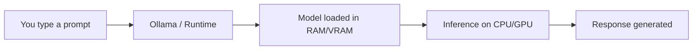

You don't need a cloud subscription or an expensive GPU to use AI in your daily workflow. Open-source models have matured to the point where a regular laptop can run capable AI for coding, writing, image generation, audio transcription, and more — completely free, completely private.

This guide covers everything: how to pick the right model for your hardware, how to set it up, and how to integrate it into your actual workflow.

---

## Table of Contents

- [Why Run AI Locally?](#why-run-ai-locally)
- [How Local AI Models Work](#how-local-ai-models-work-quick-primer)
- [The RAM Budget Rule](#the-ram-budget-rule)
- [Context Window: Why It Matters](#context-window-why-it-matters)
- [Model Recommendations by RAM and Use Case](#model-recommendations-by-ram-and-use-case)
  - [8 GB RAM — The Essentials](#8-gb-ram--the-essentials)
  - [16 GB RAM — The Sweet Spot](#16-gb-ram--the-sweet-spot-for-most-developers)
  - [24 GB RAM — Power User Territory](#24-gb-ram--power-user-territory)
  - [32 GB RAM — Maximum Local AI](#32-gb-ram--maximum-local-ai-experience)
- [Setup Guide: Ollama](#setup-guide-ollama-text-code-vision-models)
- [Setup Guide: Whisper.cpp (Audio)](#setup-guide-whispercpp-audio-transcription)
- [Setup Guide: Piper (Text-to-Speech)](#setup-guide-piper-text-to-speech)
- [Setup Guide: Image Generation](#setup-guide-image-generation-stable-diffusion)
- [What About Video Generation?](#what-about-video-generation)
- [Customizing Models with Modelfile](#customizing-models-with-modelfile)
- [Integrate with VS Code](#integrate-with-vs-code-coding-assistant-setup)
- [Speed Benchmarks: What to Expect](#speed-benchmarks-what-to-expect-on-apple-silicon)
- [Local vs Cloud: Honest Comparison](#local-vs-cloud-honest-comparison)
- [How to Evaluate a Model Yourself](#how-to-evaluate-a-model-yourself)
- [Daily Workflow Examples](#daily-workflow-examples)
- [Quick Reference Table](#quick-reference-best-model-for-each-task)
- [Tips for the Best Experience](#tips-for-the-best-experience)
- [Frequently Asked Questions](#frequently-asked-questions)
- [References](#references)

---

## Why Run AI Locally?

Before diving into models and setup, here's why local AI is worth your time:

- **Zero cost** — no API fees, no subscriptions, no token limits
- **Full privacy** — your code, documents, and data never leave your machine
- **Works offline** — airports, trains, remote locations — no internet needed
- **No rate limits** — run as many queries as your hardware allows
- **Customizable** — fine-tune models, adjust parameters, create custom system prompts

The trade-off is straightforward: local models are smaller and less capable than cloud giants like GPT-4o or Claude. But for 80% of daily tasks — code completions, explaining errors, summarizing documents, generating images — they're more than enough.

---

## How Local AI Models Work (Quick Primer)



When you run a model locally:

1. The **model weights** (a large file, typically 2-20 GB) are loaded into your RAM or GPU memory
2. A **runtime** like [Ollama](https://ollama.com) manages the model, accepts prompts via an API, and returns responses
3. **Inference** (generating the response) happens on your CPU or GPU — Apple Silicon Macs use the unified memory GPU, which is efficient for this

### Key Concept: Quantization

Models come in different **quantization levels** that trade quality for size:

| Quantization | Quality | Size Reduction | When to Use |
|-------------|---------|---------------|-------------|
| **F16** (full) | Best | None (baseline) | Only if you have massive RAM |
| **Q8** | Near-perfect | ~50% smaller | Best quality-to-size ratio |
| **Q6_K** | Excellent | ~58% smaller | Sweet spot for most users |
| **Q4_K_M** | Good | ~70% smaller | Default for most Ollama models |
| **Q3_K** | Acceptable | ~75% smaller | When RAM is very tight |
| **Q2_K** | Degraded | ~80% smaller | Last resort |

Most models on Ollama default to **Q4_K_M** — a good balance. You don't need to worry about this unless you're optimizing for a specific RAM budget.

> **Pro tip**: A bigger model at lower quantization (e.g., 14B at Q3) often outperforms a smaller model at higher quantization (e.g., 7B at Q8). When a model barely fits your RAM, try the next smaller quantization rather than dropping to a smaller model.

---

## The RAM Budget Rule

Not all your RAM is available for AI models. Here's the realistic breakdown:

| Total RAM | OS + Apps Overhead | Available for Models | Practical Model Size Limit |
|-----------|-------------------|---------------------|--------------------------|
| **8 GB** | ~4 GB | ~4 GB | Up to 3B-7B parameter models |
| **16 GB** | ~5 GB | ~11 GB | Up to 7B-14B parameter models |
| **24 GB** | ~6 GB | ~18 GB | Up to 14B-22B parameter models |
| **32 GB** | ~8 GB | ~24 GB | Up to 22B-30B parameter models |

> **Rule of thumb**: The model file size (shown by `ollama list`) should be **at most 80%** of your available RAM. Going beyond that causes memory swapping, which makes inference painfully slow.

---

## Context Window: Why It Matters

The **context window** is how much text a model can "see" at once — your prompt, the conversation history, and the response all share this window. For coding, this is critical:

| Context Size | What It Means | Good For |
|-------------|---------------|----------|
| **4K tokens** | ~3,000 words | Short Q&A, simple completions |
| **8K tokens** | ~6,000 words | Single-file code review, short conversations |
| **32K tokens** | ~24,000 words | Multi-file context, longer conversations |
| **128K tokens** | ~96,000 words | Entire codebase context, long documents |
| **256K tokens** | ~192,000 words | Very large documents, extensive code analysis |

**Important**: [Ollama defaults to 2048 tokens](https://docs.ollama.com/context-length) regardless of what the model supports. You need to explicitly set a larger context:

```bash
# Set context window when running
ollama run qwen3:30b-a3b --num-ctx 32768

# Or in API calls
curl http://localhost:11434/api/generate -d '{
  "model": "qwen3:30b-a3b",
  "prompt": "your prompt here",
  "options": { "num_ctx": 32768 }
}'
```

> **RAM impact**: Larger context windows consume more RAM. On 16 GB, stick to 8K-16K context. On 32 GB, you can comfortably use 32K-64K.

### Context Windows of Popular Models

| Model | Max Context | Default on Ollama |
|-------|------------|-------------------|
| Gemma 4 (all sizes) | 128K-256K | 2048 |
| Qwen3 (all sizes) | 32K-128K | 2048 |
| Qwen3-Coder 30B | 128K | 2048 |
| Llama 3.1 8B | 128K | 2048 |
| Codestral 22B | 32K | 2048 |
| Mistral Small 24B | 128K | 2048 |

Always override the default if you need more context for coding or document analysis.

---


## Model Recommendations by RAM and Use Case

### 8 GB RAM — The Essentials

With 8 GB, you can run one small model at a time. Close unnecessary apps (especially browsers with many tabs) to free up memory.

#### Text & Chat

| Model | Size | Command | Context | Strengths |
|-------|------|---------|---------|-----------|
| **Gemma 4 E2B** | ~7.2 GB | `ollama pull gemma4:e2b` | 128K | Google's latest, vision built-in, tight fit on 8 GB |
| **Gemma 3 4B** | ~3.3 GB | `ollama pull gemma3:4b` | 128K | Efficient small model, good general knowledge |
| **Phi-4 Mini 3.8B** | ~2.5 GB | `ollama pull phi4-mini` | 16K | Microsoft's small model, strong reasoning for its size |
| **Llama 3.2 3B** | ~2 GB | `ollama pull llama3.2:3b` | 128K | Meta's compact model, fast and capable |

#### Coding

| Model | Size | Command | Context | Strengths |
|-------|------|---------|---------|-----------|
| **Qwen2.5-Coder 3B** | ~2 GB | `ollama pull qwen2.5-coder:3b` | 32K | Best small coding model, fill-in-the-middle support |
| **DeepSeek-Coder 1.3B** | ~0.8 GB | `ollama pull deepseek-coder:1.3b` | 16K | Ultra-light, good for autocomplete only |

#### Image Understanding (Vision)

| Model | Size | Command | Strengths |
|-------|------|---------|-----------|
| **Gemma 4 E2B** | ~7.2 GB | `ollama pull gemma4:e2b` | Vision built-in — describe images, read diagrams |
| **MiniCPM-V 3B** | ~2 GB | `ollama pull minicpm-v` | Lighter vision model, works better on 8 GB |

#### Audio (Speech-to-Text)

| Tool | Size | Command | Strengths |
|------|------|---------|-----------|
| **Whisper.cpp (small)** | ~0.5 GB | See [setup below](#setup-guide-whispercpp-audio-transcription) | Fast transcription, decent accuracy |
| **Whisper.cpp (base)** | ~0.15 GB | See [setup below](#setup-guide-whispercpp-audio-transcription) | Ultra-light, basic accuracy |

#### Text-to-Speech

| Tool | Size | Command | Strengths |
|------|------|---------|-----------|
| **Piper** | ~60 MB per voice | See [setup below](#setup-guide-piper-text-to-speech) | Fast neural TTS, runs on CPU, 30+ languages |

> **8 GB verdict**: You can do basic chat, simple code completions, light image understanding, and audio transcription. Don't expect multi-turn complex reasoning or large codebase analysis. Gemma 4 E2B is the most capable option but leaves almost no headroom.

---

### 16 GB RAM — The Sweet Spot for Most Developers

This is where local AI becomes genuinely useful. You can run 7B-14B models comfortably.

#### Text & Chat

| Model | Size | Command | Context | Strengths |
|-------|------|---------|---------|-----------|
| **Gemma 4 E4B** | ~9.6 GB | `ollama pull gemma4` | 128K | Google's latest, vision + text, excellent quality |
| **Gemma 3 12B** | ~8.1 GB | `ollama pull gemma3:12b` | 128K | Excellent general-purpose, multimodal |
| **Llama 3.1 8B** | ~4.7 GB | `ollama pull llama3.1` | 128K | Meta's workhorse, great instruction following |
| **Mistral 7B** | ~4.1 GB | `ollama pull mistral` | 32K | Fast, good at structured output and summarization |
| **Phi-4 14B** | ~9 GB | `ollama pull phi4` | 16K | Microsoft's reasoning model, punches above its weight |

#### Coding

| Model | Size | Command | Context | Strengths |
|-------|------|---------|---------|-----------|
| **Qwen2.5-Coder 7B** | ~4.7 GB | `ollama pull qwen2.5-coder:7b` | 32K | Best coding model at this size, excellent completions |
| **Qwen2.5-Coder 14B** | ~9 GB | `ollama pull qwen2.5-coder:14b` | 32K | Stronger code generation, fits tight on 16 GB |
| **DeepSeek-Coder-V2 Lite 16B** | ~9 GB | `ollama pull deepseek-coder-v2:16b` | 128K | MoE architecture, good at code generation |

#### Image Understanding (Vision)

| Model | Size | Command | Strengths |
|-------|------|---------|-----------|
| **Gemma 4 E4B** | ~9.6 GB | `ollama pull gemma4` | Built-in vision — handles text + images in one model |
| **Gemma 3 12B** | ~8.1 GB | `ollama pull gemma3:12b` | Built-in vision, slightly older but proven |
| **LLaVA 13B** | ~8 GB | `ollama pull llava:13b` | Dedicated vision model, good image analysis |

#### Audio (Speech-to-Text)

| Tool | Size | Command | Strengths |
|------|------|---------|-----------|
| **Whisper.cpp (medium)** | ~1.5 GB | See [setup below](#setup-guide-whispercpp-audio-transcription) | Good accuracy, handles accents well |
| **Whisper.cpp (small)** | ~0.5 GB | See [setup below](#setup-guide-whispercpp-audio-transcription) | Faster, slightly less accurate |

#### Text-to-Speech

| Tool | Size | Command | Strengths |
|------|------|---------|-----------|
| **Piper (medium quality)** | ~60 MB per voice | See [setup below](#setup-guide-piper-text-to-speech) | Natural-sounding, real-time on CPU |

> **16 GB verdict**: This is where local AI becomes a real productivity tool. You get solid coding assistance, good chat, image understanding, and audio transcription. Run one model at a time for best performance.

---

### 24 GB RAM — Power User Territory

You can run larger models and even keep two smaller models loaded simultaneously.

#### Text & Chat

| Model | Size | Command | Context | Strengths |
|-------|------|---------|---------|-----------|
| **Gemma 4 26B (MoE)** | ~18 GB | `ollama pull gemma4:26b` | 256K | Google's latest MoE, vision + text, 256K context |
| **Qwen3 14B** | ~9 GB | `ollama pull qwen3:14b` | 128K | Strong reasoning, supports thinking mode |
| **Gemma 3 27B** | ~17 GB | `ollama pull gemma3:27b` | 128K | Excellent quality, proven multimodal |
| **Mistral Small 24B** | ~14 GB | `ollama pull mistral-small` | 128K | Great at structured tasks, function calling |

#### Coding

| Model | Size | Command | Context | Strengths |
|-------|------|---------|---------|-----------|
| **Codestral 22B** | ~13 GB | `ollama pull codestral` | 32K | Mistral's dedicated coding model, 80+ languages |
| **Qwen2.5-Coder 14B** | ~9 GB | `ollama pull qwen2.5-coder:14b` | 32K | Best dedicated coding model at this tier |
| **DeepSeek-Coder-V2 16B** | ~9 GB | `ollama pull deepseek-coder-v2:16b` | 128K | Good at code generation and explanation |

#### Image Understanding (Vision)

| Model | Size | Command | Strengths |
|-------|------|---------|-----------|
| **Gemma 4 26B** | ~18 GB | `ollama pull gemma4:26b` | Best vision at this tier, 256K context |
| **Gemma 3 27B** | ~17 GB | `ollama pull gemma3:27b` | Built-in vision, excellent quality |

#### Audio (Speech-to-Text)

| Tool | Size | Command | Strengths |
|------|------|---------|-----------|
| **Whisper.cpp (large-v3)** | ~3 GB | See [setup below](#setup-guide-whispercpp-audio-transcription) | Best transcription quality |
| **Whisper.cpp (medium)** | ~1.5 GB | See [setup below](#setup-guide-whispercpp-audio-transcription) | Good balance of speed and accuracy |

#### Text-to-Speech

| Tool | Size | Command | Strengths |
|------|------|---------|-----------|
| **Piper (high quality)** | ~100 MB per voice | See [setup below](#setup-guide-piper-text-to-speech) | Best local TTS quality |

#### Recommended Dual-Model Setup

With 24 GB, you can run a chat model + a small autocomplete model simultaneously:

```bash
# Chat/reasoning model (~14 GB)
ollama pull mistral-small

# Tab-autocomplete model (~4.7 GB)
ollama pull qwen2.5-coder:7b
```

> **24 GB verdict**: You get near-cloud-quality responses for most tasks. The dual-model setup (reasoning + autocomplete) is a game-changer for coding workflows. Gemma 4 26B is the standout pick if you run one model at a time.

---

### 32 GB RAM — Maximum Local AI Experience

This is the best consumer-level experience. You can run the largest open models and multi-model setups.

#### Text & Chat

| Model | Size | Command | Context | Strengths |
|-------|------|---------|---------|-----------|
| **Qwen3 30B-A3B** | ~18 GB | `ollama pull qwen3:30b-a3b` | 128K | MoE — 30B knowledge, 3B inference speed. Best value |
| **Gemma 4 26B (MoE)** | ~18 GB | `ollama pull gemma4:26b` | 256K | Google's latest, vision + text, 256K context |
| **Gemma 4 31B (Dense)** | ~20 GB | `ollama pull gemma4:31b` | 256K | Dense model, highest quality Gemma 4 |
| **Gemma 3 27B** | ~17 GB | `ollama pull gemma3:27b` | 128K | Proven quality, multimodal built-in |
| **Command-R 35B** | ~20 GB | `ollama pull command-r` | 128K | Cohere's model, excellent at RAG and tool use |

#### Coding

| Model | Size | Command | Context | Strengths |
|-------|------|---------|---------|-----------|
| **Qwen3-Coder 30B** | ~19 GB | `ollama pull qwen3-coder` | 128K | Purpose-built for code, agentic workflows, Apache 2.0 |
| **Qwen3 30B-A3B** | ~18 GB | `ollama pull qwen3:30b-a3b` | 128K | Fast MoE with strong code abilities |
| **Codestral 22B** | ~13 GB | `ollama pull codestral` | 32K | Dedicated coding model, 80+ languages |
| **Qwen2.5-Coder 14B** | ~9 GB | `ollama pull qwen2.5-coder:14b` | 32K | Leaves room for a second model |

#### Image Understanding (Vision)

| Model | Size | Command | Strengths |
|-------|------|---------|-----------|
| **Gemma 4 31B** | ~20 GB | `ollama pull gemma4:31b` | Best local vision model, 256K context |
| **Gemma 4 26B** | ~18 GB | `ollama pull gemma4:26b` | MoE variant, faster inference |
| **Llama 3.2 Vision 11B** | ~7 GB | `ollama pull llama3.2-vision` | Good vision, leaves room for other models |

#### Audio (Speech-to-Text)

| Tool | Size | Command | Strengths |
|------|------|---------|-----------|
| **Whisper.cpp (large-v3)** | ~3 GB | See [setup below](#setup-guide-whispercpp-audio-transcription) | Best local transcription quality |

#### Text-to-Speech

| Tool | Size | Command | Strengths |
|------|------|---------|-----------|
| **Piper (high quality)** | ~100 MB per voice | See [setup below](#setup-guide-piper-text-to-speech) | Best local TTS quality, multiple voices |

#### Recommended Multi-Model Setup

```bash
# Primary reasoning/chat (~18 GB)
ollama pull qwen3:30b-a3b

# Tab-autocomplete for coding (~4.7 GB)
ollama pull qwen2.5-coder:7b

# Keep ~9 GB free for OS + apps
```

> **32 GB verdict**: You get a genuinely powerful local AI setup. The Qwen3 30B MoE model is the standout for general use — it has 30B parameters of knowledge but only activates 3B per token, so it runs fast while being remarkably capable. For dedicated coding, Qwen3-Coder 30B is the new king.


---

## Setup Guide: Ollama (Text, Code, Vision Models)

[Ollama](https://ollama.com) is the easiest way to run LLMs locally. It handles model downloading, quantization, and serves an API — all in one tool.

### Step 1: Install Ollama

**macOS:**

```bash
# Download from https://ollama.com/download
# Or via Homebrew:
brew install ollama
```

**Linux:**

```bash
curl -fsSL https://ollama.com/install.sh | sh
```

**Windows:**

Download the installer from [ollama.com/download](https://ollama.com/download).

### Step 2: Pull a Model

```bash
# Example: pull Gemma 4 (default E4B, ~9.6 GB)
ollama pull gemma4

# Example: pull a coding model
ollama pull qwen2.5-coder:7b

# List downloaded models
ollama list
```

### Step 3: Run and Chat

```bash
# Interactive chat
ollama run gemma4

# Ask a coding question
ollama run qwen2.5-coder:7b "Write a Python function to merge two sorted lists"

# Run with larger context window
ollama run qwen3:30b-a3b --num-ctx 32768
```

### Step 4: Verify the API

Ollama exposes a local API at `http://localhost:11434`:

```bash
# Check downloaded models
curl http://localhost:11434/api/tags

# Send a prompt via API
curl http://localhost:11434/api/generate -d '{
  "model": "gemma4",
  "prompt": "Explain Docker networking in 3 sentences",
  "stream": false
}'
```

### Useful Ollama Commands

```bash
ollama list              # Show downloaded models with sizes
ollama ps                # Show currently loaded models in memory
ollama rm <model>        # Delete a model to free disk space
ollama show <model>      # Show model details (size, quantization, context, license)
ollama cp <src> <dest>   # Copy a model (useful for custom Modelfile configs)
ollama pull <model>      # Download or update a model
```

---

## Setup Guide: Whisper.cpp (Audio Transcription)

[Whisper.cpp](https://github.com/ggerganov/whisper.cpp) runs OpenAI's Whisper speech-to-text model locally using optimized C++ code. It's fast on Apple Silicon and modern CPUs.

### Install and Run

```bash
# Install via Homebrew (macOS)
brew install whisper-cpp

# Download a model (choose by your RAM)
# Base (~0.15 GB) — fastest, basic accuracy, for 8 GB RAM
whisper-cpp-download-ggml-model base

# Small (~0.5 GB) — fast, good for 8-16 GB RAM
whisper-cpp-download-ggml-model small

# Medium (~1.5 GB) — balanced, good for 16-24 GB RAM
whisper-cpp-download-ggml-model medium

# Large-v3 (~3 GB) — best quality, for 24-32 GB RAM
whisper-cpp-download-ggml-model large-v3

# Transcribe an audio file
whisper-cpp -m ~/.local/share/whisper-cpp/ggml-medium.bin -f recording.wav

# Transcribe with SRT subtitles
whisper-cpp -m ~/.local/share/whisper-cpp/ggml-medium.bin -f meeting.wav --output-srt

# Transcribe with timestamps (plain text)
whisper-cpp -m ~/.local/share/whisper-cpp/ggml-medium.bin -f meeting.wav --output-txt
```

### Supported Audio Formats

Whisper.cpp works best with **16-bit WAV at 16 kHz**. Convert other formats first:

```bash
# Convert MP3 to WAV using ffmpeg
ffmpeg -i input.mp3 -ar 16000 -ac 1 -c:a pcm_s16le output.wav

# Convert M4A (iPhone recording) to WAV
ffmpeg -i voice-memo.m4a -ar 16000 -ac 1 -c:a pcm_s16le output.wav
```

### Whisper Model Comparison

| Model | Size | Speed (1 min audio) | Accuracy | Best For |
|-------|------|-------------------|----------|----------|
| **base** | 150 MB | ~3 sec | Basic | Quick notes, clear speech |
| **small** | 500 MB | ~8 sec | Good | Meetings, podcasts |
| **medium** | 1.5 GB | ~15 sec | Very good | Accented speech, noisy audio |
| **large-v3** | 3 GB | ~30 sec | Excellent | Professional transcription |

*Speed estimates on Apple M2, will vary by hardware.*

---

## Setup Guide: Piper (Text-to-Speech)

[Piper](https://github.com/OHF-Voice/piper1-gpl) is a fast, local neural text-to-speech engine. It runs entirely on CPU, needs minimal RAM (~60-100 MB per voice), and supports 30+ languages.

### Install and Run

```bash
# Install via pip
pip install piper-tts

# List available voices
piper --list-voices

# Generate speech (downloads voice model automatically on first use)
echo "Hello, this is a test of local text to speech." | \
  piper --model en_US-lessac-medium --output_file output.wav

# Play directly (macOS)
echo "The build failed with 3 errors." | \
  piper --model en_US-lessac-medium --output_raw | \
  afplay -f wav -

# Use a high-quality voice
echo "Your deployment is complete." | \
  piper --model en_US-lessac-high --output_file output.wav
```

### Use Cases for Local TTS

- **Accessibility** — screen reader alternative for your own tools
- **Content creation** — narrate blog posts or documentation
- **Notifications** — audio alerts from CI/CD pipelines or monitoring
- **Language learning** — hear pronunciation in 30+ languages
- **Proofreading** — hearing your writing read aloud catches errors your eyes miss

---

## Setup Guide: Image Generation (Stable Diffusion)

For generating images locally, use **Stable Diffusion** via tools optimized for your hardware.

### On macOS (Apple Silicon)

[Draw Things](https://drawthings.ai) is a free, native macOS/iOS app that runs Stable Diffusion models efficiently on Apple Silicon:

- Download from the Mac App Store (free)
- Built-in model browser — download SDXL, SD 1.5, or FLUX models
- Uses Metal GPU acceleration — fast on M1/M2/M3/M4 chips
- No terminal setup needed

### On Linux/Windows

Use [ComfyUI](https://github.com/comfyanonymous/ComfyUI) or [Stable Diffusion WebUI (Automatic1111)](https://github.com/AUTOMATIC1111/stable-diffusion-webui):

```bash
# ComfyUI (recommended — node-based, flexible)
git clone https://github.com/comfyanonymous/ComfyUI.git
cd ComfyUI
pip install -r requirements.txt
python main.py
# Open http://localhost:8188 in your browser
```

### Image Model Recommendations by RAM

| RAM | Model | Size | Quality | Generation Time |
|-----|-------|------|---------|----------------|
| **8 GB** | SD 1.5 | ~2 GB | Basic, 512x512 | ~10-20 sec |
| **16 GB** | SDXL | ~6.5 GB | Good, 1024x1024 | ~15-30 sec |
| **24 GB** | SDXL + refiner | ~12 GB | High quality with refinement | ~30-60 sec |
| **32 GB** | FLUX.1-dev | ~12 GB | State-of-the-art, best prompt adherence | ~20-40 sec |

*Times estimated on Apple M2 Pro. NVIDIA GPUs are typically 2-3x faster for image generation.*

---

## What About Video Generation?

**Short answer: not practical locally yet.**

Video generation models like Sora, Runway Gen-3, and Kling require massive GPU memory (48+ GB VRAM) and take minutes to hours per clip even on high-end hardware. The smallest usable open-source video models (like CogVideoX) need at minimum 24 GB of dedicated GPU VRAM — not unified RAM.

If you need AI video generation, cloud services are currently the only practical option. This will likely change in 2-3 years as models get more efficient, but for now, focus your local setup on text, code, images, and audio.

---

## Customizing Models with Modelfile

Ollama's [Modelfile](https://github.com/ollama/ollama/blob/main/docs/modelfile.md) lets you create custom model configurations — set system prompts, adjust temperature, change context length, and more. This is powerful for creating specialized assistants.

### Example: Custom Coding Assistant

Create a file called `Modelfile.coding`:

```dockerfile
FROM qwen2.5-coder:14b

# Set a larger context window for code
PARAMETER num_ctx 32768

# Lower temperature for more deterministic code output
PARAMETER temperature 0.3

# System prompt for coding assistance
SYSTEM """You are an expert software engineer. You write clean, well-documented,
production-ready code. You follow best practices for the language being used.
When reviewing code, you focus on bugs, security issues, and performance.
Always explain your reasoning briefly."""
```

Build and run it:

```bash
# Create the custom model
ollama create coding-assistant -f Modelfile.coding

# Use it
ollama run coding-assistant "Review this function for bugs: ..."
```

### Example: Document Summarizer

```dockerfile
FROM gemma4

PARAMETER num_ctx 65536
PARAMETER temperature 0.2

SYSTEM """You are a document analysis assistant. When given text, you:
1. Provide a concise summary (3-5 sentences)
2. List key points as bullet points
3. Identify any action items or decisions
Be concise and factual. Never add information not present in the source."""
```

### Example: Creative Writing Helper

```dockerfile
FROM qwen3:30b-a3b

PARAMETER temperature 0.8
PARAMETER top_p 0.9
PARAMETER num_ctx 16384

SYSTEM """You are a creative writing assistant. You help with brainstorming,
drafting, and editing. Your suggestions are vivid and original. You match
the tone and style the user is going for."""
```


---

## Integrate with VS Code: Coding Assistant Setup

The real power of local AI comes when it's integrated into your editor. Here's how to set up a full coding assistant experience in VS Code.

### Option 1: Continue (Recommended)

[Continue](https://continue.dev) is the most popular open-source AI coding extension. It supports Ollama natively.

**Install:**

1. Open VS Code → Extensions → Search "Continue" → Install
2. Click the Continue icon in the sidebar → Settings (gear icon)
3. Edit the config:

```yaml
models:
  - name: Gemma 4
    provider: ollama
    model: gemma4
    apiBase: http://localhost:11434

  - name: Qwen3-Coder 30B
    provider: ollama
    model: qwen3-coder
    apiBase: http://localhost:11434

  - name: Qwen2.5 Coder 14B
    provider: ollama
    model: qwen2.5-coder:14b
    apiBase: http://localhost:11434

tabAutocompleteModel:
  provider: ollama
  model: qwen2.5-coder:7b
  apiBase: http://localhost:11434
```

**What you get:**

- **Sidebar chat** — ask questions about your code, get explanations, generate functions
- **Inline editing** — select code, press `Ctrl+I` / `Cmd+I`, describe the change
- **Tab autocomplete** — code completions as you type (uses the smaller model)
- **Context awareness** — reference files with `@file`, codebase with `@codebase`
- **Document analysis** — drag PDFs or docs into the chat for summarization and Q&A

### Option 2: Cody (Sourcegraph)

[Cody](https://sourcegraph.com/cody) also supports Ollama as a backend:

1. Install the Cody extension in VS Code
2. In VS Code settings, search for "Cody Ollama"
3. Set the Ollama endpoint: `http://localhost:11434`
4. Select your model

### Option 3: Open WebUI (Browser-Based Chat)

For a ChatGPT-like interface that connects to your local models:

```bash
# Run with Docker
docker run -d -p 3000:8080 \
  --add-host=host.docker.internal:host-gateway \
  -v open-webui:/app/backend/data \
  --name open-webui \
  ghcr.io/open-webui/open-webui:main
```

Open `http://localhost:3000` — it auto-detects all your Ollama models. Great for:

- Longer conversations with full chat history
- **Document analysis** — upload PDFs, Word docs, or text files and ask questions about them
- Sharing with team members on your local network
- Comparing responses from different models side-by-side

---

## Speed Benchmarks: What to Expect on Apple Silicon

Speed is measured in **tokens per second (tok/s)**. For reference, comfortable reading speed is about 4-5 tok/s, and fast typing speed is about 2 tok/s. Anything above 10 tok/s feels instant.

### Approximate Generation Speed (tok/s)

| Model | M1 (8 GB) | M1 Pro (16 GB) | M2 Pro (16 GB) | M3 Pro (18 GB) | M4 Pro (24 GB) | M4 Max (32+ GB) |
|-------|-----------|----------------|----------------|----------------|----------------|-----------------|
| **Gemma 3 4B** | ~25 | ~35 | ~40 | ~45 | ~55 | ~70 |
| **Llama 3.1 8B** | — | ~20 | ~25 | ~30 | ~40 | ~50 |
| **Gemma 4 E4B** | — | ~15 | ~20 | ~25 | ~35 | ~45 |
| **Qwen2.5-Coder 14B** | — | ~8 | ~12 | ~15 | ~22 | ~30 |
| **Codestral 22B** | — | — | — | ~8 | ~15 | ~22 |
| **Qwen3 30B-A3B (MoE)** | — | — | — | — | ~18 | ~30 |
| **Gemma 4 26B (MoE)** | — | — | — | — | ~15 | ~25 |

*"—" means the model doesn't fit comfortably in that RAM tier. Values are approximate and vary by prompt length, context size, and quantization. Based on community benchmarks from [tps.sh](https://tps.sh) and various Apple Silicon LLM benchmark reports.*

> **Key insight**: MoE models (Qwen3 30B-A3B, Gemma 4 26B) are significantly faster than dense models of similar total parameter count because they only activate a fraction of parameters per token. A 30B MoE model can be faster than a 14B dense model.

### Intel/AMD Comparison

On Intel/AMD laptops without a dedicated GPU, expect roughly **3-5x slower** speeds than Apple Silicon with the same RAM. This is because Apple's unified memory architecture lets the GPU access all RAM directly, while Intel/AMD systems run inference on CPU only (unless you have an NVIDIA GPU).

---

## Local vs Cloud: Honest Comparison

| Factor | Local (Ollama) | Cloud (ChatGPT, Claude, etc.) |
|--------|---------------|-------------------------------|
| **Cost** | Free forever | $20-200/month or per-token pricing |
| **Privacy** | 100% — data never leaves your machine | Data sent to provider servers |
| **Speed** | 10-50 tok/s (depends on hardware) | 50-150 tok/s typically |
| **Quality (simple tasks)** | 90-95% of cloud quality | Baseline |
| **Quality (complex reasoning)** | 60-75% of cloud quality | Baseline |
| **Context window (practical)** | 8K-64K (limited by RAM) | 128K-200K |
| **Offline** | Yes | No |
| **Rate limits** | None | Yes (varies by plan) |
| **Multi-modal** | Text, images, audio | Text, images, audio, video, web |
| **Tool use / agents** | Basic (improving rapidly) | Advanced |
| **Setup effort** | 10-30 minutes | Sign up and go |

**When to use local**: Routine coding tasks, code completions, quick Q&A, document summarization, privacy-sensitive work, offline scenarios, avoiding subscription costs.

**When to use cloud**: Complex multi-step reasoning, large codebase refactoring, cutting-edge capabilities, when you need the absolute best quality, agent workflows with many tools.

**Best approach**: Use both. Local for the 80% of routine tasks, cloud for the 20% that needs maximum capability.

---

## How to Evaluate a Model Yourself

Don't just trust benchmark leaderboards — test models against your actual use cases. Here's a practical evaluation framework:

### Step 1: Define Your Test Prompts

Create 5-10 prompts that represent your real work:

```bash
# Save test prompts to a file
cat > test-prompts.txt << 'EOF'
1. Explain what this TypeScript function does: [paste a real function from your codebase]
2. Write a SQL query to find the top 10 users by activity in the last 30 days
3. Review this code for security issues: [paste real code]
4. Convert this Python script to TypeScript: [paste real code]
5. Summarize this error log and suggest fixes: [paste real error output]
EOF
```

### Step 2: Run Each Model

```bash
# Test model A
ollama run gemma4 "your test prompt here"

# Test model B
ollama run qwen3:30b-a3b "your test prompt here"

# Compare side-by-side in Open WebUI for easier comparison
```

### Step 3: Score on What Matters to You

Rate each model 1-5 on:

- **Correctness** — Is the output factually/technically correct?
- **Relevance** — Does it answer what you actually asked?
- **Speed** — Is it fast enough for interactive use?
- **Code quality** — Is generated code clean, idiomatic, and working?
- **Instruction following** — Does it follow your format/style requirements?

### Step 4: Check Resource Usage

```bash
# While a model is running, check memory usage
ollama ps

# On macOS, check system memory pressure
memory_pressure

# Or use Activity Monitor → Memory tab
```

> **Practical tip**: The "best" model is the one that gives you good-enough results at a speed you find comfortable. A slightly less capable model that responds in 2 seconds is often more useful than a better model that takes 10 seconds.

---

## Daily Workflow Examples

Here's how local AI fits into a real developer's day:

### Morning: Code Review Help

In VS Code with Continue, select a function and press `Cmd+I`:

> "Review this for bugs, edge cases, and potential null pointer issues"

Or in the sidebar chat:

> "Explain what this function does and suggest improvements. @file:src/utils/auth.ts"

### Midday: Write Documentation

```bash
ollama run qwen3:30b-a3b "Write a README section explaining how to set up
the development environment for a Next.js project with Supabase"
```

### Afternoon: Debug an Error

Paste the error in Continue's sidebar chat:

> "I'm getting this error: TypeError: Cannot read properties of undefined (reading 'map'). Here's the relevant code: @file:components/RecipeList.tsx"

### Late Afternoon: Summarize a PDF

Open [Open WebUI](http://localhost:3000), upload a PDF specification document, and ask:

> "Summarize the key requirements from this document. List any breaking changes from the previous version."

### Evening: Transcribe a Meeting

```bash
# Convert the recording
ffmpeg -i meeting.m4a -ar 16000 -ac 1 -c:a pcm_s16le meeting.wav

# Transcribe with timestamps
whisper-cpp -m ~/.local/share/whisper-cpp/ggml-medium.bin \
  -f meeting.wav --output-srt
```

### Weekend: Generate Blog Post Images

Open Draw Things (macOS) or ComfyUI → type a prompt → get an image for your blog post. No cloud API costs.

---

## Quick Reference: Best Model for Each Task

| Task | 8 GB | 16 GB | 24 GB | 32 GB |
|------|------|-------|-------|-------|
| **General chat** | Gemma 3 4B | Gemma 4 E4B | Gemma 4 26B | Qwen3 30B-A3B |
| **Coding (chat)** | Qwen2.5-Coder 3B | Qwen2.5-Coder 7B | Codestral 22B | Qwen3-Coder 30B |
| **Tab autocomplete** | DeepSeek-Coder 1.3B | Qwen2.5-Coder 7B | Qwen2.5-Coder 7B | Qwen2.5-Coder 7B |
| **Image understanding** | MiniCPM-V 3B | Gemma 4 E4B | Gemma 4 26B | Gemma 4 31B |
| **Audio transcription** | Whisper small | Whisper medium | Whisper large-v3 | Whisper large-v3 |
| **Text-to-speech** | Piper medium | Piper medium | Piper high | Piper high |
| **Image generation** | SD 1.5 | SDXL | SDXL + refiner | FLUX.1-dev |
| **Summarization** | Phi-4 Mini | Mistral 7B | Mistral Small 24B | Qwen3 30B-A3B |
| **Translation** | Gemma 3 4B | Gemma 4 E4B | Gemma 4 26B | Gemma 4 31B |
| **Document/PDF analysis** | — | Gemma 4 E4B + Open WebUI | Gemma 4 26B + Open WebUI | Qwen3 30B-A3B + Open WebUI |

---

## Tips for the Best Experience

1. **Close unnecessary apps** before running models — browsers with many tabs are RAM-hungry
2. **Use one model at a time** on 8-16 GB RAM — Ollama keeps models loaded in memory
3. **Set `OLLAMA_MAX_LOADED_MODELS=1`** if you're tight on RAM — forces unloading before loading a new model
4. **Override the default context window** — Ollama defaults to 2048 tokens, which is too small for most coding tasks. Use `--num-ctx 16384` or higher
5. **Apple Silicon users**: your GPU shares RAM — this is actually an advantage since Ollama uses the GPU automatically
6. **Check model size before pulling**: `ollama show <model>` shows the actual size, quantization, and license
7. **SSD matters**: models load from disk on first use — an SSD makes this near-instant vs. minutes on HDD
8. **Create custom Modelfiles** for your common tasks — a coding assistant with the right system prompt and temperature is noticeably better than the default
9. **Use Open WebUI for document analysis** — upload PDFs, Word docs, or text files and chat about them
10. **Keep Ollama updated** — new versions regularly add performance improvements and new model support (`brew upgrade ollama`)

---

## Frequently Asked Questions

### Can local models replace ChatGPT/Claude?

For simple tasks (code completions, explanations, summaries, quick questions) — yes, absolutely. For complex multi-step reasoning, large codebase analysis, or cutting-edge capabilities — cloud models still have a significant edge. The best approach is using local models for routine work and cloud models for complex tasks.

### Is Apple Silicon better than Intel/AMD for local AI?

Yes, significantly. Apple Silicon's unified memory architecture means the GPU can access all your RAM directly, without the bottleneck of copying data between CPU and GPU memory. An M1 with 16 GB outperforms most Intel laptops with 32 GB for AI inference. [Research from Apple](https://arxiv.org/html/2601.19139v1) demonstrates throughput of up to 525 tokens per second on M4 Max with optimized frameworks.

### How much disk space do I need?

Budget about 5-30 GB per model. A typical setup with 2-3 models needs 20-50 GB of free disk space. Models are stored in `~/.ollama/models/`.

### How fast are local models?

On Apple Silicon, expect 15-50 tokens per second for most models — fast enough for interactive use. MoE models (like Qwen3 30B-A3B) are particularly fast because they only activate a fraction of their parameters per token. On Intel/AMD without a GPU, expect 3-10 tok/s, which is usable but noticeably slower. See the [speed benchmarks section](#speed-benchmarks-what-to-expect-on-apple-silicon) for detailed numbers.

### Can I use these models commercially?

Most models listed here have permissive licenses. Notable details:
- **Gemma 4**: [Gemma license](https://ai.google.dev/gemma/terms) — free for commercial use, redistribution allowed
- **Qwen3 / Qwen3-Coder**: Apache 2.0 — fully open for commercial use
- **Llama models**: Meta's community license — free for commercial use under 700M monthly active users
- **Codestral**: Mistral Non-Production License (MNPL) — check before commercial use
- **FLUX.1-dev**: Non-commercial license (use FLUX.1-schnell for commercial)
- **Whisper**: MIT license — fully open
- **Piper**: GPL 3.0 — open source, check implications for your use case

Always check the specific model's license on its [Ollama library page](https://ollama.com/library) or Hugging Face page.

### Do I need a GPU?

No. All models listed here run on CPU. However, Apple Silicon Macs and NVIDIA GPUs accelerate inference significantly (2-5x faster). AMD GPUs have partial support via ROCm on Linux.

### Can I run multiple models at the same time?

Yes, Ollama can keep multiple models loaded. But each model consumes RAM while loaded. On 32 GB, you can comfortably run a chat model + an autocomplete model. On 16 GB or less, stick to one model at a time. Use `ollama ps` to see what's loaded and `OLLAMA_MAX_LOADED_MODELS=1` to limit it.

### How do I use local AI for PDF/document analysis?

The easiest way is [Open WebUI](https://github.com/open-webui/open-webui). Run it with Docker, connect it to your Ollama instance, and you can upload PDFs, Word documents, and text files directly in the chat interface. The tool extracts text from documents and feeds it to your local model for summarization, Q&A, and analysis.

---

## References

- [Ollama Official Site](https://ollama.com) — Model library and downloads
- [Ollama Model Library](https://ollama.com/library) — Browse all available models with sizes and context windows
- [Ollama Context Length Documentation](https://docs.ollama.com/context-length) — How to configure context windows
- [Ollama Modelfile Documentation](https://github.com/ollama/ollama/blob/main/docs/modelfile.md) — Custom model configuration
- [Continue.dev](https://continue.dev) — Open-source AI coding extension for VS Code
- [Whisper.cpp](https://github.com/ggerganov/whisper.cpp) — Local speech-to-text
- [Piper TTS](https://github.com/OHF-Voice/piper1-gpl) — Local neural text-to-speech
- [ComfyUI](https://github.com/comfyanonymous/ComfyUI) — Local image generation
- [Draw Things](https://drawthings.ai) — macOS native image generation
- [Open WebUI](https://github.com/open-webui/open-webui) — Self-hosted ChatGPT-like interface with document upload
- [Hugging Face Open LLM Leaderboard](https://huggingface.co/spaces/open-llm-leaderboard/open_llm_leaderboard) — Model benchmarks and comparisons
- [tps.sh](https://tps.sh) — Community tokens-per-second benchmarks
- [Apple Silicon LLM Inference Research](https://arxiv.org/html/2601.19139v1) — Native inference performance on Apple Silicon