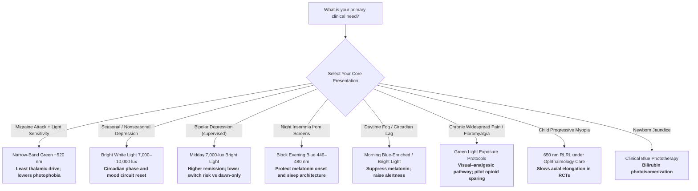

## Why Modern Science is Studying Color and Light

Across civilizations—from Egyptian solar temples and Ayurvedic *varna chikitsa* to Victorian chromotherapy clinics—healers have claimed that colored light and pigmented environments can alter mood, pain, sleep, and disease course.

To a rational reader, many historical claims (that specific hues "balance chakras," "charge the aura," or cure infection by colored water) sound esoteric and unfalsifiable. Over the past three decades, however, retinal neurobiologists, chronobiologists, headache neurologists, and psychiatrists equipped with **electroretinography (ERG)**, **visual evoked potentials (VEP)**, **plasma melatonin assays**, **high-density EEG**, **thalamic multi-unit recordings**, and **randomized controlled trials** have isolated what actually happens when wavelength-specific light enters the human eye.

The clinical findings demonstrate that color and light are **photobiological interventions**—not mystical pigments—with measurable effects across multiple physiological systems:

- **Melanopsin Circadian Photoreception:** Short-wavelength blue light (~446–477 nm) activates intrinsically photosensitive retinal ganglion cells (ipRGCs), suppressing pineal melatonin in a dose-dependent manner and resetting the hypothalamic suprachiasmatic nucleus (SCN) circadian pacemaker.
- **Cone-Driven Migraine Photophobia:** Narrow-band green light (~520 nm) activates cone and thalamic pathways *less* than blue, amber, or red, and clinical trials show substantial reductions in monthly migraine headache days.
- **Bright White Light Antidepressant Effects:** High-illuminance bright light therapy (BLT; typically 7,000–10,000 lux) produces statistically significant remission rates in seasonal and nonseasonal depressive disorders.
- **Red-Light Photobiomodulation:** Near-red wavelengths (~650–850 nm) are absorbed by mitochondrial cytochrome *c* oxidase, altering cellular redox signaling; repeated low-level red-light (RLRL) protocols measurably slow pediatric myopia progression.
- **Blue-Light Photochemistry in Neonates:** Blue-spectrum phototherapy isomerizes unconjugated bilirubin, remaining a first-line treatment for neonatal hyperbilirubinemia.

This guide reviews peer-reviewed medical and neuroscience research on color and light therapy: the biological mechanisms through which wavelength alters the human body, measured clinical biomarkers, practical usefulness, and the specific diseases evaluated in controlled trials. Esoteric chromotherapy claims without photoreceptor or clinical evidence are excluded.

> [!IMPORTANT]
> **Clinical & Medical Context:** Wavelength-specific light exposure and environmental color design are **complementary, non-pharmacological interventions** with strong evidence in selected domains (circadian sleep disruption, migraine photophobia, major depression, neonatal jaundice, myopia control). They should **never** replace emergency care, psychiatric crisis management, or disease-modifying medical therapy. Traditional "aura-balancing" chromotherapy and colored-water ingestion are **not** medically validated. Always consult a licensed clinician for diagnosis and treatment planning—especially before using bright light therapy in bipolar spectrum illness (risk of mood polarity switch if poorly timed).

---

## Table of Contents

- [Why Modern Science is Studying Color and Light](#why-modern-science-is-studying-color-and-light)
- [Clinical Disease-to-Color Directory: Medical Conditions Studied](#clinical-disease-to-color-directory-medical-conditions-studied)
- [Quick-Start Decision Matrix: Which Color or Light Protocol?](#quick-start-decision-matrix-which-color-or-light-protocol)
- [The Photobiological Engine: How Color Alters Human Physiology](#the-photobiological-engine-how-color-alters-human-physiology)
  - [1. Melanopsin, ipRGCs, and the Circadian Clock](#1-melanopsin-iprgcs-and-the-circadian-clock)
  - [2. Cone Pathways, Thalamus, and Color-Selective Migraine Photophobia](#2-cone-pathways-thalamus-and-color-selective-migraine-photophobia)
  - [3. Green-Light Analgesia and Enkephalinergic Circuits](#3-green-light-analgesia-and-enkephalinergic-circuits)
  - [4. Bright Light Therapy and Mood Circuits](#4-bright-light-therapy-and-mood-circuits)
  - [5. Red-Light Photobiomodulation and Mitochondrial Signaling](#5-red-light-photobiomodulation-and-mitochondrial-signaling)
  - [6. Blue-Light Photochemistry: Neonatal Bilirubin Isomerization](#6-blue-light-photochemistry-neonatal-bilirubin-isomerization)
  - [7. Color Psychology vs. True Photobiology](#7-color-psychology-vs-true-photobiology)
- [Wavelength-by-Wavelength Clinical Breakdown](#wavelength-by-wavelength-clinical-breakdown)
  - [Narrow-Band Green (~520 nm)](#narrow-band-green-520-nm)
  - [Short-Wavelength Blue (~446–480 nm)](#short-wavelength-blue-446480-nm)
  - [Bright Broad-Spectrum White (7,000–10,000 lux)](#bright-broad-spectrum-white-700010000-lux)
  - [Red / Near-Infrared (~650–850 nm)](#red--near-infrared-650850-nm)
  - [Ambient Environmental Color (Walls, Screens, Interiors)](#ambient-environmental-color-walls-screens-interiors)
- [What Traditional Chromotherapy Gets Wrong](#what-traditional-chromotherapy-gets-wrong)
- [Practical Protocols: Evidence-Based Use of Color and Light](#practical-protocols-evidence-based-use-of-color-and-light)
- [Frequently Asked Questions (FAQ)](#frequently-asked-questions-faq)
- [References and Verified Clinical Studies](#references-and-verified-clinical-studies)

---

## Clinical Disease-to-Color Directory: Medical Conditions Studied

The table below catalogs clinical conditions evaluated with wavelength-specific or illuminance-specific light interventions in peer-reviewed trials and mechanistic studies:

| Medical Condition / Clinical Domain | Evaluated Color / Light Protocol | Physiological Mechanism in the Body | Key Scientific Finding & Quantitative Outcome | Clinical Usefulness & Application | Primary Study Citation |
| :--- | :--- | :--- | :--- | :--- | :--- |
| **Migraine Photophobia & Ictal Headache** | Narrow-band green light (~520 nm); avoid blue/red/white glare | Cone-driven retinal pathways and dura-sensitive thalamic neurons respond least to green | Green exacerbates migraine **significantly less** than white, blue, amber, or red; thalamic neurons least responsive to green | Acute migraine photophobia relief; lamp/goggle protocols during attacks | [Noseda et al., 2016](https://doi.org/10.1093/brain/aww119) |
| **Episodic & Chronic Migraine Frequency** | Daily 1–2 h green LED exposure for 10 weeks | Reduced photic drive of trigeminovascular pathways; secondary QoL gains | Headache days dropped from **7.9 → 2.4** (episodic) and **22.3 → 9.4** (chronic) | Non-pharmacological adjunct for migraine prevention/support | [Martin et al., 2021](https://doi.org/10.1177/0333102420956711) |
| **Real-World Migraine Attacks (Anxiety, Sleep, Photophobia)** | 2 h narrow-band green lamp during ictal phase | Concurrent relief of pain, photophobia, and attack-linked anxiety | Headache improved in **55%** of 3,232 attacks; **61%** responders (≥50% of attacks improved) | At-home ictal support; open-label evidence pending large RCTs | [Lipton et al., 2023](https://doi.org/10.3389/fneur.2023.1282236) |
| **Generalized Anxiety Disorder (GAD) Psychotherapy Adjunct** | Psychotherapy under narrow-band green vs. white room light | Reduced anxiety physiology independent of migraine status | Sessions under green light increased positive / decreased negative affect more than white light ($\chi^2$, $p = 0.0001$) | Ambient lighting adjunct during CBT/psychotherapy | [Melo-Carrillo et al., 2023](https://doi.org/10.2147/PRBM.S388042) |
| **Fibromyalgia Pain & Opioid Burden** | Green light–based eyewear analgesia (pilot) | Putative visual–analgesic pathway; feasibility for opioid sparing | **33%** of green-eyeglass users achieved ≥10% decline in oral morphine equivalents (vs. 11% blue, 8% clear) | Pilot complementary analgesia; larger efficacy trials needed | [Nelli et al., 2023](https://doi.org/10.36076/ppj.2023.26.403) |
| **Experimental / Inflammatory Pain (Preclinical)** | Full-field green light ~10 lux | Cone → ventrolateral geniculate → enkephalinergic analgesia | Green light produced analgesia; blocked by ablating cones or inhibiting vLGN *Penk* neurons | Mechanistic substrate for clinical green-light analgesia | [Tang et al., 2022](https://doi.org/10.1126/scitranslmed.abq6474) |
| **Seasonal & Nonseasonal Major Depression** | Bright light therapy (typically ~7,000–10,000 lux white light) | Circadian phase alignment; monoaminergic and SCN-linked mood circuits | Meta-analysis: remission **40.7%** BLT vs. lower control rates; OR for early remission 3.59 | First-line for SAD; adjunct for nonseasonal depression | [Menegaz de Almeida et al., 2025](https://doi.org/10.1001/jamapsychiatry.2024.4480) |
| **Bipolar Depression (Adjunctive Midday BLT)** | 7,000-lux bright white vs. 50-lux dim red placebo | Midday timing reduces mania-switch risk vs. early dawn protocols | Remission **68.2%** vs. **22.2%** placebo (adjusted OR 12.6) at weeks 4–6 | Adjunct under psychiatric supervision | [Sit et al., 2018](https://doi.org/10.1176/appi.ajp.2017.16101200) |
| **Circadian Sleep Disruption & Melatonin Suppression** | Evening blue LED (~469 nm peak) | ipRGC → SCN → pineal melatonin inhibition | Dose-dependent plasma melatonin suppression by blue LED light | Avoid evening blue; use for daytime alertness if needed | [West et al., 2011](https://doi.org/10.1152/japplphysiol.01413.2009) |
| **Nighttime Smartphone Sleep & Cognitive Errors** | Blue-light vs. filtered smartphone, crossover RCT | Melatonin timing, alertness, and commission-error risk | Blue smartphones decreased sleepiness and increased commission errors; delayed DLMO 50% timing | Night filter / night-shift hygiene protocols | [Heo et al., 2017](https://doi.org/10.1016/j.jpsychires.2016.12.010) |
| **Pediatric Progressive Myopia** | Repeated low-level red light (650 nm) desktop therapy | Ocular axial growth modulation via photobiomodulation | Multicenter RCT: RLRL slowed myopia progression vs. spectacles alone | Ophthalmologist-supervised myopia control | [Jiang et al., 2022](https://doi.org/10.1016/j.ophtha.2021.11.023) |
| **Neonatal Hyperbilirubinemia (Jaundice)** | Blue-spectrum phototherapy | Photoisomerization of unconjugated bilirubin to excretable isomers | Standard-of-care reduction of serum bilirubin; prevents kernicterus risk | Neonatal ICU / pediatric first-line phototherapy | [Maisels & McDonagh, 2008](https://doi.org/10.1056/NEJMct0708376) |

---

## Quick-Start Decision Matrix: Which Color or Light Protocol?



### At-a-Glance Recommendation Table

| Clinical Goal / State | Wavelength / Illuminance | Timing | Session Parameters | Expected Physiological Response |
| :--- | :--- | :--- | :--- | :--- |
| **Abort migraine photophobia** | Narrow-band green ~520 nm | During attack | ~1–2 hours; dim intensity preferred | Lower cone/thalamic drive; reduced pain and light aversion |
| **Reduce monthly migraine days** | Green LED daily | Consistent daily window | 1–2 h/day × ~10 weeks (trial protocol) | Fewer headache days; improved QoL scores |
| **Lift nonseasonal depression** | Bright white ~7,000–10,000 lux | Morning (typical) or midday (bipolar protocols) | 30–60 min daily × 2–6+ weeks | Higher remission/response vs. control in meta-analyses |
| **Protect night sleep** | Eliminate/filter blue 446–480 nm | 2–3 h before bed | Phone night mode, amber bulbs, blackout | Earlier melatonin onset; less alertness at night |
| **Boost morning alertness** | Blue-enriched or bright white | Within 1 h of waking | 20–30 min | Melatonin suppression; SCN phase advance |
| **Support myopia control (kids)** | Red 650 nm RLRL device | Per ophthalmology protocol | Short repeated daily sessions | Slower spherical equivalent progression |

---

## The Photobiological Engine: How Color Alters Human Physiology

```
                  ┌────────────────────────────────────────────────────────┐
                  │     WAVELENGTH-SPECIFIC LIGHT (Photons → Retina)       │
                  └───────────────────────────┬────────────────────────────┘
                                              │
             ┌────────────────────────────────┼──────────────────────────────┐
             ▼                                ▼                              ▼
┌───────────────────────────┐    ┌───────────────────────────┐   ┌───────────────────────────┐
│   CIRCADIAN / ENDOCRINE   │    │   SENSORY–THALAMIC &      │   │   CELLULAR / MITOCHONDRIAL│
│                           │    │   TRIGEMINOVASCULAR       │   │                           │
├───────────────────────────┤    ├───────────────────────────┤   ├───────────────────────────┤
│ • Melanopsin ipRGCs       │    │ • Cone ERG / VEP signals  │   │ • Cytochrome c oxidase    │
│   (~460–480 nm peak)      │    │ • Dura-light thalamic     │   │   absorbs red/NIR         │
│ • SCN clock resetting     │    │   neurons (migraine)      │   │ • Redox & NO signaling    │
│ • Pineal melatonin gate   │    │ • Green least excitatory  │   │ • Tissue repair / ocular  │
└───────────────────────────┘    └───────────────────────────┘   └───────────────────────────┘
```

### 1. Melanopsin, ipRGCs, and the Circadian Clock

In 2002, Berson and colleagues demonstrated that a subset of retinal ganglion cells remains photosensitive even without rods and cones, using the photopigment **melanopsin** to set the circadian clock ([Berson et al., 2002](https://doi.org/10.1126/science.1067262)).

These **intrinsically photosensitive retinal ganglion cells (ipRGCs)** project via the retinohypothalamic tract to the **suprachiasmatic nucleus (SCN)**—the master circadian pacemaker—and to other non-image-forming targets that regulate pupil size, alertness, and melatonin.

Key physiological facts:

- Short-wavelength light peaking near **446–477 nm (blue)** is the most potent melatonin suppressor in humans ([West et al., 2011](https://doi.org/10.1152/japplphysiol.01413.2009)).
- Evening blue LED exposure from screens delays melatonin timing and can increase alertness and cognitive commission errors ([Heo et al., 2017](https://doi.org/10.1016/j.jpsychires.2016.12.010)).
- Morning bright / blue-enriched light advances circadian phase and supports daytime vigilance—the mechanistic basis of bright light therapy for depression and jet-lag protocols.

This is **photobiology**, not "blue chakra healing": photons of a specific energy strike melanopsin, alter retinal ganglion firing, and change hypothalamic endocrine output.

### 2. Cone Pathways, Thalamus, and Color-Selective Migraine Photophobia

Migraine photophobia is not uniform across the visible spectrum. Noseda, Burstein, and colleagues combined human psychophysics, ERG, VEPs, and rodent thalamic recordings to show ([Noseda et al., 2016](https://doi.org/10.1093/brain/aww119)):

- **Green light exacerbates migraine headache significantly less** than white, blue, amber, or red.
- Green activates cone-driven retinal pathways to a lesser extent than blue and red.
- Dura- and light-sensitive thalamic neurons are **most responsive to blue and least responsive to green**.
- Cortical responses to green are significantly smaller than those to blue, amber, and red.

Earlier work also showed that light can exacerbate migraine pain via non-image-forming retinal pathways that modulate dura-sensitive thalamocortical neurons—even in some blind individuals who retain circadian photoreception ([Noseda et al., 2010, *Nature Neuroscience*](https://doi.org/10.1038/nn.2475)).

### 3. Green-Light Analgesia and Enkephalinergic Circuits

Beyond migraine, green light engages endogenous opioid circuitry. In mice, full-field green light (~10 lux) produced analgesia that required cone photoreceptors and activation of **proenkephalin-positive neurons in the ventrolateral geniculate nucleus (vLGN)** ([Tang et al., 2022](https://doi.org/10.1126/scitranslmed.abq6474)).

Human pilot work in fibromyalgia tested green light–based eyewear and found a higher rate of clinically meaningful opioid-dose reduction versus blue or clear controls, though larger efficacy RCTs are still required ([Nelli et al., 2023](https://doi.org/10.36076/ppj.2023.26.403)).

### 4. Bright Light Therapy and Mood Circuits

Bright light therapy delivers high illuminance (commonly 7,000–10,000 lux) of broad-spectrum white light to the eyes—not pigmented "color baths"—to realign circadian timing and modulate mood-regulatory networks.

Evidence highlights:

- A 2025 systematic review and meta-analysis of 11 RCTs ($n = 858$) found **statistically better remission and response rates** with BLT in nonseasonal depression, including early remission odds ratio 3.59 at <4 weeks ([Menegaz de Almeida et al., 2025](https://doi.org/10.1001/jamapsychiatry.2024.4480)).
- Earlier meta-analysis reported a standardized mean depression-score reduction of **SMD = −0.62** ($p < 0.001$) for nonseasonal depression ([Al-Karawi & Jubair, 2016](https://doi.org/10.1016/j.jad.2016.03.016)).
- In bipolar depression, midday 7,000-lux bright white light produced **68.2% remission vs. 22.2%** with dim red placebo ([Sit et al., 2018](https://doi.org/10.1176/appi.ajp.2017.16101200)).

### 5. Red-Light Photobiomodulation and Mitochondrial Signaling

Longer red and near-infrared wavelengths (roughly 650–850 nm) penetrate tissue and are absorbed by **mitochondrial cytochrome *c* oxidase**, altering redox state, nitric oxide binding, and ATP-related signaling ([Hamblin, 2018](https://doi.org/10.1111/php.12864)).

Clinically, **repeated low-level red-light (RLRL) therapy at 650 nm** has emerged as an ophthalmology-supervised intervention for childhood myopia. A multicenter RCT of 264 children found RLRL plus spectacles slowed myopia progression relative to spectacles alone ([Jiang et al., 2022](https://doi.org/10.1016/j.ophtha.2021.11.023)).

This is cellular photobiomodulation—not the folkloric claim that "red energizes the root chakra."

### 6. Blue-Light Photochemistry: Neonatal Bilirubin Isomerization

Neonatal jaundice phototherapy is one of medicine's clearest proofs that **wavelength matters as chemistry**, not symbolism. Blue-spectrum light converts unconjugated bilirubin into water-soluble photoisomers that can be excreted, reducing risk of kernicterus ([Maisels & McDonagh, 2008](https://doi.org/10.1056/NEJMct0708376)).

### 7. Color Psychology vs. True Photobiology

Not every color effect requires a medical lamp. Cognitive and social psychology shows that **perceiving color** (e.g., red in achievement contexts) can alter affect, avoidance motivation, and performance ([Elliot & Maier, 2014](https://doi.org/10.1146/annurev-psych-010213-115035)).

Environmental studies also report mood and autonomic (HRV-linked) associations with partition/board colors ([Sakai et al., 2011](https://doi.org/10.2466/03.14.22.PMS.113.6.941-956)), and chronotype-dependent QEEG responses to colored light ([Physiological Research, 2025](https://pmc.ncbi.nlm.nih.gov/articles/PMC11441211/)).

These effects are typically **smaller and more context-dependent** than high-illuminance BLT or narrow-band green migraine protocols. Interior paint color alone should not be marketed as a cure for major depression or migraine.

---

## Wavelength-by-Wavelength Clinical Breakdown

### Narrow-Band Green (~520 nm)

| Parameter | Evidence-Based Detail |
| :--- | :--- |
| **Peak evidence domain** | Migraine photophobia, migraine day reduction, anxiety adjunct during psychotherapy |
| **Core mechanism** | Minimal cone/thalamic excitation among tested colors; possible enkephalinergic analgesia via visual pathways |
| **Key quantitative outcomes** | Migraine days: 7.9→2.4 (episodic), 22.3→9.4 (chronic); 55% of real-world attacks improved |
| **Practical form** | Narrow-band green LED lamp / filtered glasses; dim, not glaring |
| **Caution** | Open-label/real-world studies need larger blinded RCTs for acute lamp claims |

### Short-Wavelength Blue (~446–480 nm)

| Parameter | Evidence-Based Detail |
| :--- | :--- |
| **Peak evidence domain** | Circadian alertness (day), melatonin suppression (night), neonatal bilirubin phototherapy |
| **Core mechanism** | Melanopsin ipRGC activation → SCN; photochemical bilirubin isomerization |
| **Key quantitative outcomes** | Dose-dependent melatonin suppression; night smartphone blue light raises alertness / error risk |
| **Practical form** | Morning bright/blue-enriched light for alertness; **avoid** evening blue screens; clinical blue banks for neonates |
| **Caution** | Evening blue is often *harmful* for sleep; neonatal devices are medical equipment only |

### Bright Broad-Spectrum White (7,000–10,000 lux)

| Parameter | Evidence-Based Detail |
| :--- | :--- |
| **Peak evidence domain** | Seasonal affective disorder; nonseasonal depression; bipolar depression (supervised midday) |
| **Core mechanism** | Circadian phase alignment + mood-circuit modulation via retinal–hypothalamic pathways |
| **Key quantitative outcomes** | Meta-analytic remission advantage; bipolar midday BLT remission 68.2% vs. 22.2% placebo |
| **Practical form** | Certified light box at eye level; 30–60 min; consistent timing |
| **Caution** | Bipolar patients need psychiatric oversight (polarity switch risk); eye disease / photosensitizing drugs require medical clearance |

### Red / Near-Infrared (~650–850 nm)

| Parameter | Evidence-Based Detail |
| :--- | :--- |
| **Peak evidence domain** | Photobiomodulation; pediatric myopia control (650 nm RLRL) |
| **Core mechanism** | Cytochrome *c* oxidase absorption; mitochondrial redox / NO signaling |
| **Key quantitative outcomes** | Multicenter RCT: RLRL slows childhood myopia progression vs. spectacles alone |
| **Practical form** | Ophthalmologist-prescribed RLRL devices; clinic PBM protocols |
| **Caution** | Not a DIY cancer or "cellular detox" cure; eye safety and dosing matter |

### Ambient Environmental Color (Walls, Screens, Interiors)

| Parameter | Evidence-Based Detail |
| :--- | :--- |
| **Peak evidence domain** | Mood context, workplace comfort, mild autonomic associations |
| **Core mechanism** | Learned color associations + low-level visual–affective processing (color-in-context theory) |
| **Practical form** | Cooler hues for overstimulating spaces; warmer hues for lethargy-prone settings; reduce glare |
| **Caution** | Weak evidence as monotherapy for clinical psychiatric disease |

---

## What Traditional Chromotherapy Gets Wrong

Evidence-based photobiology and folklore chromotherapy are often conflated. Distinguishing them protects patients from false medical claims:

| Claim Type | Scientific Status | Why |
| :--- | :--- | :--- |
| Narrow-band green reduces migraine photophobia | **Supported** | Cone/thalamic recordings + clinical trials |
| Bright white light treats depression | **Supported** | Multiple RCTs and meta-analyses |
| Evening blue light suppresses melatonin | **Supported** | Dose–response melatonin assays |
| Blue phototherapy treats neonatal jaundice | **Supported** | Standard neonatal medicine |
| Red 650 nm RLRL slows pediatric myopia | **Supported (supervised)** | Multicenter RCT evidence |
| Colored water / "solarized" liquids cure disease | **Not supported** | No validated photoreceptor or pharmacokinetic mechanism |
| Specific hues "open chakras" or balance auras | **Not scientific** | Non-falsifiable; no anatomic substrate |
| One wall paint color cures hypertension or cancer | **Not supported** | Exceeds known autonomic/color-psychology effect sizes |

---

## Practical Protocols: Evidence-Based Use of Color and Light

### Protocol A — Migraine Photophobia Kit
1. During an attack, reduce white/blue/red glare.
2. Use a **narrow-band green (~520 nm)** lamp or filtered glasses at low luminance for up to 1–2 hours.
3. Continue prescribed abortive medications; green light is adjunctive, not a replacement for triptans/gepants when indicated.

### Protocol B — Depression Bright Light Box
1. Use a clinically oriented light box delivering roughly **7,000–10,000 lux** at the recommended distance.
2. **Unipolar / SAD:** typically morning sessions, 30–60 minutes daily for at least 2–4 weeks.
3. **Bipolar depression:** prefer **midday** protocols under psychiatric supervision ([Sit et al., 2018](https://doi.org/10.1176/appi.ajp.2017.16101200)).
4. Track mood weekly; stop and seek care if mania/hypomania symptoms emerge.

### Protocol C — Circadian Hygiene (Blue Management)
1. Get outdoor or bright light within the first hour after waking.
2. Dim lights and enable blue-light filters 2–3 hours before bedtime.
3. Keep bedrooms dark; avoid doom-scrolling on bright blue-rich screens in bed.

### Protocol D — Pediatric Myopia RLRL
1. Only under ophthalmology supervision with approved 650 nm devices.
2. Follow exact on/off session schedules from the prescribing clinician.
3. Schedule axial length / refraction follow-ups; do not improvise with consumer "red therapy" panels.

---

## Frequently Asked Questions (FAQ)

### 1. Is color therapy the same as chromotherapy?
**In popular language, yes; in science, no.** Marketing "chromotherapy" often means mystical hue healing. Clinical photobiology means **wavelength, illuminance, timing, and photoreceptor pathways** validated by trials. Prefer the latter.

### 2. Can an atheist or non-spiritual person benefit?
**Yes.** Melatonin suppression, migraine thalamic responses, bilirubin isomerization, and antidepressant light effects are **physics + physiology**, independent of belief.

### 3. Is looking at a green phone wallpaper enough for migraine?
**Unlikely.** Trial protocols used controlled narrow-band green LEDs at defined luminance/duration. A saturated green wallpaper on a bright blue-emitting OLED is not equivalent.

### 4. How fast do biomarkers change?
- **Minutes:** Melatonin trajectory and alertness shift with blue/bright light; migraine photophobia can ease during green exposure.
- **Days–weeks:** Depressive symptom scores respond over 2–6 weeks of BLT.
- **Weeks–months:** Migraine day counts and myopia progression metrics change across multi-week protocols.

### 5. Are colored glasses or "chromotherapy bottles" medical devices?
Most consumer chromotherapy products are **not** equivalent to researched LED protocols or hospital phototherapy systems. For medical conditions, use clinically studied parameters and medical supervision.

### 6. Can light therapy replace antidepressants or migraine preventives?
**No.** Light protocols are complementary. Some patients achieve strong responses (especially SAD), but medication decisions belong with a clinician.

---

## References and Verified Clinical Studies

All citations below link to peer-reviewed publications:

1. **Melanopsin Circadian Photoreceptors:** Berson DM, Dunn FA, Takao M. (2002). *Phototransduction by retinal ganglion cells that set the circadian clock.* Science. [PMID: 11834835](https://pubmed.ncbi.nlm.nih.gov/11834835/) | [DOI: 10.1126/science.1067262](https://doi.org/10.1126/science.1067262)
2. **Blue LED Dose-Dependent Melatonin Suppression:** West KE, et al. (2011). *Blue light from light-emitting diodes elicits a dose-dependent suppression of melatonin in humans.* J Appl Physiol. [PMID: 21164152](https://pubmed.ncbi.nlm.nih.gov/21164152/) | [DOI: 10.1152/japplphysiol.01413.2009](https://doi.org/10.1152/japplphysiol.01413.2009)
3. **Smartphone Blue Light Night RCT:** Heo JY, et al. (2017). *Effects of smartphone use with and without blue light at night in healthy adults: A randomized, double-blind, cross-over, placebo-controlled comparison.* J Psychiatr Res. [PMID: 28017916](https://pubmed.ncbi.nlm.nih.gov/28017916/) | [DOI: 10.1016/j.jpsychires.2016.12.010](https://doi.org/10.1016/j.jpsychires.2016.12.010)
4. **Migraine Color-Selective Photophobia (Brain):** Noseda R, et al. (2016). *Migraine photophobia originating in cone-driven retinal pathways.* Brain. [PMID: 27190022](https://pubmed.ncbi.nlm.nih.gov/27190022/) | [DOI: 10.1093/brain/aww119](https://doi.org/10.1093/brain/aww119)
5. **Light Exacerbation of Migraine (Nature Neuroscience):** Noseda R, et al. (2010). *A neural mechanism for exacerbation of headache by light.* Nat Neurosci. [DOI: 10.1038/nn.2475](https://doi.org/10.1038/nn.2475)
6. **Green LED Migraine Crossover Trial:** Martin LF, et al. (2021). *Evaluation of green light exposure on headache frequency and quality of life in migraine patients: A preliminary one-way cross-over clinical trial.* Cephalalgia. [PMID: 32903062](https://pubmed.ncbi.nlm.nih.gov/32903062/) | [DOI: 10.1177/0333102420956711](https://doi.org/10.1177/0333102420956711)
7. **Narrow-Band Green Real-World Migraine Diary Study:** Lipton RB, et al. (2023). *Narrow band green light effects on headache, photophobia, sleep, and anxiety among migraine patients.* Front Neurol. [PMC10582938](https://pmc.ncbi.nlm.nih.gov/articles/PMC10582938/) | [DOI: 10.3389/fneur.2023.1282236](https://doi.org/10.3389/fneur.2023.1282236)
8. **Narrow-Band Green + GAD Psychotherapy:** Melo-Carrillo A, Rodriguez R, Ashina S, et al. (2023). *Psychotherapy Treatment of Generalized Anxiety Disorder Improves When Conducted Under Narrow Band Green Light.* Psychol Res Behav Manag. [DOI: 10.2147/PRBM.S388042](https://doi.org/10.2147/PRBM.S388042)
9. **Green-Light Analgesia Circuit (Mice):** Tang Y, et al. (2022). *Green light analgesia in mice is mediated by visual activation of enkephalinergic neurons in the ventrolateral geniculate nucleus.* Sci Transl Med. [PMID: 36475906](https://pubmed.ncbi.nlm.nih.gov/36475906/) | [DOI: 10.1126/scitranslmed.abq6474](https://doi.org/10.1126/scitranslmed.abq6474)
10. **Green Light Fibromyalgia Pilot:** Nelli A, Wright MC, Gulur P. (2023). *Green Light-Based Analgesia – Novel Nonpharmacological Approach to Fibromyalgia Pain: A Pilot Study.* Pain Physician. [DOI: 10.36076/ppj.2023.26.403](https://doi.org/10.36076/ppj.2023.26.403)
11. **Bright Light Therapy Nonseasonal Depression Meta-Analysis:** Menegaz de Almeida A, Aquino de Moraes FC, Cavalcanti Souza ME, et al. (2025). *Bright Light Therapy for Nonseasonal Depressive Disorders: A Systematic Review and Meta-Analysis.* JAMA Psychiatry. [DOI: 10.1001/jamapsychiatry.2024.4480](https://doi.org/10.1001/jamapsychiatry.2024.4480)
12. **Bright Light Therapy Nonseasonal Meta-Analysis (2016):** Al-Karawi D, Jubair L. (2016). *Bright light therapy for nonseasonal depression: Meta-analysis of clinical trials.* J Affect Disord. [PMID: 27011361](https://pubmed.ncbi.nlm.nih.gov/27011361/) | [DOI: 10.1016/j.jad.2016.03.016](https://doi.org/10.1016/j.jad.2016.03.016)
13. **Midday Bright Light for Bipolar Depression RCT:** Sit DK, et al. (2018). *Adjunctive Bright Light Therapy for Bipolar Depression: A Randomized Double-Blind Placebo-Controlled Trial.* Am J Psychiatry. [PMID: 28969438](https://pubmed.ncbi.nlm.nih.gov/28969438/) | [DOI: 10.1176/appi.ajp.2017.16101200](https://doi.org/10.1176/appi.ajp.2017.16101200)
14. **Repeated Low-Level Red-Light Myopia RCT:** Jiang Y, et al. (2022). *Effect of Repeated Low-Level Red-Light Therapy for Myopia Control in Children: A Multicenter Randomized Controlled Trial.* Ophthalmology. [PMID: 34863776](https://pubmed.ncbi.nlm.nih.gov/34863776/) | [DOI: 10.1016/j.ophtha.2021.11.023](https://doi.org/10.1016/j.ophtha.2021.11.023)
15. **Photobiomodulation Mitochondrial Mechanisms:** Hamblin MR. (2018). *Mechanisms and Mitochondrial Redox Signaling in Photobiomodulation.* Photochem Photobiol. [PMID: 29164625](https://pubmed.ncbi.nlm.nih.gov/29164625/) | [DOI: 10.1111/php.12864](https://doi.org/10.1111/php.12864)
16. **Neonatal Jaundice Phototherapy:** Maisels MJ, McDonagh AF. (2008). *Phototherapy for neonatal jaundice.* N Engl J Med. [PMID: 18305267](https://pubmed.ncbi.nlm.nih.gov/18305267/) | [DOI: 10.1056/NEJMct0708376](https://doi.org/10.1056/NEJMct0708376)
17. **Color Psychology Annual Review:** Elliot AJ, Maier MA. (2014). *Color Psychology: Effects of Perceiving Color on Psychological Functioning in Humans.* Annu Rev Psychol. [DOI: 10.1146/annurev-psych-010213-115035](https://doi.org/10.1146/annurev-psych-010213-115035)
18. **Partition Color, Mood & Autonomic Function:** Sakai K, et al. (2011). *Effect of partition board color on mood and autonomic nervous function.* Percept Mot Skills. [PMID: 22403937](https://pubmed.ncbi.nlm.nih.gov/22403937/) | [DOI: 10.2466/03.14.22.PMS.113.6.941-956](https://doi.org/10.2466/03.14.22.PMS.113.6.941-956)
