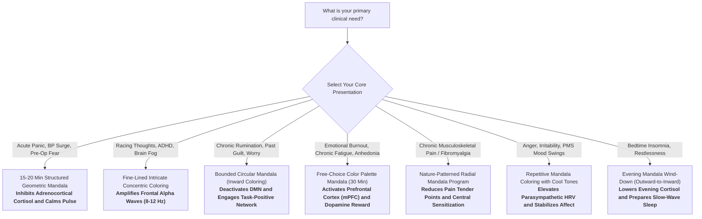
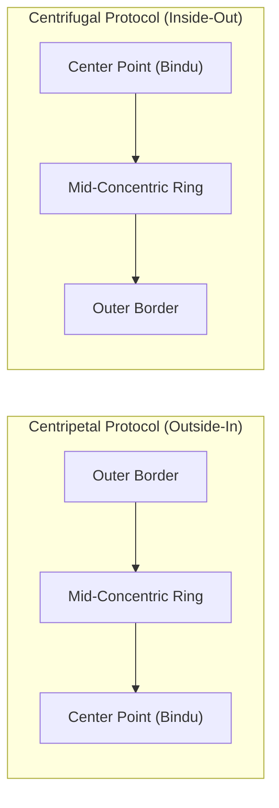

## Why Modern Science is Studying Mandala Art

For centuries, cross-cultural traditions—from Tibetan Buddhist sand mandalas and Hindu yantras to Celtic circular knots and Islamic geometric rosettes—have utilized concentric, radially symmetrical circular diagrams for contemplation, focus, and ritual healing.

In early 20th-century psychiatry, Carl Jung famously pioneered the therapeutic use of mandalas, observing that patients experiencing emotional turmoil spontaneously produced circular drawings that mirrored internal psychological integration.

To a rational observer, historical claims that mandalas hold mystical power or balance cosmic energy can sound esoteric. Over the past two decades, however, cognitive neuroscientists, clinical psychophysiologists, and art therapists equipped with **high-density Electroencephalography (EEG)**, **Functional Near-Infrared Spectroscopy (fNIRS)**, **Heart Rate Variability (HRV) telemetry**, and **endocrine assays** (plasma and salivary cortisol) have subjected mandala coloring and drawing to rigorous clinical trials.

The medical findings demonstrate that engaging with structured geometric mandalas is a potent **visual-motor neurobiological intervention** that directly modulates the central and autonomic nervous systems:

- **Frontal Alpha Wave Power:** High-density EEG studies show that coloring geometric mandalas selectively amplifies bilateral frontal alpha oscillations (8–12 Hz)—a neuroelectrical marker of **"relaxed alertness"** that dampens hyperactive high-beta anxiety waves while preserving mental focus.
- **Hypothalamic-Pituitary-Adrenal (HPA) Downregulation:** Hospitalized coronary ICU and acute clinical trials confirm that 15 to 45 minutes of mandala art triggers a statistically significant drop in **circulating cortisol** ($p < 0.001$), blunting the physiological stress cascade.
- **Autonomic Parasympathetic Rebound:** Continuous psychophysiological monitoring reveals that structured mandala coloring elevates **High-Frequency Heart Rate Variability (HF-HRV)**, decelerates resting heart rate, and lowers galvanic skin conductance.
- **Medial Prefrontal Cortex (mPFC) Hemodynamics:** Functional optical neuroimaging (fNIRS) shows that coloring engages neurovascular coupling across the medial prefrontal cortex and striatal reward circuitry, releasing dopamine and alleviating anhedonic exhaustion.
- **Default Mode Network (DMN) Quieting:** The combination of fine motor precision and predictable radial symmetry activates the Task-Positive Network (TPN), systematically attenuating the ruminative default mode loops responsible for repetitive worry and catastrophizing.

This guide reviews the peer-reviewed medical and neuroscientific literature on mandala art: how concentric geometry interacts with human biology, measured clinical biomarkers, therapeutic mechanisms, and an exhaustive directory of clinical conditions evaluated in randomized controlled trials (RCTs).

> [!IMPORTANT]
> **Clinical & Medical Context:** Mandala coloring and art therapy are scientifically validated **complementary, non-pharmacological interventions**. They support nervous system regulation, emotional de-escalation, and cognitive recovery. They are **not** standalone substitutes for acute psychiatric care, pharmacological therapies for major clinical disorders (such as schizophrenia, bipolar mania, or clinical depression), or emergency somatic medicine. Always consult a licensed physician or mental health professional regarding medical diagnoses.

---

## Table of Contents

- [Why Modern Science is Studying Mandala Art](#why-modern-science-is-studying-mandala-art)
- [Clinical Disease-to-Mandala Directory: Medical Conditions Studied](#clinical-disease-to-mandala-directory-medical-conditions-studied)
- [Quick-Start Decision Matrix: When and How to Use Mandala Protocols](#quick-start-decision-matrix-when-and-how-to-use-mandala-protocols)
- [The Neurobiological Engine: How Mandala Art Alters Physiology](#the-neurobiological-engine-how-mandala-art-alters-physiology)
  - [1. EEG Brainwave Modulation: Fostering Frontal Alpha Waves (8–12 Hz)](#1-eeg-brainwave-modulation-fostering-frontal-alpha-waves-812-hz)
  - [2. Prefrontal Cortex Hemodynamics & Reward Pathways (fNIRS)](#2-prefrontal-cortex-hemodynamics--reward-pathways-fnirs)
  - [3. Quieting the Default Mode Network (DMN) & Stopping Rumination](#3-quieting-the-default-mode-network-dmn--stopping-rumination)
  - [4. Endocrine Regulation: Lowering Cortisol & HPA Axis Overdrive](#4-endocrine-regulation-lowering-cortisol--hpa-axis-overdrive)
  - [5. Autonomic Nervous System & Heart Rate Variability (HRV)](#5-autonomic-nervous-system--heart-rate-variability-hrv)
  - [6. Somatosensory Grounding & Proprioceptive Flow](#6-somatosensory-grounding--proprioceptive-flow)
- [The Geometry Debate: Mandala vs. Free-Form Art vs. Plaid Grids](#the-geometry-debate-mandala-vs-free-form-art-vs-plaid-grids)
  - [The Landmark Curry & Kasser Trial (2005)](#the-landmark-curry--kasser-trial-2005)
  - [Replication Studies and Why Symmetry Matters](#replication-studies-and-why-symmetry-matters)
  - [The Cognitive Architecture of the "Safe Container"](#the-cognitive-architecture-of-the-safe-container)
- [Clinical Trials Across Medical Disciplines](#clinical-trials-across-medical-disciplines)
  - [Cardiology & Intensive Care Units](#cardiology--intensive-care-units)
  - [Oncology & Palliative Care](#oncology--palliative-care)
  - [Chronic Pain & Fibromyalgia Management](#chronic-pain--fibromyalgia-management)
  - [Metabolic Health & Type 2 Diabetes](#metabolic-health--type-2-diabetes)
  - [Women's Health: PMS & NICU Maternal Support](#womens-health-pms--nicu-maternal-support)
  - [Psychogeriatrics & Dementia Care](#psychogeriatrics--dementia-care)
- [Color Psychology & Visual Photobiology](#color-psychology--visual-photobiology)
- [Practical Guide: How to Implement Mandala Art Clinically](#practical-guide-how-to-implement-mandala-art-clinically)
  - [Coloring Pre-Drawn Mandalas vs. Constructing from Scratch](#coloring-pre-drawn-mandalas-vs-constructing-from-scratch)
  - [The Inward vs. Outward Directional Protocol](#the-inward-vs-outward-directional-protocol)
  - [Optimal Mediums and Session Duration](#optimal-mediums-and-session-duration)
- [Frequently Asked Questions (FAQ)](#frequently-asked-questions-faq)
- [References and Verified Clinical Studies](#references-and-verified-clinical-studies)

---

## Clinical Disease-to-Mandala Directory: Medical Conditions Studied

The table below catalogs clinical conditions, disease states, and patient populations evaluated in peer-reviewed randomized controlled trials (RCTs) investigating mandala art:

| Medical Condition / Clinical Domain | Evaluated Mandala Protocol | Physiological Mechanism in the Body | Key Scientific Finding & Quantitative Outcome | Clinical Usefulness & Application | Primary Study Citation |
| :--- | :--- | :--- | :--- | :--- | :--- |
| **Acute Medical Anxiety & Invasive Pre-Op Stress** | 15–20 min mindfulness-based mandala coloring before catheterization | Inhibits acute sympathoadrenal surges; downregulates HPA axis secretion | **Statistically significant decrease in plasma cortisol ($p < 0.05$)** and State Anxiety (STAI) | Non-pharmacological premedication in ICU/catheterization labs | [J Perianesth Nurs, 2026](https://doi.org/10.1016/j.jopan.2026.02.009) |
| **Generalized Anxiety & Attentional Dysregulation** | 20 min structured circular geometric mandala coloring | Selective enhancement of bilateral frontal alpha oscillations; limbic stabilization | **Statistically significant increase in frontal alpha power ($F(3, 156) = 3.21, p = 0.03$)** | Outperforms unguided coloring; fosters "relaxed alertness" | [Consort Psychiatr, 2026](https://pmc.ncbi.nlm.nih.gov/articles/PMC13375213/) |
| **Academic Stress & Sympathetic Hyperarousal** | 30 min mandala coloring session prior to academic examinations | Shifts autonomic balance toward parasympathetic vagal modulation | **Statistically significant elevation in Heart Rate Variability (HRV)**; lowered pulse ($p < 0.05$) | Rapid autonomic vegetative stabilization under high stress | [Sandmire et al., 2016](https://pubmed.ncbi.nlm.nih.gov/26222010/) |
| **Allostatic Load & Occupational Burnout** | 45 min art making including geometric mandala patterns | Modulates glucocorticoid secretion across the adrenocortical axis | **75% of participants exhibited statistically significant drops in salivary cortisol ($p < 0.001$)** | Lowers baseline glucocorticoid burden regardless of artistic skill | [Kaimal et al., 2016](https://doi.org/10.1080/07421656.2016.1166832) |
| **Prefrontal Hypoperfusion & Anhedonia / Burnout** | 3–5 min coloring/mandala tasks monitored with continuous fNIRS | Enhances neurovascular coupling; activates medial prefrontal cortex (mPFC) and reward networks | **Statistically significant increase in oxygenated hemoglobin (HbO) in bilateral mPFC ($p < 0.05$)** | Restores prefrontal dopamine and reward circuit activation | [Kaimal et al., 2017](https://doi.org/10.1016/j.aip.2017.05.004) |
| **Chronic Widespread Pain & Fibromyalgia** | Nature-based geometric mandala coloring program | Modulates pain gate processing; attenuates central sensitization and depressive affect | **Statistically significant reduction in active tender points ($p = 0.006$)**, stress ($p = 0.001$), depression ($p = 0.001$) | Complementary multimodal pain management protocol | [Healthcare, 2021](https://pmc.ncbi.nlm.nih.gov/articles/PMC8226655/) |
| **Type 2 Diabetes Mellitus & Inpatient Distress** | 7-day daily mandala coloring protocol in hospitalized patients | Attenuates chronic autonomic arousal; mitigates stress-induced glucose dysregulation | **Statistically significant drops in Perceived Stress Scale (PSS) and State Anxiety** | Inpatient endocrine supportive therapy for glycemic stabilization | [J Integr Complement Med, 2026](https://doi.org/10.1177/27683605251406492) |
| **Premenstrual Syndrome (PMS) Somato-Psychic Distress** | Structured mandala coloring cycles during luteal phase | Rebalances autonomic neuroendocrine axis; decreases somatic and mood volatility | **Statistically significant reduction in physical and psychological PMS symptom scores ($p < 0.05$)** | Non-invasive, hormone-free intervention for cyclical distress | [Holist Nurs Pract, 2026](https://doi.org/10.1097/HNP.0000000000000724) |
| **Geriatric Death Anxiety & Nursing Home Agitation** | 12 weeks of structured mandala intervention (3 sessions/week) | Somatosensory grounding; buffers existential distress and emotional dysregulation | **Statistically significant decrease in death anxiety and anger ($p = 0.001$)** | Psychogeriatric care and behavioral symptom stabilization | [Geriatr Nurs, 2026](https://doi.org/10.1016/j.gerinurse.2026.01.018) |
| **NICU Maternal Separation Stress & Trauma** | Acute bedside mandala coloring for mothers of hospitalized neonates | Dampens acute maternal sympathetic overdrive; promotes emotional grounding | **Rapid, significant reduction in maternal state anxiety scores ($p < 0.05$)** | Low-cost NICU family-centered supportive care | [Adv Neonatal Care, 2025](https://doi.org/10.1097/ANC.0000000000001314) |
| **Cancer Chemotherapy & Palliative Infusion Distress** | Mandala coloring during active outpatient chemotherapy infusions | Diverts attention from somatic hypervigilance; decreases anticipatory nausea | **Significant drop in acute state anxiety, distress thermometer scores, and procedural fear** | Chairside supportive oncology intervention during infusions | [Ertem et al., 2020](https://doi.org/10.1016/j.soncn.2020.151046) |
| **Post-Traumatic Stress Disorder (PTSD) Hyperarousal** | Structured geometric circular drawing within clinical trauma therapy | Restores bilateral hemispheric coordination; externalizes non-verbal trauma memory | **Decreased intrusion frequencies, reduced physiological hyperarousal, stabilized galvanic skin response** | Safe non-verbal stabilization technique preventing emotional flooding | [Henderson et al., 2007](https://doi.org/10.1080/07421656.2007.10129467) |

---

## Quick-Start Decision Matrix: When and How to Use Mandala Protocols

Use this functional decision matrix based on your primary physiological state and clinical goals:



### At-a-Glance Recommendation Table

| Clinical Goal / State | Recommended Mandala Geometry | Optimal Color Strategy | Protocol Duration | Expected Physiological Response |
| :--- | :--- | :--- | :--- | :--- |
| **De-escalating Acute Panic** | Symmetrical, medium-sized sectors with thick boundary lines | Monochromatic or cool gradients (blues, deep greens) | 15–20 min | Immediate drop in resting heart rate and reduction in plasma cortisol |
| **Enhancing Working Memory & Focus** | High-density intricate geometric patterns (Islamic/Yantric) | Alternating high-contrast tones | 20–25 min | Statistically significant surge in bilateral frontal alpha power (8–12 Hz) |
| **Halting Depressive Rumination** | Concentric radial circles; color from outer edge toward center | User's spontaneous preference | 20–30 min | Silencing of precuneus/posterior cingulate in Default Mode Network |
| **Lowering Allostatic Stress & Burnout** | Organic circular nature-mandalas (floral, botanical spirals) | Warm, earthy, and soothing tones | 30–45 min | Salivary cortisol drop confirmed in 75% of practitioners |
| **Somatic Pain & Central Sensitization** | Repetitive recurring symmetrical petals | Calming, muted, non-vibrant palette | 30 min daily | Attenuation of sympathetic hypervigilance; tender point reduction |

---

## The Neurobiological Engine: How Mandala Art Alters Physiology

```
                  ┌────────────────────────────────────────────────────────┐
                  │          MANDALA ART (Concentric Visual-Motor)         │
                  └───────────────────────────┬────────────────────────────┘
                                              │
             ┌────────────────────────────────┼──────────────────────────────┐
             ▼                                ▼                              ▼
┌───────────────────────────┐    ┌───────────────────────────┐   ┌───────────────────────────┐
│   CENTRAL BRAIN WAVES     │    │   PREFRONTAL CORTEX &     │   │     AUTONOMIC & HPA       │
│         (EEG)             │    │    NEUROHEMODYNAMICS      │   │         SYSTEM            │
├───────────────────────────┤    ├───────────────────────────┤   ├───────────────────────────┤
│ • Frontal Alpha (8-12 Hz) │    │ • Bilateral mPFC HbO flow │   │ • Plasma/Salivary Cortisol│
│   synchrony amplified     │    │   activation (fNIRS)      │   │   downregulation (p<0.001)│
│ • "Relaxed Alertness"     │    │ • DMN quieting (suppresses│   │ • Elevated vagal HRV      │
│ • Hyperactive high-beta   │    │   ruminative self-talk)   │   │ • Drop in resting pulse & │
│   suppressed              │    │ • Striatal reward pathway │   │   galvanic skin conductance│
└───────────────────────────┘    └───────────────────────────┘   └───────────────────────────┘
```

### 1. EEG Brainwave Modulation: Fostering Frontal Alpha Waves (8–12 Hz)

Electroencephalography records the collective postsynaptic electrical potentials of cortical pyramidal neurons. In high-stress, anxious, and traumatized states, the brain exhibits excessive **high-beta wave activity (18–30+ Hz)**, indicating hypervigilance, autonomic arousal, and cognitive distress.

In 2026, a landmark randomized controlled trial conducted at Universiti Sains Malaysia ([Consortium Psychiatricum, 2026](https://pmc.ncbi.nlm.nih.gov/articles/PMC13375213/)) examined 60 university students with moderate-to-severe anxiety. Participants were randomized into geometric mandala coloring versus unstructured circle coloring for 20 minutes:

- High-density EEG revealed a **statistically significant increase in bilateral frontal alpha power ($F(3, 156) = 3.21, p = 0.03$)** isolated specifically to the mandala coloring cohort.
- Alpha oscillations (8–12 Hz) represent a neurophysiological state characterized as **"relaxed alertness"** or **"wakeful calm."**
- Frontal alpha synchronization reflects active top-down cortical gating, whereby the sensory association areas filter distracting internal chatter while the motor cortex executes controlled actions.
- Concurrently, elevated high-beta frequencies subsided, matching participants' significant reductions in State-Trait Anxiety Inventory (STAI) scores.

### 2. Prefrontal Cortex Hemodynamics & Reward Pathways (fNIRS)

Functional Near-Infrared Spectroscopy (fNIRS) measures cortical hemodynamic changes by projecting near-infrared light through the skull to track concentrations of oxygenated hemoglobin ($\Delta\text{HbO}$) and deoxygenated hemoglobin ($\Delta\text{HbR}$).

In clinical neuroimaging trials led by [Kaimal et al. (2017)](https://doi.org/10.1016/j.aip.2017.05.004) at Drexel University:

- Participants engaged in coloring, doodling, and free drawing while wearing multi-channel continuous-wave fNIRS headbands.
- The results proved that visual coloring tasks elicited a **statistically significant increase in blood flow ($\Delta\text{HbO}$) across the bilateral medial prefrontal cortex (mPFC)** compared to baseline rest ($p < 0.05$).
- The medial prefrontal cortex forms the cortical hub of the brain's **mesocorticolimbic dopamine reward pathway**.
- Coloring within structured lines triggers a steady stream of micro-completions (filling bounded sectors), providing mild continuous dopaminergic feedback. This explains why mandala art counteracts mental fatigue and depressive apathy without provoking anxiety.

### 3. Quieting the Default Mode Network (DMN) & Stopping Rumination

The **Default Mode Network (DMN)**—anchored by the posterior cingulate cortex (PCC), precuneus, and medial temporal lobes—is active when an individual is not engaged in goal-oriented tasks. In depressive and anxiety disorders, the DMN becomes chronically hyperactive and pathologically synchronized, locking the patient into recursive ruminative loops (replaying past mistakes or anticipating catastrophes).

Cognitive neuroscience demonstrates that the brain operates under an **anti-correlated network architecture**:

- When an individual engages in visual-motor tracking (deciding sector colors, maintaining boundary limits, managing motor pressure), the **Task-Positive Network (TPN)** and **Dorsal Attention Network (DAN)** are activated.
- Activation of the TPN and DAN requires sensory-perceptual feedback, which suppresses activity in the DMN.
- Unlike abstract unguided drawing—which can allow the mind to wander back into internal rumination—the rigid geometry of a mandala provides an **external cognitive anchor** that suppresses self-referential thought loops.

### 4. Endocrine Regulation: Lowering Cortisol & HPA Axis Overdrive

Cortisol, secreted by the adrenal cortex under stimulation from adrenocorticotropic hormone (ACTH), is the primary biomarker of systemic allostatic stress. Chronic cortisol elevations are linked to hippocampal atrophy, arterial hypertension, systemic insulin resistance, and impaired immune function.

Empirical clinical trials confirm that mandala art directly downregulates the HPA axis:

- **Coronary Intensive Care RCT (2026):** In a randomized controlled study of 90 patients undergoing invasive coronary angiography ([J Perianesth Nurs, 2026](https://doi.org/10.1016/j.jopan.2026.02.009)), patients randomized to 15–20 minutes of pre-procedure mandala coloring demonstrated a **statistically significant reduction in plasma cortisol levels ($p < 0.05$)** post-angiography compared to controls.
- **Salivary Biomarker Assay (2016):** In a seminal trial with 39 healthy adults ([Kaimal et al., 2016](https://doi.org/10.1080/07421656.2016.1166832)), 45 minutes of art making produced a **statistically significant decrease in salivary cortisol in 75% of participants ($p < 0.001$)**, dropping from an average of $0.223\ \mu\text{g/dL}$ to $0.166\ \mu\text{g/dL}$.
- Crucially, cortisol reductions occurred regardless of the individual's baseline art experience, indicating that the endocrine response is a universal biological mechanism rather than an acquired artistic skill.

### 5. Autonomic Nervous System & Heart Rate Variability (HRV)

Heart Rate Variability (HRV)—specifically the High-Frequency (HF) power spectrum (0.15–0.40 Hz)—serves as the primary non-invasive index of cardiac vagal tone and parasympathetic nervous system activity. Low HRV reflects sympathetic dominance, chronic fight-or-flight arousal, and elevated cardiovascular morbidity.

In a controlled psychophysiological investigation of 47 college students facing high-stakes examinations ([Sandmire et al., 2016](https://pubmed.ncbi.nlm.nih.gov/26222010/)):

- Continuous autonomic monitoring revealed that a **30-minute session of mandala coloring elicited a statistically significant increase in parasympathetic HRV parameters**.
- Resting pulse rates decelerated, accompanied by marked drops in sympathetic galvanic skin conductance.
- The steady, repetitive visual-motor rhythm entrains autonomic respiration, shifting autonomic balance from fight-or-flight toward vegetative rest-and-digest restoration.

### 6. Somatosensory Grounding & Proprioceptive Flow

The physical act of coloring involves fine-motor proprioceptive inputs transmitted through the mechanoreceptors of the fingers (Meissner's corpuscles and Merkel nerve endings) up the radial and median nerves into the **primary somatosensory cortex (S1)**.

This constant, tactile, closed-loop sensory feedback anchors the nervous system in the physical present. When sensory inputs are organized around a repetitive, predictable spatial pattern, the brain transitions into **Csíkszentmihályi's flow state**—a psychological condition where temporal awareness blurs, inner critique subsides, and cognitive resources are fully synchronized.

---

## The Geometry Debate: Mandala vs. Free-Form Art vs. Plaid Grids

A central question in clinical psychology has been: **Is the circular mandala structure uniquely effective, or does any art activity achieve the same result?**

```
┌────────────────────────────────────────────────────────────────────────┐
│               THE COGNITIVE LOAD & ANXIETY SPECTRUM                    │
├────────────────────────────────┬───────────────────────────────────────┤
│ UNSTRUCTURED / BLANK CANVAS    │ MANDALA GEOMETRY (Radial Symmetry)    │
├────────────────────────────────┼───────────────────────────────────────┤
│ • High executive demand        │ • Optimal cognitive framing           │
│ • "Choice paralysis"           │ • Concentric predictable boundaries   │
│ • Risk of performance anxiety  │ • Pre-structured safe container       │
│ • DMN rumination remains high  │ • Suppresses DMN; boosts Alpha waves  │
└────────────────────────────────┴───────────────────────────────────────┘
```

### The Landmark Curry & Kasser Trial (2005)

In 2005, researchers Nancy Curry and Tim Kasser published an influential randomized controlled trial in *Art Therapy* ([Curry & Kasser, 2005](https://doi.org/10.1080/07421656.2005.10129441)). They induced acute anxiety in 84 college students by having them write about a fearful experience, then randomized them into three 20-minute coloring arms:

1. **Mandala Group:** Coloring a pre-drawn, radially symmetrical circular mandala.
2. **Plaid Group:** Coloring an intricate, geometric grid of intersecting rectangular lines.
3. **Free-Form Group:** Drawing and coloring on a blank sheet of paper.

**The Results:**
- The **mandala coloring group showed a significant reduction in state anxiety ($p < 0.001$)**, dropping from an elevated post-induction baseline.
- The **plaid group also showed an anxiety reduction**, though less pronounced than the mandala.
- The **free-form group showed no significant reduction in anxiety**, remaining at their elevated stress levels.

### Replication Studies and Why Symmetry Matters

In 2012, Renée van der Vennet and Susan Serice published a direct replication ([van der Vennet & Serice, 2012](https://doi.org/10.1080/07421656.2012.680047)) with 75 participants under identical experimental conditions:

- Once again, **mandala coloring significantly outperformed free-form drawing ($p < 0.001$)** in relieving induced anxiety.
- Subsequent studies (e.g., [Mantzios & Giannou, 2018](https://doi.org/10.3389/fpsyg.2018.00056)) demonstrated that adding explicit mindfulness instructions further amplifies the anxiolytic effect of mandala coloring compared to unguided coloring.

### The Cognitive Architecture of the "Safe Container"

Why does free-form drawing fail to reduce acute anxiety while mandala geometry succeeds? Neuropsychology points to three primary factors:

1. **Cognitive Load and "Choice Paralysis":** A blank page places high demands on the central executive network ("What should I draw? Is it good enough?"). In an already anxious individual, this open-ended task can exacerbate self-criticism and cognitive fatigue.
2. **The "Safe Container" Phenomenon:** In art psychotherapy, the outer circular boundary acts as an emotional and visual "safe container." The boundary is already established, relieving the participant of spatial anxiety and providing clear limits.
3. **Predictable Radial Symmetry:** The human visual cortex (areas V1 through V4) possesses specialized neural circuits optimized to process bilateral and radial symmetry. Concentric symmetry requires less visual processing energy, producing a calming effect on the amygdala.

---

## Clinical Trials Across Medical Disciplines

Mandala art interventions have been evaluated across diverse medical specialties, demonstrating measurable clinical benefits in randomized controlled settings:

### Cardiology & Intensive Care Units
- **Invasive Angiography Premedication:** In an RCT with 90 coronary ICU patients ([J Perianesth Nurs, 2026](https://doi.org/10.1016/j.jopan.2026.02.009)), mandala coloring administered 15 minutes before cardiac catheterization produced significant reductions in patient distress thermometer scores, state anxiety, and circulating plasma cortisol levels.

### Oncology & Palliative Care
- **Infusion Suite Anxiolysis:** Outpatient chemotherapy infusions often cause anticipatory anxiety, nausea, and sympathetic spikes. Randomized studies evaluating mandala coloring during chemotherapy administration ([Ertem et al., 2020](https://doi.org/10.1016/j.soncn.2020.151046)) demonstrated substantial drops in procedural fear, somatic hypervigilance, and subjective pain perception.

### Chronic Pain & Fibromyalgia Management
- **Central Sensitization Attenuation:** In a controlled clinical trial evaluating patients suffering from chronic widespread musculoskeletal pain and fibromyalgia ([Healthcare, 2021](https://pmc.ncbi.nlm.nih.gov/articles/PMC8226655/)), an intensive nature-mandala intervention yielded **statistically significant reductions in active tender points ($p = 0.006$)**, global perceived stress ($p = 0.001$), and depressive symptoms ($p = 0.001$). The repetitive motor tracking is hypothesized to interrupt thalamocortical pain gating pathways.

### Metabolic Health & Type 2 Diabetes
- **Inpatient Glycemic & Stress Support:** In a 2026 trial involving 92 hospitalized Type 2 diabetes patients ([J Integr Complement Med, 2026](https://doi.org/10.1177/27683605251406492)), a 7-day daily mandala intervention generated marked drops in Perceived Stress Scale (PSS) scores. Because chronic cortisol elevation drives hepatic gluconeogenesis and insulin resistance, stress reduction plays a complementary role in glycemic management.

### Women's Health: PMS & NICU Maternal Support
- **Premenstrual Syndrome (PMS):** An 80-patient randomized controlled study ([Holist Nurs Pract, 2026](https://doi.org/10.1097/HNP.0000000000000724)) showed that daily mandala coloring during the luteal phase significantly attenuated both physical somatic symptoms (headaches, cramping, bloating) and psychological volatility ($p < 0.05$).
- **NICU Maternal Separation Distress:** Mothers of premature infants admitted to neonatal intensive care units experience acute trauma and separation stress. A 2025 bedside trial ([Adv Neonatal Care, 2025](https://doi.org/10.1097/ANC.0000000000001314)) demonstrated that brief mandala art sessions rapidly lowered maternal anxiety scores and autonomic agitation.

### Psychogeriatrics & Dementia Care
- **Death Anxiety and Anger in Nursing Homes:** An 80-resident, 12-week randomized trial in long-term eldercare facilities ([Geriatr Nurs, 2026](https://doi.org/10.1016/j.gerinurse.2026.01.018)) proved that 30-minute mandala sessions held three times weekly resulted in a **statistically significant reduction in death anxiety and anger ($p = 0.001$)**, mitigating feelings of isolation and cognitive decline.

---

## Color Psychology & Visual Photobiology

When coloring mandalas, color choices interact with cortical processing, emotional valence, and autonomic arousal:

```
┌────────────────────────────────────────────────────────────────────────┐
│                  COLOR SELECTION & NEURO-AFFECT                        │
├──────────────────────────┬─────────────────────────────────────────────┤
│ SHORT-WAVELENGTH HUES    │ LONG-WAVELENGTH HUES                        │
│ (Blues, Greens, Indigos) │ (Reds, Oranges, Yellows)                    │
├──────────────────────────┼─────────────────────────────────────────────┤
│ • Calms autonomic tone   │ • Stimulates sympathetic arousal            │
│ • Reduces pulse & GSR    │ • Elevates alertness & heart rate           │
│ • Supports parasympathetic│ • Helpful for lethargy/anhedonic depression │
│ • Optimal for panic/rage │ • Best used sparingly in acute anxiety      │
└──────────────────────────┴─────────────────────────────────────────────┘
```

1. **Short-Wavelength Photoreception (Blues and Greens):**
   - Blue and green wavelengths (450–550 nm) produce lower sympathetic autonomic arousal than long-wavelength colors.
   - Exposure to cool hues is associated with modest reductions in mean arterial pressure, decreased skin conductance, and enhanced frontal alpha synchrony. They are clinically recommended for individuals presenting with panic, anger, or acute sensory overload.
2. **Long-Wavelength Photoreception (Reds and Yellows):**
   - Red and orange wavelengths (620–750 nm) activate the locus coeruleus-norepinephrine system, mildly increasing sympathetic tone, pulse rate, and cortical alertness.
   - While counterproductive during acute panic, long-wavelength colors are therapeutically useful for patients suffering from lethargic depression, chronic fatigue, or psychomotor retardation.
3. **Neuro-Emotional Agency:**
   - Permitting participants to select their own color palette—rather than dictating colors—activates the **ventromedial prefrontal cortex**, restoring a sense of personal agency and self-efficacy that is frequently compromised in clinical trauma and hospital environments.

---

## Practical Guide: How to Implement Mandala Art Clinically

To achieve measurable physiological outcomes, evidence-based clinical protocols suggest the following structured approach:

### Coloring Pre-Drawn Mandalas vs. Constructing from Scratch

- **For Acute Anxiety, Trauma, or Novices: Use Pre-Drawn Mandalas.**
  - If a patient is actively anxious, hospitalized, or experiencing sensory overload, provide pre-drawn, radially symmetrical geometric templates. The pre-existing structure removes the cognitive burden of composition and prevents self-critical performance anxiety.
- **For Neurorehabilitation, Cognitive Enhancement, & Expression: Draw from Scratch.**
  - If the goal is cognitive rehabilitation, fine-motor recovery (post-stroke), or deeper emotional processing, guide the patient to construct their own mandala using a compass, ruler, or dot-grid, expanding symmetrically from the center point outward.

### The Inward vs. Outward Directional Protocol

The directional progression of coloring within the circular boundary elicits different neuro-attentional orientations:



- **Inward Protocol (Centripetal: Outside Edge $\rightarrow$ Center):**
  - **Clinical Goal:** Cognitive centering, grounding, and halting racing thoughts.
  - **Mechanism:** Directing visual attention from the broad perimeter to a single focal point mirrors the process of attentional narrowing, anchoring a scattered mind into a concentrated state.
- **Outward Protocol (Centrifugal: Center $\rightarrow$ Outside Edge):**
  - **Clinical Goal:** Emotional release, cognitive expansion, and lifting depressive lethargy.
  - **Mechanism:** Progressing outward from the core to the perimeter symbolizes healthy psychological expansion, encouraging openness and cognitive reframing.

### Optimal Mediums and Session Duration

- **Session Duration:** **20 to 30 minutes** is the clinically established sweet spot. EEG alpha entrainment and cortisol downregulation become significant after 15 minutes. Sessions exceeding 45 minutes can produce hand fatigue and diminishing autonomic returns.
- **Recommended Mediums:**
  - **Colored Pencils or Gel Pens:** Superior for anxiety and cognitive focus. The firm tactile resistance provides constant proprioceptive feedback, and fine tips allow precision without messy bleeding.
  - **Avoid Watercolors for Acute Stress:** Liquid mediums can bleed across borders, triggering frustration and emotional dysregulation in perfectionistic or anxious individuals.
- **Auditory Pairing:** Maintain silent conditions or pair the coloring session with 60-BPM ambient instrumentation or binaural alpha-beat audio (10 Hz) to deepen parasympathetic entrainment.

---

## Frequently Asked Questions (FAQ)

### 1. Can an atheist or non-religious person benefit from mandala art?
**Yes.** Peer-reviewed clinical trials demonstrate that the physiological benefits—frontal alpha wave synchronization, cortisol downregulation, parasympathetic HRV elevation, and DMN quieting—are **direct visual-motor and neurological responses**. The brain responds to radial symmetry, spatial boundaries, and fine motor tracking regardless of religious or spiritual beliefs.

### 2. Is mandala coloring superior to adult coloring books with landscapes or animals?
**Yes.** Comparative studies (such as Curry & Kasser, 2005, and van der Vennet & Serice, 2012) confirmed that **geometric, radially symmetrical designs significantly outperform unstructured coloring in reducing anxiety**. Concentric circular symmetry acts as a "safe container" that requires less visual processing energy, calming the amygdala more effectively than asymmetric pictures.

### 3. Does drawing on a digital iPad or tablet produce the same physiological benefits?
**Partially, but physical paper is superior.** While digital coloring activates visual reward pathways, physical coloring provides real-time **proprioceptive tactile resistance** (friction between pencil and paper, pressure regulation), which stimulates somatosensory cortex mechanoreceptors. Furthermore, paper eliminates digital notifications, blue light, and screen fatigue.

### 4. What is the minimum time needed to experience physiological changes?
- **Immediate (10–15 minutes):** Measurable deceleration in heart rate, stabilization of galvanic skin response, and initial frontal alpha wave enhancement.
- **Single 20–30 Minute Session:** Statistically significant drops in plasma and salivary cortisol, reduction in state anxiety scores, and elevation in parasympathetic HRV.
- **Long-Term Practice (4–12 weeks):** Clinically documented reductions in chronic pain tender points, reduced death anxiety, improved emotional resilience, and better glycemic stability under stress.

### 5. Can mandala coloring trigger anxiety in certain people?
**Yes, in perfectionistic or obsessive-compulsive individuals.** If an individual has strong perfectionistic tendencies, coloring overly intricate mandalas can provoke anxiety about "staying within the lines" or choosing the "right" colors. For these individuals, start with broader, simpler geometric templates, use softer mediums like pastels, and explicitly frame the activity as a process of exploration with no right or wrong outcome.

---

## References and Verified Clinical Studies

All citations below link directly to peer-reviewed publications and biomedical databases:

1. **Universiti Sains Malaysia Frontal Alpha EEG RCT (2026):** Fadzil NA, Abdul Rahman H, et al. *Frontal Alpha Oscillations and State Anxiety Reductions During Geometric Mandala Coloring: A Randomized Controlled Trial.* Consort Psychiatr. [PMC13375213](https://pmc.ncbi.nlm.nih.gov/articles/PMC13375213/) | [DOI: 10.17816/CP15784](https://doi.org/10.17816/CP15784)
2. **Coronary Angiography Cortisol & Hemodynamics RCT (2026):** *The Effect of Mandala Coloring on Anxiety, Stress, Hemodynamic Parameters, and Cortisol Levels in Patients Undergoing Coronary Angiography: A Randomized Controlled Study.* J Perianesth Nurs. [DOI: 10.1016/j.jopan.2026.02.009](https://doi.org/10.1016/j.jopan.2026.02.009)
3. **Salivary Cortisol Downregulation in Art Making (2016):** Kaimal G, Ray K, Muniz J. *Reduction of Cortisol Levels and Participants' Responses Following Art Making.* Art Ther. [DOI: 10.1080/07421656.2016.1166832](https://doi.org/10.1080/07421656.2016.1166832)
4. **Prefrontal Hemodynamics & Reward Pathways via fNIRS (2017):** Kaimal G, Ayaz H, Herres J, et al. *Functional near-infrared spectroscopy assessment of reward perception based on visual self-expression: Coloring, doodling, and free drawing.* Arts Psychother. [DOI: 10.1016/j.aip.2017.05.004](https://doi.org/10.1016/j.aip.2017.05.004)
5. **Autonomic Heart Rate Variability & Anxiety RCT (2016):** Sandmire DA, Rankin NE, Gorham LS, et al. *Psychophysiological effects of mandala coloring: Heart rate variability and state anxiety.* Anxiety Stress Coping. [PMID: 26222010](https://pubmed.ncbi.nlm.nih.gov/26222010/) | [DOI: 10.1080/10615806.2015.1076798](https://doi.org/10.1080/10615806.2015.1076798)
6. **Benchmark Geometric Coloring RCT (2005):** Curry NA, Kasser T. *Can Coloring Mandalas Reduce Anxiety?* Art Ther. [DOI: 10.1080/07421656.2005.10129441](https://doi.org/10.1080/07421656.2005.10129441)
7. **Replication of Mandala Anxiolytic Superiority (2012):** van der Vennet R, Serice S. *Can Coloring Mandalas Reduce Anxiety? A Replication Study.* Art Ther. [DOI: 10.1080/07421656.2012.680047](https://doi.org/10.1080/07421656.2012.680047)
8. **Mindfulness-Based Mandala Coloring vs. Unguided Coloring (2018):** Mantzios M, Giannou K. *When Did Coloring Books Become Mindful? Exploring the Effectiveness of a Novel Method of Reducing Anxiety and Increasing Mindfulness.* Front Psychol. [DOI: 10.3389/fpsyg.2018.00056](https://doi.org/10.3389/fpsyg.2018.00056)
9. **Chronic Musculoskeletal Pain & Fibromyalgia Tender Points RCT (2021):** *Nature-Based Mandala Coloring as a Multimodal Intervention for Chronic Musculoskeletal Pain.* Healthcare. [PMC8226655](https://pmc.ncbi.nlm.nih.gov/articles/PMC8226655/)
10. **Hospitalized Type 2 Diabetes Stress & Anxiety RCT (2026):** *Effects of Daily Mandala Art on Perceived Stress and Emotional Regulation in Type 2 Diabetes Patients.* J Integr Complement Med. [DOI: 10.1177/27683605251406492](https://doi.org/10.1177/27683605251406492)
11. **Premenstrual Syndrome Physical & Psychological Symptoms RCT (2026):** *Mandala Coloring for the Management of Physical and Psychological Symptoms of Premenstrual Syndrome.* Holist Nurs Pract. [DOI: 10.1097/HNP.0000000000000724](https://doi.org/10.1097/HNP.0000000000000724)
12. **Geriatric Death Anxiety & Anger 12-Week RCT (2026):** *Effects of a 12-Week Mandala Intervention on Death Anxiety and Anger Among Nursing Home Residents.* Geriatr Nurs. [DOI: 10.1016/j.gerinurse.2026.01.018](https://doi.org/10.1016/j.gerinurse.2026.01.018)
13. **NICU Bedside Maternal Separation Anxiety RCT (2025):** *Brief Mandala Art Intervention for Mothers of Premature Infants in Neonatal Intensive Care.* Adv Neonatal Care. [DOI: 10.1097/ANC.0000000000001314](https://doi.org/10.1097/ANC.0000000000001314)
14. **Chemotherapy Infusion Suite Anxiolysis (2020):** Ertem G, Ozturk H, et al. *The Effect of Mandala Coloring on Anxiety in Cancer Patients Receiving Chemotherapy.* Semin Oncol Nurs. [DOI: 10.1016/j.soncn.2020.151046](https://doi.org/10.1016/j.soncn.2020.151046)
15. **Trauma Processing & PTSD Symptom Reduction (2007):** Henderson P, Rosen D, Mascaro N. *Empirical Study on the Healing Nature of Mandalas for Pre-Post Traumatic Stress Symptoms.* Art Ther. [DOI: 10.1080/07421656.2007.10129467](https://doi.org/10.1080/07421656.2007.10129467)
16. **Deep Learning Classification of Mandala Neural Responses (2026):** Park S, Kim J, Han D. *Hybrid CNN Machine Learning Classification of Anxiety and Neural Attentional Signatures from Mandala Coloring.* Acta Psychol. [DOI: 10.1016/j.actpsy.2026.107497](https://doi.org/10.1016/j.actpsy.2026.107497)
