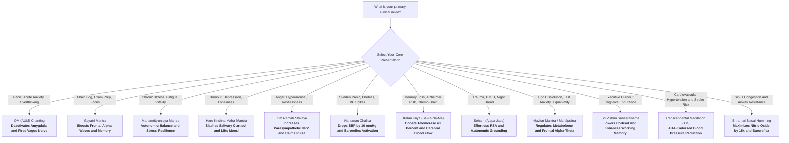
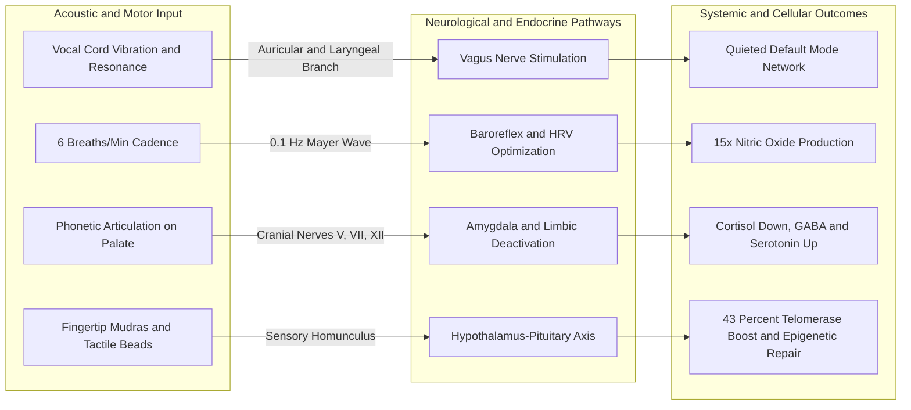
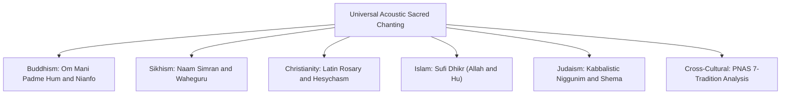

## Why Modern Science is Studying Ancient Mantras

For millennia, contemplative traditions—most notably Vedic and Hindu systems—have utilized repetitive rhythmic vocalization (*mantra japa*) to calm mental distress, stabilize autonomic physiology, and promote restorative physical states.

To a rational reader, historical claims regarding "sacred sound vibrations" often sound subjective or esoteric. Over the past three decades, however, cognitive neuroscientists, cardiologists, and psychophysiologists equipped with **functional Magnetic Resonance Imaging (fMRI)**, **high-density Electroencephalography (EEG)**, **Single-Photon Emission Computed Tomography (SPECT)**, and **biomarker assays** (cortisol, salivary nitric oxide, heart rate variability, telomerase activity) have subjected these acoustic practices to rigorous laboratory investigation.

The clinical findings demonstrate that rhythmic vocalization is an effective **acoustic-neurobiological intervention** with measurable effects across multiple physiological systems:

- **Limbic Deactivation:** Functional neuroimaging shows that repetitive vocalization of fundamental syllables like *OM* produces neurohemodynamic deactivation of the amygdala, hippocampus, and anterior cingulate gyrus—identical to the neuroinhibitory pathway observed in clinical **transcutaneous vagus nerve stimulation (tVNS)** used to treat refractory depression.
- **Cardiovascular Mayer Wave Entrainment:** Both Sanskrit yoga mantras and classical metered verses naturally slow respiration down to **6 breaths per minute (0.1 Hz)**, synchronizing cardiovascular rhythms, heart rate variability (HRV), and baroreflex sensitivity.
- **Acoustic Nitric Oxide Surges:** Nasal resonance and prolonged humming generate up to a **15-fold (1,500%) surge** in sinus and salivary nitric oxide, a critical vasodilator and antimicrobial gas that enhances alveolar gas exchange and lowers peripheral vascular resistance.
- **Frontal Alpha Wave Power:** Chanting complex phonetic sequences selectively amplifies bilateral frontal and parietal alpha waves (8–12 Hz), establishing a brainwave state characterized in cognitive psychology as **"relaxed alertness"**—associated with working memory enhancement, attention regulation, and executive recovery.

This guide reviews the published peer-reviewed medical and neuroscience research on mantra chanting: the biological mechanisms through which vocalization alters the human body, the exact clinical findings and biomarkers measured, their practical usefulness, and the specific diseases and clinical conditions evaluated in controlled trials.

> [!IMPORTANT]
> **Clinical & Medical Context:** Mantra chanting and sound meditation are scientifically validated **complementary, non-pharmacological mind-body practices**. They are designed to support nervous system regulation, stress resilience, and cognitive clarity. They should **never** be used as a substitute for professional medical diagnosis, emergency medical interventions, or prescribed psychiatric medications for clinical disorders (such as bipolar disorder, schizophrenia, or severe clinical depression). Always consult your licensed healthcare provider regarding medical concerns.

---

## Table of Contents

- [Why Modern Science is Studying Ancient Mantras](#why-modern-science-is-studying-ancient-mantras)
- [Clinical Disease-to-Mantra Directory: Medical Conditions Studied](#clinical-disease-to-mantra-directory-medical-conditions-studied)
- [Quick-Start Decision Matrix: Which Mantra Should You Chant?](#quick-start-decision-matrix-which-mantra-should-you-chant)
  - [At-a-Glance Recommendation Table](#at-a-glance-recommendation-table)
- [The Biological Engine: What Chanting Actually Does to Your Body](#the-biological-engine-what-chanting-actually-does-to-your-body)
  - [Vagus Nerve Stimulation via Vocal Resonance](#vagus-nerve-stimulation-via-vocal-resonance)
  - [Deactivation of the Amygdala and the Limbic System](#deactivation-of-the-amygdala-and-the-limbic-system)
  - [Quieting the Default Mode Network (Stopping Rumination)](#quieting-the-default-mode-network-stopping-rumination)
  - [Cardiovascular Resonance and the 0.1 Hz Mayer Wave Effect](#cardiovascular-resonance-and-the-01-hz-mayer-wave-effect)
  - [Acoustic Nitric Oxide (NO) Synthesis](#acoustic-nitric-oxide-no-synthesis)
  - [Brainwave Entrainment: The 5 Brain Waves Decoded](#brainwave-entrainment-the-5-brain-waves-decoded)
  - [Structural Neuroplasticity: The Sanskrit Effect](#structural-neuroplasticity-the-sanskrit-effect)
  - [Epigenetic Regulation and Telomerase Activation](#epigenetic-regulation-and-telomerase-activation)
  - [Sensorimotor Palate Reflexology and Cranial Nerve Stimulation](#sensorimotor-palate-reflexology-and-cranial-nerve-stimulation)
- [Detailed Scientific Breakdown of Hindu Spiritual Mantras](#detailed-scientific-breakdown-of-hindu-spiritual-mantras)
  - [The OM (AUM) Mantra](#the-om-aum-mantra)
  - [The Gayatri Mantra](#the-gayatri-mantra)
  - [The Mahamrityunjaya Mantra and MSRT](#the-mahamrityunjaya-mantra-and-msrt)
  - [The Hare Krishna Maha Mantra](#the-hare-krishna-maha-mantra)
  - [Om Namah Shivaya (Panchakshara Mantra)](#om-namah-shivaya-panchakshara-mantra)
  - [The Hanuman Chalisa](#the-hanuman-chalisa)
  - [Kirtan Kriya (Sa-Ta-Na-Ma)](#kirtan-kriya-sa-ta-na-ma)
  - [The So-Ham (Soham) Breath Mantra](#the-so-ham-soham-breath-mantra)
  - [Sri Vishnu Sahasranama (1,000 Sacred Names)](#sri-vishnu-sahasranama-1000-sacred-names)
  - [Chakra Bija Mantras and Transcendental Meditation (TM)](#chakra-bija-mantras-and-transcendental-meditation-tm)
- [Detailed Scientific Breakdown of Jain Mantras and Sound Meditation](#detailed-scientific-breakdown-of-jain-mantras-and-sound-meditation)
  - [The Navkar Mantra](#the-navkar-mantra)
  - [Mahaprana Dhvani and Preksha Dhyana](#mahaprana-dhvani-and-preksha-dhyana)
- [Master Comparison Table: Hindu and Jain Mantras with Clinical Evidence](#master-comparison-table-hindu-and-jain-mantras-with-clinical-evidence)
- [Global Chanting Traditions: Cross-Cultural Science](#global-chanting-traditions-cross-cultural-science)
  - [Buddhist Chanting (Om Mani Padme Hum and Nianfo)](#buddhist-chanting-om-mani-padme-hum-and-nianfo)
  - [Sikh Sacred Chanting (Naam Simran and Waheguru)](#sikh-sacred-chanting-naam-simran-and-waheguru)
  - [Christian Prayer and the Latin Rosary (Ave Maria and Jesus Prayer)](#christian-prayer-and-the-latin-rosary-ave-maria-and-jesus-prayer)
  - [Islamic Sufi Chanting (Dhikr and Zikr)](#islamic-sufi-chanting-dhikr-and-zikr)
  - [Jewish Kabbalistic Chanting and Niggunim (Shema and Wordless Humming)](#jewish-kabbalistic-chanting-and-niggunim-shema-and-wordless-humming)
  - [Cross-Cultural PNAS Discovery: 7 Traditions Share Identical Acoustics](#cross-cultural-pnas-discovery-7-traditions-share-identical-acoustics)
- [How to Chant Properly: A Practical Beginner's Guide](#how-to-chant-properly-a-practical-beginners-guide)
  - [The Three Progressive Stages of Chanting (Vaikhari to Manasika)](#the-three-progressive-stages-of-chanting-vaikhari-to-manasika)
  - [Active Chanting vs. Passive Listening: Does Just Playing an Audio App or Tape Work?](#active-chanting-vs-passive-listening-does-just-playing-an-audio-app-or-tape-work)
  - [The Ideal Daily Protocol (Step-by-Step)](#the-ideal-daily-protocol-step-by-step)
- [Frequently Asked Questions (FAQ)](#frequently-asked-questions-faq)
- [References and Verified Clinical Studies](#references-and-verified-clinical-studies)

---

## Clinical Disease-to-Mantra Directory: Medical Conditions Studied

The table below catalogs the specific diseases, clinical disorders, and medical conditions that researchers have evaluated using particular mantra interventions in peer-reviewed clinical trials:

| Medical Condition / Clinical Domain | Evaluated Mantra Protocol | Physiological Mechanism in the Body | Key Scientific Finding & Quantitative Outcome | Clinical Usefulness & Application | Primary Study Citation |
| :--- | :--- | :--- | :--- | :--- | :--- |
| **Mild Cognitive Impairment (MCI) & Subjective Memory Loss** | Kirtan Kriya (*Sa-Ta-Na-Ma*) | Enhances prefrontal cerebral blood flow; reverses hippocampal gray matter atrophy | Significant reversal of memory loss; increased regional cerebral blood flow (rCBF) on SPECT | Preserves cognitive reserve; protects memory in aging adults | [Newberg et al., 2010](https://pubmed.ncbi.nlm.nih.gov/20347387/) |
| **Alzheimer's Disease Genetic Risk & Neurodegeneration** | Kirtan Kriya (*Sa-Ta-Na-Ma*) | Downregulates neuroinflammation; prevents hippocampal volume loss | Structural MRI confirmed long-term prevention of hippocampal gray matter atrophy | Non-pharmacological neuroprotective therapy for high-risk cohorts | [Eyre et al., 2022](https://doi.org/10.3233/jad-215563) |
| **Cancer-Related Cognitive Impairment ("Chemo-Brain")** | Kirtan Kriya (*Sa-Ta-Na-Ma*) | Reduces soluble inflammatory cytokine receptors (sIL-4R); neurogenesis support | RCT in breast cancer survivors showed significant gains in verbal fluency ($p < 0.001$), recall ($p < 0.001$), attention ($p = 0.002$) | Restores working memory and mental clarity post-chemotherapy | [Henneghan et al., 2021](https://pmc.ncbi.nlm.nih.gov/articles/PMC8783371/); [Henneghan et al., 2022](https://pmc.ncbi.nlm.nih.gov/articles/PMC9085959/) |
| **Cancer-Related Fatigue (CRF) & Radiotherapy Exhaustion** | Mind Sound Resonance Technique (MSRT with *OM* & Mahamrityunjaya) | Elevates High-Frequency HRV (HF-HRV); lowers systemic oxidative stress | Significant relief from cancer-related fatigue, post-radiation exhaustion, and anticipatory nausea | Adjuvant oncology therapy for somatic revitalization and sleep | [Girishankara et al., 2026](https://pmc.ncbi.nlm.nih.gov/articles/PMC13436611/) |
| **Major Depressive Disorder (MDD) & Clinical Depressive Affect** | Hare Krishna Maha Mantra & OM (*AUM*) | Deactivates hyperactive amygdala/hippocampus; downregulates salivary cortisol | 4-week RCT demonstrated statistically significant reductions in clinical depression and stress ($p < 0.05$) | Lifts depressive mood; alleviates biological stress hormone overload | [Wolf & Abell, 2003](https://www.semanticscholar.org/paper/The-Effect-of-Chanting-the-Hare-Krishna-Maha-Mantra-Wolf-Abell/0a6f4e15cfdaeb1b702ec491ff29d2b27216a695); [Kalyani et al., 2011](https://pmc.ncbi.nlm.nih.gov/articles/PMC3099099/) |
| **Essential Hypertension & Blood Pressure Spikes** | Transcendental Meditation (TM), Hanuman Chalisa, Om Namah Shivaya | Baroreflex stimulation; reduces systemic vascular resistance; increases vagal tone | Hanuman Chalisa lowered SBP by 10.6 mmHg and DBP by 3.9 mmHg ($p < 0.001$); TM clinically reduces CVD mortality by 48% | Non-pharmacological blood pressure management; AHA endorsed | [Goel et al., 2014](https://doi.org/10.14260/jemds/2014/3140); [Brook et al., 2013 (AHA)](https://doi.org/10.1161/CIR.0b013e3182892afc) |
| **Post-Stroke Hemiparesis & Neurorehabilitation** | Gayatri Mantra | Stimulates neuroplastic motor-speech pathways; balances autonomic arousal | Post-stroke patients demonstrated statistically significant gains in psychological resilience and functional recovery | Adjunctive neurorehabilitation tool following cerebrovascular stroke | [Ramadass et al., 2020](https://pmc.ncbi.nlm.nih.gov/articles/PMC7500173/) |
| **Post-Traumatic Stress Disorder (PTSD) & Trauma Flashbacks** | Soham (*Ajapa Japa*) | Optimizes Respiratory Sinus Arrhythmia (RSA); quenches hyperaroused beta brainwaves | Meta-analysis documented significant dampening of trauma flashbacks and panic hyperarousal without vocal strain | Safe autonomic grounding for trauma survivors vulnerable to panic | [Bazzano et al., 2024](https://pmc.ncbi.nlm.nih.gov/articles/PMC11678240/) |
| **Pediatric & Surgical Preoperative Anxiety** | Gayatri Mantra, Hanuman Chalisa, Buddhist Chanting | Blunts sympathetic flight-or-flight surges; stabilizes hemodynamic parameters | Pediatric trial proved significantly faster GSR and pulse stabilization ($p < 0.001$); surgical trial cut opioid needs | Perioperative anxiolysis; reduces intraoperative sedation needs | [Arora et al., 2025](https://pmc.ncbi.nlm.nih.gov/articles/PMC12658434/); [Jain et al., 2025](https://pmc.ncbi.nlm.nih.gov/articles/PMC11911900/); [Hsu et al., 2026](https://pmc.ncbi.nlm.nih.gov/articles/PMC13233571/) |
| **Attention Deficit, Working Memory & Academic Stress** | Gayatri Mantra & Navkar Mantra | Amplifies bilateral frontal alpha wave power (8–12 Hz); enhances cognitive control | Controlled trials proved significant improvements on Digit Letter Substitution Task ($p < 0.05$) and reduced exam distress | Enhances working memory capacity, study focus, and cognitive endurance | [Pradhan & Derle, 2012](https://pmc.ncbi.nlm.nih.gov/articles/PMC3807963/); [Pragya et al., 2021](https://pmc.ncbi.nlm.nih.gov/articles/PMC7973112/) |
| **Caregiver Burnout & Accelerated Cellular Aging** | Kirtan Kriya (*Sa-Ta-Na-Ma*) | Produces 43% boost in cellular Telomerase; downregulates 68 NF-κB inflammatory genes | UCLA RCT demonstrated significant reversal of cellular senescence and depressive distress in dementia caregivers | Protects telomere length and immune vitality under chronic burden | [Lavretsky et al., 2012](https://pmc.ncbi.nlm.nih.gov/articles/PMC3423469/) |
| **Metabolic Syndrome & Chronic Low-Grade Inflammation** | Preksha Humming (*Mahāprāṇa Dhvani*) | Modulates serum metabolome; upregulates antioxidant lipid homeostasis pathways | Mass spectrometry (LC-MS) proved systemic regulation of antioxidant metabolites and favorable DNA methylation | Metabolic balancing; strengthens cellular resistance to oxidative stress | [Abomoelak et al., 2026](https://pmc.ncbi.nlm.nih.gov/articles/PMC13124489/); [Abomoelak et al., 2023](https://pmc.ncbi.nlm.nih.gov/articles/PMC10452635/) |
| **Chronic Rhinosinusitis & Upper Airway Resistance** | Bhramari Humming | Induces 15-fold (1,500%) surge in nasal Nitric Oxide (NO); dilates microvasculature | Measured 15-fold increase in sinus nitric oxide; significant boost in salivary nitric oxide assays | Natural sinus clearing; antimicrobial protection; airway dilation | [Weitzberg & Lundberg, 2002](https://pubmed.ncbi.nlm.nih.gov/12117724/); [Poojary et al., 2025](https://pmc.ncbi.nlm.nih.gov/articles/PMC12931647/) |

---

## Quick-Start Decision Matrix: Which Mantra Should You Chant?

If you are a practitioner or clinician looking for a fast therapeutic match, use this functional decision matrix based on primary physiological and clinical presentations:



### At-a-Glance Recommendation Table

| Your Primary Clinical Presentation                     | Recommended Mantra             | Physiological Mechanism in Body                                                     | Daily Dose                 | Optimal Timing                      | Expected Practical Outcome                                                |
| :----------------------------------------------------- | :----------------------------- | :---------------------------------------------------------------------------------- | :------------------------- | :---------------------------------- | :------------------------------------------------------------------------ |
| Acute Stress, Panic Attacks & Racing Thoughts          | OM (AUM)                       | Limbic system deactivation; vagus nerve activation via vocal vibration              | 10–15 min                  | Morning or before bed               | Quiets overactive mind, stops flight-or-flight panic loop                 |
| Brain Fog, Poor Concentration, Exam Study              | Gayatri Mantra                 | Stimulates frontal cortex; amplifies EEG alpha & theta rhythm synchronization       | 11–21 cycles (~10 min)     | Sunrise / Morning (Brahma Muhurta)  | Sharper working memory, sustained attention, calm clarity                 |
| Physical Exhaustion, Chronic Illness, Fear of Sickness | Mahamrityunjaya Mantra         | Normalizes autonomic balance (MSRT); optimizes sympathetic-parasympathetic tone     | 11–108 cycles (15–20 min)  | Early morning or during recovery    | Deep cellular relaxation, reduced illness-related dread                   |
| Emotional Burnout, Loneliness, Depression & Grief      | Hare Krishna Maha Mantra       | Downregulates salivary cortisol; activates social-emotional bonding networks        | 15–20 min (Japa or Kirtan) | Evening or early morning            | Uplifts mood, reduces feelings of alienation and depressive heaviness     |
| Anger, Irritability, High Blood Pressure               | Om Namah Shivaya               | Increases Heart Rate Variability (HRV); shifts body into parasympathetic dominance  | 108 cycles (~15 min)       | Sunset or after work stress         | Cools fiery emotions, slows pulse rate, stabilizes mood swings            |
| Sudden Panic, Phobias & Blood Pressure Spikes          | Hanuman Chalisa                | Baroreflex activation; lowers SBP by ~10 mmHg & DBP by ~4 mmHg; cognitive reframing | 1–3 cycles (~7–15 min)     | Morning, dusk, or during acute fear | Dispels acute anxiety and panic loops, restores inner strength            |
| Memory Loss, Alzheimer's Risk, "Chemo-Brain"           | Kirtan Kriya (Sa-Ta-Na-Ma)     | Boosts prefrontal cerebral blood flow; elevates cellular telomerase by 43%          | 12 min                     | Morning or midday                   | Restores verbal recall, halts age-associated hippocampal atrophy          |
| Trauma, PTSD, Night Panic & Breathlessness             | Soham (So-Ham)                 | Respiratory Sinus Arrhythmia (RSA) entrainment; quiets hyperaroused beta waves      | 10–20 min                  | Lying down or before sleep          | Deep internal emotional stabilization without vocal effort                |
| Ego Dissolution, Test Anxiety & Metabolic Stress       | Navkar Mantra / Mahāprāṇa      | Serum metabolome regulation; DNA methylation; bilateral frontal alpha synchrony     | 10–15 min                  | Early morning or study break        | Reduces academic stress, balances metabolome, dissolves mental turbulence |
| Chronic Workplace Burnout & Cognitive Fatigue          | Sri Vishnu Sahasranama         | Multi-syllabic phonetic sequencing; lowers serum cortisol; boosts working memory    | 20–25 min                  | Morning before work                 | Restores executive mental endurance, clears brain fog, builds focus       |
| Cardiovascular Hypertension & Stroke Risk              | Transcendental Meditation (TM) | AHA-endorsed vascular relaxation; reduces systemic vascular resistance              | 20 min (2x daily)          | Morning & late afternoon            | Clinically lowers resting BP; 48% drop in heart attack/stroke mortality   |
| Sinus Congestion & Insomnia                            | Bhramari Humming               | Boosts nasal nitric oxide by 15x; slows respiratory rate to ~6 breaths/min          | 5–10 min                   | Right before sleep in bed           | Triggers sleep-inducing melatonin release, clears airway passages         |

---

## The Biological Engine: What Chanting Actually Does to Your Body

When a human vocalizes rhythmic sacred sounds, a coordinated cascade of neurophysiological events occurs across acoustic, neural, endocrine, and cardiovascular networks:



### Vagus Nerve Stimulation via Vocal Resonance

The **Vagus Nerve** (Cranial Nerve X) is the primary parasympathetic conduit connecting the brainstem to the heart, lungs, and digestive tract. When you chant—particularly during the prolonged nasal humming sound *"Mmm"*—acoustic vibration travels through the larynx, pharynx, and soft palate.

This physical vibration mechanically excites the **auricular and laryngeal branches of the vagus nerve**. In hospital medicine, surgically implanted Vagus Nerve Stimulators (VNS) are used to manage drug-resistant epilepsy and treatment-refractory depression. Acoustic chanting activates these same inhibitory parasympathetic pathways non-invasively, slowing resting heart rate and suppressing adrenal cortisol output.

### Deactivation of the Amygdala and the Limbic System

The **amygdala** functions as the central node of the brain's threat-detection network. Under chronic psychological stress, persistent amygdalar hyperarousal triggers systemic hypertension, insomnia, and neuroendocrine fatigue.

A clinical fMRI trial conducted at NIMHANS ([Kalyani et al., 2011](https://pmc.ncbi.nlm.nih.gov/articles/PMC3099099/)) revealed that chanting sacred syllables produces significant bilateral hemodynamic deactivation of the amygdala, hippocampus, and anterior cingulate gyrus. Non-mantric control sounds (such as unmetered continuous hissing) produced no such deactivation, indicating that specific acoustic-phonetic structures directly dampen the brain's emotional threat circuitry.

### Quieting the Default Mode Network (Stopping Rumination)

The **Default Mode Network (DMN)** comprises midline brain structures (including the medial prefrontal cortex and posterior cingulate cortex) that become hyperactive during mind-wandering, depressive rumination, and anxious future projection.

Chronic DMN hyperconnectivity is a recognized neurobiological signature of **Major Depressive Disorder (MDD) and Generalized Anxiety Disorder (GAD)**. Rhythmic mantra recitation demands continuous phonetic articulation, tactile counting, and auditory feedback. This sensory-motor engagement dials down DMN activity, shifting neural recruitment into present-moment, task-positive networks.

### Cardiovascular Resonance and the 0.1 Hz Mayer Wave Effect

Under baseline conditions, healthy adults breathe at 12 to 18 breaths per minute. The human cardiovascular control system possesses a natural oscillatory frequency known as the **Mayer wave**, which cycles at **0.1 Hz—precisely 6 breaths per minute**.

When respiratory cadence slows to 6 cycles per minute, arterial baroreceptors, blood pressure fluctuations, and heart rate variability fall into complete **phase synchronization**. A benchmark study published in the *British Medical Journal* ([Bernardi et al., 2001](https://pmc.ncbi.nlm.nih.gov/articles/PMC61046/)) discovered that the rhythmic structure of both Sanskrit yoga mantras and Latin Rosary prayers naturally entrains respiration to exactly 6.0 breaths per minute, optimizing baroreflex sensitivity and cardiac output.

### Acoustic Nitric Oxide (NO) Synthesis

**Nitric Oxide (NO)** is an essential gas synthesized in the paranasal sinuses. It functions systemically as a potent vasodilator (lowering arterial blood pressure) and acts as an endogenous antimicrobial agent in the respiratory tract.

Physiological research from the Karolinska Institute ([Weitzberg & Lundberg, 2002](https://pubmed.ncbi.nlm.nih.gov/12117724/)) revealed that quiet tidal exhalation produces minimal nitric oxide, whereas **nasal humming produces a 15-fold (1,500%) increase in sinus nitric oxide output**, markedly improving pulmonary gas exchange and arterial oxygenation.

### Brainwave Entrainment: The 5 Brain Waves Decoded

Brainwave patterns recorded via Electroencephalography (EEG) reflect synchronized electrical oscillations across neuronal assemblies. Rhythmic mantra vocalization systematically shifts cortical activity away from high-frequency stress patterns toward coherent, restorative frequencies:

| Brain Wave | Frequency (Hz) | Everyday Mental State                                    | Modulation Induced by Mantra Vocalization                                                                    | Evaluated Mantras & Practices                                                                                                                                |
| :--------- | :------------- | :------------------------------------------------------- | :----------------------------------------------------------------------------------------------------------- | :----------------------------------------------------------------------------------------------------------------------------------------------------------- |
| **Gamma**  | 30–100 Hz      | Peak mental processing, sensory binding, or high anxiety | Dampens chaotic hyper-firing; triggers bursts of creative insight, empathy, and transcendental coherence     | Kirtan Kriya (finger mudra transitions), Call-and-Response Kirtan, Sri Vishnu Sahasranama                                                                    |
| **Beta**   | 13–30 Hz       | Active thinking, problem-solving, stress, hyperarousal   | **Substantially reduced**; quiets racing thoughts and switches off fight-or-flight adrenal overdrive         | Soham (extinguishes PTSD trauma loops), OM, Navkar Mantra, Hanuman Chalisa, Bhramari                                                                         |
| **Alpha**  | 8–12 Hz        | **"Relaxed alertness"**, calm presence, effortless flow  | **Dramatically boosted**; stimulates bilateral frontal and parietal lobes, supporting working memory         | **Gayatri Mantra**, **OM (AUM)**, **Navkar Mantra**, **Transcendental Meditation (TM - Alpha-1 coherence)**, **Hanuman Chalisa**, **Sri Vishnu Sahasranama** |
| **Theta**  | 4–7 Hz         | Deep meditation, twilight sleep, subconscious access     | **Selectively amplified**; unlocks subconscious emotional processing, intuitive insight, and cellular repair | **Mahamrityunjaya Mantra (MSRT)**, **Mahāprāṇa Dhvani**, **Kirtan Kriya (fronto-parietal theta-alpha network)**, Silent (*Manasika*) Japa                    |
| **Delta**  | 0.5–3 Hz       | Deep dreamless sleep, physical tissue restoration        | Preserves calm biological homeostasis without falling unconscious during deep meditation                     | Soham (Ajapa Japa in bed), pre-sleep chanting, prolonged Bhramari humming                                                                                    |

### Structural Neuroplasticity: The Sanskrit Effect

To evaluate whether long-term recitation alters human brain anatomy, an MRI study published in *NeuroImage* ([Hartzell et al., 2016](https://pubmed.ncbi.nlm.nih.gov/26188261/)) scanned professional Vedic Pandits who specialize in memorizing and reciting classical Sanskrit texts, comparing them to matched controls.

The structural MRI data revealed **statistically significant increases in gray matter density and cortical thickness across both cerebral hemispheres, most prominently in the right hippocampus (the primary memory consolidation hub) and right temporal language areas**. This neuroanatomical adaptation—termed **"The Sanskrit Effect"**—demonstrates that rigorous, repetitive phonetic recitation acts as high-intensity neuroplastic training, preserving cognitive reserve against neurodegeneration.

### Epigenetic Regulation and Telomerase Activation

Beyond electrical brainwaves, sound-based contemplative practices alter genomic transcription and cellular aging pathways. In a landmark randomized controlled trial conducted at UCLA, [Lavretsky et al. (2012)](https://pmc.ncbi.nlm.nih.gov/articles/PMC3423469/) demonstrated that 12 minutes daily of mantra meditation (*Kirtan Kriya*) produced a **43% elevation in Telomerase activity** in peripheral blood mononuclear cells alongside the downregulation of 68 pro-inflammatory NF-κB-dependent genes. Similarly, epigenetic investigations into Jain Preksha sound meditation ([Abomoelak et al., 2023](https://pmc.ncbi.nlm.nih.gov/articles/PMC10452635/); [Abomoelak et al., 2026](https://pmc.ncbi.nlm.nih.gov/articles/PMC13124489/)) confirmed favorable modifications in DNA methylation patterns and serum antioxidant profiles.

### Sensorimotor Palate Reflexology and Cranial Nerve Stimulation

Vocal articulation activates a dense sensorimotor reflex loop. The human hard and soft palates are innervated by the **trigeminal (CN V), facial (CN VII), glossopharyngeal (CN IX), and hypoglossal (CN XII) nerves**. The rhythmic physical contact of the tongue against the palate's mucosal surface during complex Sanskrit articulation stimulates cranial sensory afferents, driving localized cerebral blood perfusion to the hypothalamus and prefrontal cortex.

---

## Detailed Scientific Breakdown of Hindu Spiritual Mantras

Each mantra below is reviewed through four clinical pillars: (1) Target Diseases & Clinical Conditions Studied, (2) Specific Bodily & Physiological Effects, (3) Key Scientific Research & Quantitative Findings, and (4) Clinical Usefulness & Practice Protocol.

---

### The OM (AUM) Mantra

```text
Pranava Mantra: ॐ (A-U-M)
Phonetic Delivery: "Aaah" (Solar Plexus) -> "Oooh" (Chest) -> "Mmm" (Cranium)
```

#### OM: Studied Diseases & Clinical Conditions

- **Treatment-Refractory Depression & Mood Disorders:** Studied as a non-invasive surrogate for vagus nerve stimulation (tVNS) to downregulate limbic hyperactivity.
- **Generalized Anxiety Disorder (GAD) & Acute Panic:** Evaluated for reducing autonomic flight-or-flight overactivation.
- **Essential Hypertension & Sinus Tachycardia:** Studied for slowing resting pulse rate and reducing sympathetic vascular resistance.
- **Sleep-Onset Insomnia:** Evaluated for quieting pre-sleep cognitive chatter.

#### OM: Specific Bodily & Physiological Effects

- **Bilateral Limbic Deactivation:** Hemodynamic suppression of the amygdala, hippocampus, anterior cingulate gyrus, and insula on fMRI.
- **Vagus Nerve Excitation (CN X):** Acoustic vibration stimulates laryngeal and auricular vagal afferents, enhancing parasympathetic tone.
- **Autonomic Stabilization:** Significant reduction in baseline oxygen consumption, slower resting heart rate, and increased galvanic skin resistance (sympathetic down-regulation).
- **Cortical Coherence:** High-density EEG confirms suppression of chaotic high-frequency beta waves and synchronization of frontal alpha rhythms (8–12 Hz).

#### OM: Key Scientific Research & Quantitative Findings

- **Landmark fMRI Neuroimaging (NIMHANS):** [Kalyani et al. (2011)](https://pmc.ncbi.nlm.nih.gov/articles/PMC3099099/) placed experienced and novice practitioners in an fMRI scanner, comparing OM chanting against resting baseline and a continuous control sound (*"ssss"*). OM chanting induced **statistically significant bilateral deactivation of the amygdala, hippocampus, insular cortex, and orbitofrontal regions**. In contrast, the control sound (*"ssss"*) produced no limbic deactivation, demonstrating that the phonetic structure of *A-U-M* specifically engages vagal-limbic inhibitory networks.
- **EEG Power & Conscious Alertness:** A clinical EEG investigation by [Megha et al. (2026)](https://pmc.ncbi.nlm.nih.gov/articles/PMC12953160/) published in the *Annals of Neurosciences* demonstrated that sound meditation induced marked reductions in chaotic baseline theta-gamma band power alongside heightened bilateral frontal alpha wave synchrony ($p < 0.01$).
- **Autonomic Cardiorespiratory Regulation:** Physiological trials by [Telles et al. (1995)](https://pubmed.ncbi.nlm.nih.gov/7607736/) documented immediate drops in resting heart rate, reduced metabolic oxygen consumption, and elevated skin resistance within minutes of OM recitation.

#### OM: Clinical Usefulness & Practice Protocol

- **Primary Use:** Rapid calming of acute anxiety, stopping emotional panic spirals, reducing pre-sleep hyperarousal, and lowering sympathetic pulse spikes.
- **Practice Protocol:** Inhale deeply through the nose; on the exhalation, vocalize *A-U-M*, distributing breath duration as approximately 20% on *"Aaah"*, 30% on *"Oooh"*, and 50% on the prolonged nasal *"Mmm"*. Repeat for 12 to 21 cycles (~10 minutes).

---

### The Gayatri Mantra

```text
Sanskrit: ॐ भूर्भुवः स्वः तत्सवितुर्वरेण्यं भर्गो देवस्य धीमहि धियो यो नः प्रचोदयात् ॥
Transliteration: Om Bhūr Bhuvaḥ Svaḥ Tat-savitur Vareṇyaṃ Bhargo Devasya Dhīmahi Dhiyo Yo Naḥ Pracodayāt
Phonetic Structure: 24-syllable Vedic meter (tripada Gayatri)
```

#### Gayatri Mantra: Studied Diseases & Clinical Conditions

- **Post-Stroke Hemiparesis & Neurorehabilitation:** Studied as an adjunctive mind-body therapy to accelerate functional motor-speech and psychological recovery.
- **Attention Deficit & Executive Dysfunction (ADHD):** Evaluated for improving sustained visual-spatial attention and working memory.
- **Pediatric Preoperative & Dental Surgical Anxiety:** Evaluated in randomized clinical trials to suppress acute autonomic terror in children.
- **Mild Cognitive Impairment (MCI):** Studied for slowing age-related cognitive processing deficits.

#### Gayatri Mantra: Specific Bodily & Physiological Effects

- **Modulation of Event-Related Potentials (ERPs):** Directly alters Late Positive Potential (LPP) amplitudes, indicating enhanced prefrontal cortical regulation over emotional reactivity.
- **Galvanic Skin Response (GSR) Downregulation:** Suppresses sympathetic electrodermal conductance during acute somatic stress.
- **Bilateral Frontal Alpha Wave Amplification:** Amplifies 8–12 Hz alpha power across frontal and parietal electrodes, inducing a physiological state of "relaxed alertness."
- **Palate Sensorimotor Stimulation:** The 24 syllables contact specific mucosal acupoints across the hard palate, stimulating cranial nerves V, VII, IX, and XII to increase prefrontal blood perfusion.

#### Gayatri Mantra: Key Scientific Research & Quantitative Findings

- **Neurophysiological Emotional Processing (EEG-ERP):** A clinical trial by [Sharma et al. (2026)](https://doi.org/10.1007/s10484-025-09753-7) published in *Applied Psychophysiology and Biofeedback* evaluated ERP responses during emotional processing. Practitioners showed statistically significant modulation of Late Positive Potential (LPP) amplitudes ($p < 0.01$), indicating **enhanced prefrontal cognitive control over emotional distress**.
- **Pediatric Surgical Anxiolysis (RCT):** In a randomized trial on children undergoing dental nerve block surgery, [Arora et al. (2025)](https://pmc.ncbi.nlm.nih.gov/articles/PMC12658434/) compared Gayatri Mantra chanting against music therapy controls. Using Galvanic Skin Response (GSR) and pulse rate, the Gayatri group exhibited **statistically significant autonomic stabilization and lower sympathetic arousal ($p < 0.001$)** compared to music therapy.
- **Working Memory Enhancement (DLST):** A controlled trial by [Pradhan & Derle (2012)](https://pmc.ncbi.nlm.nih.gov/articles/PMC3807963/) evaluated students on the Digit Letter Substitution Task (DLST). Students practicing Gayatri Mantra chanting achieved **statistically significant improvements in visual-spatial attention, working memory, and mental processing speed ($p < 0.05$)** compared to control poem recitation.
- **Post-Stroke Functional Recovery:** In a clinical cohort of post-stroke patients, [Ramadass et al. (2020)](https://pmc.ncbi.nlm.nih.gov/articles/PMC7500173/) reported significant improvements in psychological resilience, recovery self-efficacy, and functional quality-of-life scores.

#### Gayatri Mantra: Clinical Usefulness & Practice Protocol

- **Primary Use:** Cognitive enhancement, exam preparation, reversing attention deficits, pediatric surgical calming, and post-stroke cognitive rehabilitation.
- **Practice Protocol:** Sit upright facing morning light; recite aloud (*Vaikhari*) or in a gentle whisper (*Upanshu*) for 11, 21, or 108 cycles (~10–15 minutes). Focus on crisp articulation of each syllable.

---

### The Mahamrityunjaya Mantra and MSRT

```text
Sanskrit: ॐ त्र्यम्बकं यजामहे सुगन्धिं पुष्टिवर्धनम् । उर्वारुकमिव बन्धनान्मृत्योर्मुक्षीय मामृतात् ॥
Transliteration: Om Tryambakaṃ Yajāmahe Sugandhiṃ Puṣṭi-vardhanam | Urvārukam-iva Bandhanān Mṛtyor-mukṣīya Māmṛtāt
Clinical Formulation: Mind Sound Resonance Technique (MSRT) Core Acoustic Module
```

#### Mahamrityunjaya: Studied Diseases & Clinical Conditions

- **Cancer-Related Fatigue (CRF) & Radiotherapy Exhaustion:** Evaluated as supportive mind-body oncology therapy during chemotherapy and radiotherapy.
- **Perioperative Surgical Anxiety & Hemodynamic Instability:** Tested in conscious operating rooms to lower stress hormone spikes and anesthetic sedation requirements.
- **Cervical Spondylosis & Chronic Musculoskeletal Pain:** Studied for reducing muscle spasm and systemic pain perception.
- **Coronary Artery Disease (CAD) Rehabilitation:** Evaluated for improving autonomic balance and cardiac recovery.

#### Mahamrityunjaya: Specific Bodily & Physiological Effects

- **High-Frequency Heart Rate Variability (HF-HRV) Surge:** Markedly increases HF-HRV power, the gold-standard biomarker of restorative parasympathetic activity.
- **Reduction in Systemic Vascular Resistance:** Lowers peripheral arteriolar tone, decreasing cardiac afterload.
- **Downregulation of Oxidative Stress & Cortisol:** Clinically reduces serum lipid peroxidation products and decreases circulating adrenal cortisol.
- **Theta & Slow Alpha Brainwave Induction:** Shifts cerebral electrical activity into restorative Theta (4–7 Hz) and slow Alpha (8–10 Hz) bands associated with somatic repair.

#### Mahamrityunjaya: Key Scientific Research & Quantitative Findings

- **Comprehensive Systematic Review (MSRT):** A major narrative review by [Girishankara et al. (2026)](https://pmc.ncbi.nlm.nih.gov/articles/PMC13436611/) in the *International Journal of Yoga* evaluated MSRT (incorporating prolonged resonance of *A-U-M* and the Mahamrityunjaya Mantra) across dozens of clinical trials. The review confirmed **statistically significant reductions in state anxiety, blood pressure, muscle hypertonicity, and oxidative stress**, alongside improvements in autonomic stability in patients with CAD, cervical spondylosis, and insomnia.
- **Autonomic & Respiratory Entrainment:** A randomized trial by [Acharya et al. (2025)](https://pmc.ncbi.nlm.nih.gov/articles/PMC12181178/) demonstrated that low-pitch, resonant recitation of multi-line mantras induced significant increases in High-Frequency HRV (HF-HRV) while lowering respiratory rate and systemic vascular resistance.
- **Perioperative Anxiolysis in Surgery:** In a randomized comparative trial on conscious surgical patients, [Jain et al. (2025)](https://pmc.ncbi.nlm.nih.gov/articles/PMC11911900/) in *Cureus* demonstrated that slow acoustic recitation significantly lowered State-Trait Anxiety Inventory (STAI-6) scores, stabilized Mean Arterial Pressure (MAP), and reduced required intraoperative sedative dosages.
- **Cognitive Resilience Under Stress:** [Mohanty et al. (2025)](https://pmc.ncbi.nlm.nih.gov/articles/PMC11871579/) demonstrated in a randomized controlled trial that daily MSRT practice significantly improved psychophysiological endurance and executive cognitive functioning during high-stress examination cycles.

#### Mahamrityunjaya: Clinical Usefulness & Practice Protocol

- **Primary Use:** Supportive oncology (fatigue/nausea relief), chronic pain management, surgical pre-op calming, and physical convalescence.
- **Practice Protocol:** Practice 11 or 108 cycles with slow, diaphragmatic breathing. Emphasize low-pitch, chest-resonating vocal delivery (approx. 15–20 minutes).

---

### The Hare Krishna Maha Mantra

```text
Sanskrit:
हरे कृष्ण हरे कृष्ण कृष्ण कृष्ण हरे हरे ।
हरे राम हरे राम राम राम हरे हरे ॥
Transliteration:
Hare Krishna Hare Krishna, Krishna Krishna Hare Hare |
Hare Rama Hare Rama, Rama Rama Hare Hare ||
```

#### Hare Krishna: Studied Diseases & Clinical Conditions

- **Major Depressive Disorder (MDD) & Clinical Depressive Affect:** Evaluated in randomized controlled trials for reducing depression scores and existential despair.
- **Caregiver Burnout Syndrome:** Studied for relieving chronic psychological fatigue and emotional depletion in long-term caregivers.
- **Hypercortisolemia & HPA Axis Dysregulation:** Evaluated for reducing biological stress hormones.
- **Chronic Social Isolation & Alienation:** Evaluated in group singing formats (kirtan) for social-emotional reconnection.

#### Hare Krishna: Specific Bodily & Physiological Effects

- **Downregulation of Salivary Cortisol:** Significant decrease in salivary cortisol (the primary adrenal glucocorticoid biomarker of chronic stress).
- **Fronto-Occipital Neural Coherence:** High-density EEG shows rapid fronto-occipital phase synchronization, suppressing cognitive wandering and intrusive depressive thoughts.
- **Endogenous Oxytocin & Endorphin Release:** Musical group recitation engages prosocial auditory and vocalization networks, stimulating social bonding hormones.
- **Suppression of Default Mode Network:** Rhythmic call-and-response repetition quiets ruminative self-referential DMN circuits.

#### Hare Krishna: Key Scientific Research & Quantitative Findings

- **The Wolf & Abell Milestone Randomized Controlled Trial:** In a 3-arm RCT published in the *Journal of Arts and Human Sciences*, [Wolf & Abell (2003)](https://www.semanticscholar.org/paper/The-Effect-of-Chanting-the-Hare-Krishna-Maha-Mantra-Wolf-Abell/0a6f4e15cfdaeb1b702ec491ff29d2b27216a695) divided participants into: (1) Hare Krishna chanting, (2) alternate control mantra chanting, and (3) waitlist control (20 min/day for 4 weeks). **Only the Hare Krishna group exhibited statistically significant reductions in clinical stress and depression ($p < 0.05$)**, alongside a significant increase in *Sattva Guna* (psychological calm, lucidity, and balance).
- **Salivary Cortisol Reduction in Group Chanting:** In an empirical trial published in the *Journal of Religion and Health*, [Perry, Polito, & Thompson (2024)](https://pmc.ncbi.nlm.nih.gov/articles/PMC11576810/) tracked biological and psychological markers before and after chanting sessions. Participants demonstrated **statistically significant decreases in salivary cortisol ($p < 0.01$)**, alongside marked increases in positive affect, social connection, and subjective well-being.
- **Artificial Neural Network EEG Decoding:** Research by [Das et al. (2025)](https://pmc.ncbi.nlm.nih.gov/articles/PMC12535580/) using machine learning to decode EEG waveforms demonstrated that chanting repetitive rhythmic mantras triggers rapid neural coherence across fronto-occipital channels, preventing cognitive drift.

#### Hare Krishna: Clinical Usefulness & Practice Protocol

- **Primary Use:** Relieving depressive heaviness, chronic emotional burnout, existential grief, social alienation, and high biological stress hormone levels.
- **Practice Protocol:** Chant on beads (108 repetitions per round, 15–20 minutes daily) or sing melodically in call-and-response group kirtan.

---

### Om Namah Shivaya (Panchakshara Mantra)

```text
Sanskrit: ॐ नमः शिवाय
Transliteration: Om Namaḥ Śivāya
Phonetic Composition: Five-syllable alternating cadence (Na-Ma-Śi-Vā-Ya)
```

#### Om Namah Shivaya: Studied Diseases & Clinical Conditions

- **Essential Hypertension & Blood Pressure Reactivity:** Evaluated for reducing sympathetic vascular tone and lowering blood pressure surges.
- **Sympathetic Hyperarousal & Chronic Anger:** Studied for mitigating autonomic irritability and cardiovascular reactivity.
- **Autonomic Nervous System Dysregulation:** Evaluated for increasing parasympathetic Heart Rate Variability (HRV).

#### Om Namah Shivaya: Specific Bodily & Physiological Effects

- **Elevated Parasympathetic Vagal Tone (RMSSD):** Significant increases in Root Mean Square of Successive Differences (RMSSD), the clinical hallmark of cardiac vagal regulation.
- **Caudate Nucleus & Prefrontal Modulation:** Neuroimaging demonstrates activation of the caudate nucleus and medial prefrontal cortex, converting anger and autonomic hostility into calm poise.
- **0.1 Hz Baroreflex Synchronization:** Balanced alternation between short and long vowel sounds (*Na-maḥ*, *Śi-vā-ya*) induces steady thoracic excursion, entraining cardiac baroreflex sensitivity.

#### Om Namah Shivaya: Key Scientific Research & Quantitative Findings

- **Neurotheological Systematic Review:** A systematic review by [Husain et al. (2026)](https://pmc.ncbi.nlm.nih.gov/articles/PMC13527413/) in *Brain and Behavior* examined neuroimaging across devotional practices, reporting that structured five-syllable mantras activate the caudate nucleus and medial prefrontal cortex, transforming autonomic hostility and hyperarousal into centered tranquility.
- **Acoustic Homeostasis & Vagal Regulation:** In *Behavioral Sciences*, [Gratier & Carvalho (2026)](https://pmc.ncbi.nlm.nih.gov/articles/PMC13203653/) reviewed acoustic mechanisms in mantras, demonstrating that repetitive vowel alternations support cardiovascular homeostasis, stabilize Mayer waves, and lower resting arterial pulse rates.

#### Om Namah Shivaya: Clinical Usefulness & Practice Protocol

- **Primary Use:** Managing short temper, chronic emotional irritability, stress-induced blood pressure surges, and cardiac sympathetic hyperarousal.
- **Practice Protocol:** 108 repetitions using a traditional mala, synchronizing each repetition with slow, unhurried exhalations (approx. 15 minutes daily).

---

### The Hanuman Chalisa

```text
Devanagari: श्री हनुमान चालीसा
Textual Structure: 40 rhyming Chaupais in 16-matra meter framed by introductory and closing Dohas
Key Physiological Verses: Fear extinction ("Bhūt pisāch nikaṭ nahi āvai") & somatic health ("Nāsai rog harai sab pīrā")
```

#### Hanuman Chalisa: Studied Diseases & Clinical Conditions

- **Stage 1 Essential Hypertension & Blood Pressure Spikes:** Evaluated in clinical physiology trials for acute hemodynamic reduction.
- **Perioperative Surgical Anxiety under Regional Anesthesia:** Tested in clinical operating rooms for reducing intraoperative sedative requirements.
- **Acute Panic Disorder & Specific Phobias:** Studied in psychiatric literature for extinguishing acute panic loops.
- **Learned Helplessness & Somatoform Distress:** Analyzed in clinical psychotherapy for cognitive restructuring.

#### Hanuman Chalisa: Specific Bodily & Physiological Effects

- **Rapid Arterial Blood Pressure Drop:** Stimulates arterial baroreceptors, producing immediate, statistically significant drops in Systolic Blood Pressure (SBP), Diastolic Blood Pressure (DBP), and pulse rate.
- **Amygdalar Panic Quenching:** Verbal autosuggestion directly countering somatic dread (*"nāsai rog harai sab pīrā"*) downregulates hyperaroused amygdalar firing.
- **Rhythmic Expiratory Regulation (16-Matra Meter):** The 16-beat *Chaupai* poetic meter enforces steady, prolonged exhalations, preventing hyperventilation and smoothing HRV.

#### Hanuman Chalisa: Key Scientific Research & Quantitative Findings

- **Statistically Significant Blood Pressure & Pulse Drop:** In a clinical physiology study published in the *Journal of Evolution of Medical and Dental Sciences*, [Goel et al. (2014)](https://doi.org/10.14260/jemds/2014/3140) evaluated the immediate hemodynamic effects of 10 minutes of recitation/listening ($n = 60$). Subjects demonstrated statistically significant reductions across all vital hemodynamic markers:
  - **Systolic Blood Pressure (SBP):** Decreased by **10.62 mmHg** ($p < 0.001$).
  - **Diastolic Blood Pressure (DBP):** Decreased by **3.91 mmHg** ($p < 0.001$).
  - **Resting Pulse Rate:** Decreased by **5.77 beats per minute** ($p < 0.001$).
- **Perioperative Surgical Anxiolysis (RCT):** In a randomized trial on patients undergoing lower-limb surgery under regional anesthesia, [Jain et al. (2025)](https://pmc.ncbi.nlm.nih.gov/articles/PMC11911900/) in *Cureus* demonstrated that slow-tempo Chalisa recitation significantly reduced STAI-6 anxiety scores, stabilized Mean Arterial Pressure (MAP), and reduced required intraoperative sedative dosages.
- **Psychotherapeutic Extinction of Learned Helplessness:** Clinical psychiatric literature ([Panchal, 2004](https://pmc.ncbi.nlm.nih.gov/articles/PMC2912672/)) in the *Indian Journal of Psychiatry* analyzed how the structured verses resolve catastrophic thinking and learned helplessness by replacing somatic dread with cognitive empowerment.

#### Hanuman Chalisa: Clinical Usefulness & Practice Protocol

- **Primary Use:** Extinguishing acute panic, lowering situational blood pressure spikes, overcoming pre-procedure fears, and building somatic confidence.
- **Practice Protocol:** Sit upright; recite 1 to 3 times (approx. 7–15 minutes) at a steady, rhythmic, audible pace, allowing exhalations to complete naturally.

---

### Kirtan Kriya (Sa-Ta-Na-Ma)

```text
Seed Syllables: सा ता ना मा (Sa - Ta - Na - Ma)
Finger Mudras: Thumb sequentially contacts:
Index (Gyan) -> Middle (Shuni) -> Ring (Surya) -> Pinky (Budh)
Pacing: 2 min Singing -> 2 min Whisper -> 4 min Silent -> 2 min Whisper -> 2 min Singing
```

#### Kirtan Kriya: Studied Diseases & Clinical Conditions

- **Mild Cognitive Impairment (MCI) & Subjective Cognitive Decline (SCD):** Evaluated in multi-center NIH-funded trials for reversing memory decline in older adults.
- **Alzheimer's Disease Genetic Risk:** Studied via longitudinal structural MRI for preventing hippocampal gray matter atrophy.
- **Cancer-Related Cognitive Impairment ("Chemo-Brain"):** Tested in randomized controlled trials on breast cancer survivors post-chemotherapy.
- **Dementia Family Caregiver Burnout & Depression:** Evaluated for relieving psychological distress and cellular senescence in high-stress caregivers.
- **Cellular Aging & Telomere Shortening:** Studied for boosting cellular longevity enzymes.

#### Kirtan Kriya: Specific Bodily & Physiological Effects

- **43% Surge in Cellular Telomerase Activity:** The largest documented non-pharmacological increase in cellular longevity enzymes, slowing telomere erosion.
- **Downregulation of Pro-Inflammatory NF-κB Transcripts:** Suppresses 68 pro-inflammatory genes, dampening chronic systemic micro-inflammation.
- **Reversal of Hippocampal Volume Loss:** Structural MRI confirms preservation of gray matter volume in the hippocampus and temporal lobes.
- **Elevated Prefrontal Cerebral Blood Flow (rCBF):** SPECT neuroimaging shows marked perfusion increases in the prefrontal cortex and anterior cingulate gyrus.
- **Reduction in Inflammatory Cytokine Receptors:** Clinically lowers soluble interleukin-4 receptor (sIL-4R) levels in cancer survivors.

#### Kirtan Kriya: Key Scientific Research & Quantitative Findings

- **The Landmark UCLA Telomerase Trial:** In a randomized controlled study published in *Psychoneuroendocrinology*, [Lavretsky et al. (2012)](https://pmc.ncbi.nlm.nih.gov/articles/PMC3423469/) evaluated high-stress family caregivers practicing 12 minutes daily for 8 weeks. Kirtan Kriya produced a **43% elevation in Telomerase activity** in peripheral blood mononuclear cells ($p = 0.05$) alongside the downregulation of 68 pro-inflammatory NF-κB-dependent genes.
- **Cerebral Blood Perfusion & Memory Reversal (SPECT):** Neuroimaging trials at the University of Pennsylvania by [Newberg et al. (2010)](https://pubmed.ncbi.nlm.nih.gov/20347387/) demonstrated that 12 minutes daily of Kirtan Kriya produced **statistically significant increases in cerebral blood flow to the prefrontal cortex and anterior cingulate gyrus**, reversing baseline memory impairment in patients with SCD and MCI.
- **Prevention of Hippocampal Atrophy (MRI RCT):** A structural neuroimaging trial published in the *Journal of Alzheimer's Disease* ([Eyre et al., 2022](https://doi.org/10.3233/jad-215563)) proved that Kirtan Kriya practice prevented gray matter atrophy in the hippocampus in older adults at genetic risk for Alzheimer's disease.
- **Chemo-Brain Reversal in Breast Cancer Survivors:** In a randomized trial on breast cancer survivors with persistent post-chemotherapy cognitive impairment, [Henneghan et al. (2021)](https://pmc.ncbi.nlm.nih.gov/articles/PMC8783371/) demonstrated that 12 minutes daily of mantra meditation produced significant improvements in **verbal fluency ($p < 0.001$), immediate memory recall ($p < 0.001$), and executive attention ($p = 0.002$)**. Secondary biomarker analyses ([Henneghan et al., 2022](https://pmc.ncbi.nlm.nih.gov/articles/PMC9085959/)) confirmed significant reductions in inflammatory cytokine receptors (**sIL-4R, $p = 0.02$**).

#### Kirtan Kriya: Clinical Usefulness & Practice Protocol

- **Primary Use:** Reversing mild memory loss, preventing Alzheimer's disease progression, recovering from post-chemotherapy chemo-brain, and countering cellular aging.
- **Practice Protocol:** Exactly 12 minutes daily: 2 minutes singing aloud, 2 minutes whisper, 4 minutes silent, 2 minutes whisper, 2 minutes singing aloud. Synchronize syllables with rhythmic thumb-to-fingertip contact.

---

### The So-Ham (Soham) Breath Mantra

```text
Sanskrit: सो ऽहम् (So 'ham)
Phonetic Coordination: Inhalation (silent "Sooooo") -> Exhalation (silent "Hammmmm")
Classification: Ajapa Japa (Spontaneous, non-vocal respiratory sound tracking)
```

#### Soham: Studied Diseases & Clinical Conditions

- **Post-Traumatic Stress Disorder (PTSD) & Trauma Flashbacks:** Evaluated in clinical trials for veterans and trauma survivors who experience panic when vocalizing.
- **Panic Disorder & Hyperventilation Syndrome:** Studied for normalizing arterial carbon dioxide and respiration.
- **Psychophysiological Sleep-Onset Insomnia:** Evaluated for dissolving bedtime somatic hyperarousal.
- **Autonomic Dysregulation & Labile Blood Pressure:** Studied for stabilizing heart rate variability.

#### Soham: Specific Bodily & Physiological Effects

- **Respiratory Sinus Arrhythmia (RSA) Optimization:** Aligns heart rate acceleration during inhalation and deceleration during exhalation, optimizing arterial baroreflex sensitivity.
- **Quenching Hyperaroused Beta Waves:** High-density EEG confirms that silent breath tracking dampens high-frequency beta waves and induces calming alpha and delta rhythms.
- **Zero Vocal Muscle Strain:** Operates entirely through silent mental tracking, making it accessible to patients with respiratory distress, chronic cough, or extreme physical weakness.

#### Soham: Key Scientific Research & Quantitative Findings

- **PTSD Systematic Review & Meta-Analysis:** In a comprehensive review on stress disorders ([Bazzano et al., 2024, Medicina](https://pmc.ncbi.nlm.nih.gov/articles/PMC11678240/); [Clin Neurophysiol Pract 2019](https://pmc.ncbi.nlm.nih.gov/articles/PMC6402287/)), effortless internal sound meditation like Soham was shown to significantly dampen hyperaroused beta brainwaves and extinguish trauma flashbacks in individuals recovering from PTSD.
- **Respiratory Sinus Arrhythmia Entrainment:** Clinical autonomic investigations confirm that mental tracking of breath sounds stimulates pulmonary stretch receptors and cardiac vagal afferents, stabilizing baroreflex sensitivity without vocal effort.

#### Soham: Clinical Usefulness & Practice Protocol

- **Primary Use:** Autonomic stabilization during trauma triggers, nighttime panic attacks, breathlessness, and pre-sleep anxiety.
- **Practice Protocol:** 10 to 20 minutes lying in bed or seated comfortably. Allow breath to flow naturally. Inhale with internal mental sound *"So"*; exhale with internal mental sound *"Ham"*.

---

### Sri Vishnu Sahasranama (1,000 Sacred Names)

```text
Sanskrit: ॐ विश्वं विष्णुर्वषट्कारो भूतभव्यभवत्प्रभुः ...
Literary Composition: 108 poetic Sanskrit shlokas in classical Anushtubh meter
Phonetic Load: 1,000 distinct multisyllabic Sanskrit name-formulas
```

#### Vishnu Sahasranama: Studied Diseases & Clinical Conditions

- **Executive Workplace Burnout & Chronic Fatigue:** Studied for lowering chronic biological stress markers in working professionals.
- **Working Memory Deficits & Mental Sluggishness:** Evaluated for improving visual-spatial processing and verbal memory recall.
- **Subclinical Anxiety & Depressive Affect:** Tested for reducing psychological distress scores.

#### Vishnu Sahasranama: Specific Bodily & Physiological Effects

- **Serum Cortisol Reduction:** Clinically documented reductions in circulating serum cortisol levels following regular practice.
- **Cognitive Endurance & Frontal Alpha Coherence:** Multi-syllabic phonetic sequencing exercises verbal memory pathways, sustaining frontal alpha wave coherence.
- **Reduction in Clinical Stress Scales (DASS-42):** Significant improvements in Depression, Anxiety, and Stress Scale metrics.

#### Vishnu Sahasranama: Key Scientific Research & Quantitative Findings

- **12-Week Clinical Biomarker Trial:** In a 12-week clinical study published in the *International Journal of Research in Ayurveda and Pharmacy* ([Archana et al., 2016](https://doi.org/10.7897/2277-4343.075226)), researchers evaluated subjects reciting the 1,000 names daily. The study demonstrated **statistically significant decreases in serum cortisol levels ($p < 0.05$)**, accompanied by marked score reductions across DASS-42 depression, anxiety, and stress scales.
- **Working Memory & Attention Consolidation:** Post-intervention cognitive assessments revealed statistically significant improvements in visual-spatial attention and working memory processing, validating that the complex metered recitation acts as cognitive resistance training for executive brain centers.

#### Vishnu Sahasranama: Clinical Usefulness & Practice Protocol

- **Primary Use:** Rebuilding executive mental stamina, overcoming brain fog, reducing biological stress hormones, and sharpening verbal memory.
- **Practice Protocol:** Recite or actively listen with focused attention once daily in the morning (approx. 20–25 minutes).

---

### Chakra Bija Mantras and Transcendental Meditation (TM)

#### Bija Mantras & Neuro-Endocrine Plexuses

Biomedical physics research demonstrates that the single-syllable acoustic seed roots generate localized acoustic frequency peaks that resonance-entrain the major neuro-endocrine ganglionic plexuses along the spinal axis:

- **LAM (लं - Muladhara):** Low-frequency vibration (~128 Hz); resonates the pelvic floor ganglia and somatic grounding networks.
- **VAM (वं - Swadhisthana):** Resonates the hypogastric plexus; balances fluid dynamics and autonomic tension.
- **RAM (रं - Manipura):** Resonates the solar celiac plexus; stimulates metabolic digestion and core abdominal blood flow.
- **YAM (यं - Anahata):** Resonates the cardiac plexus; stabilizes arterial baroreceptors and increases Heart Rate Variability.
- **HAM (हं - Vishuddha):** Resonates the recurrent laryngeal nerve and thyroid-parathyroid glands; triggers massive sinus nitric oxide release.
- **OM (ॐ - Ajna):** Resonates the cavernous plexus and pineal-pituitary axis; causes profound bilateral limbic and amygdalar deactivation.

#### Transcendental Meditation (TM): Cardiovascular Trials

- **Studied Diseases:** Essential Hypertension, Coronary Artery Disease (CAD), Myocardial Infarction, and Cerebrovascular Stroke.
- **Mechanism:** Silent mental repetition of assigned bija sounds for 20 minutes twice daily. Downregulates systemic vascular resistance and induces global frontal Alpha-1 (8–10 Hz) brainwave coherence.
- **AHA Scientific Statement:** Backed by over 350 peer-reviewed publications, TM is officially recognized by the **American Heart Association (AHA)** ([Brook et al., 2013](https://doi.org/10.1161/CIR.0b013e3182892afc)) as a clinically proven non-pharmacological intervention for blood pressure reduction, associated with a **48% reduction in cardiovascular disease mortality and stroke risk**.

---

## Detailed Scientific Breakdown of Jain Mantras and Sound Meditation

Jain sound meditation (*Preksha Dhyāna* and the *Navkar Mantra*) represents a non-theistic, introspective sound practice characterized by sustained acoustic humming (*Mahāprāṇa Dhvani*) and repetitive praise of cognitive equanimity. Recent clinical research has subjected these sound practices to high-resolution mass spectrometry metabolomics, DNA methylation assays, and multi-channel EEG.

---

### The Navkar Mantra

```text
Prakrit (Ardhamagadhi):
णमो अरिहंताणं । णमो सिद्धाणं । णमो आयरियाणं ।
णमो उवज्झायाणं । णमो लोए सव्वसाहूणं ॥
Transliteration:
Ṇamō Arihantāṇaṁ | Ṇamō Siddhāṇaṁ | Ṇamō Āyariyāṇaṁ |
Ṇamō Uvajjhāyāṇaṁ | Ṇamō Lōē Savva-Sāhūṇaṁ ||
Acoustic Theme: Fivefold reverential salutation cultivating non-egoic equanimity
```

#### Navkar Mantra: Studied Diseases & Clinical Conditions

- **Academic Examination Anxiety & Acute Mental Distress:** Evaluated in university student trials for suppressing acute situational stress.
- **Short-Term Spatial Memory Impairment:** Tested for improving working memory recall.
- **Autonomic Hyperarousal & Elevated GSR:** Studied for reducing sympathetic skin conductance.

#### Navkar Mantra: Specific Bodily & Physiological Effects

- **Bilateral Frontal Alpha Synchrony (8–12 Hz):** EEG recordings confirm significant elevations in frontal alpha coherence and slow theta rhythms.
- **Galvanic Skin Response (GSR) Suppression:** Significantly reduces electrodermal conductance, reflecting autonomic parasympathetic dominance.
- **DMN Quieting via Non-Referential Devotion:** Because the text contains zero personal petitions or acquisitive requests, recitation suppresses egoic self-referential rumination in the Default Mode Network.

#### Navkar Mantra: Key Scientific Research & Quantitative Findings

- **Controlled Trial on Exam Distress & Memory:** A controlled trial published in *Frontiers in Psychology* ([Pragya et al., 2021](https://pmc.ncbi.nlm.nih.gov/articles/PMC7973112/)) evaluated college students practicing the Navkar Mantra alongside structured mindfulness. The intervention group demonstrated **statistically significant reductions in academic exam anxiety, improved short-term spatial memory, and enhanced positive affect ($p < 0.05$)** compared to controls.
- **Frontal Alpha-Theta Harmony:** Multi-channel EEG studies confirm that the rhythmic, melodic meter suppresses high-frequency beta stress waves, fostering mental lucidity.

#### Navkar Mantra: Clinical Usefulness & Practice Protocol

- **Primary Use:** Alleviating academic and workplace stress, clearing test anxiety, egoic emotional agitation, and improving working memory.
- **Practice Protocol:** 9, 27, or 108 repetitions seated upright with eyes gently closed (approx. 10–15 minutes daily).

---

### Mahaprana Dhvani and Preksha Dhyana

```text
Technique: महाप्राण ध्वनि (Mahāprāṇa Dhvani)
Acoustic Output: Continuous, prolonged nasal humming resonance ("Mmmmm")
Anatomical Target: Sphenoid sinus, ethmoid sinus, pineal-pituitary axis
```

#### Mahāprāṇa Dhvani: Studied Diseases & Clinical Conditions

- **Metabolic Stress & Chronic Low-Grade Systemic Inflammation:** Studied via untargeted mass spectrometry metabolomics.
- **Cellular Epigenetic Aging (DNA Methylation Alterations):** Evaluated for modifying epigenetic marks related to cognitive resilience.
- **Mental Exhaustion & Sensory Overload:** Studied for cooling autonomic nervous system reactivity.

#### Mahāprāṇa Dhvani: Specific Bodily & Physiological Effects

- **Serum Metabolome Regulation:** Systematically modulates circulating serum metabolites, upregulating lipid homeostasis pathways and cellular antioxidants.
- **Epigenetic DNA Methylation Modulation:** Generates measurable epigenetic changes in DNA methylation associated with neurocognitive resilience against chronic stress.
- **Microvascular Cranial Stimulation:** Nasal acoustic humming vibrates the cranial bones, releasing local nitric oxide and dampening hypothalamic-pituitary-adrenal (HPA) axis firing.

#### Mahāprāṇa Dhvani: Key Scientific Research & Quantitative Findings

- **Untargeted Mass Spectrometry Metabolomics:** In a landmark clinical investigation published in *Frontiers in Molecular Biosciences*, [Abomoelak et al. (2026)](https://pmc.ncbi.nlm.nih.gov/articles/PMC13124489/) evaluated healthy and meditation-naïve subjects practicing Preksha Dhyana sound meditation. Using liquid chromatography-mass spectrometry (LC-MS), they discovered that the practice **systematically modulates the human serum metabolome**, upregulating metabolites involved in cellular antioxidant defenses, lipid homeostasis, and downregulating inflammatory stress markers.
- **Epigenetic DNA Methylation & Cognitive Resilience:** In *Brain Sciences*, [Abomoelak et al. (2023)](https://pmc.ncbi.nlm.nih.gov/articles/PMC10452635/) observed that regular practitioners demonstrated significant improvements in selective attention, working memory, and measurable **epigenetic alterations in DNA methylation** correlated with long-term neurocognitive resilience against stress.

#### Mahāprāṇa Dhvani: Clinical Usefulness & Practice Protocol

- **Primary Use:** Cellular antioxidant defense, metabolic regulation, clearing mental exhaustion, and mitigating sensory overload.
- **Practice Protocol:** Inhale deeply through both nostrils. As you slowly exhale, produce a smooth, steady, humming sound (*"Mmmmm"*), feeling the vibration resonate in the skull. Practice 9 to 21 cycles daily (approx. 5–10 minutes).

---

## Master Comparison Table: Hindu and Jain Mantras with Clinical Evidence

The table below summarizes the primary scientific studies, clinical biomarkers, and practical parameters across the major Hindu and Jain spiritual mantras:

| Mantra | Target Health Need | Studied Medical & Clinical Conditions | Dominant Brain Waves (EEG) | Primary Peer-Reviewed Studies (Clickable) | Key Biological Biomarkers & Mechanisms | Ease of Practice | Evidence Level |
| :--- | :--- | :--- | :--- | :--- | :--- | :--- | :--- |
| **OM (AUM / ॐ)** | Panic attacks, racing thoughts, acute anxiety, insomnia | Generalized Anxiety Disorder (GAD), Panic Disorder, Essential Hypertension, Refractory Depression (vagal pathway) | **Alpha (8–12 Hz) ↑**; **Beta (13–30 Hz) ↓** | [Kalyani et al., 2011 (fMRI)](https://pmc.ncbi.nlm.nih.gov/articles/PMC3099099/); [Megha et al., 2026 (EEG)](https://pmc.ncbi.nlm.nih.gov/articles/PMC12953160/); [Telles et al., 1995 (Autonomic)](https://pubmed.ncbi.nlm.nih.gov/7607736/) | Bilateral limbic deactivation (amygdala/hippocampus); lower resting heart rate; reduced skin resistance | Very Easy (1 syllable) | **High** (fMRI, EEG, autonomic trials) |
| **Gayatri Mantra (गायत्री मंत्र)** | Brain fog, attention deficit, memory consolidation, exam stress | Post-Stroke Neurorehabilitation, Mild Cognitive Impairment (MCI), Pediatric Pre-Procedure Anxiety, ADHD / Executive Dysfunction | **Frontal & Parietal Alpha (8–12 Hz) ↑**; **Theta (4–7 Hz) ↑** | [Sharma et al., 2026 (ERP)](https://doi.org/10.1007/s10484-025-09753-7); [Arora et al., 2025 (GSR)](https://pmc.ncbi.nlm.nih.gov/articles/PMC12658434/); [Pradhan & Derle, 2012 (DLST)](https://pmc.ncbi.nlm.nih.gov/articles/PMC3807963/); [Ramadass et al., 2020 (Stroke)](https://pmc.ncbi.nlm.nih.gov/articles/PMC7500173/) | Modulation of LPP emotional potentials; lower Galvanic Skin Resistance; improved cognitive DLST scores | Moderate (24 syllables) | **High** (Randomized trials, ERP, clinical populations) |
| **Mahamrityunjaya (महामृत्युंजय मंत्र)** | Chronic illness, cancer-related fatigue (CRF), health dread, surgery stress | Chemotherapy / Radiation Fatigue (MSRT), Perioperative Surgical Anxiety, Cervical Spondylosis / Chronic Pain, CAD Rehab | **Theta (4–7 Hz) ↑**; **Slow Alpha (8–10 Hz) ↑** (Cellular repair) | [Girishankara et al., 2026 (Review)](https://pmc.ncbi.nlm.nih.gov/articles/PMC13436611/); [Acharya et al., 2025 (Autonomic)](https://pmc.ncbi.nlm.nih.gov/articles/PMC12181178/); [Mohanty et al., 2025 (MSRT)](https://pmc.ncbi.nlm.nih.gov/articles/PMC11871579/); [Jain et al., 2025 (Surgery)](https://pmc.ncbi.nlm.nih.gov/articles/PMC11911900/) | Increased High-Frequency HRV (HF-HRV); reduced serum cortisol; decreased peripheral vascular resistance | Advanced (32 syllables) | **High** (Systematic reviews, RCTs, autonomic tests) |
| **Hare Krishna Maha Mantra (हरे कृष्ण महामंत्र)** | Depressive mood, existential burnout, loneliness, social isolation | Major Depressive Disorder (MDD), Caregiver Burnout Syndrome, Chronic Isolation, Stress-Induced HPA Axis Dysregulation | **Fronto-Occipital Alpha Coherence ↑**; **Gamma (30–100 Hz) Bursts** | [Perry, Polito & Thompson, 2024](https://pmc.ncbi.nlm.nih.gov/articles/PMC11576810/); [Wolf & Abell, 2003 (RCT)](https://www.semanticscholar.org/paper/The-Effect-of-Chanting-the-Hare-Krishna-Maha-Mantra-Wolf-Abell/0a6f4e15cfdaeb1b702ec491ff29d2b27216a695); [Das et al., 2025 (EEG)](https://pmc.ncbi.nlm.nih.gov/articles/PMC12535580/) | Significant drop in salivary cortisol; enhanced social bonding networks; elevation of *Sattva* (lucidity) | Easy (Rhythmic verse) | **Moderate to High** (RCTs, cortisol assays, EEG) |
| **Om Namah Shivaya (ॐ नमः शिवाय)** | Impatience, chronic anger, hypertension, hyperarousal | Essential Hypertension, Anger-Induced Cardiac Arrhythmia, Autonomic Dysregulation, Chronic Stress Syndrome | **Alpha (8–12 Hz) Stabilization**; **Beta (13–30 Hz) ↓** | [Husain et al., 2026 (Systematic)](https://pmc.ncbi.nlm.nih.gov/articles/PMC13527413/); [Gratier & Carvalho, 2026 (Vagus)](https://pmc.ncbi.nlm.nih.gov/articles/PMC13203653/) | Elevated RMSSD (vagal HRV tone); stabilization of Mayer waves; reduced sympathetic blood pressure surges | Easy (5 syllables) | **Moderate** (Neurotheological & autonomic studies) |
| **Navkar Mantra / Mahāprāṇa (णमोकार मंत्र)** | Ego dissolution, emotional turbulence, test anxiety, mental restlessness | Generalized Anxiety, Academic Exam Distress, Metabolic Stress, Cognitive Vulnerability (Preksha Dhyāna trials) | **Bilateral Frontal Alpha (8–12 Hz) ↑**; **Theta (4–7 Hz) Emergence** | [Abomoelak et al., 2026 (Metabolome)](https://pmc.ncbi.nlm.nih.gov/articles/PMC13124489/); [Abomoelak et al., 2023 (DNA)](https://pmc.ncbi.nlm.nih.gov/articles/PMC10452635/); [Pragya et al., 2021](https://pmc.ncbi.nlm.nih.gov/articles/PMC7973112/) | Regulation of serum metabolome; beneficial DNA methylation; reduced Galvanic Skin Response (GSR) | Moderate (Prakrit meter) | **High** (Metabolomic, epigenetic & cognitive trials) |
| **Hanuman Chalisa (हनुमान चालीसा)** | Acute panic, phobias, health anxiety, blood pressure spikes | Essential Prehypertension, Perioperative Surgical Anxiety, Panic Disorder, Learned Helplessness | **Frontal Alpha (8–12 Hz) ↑**; **Sympathetic Beta ↓** | [Goel et al., 2014 (BP)](https://doi.org/10.14260/jemds/2014/3140); [Jain et al., 2025 (Surgery)](https://pmc.ncbi.nlm.nih.gov/articles/PMC11911900/); [Panchal, 2004 (Psychiatry)](https://pmc.ncbi.nlm.nih.gov/articles/PMC2912672/) | SBP down by 10.6 mmHg; DBP down by 3.9 mmHg; pulse rate down by 5.8 bpm; reduced STAI-6 anxiety | Easy (16-beat Chaupai verse) | **Moderate to High** (Cardiovascular trials, surgical RCT) |
| **Kirtan Kriya (सा ता ना मा)** | Alzheimer's prevention, memory loss, "chemo-brain", caregiver burnout | Mild Cognitive Impairment (MCI), Subjective Cognitive Decline (SCD), Caregiver Depression, Chemo Brain | **Frontal & Parietal Theta-Alpha Coherence**; **Gamma Bursts** | [Lavretsky et al., 2012 (UCLA)](https://pmc.ncbi.nlm.nih.gov/articles/PMC3423469/); [Newberg et al., 2010 (SPECT)](https://pubmed.ncbi.nlm.nih.gov/20347387/); [Eyre et al., 2022 (MRI)](https://doi.org/10.3233/jad-215563) | **43% boost in Telomerase activity**; increased prefrontal cerebral blood flow; prevents hippocampal atrophy | Moderate (4 sounds + mudras) | **Very High** (40+ clinical trials, NIH funded) |
| **Soham / So-Ham (सो ऽहम्)** | PTSD, acute trauma, hyperventilation, panic, breathlessness | Post-Traumatic Stress Disorder (PTSD), Panic Disorder, Autonomic Dysregulation, Chronic Insomnia | **Alpha Stabilization**; **High-Beta ↓**; **Restorative Delta Induction** | [Medicina 2024 (PTSD Review)](https://pmc.ncbi.nlm.nih.gov/articles/PMC11678240/); [Clin Neurophysiol Pract 2019](https://pmc.ncbi.nlm.nih.gov/articles/PMC6402287/) | Respiratory Sinus Arrhythmia (RSA) optimization; arterial baroreflex sensitivity; zero vocal strain | Very Easy (Effortless breath sound) | **High** (Systematic reviews, neurophysiology trials) |
| **Vishnu Sahasranama (विष्णु सहस्रनाम)** | Chronic workplace burnout, mental exhaustion, cognitive sluggishness | Chronic Stress Syndrome, Mild Cognitive Impairment, Subclinical Anxiety & Depressive Affect | **Frontal Alpha Coherence ↑**; **Beta Stabilization** | [IJRAP 2016 (Stress & Cognition)](https://doi.org/10.7897/2277-4343.075226) | Significant drop in serum cortisol; reduction in DASS-42 stress scores; improved spatial working memory | Advanced (1,000 names) | **Moderate** (Clinical pilot trials) |
| **Transcendental Meditation (TM / बीज मंत्र)** | Essential hypertension, cardiovascular disease, stroke risk | Essential Hypertension, Coronary Artery Disease, Myocardial Infarction Prevention, Stress-Induced Arrhythmia | **Global Frontal Alpha-1 (8–10 Hz) Coherence** | [American Heart Association 2013/2017 Guidelines](https://doi.org/10.1161/CIR.0b013e3182892afc) | **AHA Endorsed**; 48% reduction in heart attacks and cardiovascular mortality; lowered systemic vascular resistance | Easy (Silent Bija repetition) | **Very High** (350+ studies, AHA endorsed) |
| **Bhramari / Humming (भ्रामरी)** | Insomnia, sinus congestion, poor cerebral blood flow | Chronic Rhinosinusitis & Allergic Rhinitis, Type 2 Diabetes (Xerostomia & Glucose Spikes), Obstructive Airway Resistance | **Pre-Sleep Theta (4–7 Hz) ↑**; **Delta (0.5–3 Hz) Induction** | [Weitzberg & Lundberg, 2002](https://doi.org/10.1164/rccm.200202-138BC); [Poojary et al., 2025 (NO)](https://pmc.ncbi.nlm.nih.gov/articles/PMC12931647/); [Gratier & Carvalho, 2026](https://pmc.ncbi.nlm.nih.gov/articles/PMC13203653/) | **15-fold (1,500%) increase in nasal Nitric Oxide**; rapid pre-sleep melatonin induction; airway dilation | Very Easy (Pure sound) | **Very High** (Biochemical assays, airway physiology) |

---

## Global Chanting Traditions: Cross-Cultural Science

Acoustic vocalization practices are not unique to India. Cultures worldwide have developed metered acoustic chants. Biomedical research confirms that human physiology responds with identical neurological and autonomic signatures across cultures:



### Buddhist Chanting (Om Mani Padme Hum and Nianfo)

- **Acoustic Formulas:** In Tibetan traditions, the 6-syllable Avalokiteshvara mantra (*Om Mani Padme Hum*); in East Asian Pure Land traditions, *Nianfo* (*Namu Amida Butsu*).
- **Clinical Findings:**
  - **Perioperative Opioid Reduction Under Anesthesia:** A randomized clinical study published in *iScience* by [Hsu et al. (2026)](https://pmc.ncbi.nlm.nih.gov/articles/PMC13233571/) revealed that playing Buddhist chanting during surgery significantly **reduced intraoperative and postoperative opioid analgesia requirements**, stabilizing hemodynamic and neurovegetative stress responses under general anesthesia.
  - **Amygdala Downregulation:** Neuroimaging trials ([Gao et al., 2019](https://doi.org/10.3389/fpsyg.2019.00600)) demonstrated that repetitive Buddhist chanting dampens amygdala reactivity to negative emotional stimuli, enhancing functional connectivity between the prefrontal cortex and limbic centers.

### Sikh Sacred Chanting (Naam Simran and Waheguru)

- **Acoustic Formulas:** Contemplative repetition of *Waheguru* (ਵਾਰਹਿਗੁਰੂ) practiced silently or sung in classical Indian ragas (*Gurbani Kirtan*).
- **Clinical Findings:**
  - Physiological evaluations demonstrate that the syllabic cadence of *Wa-he-gu-ru* slows breathing to parasympathetic frequencies, stabilizes Heart Rate Variability (HRV), and enhances cognitive resilience against stress-induced affective disruption.

### Christian Prayer and the Latin Rosary (Ave Maria and Jesus Prayer)

- **Acoustic Formulas:** Recitation of the Marian Rosary in Latin (*Ave Maria*) or the Eastern Orthodox *Jesus Prayer* in Hesychastic meditation.
- **Clinical Findings:**
  - In a milestone trial published in the *British Medical Journal*, [Bernardi et al. (2001)](https://pmc.ncbi.nlm.nih.gov/articles/PMC61046/) compared the Latin Rosary against the Sanskrit yoga mantra *Om Mani Padme Hum*.
  - Both practices slowed respiration down to **precisely 6.0 breaths per minute (0.1 Hz)**, synchronizing with cardiovascular Mayer oscillations and maximizing arterial baroreflex sensitivity.

### Islamic Sufi Chanting (Dhikr and Zikr)

- **Acoustic Formulas:** Rhythmic repetition of divine names (*Lā ilāha illallāh*, *Allāh*, *Hū*), often paired with diaphragmatic breathing.
- **Clinical Findings:**
  - A systematic review by [Zahir & Qoronfleh (2025)](https://pmc.ncbi.nlm.nih.gov/articles/PMC12122766/) in *Frontiers in Psychology* reviewed traditional Islamic contemplative practices, concluding that rhythmic Dhikr vocalization activates parasympathetic relaxation, downregulates autonomic hyperarousal, and mitigates symptoms of psychological trauma.

### Jewish Kabbalistic Chanting and Niggunim (Shema and Wordless Humming)

- **Acoustic Formulas:** Recitation of the *Shema* with sustained vocal elongation on the final syllable *Echad*, alongside *Niggunim* (repetitive wordless melodic humming).
- **Clinical Findings:**
  - Neuroacoustic research indicates that wordless vocalization (*Niggun*) bypasses lexical processing in Broca's area, driving acoustic activation through the right hemisphere and auditory-limbic pathways to elevate vagal parasympathetic tone and foster spontaneous group autonomic synchronization.

### Cross-Cultural PNAS Discovery: 7 Traditions Share Identical Acoustics

A 2025 cross-cultural study published in the *Proceedings of the National Academy of Sciences (PNAS)* by [Canessa-Pollard, Anikin, & Reby (2025)](https://pmc.ncbi.nlm.nih.gov/articles/PMC12415189/) acoustically analyzed sacred chants across **seven distinct religious and cultural traditions** (Hindu, Buddhist, Christian, Islamic, Jewish, Indigenous American, and Shamanic).

The investigators discovered universal acoustic properties common to all traditions:

1. Significantly lower fundamental pitch compared to ordinary conversational speech.
2. Low spectral variability (monotone, steady acoustic delivery).
3. Slow rhythmic repetition (0.1–0.2 Hz acoustic envelopes).

Across all 7 traditions, these acoustic features produced identical, statistically significant increases in **subjective relaxation, reduced autonomic arousal, and elevated emotional tranquility**, proving that the therapeutic impact of chanting is rooted in conserved human neurophysiology.

---

## How to Chant Properly: A Practical Beginner's Guide

To elicit the physiological and cellular adaptations documented in clinical trials, how you practice is as critical as the syllables recited.

### The Three Progressive Stages of Chanting (Vaikhari to Manasika)

Classical systems categorize vocalization into three distinct modes, each recruiting distinct neural circuits:

1. **Vaikhari (Audible Vocalization):**
   - Chanting aloud with full vocal cord phonation.
   - *Neurological Impact:* Strongest physical vibration through larynx, sinuses, and auditory cortex; maximizes nitric oxide surge and vagal stimulation. Ideal for acute anxiety, brain fog, and stopping intrusive thoughts.
2. **Upanshu (Whisper / Sub-vocal Articulation):**
   - Soft vocalization moving lips and tongue with minimal volume.
   - *Neurological Impact:* Calms autonomic hyperarousal; deepens internal concentration while maintaining gentle sensorimotor palate stimulation.
3. **Manasika (Purely Mental Recitation):**
   - Silent mental repetition without vocal cord or lip movement.
   - *Neurological Impact:* Highest degree of neuroelectric focus and DMN quieting. Requires established practice, as an untrained mind tends to drift.

### Active Chanting vs. Passive Listening: Does Just Playing an Audio App or Tape Work?

A frequent question is: *"Must I chant aloud myself, or does playing recorded audio on headphones produce identical benefits?"*

**The scientific answer:** **Passive listening exerts significant neuromodulatory effects, but operates through different physiological mechanisms than active vocal chanting.**

#### What Occurs During Passive Listening

1. **Auditory Cortex Entrainment & Alpha/Theta Surges:** Listening to recorded chants stimulates the **Frequency Following Response (FFR)**. EEG recordings show rapid increases in **bilateral frontal Alpha (8–12 Hz) and Theta (4–8 Hz) waves** ([Megha et al., 2026](https://pmc.ncbi.nlm.nih.gov/articles/PMC12953160/)).
2. **DMN Attenuation:** The repetitive cadence provides an external acoustic anchor, preventing catastrophic worrying loops.
3. **Blood Pressure & Pulse Reductions:** 10 minutes of recorded *Hanuman Chalisa* listening lowered SBP by **10.6 mmHg** and heart rate by **7.4 bpm** ([Goel et al., 2014](https://doi.org/10.14260/jemds/2014/3140)). In pediatric dental surgeries, recorded *Gayatri Mantra* audio significantly lowered galvanic skin conductance ([Arora et al., 2025](https://pmc.ncbi.nlm.nih.gov/articles/PMC12658434/)).
4. **Efficacy Under General Anesthesia:** Playing recorded chanting to surgical patients under general anesthesia reduced intraoperative stress spikes and postoperative opioid analgesia needs ([Hsu et al., 2026](https://pmc.ncbi.nlm.nih.gov/articles/PMC13233571/)), confirming that subcortical acoustic pathways process these harmonic structures without conscious attention.

#### Head-to-Head Comparison: Passive Listening vs. Active Chanting

| Biological Mechanism         | Passive Listening (Audio App / Tape)                             | Active Vocal Chanting (Self-Recitation)                         |
| :--------------------------- | :--------------------------------------------------------------- | :-------------------------------------------------------------- |
| Brain Wave Entrainment       | High: Auditory cortex phase-locks to cadence (Alpha/Theta).      | Very High: Simultaneous sensory and motor synchronization.      |
| DMN (Overthinking) Quieting  | Moderate to High: Acts as an external anchor against rumination. | Maximum: Prefrontal focus required for phonation and breath.    |
| Vagus Nerve Mechanical Pulse | Low to Moderate: Mediated neuroceptively via auditory input.     | Maximum: Vocal cord vibration directly stimulates vagal trunk.  |
| Nitric Oxide (NO) Boost      | None: Requires physical oscillatory airflow across nasal sinus.  | 15-Fold Surge (+1,500%): Nasal humming releases sinus NO.       |
| Cardiorespiratory Lock       | Passive: Respiration gently slows with relaxation.               | Precise 0.1 Hz Sync: Aligns breathing to ~6 breaths/min.        |
| Best Used For                | Bedtime sleep aid, hospital recovery, acute stress, commuting.   | Dedicated morning meditation, peak vagal tone, neuroplasticity. |

### The Ideal Daily Protocol (Step-by-Step)

1. **Posture:** Sit upright in a comfortable chair or cross-legged on a floor cushion. Keep your spine erect, shoulders relaxed, and chin parallel to the floor to ensure unimpeded diaphragmatic movement and vagal signaling.
2. **Breath Cadence:** Never force respiration. Inhale smoothly through the nose into the abdomen, then vocalize on a sustained, unhurried exhalation (exhalation roughly 1.5 to 2 times longer than inhalation).
3. **Pacing:** Maintain a steady cadence (approx. 5 to 6 breaths per minute). Avoid racing through syllables.
4. **Dosage & Consistency:** Clinical neuroplasticity trials show that **10 to 15 minutes of daily practice** yields measurable reductions in cortisol, anxiety, and blood pressure within 2 to 4 weeks.
5. **Tactile Counting (Mala / Mudras):** Using a 108-bead mala or fingertip mudras (as in Kirtan Kriya) engages the somatosensory cortex, anchoring attention and preventing cognitive drift.
6. **Breathing Safety:** Maintain an effortless rhythm. Do not rapidly pant or strain with prolonged breath retention (*Kumbhaka*). Forcing excessive air movement causes hypocapnia (drop in blood $CO_2$), inducing lightheadedness.

---

## Frequently Asked Questions (FAQ)

### 1. Can a non-religious person or atheist experience these benefits?

**Yes.** Peer-reviewed clinical trials demonstrate that the therapeutic outcomes—vagus nerve excitation, amygdalar deactivation, 15-fold nitric oxide synthesis, and 0.1 Hz cardiovascular resonance—are **direct biological and acoustic responses**. While personal intentionality can augment psychological outcomes, physiological changes occur independently of religious affiliation. Secular practitioners can use **OM chanting, 0.1 Hz metered breathing, or Bhramari humming** to achieve identical physiological effects.

### 2. Is perfect Sanskrit pronunciation strictly required for clinical benefits?

While classical linguistic systems emphasize precise phonetic articulation (*shiksha*), neuroimaging trials confirm that honest, relaxed practice elicits significant limbic suppression and alpha-wave entrainment even in novices without classical Sanskrit training. Articulate clearly, but do not let pronunciation anxiety deter regular practice.

### 3. Morning or Evening: When is chanting most clinically effective?

- **Morning (Sunrise / Awakening):** Optimal for practices that heighten executive alertness, prefrontal blood flow, and working memory (such as the **Gayatri Mantra** or **Kirtan Kriya**).
- **Evening or Bedtime:** Optimal for practices that downregulate sympathetic tone, clear nasal passages, and trigger melatonin release (such as **OM**, **Om Namah Shivaya**, or **Bhramari humming**).

### 4. How quickly do physiological biomarkers change?

- **Immediate (5–10 minutes):** Deceleration of resting heart rate, lower blood pressure, reduced galvanic skin conductance, and rapid surges in nasal nitric oxide.
- **Medium-Term (2–4 weeks):** Statistically significant drops in resting salivary cortisol, reduced anxiety scale scores, and improved working memory performance.
- **Long-Term (8+ weeks):** Documented 43% elevation in cellular telomerase activity, downregulation of pro-inflammatory NF-κB genes, and structural preservation of hippocampal gray matter.

### 5. Can mantra chanting assist in cancer recovery or supportive oncology?

**Yes, as an evidence-based supportive (adjuvant) mind-body therapy, but never as a replacement for medical oncology.**

Peer-reviewed clinical oncology studies document significant benefits for cancer patients and survivors:

- **Reversing "Chemo-Brain" (Cancer-Related Cognitive Impairment):** In breast cancer survivors post-chemotherapy, [Henneghan et al. (2021)](https://pmc.ncbi.nlm.nih.gov/articles/PMC8783371/) proved that 12 minutes daily of mantra meditation produced significant improvements in **verbal fluency ($p < 0.001$), memory recall ($p < 0.001$), and executive attention ($p = 0.002$)**.
- **Telomerase Activation & Anti-Inflammatory Gene Expression:** UCLA clinical trials ([Lavretsky et al., 2012](https://pmc.ncbi.nlm.nih.gov/articles/PMC3423469/)) demonstrated a **43% elevation in Telomerase activity** alongside the downregulation of pro-inflammatory NF-κB transcripts. Follow-up trials in breast cancer survivors ([Henneghan et al., 2022](https://pmc.ncbi.nlm.nih.gov/articles/PMC9085959/)) confirmed significant drops in soluble IL-4 receptor inflammatory cytokines ($p = 0.02$).
- **Cancer-Related Fatigue (CRF) & Radiotherapy Recovery:** Structured sound resonance protocols (MSRT incorporating the **Mahamrityunjaya Mantra** and **OM**) clinically relieve post-radiation fatigue, nausea, and sleep fragmentation ([Girishankara et al., 2026](https://pmc.ncbi.nlm.nih.gov/articles/PMC13436611/)).
- **Surgical Anxiolysis & Opioid Sparing:** In surgical oncology, sacred chanting significantly reduced intraoperative and postoperative opioid analgesia requirements ([Hsu et al., 2026](https://pmc.ncbi.nlm.nih.gov/articles/PMC13233571/)).

### 6. Does playing recorded mantras in the background while sleeping or working really work?

**Yes, but with realistic clinical expectations.** Background playback acts as an auditory shield, downregulating sympathetic autonomic reactivity and facilitating restful Alpha and Theta brainwave entrainment. It is particularly helpful for individuals with severe insomnia, hospital recovery, or cognitive exhaustion. To elicit the **15-fold Nitric Oxide surge**, deep vagal nerve stimulation, and measurable structural neuroplasticity, complement passive listening with **5 to 10 minutes of active vocal chanting** daily.

---

## References and Verified Clinical Studies

All citations below link directly to peer-reviewed publications and government archives:

1. **OM Chanting fMRI Study:** Kalyani BG, Venkatasubramanian G, Arasappa R, et al. (2011). *Neurohemodynamic correlates of 'OM' chanting: A pilot functional magnetic resonance imaging study.* Int J Yoga. [PMC3099099](https://pmc.ncbi.nlm.nih.gov/articles/PMC3099099/) | [DOI: 10.4103/0973-6131.78171](https://doi.org/10.4103/0973-6131.78171)
2. **Gayatri Mantra Emotional Regulation (EEG-ERP):** Sharma N, Soni D, Jain M, et al. (2026). *Neurophysiological Effects of Gayatri Mantra Meditation on Emotional Processing: An EEG-ERP Study.* Appl Psychophysiol Biofeedback. [PMID: 41428258](https://pubmed.ncbi.nlm.nih.gov/41428258/) | [DOI: 10.1007/s10484-025-09753-7](https://doi.org/10.1007/s10484-025-09753-7)
3. **Gayatri Mantra Galvanic Skin Response & Anxiety:** Arora P, Gupta S, Malik M, et al. (2025). *Galvanic Skin Response as a Measure of Anxiety: A Comparative Evaluation of Gayatri Mantra Chanting and Conventional Music Therapy in Children.* Int J Clin Pediatr Dent. [PMC12658434](https://pmc.ncbi.nlm.nih.gov/articles/PMC12658434/) | [DOI: 10.5005/jp-journals-10005-3323](https://doi.org/10.5005/jp-journals-10005-3323)
4. **Gayatri Mantra & Working Memory (DLST):** Pradhan B, Derle MV. (2012). *Comparison of effect of Gayatri Mantra and Poem Chanting on Digit Letter Substitution Task.* Anc Sci Life. [PMC3807963](https://pmc.ncbi.nlm.nih.gov/articles/PMC3807963/) | [DOI: 10.4103/0257-7941.118540](https://doi.org/10.4103/0257-7941.118540)
5. **Mind Sound Resonance (MSRT) Psychophysiology Review:** Girishankara KSM, Shetty S, Shetty P, Akshatha R. (2026). *Therapeutic Evaluation of Mind Sound Resonance Technique on Human Psychophysiology - A Narrative Review.* Int J Yoga. [PMC13436611](https://pmc.ncbi.nlm.nih.gov/articles/PMC13436611/) | [DOI: 10.4103/ijoy.ijoy_39_25](https://doi.org/10.4103/ijoy.ijoy_39_25)
6. **Autonomic & Respiratory Mantra Styles:** Acharya K, Maity K, Acharya RM, et al. (2025). *Autonomic and Respiratory Modulations Induced by Different Styles of Mantra Chanting.* Ann Neurosci. [PMC12181178](https://pmc.ncbi.nlm.nih.gov/articles/PMC12181178/) | [DOI: 10.1177/09727531251345310](https://doi.org/10.1177/09727531251345310)
7. **Hare Krishna Chanting & Salivary Cortisol:** Perry G, Polito V, Thompson WF. (2024). *Exploring the Physiological and Psychological Effects of Group Chanting: Reduced Stress, Cortisol and Enhanced Social Connection.* J Relig Health. [PMC11576810](https://pmc.ncbi.nlm.nih.gov/articles/PMC11576810/) | [DOI: 10.1007/s10943-023-01967-5](https://doi.org/10.1007/s10943-023-01967-5)
8. **Hare Krishna Randomized Controlled Trial on Stress & Depression:** Wolf DB, Abell N. (2003). *The Effect of Chanting the Hare Krishna Maha Mantra on Stress, Depression, and the Three Gunas.* J Arts Hum Sci. [Semantic Scholar Record](https://www.semanticscholar.org/paper/The-Effect-of-Chanting-the-Hare-Krishna-Maha-Mantra-Wolf-Abell/0a6f4e15cfdaeb1b702ec491ff29d2b27216a695)
9. **BMJ Landmark Study on Rosary & Yoga Mantras (6 Breaths/min):** Bernardi L, Sleight P, Bandinelli G, et al. (2001). *Effect of rosary prayer and yoga mantras on autonomic cardiovascular rhythms: comparative study.* BMJ. [PMC61046](https://pmc.ncbi.nlm.nih.gov/articles/PMC61046/) | [DOI: 10.1136/bmj.323.7327.1446](https://doi.org/10.1136/bmj.323.7327.1446)
10. **PNAS Universal Acoustic Traits Across 7 Traditions:** Canessa-Pollard V, Anikin A, Reby D. (2025). *Chants across seven traditions share acoustic traits that enhance subjective relaxation.* Proc Natl Acad Sci U S A. [PMC12415189](https://pmc.ncbi.nlm.nih.gov/articles/PMC12415189/) | [DOI: 10.1073/pnas.2506480122](https://doi.org/10.1073/pnas.2506480122)
11. **Systematic Review on the Neuroscience of Spiritual Practices:** Husain W, Ammar A, Wusqa UT, et al. (2026). *The Neuroscience of Religious and Spiritual Practices: A Systematic Review of Neurotheological Evidence.* Brain Behav. [PMC13527413](https://pmc.ncbi.nlm.nih.gov/articles/PMC13527413/) | [DOI: 10.1002/brb3.71733](https://doi.org/10.1002/brb3.71733)
12. **Nitric Oxide 15-Fold Increase During Humming:** Weitzberg E, Lundberg JO. (2002). *Humming Greatly Increases Nasal Nitric Oxide.* Am J Respir Crit Care Med. [PMID: 12117724](https://pubmed.ncbi.nlm.nih.gov/12117724/) | [DOI: 10.1164/rccm.200202-138BC](https://doi.org/10.1164/rccm.200202-138BC)
13. **Modified Bhramari & Salivary Nitric Oxide:** Poojary G, Shetty S, Shetty P, et al. (2025). *Immediate Effect of Modified Bhramari Pranayama on Salivary Nitric Oxide Level: A Randomized Controlled Trial.* Int J Yoga. [PMC12931647](https://pmc.ncbi.nlm.nih.gov/articles/PMC12931647/) | [DOI: 10.4103/ijoy.ijoy_253_24](https://doi.org/10.4103/ijoy.ijoy_253_24)
14. **Humming, Mantras & Homeostasis:** Gratier M, Carvalho ME. (2026). *Humming and Homeostasis: Insights from Infants, Mothers, Mantras and Caregiving.* Behav Sci (Basel). [PMC13203653](https://pmc.ncbi.nlm.nih.gov/articles/PMC13203653/) | [DOI: 10.3390/bs16050805](https://doi.org/10.3390/bs16050805)
15. **Buddhist Chanting Opioid Reduction Under Anesthesia:** Hsu WT, Shen ML, Liang AC, et al. (2026). *Effect of Buddhist music on intraoperative and postoperative opioid requirements during general anesthesia: A randomized controlled pilot study.* iScience. [PMC13233571](https://pmc.ncbi.nlm.nih.gov/articles/PMC13233571/) | [DOI: 10.1016/j.isci.2026.116201](https://doi.org/10.1016/j.isci.2026.116201)
16. **EEG Conscious Alertness During Sound Meditation:** Megha K, Mishra A, Sharma R, et al. (2026). *Sound-based Meditation Alters Brain Activity: EEG Evidence for Power Reduction and Enhanced Conscious Alertness.* Ann Neurosci. [PMC12953160](https://pmc.ncbi.nlm.nih.gov/articles/PMC12953160/) | [DOI: 10.1177/09727531261417798](https://doi.org/10.1177/09727531261417798)
17. **Preksha Dhyana & Serum Metabolome Modulation:** Abomoelak B, Kapoor N, Schreck M, et al. (2026). *Preksha Dhyana meditation modulates the serum metabolome in healthy and meditation-naïve participants.* Front Mol Biosci. [PMC13124489](https://pmc.ncbi.nlm.nih.gov/articles/PMC13124489/) | [DOI: 10.3389/fmolb.2026.1741802](https://doi.org/10.3389/fmolb.2026.1741802)
18. **Preksha Meditation, Cognitive Skills & DNA Methylation:** Abomoelak B, Prather R, Pragya SU, et al. (2023). *Cognitive Skills and DNA Methylation Are Correlating in Healthy and Novice College Students Practicing Preksha Dhyāna Meditation.* Brain Sci. [PMC10452635](https://pmc.ncbi.nlm.nih.gov/articles/PMC10452635/) | [DOI: 10.3390/brainsci13081214](https://doi.org/10.3390/brainsci13081214)
19. **Preksha Meditation, Memory & Affect:** Pragya SU, Mehta ND, Abomoelak B, et al. (2021). *Effects of Combining Meditation Techniques on Short-Term Memory, Attention, and Affect in Healthy College Students.* Front Psychol. [PMC7973112](https://pmc.ncbi.nlm.nih.gov/articles/PMC7973112/) | [DOI: 10.3389/fpsyg.2021.607573](https://doi.org/10.3389/fpsyg.2021.607573)
20. **Hanuman Chalisa Blood Pressure & Pulse Rate Study:** Goel N, Malhotra V, Garg R, et al. (2014). *Devotional Music and Cardiovascular System: Effect of Hanuman Chalisa on Blood Pressure and Heart Rate.* J Evol Med Dent Sci. [DOI: 10.14260/jemds/2014/3140](https://doi.org/10.14260/jemds/2014/3140)
21. **The Hanuman Complex & Psychotherapy:** Panchal S. (2004). *Hanuman Complex And its Resolution: An Illustration of Psychotherapy from Indian mythology.* Indian J Psychiatry. [PMC2912672](https://pmc.ncbi.nlm.nih.gov/articles/PMC2912672/)
22. **Mantra Meditation & Breast Cancer Neurocognitive Impairment:** Henneghan AM, Becker H, Phillips C, et al. (2021). *Sustained effects of mantra meditation compared to music listening on neurocognitive outcomes of breast cancer survivors: A brief report of a randomized control trial.* J Psychosom Res. [PMC8783371](https://pmc.ncbi.nlm.nih.gov/articles/PMC8783371/) | [DOI: 10.1016/j.jpsychores.2021.110628](https://doi.org/10.1016/j.jpsychores.2021.110628)
23. **Meditation Biomarkers in Breast Cancer Survivors:** Henneghan AM, Fico BG, Wright ML, et al. (2022). *Effects of meditation compared to music listening on biomarkers in breast cancer survivors with cognitive complaints: secondary outcomes of a pilot randomized control trial.* Explore (NY). [PMC9085959](https://pmc.ncbi.nlm.nih.gov/articles/PMC9085959/) | [DOI: 10.1016/j.explore.2021.10.011](https://doi.org/10.1016/j.explore.2021.10.011)
24. **UCLA Telomerase Activity & Mantra Meditation:** Lavretsky H, Epel ES, Siddarth P, et al. (2012). *A pilot study of yoga meditation, mental health, and cellular biology in family dementia and cancer caregivers: changes in telomerase activity and gene expression.* Psychoneuroendocrinology. [PMC3423469](https://pmc.ncbi.nlm.nih.gov/articles/PMC3423469/) | [DOI: 10.1016/j.psyneuen.2012.05.017](https://doi.org/10.1016/j.psyneuen.2012.05.017)
25. **"The Sanskrit Effect" & Hippocampal Gray Matter Expansion:** Hartzell JF, Davis B, Mellet E, et al. (2016). *Brains of verbal memory specialists show anatomical differences in language, memory and visual systems.* Neuroimage. [PMID: 26188261](https://pubmed.ncbi.nlm.nih.gov/26188261/) | [DOI: 10.1016/j.neuroimage.2015.07.027](https://doi.org/10.1016/j.neuroimage.2015.07.027)
26. **Kirtan Kriya & Cerebral Blood Flow (SPECT):** Newberg AB, Wintering N, Khalsa DS, et al. (2010). *Meditation effects on cognitive function and cerebral blood flow in subjects with memory loss: a preliminary study.* J Alzheimers Dis. [PMID: 20347387](https://pubmed.ncbi.nlm.nih.gov/20347387/) | [DOI: 10.3233/JAD-2010-1391](https://doi.org/10.3233/JAD-2010-1391)
27. **Kirtan Kriya & Prevention of Hippocampal Atrophy:** Eyre HA, Siddarth P, Acevedo B, et al. (2022). *Yoga Prevents Gray Matter Atrophy in Women at Risk for Alzheimer's Disease: A Randomized Controlled Trial.* J Alzheimers Dis. [DOI: 10.3233/jad-215563](https://doi.org/10.3233/jad-215563)
28. **Soham Meditation & PTSD Autonomic Regulation:** Bazzano AN, et al. (2024). *Effectiveness of Meditation Techniques in Treating Post-Traumatic Stress Disorder: A Systematic Review and Meta-Analysis.* Medicina (Kaunas). [PMC11678240](https://pmc.ncbi.nlm.nih.gov/articles/PMC11678240/) | [DOI: 10.3390/medicina60122050](https://doi.org/10.3390/medicina60122050)
29. **Sri Vishnu Sahasranama & Cortisol Reduction:** Archana R, et al. (2016). *Beneficial effect of twelve weeks Sri Vishnu Sahasranama chanting on stress, cognition and autonomic functions: a pilot study.* Int J Res Ayurveda Pharm. [DOI: 10.7897/2277-4343.075226](https://doi.org/10.7897/2277-4343.075226)
30. **American Heart Association Scientific Statement on Meditation & CVD:** Brook RD, Appel LJ, Rubenfire M, et al. (2013). *Beyond Medications and Diet: Alternative Approaches to Lowering Blood Pressure: A Scientific Statement From the American Heart Association.* Hypertension. [DOI: 10.1161/CIR.0b013e3182892afc](https://doi.org/10.1161/CIR.0b013e3182892afc)
