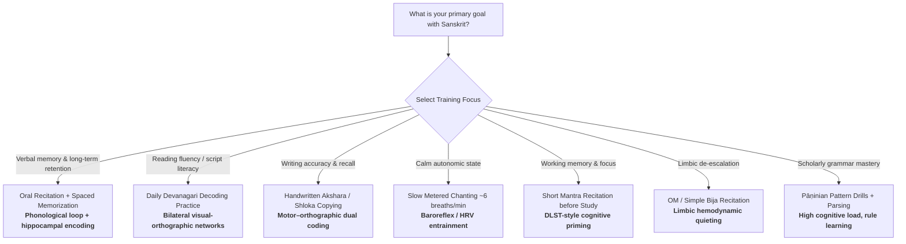

## Why Neuroscientists Study Sanskrit

Sanskrit is often marketed as a “divine” or uniquely vibrational language. Strip away mysticism, and what remains is still scientifically interesting: a highly structured classical language, an alphasyllabic writing system (**Devanagari**), and—most famously—an oral training tradition in which Vedic specialists memorize and recite tens of thousands of words with exacting phonetic precision.

In 2016, structural MRI of professional Vedic Sanskrit pandits revealed large differences in **gray matter density** and **cortical thickness** across language, memory, and visual systems compared with matched controls—findings popularized as the **“Sanskrit Effect.”** Separately, fMRI of Devanagari reading shows a more **bilateral** visual-word network than typical alphabetic scripts, reflecting the script’s complex visuospatial layout. Sanskrit *recitation* also overlaps with measured autonomic and limbic effects of mantra chanting (HRV entrainment, limbic deactivation, working-memory gains in selected trials).

This guide reviews peer-reviewed evidence on:

1. **Oral Sanskrit memorization and brain structure**
2. **Reading Devanagari / Sanskrit text**
3. **Writing and orthographic-motor practice**
4. **Recitation physiology** (breath, voice, autonomic nervous system)
5. **Practical learning protocols** grounded in what the data actually support

> [!IMPORTANT]
> **Evidence boundaries:** The strongest structural-brain findings come from **professional Vedic pandits** with ~10 years of intensive childhood-to-adulthood oral training—not from a weekend Sanskrit workshop or casual app use. Devanagari and second-language learning engage real neuroplastic mechanisms shared with other demanding linguistic training. Sanskrit is not a medical cure. Always separate **neuroplasticity from oral expertise** from unverified claims that Sanskrit syllables “reprogram DNA” or uniquely heal disease.

---

## Table of Contents

- [Why Neuroscientists Study Sanskrit](#why-neuroscientists-study-sanskrit)
- [Clinical & Cognitive Directory: What Has Been Measured](#clinical--cognitive-directory-what-has-been-measured)
- [Quick-Start Decision Matrix: How to Train](#quick-start-decision-matrix-how-to-train)
- [The Neurobiological Engine](#the-neurobiological-engine)
  - [1. The Sanskrit Effect: Structural MRI of Vedic Pandits](#1-the-sanskrit-effect-structural-mri-of-vedic-pandits)
  - [2. Verbal Working Memory and the Phonological Loop](#2-verbal-working-memory-and-the-phonological-loop)
  - [3. Reading Devanagari: A Bilateral Visual-Language Network](#3-reading-devanagari-a-bilateral-visual-language-network)
  - [4. Writing Sanskrit: Motor–Orthographic Encoding](#4-writing-sanskrit-motororthographic-encoding)
  - [5. Recitation Physiology: Breath, Voice, Limbic Tone](#5-recitation-physiology-breath-voice-limbic-tone)
  - [6. Second-Language Plasticity: Sanskrit in a Broader Frame](#6-second-language-plasticity-sanskrit-in-a-broader-frame)
- [Sanskrit Reading vs. Writing vs. Reciting](#sanskrit-reading-vs-writing-vs-reciting)
- [Grammar, Phonetics, and Why the Language Is Cognitively Demanding](#grammar-phonetics-and-why-the-language-is-cognitively-demanding)
- [Where Sanskrit Training Is Used](#where-sanskrit-training-is-used)
- [How to Practice: Evidence-Aligned Protocols](#how-to-practice-evidence-aligned-protocols)
- [Myths vs. Measured Science](#myths-vs-measured-science)
- [Frequently Asked Questions (FAQ)](#frequently-asked-questions-faq)
- [References and Verified Clinical Studies](#references-and-verified-clinical-studies)

---

## Clinical & Cognitive Directory: What Has Been Measured

| Domain / Outcome | Sanskrit-Related Protocol | Physiological / Neural Mechanism | Key Finding | Usefulness | Primary Citation |
| :--- | :--- | :--- | :--- | :--- | :--- |
| **Structural brain plasticity (language/memory/visual systems)** | Long-term Vedic Sanskrit oral memorization & exact recitation (~10 years; 40k–100k+ word texts) | Experience-dependent gray matter & cortical thickness changes in hippocampus, lateral temporal cortex, ACC | **Massive GM density and cortical thickness increases** vs. matched controls; right hippocampal GM increase across large portion of structure | Model of extreme verbal-memory expertise | [Hartzell et al., 2016](https://doi.org/10.1016/j.neuroimage.2015.07.027) |
| **Hippocampal morphometry parallel** | Same pandit cohort (compared conceptually to spatial experts) | Region-specific hippocampal specialization with expertise | Hippocampal pattern analogous to expert navigators / strong verbal WM | Shows oral text mastery reshapes memory anatomy | [Hartzell et al., 2016](https://doi.org/10.1016/j.neuroimage.2015.07.027); [Maguire et al., 2000](https://doi.org/10.1073/pnas.070039597) |
| **Devanagari visual word recognition** | Loud naming of Hindi/Devanagari words (fMRI) | Alphasyllabic script with complex visuospatial symbol layout | **Bilateral** occipito-temporal, inferior frontal, precentral activation (vs. more left-lateralized alphabetic reading) | Reading practice taxes visual–spatial orthography networks | [Singh & Rao, 2014](https://doi.org/10.4103/0971-3026.130691) |
| **Working memory / substitution task** | Gayatri Mantra chanting vs. poem chanting | Attention + phonological rehearsal under timed cognitive load | Net DLST improvement **21.67%** after Gayatri vs. **4.85%** after poem | Short recitation may sharpen cognitive throughput | [Pradhan & Derle, 2012](https://doi.org/10.4103/0257-7941.118540) |
| **Short-term memory & attention** | Sound-focused meditation techniques (incl. mantra-related Preksha protocols) | Attentional control + affective regulation | Improved short-term memory, attention, and affect in college students | Complementary cognitive hygiene | [Pragya et al., 2021](https://doi.org/10.3389/fpsyg.2021.607573) |
| **Limbic hemodynamic deactivation** | OM (*AUM*) chanting during fMRI | Reduced activity in amygdala/hippocampus/ACC/OFC networks | Significant bilateral deactivation in limbic and related regions vs. rest | Recitation as limbic down-regulation adjunct | [Kalyani et al., 2011](https://doi.org/10.4103/0973-6131.78171) |
| **Cardiovascular autonomic resonance** | Yoga mantras / metered prayer ~6 breaths/min | Baroreflex and Mayer-wave (0.1 Hz) entrainment | Increased baroreflex sensitivity during paced recitation | Breath-coupled Sanskrit/mantra pacing | [Bernardi et al., 2001](https://doi.org/10.1136/bmj.323.7327.1446) |
| **Nasal nitric oxide (vocal resonance)** | Humming (related vocal physiology) | Oscillatory nasal–sinus gas exchange | ~**15-fold** nasal NO increase during humming | Voice-breath practice benefits airway signaling | [Weitzberg & Lundberg, 2002](https://doi.org/10.1164/rccm.200202-138BC) |
| **Second-language gray matter (general)** | Adult L2 proficiency / bilingual experience | Left inferior parietal structural plasticity | Higher L2 proficiency ↔ greater left IPL grey-matter density | Frames Sanskrit study as demanding L2/L3 training | [Mechelli et al., 2004](https://doi.org/10.1038/431757a) |

---

## Quick-Start Decision Matrix: How to Train



### At-a-Glance Practice Table

| Goal | Primary Practice | Dose Starter | Why It Maps to Physiology |
| :--- | :--- | :--- | :--- |
| Build verbal memory | Memorize short *śloka*s with exact pronunciation | 15–25 min/day, spaced review | Phonological loop + long-term verbal encoding |
| Learn the script | Read linear then complex Devanagari words aloud | 10–20 min/day | Bilateral visual-word network demand |
| Strengthen recall | Handwrite verses / paradigms | 10–15 min after reading | Motor encoding supports retention |
| Autonomic calm | Metered chanting | 5–12 min | 0.1 Hz cardiovascular coupling |
| Study priming | Brief mantra before DLST-like work | 5–10 min | Attention / net cognitive score gains in trials |

---

## The Neurobiological Engine

```
                  ┌────────────────────────────────────────────────────────┐
                  │   SANSKRIT TRAINING (Oral + Script + Grammar Load)     │
                  └───────────────────────────┬────────────────────────────┘
                                              │
             ┌────────────────────────────────┼──────────────────────────────┐
             ▼                                ▼                              ▼
┌───────────────────────────┐    ┌───────────────────────────┐   ┌───────────────────────────┐
│   MEMORY SYSTEMS          │    │   LANGUAGE / VISUAL       │   │   AUTONOMIC / LIMBIC      │
├───────────────────────────┤    ├───────────────────────────┤   ├───────────────────────────┤
│ • Hippocampus (esp. right │    │ • Lateral temporal cortex │   │ • Baroreflex / 0.1 Hz     │
│   pattern encoding)       │    │ • Bilateral occipito-temp │   │   cardiovascular rhythm   │
│ • Anterior cingulate      │    │   (Devanagari complexity) │   │ • Limbic deactivation     │
│ • Phonological loop       │    │ • Inferior frontal /      │   │   during OM chanting      │
│                           │    │   precentral articulation │   │ • Nasal NO with humming   │
└───────────────────────────┘    └───────────────────────────┘   └───────────────────────────┘
```

### 1. The Sanskrit Effect: Structural MRI of Vedic Pandits

Hartzell and colleagues scanned professional Vedic Sanskrit pandits who train from childhood for about **10 years**, mastering exact pronunciation and invariant content of oral texts often **40,000–100,000+ words** ([Hartzell et al., 2016](https://doi.org/10.1016/j.neuroimage.2015.07.027)).

Relative to matched controls, pandit brains showed:

- Large increases in **gray matter density** and **cortical thickness** in language, memory, and visual systems
- Involvement of **bilateral lateral temporal cortices**
- Changes in **anterior cingulate cortex** and **hippocampus**—regions tied to short- and long-term memory
- Hippocampal morphometry patterns resembling other extreme expertise groups (e.g., navigational specialists)

Hartzell later summarized that pandits showed substantial grey-matter advantages across hemispheres and that the **right hippocampus**—especially relevant for precise sound-pattern encoding—showed grey-matter increases across a large fraction of the structure.

**Interpretation (careful):** This is evidence that **intensive, years-long oral Sanskrit memorization** is associated with atypical brain anatomy. It is **not** proof that any Sanskrit exposure automatically “grows the brain,” nor that Sanskrit is the only language that can drive verbal-memory plasticity.

### 2. Verbal Working Memory and the Phonological Loop

Exact Sanskrit recitation continuously loads:

- **Articulatory rehearsal** (saying sequences precisely)
- **Phonological short-term store** (holding sound strings)
- **Error monitoring** (rejecting even tiny deviations)

That combination is a natural high-intensity workout for verbal working memory. Controlled comparisons of Gayatri Mantra vs. poem chanting found larger Digit Letter Substitution Task gains after mantra sessions (**21.67%** vs **4.85%** net score improvement) ([Pradhan & Derle, 2012](https://doi.org/10.4103/0257-7941.118540)).

### 3. Reading Devanagari: A Bilateral Visual-Language Network

Devanagari is an **alphasyllabary**: consonant signs with vowel diacritics and conjunct ligatures create a denser visuospatial page than simple left-to-right alphabetic strings.

In an fMRI study of native Hindi/Devanagari readers naming words aloud ([Singh & Rao, 2014](https://doi.org/10.4103/0971-3026.130691)):

- Accuracy was high (~97.6%)
- Reading activated **bilateral** occipito-temporal, inferior frontal, and precentral regions
- Authors attributed extra activations (vs. typical left-lateralized alphabetic reading) to **increased visual processing demands** from complex symbol arrangement

**Practical implication:** Learning to *read* Sanskrit/Devanagari is not only linguistic—it is a visual-spatial decoding skill that recruits a broader reading network.

### 4. Writing Sanskrit: Motor–Orthographic Encoding

Writing akṣaras by hand engages:

- Fine-motor cortex and cerebellar timing
- Orthographic working memory
- Dual coding (visual form + kinesthetic stroke sequence)

Educational psychology consistently finds that **longhand encoding** often supports deeper processing than passive re-reading or shallow laptop transcription for conceptual material ([Mueller & Oppenheimer, 2014](https://doi.org/10.1177/0956797614524581)). For Sanskrit learners, copying paradigms, sandhi examples, and short verses by hand is a low-tech way to strengthen retention—especially when paired with speaking aloud.

### 5. Recitation Physiology: Breath, Voice, Limbic Tone

Sanskrit practice is frequently *spoken*, which adds body-level physiology:

| Recitation Feature | Body System Effect | Evidence Anchor |
| :--- | :--- | :--- |
| Metered pacing (~6 breaths/min) | Baroreflex / cardiovascular resonance | [Bernardi et al., 2001](https://doi.org/10.1136/bmj.323.7327.1446) |
| OM chanting | Limbic hemodynamic deactivation | [Kalyani et al., 2011](https://doi.org/10.4103/0973-6131.78171) |
| Humming / nasal resonance | Large nasal nitric oxide surge | [Weitzberg & Lundberg, 2002](https://doi.org/10.1164/rccm.200202-138BC) |
| Sustained attention to sound | Cognitive priming / WM task gains | [Pradhan & Derle, 2012](https://doi.org/10.4103/0257-7941.118540) |

For a disease-by-mantra clinical matrix, see the companion draft *Scientific Benefits of Mantra Chanting*.

### 6. Second-Language Plasticity: Sanskrit in a Broader Frame

Adult second-language experience can increase grey-matter density in language-related cortex; Mechelli et al. showed left inferior parietal density scaling with L2 proficiency ([Mechelli et al., 2004](https://doi.org/10.1038/431757a)).

Sanskrit as an L2/L3 sits in that general bilingualism/plasticity literature—with unique intensifiers when paired with:

- High morphological complexity
- Precise phonetic categories (aspirates, retroflexes, vocalic length)
- Oral-performance accuracy demands

---

## Sanskrit Reading vs. Writing vs. Reciting

| Mode | Primary Neural Load | Body Involvement | Best For | Evidence Notes |
| :--- | :--- | :--- | :--- | :--- |
| **Reading (silent)** | Visual orthography → phonology → meaning | Minimal motor | Vocabulary, grammar parsing | Devanagari bilateral visual demand |
| **Reading aloud** | + articulation / auditory feedback | Breath, larynx | Fluency, pronunciation | Adds phonological loop rehearsal |
| **Writing** | Orthography + fine motor sequences | Hand/arm proprioception | Retention of forms & sandhi | Motor dual-coding advantage |
| **Memorized recitation** | Long-term verbal memory + error monitoring | Full vocal–respiratory loop | Deep retention, expertise | Strongest MRI findings in pandits |
| **Metered chanting** | Attention + autonomic pacing | HRV / baroreflex | Calm focus | Overlaps mantra physiology |

**Optimal learner stack:** read → write → recite → recall without looking → spaced repetition.

---

## Grammar, Phonetics, and Why the Language Is Cognitively Demanding

Sanskrit’s classical descriptive grammar (Pāṇini’s *Aṣṭādhyāyī*) is famous among linguists for rule density and formal compression. For a learner’s brain, the practical load includes:

1. **Phonetics (*śikṣā*):** contrasts such as aspirated vs. unaspirated stops, dental vs. retroflex places, and vowel length require fine auditory discrimination and precise articulatory motor control.
2. **Morphology:** rich inflection forces continuous combinatorial processing (case, number, gender, tense/mood).
3. **Sandhi:** phonological fusion across word boundaries trains predictive auditory and orthographic segmentation.
4. **Meter (*chandas*):** verse constraints add rhythmic working-memory scaffolding—useful for memorization.

None of this requires mystical claims: **high structure + high precision + high repetition** is a recipe for neuroplastic change in language and memory systems.

---

## Where Sanskrit Training Is Used

```
┌────────────────────────────────────────────────────────────────────────┐
│                         APPLICATION CONTEXTS                           │
├──────────────────────────────┬─────────────────────────────────────────┤
│ EDUCATION & COGNITION        │ CONTEMPLATIVE / AUTONOMIC               │
│ • Classical language study   │ • Mantra / OM recitation                │
│ • Memory training (śloka)    │ • Breath-paced chanting                 │
│ • Linguistics / NLP history  │ • Attention priming before study        │
├──────────────────────────────┼─────────────────────────────────────────┤
│ LITERACY & SCRIPT            │ RESEARCH MODELS                         │
│ • Devanagari reading clinics │ • Extreme verbal-memory expertise MRI   │
│ • Akṣara handwriting drills  │ • Alphasyllabic reading networks        │
│ • Second-script acquisition  │ • L2 structural plasticity comparisons  │
└──────────────────────────────┴─────────────────────────────────────────┘
```

---

## How to Practice: Evidence-Aligned Protocols

### Protocol A — Beginner Script Literacy (Reading)
1. Learn independent vowels and consonants, then mātrās (vowel signs).
2. Read **linear** words first (fewer stacked ligatures), then complex conjuncts.
3. Name words **aloud** 10–20 minutes daily (mirrors Devanagari naming paradigms used in imaging).
4. Track accuracy before speed.

### Protocol B — Writing for Retention
1. After reading a verse or paradigm, **handwrite** it once slowly.
2. Cover the model; rewrite from memory.
3. Speak each line while writing to bind motor + phonological codes.
4. 10–15 minutes/session.

### Protocol C — Oral Memory (Śloka Ladder)
1. Choose a short verse (2–4 lines).
2. Listen → echo → solo recite → eyes-closed recite.
3. Demand **exact** pronunciation (the pandit tradition’s active ingredient is precision + volume of text).
4. Use spaced repetition: same day, next day, day 3, day 7.
5. Gradually increase total memorized lines across months—not hours.

### Protocol D — Autonomic Chant Block
1. Sit upright; soften gaze or close eyes.
2. Recite a short mantra or OM at ~**6 cycles/minute** for 5–12 minutes.
3. Optional: end with quiet humming for nasal resonance.
4. Use before study or sleep wind-down.

### Protocol E — Cognitive Priming Before Deep Work
1. 5–10 minutes of focused mantra/verse recitation.
2. Immediately start a demanding verbal task (language drills, reading comprehension, coding with documentation).
3. Inspired by greater DLST gains after Gayatri vs. ordinary poem chanting.

### Protocol F — Scholarly Grammar Load
1. Daily mini-drills: one sandhi rule, one noun paradigm, five parsed forms.
2. Explain the rule aloud (generation effect).
3. Keep sessions short but consistent—plasticity favors repetition over cramming.

---

## Myths vs. Measured Science

| Popular Claim | Evidence-Based Status |
| :--- | :--- |
| “Sanskrit uniquely rewires every human brain after a few lessons” | **Overstated.** Strong MRI data are from elite, long-term Vedic memorization experts. |
| “Devanagari reading is purely left-hemisphere like English” | **Incomplete.** fMRI shows robust **bilateral** networks linked to script complexity. |
| “Any Sanskrit chanting enlarges the hippocampus” | **Unproven for casual dose.** Hippocampal findings are expertise-associated, not dose-proven for beginners. |
| “Sanskrit syllables cure disease by vibration alone” | **Not established** as a general medical mechanism; some *recitation* effects (autonomic, limbic, NO) are real but shared with other paced vocal practices. |
| “Writing doesn’t matter; only listening does” | **Weak advice.** Handwriting supports encoding; combine modalities. |
| “Only Sanskrit—not other oral traditions—can train verbal memory” | **False exclusivity.** Extreme oral training in any language could plausibly drive plasticity; Sanskrit pandit tradition is a well-studied *instance*. |

---

## Frequently Asked Questions (FAQ)

### 1. Do I need to be religious to get brain benefits?
**No.** The measured effects tracked in research are tied to **memory load, phonetic precision, script decoding, and paced vocalization**—not belief.

### 2. Is listening to Sanskrit audio enough?
**Helpful, but incomplete.** Passive builds familiarity; **active recall, aloud recitation, and writing** drive stronger encoding.

### 3. How long before anything changes?
- **Session-scale (minutes):** attention, calm, autonomic pacing with chanting.
- **Weeks–months:** reading fluency, working-memory task familiarity, vocabulary.
- **Years of intensive oral mastery:** the structural profile seen in pandit MRI studies.

### 4. Should I learn grammar or chanting first?
If your goal is **calm/focus**, start with simple recitation. If your goal is **literacy and scholarship**, prioritize script + core morphology, then add memorized verse.

### 5. Is Devanagari harder on the brain than the Latin alphabet?
It is **visuospatially denser**, recruiting a more bilateral reading network in imaging studies. “Harder” depends on your prior scripts; it is a different computational demand, not a mystical one.

### 6. Can Sanskrit study help age-related memory decline?
Intensive verbal learning and multilingual engagement are plausible cognitive-reserve strategies in general. Sanskrit-specific dementia RCTs are not at the level of music-therapy dementia literature; treat it as **cognitively enriching practice**, not a proven dementia drug.

---

## References and Verified Clinical Studies

1. **Sanskrit Pandit Structural MRI (“Sanskrit Effect”):** Hartzell JF, Davis B, Melcher D, et al. (2016). *Brains of verbal memory specialists show anatomical differences in language, memory and visual systems.* Neuroimage. [PMID: 26188261](https://pubmed.ncbi.nlm.nih.gov/26188261/) | [DOI: 10.1016/j.neuroimage.2015.07.027](https://doi.org/10.1016/j.neuroimage.2015.07.027)
2. **Devanagari Reading fMRI:** Singh NC, Rao C. (2014). *Reading in Devanagari: Insights from functional neuroimaging.* Indian J Radiol Imaging. [PMC4028913](https://pmc.ncbi.nlm.nih.gov/articles/PMC4028913/) | [DOI: 10.4103/0971-3026.130691](https://doi.org/10.4103/0971-3026.130691)
3. **Gayatri Mantra vs Poem Chanting (DLST Working Memory):** Pradhan B, Derle SG. (2012). *Comparison of effect of Gayatri Mantra and Poem Chanting on Digit Letter Substitution Task.* Anc Sci Life. [PMC3807963](https://pmc.ncbi.nlm.nih.gov/articles/PMC3807963/) | [DOI: 10.4103/0257-7941.118540](https://doi.org/10.4103/0257-7941.118540)
4. **Meditation Techniques, Memory & Attention:** Pragya SU, Mehta ND, Abomoelak B, et al. (2021). *Effects of Combining Meditation Techniques on Short-Term Memory, Attention, and Affect in Healthy College Students.* Front Psychol. [PMC7973112](https://pmc.ncbi.nlm.nih.gov/articles/PMC7973112/) | [DOI: 10.3389/fpsyg.2021.607573](https://doi.org/10.3389/fpsyg.2021.607573)
5. **OM Chanting fMRI Limbic Deactivation:** Kalyani BG, Venkatasubramanian G, Arasappa R, et al. (2011). *Neurohemodynamic correlates of 'OM' chanting: A pilot functional magnetic resonance imaging study.* Int J Yoga. [PMC3099099](https://pmc.ncbi.nlm.nih.gov/articles/PMC3099099/) | [DOI: 10.4103/0973-6131.78171](https://doi.org/10.4103/0973-6131.78171)
6. **Metered Mantra / Prayer Autonomic Rhythms:** Bernardi L, Sleight P, Bandinelli G, et al. (2001). *Effect of rosary prayer and yoga mantras on autonomic cardiovascular rhythms: comparative study.* BMJ. [PMC61046](https://pmc.ncbi.nlm.nih.gov/articles/PMC61046/) | [DOI: 10.1136/bmj.323.7327.1446](https://doi.org/10.1136/bmj.323.7327.1446)
7. **Humming & Nasal Nitric Oxide:** Weitzberg E, Lundberg JO. (2002). *Humming Greatly Increases Nasal Nitric Oxide.* Am J Respir Crit Care Med. [PMID: 12119224](https://pubmed.ncbi.nlm.nih.gov/12119224/) | [DOI: 10.1164/rccm.200202-138BC](https://doi.org/10.1164/rccm.200202-138BC)
8. **Bilingual Brain Structural Plasticity:** Mechelli A, Crinion JT, Noppeney U, et al. (2004). *Neurolinguistics: structural plasticity in the bilingual brain.* Nature. [PMID: 15483594](https://pubmed.ncbi.nlm.nih.gov/15483594/) | [DOI: 10.1038/431757a](https://doi.org/10.1038/431757a)
9. **Expertise & Hippocampal Morphometry (Spatial Parallel):** Maguire EA, Gadian DG, Johnsrude IS, et al. (2000). *Navigation-related structural change in the hippocampi of taxi drivers.* Proc Natl Acad Sci U S A. [PMC18253](https://pmc.ncbi.nlm.nih.gov/articles/PMC18253/) | [DOI: 10.1073/pnas.070039597](https://doi.org/10.1073/pnas.070039597)
10. **Longhand Encoding Advantage (Educational Parallel):** Mueller PA, Oppenheimer DM. (2014). *The Pen Is Mightier Than the Keyboard: Advantages of Longhand Over Laptop Note Taking.* Psychol Sci. [DOI: 10.1177/0956797614524581](https://doi.org/10.1177/0956797614524581)
