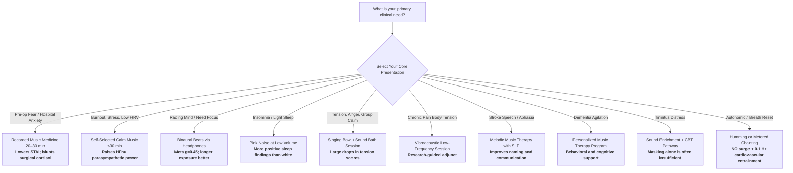

## Why Modern Science is Studying Sound Therapy

Sound is not merely entertainment. Pressure waves enter the ear, become neural spikes in the auditory nerve, and rapidly influence limbic emotion circuits, brainstem autonomic nuclei, cortical oscillations, and—when vibration couples into the body—somatosensory and visceral mechanoreceptors.

Across cultures, chanting, drumming, singing bowls, lullabies, and temple bells have been used to calm distress, mark ritual time, and support healing. Contemporary medicine reframes these practices as **auditory and vibroacoustic interventions** that can be measured with **heart rate variability (HRV)**, **salivary cortisol**, **EEG frequency-following responses**, **functional neuroimaging**, and **randomized controlled trials**.

The clinical literature shows that structured sound exposure can:

- **Raise parasympathetic tone:** Music interventions increase high-frequency HRV (HFnu) and lower low-frequency HRV (LFnu), especially in stress, anxiety, and sleep-disturbed populations.
- **Blunt surgical neuroendocrine stress:** Perioperative music attenuates the cortisol stress response to surgery (pooled SMD ≈ −0.30).
- **Reduce preoperative anxiety:** Cochrane evidence finds music listening lowers STAI anxiety more than standard care—and in one large study outperformed midazolam for anxiety reduction.
- **Support neurological recovery:** Music-based protocols aid post-stroke language recovery and dementia-related cognitive/behavioral symptoms.
- **Modulate brain rhythms and sleep:** Auditory beats and pink-noise protocols can alter EEG and sleep architecture; evidence quality varies by modality.
- **Engage breath–voice physiology:** Humming and metered chanting boost nasal nitric oxide and entrain cardiovascular rhythms near 0.1 Hz (covered in depth in the companion draft *Scientific Benefits of Mantra Chanting*).

This guide maps **what sound therapy is**, **where clinicians use it**, **how it changes physiology**, and **how to practice evidence-aligned protocols**—while separating validated interventions from mystical claims that sound “reprograms DNA” or “cleanses auras.”

> [!IMPORTANT]
> **Clinical & Medical Context:** Sound and music interventions are **complementary, non-pharmacological tools**. They support anxiety reduction, autonomic regulation, sleep hygiene, tinnitus management adjuncts, and neurorehab—but they do **not** replace surgery, antibiotics, psychiatric care, or emergency medicine. People with seizure disorders, severe tinnitus distress, PTSD with sound triggers, or implanted devices should consult clinicians before intense vibroacoustic or beat-stimulation protocols. Loud sound can damage hearing; keep volumes safe.

---

## Table of Contents

- [Why Modern Science is Studying Sound Therapy](#why-modern-science-is-studying-sound-therapy)
- [What Counts as Sound Therapy?](#what-counts-as-sound-therapy)
- [Clinical Disease-to-Sound Directory](#clinical-disease-to-sound-directory)
- [Quick-Start Decision Matrix: Which Sound Protocol?](#quick-start-decision-matrix-which-sound-protocol)
- [The Physiological Engine: How Sound Changes the Body](#the-physiological-engine-how-sound-changes-the-body)
  - [1. Auditory Pathways → Limbic and Autonomic Centers](#1-auditory-pathways--limbic-and-autonomic-centers)
  - [2. Heart Rate Variability and Vagal Tone](#2-heart-rate-variability-and-vagal-tone)
  - [3. HPA Axis and Cortisol](#3-hpa-axis-and-cortisol)
  - [4. Brainwave Entrainment and EEG](#4-brainwave-entrainment-and-eeg)
  - [5. Respiratory Coupling, Humming, and Nitric Oxide](#5-respiratory-coupling-humming-and-nitric-oxide)
  - [6. Vibrotactile and Mechanoreceptor Pathways](#6-vibrotactile-and-mechanoreceptor-pathways)
- [Major Sound Therapy Modalities](#major-sound-therapy-modalities)
  - [Music Therapy vs. Music Medicine](#music-therapy-vs-music-medicine)
  - [Binaural and Monaural Beats](#binaural-and-monaural-beats)
  - [Singing Bowls and Sound Baths](#singing-bowls-and-sound-baths)
  - [White Noise, Pink Noise, and Sleep Sound](#white-noise-pink-noise-and-sleep-sound)
  - [Vibroacoustic Therapy](#vibroacoustic-therapy)
  - [Tinnitus Sound Therapy](#tinnitus-sound-therapy)
  - [Chanting, Mantra, and Vocal Sound](#chanting-mantra-and-vocal-sound)
- [Where Sound Therapy Is Used in Clinical Practice](#where-sound-therapy-is-used-in-clinical-practice)
- [How to Use Sound Therapy: Practical Protocols](#how-to-use-sound-therapy-practical-protocols)
- [Safety, Myths, and Limits of Evidence](#safety-myths-and-limits-of-evidence)
- [Frequently Asked Questions (FAQ)](#frequently-asked-questions-faq)
- [References and Verified Clinical Studies](#references-and-verified-clinical-studies)

---

## What Counts as Sound Therapy?

| Modality | What It Is | Primary Delivery | Evidence Strength (Overview) |
| :--- | :--- | :--- | :--- |
| **Music therapy** | Credentialed therapist uses live/interactive music toward clinical goals | In-person / telehealth sessions | Strong for anxiety, dementia support, selected neurorehab outcomes |
| **Music medicine** | Recorded music listening without a music therapist | Headphones, speakers, apps | Strong for preoperative anxiety and perioperative stress markers |
| **Binaural / monaural beats** | Two tones create a perceived beat frequency | Headphones (binaural) or speakers (monaural) | Moderate meta-analytic effects on anxiety/cognition/pain; heterogeneous |
| **Singing bowl / sound bath** | Metal/crystal bowls, gongs, sustained harmonic spectra | Live group or solo sessions | Observational mood/tension benefits; fewer large RCTs |
| **Pink / white noise** | Broadband noise with different spectral slopes | Speakers, sleep devices | Pink noise more often positive for sleep outcomes than white noise |
| **Vibroacoustic therapy (VAT)** | Low-frequency sound vibration delivered to the body | Specialized chairs/beds/mats | Emerging for pain; scoping-review stage |
| **Tinnitus sound therapy** | Masking, enrichment, or modulated sound | Hearing aids, sound generators | Mixed Cochrane evidence for masking alone; often combined with CBT |
| **Vocal / mantra sound** | Humming, chanting, paced vocalization | Self-practice or group | Strong autonomic and NO physiology in selected studies |

---

## Clinical Disease-to-Sound Directory

| Clinical Condition / Domain | Sound Protocol Studied | Physiological Mechanism | Key Quantitative Finding | Clinical Usefulness | Primary Citation |
| :--- | :--- | :--- | :--- | :--- | :--- |
| **Preoperative Anxiety** | Music listening vs. standard care | Reduces sympathetic arousal; attentional distraction | STAI anxiety reduction **5.72 units greater** than control ($p < 0.00001$); one large study ≥ midazolam for anxiety | Routine pre-op adjunct; low cost | [Bradt et al., Cochrane 2013](https://doi.org/10.1002/14651858.CD006908.pub2) |
| **Surgical Stress / Cortisol** | Perioperative music | Attenuates HPA neuroendocrine stress response | Pooled **SMD −0.30** for cortisol ($p = 0.01$, $I^2 = 0$) | ERAS / peri-op recovery support | [Fu et al., 2019](https://doi.org/10.1016/j.jss.2019.06.052) |
| **Stress, Anxiety, Sleep-Related Autonomic Imbalance** | Music intervention (meta-analysis of 24 RCTs, $n = 1{,}295$) | Raises parasympathetic HF-HRV; lowers LF-HRV | **HFnu MD +7.05** ($p = 0.02$); **LFnu MD −4.94** ($p = 0.02$); strongest in emotional disorders | Short sessions ≤30 min; prefer self-selected music | [Zhang et al., 2026](https://doi.org/10.3389/fpsyg.2026.1750786) |
| **Acute Stress / Anxiety Biomarkers** | Indian raga listening RCT ($n = 140$) | Modulates sAA, state anxiety, HRV | Raga *Puriya* reduced state anxiety ($p = 0.018$); all groups lowered salivary α-amylase | Preference-sensitive music medicine | [Kunikullaya et al., 2022](https://doi.org/10.3390/ejihpe12100108) |
| **Anxiety / Cognition / Pain (Beats)** | Binaural auditory beats | Putative frequency-following / attentional modulation | Meta-analysis overall **Hedges’ $g = 0.45$**; longer exposure better | Focus/anxiety adjunct; headphones required | [Garcia-Argibay et al., 2019](https://doi.org/10.1007/s00426-018-1066-8) |
| **Late-Life Poor Sleep & Depression** | Binaural beat music in long-term care | Sleep quality + HRV + mood pathways | RCT in older adults with poor sleep quality testing BBM vs. control | Facility sleep hygiene adjunct | [Lin et al., 2024](https://doi.org/10.1111/ggi.14827) |
| **Adult Sleep Disturbance** | White noise, pink noise, multi-audio | Masking + possible slow-wave enhancement (pink) | Systematic review: **81.9%** of pink-noise studies positive vs. **33%** white-noise | Prefer pink noise for sleep trials; evidence still mixed overall | [Capezuti et al., 2022](https://doi.org/10.5664/jcsm.9860) |
| **Tension, Anger, Fatigue, Depressed Mood** | Tibetan singing bowl sound meditation | Multisensory entrainment; relaxation response | Significant drops in tension/anger/fatigue/depressed mood (all $p < 0.001$); naïve > experienced for tension | Community wellness; mood de-escalation | [Goldsby et al., 2017](https://doi.org/10.1177/2156587216668109) |
| **Chronic / Clinical Pain** | Vibroacoustic therapy | Low-frequency vibration + auditory pathways | Scoping review: promising pain-perception signals; protocols heterogeneous | Adjunct pain programs; research-stage dosing | [Kantor et al., 2022](https://doi.org/10.1136/bmjopen-2020-046591) |
| **Post-Stroke Aphasia** | Music therapy (melodic/intonation-based) | Recruits right-hemisphere / bilateral language-music networks | Improved **functional communication** (MD 1.45), **repetition** (MD 6.49), **naming**; comprehension NS | Speech-language rehab adjunct | [Liu et al., 2022](https://doi.org/10.1007/s10072-021-05743-9) |
| **Neurological Rehabilitation (Broad)** | Music listening, singing, instrument play | Neuroplastic auditory–motor coupling | Lancet Neurology review: strongest evidence in stroke and dementia | Multidisciplinary neurorehab | [Sihvonen et al., 2017](https://doi.org/10.1016/S1474-4422(17)30168-0) |
| **Alzheimer’s Disease Cognition** | Music therapy RCTs (systematic review) | Cognitive stimulation + emotional regulation | Evidence summarized across RCTs; benefits most consistent for selected behavioral/cognitive outcomes | Dementia care programs | [Bleibel et al., 2023](https://doi.org/10.1186/s13195-023-01214-9) |
| **Tinnitus** | Sound masking / enrichment | Partial masking; auditory gain recalibration | Cochrane: limited high-quality evidence for masking alone | Combine with CBT / hearing rehab | [Hobson et al., Cochrane 2012](https://doi.org/10.1002/14651858.CD006371.pub2) |
| **Cardiovascular Autonomic Resonance** | Metered prayer/mantra ~6 breaths/min | Baroreflex and Mayer-wave (0.1 Hz) entrainment | Increased baroreflex sensitivity during rosary/yoga mantra pacing | Breath-coupled vocal practice | [Bernardi et al., 2001](https://doi.org/10.1136/bmj.323.7327.1446) |
| **Sinus / Airway Nitric Oxide** | Humming | Oscillatory nasal gas exchange | ~**15-fold** surge in nasal nitric oxide | Short humming protocols; sinus support research | [Weitzberg & Lundberg, 2002](https://doi.org/10.1164/rccm.200202-138BC) |

---

## Quick-Start Decision Matrix: Which Sound Protocol?



### At-a-Glance Recommendation Table

| Goal | Best-Supported Modality | Dose Starter | Setting |
| :--- | :--- | :--- | :--- |
| Cut pre-surgery anxiety | Preferred recorded music | 20–30 min before procedure | Hospital / clinic |
| Raise vagal HRV | Self-selected calming music | ≤30 min, quiet posture | Home / office |
| Sleep onset aid | Pink noise (not loud) | Overnight or wind-down block | Bedroom |
| Acute mental tension | Singing bowl / calm music | 30–60 min session | Studio / home |
| Focus block | Binaural beats (headphones) | 15–30+ min continuous | Desk work |
| Neurorehab goals | Credentialed music therapy | Protocolized weekly sessions | Rehab unit |
| Breath–autonomic reset | Humming / mantra pacing | 5–12 min | Anywhere quiet |

---

## The Physiological Engine: How Sound Changes the Body

```
                  ┌────────────────────────────────────────────────────────┐
                  │     SOUND (Airborne Pressure ± Body Vibration)         │
                  └───────────────────────────┬────────────────────────────┘
                                              │
             ┌────────────────────────────────┼──────────────────────────────┐
             ▼                                ▼                              ▼
┌───────────────────────────┐    ┌───────────────────────────┐   ┌───────────────────────────┐
│   AUDITORY → LIMBIC       │    │   AUTONOMIC & ENDOCRINE   │   │   CORTEX / SLEEP RHYTHMS  │
├───────────────────────────┤    ├───────────────────────────┤   ├───────────────────────────┤
│ • Cochlea → CN VIII       │    │ • ↑ HF-HRV (parasymp.)    │   │ • EEG frequency following │
│ • Inferior colliculus     │    │ • ↓ LF-HRV / stress tone  │   │ • Alpha/theta facilitation│
│ • Auditory cortex         │    │ • ↓ Cortisol (peri-op)    │   │ • Slow-wave sleep support │
│ • Amygdala / reward loops │    │ • Baroreflex entrainment  │   │ • Attentional gating      │
└───────────────────────────┘    └───────────────────────────┘   └───────────────────────────┘
```

### 1. Auditory Pathways → Limbic and Autonomic Centers

Sound is transduced by cochlear hair cells, relayed through brainstem nuclei, and reaches auditory cortex—but collaterals also influence **amygdala, hippocampus, and brainstem autonomic centers**. Pleasant, predictable, preferred music tends to reduce threat signaling and support reward/opioidergic analgesia pathways; abrupt, loud, or aversive sound does the opposite.

The so-called “Mozart effect” on spatial IQ is largely explained by **arousal and mood**, not a magic composer ([Thompson et al., 2001](https://doi.org/10.1111/1467-9280.00345)). Physiology follows affective state as much as repertoire.

### 2. Heart Rate Variability and Vagal Tone

High-frequency HRV (especially HFnu) indexes cardiac vagal modulation. A 2026 meta-analysis of **24 RCTs ($n = 1{,}295$)** found music intervention significantly:

- **Increased HFnu** (MD 7.05, 95% CI 1.00–13.10, $p = 0.02$)
- **Decreased LFnu** (MD −4.94, 95% CI −9.13 to −0.76, $p = 0.02$)

Effects were strongest in people with stress/anxiety/fear/sleep problems; **sessions ≤30 minutes** and **participant-selected music** performed particularly well ([Zhang et al., 2026](https://doi.org/10.3389/fpsyg.2026.1750786)).

### 3. HPA Axis and Cortisol

Surgery and acute threat elevate cortisol. Meta-analysis shows **perioperative music attenuates the cortisol stress response** (SMD −0.30, $p = 0.01$) ([Fu et al., 2019](https://doi.org/10.1016/j.jss.2019.06.052)). Acute listening studies also show drops in salivary α-amylase (sympathetic marker) across Indian raga and control nature-sound arms ([Kunikullaya et al., 2022](https://doi.org/10.3390/ejihpe12100108)).

Cortisol findings are not universal across every music trial—timing, preference, and baseline stress matter—but perioperative attenuation is among the clearest clinical signals.

### 4. Brainwave Entrainment and EEG

When two tones differ slightly, the brain can perceive a **beat frequency**. Binaural beats (different tone per ear) require headphones; monaural beats can work over speakers. A meta-analysis of binaural-beat studies reported a medium overall effect (**$g = 0.45$**) across cognition, anxiety, and pain outcomes, with **longer exposure** improving effectiveness ([Garcia-Argibay et al., 2019](https://doi.org/10.1007/s00426-018-1066-8)).

EEG studies of monaural beats and pentatonic sequences show relaxation-related spectral changes versus silence in some designs ([Costa et al., 2024](https://doi.org/10.3389/fpsyg.2024.1369485)). Entrainment is real as a research phenomenon, but consumer “download this 40 Hz to raise IQ” marketing oversells the data.

### 5. Respiratory Coupling, Humming, and Nitric Oxide

Vocal sound adds a **respiratory–laryngeal loop**:

- Metered chanting/prayer near **6 breaths/min** synchronizes cardiovascular rhythms and can raise baroreflex sensitivity ([Bernardi et al., 2001](https://doi.org/10.1136/bmj.323.7327.1446)).
- Humming can increase nasal nitric oxide about **15-fold**, a vasodilatory/antimicrobial airway signal ([Weitzberg & Lundberg, 2002](https://doi.org/10.1164/rccm.200202-138BC)).

For a full mantra-specific clinical matrix, see the companion draft *Scientific Benefits of Mantra Chanting*.

### 6. Vibrotactile and Mechanoreceptor Pathways

Low-frequency sound can be felt as vibration. **Vibroacoustic therapy** delivers controlled vibration to the body surface, engaging skin and deep mechanoreceptors plus auditory input. A BMJ Open scoping review found encouraging signals for adult pain management but heterogeneous methods—so dosing remains clinician/research guided ([Kantor et al., 2022](https://doi.org/10.1136/bmjopen-2020-046591)).

---

## Major Sound Therapy Modalities

### Music Therapy vs. Music Medicine

- **Music therapy:** A board-certified / credentialed music therapist assesses goals (pain, agitation, speech, mood) and uses interactive techniques (songwriting, singing, instrument play, guided listening).
- **Music medicine:** Passive listening to recorded tracks—widely studied in surgery, ICU, and outpatient stress contexts.

**Practical tip:** For HRV and anxiety, **your preferred calming music often beats a standardized “healing playlist.”** Meta-analytic subgroups favor self-selection.

### Binaural and Monaural Beats

| Feature | Binaural Beats | Monaural Beats |
| :--- | :--- | :--- |
| Delivery | Headphones mandatory | Speakers OK |
| Mechanism | Central integration of interaural frequency difference | Physical amplitude modulation in the air/ear |
| Best-studied aims | Anxiety ↓, attention/memory modulation, analgesia signals | Relaxation EEG studies; attention paradigms |
| Starter use | 15–30 min; moderate volume; theta/alpha ranges often used for calm | Same duration principles |

Do not drive or operate machinery if beats make you drowsy.

### Singing Bowls and Sound Baths

Observational work on Tibetan singing bowl meditation found significant reductions in tension, anger, fatigue, and depressed mood (all $p < 0.001$), with larger tension drops in meditation-naïve participants ([Goldsby et al., 2017](https://doi.org/10.1177/2156587216668109)).

Treat bowls as **multi-harmonic relaxation rituals**, not guaranteed “frequency medicine” for curing disease. Prefer moderate volume; protect hearing near large gongs.

### White Noise, Pink Noise, and Sleep Sound

| Noise Type | Spectrum | Sleep Evidence Snapshot |
| :--- | :--- | :--- |
| **White** | Equal power per Hz | Fewer positive trials (~33% in one systematic review) |
| **Pink** | More energy at lower frequencies | Higher share of positive sleep outcomes (~82%) |
| **Brown/red** | Even heavier low-frequency emphasis | Popular consumer use; less formal trial coverage than pink |

Use low volume—noise should mask disturbances, not become a stressor ([Capezuti et al., 2022](https://doi.org/10.5664/jcsm.9860)).

### Vibroacoustic Therapy

Used in some pain, relaxation, and special-needs settings via vibrating mattresses/chairs. Evidence is promising but not protocol-standardized; seek practitioners who document frequency, amplitude, and session length.

### Tinnitus Sound Therapy

Sound enrichment/masking can reduce contrast of tinnitus percept for some patients, but Cochrane reviews caution that **masking alone has limited high-quality evidence**. Best practice usually combines audiology fitting + **CBT for tinnitus** + optional sound therapy ([Hobson et al., 2012](https://doi.org/10.1002/14651858.CD006371.pub2)).

### Chanting, Mantra, and Vocal Sound

Active vocalization uniquely couples breath, larynx, and cranial vibration. Use for autonomic reset and airway NO; details and disease matrices live in the mantra science draft.

---

## Where Sound Therapy Is Used in Clinical Practice

```
┌────────────────────────────────────────────────────────────────────────┐
│                    CLINICAL & COMMUNITY DEPLOYMENT                     │
├──────────────────────────────┬─────────────────────────────────────────┤
│ HOSPITAL / SURGICAL          │ NEUROLOGY & REHAB                       │
│ • Pre-op anxiety music       │ • Post-stroke aphasia music therapy     │
│ • Intra/post-op stress music │ • Dementia agitation / cognition        │
│ • ICU/procedural distraction │ • Motor rhythmic auditory stimulation   │
├──────────────────────────────┼─────────────────────────────────────────┤
│ MENTAL HEALTH & SLEEP        │ AUDIOLOGY & PAIN                        │
│ • Anxiety / burnout music    │ • Tinnitus enrichment + CBT             │
│ • Depression adjunct music   │ • Vibroacoustic pain clinics            │
│ • Pink-noise sleep hygiene   │ • Procedural analgesia adjunct music    │
├──────────────────────────────┼─────────────────────────────────────────┤
│ COMMUNITY / WELLNESS         │ RESPIRATORY–VOICE                       │
│ • Sound baths / bowls        │ • Humming / paced chanting              │
│ • Group singing / choirs     │ • Pulmonary rehab music pacing          │
│ • Workplace calm playlists   │ • Sinus/NO research protocols           │
└──────────────────────────────┴─────────────────────────────────────────┘
```

---

## How to Use Sound Therapy: Practical Protocols

### Protocol 1 — Pre-Procedure Calm (Music Medicine)
1. Choose **self-preferred calming music** (lyrics OK if they soothe you).
2. Use comfortable headphones at conversation-level volume.
3. Listen **20–30 minutes** before anesthesia/procedure.
4. Continue briefly in recovery if staff allow.

### Protocol 2 — Daily Autonomic Reset (HRV-Oriented)
1. Sit or lie comfortably; silence notifications.
2. Play slow-tempo preferred music (often ~60–80 BPM feels settling).
3. **15–30 minutes**; longer is not always better for HRV.
4. Optional: extend exhales (4–6 seconds) without forcing strain.

### Protocol 3 — Sleep Onset (Pink Noise)
1. Set pink noise to a low, steady level.
2. Start 30–60 minutes before bed; keep overnight only if it helps.
3. If you wake more often, lower volume or stop—individual noise sensitivity matters.

### Protocol 4 — Focus Block (Binaural Beats)
1. Use stereo headphones.
2. Pick a reputable track with a stated beat frequency (many calm protocols use theta/alpha-range differences).
3. Work for **20–30+ minutes** uninterrupted; meta-analysis favors longer exposure.
4. Stop if you get headache, irritability, or dizziness.

### Protocol 5 — Tension Release (Singing Bowl / Sound Bath)
1. Live session preferred for tactile + acoustic immersion; recordings are a lighter option.
2. Recline; eyes closed; no need to “think positively.”
3. 30–60 minutes; notice jaw/shoulder release.
4. Hydrate after; avoid immediate high-stress tasks if deeply relaxed.

### Protocol 6 — Vocal Humming Reset (5–10 Minutes)
1. Sit tall; inhale gently through the nose.
2. Hum on the exhale with lips closed (Bhramari-style optional).
3. 5–10 minutes; stop if ear pressure or dizziness appears.
4. Useful micro-break for autonomic downshift and nasal NO physiology.

### Protocol 7 — Clinical Neurorehab / Dementia
1. Referral to **credentialed music therapist** + speech/occupational therapy team.
2. Use **personalized familiar music** for dementia agitation.
3. For aphasia, expect structured melodic protocols—not random playlists alone.

---

## Safety, Myths, and Limits of Evidence

| Claim | Reality Check |
| :--- | :--- |
| “This frequency heals cancer / DNA” | **Unsupported.** No credible clinical evidence that consumer tones cure cancer. |
| “432 Hz is universally healing; 440 Hz is harmful” | **Overstated.** Preference and context matter more than absolute tuning mythology. |
| Music lowers surgical stress hormones | **Supported** (meta-analytic cortisol attenuation). |
| Music can reduce pre-op anxiety | **Supported** (Cochrane). |
| Binaural beats always entrain your brain to genius mode | **Overstated.** Medium average effects; large individual variability. |
| Pink noise helps some sleepers | **Plausible / mixed-positive**; not universal. |
| Louder = more healing | **False and dangerous.** Risk of noise-induced hearing loss. |
| Tinnitus masking cures tinnitus | **Incomplete.** Often needs CBT + audiology care. |

**Hearing safety:** Keep average listening below levels that cause ringing or muffled hearing. Follow occupational noise guidelines for prolonged sessions.

---

## Frequently Asked Questions (FAQ)

### 1. Is sound therapy real science or only wellness marketing?
**Both exist.** Perioperative music, HRV meta-analyses, neurorehab music therapy, and humming nitric oxide studies are real biomedical findings. Aura-cleansing frequency products are marketing.

### 2. Do I need a music therapist, or is Spotify enough?
For **surgery anxiety, daily stress, and sleep noise**, self-guided listening is often enough. For **stroke aphasia, dementia behavior plans, trauma-informed care, or complex pain**, see a credentialed music therapist.

### 3. Headphones or speakers?
- **Binaural beats:** headphones.
- **Monaural beats / music / pink noise:** either.
- **Sound baths:** speakers/live instruments for room-field immersion.

### 4. How quickly does physiology change?
- **Minutes:** HRV shifts, anxiety scores, humming NO.
- **Single perioperative window:** cortisol stress attenuation.
- **Weeks:** neurorehab language gains, dementia care outcomes, sleep habit consolidation.

### 5. Can sound therapy replace anti-anxiety medication?
**Sometimes it reduces need in procedural contexts**, but do not stop prescribed psychiatric medication without a clinician. Music is an adjunct.

### 6. What if certain sounds trigger me?
Avoid them. Trauma, misophonia, hyperacusis, and PTSD can make sound aversive. Work with clinicians on graded, preferred, controllable audio.

---

## References and Verified Clinical Studies

1. **Music Intervention & HRV Meta-Analysis (24 RCTs):** Zhang E, Wu X, Xu J, et al. (2026). *Effect of music intervention on heart rate variability: a systematic review and meta-analysis of randomized controlled trials.* Front Psychol. [PMC12976007](https://pmc.ncbi.nlm.nih.gov/articles/PMC12976007/) | [DOI: 10.3389/fpsyg.2026.1750786](https://doi.org/10.3389/fpsyg.2026.1750786)
2. **Perioperative Music & Cortisol Meta-Analysis:** Fu VX, Oomens P, Sneiders D, et al. (2019). *The Effect of Perioperative Music on the Stress Response to Surgery: A Meta-analysis.* J Surg Res. [PMID: 31326711](https://pubmed.ncbi.nlm.nih.gov/31326711/) | [DOI: 10.1016/j.jss.2019.06.052](https://doi.org/10.1016/j.jss.2019.06.052)
3. **Cochrane: Preoperative Music Anxiety:** Bradt J, Dileo C, Shim M. (2013). *Music interventions for preoperative anxiety.* Cochrane Database Syst Rev. [PMID: 23740695](https://pubmed.ncbi.nlm.nih.gov/23740695/) | [DOI: 10.1002/14651858.CD006908.pub2](https://doi.org/10.1002/14651858.CD006908.pub2)
4. **Indian Raga Listening RCT (Anxiety, sAA, HRV):** Kunikullaya Ubrangala K, Kunnavil R, Sanjeeva Vernekar M, et al. (2022). *Effect of Indian Music as an Auditory Stimulus on Physiological Measures of Stress, Anxiety, Cardiovascular and Autonomic Responses in Humans—A Randomized Controlled Trial.* Eur J Investig Health Psychol Educ. [PMC9601678](https://pmc.ncbi.nlm.nih.gov/articles/PMC9601678/) | [DOI: 10.3390/ejihpe12100108](https://doi.org/10.3390/ejihpe12100108)
5. **Binaural Beats Meta-Analysis:** Garcia-Argibay M, Santed MA, Reales JM. (2019). *Efficacy of binaural auditory beats in cognition, anxiety, and pain perception: a meta-analysis.* Psychol Res. [PMID: 30073406](https://pubmed.ncbi.nlm.nih.gov/30073406/) | [DOI: 10.1007/s00426-018-1066-8](https://doi.org/10.1007/s00426-018-1066-8)
6. **Binaural Beat Music in Older Adults (Sleep/HRV/Depression):** Lin PH, Fu SH, Lee YC, et al. (2024). *Examining the effects of binaural beat music on sleep quality, heart rate variability, and depression in older people with poor sleep quality in a long-term care institution.* Geriatr Gerontol Int. [PMID: 38319068](https://pubmed.ncbi.nlm.nih.gov/38319068/) | [DOI: 10.1111/ggi.14827](https://doi.org/10.1111/ggi.14827)
7. **Auditory Stimulation & Sleep Systematic Review:** Capezuti E, Pain K, Alamag E, et al. (2022). *Systematic review: auditory stimulation and sleep.* J Clin Sleep Med. [PMID: 34964434](https://pubmed.ncbi.nlm.nih.gov/34964434/) | [DOI: 10.5664/jcsm.9860](https://doi.org/10.5664/jcsm.9860)
8. **Singing Bowl Sound Meditation Observational Study:** Goldsby TL, Goldsby ME, McWalters M, et al. (2017). *Effects of Singing Bowl Sound Meditation on Mood, Tension, and Well-being: An Observational Study.* J Evid Based Complementary Altern Med. [PMC5871151](https://pmc.ncbi.nlm.nih.gov/articles/PMC5871151/) | [DOI: 10.1177/2156587216668109](https://doi.org/10.1177/2156587216668109)
9. **Vibroacoustic Therapy Pain Scoping Review:** Kantor J, Campbell EA, Kantorová L, et al. (2022). *Exploring vibroacoustic therapy in adults experiencing pain: a scoping review.* BMJ Open. [PMC8984038](https://pmc.ncbi.nlm.nih.gov/articles/PMC8984038/) | [DOI: 10.1136/bmjopen-2020-046591](https://doi.org/10.1136/bmjopen-2020-046591)
10. **Music-Based Neurological Rehabilitation Review:** Sihvonen AJ, Särkämö T, Leo V, et al. (2017). *Music-based interventions in neurological rehabilitation.* Lancet Neurol. [PMID: 28663005](https://pubmed.ncbi.nlm.nih.gov/28663005/) | [DOI: 10.1016/S1474-4422(17)30168-0](https://doi.org/10.1016/S1474-4422(17)30168-0)
11. **Music Therapy & Post-Stroke Aphasia Meta-Analysis:** Liu Q, Li W, Yin Y, et al. (2022). *The effect of music therapy on language recovery in patients with aphasia after stroke: a systematic review and meta-analysis.* Neurol Sci. [PMID: 34816318](https://pubmed.ncbi.nlm.nih.gov/34816318/) | [DOI: 10.1007/s10072-021-05743-9](https://doi.org/10.1007/s10072-021-05743-9)
12. **Music Therapy in Alzheimer’s Disease (RCT Review):** Bleibel M, El Cheikh A, Sadier NS, et al. (2023). *The effect of music therapy on cognitive functions in patients with Alzheimer's disease: a systematic review of randomized controlled trials.* Alzheimers Res Ther. [PMC10041788](https://pmc.ncbi.nlm.nih.gov/articles/PMC10041788/) | [DOI: 10.1186/s13195-023-01214-9](https://doi.org/10.1186/s13195-023-01214-9)
13. **Cochrane: Tinnitus Sound Therapy (Masking):** Hobson J, Chisholm E, El Refaie A. (2012). *Sound therapy (masking) in the management of tinnitus in adults.* Cochrane Database Syst Rev. [PMID: 23152235](https://pubmed.ncbi.nlm.nih.gov/23152235/) | [DOI: 10.1002/14651858.CD006371.pub2](https://doi.org/10.1002/14651858.CD006371.pub2)
14. **Rosary/Yoga Mantra Autonomic Entrainment:** Bernardi L, Sleight P, Bandinelli G, et al. (2001). *Effect of rosary prayer and yoga mantras on autonomic cardiovascular rhythms: comparative study.* BMJ. [PMC61046](https://pmc.ncbi.nlm.nih.gov/articles/PMC61046/) | [DOI: 10.1136/bmj.323.7327.1446](https://doi.org/10.1136/bmj.323.7327.1446)
15. **Humming & Nasal Nitric Oxide:** Weitzberg E, Lundberg JO. (2002). *Humming Greatly Increases Nasal Nitric Oxide.* Am J Respir Crit Care Med. [PMID: 12119224](https://pubmed.ncbi.nlm.nih.gov/12119224/) | [DOI: 10.1164/rccm.200202-138BC](https://doi.org/10.1164/rccm.200202-138BC)
16. **Mozart Effect = Arousal/Mood:** Thompson WF, Schellenberg EG, Husain G. (2001). *Arousal, mood, and the Mozart effect.* Psychol Sci. [PMID: 11437309](https://pubmed.ncbi.nlm.nih.gov/11437309/) | [DOI: 10.1111/1467-9280.00345](https://doi.org/10.1111/1467-9280.00345)
17. **Monaural Beats / Pentatonic Relaxation EEG:** Costa M, Visentin C, Occhionero M, et al. (2024). *Pentatonic sequences and monaural beats to facilitate relaxation: an EEG study.* Front Psychol. [DOI: 10.3389/fpsyg.2024.1369485](https://doi.org/10.3389/fpsyg.2024.1369485)
