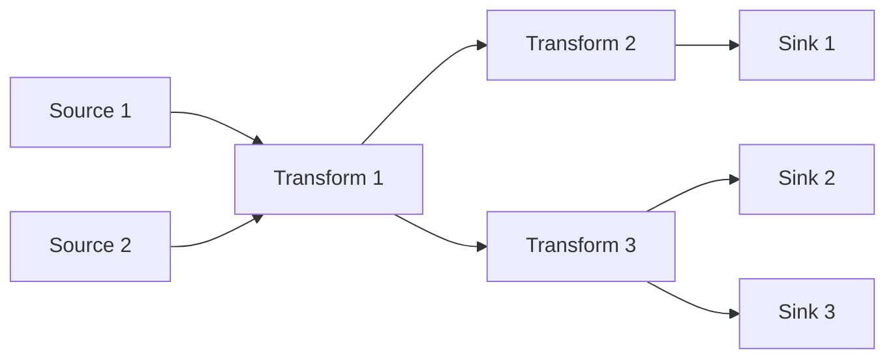
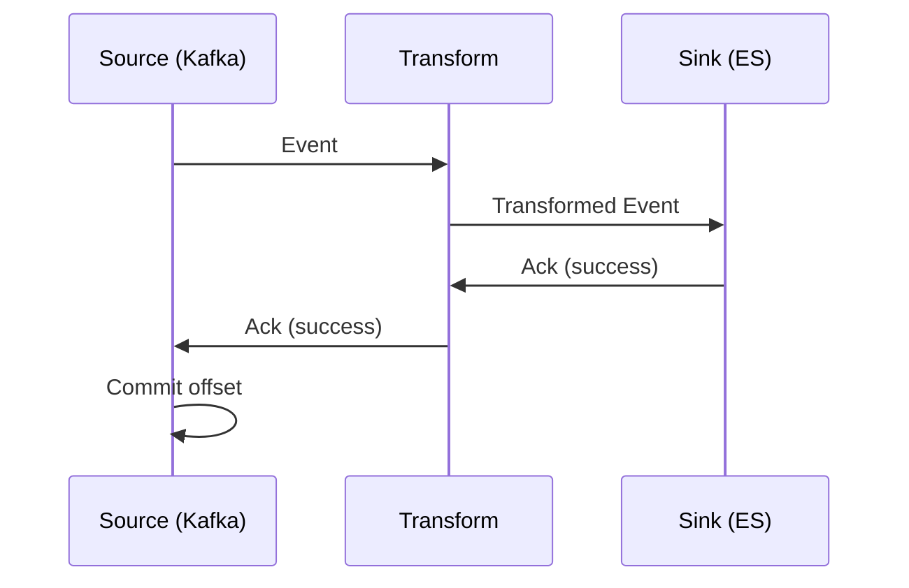
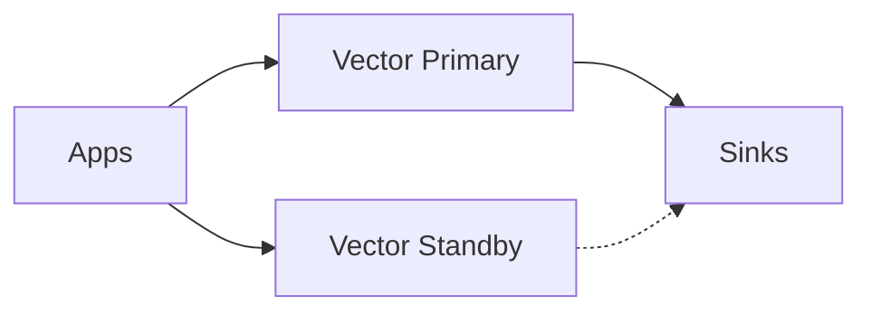
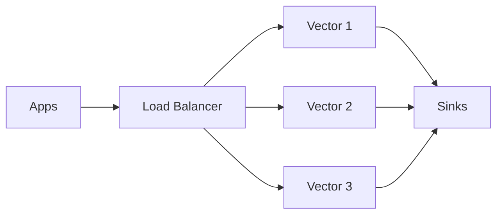
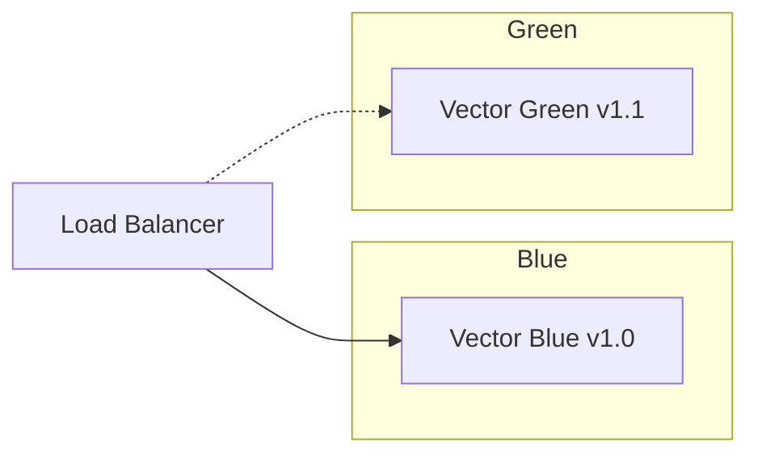

## Architecture Internals

### Data Model

Vector handles three types of observability data, each with a specific structure.

#### Log Events

```json
{
  "message": "User logged in",
  "timestamp": "2026-02-01T12:00:00Z",
  "host": "web-server-01",
  "level": "info",
  "user_id": "12345",
  "metadata": {
    "source": "auth-service",
    "version": "1.0.0"
  }
}
```

#### Metric Events

Vector supports multiple metric types:

| Type             | Description                    | Example                    |
| ---------------- | ------------------------------ | -------------------------- |
| **Counter**      | Monotonically increasing value | `http_requests_total`      |
| **Gauge**        | Value that can go up or down   | `memory_usage_bytes`       |
| **Histogram**    | Distribution of values         | `request_duration_seconds` |
| **Summary**      | Pre-calculated quantiles       | `request_latency_p99`      |
| **Distribution** | Raw samples for aggregation    | `response_time_ms`         |

```json
{
  "name": "http_requests_total",
  "kind": "incremental",
  "counter": {
    "value": 1
  },
  "tags": {
    "method": "GET",
    "status": "200",
    "path": "/api/users"
  },
  "timestamp": "2026-02-01T12:00:00Z"
}
```

#### Trace Events

```json
{
  "trace_id": "abc123",
  "span_id": "def456",
  "parent_span_id": "ghi789",
  "name": "HTTP GET /api/users",
  "start_timestamp": "2026-02-01T12:00:00Z",
  "end_timestamp": "2026-02-01T12:00:00.150Z",
  "status": "ok",
  "attributes": {
    "http.method": "GET",
    "http.status_code": 200
  }
}
```

### Pipeline Model

Vector's pipeline is a Directed Acyclic Graph (DAG):



Key characteristics:
- **Parallel processing**: Independent branches run concurrently
- **Backpressure propagation**: Slow sinks affect upstream components
- **Event ordering**: Maintained within a single path

### Runtime Model

Vector uses the **Tokio** async runtime:

- **Async I/O**: Non-blocking network and file operations
- **Task scheduling**: Efficient work distribution across threads
- **Thread pools**: Configurable via `VECTOR_THREADS`

```bash
# Set number of threads
VECTOR_THREADS=4 vector --config /etc/vector/vector.yaml
```

---


## Buffering Model

Buffers handle backpressure and ensure data durability.

### Buffer Types

| Type       | Durability       | Performance | Use Case          |
| ---------- | ---------------- | ----------- | ----------------- |
| **Memory** | Lost on restart  | Fast        | Non-critical data |
| **Disk**   | Survives restart | Slower      | Critical data     |

### Buffer Configuration

```yaml
sinks:
  elasticsearch:
    type: elasticsearch
    inputs:
      - transform
    endpoints:
      - "https://elasticsearch:9200"
    buffer:
      type: disk           # "memory" or "disk"
      max_size: 268435488  # 256MB for disk
      when_full: block     # "block" or "drop_newest"
```

### Batch Configuration

```yaml
sinks:
  http_sink:
    type: http
    inputs:
      - transform
    uri: "https://api.example.com/logs"
    batch:
      max_bytes: 10485760   # 10MB
      max_events: 10000
      timeout_secs: 5
```

### Buffer Behavior

| `when_full`   | Behavior                                            |
| ------------- | --------------------------------------------------- |
| `block`       | Block upstream until space available (backpressure) |
| `drop_newest` | Drop new events when buffer is full                 |

---

## Concurrency Model

### Adaptive Concurrency

Vector automatically adjusts concurrency based on downstream performance:

```yaml
sinks:
  http_sink:
    type: http
    inputs:
      - transform
    uri: "https://api.example.com/logs"
    request:
      concurrency: adaptive  # or fixed number
      adaptive_concurrency:
        decrease_ratio: 0.9
        ewma_alpha: 0.4
        rtt_deviation_scale: 2.5
```

### How It Works

1. **Measures RTT**: Tracks round-trip time for requests
2. **Adjusts concurrency**: Increases when RTT is stable, decreases when RTT increases
3. **Prevents overload**: Automatically backs off when downstream is slow

---

## Delivery Guarantees

### Guarantee Types

| Guarantee         | Description              | Data Loss | Duplicates |
| ----------------- | ------------------------ | --------- | ---------- |
| **At-most-once**  | Fire and forget          | Possible  | No         |
| **At-least-once** | Retry until acknowledged | No        | Possible   |
| **Exactly-once**  | Perfect delivery         | No        | No         |

Vector provides **at-least-once** delivery with acknowledgements.

### End-to-end Acknowledgements

```yaml
sources:
  kafka_source:
    type: kafka
    bootstrap_servers: "kafka:9092"
    topics:
      - logs
    acknowledgements:
      enabled: true

transforms:
  parse:
    type: remap
    inputs:
      - kafka_source
    source: |
      . = parse_json!(.message)

sinks:
  elasticsearch:
    type: elasticsearch
    inputs:
      - parse
    endpoints:
      - "https://elasticsearch:9200"
    acknowledgements:
      enabled: true
```

### How Acknowledgements Work



---

## Production Hardening

### High Availability

#### Redundancy Patterns

**Active-Passive:**


**Active-Active (Load Balanced):**


#### Load-Balanced Aggregators

```yaml
# Kubernetes Service for aggregators
apiVersion: v1
kind: Service
metadata:
  name: vector-aggregator
spec:
  selector:
    app: vector-aggregator
  ports:
    - port: 9000
      targetPort: 9000
  type: ClusterIP
---
apiVersion: apps/v1
kind: Deployment
metadata:
  name: vector-aggregator
spec:
  replicas: 3
  selector:
    matchLabels:
      app: vector-aggregator
  template:
    spec:
      containers:
        - name: vector
          image: timberio/vector:latest-alpine
          resources:
            requests:
              cpu: 500m
              memory: 512Mi
            limits:
              cpu: 2000m
              memory: 2Gi
```

### Health Checks

```yaml
api:
  enabled: true
  address: "0.0.0.0:8686"

# Health endpoint: http://localhost:8686/health
```

Kubernetes probes:

```yaml
containers:
  - name: vector
    livenessProbe:
      httpGet:
        path: /health
        port: 8686
      initialDelaySeconds: 10
      periodSeconds: 10
    readinessProbe:
      httpGet:
        path: /health
        port: 8686
      initialDelaySeconds: 5
      periodSeconds: 5
```

### Graceful Shutdown

Vector handles SIGTERM gracefully:
1. Stops accepting new events
2. Flushes buffers
3. Waits for in-flight events
4. Exits cleanly

```yaml
# Kubernetes termination grace period
spec:
  terminationGracePeriodSeconds: 60
```

---

## Rollout Strategies

### Blue-Green Deployment



### Canary Deployment

```yaml
# Route 10% traffic to canary
apiVersion: networking.k8s.io/v1
kind: Ingress
metadata:
  annotations:
    nginx.ingress.kubernetes.io/canary: "true"
    nginx.ingress.kubernetes.io/canary-weight: "10"
```

### Rolling Updates

```yaml
apiVersion: apps/v1
kind: Deployment
spec:
  strategy:
    type: RollingUpdate
    rollingUpdate:
      maxSurge: 1
      maxUnavailable: 0
```

---

## Security Hardening

### TLS Configuration

```yaml
sinks:
  elasticsearch:
    type: elasticsearch
    endpoints:
      - "https://elasticsearch:9200"
    tls:
      verify_certificate: true
      verify_hostname: true
      ca_file: /etc/ssl/certs/ca.crt
      crt_file: /etc/ssl/certs/client.crt
      key_file: /etc/ssl/private/client.key
```

### Authentication Patterns

#### Basic Auth

```yaml
sinks:
  elasticsearch:
    type: elasticsearch
    auth:
      strategy: basic
      user: "${ES_USER}"
      password: "${ES_PASSWORD}"
```

#### Bearer Token

```yaml
sinks:
  http:
    type: http
    auth:
      strategy: bearer
      token: "${API_TOKEN}"
```

#### AWS IAM

```yaml
sinks:
  aws_s3:
    type: aws_s3
    auth:
      access_key_id: "${AWS_ACCESS_KEY_ID}"
      secret_access_key: "${AWS_SECRET_ACCESS_KEY}"
      # Or use IAM role (no credentials needed)
```

#### mTLS

```yaml
sources:
  http_server:
    type: http_server
    address: "0.0.0.0:8080"
    tls:
      enabled: true
      crt_file: /etc/ssl/certs/server.crt
      key_file: /etc/ssl/private/server.key
      ca_file: /etc/ssl/certs/ca.crt
      verify_certificate: true
```

### Secrets Management

#### Environment Variables

```yaml
sinks:
  elasticsearch:
    type: elasticsearch
    auth:
      user: "${ES_USER}"
      password: "${ES_PASSWORD}"
```

#### Kubernetes Secrets

```yaml
apiVersion: v1
kind: Secret
metadata:
  name: vector-secrets
type: Opaque
stringData:
  ES_USER: elastic
  ES_PASSWORD: changeme
---
apiVersion: apps/v1
kind: Deployment
spec:
  template:
    spec:
      containers:
        - name: vector
          envFrom:
            - secretRef:
                name: vector-secrets
```

### Running as Non-Root

```yaml
# Kubernetes SecurityContext
spec:
  securityContext:
    runAsNonRoot: true
    runAsUser: 1000
    fsGroup: 1000
  containers:
    - name: vector
      securityContext:
        allowPrivilegeEscalation: false
        readOnlyRootFilesystem: true
        capabilities:
          drop:
            - ALL
```

---

## Sizing & Capacity Planning

### Resource Guidelines

| Throughput | CPU      | Memory | Disk Buffer |
| ---------- | -------- | ------ | ----------- |
| 1 GB/day   | 0.5 core | 256 MB | 1 GB        |
| 10 GB/day  | 1 core   | 512 MB | 5 GB        |
| 100 GB/day | 2 cores  | 1 GB   | 20 GB       |
| 1 TB/day   | 4 cores  | 2 GB   | 50 GB       |
| 10 TB/day  | 8+ cores | 4+ GB  | 100+ GB     |

### Factors Affecting Resource Usage

| Factor                   | Impact                   |
| ------------------------ | ------------------------ |
| **Transform complexity** | More VRL = more CPU      |
| **Number of sinks**      | More sinks = more memory |
| **Buffer type**          | Disk buffers = more I/O  |
| **Compression**          | Compression = more CPU   |
| **TLS**                  | Encryption = more CPU    |

### Benchmarking

```bash
# Generate test load
vector generate --config /etc/vector/vector.yaml

# Monitor with vector top
vector top
```

---


## Comparisons with Other Tools

### Official Performance Benchmarks

From [Vector's official test harness](https://github.com/vectordotdev/vector):

| Test             | Vector     | Filebeat  | FluentBit  | FluentD    | Logstash   | SplunkUF   | SplunkHF  |
| ---------------- | ---------- | --------- | ---------- | ---------- | ---------- | ---------- | --------- |
| TCP to Blackhole | 86 MiB/s   | n/a       | 64.4 MiB/s | 27.7 MiB/s | 40.6 MiB/s | n/a        | n/a       |
| File to TCP      | 76.7 MiB/s | 7.8 MiB/s | 35 MiB/s   | 26.1 MiB/s | 3.1 MiB/s  | 40.1 MiB/s | 39 MiB/s  |
| Regex Parsing    | 13.2 MiB/s | n/a       | 20.5 MiB/s | 2.6 MiB/s  | 4.6 MiB/s  | n/a        | 7.8 MiB/s |
| TCP to HTTP      | 26.7 MiB/s | n/a       | 19.6 MiB/s | <1 MiB/s   | 2.7 MiB/s  | n/a        | n/a       |
| TCP to TCP       | 69.9 MiB/s | 5 MiB/s   | 67.1 MiB/s | 3.9 MiB/s  | 10 MiB/s   | 70.4 MiB/s | 7.6 MiB/s |

### Correctness Tests

| Test                       | Vector | Filebeat | FluentBit | FluentD | Logstash | Splunk UF | Splunk HF |
| -------------------------- | ------ | -------- | --------- | ------- | -------- | --------- | --------- |
| Disk Buffer Persistence    | ✅      | ✅        | ❌         | ❌       | ⚠️        | ✅         | ✅         |
| File Rotate (create)       | ✅      | ✅        | ✅         | ✅       | ✅        | ✅         | ✅         |
| File Rotate (copytruncate) | ✅      | ❌        | ❌         | ❌       | ❌        | ✅         | ✅         |
| File Truncation            | ✅      | ✅        | ✅         | ✅       | ✅        | ✅         | ✅         |
| Process (SIGHUP)           | ✅      | ❌        | ❌         | ❌       | ⚠️        | ✅         | ✅         |
| JSON (wrapped)             | ✅      | ✅        | ✅         | ✅       | ✅        | ✅         | ✅         |

### Feature Comparison (Official)

| Feature             | Vector | Beats | FluentBit | FluentD | Logstash | Splunk UF | Splunk HF | Telegraf |
| ------------------- | ------ | ----- | --------- | ------- | -------- | --------- | --------- | -------- |
| End-to-end          | ✅      | ❌     | ❌         | ❌       | ❌        | ❌         | ❌         | ✅        |
| Agent               | ✅      | ✅     | ✅         | ❌       | ❌        | ✅         | ❌         | ✅        |
| Aggregator          | ✅      | ❌     | ❌         | ✅       | ✅        | ❌         | ✅         | ✅        |
| Unified             | ✅      | ❌     | ❌         | ❌       | ❌        | ❌         | ❌         | ✅        |
| Logs                | ✅      | ✅     | ✅         | ✅       | ✅        | ✅         | ✅         | ✅        |
| Metrics             | ✅      | ⚠️     | ⚠️         | ⚠️       | ⚠️        | ⚠️         | ⚠️         | ✅        |
| Traces              | ✅      | ❌     | ❌         | ❌       | ❌        | ❌         | ❌         | ❌        |
| Open-source         | ✅      | ✅     | ✅         | ✅       | ✅        | ❌         | ❌         | ✅        |
| Vendor-neutral      | ✅      | ❌     | ✅         | ✅       | ❌        | ❌         | ❌         | ✅        |
| Memory-safe         | ✅      | ❌     | ❌         | ❌       | ❌        | ❌         | ❌         | ✅        |
| Delivery guarantees | ✅      | ❌     | ❌         | ❌       | ❌        | ✅         | ✅         | ❌        |
| Multi-core          | ✅      | ✅     | ✅         | ✅       | ✅        | ✅         | ✅         | ✅        |

> ⚠️ = Not interoperable, metrics are represented as structured logs

---

## Vector vs Fluent Bit

### Comparison Table

| Feature               | Vector                               | Fluent Bit                  |
| --------------------- | ------------------------------------ | --------------------------- |
| Language              | Rust                                 | C                           |
| Memory Footprint      | ~50MB typical                        | ~5-10MB typical             |
| Configuration         | YAML/TOML/JSON                       | INI-style / YAML            |
| Transform Language    | VRL (Turing-complete)                | Limited filters             |
| Data Types            | Logs, Metrics, Traces                | Logs, Metrics, Traces       |
| Plugin System         | Built-in components                  | Extensive plugin ecosystem  |
| Kubernetes Native     | Yes (Helm charts)                    | Yes (Helm charts)           |
| Buffering             | Memory & Disk                        | Memory & Filesystem         |
| Backpressure Handling | Advanced (adaptive)                  | Basic                       |
| Hot Reload            | Yes                                  | Yes                         |
| Best For              | Complex transformations, aggregation | Lightweight edge collection |

### Configuration Comparison

**Fluent Bit:**
```ini
[SERVICE]
    Flush        1
    Log_Level    info

[INPUT]
    Name         tail
    Path         /var/log/app/*.log
    Tag          app.*

[FILTER]
    Name         parser
    Match        app.*
    Key_Name     log
    Parser       json

[OUTPUT]
    Name         loki
    Match        *
    Host         loki
    Port         3100
    Labels       job=fluentbit
```

**Vector equivalent:**
```yaml
sources:
  app_logs:
    type: file
    include:
      - /var/log/app/*.log

transforms:
  parse:
    type: remap
    inputs:
      - app_logs
    source: |
      . = parse_json!(.message)

sinks:
  loki:
    type: loki
    inputs:
      - parse
    endpoint: "http://loki:3100"
    labels:
      job: vector
    encoding:
      codec: json
```

### When to Choose

**Choose Vector when:**
- Complex data transformations needed
- Aggregator role required
- Need unified logs, metrics, traces
- Delivery guarantees important
- Built-in unit testing needed

**Choose Fluent Bit when:**
- Memory is extremely constrained (IoT, edge)
- Simple log forwarding only
- Already using Fluent ecosystem
- Need specific Fluent Bit plugins

---

## Vector vs Grafana Alloy

### Comparison Table

| Feature             | Vector                          | Grafana Alloy                   |
| ------------------- | ------------------------------- | ------------------------------- |
| Language            | Rust                            | Go                              |
| Memory Usage        | Low (~50MB)                     | Medium (~100MB)                 |
| Configuration       | YAML/TOML/JSON                  | River (HCL-like)                |
| Transform Language  | VRL                             | River expressions               |
| Data Types          | Logs, Metrics, Traces           | Logs, Metrics, Traces, Profiles |
| Native Integrations | Vendor neutral                  | Grafana stack optimized         |
| Prometheus Support  | Remote write                    | Native scraping + remote write  |
| OpenTelemetry       | Source & Sink                   | Full OTLP support               |
| Service Discovery   | Limited                         | Prometheus-style SD             |
| Best For            | General observability pipelines | Grafana LGTM stack              |

### Configuration Comparison

**Grafana Alloy (River syntax):**
```hcl
// config.alloy

local.file_match "app_logs" {
  path_targets = [{"__path__" = "/var/log/app/*.log"}]
}

loki.source.file "app" {
  targets    = local.file_match.app_logs.targets
  forward_to = [loki.process.parse.receiver]
}

loki.process "parse" {
  stage.json {
    expressions = {
      level   = "level",
      message = "message",
    }
  }

  stage.labels {
    values = {
      level = "",
    }
  }

  forward_to = [loki.write.default.receiver]
}

loki.write "default" {
  endpoint {
    url = "http://loki:3100/loki/api/v1/push"
  }
}
```

**Vector equivalent:**
```yaml
sources:
  app_logs:
    type: file
    include:
      - /var/log/app/*.log

transforms:
  parse:
    type: remap
    inputs:
      - app_logs
    source: |
      . = parse_json!(.message)

sinks:
  loki:
    type: loki
    inputs:
      - parse
    endpoint: "http://loki:3100"
    labels:
      level: "{{ level }}"
    encoding:
      codec: json
```

### When to Choose

**Choose Vector when:**
- Vendor-neutral solution needed
- Complex VRL transformations required
- Not using Grafana stack exclusively
- Need built-in unit testing

**Choose Grafana Alloy when:**
- Using Grafana LGTM stack (Loki, Grafana, Tempo, Mimir)
- Need Prometheus-style service discovery
- Want native profiling support (Pyroscope)
- Prefer HCL-style configuration

---

## Vector vs Logstash

### Comparison Table

| Feature            | Vector                | Logstash           |
| ------------------ | --------------------- | ------------------ |
| Language           | Rust                  | Java (JRuby)       |
| Memory Usage       | Low (~50MB)           | High (~500MB-1GB)  |
| CPU Usage          | Low                   | High               |
| Configuration      | YAML/TOML/JSON        | Custom DSL         |
| Transform Language | VRL                   | Ruby/Grok          |
| Plugin Ecosystem   | 100+ built-in         | 200+ plugins       |
| Startup Time       | Fast (seconds)        | Slow (30+ seconds) |
| Data Types         | Logs, Metrics, Traces | Logs only          |
| Deployment         | Single binary         | JVM required       |

### Configuration Comparison

**Logstash:**
```ruby
input {
  file {
    path => "/var/log/app/*.log"
    start_position => "beginning"
  }
}

filter {
  json {
    source => "message"
  }

  mutate {
    lowercase => ["level"]
  }

  if [level] == "error" {
    mutate {
      add_field => { "alert" => "true" }
    }
  }
}

output {
  elasticsearch {
    hosts => ["https://elasticsearch:9200"]
    index => "logs-%{+YYYY.MM.dd}"
    user => "elastic"
    password => "changeme"
  }
}
```

**Vector equivalent:**
```yaml
sources:
  app_logs:
    type: file
    include:
      - /var/log/app/*.log
    read_from: beginning

transforms:
  parse:
    type: remap
    inputs:
      - app_logs
    source: |
      . = parse_json!(.message)
      .level = downcase!(.level)
      if .level == "error" {
        .alert = "true"
      }

sinks:
  elasticsearch:
    type: elasticsearch
    inputs:
      - parse
    endpoints:
      - "https://elasticsearch:9200"
    bulk:
      index: "logs-%Y.%m.%d"
    auth:
      strategy: basic
      user: "elastic"
      password: "changeme"
```

### When to Choose

**Choose Vector when:**
- Resource efficiency is important
- Need fast startup times
- Want unified logs, metrics, traces
- Prefer YAML configuration

**Choose Logstash when:**
- Already invested in Elastic stack
- Need specific Logstash plugins
- Complex Grok patterns required
- Ruby-based transformations preferred

---

## Detailed Feature Matrix

| Feature            | Vector    | Fluent Bit | Grafana Alloy | Logstash  |
| ------------------ | --------- | ---------- | ------------- | --------- |
| **Performance**    |           |            |               |           |
| Throughput         | 10TB+/day | 5TB+/day   | 5TB+/day      | 1TB+/day  |
| Latency            | Sub-ms    | Sub-ms     | Low ms        | Higher ms |
| Memory (idle)      | ~50MB     | ~5MB       | ~100MB        | ~500MB    |
| **Data Types**     |           |            |               |           |
| Logs               | ✅         | ✅          | ✅             | ✅         |
| Metrics            | ✅         | ✅          | ✅             | ❌         |
| Traces             | ✅         | ✅          | ✅             | ❌         |
| Profiles           | ❌         | ❌          | ✅             | ❌         |
| **Configuration**  |           |            |               |           |
| Hot Reload         | ✅         | ✅          | ✅             | ✅         |
| Validation         | ✅         | ✅          | ✅             | ✅         |
| Unit Tests         | ✅         | ❌          | ❌             | ❌         |
| **Reliability**    |           |            |               |           |
| Disk Buffering     | ✅         | ✅          | ✅             | ✅         |
| Acknowledgements   | ✅         | ❌          | ✅             | ✅         |
| Dead Letter Queue  | ✅         | ❌          | ❌             | ✅         |
| **Ecosystem**      |           |            |               |           |
| Sources            | 44        | 30+        | 50+           | 50+       |
| Sinks              | 56        | 40+        | 50+           | 50+       |
| Transforms         | 17        | 20+        | 30+           | 200+      |
| **Operations**     |           |            |               |           |
| GraphQL API        | ✅         | ❌          | ❌             | ❌         |
| Prometheus Metrics | ✅         | ✅          | ✅             | ✅         |
| Live Tap/Debug     | ✅         | ❌          | ❌             | ❌         |

---

## Decision Framework

### When to Choose Vector

✅ **Choose Vector when:**
- You need complex data transformations (VRL is powerful)
- You want a single tool for logs, metrics, and traces
- Performance and resource efficiency are critical
- You need built-in unit testing for pipelines
- You want vendor-neutral observability
- Delivery guarantees are important
- You need both agent and aggregator roles

### When to Choose Alternatives

**Fluent Bit:**
- Memory footprint is the primary concern (IoT, edge devices)
- Simple log forwarding without complex transforms
- Already in the Fluent ecosystem

**Grafana Alloy:**
- Using the Grafana LGTM stack exclusively
- Need Prometheus-style service discovery
- Want native profiling support

**Logstash:**
- Already invested in Elastic stack
- Need extensive plugin ecosystem
- Complex Grok patterns required

---

## Migration Strategies

### Parallel Running

Run Vector alongside existing tool:

```yaml
# Vector receives copy of data
sources:
  kafka:
    type: kafka
    topics:
      - logs-mirror  # Mirror topic

sinks:
  new_destination:
    type: elasticsearch
    endpoints:
      - "https://new-elasticsearch:9200"
```

### Gradual Migration

1. **Phase 1**: Deploy Vector alongside existing tool
2. **Phase 2**: Route percentage of traffic to Vector
3. **Phase 3**: Validate data quality and performance
4. **Phase 4**: Increase Vector traffic
5. **Phase 5**: Decommission old tool

### Testing Migrations

```yaml
# Use blackhole sink for testing
sinks:
  test:
    type: blackhole
    inputs:
      - transform
    print_interval_secs: 10
```

---

## Conclusion

Vector is a powerful, efficient tool for building observability pipelines. Key takeaways:

- **Architecture**: DAG-based pipeline with async runtime
- **Buffering**: Memory and disk options with configurable backpressure
- **Guarantees**: At-least-once delivery with end-to-end acknowledgements
- **Production**: HA patterns, security hardening, proper sizing
- **Comparisons**: Best for complex transforms, unified data types, vendor neutrality

## References

- [Vector Official Documentation](https://vector.dev/docs/)
- [Vector GitHub Repository](https://github.com/vectordotdev/vector)
- [Vector Test Harness](https://github.com/vectordotdev/vector-test-harness)
- [VRL Reference](https://vector.dev/docs/reference/vrl/)
