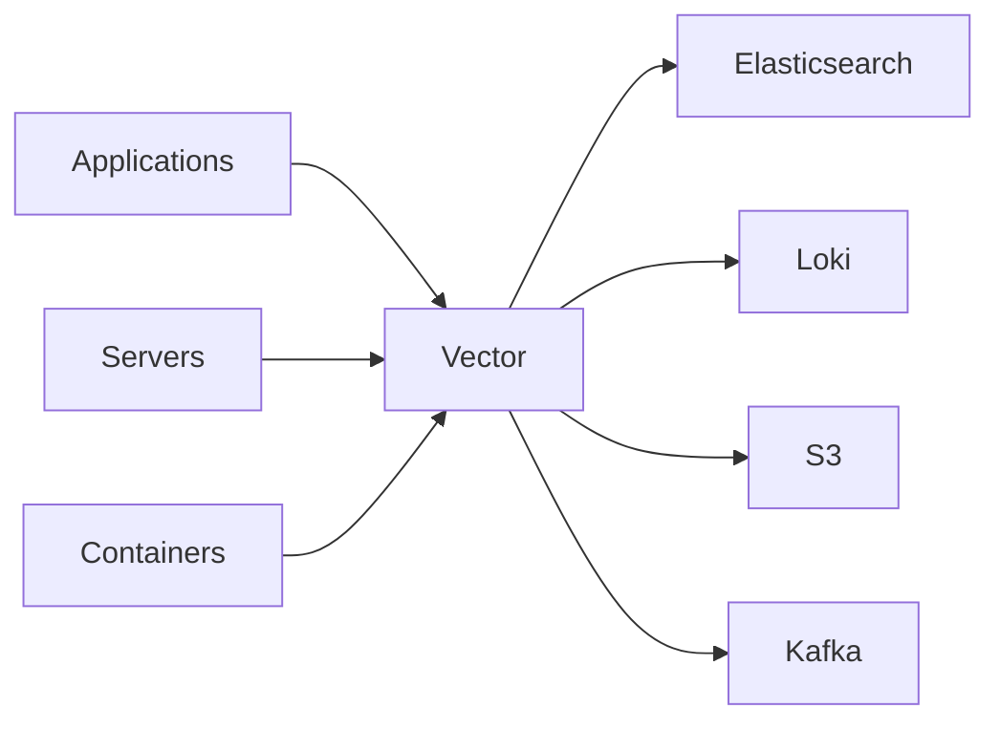
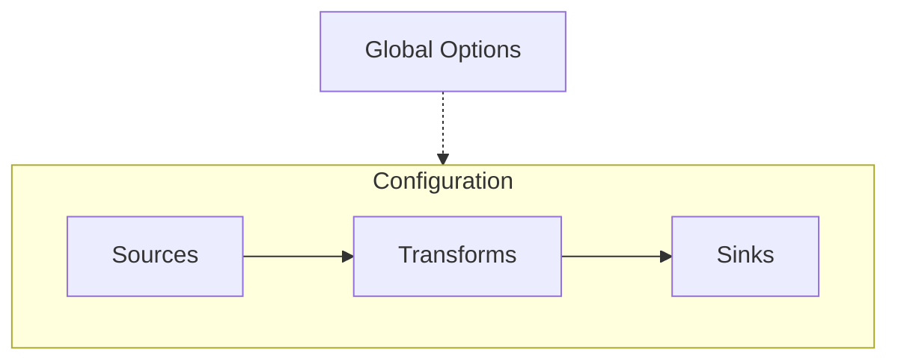

## What is Vector?

[Vector](https://vector.dev/) is a high-performance, open-source observability data pipeline built by Datadog. Written in Rust, it's extremely fast and memory-efficient. Vector can collect, transform, and route logs, metrics, and traces from any source to any destination.

### Key Features

- **High Performance**: Written in Rust, capable of processing 10TB+/day on a single node
- **Memory Safe**: No garbage collection pauses or memory leaks
- **All Data Types**: Handles logs, metrics, and traces
- **Vendor Neutral**: Works with any observability backend
- **Single Binary**: Easy deployment with no runtime dependencies
- **Built-in Transforms**: Rich transformation capabilities using VRL (Vector Remap Language)

### Who Uses Vector?

Vector is relied on by startups and enterprises like **Atlassian**, **T-Mobile**, **Comcast**, **Zendesk**, **Discord**, **Fastly**, **CVS**, **Trivago**, **Visa**, **Instacart**, and many more. Vector is downloaded over 100,000 times per day, with the largest user processing over 500TB daily.

### Use Cases



| Use Case           | Description                                                           |
| ------------------ | --------------------------------------------------------------------- |
| Log Aggregation    | Collect logs from multiple sources and forward to centralized storage |
| Log Transformation | Parse, filter, enrich, and restructure log data                       |
| Metrics Collection | Gather metrics from various systems                                   |
| Data Routing       | Route data to multiple destinations based on conditions               |
| Cost Reduction     | Filter and sample data to reduce storage costs                        |
| Migration          | Migrate from legacy tools like Logstash, Fluentd, or Filebeat         |

---

## Core Concepts

Vector's architecture is built around three core components:



| Component      | Purpose                                                   |
| -------------- | --------------------------------------------------------- |
| **Sources**    | Define where data comes from (files, syslog, Kafka, etc.) |
| **Transforms** | Define how data is processed (parse, filter, route, etc.) |
| **Sinks**      | Define where data goes (Elasticsearch, Loki, S3, etc.)    |
| **API**        | Configure Vector's API for monitoring (optional)          |

### Event Types

Vector handles three types of observability data:

- **Log Events**: Structured or unstructured text data with timestamps
- **Metric Events**: Numerical measurements (counters, gauges, histograms)
- **Trace Events**: Distributed tracing spans

---

## Installation

### Using Package Managers

```bash
# macOS
brew install vector

# Ubuntu/Debian
curl -1sLf 'https://repositories.timber.io/public/vector/cfg/setup/bash.deb.sh' | sudo -E bash
sudo apt install vector

# RHEL/CentOS
curl -1sLf 'https://repositories.timber.io/public/vector/cfg/setup/bash.rpm.sh' | sudo -E bash
sudo yum install vector

# Docker
docker run -v $(pwd)/vector.yaml:/etc/vector/vector.yaml:ro timberio/vector:latest-alpine
```

### Using Helm (Kubernetes)

```bash
helm repo add vector https://helm.vector.dev
helm install vector vector/vector --namespace vector --create-namespace
```

### Verify Installation

```bash
vector --version
```

---

## Your First Pipeline

Create a simple pipeline that generates demo logs and outputs to console:

```yaml
# vector.yaml
sources:
  demo:
    type: demo_logs
    format: json
    interval: 1

sinks:
  console:
    type: console
    inputs:
      - demo
    encoding:
      codec: json
```

Run it:

```bash
vector --config vector.yaml
```

---

## Configuration Formats

Vector supports three configuration formats: **YAML**, **TOML**, and **JSON**. YAML is the most readable and commonly used.

### YAML Format (Recommended)

```yaml
# /etc/vector/vector.yaml
sources:
  my_source:
    type: file
    include:
      - /var/log/*.log

transforms:
  my_transform:
    type: remap
    inputs:
      - my_source
    source: |
      .processed_at = now()

sinks:
  my_sink:
    type: console
    inputs:
      - my_transform
    encoding:
      codec: json
```

### TOML Format

```toml
# /etc/vector/vector.toml
[sources.my_source]
type = "file"
include = ["/var/log/*.log"]

[transforms.my_transform]
type = "remap"
inputs = ["my_source"]
source = ".processed_at = now()"

[sinks.my_sink]
type = "console"
inputs = ["my_transform"]
encoding.codec = "json"
```

### JSON Format

```json
{
  "sources": {
    "my_source": {
      "type": "file",
      "include": ["/var/log/*.log"]
    }
  },
  "transforms": {
    "my_transform": {
      "type": "remap",
      "inputs": ["my_source"],
      "source": ".processed_at = now()"
    }
  },
  "sinks": {
    "my_sink": {
      "type": "console",
      "inputs": ["my_transform"],
      "encoding": {
        "codec": "json"
      }
    }
  }
}
```

### Global Options

```yaml
# Global configuration
data_dir: /var/lib/vector

api:
  enabled: true
  address: "0.0.0.0:8686"
  playground: true

# Environment variable interpolation
sinks:
  elasticsearch:
    type: elasticsearch
    endpoints:
      - "${ES_ENDPOINT}"
    auth:
      user: "${ES_USER}"
      password: "${ES_PASSWORD}"
```

---

## Sources - Complete Reference

Sources define where Vector collects data from. Vector supports **44 different sources**:

| Source                  | Type                      | Description                                                                 |
| ----------------------- | ------------------------- | --------------------------------------------------------------------------- |
| AMQP                    | `amqp`                    | Collect events from AMQP 0.9.1 compatible brokers like RabbitMQ             |
| Apache Metrics          | `apache_metrics`          | Collect metrics from Apache's HTTPD server                                  |
| AWS ECS Metrics         | `aws_ecs_metrics`         | Collect Docker container stats for tasks running in AWS ECS and AWS Fargate |
| AWS Kinesis Firehose    | `aws_kinesis_firehose`    | Collect logs from AWS Kinesis Firehose                                      |
| AWS S3                  | `aws_s3`                  | Collect logs from AWS S3                                                    |
| AWS SQS                 | `aws_sqs`                 | Collect logs from AWS SQS                                                   |
| Datadog Agent           | `datadog_agent`           | Receive logs, metrics, and traces collected by a Datadog Agent              |
| Demo Logs               | `demo_logs`               | Generate fake log events for testing and demos                              |
| dnstap                  | `dnstap`                  | Collect DNS logs from a dnstap-compatible server                            |
| Docker Logs             | `docker_logs`             | Collect logs from Docker                                                    |
| EventStoreDB Metrics    | `eventstoredb_metrics`    | Receive metrics from EventStoreDB                                           |
| Exec                    | `exec`                    | Collect output from a process running on the host                           |
| File                    | `file`                    | Collect logs from files                                                     |
| File Descriptor         | `file_descriptor`         | Collect logs from a file descriptor                                         |
| Fluent                  | `fluent`                  | Collect logs from a Fluentd or Fluent Bit agent                             |
| GCP PubSub              | `gcp_pubsub`              | Fetch observability events from GCP's PubSub messaging system               |
| Heroku Logplex          | `heroku_logs`             | Collect logs from Heroku's Logplex                                          |
| Host Metrics            | `host_metrics`            | Collect metric data from the local system                                   |
| HTTP Client             | `http_client`             | Pull observability data from an HTTP server at a configured interval        |
| HTTP Server             | `http_server`             | Receive observability data from an HTTP client request                      |
| Internal Logs           | `internal_logs`           | Expose all log and trace messages emitted by Vector                         |
| Internal Metrics        | `internal_metrics`        | Access to the metrics produced by Vector itself                             |
| JournalD                | `journald`                | Collect logs from JournalD                                                  |
| Kafka                   | `kafka`                   | Collect observability data from Apache Kafka topics                         |
| Kubernetes Logs         | `kubernetes_logs`         | Collect logs from Kubernetes Nodes                                          |
| Logstash                | `logstash`                | Collect logs from a Logstash agent                                          |
| MongoDB Metrics         | `mongodb_metrics`         | Collect metrics from the MongoDB database                                   |
| MQTT                    | `mqtt`                    | Receive logs from an MQTT broker                                            |
| NATS                    | `nats`                    | Read observability data from subjects on the NATS messaging system          |
| NGINX Metrics           | `nginx_metrics`           | Collect metrics from NGINX                                                  |
| Okta                    | `okta`                    | Collect system logs from Okta                                               |
| OpenTelemetry           | `opentelemetry`           | Receive OTLP data through gRPC or HTTP                                      |
| PostgreSQL Metrics      | `postgresql_metrics`      | Collect metrics from the PostgreSQL database                                |
| Prometheus Pushgateway  | `prometheus_pushgateway`  | Collect metrics from Prometheus                                             |
| Prometheus Remote Write | `prometheus_remote_write` | Collect metrics from Prometheus                                             |
| Prometheus Scrape       | `prometheus_scrape`       | Collect metrics via the Prometheus client                                   |
| Pulsar                  | `pulsar`                  | Collect observability events from Apache Pulsar topics                      |
| Redis                   | `redis`                   | Collect observability data from Redis                                       |
| Socket                  | `socket`                  | Collect logs using the socket client                                        |
| Splunk HEC              | `splunk_hec`              | Receive logs from Splunk                                                    |
| Static Metrics          | `static_metrics`          | Publish statically configured metrics on an interval                        |
| StatsD                  | `statsd`                  | Collect metrics emitted via StatsD protocol                                 |
| stdin                   | `stdin`                   | Collect logs sent via stdin                                                 |
| Syslog                  | `syslog`                  | Collect logs sent via Syslog                                                |
| Vector                  | `vector`                  | Collect observability data from another Vector instance                     |
| WebSocket               | `websocket`               | Receive events from a WebSocket server                                      |

### Common Source Examples

#### File Source

```yaml
sources:
  app_logs:
    type: file
    include:
      - /var/log/app/*.log
      - /var/log/app/**/*.log
    exclude:
      - /var/log/app/debug.log
    read_from: beginning  # or "end"
    ignore_older_secs: 86400
    max_line_bytes: 102400
    fingerprint:
      strategy: device_and_inode
```

#### Syslog Source

```yaml
sources:
  syslog_input:
    type: syslog
    address: "0.0.0.0:514"
    mode: tcp  # or "udp"
    max_length: 102400
```

#### Kafka Source

```yaml
sources:
  kafka_input:
    type: kafka
    bootstrap_servers: "kafka1:9092,kafka2:9092"
    group_id: "vector-consumer"
    topics:
      - app-logs
      - system-logs
    auto_offset_reset: earliest
    sasl:
      enabled: true
      mechanism: PLAIN
      username: "${KAFKA_USER}"
      password: "${KAFKA_PASSWORD}"
```

#### HTTP Server Source

```yaml
sources:
  http_input:
    type: http_server
    address: "0.0.0.0:8080"
    path: "/logs"
    encoding: json
```

#### Kubernetes Logs Source

```yaml
sources:
  k8s_logs:
    type: kubernetes_logs
    auto_partial_merge: true
    exclude_paths_glob_patterns:
      - "**/kube-system/**"
    pod_annotation_fields:
      pod_labels: kubernetes.labels
      pod_name: kubernetes.pod_name
      pod_namespace: kubernetes.namespace
```

#### Docker Logs Source

```yaml
sources:
  docker_logs:
    type: docker_logs
    include_containers:
      - "app-*"
    exclude_containers:
      - "monitoring-*"
    include_labels:
      - "environment=production"
```

#### Host Metrics Source

```yaml
sources:
  host_metrics:
    type: host_metrics
    collectors:
      - cpu
      - memory
      - disk
      - network
    scrape_interval_secs: 15
```

---

## Sinks - Complete Reference

Sinks define where Vector sends processed data. Vector supports **56 different sinks**:

| Sink                       | Type                         | Description                                                         |
| -------------------------- | ---------------------------- | ------------------------------------------------------------------- |
| AMQP                       | `amqp`                       | Send events to AMQP 0.9.1 compatible brokers like RabbitMQ          |
| AppSignal                  | `appsignal`                  | Deliver events to AppSignal                                         |
| AWS CloudWatch Logs        | `aws_cloudwatch_logs`        | Publish log events to AWS CloudWatch Logs                           |
| AWS CloudWatch Metrics     | `aws_cloudwatch_metrics`     | Publish metric events to AWS CloudWatch Metrics                     |
| AWS Kinesis Data Firehose  | `aws_kinesis_firehose`       | Publish logs to AWS Kinesis Data Firehose topics                    |
| AWS Kinesis Streams        | `aws_kinesis_streams`        | Publish logs to AWS Kinesis Streams topics                          |
| AWS S3                     | `aws_s3`                     | Store observability events in AWS S3                                |
| AWS SNS                    | `aws_sns`                    | Publish observability events to Simple Notification Service topics  |
| AWS SQS                    | `aws_sqs`                    | Publish observability events to Simple Queue Service topics         |
| Axiom                      | `axiom`                      | Deliver log events to Axiom                                         |
| Azure Blob Storage         | `azure_blob`                 | Store your observability data in Azure Blob Storage                 |
| Azure Monitor Logs         | `azure_monitor_logs`         | Publish log events to the Azure Monitor Logs service                |
| Blackhole                  | `blackhole`                  | Send observability events nowhere (useful for debugging)            |
| ClickHouse                 | `clickhouse`                 | Deliver log data to the ClickHouse database                         |
| Console                    | `console`                    | Display observability events in the console                         |
| Databend                   | `databend`                   | Deliver log data to the Databend database                           |
| Datadog Events             | `datadog_events`             | Publish observability events to the Datadog Events API              |
| Datadog Logs               | `datadog_logs`               | Publish log events to Datadog                                       |
| Datadog Metrics            | `datadog_metrics`            | Publish metric events to Datadog                                    |
| Datadog Traces             | `datadog_traces`             | Publish traces to Datadog                                           |
| Doris                      | `doris`                      | Deliver log data to the Apache Doris database                       |
| Elasticsearch              | `elasticsearch`              | Index observability events in Elasticsearch                         |
| File                       | `file`                       | Output observability events into files                              |
| GCP Chronicle Unstructured | `gcp_chronicle_unstructured` | Store unstructured log events in Google Chronicle                   |
| GCP Cloud Monitoring       | `gcp_stackdriver_metrics`    | Deliver metrics to GCP's Cloud Monitoring system                    |
| GCP Cloud Storage          | `gcp_cloud_storage`          | Store observability events in GCP Cloud Storage                     |
| GCP Stackdriver Logs       | `gcp_stackdriver_logs`       | Deliver logs to GCP's Cloud Operations suite                        |
| GCP PubSub                 | `gcp_pubsub`                 | Publish observability events to GCP's PubSub messaging system       |
| GreptimeDB Logs            | `greptimedb_logs`            | Writes logs to GreptimeDB                                           |
| GreptimeDB Metrics         | `greptimedb_metrics`         | Writes metrics to GreptimeDB                                        |
| Honeycomb                  | `honeycomb`                  | Deliver log events to Honeycomb                                     |
| HTTP                       | `http`                       | Deliver observability data to an HTTP server                        |
| Humio Logs                 | `humio_logs`                 | Deliver log event data to Humio                                     |
| Humio Metrics              | `humio_metrics`              | Deliver metric event data to Humio                                  |
| InfluxDB Logs              | `influxdb_logs`              | Deliver log event data to InfluxDB                                  |
| InfluxDB Metrics           | `influxdb_metrics`           | Deliver metric event data to InfluxDB                               |
| Kafka                      | `kafka`                      | Publish observability data to Apache Kafka topics                   |
| Keep                       | `keep`                       | Deliver log events to Keep                                          |
| Loki                       | `loki`                       | Deliver log event data to the Loki aggregation system               |
| Mezmo                      | `mezmo`                      | Deliver log event data to Mezmo (formerly LogDNA)                   |
| MQTT                       | `mqtt`                       | Deliver observability event data to an MQTT broker                  |
| NATS                       | `nats`                       | Publish observability data to subjects on the NATS messaging system |
| New Relic                  | `new_relic`                  | Deliver events to New Relic                                         |
| OpenTelemetry              | `opentelemetry`              | Send OTLP data through HTTP                                         |
| Papertrail                 | `papertrail`                 | Deliver log events to Papertrail from SolarWinds                    |
| Postgres                   | `postgres`                   | Deliver observability data to the PostgreSQL database               |
| Prometheus Exporter        | `prometheus_exporter`        | Output metric events to a Prometheus exporter                       |
| Prometheus Remote Write    | `prometheus_remote_write`    | Deliver metric data to a Prometheus remote write endpoint           |
| Pulsar                     | `pulsar`                     | Publish observability events to Apache Pulsar topics                |
| Redis                      | `redis`                      | Publish observability data to Redis                                 |
| Sematext Logs              | `sematext_logs`              | Publish log events to Sematext                                      |
| Sematext Metrics           | `sematext_metrics`           | Publish metric events to Sematext                                   |
| Socket                     | `socket`                     | Deliver logs to a remote socket endpoint                            |
| Splunk HEC Logs            | `splunk_hec_logs`            | Deliver log data to Splunk's HTTP Event Collector                   |
| Splunk HEC Metrics         | `splunk_hec_metrics`         | Deliver metric data to Splunk's HTTP Event Collector                |
| StatsD                     | `statsd`                     | Deliver metric data to a StatsD aggregator                          |
| Vector                     | `vector`                     | Relay observability data to another Vector instance                 |
| WebHDFS                    | `webhdfs`                    | Output observability events into WebHDFS                            |
| WebSocket                  | `websocket`                  | Deliver observability event data to a websocket listener            |
| WebSocket Server           | `websocket_server`           | Deliver observability event data to websocket clients               |

### Common Sink Examples

#### Console Sink

```yaml
sinks:
  console_output:
    type: console
    inputs:
      - parse_logs
    encoding:
      codec: json
    target: stdout
```

#### Elasticsearch Sink

```yaml
sinks:
  elasticsearch_output:
    type: elasticsearch
    inputs:
      - parse_logs
    endpoints:
      - "https://elasticsearch:9200"
    api_version: v8
    bulk:
      index: "logs-%Y.%m.%d"
    auth:
      strategy: basic
      user: "${ES_USER}"
      password: "${ES_PASSWORD}"
    buffer:
      type: disk
      max_size: 268435488
      when_full: block
```

#### Loki Sink

```yaml
sinks:
  loki_output:
    type: loki
    inputs:
      - parse_logs
    endpoint: "http://loki:3100"
    encoding:
      codec: json
    labels:
      app: "{{ app_name }}"
      level: "{{ level }}"
    tenant_id: "tenant1"
```

#### Kafka Sink

```yaml
sinks:
  kafka_output:
    type: kafka
    inputs:
      - parse_logs
    bootstrap_servers: "kafka1:9092,kafka2:9092"
    topic: "processed-logs"
    encoding:
      codec: json
    compression: gzip
```

#### AWS S3 Sink

```yaml
sinks:
  s3_output:
    type: aws_s3
    inputs:
      - parse_logs
    bucket: "my-logs-bucket"
    region: "us-east-1"
    key_prefix: "logs/%Y/%m/%d/"
    encoding:
      codec: json
    compression: gzip
```

#### Prometheus Exporter Sink

```yaml
sinks:
  prometheus_exporter:
    type: prometheus_exporter
    inputs:
      - metrics_transform
    address: "0.0.0.0:9598"
    default_namespace: "vector"
```

---

## VRL Fundamentals - Vector Remap Language

VRL (Vector Remap Language) is Vector's built-in language for transforming observability data. It's used in the `remap` transform.

### Why VRL?

- **Purpose-built**: Designed specifically for observability data transformation
- **Safe**: No arbitrary code execution, memory-safe
- **Fast**: Compiled to native code
- **Ergonomic**: Simple syntax for common operations

### Basic Syntax

```yaml
transforms:
  parse_logs:
    type: remap
    inputs:
      - source
    source: |
      # Field access using dot notation
      .level = "info"

      # Nested field access
      .metadata.processed = true

      # Delete a field
      del(.password)

      # Conditional logic
      if .status_code >= 400 {
        .level = "error"
      }
```

### Data Types

```yaml
source: |
  # String
  .message = "Hello, World!"

  # Integer
  .count = 42

  # Float
  .price = 19.99

  # Boolean
  .enabled = true

  # Array
  .tags = ["web", "production"]

  # Object
  .metadata = { "version": "1.0", "env": "prod" }

  # Null
  .optional = null

  # Timestamp
  .timestamp = now()
```

### Essential Functions

#### Parsing Functions

```yaml
source: |
  # Parse JSON
  . = parse_json!(.message)

  # Parse syslog
  . = parse_syslog!(.message)

  # Parse with regex
  . = parse_regex!(.message, r'^(?P<timestamp>\S+) (?P<level>\S+) (?P<msg>.*)$')

  # Parse key-value pairs
  . = parse_key_value!(.message)

  # Parse Apache/NGINX logs
  . = parse_apache_log!(.message, "combined")
  . = parse_nginx_log!(.message, "combined")
```

#### String Functions

```yaml
source: |
  # Case conversion
  .level = downcase!(.level)
  .level = upcase!(.level)

  # String manipulation
  .message = strip_whitespace!(.message)
  .message = replace(.message, "old", "new")
  .message = truncate(.message, 100)

  # String checks
  .is_error = contains(.message, "error")
  .starts_with_err = starts_with(.message, "ERR")
```

#### Type Conversion

```yaml
source: |
  # Convert types
  .count = to_int!(.count)
  .price = to_float!(.price)
  .enabled = to_bool!(.enabled)
  .message = to_string(.count)
  .timestamp = to_timestamp!(.timestamp)
```

#### Date/Time Functions

```yaml
source: |
  # Current timestamp
  .processed_at = now()

  # Format timestamp
  .formatted = format_timestamp!(.timestamp, "%Y-%m-%d %H:%M:%S")

  # Parse timestamp
  .timestamp = parse_timestamp!(.time_string, "%Y-%m-%dT%H:%M:%S%.fZ")
```

### Error Handling

VRL has two types of functions:
- **Infallible** (always succeed): `now()`, `del()`, `push()`
- **Fallible** (can fail): `parse_json()`, `to_int()`

```yaml
source: |
  # Use ! to abort on error
  . = parse_json!(.message)  # Aborts if parsing fails

  # Use ?? for default values
  .parsed = parse_json(.message) ?? {}  # Returns {} if parsing fails

  # Conditional error handling
  parsed, err = parse_json(.message)
  if err != null {
    .parse_error = true
    .raw_message = .message
  } else {
    . = parsed
  }
```

### Common Patterns

#### Parse JSON and Enrich

```yaml
transforms:
  parse_and_enrich:
    type: remap
    inputs:
      - source
    source: |
      # Parse JSON
      . = parse_json!(.message)

      # Add metadata
      .processed_at = now()
      .host = get_hostname!()
      .environment = get_env_var("ENV") ?? "unknown"

      # Normalize level
      .level = downcase!(.level)
```

#### Redact Sensitive Data

```yaml
transforms:
  redact_pii:
    type: remap
    inputs:
      - source
    source: |
      # Remove sensitive fields
      del(.password)
      del(.credit_card)
      del(.ssn)

      # Redact email addresses
      .email = redact(.email, filters: ["pattern"], redactor: {"type": "text", "replacement": "[REDACTED]"}, patterns: [r'\S+@\S+\.\S+'])
```

#### Conditional Processing

```yaml
transforms:
  conditional:
    type: remap
    inputs:
      - source
    source: |
      # Set alert based on level
      if .level == "error" || .level == "critical" {
        .alert = true
        .priority = "high"
      } else if .level == "warn" {
        .alert = false
        .priority = "medium"
      } else {
        .alert = false
        .priority = "low"
      }
```

### Testing VRL

Use the VRL REPL to test expressions:

```bash
# Start VRL REPL
vector vrl

# Test expressions
$ .message = "hello"
$ upcase!(.message)
"HELLO"
```

---

## Complete Pipeline Examples

### Example 1: File to Elasticsearch

```yaml
sources:
  app_logs:
    type: file
    include:
      - /var/log/app/*.log

transforms:
  parse_logs:
    type: remap
    inputs:
      - app_logs
    source: |
      . = parse_json!(.message)
      .processed_at = now()
      .level = downcase!(.level)
      del(.password)

sinks:
  elasticsearch:
    type: elasticsearch
    inputs:
      - parse_logs
    endpoints:
      - "https://elasticsearch:9200"
    bulk:
      index: "app-logs-%Y.%m.%d"
```

### Example 2: Syslog to Loki

```yaml
sources:
  syslog:
    type: syslog
    address: "0.0.0.0:514"
    mode: tcp

transforms:
  enrich:
    type: remap
    inputs:
      - syslog
    source: |
      .environment = get_env_var("ENV") ?? "production"

sinks:
  loki:
    type: loki
    inputs:
      - enrich
    endpoint: "http://loki:3100"
    labels:
      host: "{{ host }}"
      severity: "{{ severity }}"
    encoding:
      codec: json
```

### Example 3: Docker Logs with Filtering

```yaml
sources:
  docker:
    type: docker_logs
    include_containers:
      - "app-*"

transforms:
  parse:
    type: remap
    inputs:
      - docker
    source: |
      . = parse_json!(.message) ?? .

  filter_errors:
    type: filter
    inputs:
      - parse
    condition: .level == "error" || .level == "warn"

sinks:
  console:
    type: console
    inputs:
      - filter_errors
    encoding:
      codec: json
```

---

## Useful Commands

```bash
# Start Vector
vector --config /etc/vector/vector.yaml

# Validate configuration
vector validate /etc/vector/vector.yaml

# Run with hot reload
vector --config /etc/vector/vector.yaml --watch-config

# Check version
vector --version

# List available components
vector list

# Generate sample config
vector generate > vector.yaml

# Test VRL expressions
vector vrl
```

---

## Next Steps

Now that you understand the basics, continue to:
- **[Vector Intermediate](/posts/vector-intermediate-transforms-deployment-operations/)** - All 17 transforms, deployment patterns, Kubernetes, operations
- **[Vector Advanced](/posts/vector-advanced-architecture-production-comparisons/)** - Architecture internals, production hardening, comparisons

## References

- [Vector Official Documentation](https://vector.dev/docs/)
- [VRL Reference](https://vector.dev/docs/reference/vrl/)
- [Vector GitHub Repository](https://github.com/vectordotdev/vector)
