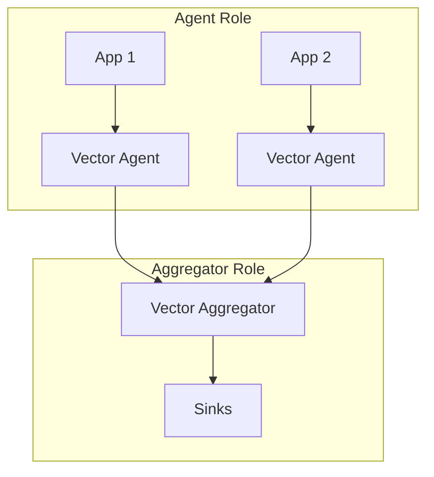
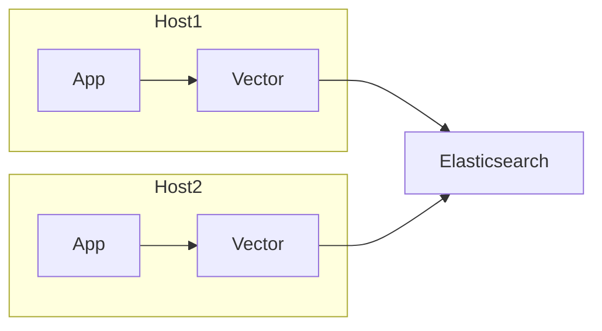
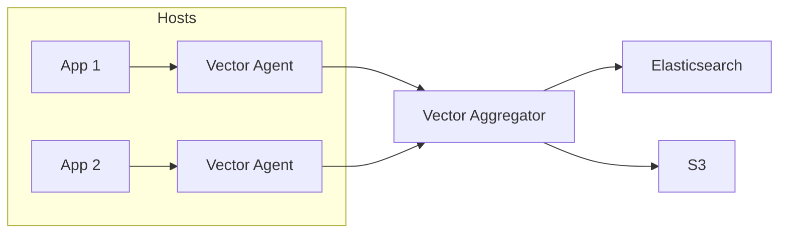

## Transforms Overview

Transforms process and modify data between sources and sinks. They're the heart of Vector's data processing capabilities. Vector supports **17 transforms**:

| Transform               | Type                      | Description                                                      |
| ----------------------- | ------------------------- | ---------------------------------------------------------------- |
| Remap with VRL          | `remap`                   | Modify your observability data using Vector Remap Language (VRL) |
| Aggregate               | `aggregate`               | Aggregate metrics passing through a topology                     |
| AWS EC2 Metadata        | `aws_ec2_metadata`        | Parse metadata emitted by AWS EC2 instances                      |
| Dedupe                  | `dedupe`                  | Deduplicate logs passing through a topology                      |
| Exclusive Route         | `exclusive_route`         | Routes events to unique sub-streams based on conditions          |
| Filter                  | `filter`                  | Filter events based on a set of conditions                       |
| Incremental to Absolute | `incremental_to_absolute` | Convert incremental metrics to absolute                          |
| Log to Metric           | `log_to_metric`           | Convert log events to metric events                              |
| Lua                     | `lua`                     | Modify event data using the Lua programming language             |
| Metric to Log           | `metric_to_log`           | Convert metric events to log events                              |
| Reduce                  | `reduce`                  | Collapse multiple log events into a single event                 |
| Route                   | `route`                   | Split a stream of events into multiple sub-streams               |
| Sample                  | `sample`                  | Sample events from an event stream at a configurable rate        |
| Tag Cardinality Limit   | `tag_cardinality_limit`   | Limit the cardinality of tags on metrics events                  |
| Throttle                | `throttle`                | Rate limit logs passing through a topology                       |
| Trace to Log            | `trace_to_log`            | Convert trace events to log events                               |
| Window                  | `window`                  | A variant of ring buffer or backtrace logging                    |

---

## All 17 Transforms with Complete Examples

Each transform below includes a complete working pipeline with source and sink.

### 1. Remap Transform (VRL)

The most powerful transform using Vector Remap Language:

```yaml
# Complete pipeline: File → Remap → Loki
sources:
  app_logs:
    type: file
    include:
      - /var/log/app/*.log

transforms:
  parse_logs:
    type: remap
    inputs:
      - app_logs
    source: |
      . = parse_json!(.message)
      .processed_at = now()
      .level = downcase!(.level)
      .environment = get_env_var("ENV") ?? "unknown"
      del(.password)
      del(.credit_card)

      if .level == "error" {
        .alert = true
        .priority = "high"
      }

sinks:
  loki:
    type: loki
    inputs:
      - parse_logs
    endpoint: "http://loki:3100"
    labels:
      level: "{{ level }}"
    encoding:
      codec: json
```


### 2. Filter Transform

Filter events based on conditions:

```yaml
# Complete pipeline: Kafka → Filter → Elasticsearch
sources:
  kafka_logs:
    type: kafka
    bootstrap_servers: "kafka:9092"
    group_id: "vector-consumer"
    topics:
      - application-logs

transforms:
  filter_errors:
    type: filter
    inputs:
      - kafka_logs
    condition: .level == "error" || .level == "warn"

sinks:
  elasticsearch:
    type: elasticsearch
    inputs:
      - filter_errors
    endpoints:
      - "https://elasticsearch:9200"
    bulk:
      index: "error-logs-%Y.%m.%d"
```

### 3. Route Transform

Route events to different outputs based on conditions:

```yaml
# Complete pipeline: Syslog → Route → Multiple Sinks
sources:
  syslog_input:
    type: syslog
    address: "0.0.0.0:514"
    mode: tcp

transforms:
  route_by_level:
    type: route
    inputs:
      - syslog_input
    route:
      errors: .severity == "err" || .severity == "crit"
      warnings: .severity == "warning"
      info: .severity == "info" || .severity == "notice"

sinks:
  error_sink:
    type: http
    inputs:
      - route_by_level.errors
    uri: "https://pagerduty.example.com/webhook"
    method: post
    encoding:
      codec: json

  warning_sink:
    type: loki
    inputs:
      - route_by_level.warnings
    endpoint: "http://loki:3100"
    labels:
      severity: warning
    encoding:
      codec: json

  info_sink:
    type: file
    inputs:
      - route_by_level.info
    path: "/var/log/vector/info-%Y-%m-%d.log"
    encoding:
      codec: json
```

### 4. Exclusive Route Transform

Routes events to exactly one sub-stream (first match wins):

```yaml
# Complete pipeline: HTTP Server → Exclusive Route → Multiple Sinks
sources:
  http_input:
    type: http_server
    address: "0.0.0.0:8080"
    path: "/logs"

transforms:
  exclusive_route_by_service:
    type: exclusive_route
    inputs:
      - http_input
    routes:
      - name: payment
        condition: .service == "payment"
      - name: auth
        condition: .service == "auth"
      - name: default
        condition: "true"

sinks:
  payment_sink:
    type: kafka
    inputs:
      - exclusive_route_by_service.payment
    bootstrap_servers: "kafka:9092"
    topic: "payment-logs"
    encoding:
      codec: json

  auth_sink:
    type: kafka
    inputs:
      - exclusive_route_by_service.auth
    bootstrap_servers: "kafka:9092"
    topic: "auth-logs"
    encoding:
      codec: json

  default_sink:
    type: kafka
    inputs:
      - exclusive_route_by_service.default
    bootstrap_servers: "kafka:9092"
    topic: "general-logs"
    encoding:
      codec: json
```

### 5. Sample Transform

Sample a percentage of events:

```yaml
# Complete pipeline: Docker Logs → Sample → S3
sources:
  docker_logs:
    type: docker_logs
    include_containers:
      - "app-*"

transforms:
  sample_logs:
    type: sample
    inputs:
      - docker_logs
    rate: 10  # Keep 1 in 10 events
    exclude:
      type: vrl
      source: .level == "error"  # Never sample errors

sinks:
  s3_archive:
    type: aws_s3
    inputs:
      - sample_logs
    bucket: "sampled-logs"
    key_prefix: "docker/%Y/%m/%d/"
    encoding:
      codec: json
    compression: gzip
```

### 6. Dedupe Transform

Remove duplicate events:

```yaml
# Complete pipeline: NATS → Dedupe → ClickHouse
sources:
  nats_input:
    type: nats
    url: "nats://nats:4222"
    subject: "logs.>"

transforms:
  dedupe_logs:
    type: dedupe
    inputs:
      - nats_input
    fields:
      match:
        - message
        - host
        - timestamp
    cache:
      num_events: 5000

sinks:
  clickhouse:
    type: clickhouse
    inputs:
      - dedupe_logs
    endpoint: "http://clickhouse:8123"
    database: "logs"
    table: "events"
    encoding:
      codec: json
```

### 7. Aggregate Transform

Aggregate metrics over time:

```yaml
# Complete pipeline: Host Metrics → Aggregate → Prometheus
sources:
  host_metrics:
    type: host_metrics
    collectors:
      - cpu
      - memory
      - disk
    scrape_interval_secs: 5

transforms:
  aggregate_metrics:
    type: aggregate
    inputs:
      - host_metrics
    interval_ms: 60000
    mode: auto

sinks:
  prometheus:
    type: prometheus_remote_write
    inputs:
      - aggregate_metrics
    endpoint: "http://prometheus:9090/api/v1/write"
```

### 8. Reduce Transform

Reduce multiple events into one:

```yaml
# Complete pipeline: Exec → Reduce → HTTP
sources:
  exec_logs:
    type: exec
    command:
      - "tail"
      - "-f"
      - "/var/log/multiline.log"
    mode: streaming

transforms:
  reduce_multiline:
    type: reduce
    inputs:
      - exec_logs
    group_by:
      - host
      - request_id
    merge_strategies:
      message: concat_newline
      count: sum
    ends_when: .final == true
    expire_after_ms: 30000

sinks:
  http_output:
    type: http
    inputs:
      - reduce_multiline
    uri: "https://api.example.com/logs"
    method: post
    encoding:
      codec: json
```

### 9. Throttle Transform

Rate limit events:

```yaml
# Complete pipeline: StatsD → Throttle → Datadog
sources:
  statsd_input:
    type: statsd
    address: "0.0.0.0:8125"
    mode: udp

transforms:
  throttle_metrics:
    type: throttle
    inputs:
      - statsd_input
    threshold: 1000
    window_secs: 60
    key_field: name

sinks:
  datadog:
    type: datadog_metrics
    inputs:
      - throttle_metrics
    default_api_key: "${DD_API_KEY}"
```

### 10. Log to Metric Transform

Convert log events to metric events:

```yaml
# Complete pipeline: File → Log to Metric → Prometheus Exporter
sources:
  access_logs:
    type: file
    include:
      - /var/log/nginx/access.log

transforms:
  parse_access:
    type: remap
    inputs:
      - access_logs
    source: |
      . = parse_nginx_log!(.message, "combined")

  log_to_metric:
    type: log_to_metric
    inputs:
      - parse_access
    metrics:
      - type: counter
        field: status
        name: http_requests_total
        tags:
          status: "{{ status }}"
          method: "{{ method }}"
          path: "{{ path }}"
      - type: histogram
        field: size
        name: http_response_size_bytes
        tags:
          status: "{{ status }}"

sinks:
  prometheus_exporter:
    type: prometheus_exporter
    inputs:
      - log_to_metric
    address: "0.0.0.0:9598"
```

### 11. Metric to Log Transform

Convert metric events to log events:

```yaml
# Complete pipeline: Prometheus Scrape → Metric to Log → Elasticsearch
sources:
  prometheus_scrape:
    type: prometheus_scrape
    endpoints:
      - "http://app:9090/metrics"
    scrape_interval_secs: 30

transforms:
  metric_to_log:
    type: metric_to_log
    inputs:
      - prometheus_scrape
    host_tag: host
    timezone: local

sinks:
  elasticsearch:
    type: elasticsearch
    inputs:
      - metric_to_log
    endpoints:
      - "https://elasticsearch:9200"
    bulk:
      index: "metrics-as-logs-%Y.%m.%d"
```

### 12. AWS EC2 Metadata Transform

Enrich events with EC2 instance metadata:

```yaml
# Complete pipeline: JournalD → AWS EC2 Metadata → CloudWatch
sources:
  journald:
    type: journald
    include_units:
      - myapp.service

transforms:
  add_ec2_metadata:
    type: aws_ec2_metadata
    inputs:
      - journald
    namespace: ec2
    fields:
      - instance-id
      - ami-id
      - availability-zone
      - region
      - instance-type

sinks:
  cloudwatch:
    type: aws_cloudwatch_logs
    inputs:
      - add_ec2_metadata
    region: "us-east-1"
    group_name: "/ec2/{{ ec2.instance-id }}/app"
    stream_name: "{{ ec2.availability-zone }}"
    encoding:
      codec: json
```

### 13. Tag Cardinality Limit Transform

Limit the cardinality of tags on metrics:

```yaml
# Complete pipeline: Internal Metrics → Tag Cardinality Limit → Prometheus
sources:
  internal_metrics:
    type: internal_metrics
    scrape_interval_secs: 15

transforms:
  limit_cardinality:
    type: tag_cardinality_limit
    inputs:
      - internal_metrics
    mode: exact
    limit_exceeded_action: drop_tag
    value_limit: 500

sinks:
  prometheus:
    type: prometheus_remote_write
    inputs:
      - limit_cardinality
    endpoint: "http://mimir:9009/api/v1/push"
```

### 14. Incremental to Absolute Transform

Convert incremental metrics to absolute:

```yaml
# Complete pipeline: StatsD → Incremental to Absolute → InfluxDB
sources:
  statsd:
    type: statsd
    address: "0.0.0.0:8125"

transforms:
  to_absolute:
    type: incremental_to_absolute
    inputs:
      - statsd

sinks:
  influxdb:
    type: influxdb_metrics
    inputs:
      - to_absolute
    endpoint: "http://influxdb:8086"
    org: "myorg"
    bucket: "metrics"
    token: "${INFLUXDB_TOKEN}"
```

### 15. Lua Transform

Custom Lua scripting for complex transformations:

```yaml
# Complete pipeline: Redis → Lua → Console
sources:
  redis_input:
    type: redis
    url: "redis://redis:6379"
    key: "logs"
    data_type: list

transforms:
  lua_transform:
    type: lua
    inputs:
      - redis_input
    version: "2"
    source: |
      function process(event, emit)
        event.log.processed_by = "lua"
        event.log.word_count = 0

        if event.log.message then
          for _ in string.gmatch(event.log.message, "%S+") do
            event.log.word_count = event.log.word_count + 1
          end
        end

        emit(event)
      end

sinks:
  console:
    type: console
    inputs:
      - lua_transform
    encoding:
      codec: json
```

### 16. Trace to Log Transform

Convert trace events to log events:

```yaml
# Complete pipeline: OpenTelemetry → Trace to Log → Loki
sources:
  otel:
    type: opentelemetry
    grpc:
      address: "0.0.0.0:4317"
    http:
      address: "0.0.0.0:4318"

transforms:
  trace_to_log:
    type: trace_to_log
    inputs:
      - otel

sinks:
  loki:
    type: loki
    inputs:
      - trace_to_log
    endpoint: "http://loki:3100"
    labels:
      source: traces
      service: "{{ service.name }}"
    encoding:
      codec: json
```

### 17. Window Transform

Ring buffer / backtrace logging - keeps events in a window and releases them on trigger:

```yaml
# Complete pipeline: File → Window → HTTP (only sends context around errors)
sources:
  app_logs:
    type: file
    include:
      - /var/log/app/*.log

transforms:
  parse_json:
    type: remap
    inputs:
      - app_logs
    source: |
      . = parse_json!(.message)

  window_around_errors:
    type: window
    inputs:
      - parse_json
    size: 50
    trigger:
      type: vrl
      source: .level == "error"

sinks:
  error_context:
    type: http
    inputs:
      - window_around_errors
    uri: "https://alerts.example.com/error-context"
    method: post
    encoding:
      codec: json
```

---


## VRL Advanced Patterns

### Advanced Functions

#### Parsing Functions

```yaml
source: |
  # Parse Apache/NGINX logs
  . = parse_apache_log!(.message, "combined")
  . = parse_nginx_log!(.message, "combined")

  # Parse with Grok patterns
  . = parse_grok!(.message, "%{TIMESTAMP_ISO8601:timestamp} %{LOGLEVEL:level} %{GREEDYDATA:message}")

  # Parse CSV
  . = parse_csv!(.message)

  # Parse XML
  . = parse_xml!(.message)
```

#### Encoding Functions

```yaml
source: |
  # Base64 encoding
  .encoded = encode_base64(.data)
  .decoded = decode_base64!(.encoded)

  # JSON encoding
  .json_string = encode_json(.)

  # Key-value encoding
  .kv_string = encode_key_value(., field_delimiter: ",", key_value_delimiter: "=")
```

#### Cryptographic Functions

```yaml
source: |
  # Hashing
  .hash = sha256(.message)
  .md5_hash = md5(.message)

  # HMAC
  .hmac = hmac(.message, "secret_key", "sha256")
```

#### Array Functions

```yaml
source: |
  # Array manipulation
  .tags = push(.tags, "new_tag")
  .tags = append(.tags, ["tag1", "tag2"])
  .flat = flatten(.nested_array)

  # Array filtering
  .errors = filter(.logs) -> |log| { log.level == "error" }

  # Array mapping
  .levels = map(.logs) -> |log| { log.level }
```

#### Object Functions

```yaml
source: |
  # Object manipulation
  .all_keys = keys(.)
  .all_values = values(.)
  . = merge(., {"new_field": "value"})

  # Nested access
  .value = get(., ["nested", "path", "to", "value"]) ?? "default"
```

### Advanced Error Handling

```yaml
transforms:
  advanced_error_handling:
    type: remap
    inputs:
      - source
    drop_on_error: false
    reroute_dropped: true
    source: |
      # Try multiple parsing strategies
      parsed, err = parse_json(.message)
      if err != null {
        parsed, err = parse_key_value(.message)
      }
      if err != null {
        parsed, err = parse_syslog(.message)
      }
      if err != null {
        # Keep raw message if all parsing fails
        .parse_failed = true
        .raw_message = .message
      } else {
        . = merge(., parsed)
      }

sinks:
  main_sink:
    type: elasticsearch
    inputs:
      - advanced_error_handling

  dead_letter_queue:
    type: aws_s3
    inputs:
      - advanced_error_handling.dropped
    bucket: "dlq-bucket"
    key_prefix: "failed-events/"
```

### Real-world VRL Patterns

#### Multi-format Log Parsing

```yaml
source: |
  # Detect and parse different log formats
  if starts_with(.message, "{") {
    . = parse_json!(.message)
    .format = "json"
  } else if contains(.message, " - - [") {
    . = parse_apache_log!(.message, "combined")
    .format = "apache"
  } else if match(.message, r'^\d{4}-\d{2}-\d{2}') {
    . = parse_regex!(.message, r'^(?P<timestamp>\d{4}-\d{2}-\d{2}T\d{2}:\d{2}:\d{2}) (?P<level>\w+) (?P<message>.*)$')
    .format = "custom"
  } else {
    .format = "raw"
  }
```

#### PII Redaction

```yaml
source: |
  # Redact email addresses
  .message = replace(.message, r'\b[A-Za-z0-9._%+-]+@[A-Za-z0-9.-]+\.[A-Z|a-z]{2,}\b', "[EMAIL_REDACTED]")

  # Redact credit card numbers
  .message = replace(.message, r'\b\d{4}[- ]?\d{4}[- ]?\d{4}[- ]?\d{4}\b', "[CC_REDACTED]")

  # Redact SSN
  .message = replace(.message, r'\b\d{3}-\d{2}-\d{4}\b', "[SSN_REDACTED]")

  # Remove sensitive fields
  del(.password)
  del(.api_key)
  del(.secret)
```

#### Timestamp Normalization

```yaml
source: |
  # Try multiple timestamp formats
  ts = .timestamp ?? .time ?? .@timestamp ?? .ts

  if is_string(ts) {
    # Try ISO 8601
    parsed_ts, err = parse_timestamp(ts, "%Y-%m-%dT%H:%M:%S%.fZ")
    if err != null {
      # Try Unix timestamp
      parsed_ts, err = parse_timestamp(ts, "%s")
    }
    if err != null {
      # Try common format
      parsed_ts, err = parse_timestamp(ts, "%Y-%m-%d %H:%M:%S")
    }
    if err == null {
      .timestamp = parsed_ts
    }
  } else if is_integer(ts) {
    .timestamp = from_unix_timestamp!(ts)
  }

  # Clean up duplicate fields
  del(.time)
  del(.@timestamp)
  del(.ts)
```

---

## Deployment Patterns

### Deployment Roles

Vector can be deployed in different roles:



| Role           | Description                            | Use Case                               |
| -------------- | -------------------------------------- | -------------------------------------- |
| **Agent**      | Runs on each host, collects local data | Edge collection, minimal processing    |
| **Aggregator** | Centralized processing                 | Complex transforms, routing, buffering |
| **Sidecar**    | Runs alongside application container   | Kubernetes pod-level collection        |

### Deployment Topologies

#### Distributed Topology



```yaml
# Agent configuration (on each host)
sources:
  app_logs:
    type: file
    include:
      - /var/log/app/*.log

sinks:
  elasticsearch:
    type: elasticsearch
    inputs:
      - app_logs
    endpoints:
      - "https://elasticsearch:9200"
```

#### Centralized Topology



```yaml
# Agent configuration
sources:
  app_logs:
    type: file
    include:
      - /var/log/app/*.log

sinks:
  aggregator:
    type: vector
    inputs:
      - app_logs
    address: "aggregator.example.com:9000"
```

```yaml
# Aggregator configuration
sources:
  agents:
    type: vector
    address: "0.0.0.0:9000"

transforms:
  parse:
    type: remap
    inputs:
      - agents
    source: |
      . = parse_json!(.message)

sinks:
  elasticsearch:
    type: elasticsearch
    inputs:
      - parse
    endpoints:
      - "https://elasticsearch:9200"
```

---

## Docker Deployment

### Docker Compose Example

```yaml
# docker-compose.yaml
version: '3.8'

services:
  vector:
    image: timberio/vector:latest-alpine
    volumes:
      - ./vector.yaml:/etc/vector/vector.yaml:ro
      - /var/log:/var/log:ro
      - vector-data:/var/lib/vector
    ports:
      - "8686:8686"  # API
      - "9598:9598"  # Prometheus metrics
    environment:
      - VECTOR_LOG=info
      - ES_ENDPOINT=https://elasticsearch:9200
      - ES_USER=elastic
      - ES_PASSWORD=changeme
    restart: unless-stopped

volumes:
  vector-data:
```

### Multi-container Setup

```yaml
# docker-compose.yaml
version: '3.8'

services:
  vector-agent:
    image: timberio/vector:latest-alpine
    volumes:
      - ./agent.yaml:/etc/vector/vector.yaml:ro
      - /var/log:/var/log:ro
    depends_on:
      - vector-aggregator

  vector-aggregator:
    image: timberio/vector:latest-alpine
    volumes:
      - ./aggregator.yaml:/etc/vector/vector.yaml:ro
      - aggregator-data:/var/lib/vector
    ports:
      - "9000:9000"
      - "8686:8686"

volumes:
  aggregator-data:
```

---

## Kubernetes Deployment

### Helm Installation

```bash
# Add Vector Helm repository
helm repo add vector https://helm.vector.dev
helm repo update

# Install as DaemonSet (agent)
helm install vector vector/vector \
  --namespace vector \
  --create-namespace \
  --set role=Agent

# Install as Deployment (aggregator)
helm install vector-aggregator vector/vector \
  --namespace vector \
  --set role=Aggregator \
  --set replicas=3
```

### DaemonSet Configuration (Agent)

```yaml
# values.yaml for agent
role: Agent

customConfig:
  sources:
    kubernetes_logs:
      type: kubernetes_logs
      auto_partial_merge: true

  transforms:
    parse:
      type: remap
      inputs:
        - kubernetes_logs
      source: |
        parsed, err = parse_json(.message)
        if err == null {
          . = merge(., parsed)
        }

  sinks:
    loki:
      type: loki
      inputs:
        - parse
      endpoint: "http://loki:3100"
      labels:
        namespace: "{{ kubernetes.namespace }}"
        pod: "{{ kubernetes.pod_name }}"
      encoding:
        codec: json

resources:
  requests:
    cpu: 100m
    memory: 128Mi
  limits:
    cpu: 500m
    memory: 512Mi
```

### Deployment Configuration (Aggregator)

```yaml
# values.yaml for aggregator
role: Aggregator
replicas: 3

customConfig:
  sources:
    vector_agents:
      type: vector
      address: "0.0.0.0:9000"

  transforms:
    enrich:
      type: remap
      inputs:
        - vector_agents
      source: |
        .cluster = get_env_var("CLUSTER_NAME") ?? "unknown"

  sinks:
    elasticsearch:
      type: elasticsearch
      inputs:
        - enrich
      endpoints:
        - "https://elasticsearch:9200"
      bulk:
        index: "logs-%Y.%m.%d"

service:
  ports:
    - name: vector
      port: 9000
      targetPort: 9000

resources:
  requests:
    cpu: 500m
    memory: 512Mi
  limits:
    cpu: 2000m
    memory: 2Gi
```

### Complete Kubernetes Example

```yaml
# vector-agent-configmap.yaml
apiVersion: v1
kind: ConfigMap
metadata:
  name: vector-agent-config
  namespace: vector
data:
  vector.yaml: |
    sources:
      kubernetes_logs:
        type: kubernetes_logs
        auto_partial_merge: true
        exclude_paths_glob_patterns:
          - "**/kube-system/**"
          - "**/vector/**"

    transforms:
      parse:
        type: remap
        inputs:
          - kubernetes_logs
        source: |
          parsed, err = parse_json(.message)
          if err == null {
            . = merge(., parsed)
          }
          .cluster = "${CLUSTER_NAME}"

    sinks:
      aggregator:
        type: vector
        inputs:
          - parse
        address: "vector-aggregator.vector.svc.cluster.local:9000"
---
# vector-agent-daemonset.yaml
apiVersion: apps/v1
kind: DaemonSet
metadata:
  name: vector-agent
  namespace: vector
spec:
  selector:
    matchLabels:
      app: vector-agent
  template:
    metadata:
      labels:
        app: vector-agent
    spec:
      serviceAccountName: vector
      containers:
        - name: vector
          image: timberio/vector:latest-alpine
          args:
            - --config
            - /etc/vector/vector.yaml
          env:
            - name: CLUSTER_NAME
              value: "production"
            - name: VECTOR_LOG
              value: "info"
          volumeMounts:
            - name: config
              mountPath: /etc/vector
            - name: var-log
              mountPath: /var/log
              readOnly: true
            - name: var-lib-docker
              mountPath: /var/lib/docker
              readOnly: true
          resources:
            requests:
              cpu: 100m
              memory: 128Mi
            limits:
              cpu: 500m
              memory: 512Mi
      volumes:
        - name: config
          configMap:
            name: vector-agent-config
        - name: var-log
          hostPath:
            path: /var/log
        - name: var-lib-docker
          hostPath:
            path: /var/lib/docker
```

---


## Administration & Operations

### Configuration Management

#### Multiple Config Files

```bash
# Load multiple config files
vector --config /etc/vector/base.yaml --config /etc/vector/sources.yaml --config /etc/vector/sinks.yaml

# Load from directory
vector --config-dir /etc/vector/conf.d/
```

#### Hot Reloading

```bash
# Watch for config changes and reload automatically
vector --config /etc/vector/vector.yaml --watch-config
```

### Validation & Testing

#### Validate Configuration

```bash
# Basic validation
vector validate /etc/vector/vector.yaml

# Strict validation (fail on warnings)
vector validate --strict /etc/vector/vector.yaml

# Deny warnings
vector validate --deny-warnings /etc/vector/vector.yaml
```

#### Unit Testing

```yaml
# Add tests to your configuration
tests:
  - name: "Test JSON parsing"
    inputs:
      - insert_at: parse_logs
        type: log
        log:
          message: '{"level": "error", "msg": "test"}'
    outputs:
      - extract_from: parse_logs
        conditions:
          - type: vrl
            source: |
              assert_eq!(.level, "error")
              assert_eq!(.msg, "test")

  - name: "Test error filtering"
    inputs:
      - insert_at: filter_errors
        type: log
        log:
          level: "info"
          message: "test"
    no_outputs_from:
      - filter_errors
```

```bash
# Run tests
vector test /etc/vector/vector.yaml
```

### Monitoring Vector

#### Internal Metrics

```yaml
sources:
  internal_metrics:
    type: internal_metrics
    scrape_interval_secs: 30

sinks:
  prometheus_exporter:
    type: prometheus_exporter
    inputs:
      - internal_metrics
    address: "0.0.0.0:9598"
```

#### Key Metrics to Monitor

| Metric                                   | Description                  |
| ---------------------------------------- | ---------------------------- |
| `vector_component_received_events_total` | Events received by component |
| `vector_component_sent_events_total`     | Events sent by component     |
| `vector_component_errors_total`          | Errors by component          |
| `vector_buffer_events`                   | Events in buffer             |
| `vector_buffer_byte_size`                | Buffer size in bytes         |
| `vector_utilization`                     | Component utilization        |

#### Internal Logs

```yaml
sources:
  internal_logs:
    type: internal_logs

sinks:
  vector_logs:
    type: file
    inputs:
      - internal_logs
    path: /var/log/vector/vector.log
    encoding:
      codec: json
```

### CLI Tools

#### vector top

Real-time monitoring of Vector components:

```bash
vector top
```

#### vector tap

Live debugging - tap into component output:

```bash
# Tap into a specific component
vector tap parse_logs

# Tap with pattern matching
vector tap --pattern "*.errors"

# Tap with output limit
vector tap parse_logs --limit 100
```

#### vector graph

Visualize pipeline topology:

```bash
# Generate DOT format
vector graph /etc/vector/vector.yaml

# Generate SVG
vector graph /etc/vector/vector.yaml | dot -Tsvg > pipeline.svg
```

#### vector vrl

Test VRL expressions interactively:

```bash
vector vrl

# Example session:
$ .message = "hello world"
$ upcase!(.message)
"HELLO WORLD"
$ parse_json!("{\"key\": \"value\"}")
{ "key": "value" }
```

### systemd Integration

```ini
# /etc/systemd/system/vector.service
[Unit]
Description=Vector
Documentation=https://vector.dev
After=network-online.target
Requires=network-online.target

[Service]
User=vector
Group=vector
ExecStart=/usr/bin/vector --config /etc/vector/vector.yaml
ExecReload=/bin/kill -HUP $MAINPID
Restart=always
RestartSec=5
StandardOutput=journal
StandardError=journal
LimitNOFILE=65536

[Install]
WantedBy=multi-user.target
```

```bash
# Enable and start
sudo systemctl enable vector
sudo systemctl start vector

# Check status
sudo systemctl status vector

# View logs
sudo journalctl -u vector -f
```

### Best Practices

#### Use Disk Buffers for Critical Data

```yaml
sinks:
  critical_sink:
    type: elasticsearch
    buffer:
      type: disk
      max_size: 1073741824  # 1GB
      when_full: block
```

#### Implement Dead Letter Queues

```yaml
transforms:
  parse_with_fallback:
    type: remap
    inputs:
      - source
    drop_on_error: false
    reroute_dropped: true
    source: |
      . = parse_json!(.message)

sinks:
  main_sink:
    type: elasticsearch
    inputs:
      - parse_with_fallback

  dead_letter_queue:
    type: aws_s3
    inputs:
      - parse_with_fallback.dropped
    bucket: "dlq-bucket"
    key_prefix: "failed-events/"
```

#### Enable Acknowledgements

```yaml
sources:
  kafka_source:
    type: kafka
    acknowledgements:
      enabled: true

sinks:
  elasticsearch:
    type: elasticsearch
    acknowledgements:
      enabled: true
```

---

## Complete Pipeline Examples

### Multi-Source to Multi-Sink with Routing

```yaml
sources:
  nginx_logs:
    type: file
    include:
      - /var/log/nginx/access.log

  app_logs:
    type: file
    include:
      - /var/log/app/*.log

  syslog:
    type: syslog
    address: "0.0.0.0:514"
    mode: tcp

transforms:
  parse_nginx:
    type: remap
    inputs:
      - nginx_logs
    source: |
      . = parse_nginx_log!(.message, "combined")
      .source = "nginx"

  parse_app:
    type: remap
    inputs:
      - app_logs
    source: |
      . = parse_json!(.message)
      .source = "application"

  parse_syslog:
    type: remap
    inputs:
      - syslog
    source: |
      .source = "syslog"

  merge_all:
    type: remap
    inputs:
      - parse_nginx
      - parse_app
      - parse_syslog
    source: |
      .processed_at = now()
      .environment = get_env_var("ENV") ?? "production"

  route_logs:
    type: route
    inputs:
      - merge_all
    route:
      errors: .level == "error" || .status >= 500
      access: .source == "nginx"
      application: .source == "application"

sinks:
  error_alerts:
    type: http
    inputs:
      - route_logs.errors
    uri: "https://alerts.example.com/webhook"
    method: post
    encoding:
      codec: json

  s3_archive:
    type: aws_s3
    inputs:
      - route_logs.access
    bucket: "access-logs-archive"
    key_prefix: "nginx/%Y/%m/%d/"
    encoding:
      codec: json
    compression: gzip

  loki:
    type: loki
    inputs:
      - route_logs.application
    endpoint: "http://loki:3100"
    labels:
      app: "{{ app_name }}"
      level: "{{ level }}"
    encoding:
      codec: json

  elasticsearch:
    type: elasticsearch
    inputs:
      - merge_all
    endpoints:
      - "https://elasticsearch:9200"
    bulk:
      index: "all-logs-%Y.%m.%d"
```

---

## Next Steps

Continue to:
- **[Vector Advanced](/posts/vector-advanced-architecture-production-comparisons/)** - Architecture internals, production hardening, comparisons with Fluent Bit, Grafana Alloy, Logstash

## References

- [Vector Transforms Reference](https://vector.dev/docs/reference/configuration/transforms/)
- [VRL Functions Reference](https://vector.dev/docs/reference/vrl/functions/)
- [Vector Helm Charts](https://github.com/vectordotdev/helm-charts)
