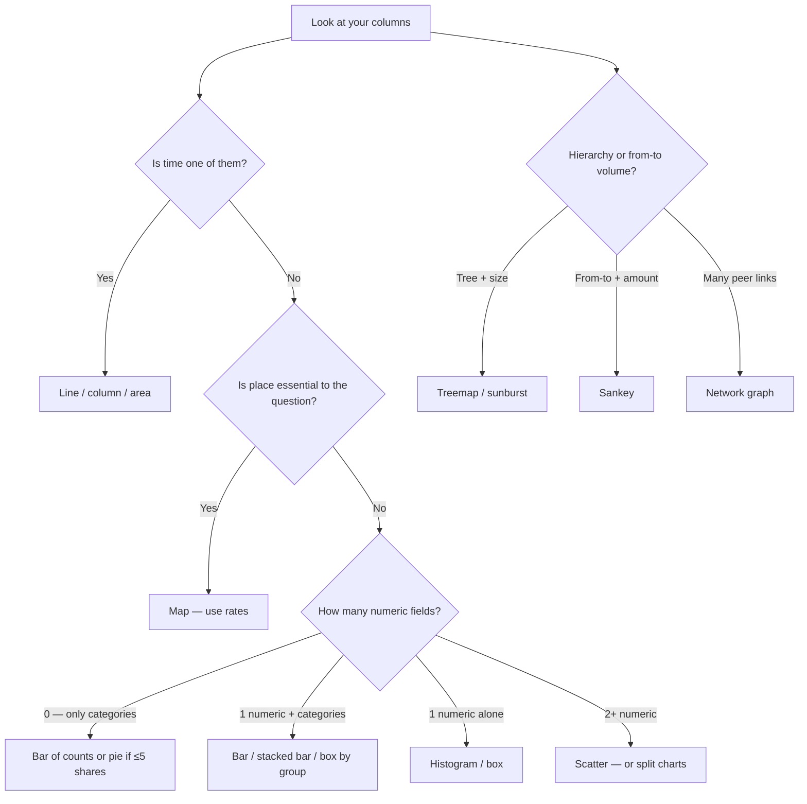

Most “wrong chart” mistakes are not about taste. They are a **mismatch between the data you have and the picture you chose**.

This guide starts from the **spreadsheet**, not the story:

1. What **types** of columns do you have?
2. How many variables are you plotting?
3. What **question** are you answering?
4. Which chart fits — and which to avoid?

For the companion guide that starts from *intent* (“compare / trend / process / architecture”) and tools (Sheets, Mermaid, Flourish…), see **Data Visualization for Beginners: Charts, Diagrams & Tools That Communicate** (`_drafts/data-visualization-techniques-tools-beginners-guide.md` — swap to `` when both are published).

## TL;DR — Data shape → chart

| What you have in the sheet | Typical columns | First-choice chart | Avoid |
| -------------------------- | --------------- | ------------------ | ----- |
| **Categories + one number** | Region, Sales | Bar / column | Pie with many slices |
| **One number’s shape** | Delivery_days | Histogram (or box plot) | Pie |
| **Two numbers** | Price, Rating | Scatter | Line (unless X is ordered time) |
| **Time + one number** | Month, Revenue | Line (or column if few dates) | Pie |
| **Categories that sum to 100%** | Channel, Share_% | Pie (≤5) or stacked bar | Pie with 12+ slices |
| **Category × category counts** | Dept, Severity | Heatmap / grouped bar | Single pie |
| **Places + a rate** | State, Cases_per_100k | Choropleth map | Raw counts on unequal areas |
| **Parent → child sizes** | Folder, Size_MB | Treemap / sunburst | Mind map for “how big” |
| **From → to + amount** | Source, Target, Volume | Sankey | Flowchart (no quantities) |
| **Who connects to whom** | Node_A, Node_B | Network graph | Single-root mind map |
| **Many categories, cleaner than fat bars** | Region, Sales | Lollipop / dot plot | 3D bars |
| **Two dates only (before → after)** | Group, Value_t0, Value_t1 | Slope chart | Spaghetti multi-line |
| **Dense scatter (too many points)** | X, Y | Hexbin / density | Opaque overplotted dots |
| **Shares as a grid of units** | Category, Count | Waffle (or stacked bar) | Pie with tiny slices |

> Jump to [Data types in plain language](#data-types-in-plain-language), the [master matrix](#master-matrix-data--question--chart), or [Observable Plot gallery → forms](#observable-plot-gallery--forms-you-can-reuse).

## Table of Contents

- [TL;DR — Data shape → chart](#tldr--data-shape--chart)
- [How this guide differs from the beginners guide](#how-this-guide-differs-from-the-beginners-guide)
- [Data types in plain language](#data-types-in-plain-language)
- [Count your variables](#count-your-variables)
- [Master matrix: data × question → chart](#master-matrix-data--question--chart)
- [Recipes by data type](#recipes-by-data-type)
- [Observable Plot gallery → forms you can reuse](#observable-plot-gallery--forms-you-can-reuse)
- [Combinations you will actually meet](#combinations-you-will-actually-meet)
- [Decision flow](#decision-flow)
- [Common mismatches](#common-mismatches)
- [When to use what](#when-to-use-what)
- [FAQ](#faq)
- [References](#references)

## How this guide differs from the beginners guide

| | **This post** | **Beginners / tools post** |
| - | ------------- | -------------------------- |
| Starts from | Columns & data types | Communication intent |
| Answers | “Given this table, which chart?” | “Given this story, which picture + tool?” |
| Includes | Field recipes, N variables, pitfalls | Architecture, DFD, Mermaid, canvas vs code |
| Best for | Analysts, Sheets users, chart choosers | Presenters, diagrammers, system explainers |

Use **both**: pick the form here from your data; build and polish it with tools from the beginners guide.

## Data types in plain language

Think in **columns**, not jargon.

| Data type | Plain meaning | Spreadsheet examples | Also called |
| --------- | ------------- | -------------------- | ----------- |
| **Categorical** | Labels / groups | Country, Product, Status, Yes/No | Nominal / qualitative |
| **Ordinal** | Categories with order | Low/Med/High, star ratings 1–5 | Ordered categorical |
| **Numeric (continuous)** | Measured amounts | Revenue, latency_ms, temperature | Quantitative / continuous |
| **Numeric (discrete counts)** | Whole counts | Orders, clicks, defects | Discrete quantitative |
| **Temporal** | Time stamps or periods | Date, Month, Hour | Time series |
| **Geographic** | Places | Country, State, lat/lon | Spatial |
| **Hierarchical** | Nested parts | Region → City → Store; folder trees | Tree / nested |
| **Relational / network** | Links between entities | User→User, Service→Service | Graph edges |
| **Flow (from–to + weight)** | Movement with volume | Source, Target, Bytes | Origin–destination |

**Quick tests**

- If you can **sort meaningfully** (Low < Med < High) → ordinal, not plain categorical.  
- If the average is meaningful (₹, ms, °C) → numeric.  
- If X is a calendar or clock → temporal (even if stored as text dates — fix the type first).  
- If “next to” on a map matters for the question → geographic; otherwise a bar by region may be clearer.

## Count your variables

Chart choice also depends on **how many fields** you encode at once.

| # of fields encoded | Example | Comfort zone for non-technical slides |
| ------------------- | ------- | ------------------------------------- |
| **1** | Distribution of ages | Histogram / box |
| **2** | Sales by region; price vs rating | Bar or scatter |
| **3** | Sales by region over months | Line + color, small multiples, or stacked bar |
| **4+** | Many metrics at once | Split into multiple charts — don’t force one plot |

Color, size, and shape can encode extra fields — but each extra encoding raises cognitive load. Prefer **small multiples** (one chart per category) over a spaghetti plot.

## Master matrix: data × question → chart

Rows = what the data supports. Columns = what you want to see.

| Data you have ↓ / Question → | **Compare** | **Distribute** | **Relate** | **Compose (parts)** | **Change over time** | **Locate** |
| ---------------------------- | ----------- | -------------- | ---------- | ------------------- | -------------------- | ---------- |
| **1 categorical** | Bar of counts | — | — | Pie / waffle (few) | — | — |
| **1 numeric** | — | Histogram, box | — | — | — | — |
| **1 cat + 1 numeric** | Bar / lollipop | Box by group | — | Stacked bar / treemap | — | Dot map if places |
| **2 numeric** | — | — | Scatter | — | — | — |
| **Temporal + numeric** | Few dates → column | — | — | Stacked area (careful) | **Line / area** | — |
| **2 categorical** | Grouped bar | — | Heatmap of counts | Mosaic (advanced) | — | — |
| **Geo + numeric rate** | Bar by region | — | — | — | Small-multi maps | **Choropleth / symbols** |
| **Hierarchy + size** | — | — | — | **Treemap / sunburst** | — | — |
| **Edges (network)** | — | — | **Network / arc** | — | — | — |
| **From–to + volume** | — | — | — | — | — | — → use **Sankey** |

“—” means that pairing is a weak fit; change the question or reshape the data.

## Recipes by data type

### Categorical (+ optional number)

**Columns:** `Category`, optional `Value` (sum/count/average).

| Goal | Chart | Notes |
| ---- | ----- | ----- |
| Rank groups | **Horizontal bar** | Best with long labels |
| Few shares of a whole | **Pie / donut** | ≤5 slices; else bar |
| Mix inside groups | **Stacked or grouped bar** | Grouped for compare; stacked for mix |

**Pitfall:** Treating ordinal labels as unordered (e.g. sorting “High, Low, Med” alphabetically). Keep natural order.

### One numeric variable (distribution)

**Columns:** `Value` (many rows).

| Goal | Chart | Notes |
| ---- | ----- | ----- |
| Shape of values | **Histogram** | Choose sensible bin width |
| Summary + outliers | **Box plot** | Explain whiskers once for non-tech audiences |
| Smooth shape | Density / KDE | More advanced; histogram is enough for most slides |

**Pitfall:** Using a pie — pies need categories, not a raw numeric list.

### Two numeric variables (relationship)

**Columns:** `X`, `Y` (optional `Size`, `Color` for a third field).

| Goal | Chart | Notes |
| ---- | ----- | ----- |
| Association / outliers | **Scatter** | Association ≠ causation |
| Dense clouds | Hexbin / 2D density | When points overlap heavily |
| Third numeric lightly | Bubble (size) | Easy to abuse; label legends |

**Pitfall:** Connecting scatter points with lines when X is not time or another ordered scale.

### Temporal + numeric

**Columns:** `Date` or `Period`, `Value` (optional `Series`).

| Goal | Chart | Notes |
| ---- | ----- | ----- |
| Trend | **Line** | Default for many timestamps |
| Few periods | **Column** | e.g. 4 quarters |
| Part-to-whole over time | Stacked area | Hard to read; prefer small multiples |
| Two moments only | Slope chart | Before → after |

**Pitfall:** Bar charts with 50+ dates — switch to a line.

### Geographic

**Columns:** region name **or** `lat`,`lon`, plus a **rate** when regions differ in size.

| Goal | Chart | Notes |
| ---- | ----- | ----- |
| Pattern on the map | **Choropleth** (regions) | Prefer rates (per 100k, %) |
| Points of interest | **Symbol / dot map** | Size ∝ value carefully |
| “Which place is highest?” only | **Bar by region** | Often clearer than a map |

**Pitfall:** Mapping raw counts on large vs small regions — big areas look “worse” by area alone.

### Hierarchical

**Columns:** `Level1`, `Level2`, … and `Size`.

| Goal | Chart | Notes |
| ---- | ----- | ----- |
| Size inside a tree | **Treemap** | Area = importance |
| Interactive drill-down | **Sunburst** | Rings = depth |
| Soft groupings | Circle packing | Organic; less precise compare |

**Pitfall:** Using a mind map to show *magnitude* — mind maps don’t encode size well.

### Network & flow

| Data | Columns | Chart |
| ---- | ------- | ----- |
| Links without volume | `From`, `To` | Network / force-directed |
| Links in a sequence | Ordered nodes + edges | Arc diagram |
| Paths with volume | `From`, `To`, `Amount` | **Sankey** |
| Object lifecycle | State, Event | State diagram *(structure, not a table chart)* |

**Pitfall:** Drawing a flowchart when the story is **how much** moved — use Sankey.

## Observable Plot gallery → forms you can reuse

[Observable Plot](https://observablehq.com/plot) does not ship named “chart types.” It layers **marks** (dot, bar, line, area, geo…). The public [Plot Gallery](https://observablehq.com/@observablehq/plot-gallery) (~140 curated examples, retrieved 2026-09-25) is still the best inventory of *practical* forms those marks produce.

Below: gallery families → when the **data** justifies them → beginner-friendly name. Use this to expand beyond the TL;DR without memorizing every notebook title.

### Dot, image, text (points & distributions of points)

| Gallery-style form | Data you need | Use when |
| ------------------ | ------------- | -------- |
| **Scatterplot** (+ color / symbol / size) | 2 numeric (+ optional cat/color) | Relationship, clusters, outliers |
| **Dot plot / beeswarm / dodge** | 1 numeric + category | Compare distributions without full box plots |
| **Hexbin / density / dot heatmap** | 2 numeric, large *N* | Overplotting kills a raw scatter |
| **Bubble map** | Geo + numeric size | Magnitude at places (legend carefully) |
| **QQ plot** | 1 numeric vs theoretical or another sample | Distribution shape vs a model (technical) |
| **Isotype / unit dots** | Category + count | Pictogram-style counts for non-tech slides |

### Bar, cell, rect (categories, bins, grids)

| Gallery-style form | Data you need | Use when |
| ------------------ | ------------- | -------- |
| **Bar / grouped / stacked / diverging bar** | Category + numeric (+ series) | Ranking, mixes, opinion scales (−/+ ) |
| **Histogram / stacked / overlapping hist** | 1 numeric (binned) | Shape of a distribution |
| **Box plot (binned)** | Numeric + category | Spread + outliers by group |
| **Heatmap / calendar / correlation matrix** | 2 categorical or time×category + value | Intensity grids; weekday patterns |
| **Waffle** | Category + count/share | Unit-based part-to-whole |
| **Marimekko (mosaic)** | 2 categorical + size | Nested shares (harder to read — annotate) |
| **Bullet graph** | Actual vs target (+ bands) | KPI vs goal on one row |
| **Warming stripes** | Time + value → color only | Long climate-like trend as color bars |
| **Timeline / Gantt-like bars** | Category + start/end time | Schedules, eras (ordinal time) |

### Area, line (time & ordered X)

| Gallery-style form | Data you need | Use when |
| ------------------ | ------------- | -------- |
| **Line / multi-line / indexed line** | Time + value (+ series) | Trends; index chart = all series start at 100 |
| **Area / stacked area / streamgraph** | Time + value (+ parts) | Volume over time; streamgraph = softer stacks |
| **Slope chart** | Category + 2 time points | Before → after for many groups |
| **Connected scatter** | 2 numeric + time order | Path of a system in 2D over time |
| **Ridgeline / horizon / density ridges** | Numeric + many categories or time | Many distributions in little vertical space |
| **Candlestick / OHLC-style** | Time + open/high/low/close | Finance-style ranges (label for non-traders) |
| **Difference / band / Bollinger-style** | Time + value (+ envelope) | Actual vs forecast or ± band |
| **Radar / spider** | Many metrics × few entities | Profile compare — use sparingly; prefer bars |
| **Lollipop / barcode** | Category + value / many events on a scale | Cleaner than thick bars; event strips |
| **Population pyramid** | Age band + sex + count | Demography classic |

### Geo (space)

| Gallery-style form | Data you need | Use when |
| ------------------ | ------------- | -------- |
| **Choropleth / bivariate choropleth** | Region + 1–2 rates | Spatial pattern of rates |
| **Spike / symbol map** | Places + magnitude | Cities or points, not filled regions |
| **Contour / raster / hexgrid on map** | Dense geo + value | Continuous fields, shot charts, density |

### Arrow, link, tree, vector (relations)

| Gallery-style form | Data you need | Use when |
| ------------------ | ------------- | -------- |
| **Arrow / vector field** | Position + direction (+ magnitude) | Flows on a plane, wind-like fields |
| **Link / edge marks** | From–to nodes | Simple networks inside a plot |
| **Tree layout** | Hierarchy edges | Organizational / file trees (structure) |

### Contour, raster, density & Delaunay

| Gallery-style form | Data you need | Use when |
| ------------------ | ------------- | -------- |
| **2D density / contours** | 2 numeric, large *N* | Smooth “hills” of concentration |
| **Voronoi / Delaunay hull** | 2D points | Nearest-neighbor regions, label placement |

### Facets (small multiples) — not a chart type, a layout

Many gallery examples (**Barley trellis**, **2D faceting**, **facet wrap**, **radar small multiples**) repeat the *same* chart across a categorical split. Prefer facets when a multi-line or multi-color chart becomes spaghetti.

**Builder note:** To recreate gallery charts in code, use [Observable Plot](https://observablehq.com/plot) marks; for no-code, map the *form name* above to Flourish / RAWGraphs / Datawrapper / Sheets where available.

## Combinations you will actually meet

| Sheet pattern | Good default | Upgrade when… |
| ------------- | ------------ | ------------- |
| Category + value | Bar | Lollipop; many tiny categories → top-N + “Other” |
| Category + value + time | Small multiples (facets) or multi-line (≤4) | Spaghetti → facet; 2 dates only → slope |
| Category + category + count | Heatmap | Few categories → grouped bar; shares → Marimekko (careful) |
| Time + value + part-of-whole | Line for total + stacked bar for one period | Streamgraph / stacked area only if audience knows them |
| Geo + category + value | Small-multi maps or filtered map | Too many categories → bar |
| 2 numeric, huge *N* | Hexbin / density | Raw scatter with opacity hacks |
| Hierarchy + time | Treemap for one snapshot; line for a KPI over time | Don’t animate a chaotic treemap |

## Decision flow

## Common mismatches

| What people plot | Why it fails | Fix |
| ---------------- | ------------ | --- |
| Pie with 15 categories | Angles don’t compare | Horizontal bar + Other |
| Line chart of unordered categories | Implies sequence | Bar |
| Choropleth of raw counts | Large regions dominate | Rate per population / density |
| Scatter linked as a line | Fake trend | Leave points; add regression only if intentional |
| Dual axis of two series | Scale games | Two charts or index to 100 |
| One chart with 6 encodings | Cognitive overload | Small multiples |
| Mind map for disk usage | No size encoding | Treemap |
| Flowchart for pipeline volume | No quantity | Sankey |

## When to use what

| If your sheet looks like… | Use | Runner-up |
| ------------------------- | --- | --------- |
| List of groups + amounts | Bar | Lollipop / dot plot |
| Long numeric list | Histogram | Box plot / beeswarm |
| Two measured columns | Scatter | Hexbin / density (dense) |
| Date + metric | Line | Column (few dates); index chart (multi-series) |
| Two dates × many groups | Slope chart | Paired bars |
| Few shares of 100% | Pie / waffle | Stacked bar |
| Survey Likert × product | Stacked / grouped / diverging bar | Heatmap |
| State + rate | Choropleth | Ranked bar; spike map for cities |
| Nested folders + size | Treemap | Sunburst |
| Source → target → bytes | Sankey | Annotated funnel |
| Service ↔ service calls | Network | Chord (peer traffic matrix) |
| KPI vs target | Bullet graph | Simple bar + goal line |

## FAQ

### What if I’m not sure whether a column is categorical or numeric?

If you can take a meaningful average, treat it as **numeric**. If values are labels (even if coded as 1/2/3 for “Yes/No/Maybe”), treat as **categorical/ordinal** and don’t average them blindly.

### Do I always need a map when I have country names?

No. Use a map when **geography** (neighbors, clusters, coverage) is part of the answer. For “which country ranks highest?”, a **sorted bar** is usually clearer.

### How is this different from “pick a chart by the question”?

**Question-first** (beginners guide) helps when you know the story already. **Data-first** (this guide) helps when you open a sheet and need a legal, honest chart for those columns. Best workflow: data-first to shortlist → question-first to finalize the message.

### What about dashboards with many chart types?

Each tile should still obey one data×question pair. A dashboard is a **layout of several honest charts**, not one chart that does everything.

### Where do architecture diagrams and flowcharts fit?

They usually visualize **structure or process**, not a tidy rectangular table of measures. They’re covered in the beginners / tools guide under structure diagrams — not in this data-type matrix.

### Why doesn’t this list match every Plot gallery title?

The [Plot Gallery](https://observablehq.com/@observablehq/plot-gallery) shows **compositions of marks** (and many variants of the same idea: faceting, tips, missing data). This guide collapses those into **reusable forms** tied to column types. For implementation patterns, open the gallery notebook; for choosing honestly from a spreadsheet, use the matrices above.

### Can I build these without JavaScript?

Yes for most everyday forms (Sheets, Datawrapper, Flourish, RAWGraphs). Plot / D3 shine when you need hexbin, ridgeline, custom facets, or tight data×mark control in a notebook or app.

## References

- [Observable Plot Gallery](https://observablehq.com/@observablehq/plot-gallery) (example inventory; marks-based)
- [Observable Plot documentation](https://observablehq.com/plot)
- [A friendly guide to choosing a chart type (Datawrapper)](https://www.datawrapper.de/blog/chart-types-guide)
- [The Data Visualisation Catalogue](https://datavizcatalogue.com)
- [Financial Times Visual Vocabulary](https://github.com/ft-interactive/visual-vocabulary)
- [Graphical perception (overview)](https://en.wikipedia.org/wiki/Graphical_perception)
- [Choosing the right chart — data type × question framing](https://datafield.dev/data-visualization-python/part-01/chapter-05/)
- [UCLA Library — choosing visualization types](https://guides.library.ucla.edu/data-visualization/types)

---

*Companion to the beginners visual-communication guide. Cross-link both posts with `` after publishing.*
